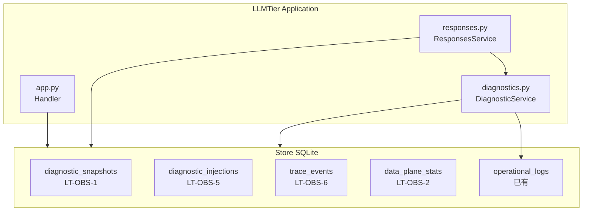
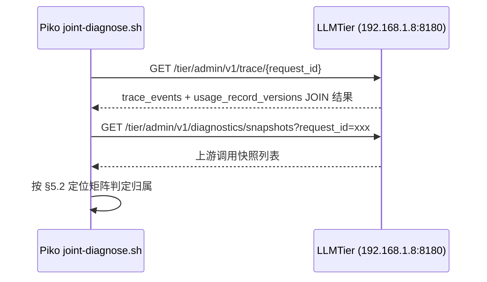
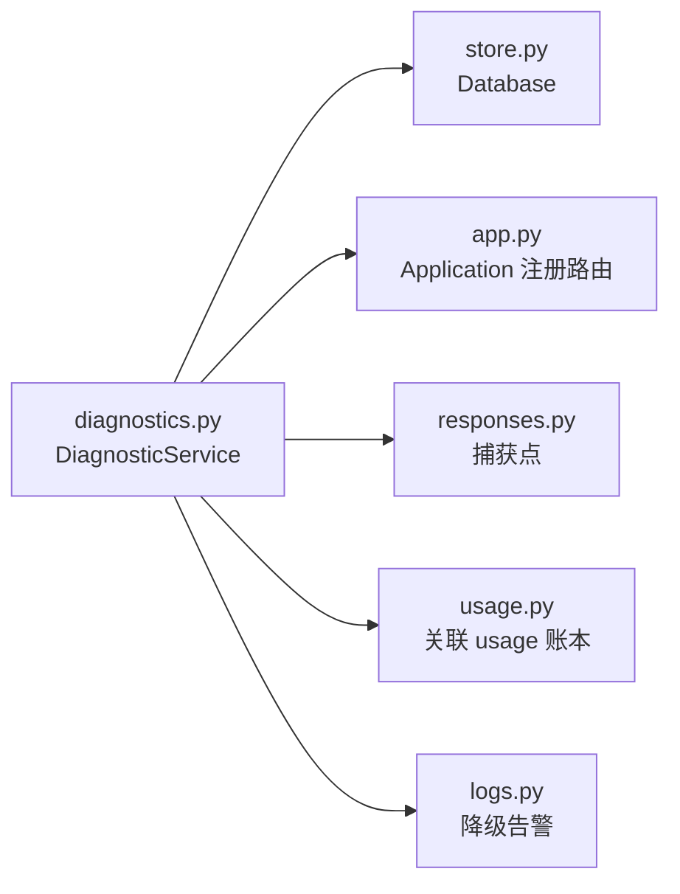

# LLMTier 可观测性与调试子系统系统设计

> STD 使用入口：[项目采用说明与标准导航](../../README.md#std-entry)

| 文档字段 | 值 |
|---|---|
| Document ID | `llmtier-observability-subsystem-design-v0.1` |
| Document Version | `0.1.0-draft.5` |
| Status | `Draft` |
| Project | `LLMTier` |
| Authority | `LLMTier` |
| Document Owner | LLMTier |
| Authors | llmtier |
| Created Date | `2026-09-22` |
| Last Modified Date | `2026-09-22` |
| Reviewer | Piko联调方 |
| Approver | |
| Approval Date | |
| Template ID | `design.subsystem` |
| Template Version | `0.1.1` |
| Template Conformance | `tailored` |
| Tailoring Reference | std-tailoring |

## 1. 背景与目标

### 1.1 背景

Piko ↔ LLMTier 首次联合调试（见 `piko-llmtier-joint-report-v0.1` §5.2）暴露出跨服务失败时**层位定位能力不足**。LLMTier 当前缺乏：
- 上游调用的环回快照（LT-OBS-1）
- 数据面统计（LT-OBS-2）
- 故障注入能力（LT-OBS-5）
- 单请求 trace 查询（LT-OBS-6 trace）
- Consumer 关联标识透传（LT-OBS-7）

### 1.2 Piko 联调环境

| 项 | 值 |
|---|---|
| LLMTier joint | `192.168.1.8:8180` |
| Piko joint | `127.0.0.1:8788` |
| admin token | `~/piko-secrets/llmtier-joint-admin-token` |
| data token | `~/piko-secrets/llmtier-joint-data-token` |
| consumer 证据 | `x-request-id` == usage 账本 `request_id` |
| Piko 定位工具 | `piko/scripts/joint-diagnose.sh <run_id>` |

### 1.3 目标

实现一个轻量、可插拔的**可观测性子系统**（`diagnostics`），提供：
- 上游快照捕获（LT-OBS-1）
- 数据面聚合统计（LT-OBS-2）
- 运行时故障注入开关（LT-OBS-5）
- 单请求全链路 trace（LT-OBS-6）
- Consumer 关联标识透传（LT-OBS-7）

### 1.3 设计约束

1. **开关控制**：所有捕获默认关闭，关闭时零开销
2. **数据安全**：不记录 Provider Secret、consumer credential、完整 prompt/输出正文
3. **非阻塞**：捕获写入不得阻塞推理路径（异步/尽力而为）
4. **fail-open**：观测子系统故障不得影响 Data Plane 可用性

---

## 2. 架构概览

### 2.1 子系统边界



### 2.2 新增模块

| 模块 | 文件 | 职责 |
|---|---|---|
| `DiagnosticService` | `diagnostics.py` | 快照捕获、统计聚合、注入控制、trace 查询 |
| `DiagnosticSnapshot` | `diagnostics.py` | 快照数据结构 |
| `DiagnosticInjection` | `diagnostics.py` | 注入配置数据结构 |

### 2.3 新增数据库表

| 表 | 用途 | 关联 |
|---|---|---|
| `diagnostic_snapshots` | LT-OBS-1 上游快照 | FK → `usage_record_versions` |
| `diagnostic_injections` | LT-OBS-5 注入配置 | FK → `deployments` |
| `data_plane_stats` | LT-OBS-2 统计聚合 | 无 |
| `trace_events` | LT-OBS-6 trace 事件 | 无 |

---

## 3. 数据模型

### 3.1 `diagnostic_snapshots`（LT-OBS-1）

```sql
CREATE TABLE diagnostic_snapshots (
    id              TEXT PRIMARY KEY,        -- "snap_{uuid}"
    request_id      TEXT NOT NULL,           -- 普通列（可关联 usage_record_versions.request_id，非 FK）
    captured_at     TEXT NOT NULL,           -- ISO 8601 时间戳

    -- 上游信息
    upstream_url    TEXT NOT NULL,           -- 完整上游 URL（不含 Query String）
    backend_model   TEXT,                    -- upstream 返回的 model 名
    http_status     INTEGER,                 -- HTTP 状态码
    latency_ms      REAL,                    -- 上游时延（ms）
    error_summary   TEXT,                    -- 错误体摘要（UTF-8 安全截断 256 字节）

    -- 请求信息
    model           TEXT,                    -- 请求的 model
    deployment_id   TEXT,                    -- 路由到的 deployment

    -- 元数据
    snapshot_type   TEXT DEFAULT 'upstream'  -- 'upstream' | 'error'
);
```

**说明：**
- `request_id` **非 FK**（快照生命周期独立于账本；注入/失败请求可能无 usage 记录）
- 索引保留用于查询：
```sql
CREATE INDEX idx_snapshots_request_id ON diagnostic_snapshots(request_id);
CREATE INDEX idx_snapshots_captured_at ON diagnostic_snapshots(captured_at);
```

### 3.2 `diagnostic_injections`（LT-OBS-5）

```sql
CREATE TABLE diagnostic_injections (
    id              TEXT PRIMARY KEY,        -- "inj_{uuid}"
    deployment_id   TEXT NOT NULL,           -- FK → deployments.id
    injection_type  TEXT NOT NULL,           -- 'fault_502'|'fault_503'|'delay'|'rate_limit'|'stream_terminate'|'malformed_event'

    -- 配置列（按 type 共用列，JSON 仅用于日志/审计）
    fault_status    INTEGER,                 -- fault_502/503 时：502 或 503
    fault_body      TEXT,                    -- fault_502/503 时：错误体内容（截断 512 字节）
    delay_ms        INTEGER,                 -- delay 时：延迟毫秒数
    retry_after_sec INTEGER,                 -- rate_limit 时：Retry-After 秒数
    stream_terminate_after_events INTEGER,   -- stream_terminate 时：发送多少事件后断连
    malformed_after_events INTEGER,          -- malformed_event 时：在多少事件后注入畸形事件
    malformed_event_type TEXT,               -- malformed_event 时：畸形事件类型（如 'invalid_json'）
    config_json     TEXT NOT NULL,           -- 原始 JSON（用于日志/审计）

    -- 开关状态
    enabled         INTEGER NOT NULL DEFAULT 0,  -- 0=关闭, 1=开启

    created_at      TEXT NOT NULL,
    updated_at      TEXT NOT NULL,

    UNIQUE(deployment_id, injection_type),
    FOREIGN KEY (deployment_id) REFERENCES deployments(id) ON DELETE CASCADE
);
```

**类型说明：**

| type | 关键配置列 | 说明 |
|---|---|---|
| `fault_502` | `fault_status=502`, `fault_body` | 返回指定错误体 |
| `fault_503` | `fault_status=503`, `fault_body` | 返回指定错误体 |
| `delay` | `delay_ms` | 上游响应前延迟 N ms |
| `rate_limit` | `retry_after_sec` | 返回 429 + Retry-After |
| `stream_terminate` | `stream_terminate_after_events` | SSE 发 N 个事件后断连 |
| `malformed_event` | `malformed_after_events`, `malformed_event_type` | 在第 N 个事件后注入畸形事件 |

### 3.3 `data_plane_stats`（LT-OBS-2）

```sql
CREATE TABLE data_plane_stats (
    id              TEXT PRIMARY KEY,        -- "stat_{deployment_id}_{model}_{stat_hour}"
    deployment_id   TEXT,                   -- NULL 表示全局
    model           TEXT,                   -- NULL 表示全局
    stat_hour       TEXT NOT NULL,          -- ISO hour (YYYY-MM-DDTHH)

    -- 计数（按 status 分类）
    request_count   INTEGER NOT NULL DEFAULT 0,
    error_4xx_count INTEGER NOT NULL DEFAULT 0,  -- HTTP 400-499
    error_5xx_count INTEGER NOT NULL DEFAULT 0,  -- HTTP 500+

    -- 时延（毫秒）— 用于计算 P50/P95
    latency_p50_ms  REAL,                   -- 直接存储计算结果
    latency_p95_ms  REAL,
    latency_min_ms  REAL,
    latency_max_ms  REAL,
    latency_sum_ms  REAL NOT NULL DEFAULT 0, -- 用于计算平均值

    created_at      TEXT NOT NULL,
    updated_at      TEXT NOT NULL
);

CREATE INDEX idx_stats_deployment_model ON data_plane_stats(deployment_id, model, stat_hour);
CREATE INDEX idx_stats_stat_hour ON data_plane_stats(stat_hour);
```

**error_count 口径：**
- `error_4xx_count`：HTTP status 400-499（客户端错误）
- `error_5xx_count`：HTTP status ≥500（服务端错误，含上游失败/注入产生的错误）
- `error_count`（汇总）：查询时计算 `error_4xx_count + error_5xx_count`

### 3.4 `trace_events`（LT-OBS-6 trace）

```sql
CREATE TABLE trace_events (
    id              TEXT PRIMARY KEY,        -- "tev_{uuid}"
    request_id      TEXT NOT NULL,

    -- 阶段
    stage           TEXT NOT NULL,           -- 'received'|'validated'|'routed'|'upstream_started'|'upstream_ended'|'completed'|'error'|'aborted'
    stage_timestamp TEXT NOT NULL,           -- ISO 8601

    -- 阶段详情
    detail          TEXT,                    -- JSON 详情（如路由结果、上游快照引用）

    -- Consumer 标识
    correlation_id  TEXT,                    -- X-Correlation-ID 或 traceparent

    created_at      TEXT NOT NULL
);

CREATE INDEX idx_trace_request_id ON trace_events(request_id);
CREATE INDEX idx_trace_correlation_id ON trace_events(correlation_id);
```

---

## 4. 功能设计

### 4.1 LT-OBS-1：环回捕获

**触发时机：**
- 调试开关开启时，**每个** Data Plane 请求均捕获（无论成功/失败/注入）
- 调试开关关闭时，零开销（不写入）

**捕获内容：**
- 上游 URL（不含 Query String）
- `backend_model`（上游返回的实际模型名）
- HTTP status code
- latency_ms（`upstream_ended - upstream_started`）
- error_summary（仅错误时，UTF-8 安全截断 256 字节）

**存储策略：**
- **尽力而为同步写入**：直接写入 `diagnostic_snapshots` 表（SQLite WAL 模式，写入 P99 < 5ms）
- **fail-open**：写入失败时记录 warning 到 `operational_logs`（module=`diagnostics`），不抛异常，不阻塞推理流
- 保留期：7 天（TTL cleanup job，与 `operational_logs` 对齐）

**开关控制：**
- `DiagnosticService.snapshots_enabled()` 查询全局开关（从 settings 或 `diagnostic_injections` 表读取）
- 写入前检查：`if not self.snapshots_enabled(): return`

**URL 脱敏：**
- `upstream_url` 记录完整 URL，但移除 query string（provider API key 在 `secret_ref` 文件中，不在 query string）
- 若 URL 包含敏感信息（暂未发现），额外截断处理

### 4.2 LT-OBS-2：数据面统计

**聚合维度：**
- 统计粒度：**小时**（`stat_hour = YYYY-MM-DDTHH`）
- 维度：`deployment_id` + `model` + `http_status`（HTTP status 400-499 / 500+ 分别计数）

**聚合方式：**
- 每次 Data Plane 请求完成后，将 latency 追加到内存缓存（`defaultdict` 按 `(deployment_id, model, stat_hour)` 索引）
- **实时查询**：在内存中计算 P50/P95（基于缓存的原始时延列表）
- **持久化**：每小时结束时对列表排序计算 P50/P95，UPSERT 到 `data_plane_stats`
- **对账说明**：统计仅作参考，对账以 `usage_record_versions` 账本为准（统计进程崩溃最多丢 ≤1 小时数据）

**内存缓存策略：**
- TTL：1 小时（小时结束后再保留 1 小时用于跨小时查询）
- 淘汰：LRU，max 100000 条记录
- fail-open：缓存满或初始化失败时，记录 warning 并继续运行（不影响 Data Plane）

**查询接口：**
- `GET /tier/admin/v1/diagnostics/stats?since=2026-09-22T00:00:00Z&until=2026-09-22T23:59:59Z&deployment_id=xxx&model=Worker`
- 返回：request_count、error_4xx_count、error_5xx_count、P50/P95/min/max
- 时间窗外优先查 `data_plane_stats` 表，小时内查内存缓存

### 4.3 LT-OBS-5：故障注入开关

**5 种子类型（按实现难度排序）：**

| 类型 | 配置参数 | 生效位置 | 难度 |
|---|---|---|---|
| `delay` | `{"delay_ms": N}` | `Router.admit()` 后、实际调用前 | 低 |
| `rate_limit` | `{"retry_after_seconds": N}` | 同上 | 低 |
| `fault_502` | `{"error_body": "..."}` | 同上 | 中 |
| `fault_503` | `{"error_body": "..."}` | 同上 | 中 |
| `stream_terminate` | `{"events_before_terminate": N}` | SSE 输出流中 | **高** |
| `malformed_event` | `{"event_type": "malformed", "after_events": N}` | SSE 输出流中 | **高** |

**实现说明：**
- **低/中难度**（Phase 5a）：在 `Router.admit()` 成功返回候选者后、实际调用 `adapter.complete()` 前，根据注入配置决定：直接返回错误响应（fault/rate_limit）或 sleep 延迟（delay）
- **高难度**（Phase 5b）：SSE 流注入需要在 `SSEmitter.put()` 中加入注入检查点，**侵入 `sse.py` 模块**。实现方案：给 `SSEmitter` 添加 `injection_config` 参数，在每次 `put()` 前检查是否到达注入触发点。建议 Phase 5b 单独实施，充分测试后再合入。

**管理接口：**
```
PATCH /tier/admin/v1/deployments/{id}/diagnostics
Authorization: Bearer {admin_token}

{
  "injections": [
    {"type": "delay", "config": {"delay_ms": 500}, "enabled": true}
  ]
}
```

**查询接口：**
```
GET /tier/admin/v1/deployments/{id}/diagnostics
```

**账本标注：**
- 注入流量在 `usage_record_versions.source` 标注 `injected`
- 不影响正常 usage 计量

**幂等性：**
- 多次 PATCH 相同 deployment 以最后一次为准
- 删除某注入：将 `enabled` 设为 `false` 或删除该 type

**日志与审计：**
- 注入配置启停：写入 `audit_events`（action=`diagnostics.injection_enabled` / `diagnostics.injection_disabled`）
- 注入事件触发：写入 `operational_logs`（module=`diagnostics`）
- 在 `DiagnosticService` 初始化时注册：`logs.py` 的 `MODULE_KEYS` 需包含 `'diagnostics'`

### 4.4 LT-OBS-6 trace 查询

**记录时机（逐阶段）：**

| 阶段 | 记录位置 | 内容 |
|---|---|---|
| `received` | `BaseHandler._run()` | 接收时间、**白名单 headers**（`X-Correlation-ID`、`traceparent`、`content-type`、`content-length`） |
| `validated` | `ResponsesService.create()` | 校验结果 |
| `routed` | `Router.admit()` | 选中的 deployment/provider |
| `upstream_started` | `adapter.complete()` 前 | 上游调用开始时间 |
| `upstream_ended` | `adapter.complete()` 后 | 上游响应状态、快照 ID |
| `completed`/`error`/`aborted` | SSE 流结束后 | 终止原因 |

**查询接口：**
```
GET /tier/admin/v1/trace/{request_id}
Authorization: Bearer {admin_token}
```

**返回结构：**
```json
{
  "request_id": "req_xxx",
  "correlation_id": "corr_xxx",
  "stages": [
    {"stage": "received", "timestamp": "...", "detail": {...}},
    {"stage": "validated", "timestamp": "...", "detail": {...}},
    {"stage": "routed", "timestamp": "...", "detail": {"deployment_id": "..."}},
    {"stage": "upstream_started", "timestamp": "..."},
    {"stage": "upstream_ended", "timestamp": "...", "snapshot": {...}},
    {"stage": "completed", "timestamp": "...", "detail": {"reason": "stream_end"}}
  ],
  "usage": {
    "record_version": 1,
    "is_final": true,
    "model": "...",
    "input_tokens": 100,
    "output_tokens": 200
  }
}
```

**写入顺序保证：**
- `trace_events` 先写入（同步）
- `diagnostic_snapshots` 后写入（尽力而为同步）
- 查询时若 snapshot 尚未写入，`stages[].snapshot` 为 `null`（不等待）

### 4.5 LT-OBS-3：Audit 语义明示

**需求**：管理控制文档中明示 audit 覆盖范围（当前仅管理面动作，数据面请求不产生 audit 事件）

**本设计行动**：
- 在 `docs/10_requirements/llmtier-observability-debug-requirements-v0.1.md` 中 §4 表格增加 audit 覆盖说明脚注
- `audit_events` 表不新增数据面事件（LT-OBS-3 是文档澄清，非代码实现）
- 实现计划（§8）列入文档任务

### 4.6 LT-OBS-4：readyz 语义

**需求**：`readyz` 全局状态应反映**实际可用能力**，未启用对应部署的占位 service level 不得将全局状态降级为 `degraded`

**本设计行动**：
- `readyz` 全局 status 计算规则：
  - 扫描所有已启用（`enabled=true`）的 `deployments`
  - 若存在至少 1 个已启用 deployment，则全局 status 为 `ok`
  - 未启用部署在模型级标注 `unavailable`，不计入全局降级
- 在 `health.py` 的 `readiness_view()` 中调整计算逻辑
- 实现计划（§9）列入代码改动任务

### 4.7 LT-OBS-7：Consumer 关联标识透传

**提取规则（优先级）：**
1. `X-Correlation-ID` header
2. `traceparent` header (W3C Trace Context)
3. 缺失时自动生成 `request_id`

**存储：**
- `trace_events.correlation_id` 记录
- `usage_record_versions` 新增可选 `correlation_id` 字段（建议，暂无 schema migration）

**回显：**
- Data Plane 响应头：`X-Correlation-ID: {correlation_id}`
- 若由 LLMTier 生成，不回显（consumer 未提供）

---

## 5. 三方定位场景（Piko 联调用）

### 5.1 LLMTier 自身出问题 → 快速自定位

用途链：**LT-OBS-2 统计**（错误率/时延异常先被发现）→ **LT-OBS-6 trace**（按 request_id 看单请求全生命周期与逐跳时间戳）→ **LT-OBS-1 上游快照**（上游交互定格）→ **LT-OBS-5 注入开关**（修复后在同类故障下复现验证）→ logs/audit 佐证。

### 5.2 联调失败 → 快速定位是 Piko / LLMTier / oMLX 哪一层

| 症状（consumer 视角） | LLMTier 侧证据（LT-OBS-1/2/6） | 归属判定 |
|---|---|---|
| `Failed/ModelUnavailable` + B 窗口内有 5xx/上游错误快照 | 上游调用快照可见失败 | **oMLX**（或 B→C 网络） |
| `Failed/ModelUnavailable` + B 窗口内**无任何**该请求记录 | 请求未到 B | **网络 / B 未启动**（B 侧） |
| B logs 出现 400/404 校验拒绝 | 请求被 B 校验拒绝 | 请求形状问题：对照 Piko 会话 JSONL 判 **Piko 装配**；形状合法 → **B 校验过严** |
| B 返回 200 但 consumer 解析 SSE 失败/流异常 | B 侧响应体/流快照异常 | **LLMTier 内部**（序列化/流处理） |
| `Failed/ToolFailure`、`Budget/Deadline`、`UnsafeRetryBlocked` | Piko 自身语义 | **Piko** |

**逐阶段时间戳**：`received/validated/routed/upstream_started/upstream_ended/completed|error|aborted` 使每跳时延可计算。

### 5.3 Piko joint-diagnose.sh 工具



Piko 的 `joint-diagnose.sh <run_id>` 脚本通过 `x-request-id` 调用：
- `GET /tier/admin/v1/trace/{request_id}` — 全生命周期 trace
- `GET /tier/admin/v1/diagnostics/snapshots?request_id={request_id}` — 上游快照

---

## 6. 接口设计

### 5.1 管理面路由

| 路由 | 方法 | 描述 |
|---|---|---|
| `GET /tier/admin/v1/diagnostics` | GET, PATCH | **全局调试开关**（LT-OBS-1 快照总开关、LT-OBS-2 统计开关） |
| `GET /tier/admin/v1/diagnostics/snapshots` | GET | LT-OBS-1 快照查询（分页） |
| `GET /tier/admin/v1/diagnostics/stats` | GET | LT-OBS-2 统计查询 |
| `GET /tier/admin/v1/deployments/{id}/diagnostics` | GET, PATCH | LT-OBS-5 注入配置管理 |
| `GET /tier/admin/v1/trace/{request_id}` | GET | LT-OBS-6 trace 查询 |

### 5.2 全局调试开关接口

```
GET /tier/admin/v1/diagnostics
  → 返回 {"snapshots_enabled": true/false, "stats_enabled": true/false}

PATCH /tier/admin/v1/diagnostics
  Authorization: Bearer {admin_token}

  {"snapshots_enabled": true, "stats_enabled": true}

  → 返回更新后的状态
```

**说明：**
- 开关状态存储在 `settings` 的 `diagnostics` 节（或独立小表）
- `snapshots_enabled`：控制 LT-OBS-1 快照捕获（默认 `false`）
- `stats_enabled`：控制 LT-OBS-2 统计聚合（默认 `false`）
- Piko 联调脚本可通过此接口开关调试

### 5.3 快照/trace 查询分页

所有列表查询支持 cursor-based 分页：

```
GET /tier/admin/v1/diagnostics/snapshots?limit=50&cursor=snap_xxx
```

**响应结构：**
```json
{
  "items": [...],
  "next_cursor": "snap_xxx",
  "has_more": true
}
```

- `cursor` 为上一页最后一条的 `id`
- `has_more=false` 时 `next_cursor` 为 null
- 最大 `limit=500`，默认 `50`

### 5.4 快照查询接口

```
GET /tier/admin/v1/diagnostics/snapshots
  ?since=2026-09-22T00:00:00Z
  &until=2026-09-22T23:59:59Z
  &deployment_id=dep_xxx
  &model=Worker
  &limit=100
  &cursor=...
```

### 5.5 统计查询接口

```
GET /tier/admin/v1/diagnostics/stats
  ?since=2026-09-22T00:00:00Z
  &until=2026-09-22T23:59:59Z
  &deployment_id=dep_xxx
  &model=Worker
```

### 5.6 注入配置管理接口

```
GET /tier/admin/v1/deployments/{id}/diagnostics
  → 返回该 deployment 所有注入配置

PATCH /tier/admin/v1/deployments/{id}/diagnostics
  Authorization: Bearer {admin_token}

  [
    {"type": "delay", "config": {"delay_ms": 500}, "enabled": true},
    {"type": "fault_502", "config": {"error_body": "backend error"}, "enabled": false}
  ]

  → 部分更新：列表中有该 type 则 upsert，无该 type 则保持现状
```

### 5.7 trace 查询接口

```
GET /tier/admin/v1/trace/{request_id}
  Authorization: Bearer {admin_token}
```

---

## 7. 安全与隐私

### 6.1 禁止记录

- Provider Secret（`secret_ref` 内容）
- Consumer Bearer Token
- 完整 Prompt / 输出正文
- `X-Correlation-ID` / `traceparent` 以外的业务敏感 header

### 6.2 允许记录

- 请求/响应长度（字节）
- 长度哈希（SHA-256 前 16 字符）
- 截断摘要（前 256 字节）
- `backend_model`、`http_status`、`latency_ms`

### 6.3 访问控制

- 所有诊断接口需 `admin` 角色 Bearer Token
- 遵循既有 `Etag` 约定（防止并发覆盖）

---

## 8. 性能与容量

### 7.1 容量估算

假设：
- Data Plane QPS：100 req/s（ops 参数，实际按需配置）
- 快照捕获率：100%（开关开启时全量）
- 平均每个快照：~1 KB
- 保留期：7 天

存储：100 × 86400 × 7 × 1 KB ≈ 60 GB（可接受，建议监控磁盘并设置告警阈值）

### 7.2 性能目标

| 场景 | 目标 |
|---|---|
| 快照写入延迟 | P99 < 5 ms（异步，不阻塞推理） |
| 统计查询延迟 | P99 < 500 ms |
| trace 查询延迟 | P99 < 200 ms |
| 注入开关切换 | < 100 ms 生效 |

### 7.3 降级策略

- `DiagnosticService` 初始化失败 → 记录 warning，继续运行，Data Plane 不受影响（fail-open）
- 磁盘空间不足 → 停止快照写入，记录 error，不阻塞推理

---

## 9. 实现计划

### 8.1 Phase 1：基础设施

1. 创建 `diagnostics.py` 模块骨架（`DiagnosticService` 类 + 各数据结构）
2. 添加数据库 migration（4 个新表 + `operational_logs` 新增 `module='diagnostics'`）
3. 在 `Application.__init__` 中创建 `DiagnosticService` 实例
4. 注册管理面诊断路由
5. **Review 输出**：模块设计文档

### 8.2 Phase 2：LT-OBS-6 trace

1. 在 `trace_events` 表添加 retention cleanup job（TTL 7 天）
2. 实现 `trace_events` 记录（`BaseHandler._run()` 记录 `received`/`validated`，`Router.admit()` 记录 `routed`，`adapter.complete()` 记录 `upstream_started`/`upstream_ended`）
3. 实现 `GET /tier/admin/v1/trace/{request_id}`（查询时 JOIN `usage_record_versions` 获取 usage 数据）
4. **Review 输出**：trace 功能实现说明

### 8.3 Phase 3：LT-OBS-1 快照

1. 实现 `diagnostic_snapshots` 写入（尽力而为同步写入，失败记录 warning 不阻塞推理）
2. 实现 `GET /tier/admin/v1/diagnostics/snapshots`（分页查询，limit/cursor）
3. **Review 输出**：快照功能实现说明

### 8.4 Phase 4：LT-OBS-2 统计

1. 实现内存时延缓存（`defaultdict` + LRU TTL）
2. 实现 `data_plane_stats` 持久化（每小时 UPSERT）
3. 实现 `GET /tier/admin/v1/diagnostics/stats`（跨表查询 + 内存缓存合并）
4. **Review 输出**：统计功能实现说明

### 8.5 Phase 5：LT-OBS-5 注入（分两阶段）

**Phase 5a（低/中难度，优先实施）：**
1. 实现 `diagnostic_injections` CRUD（`GET/PATCH /tier/admin/v1/deployments/{id}/diagnostics`）
2. 实现 `delay`、`rate_limit`、`fault_502`、`fault_503` 注入逻辑（在 `Router.admit()` 成功后、调用 `adapter.complete()` 前拦截）
3. `usage_record_versions.source` 增加 `'injected'` 枚举值（需 migration）

**Phase 5b（高难度，最后实施）：**
1. 改造 `SSEmitter`（`sse.py`）添加注入检查点
2. 实现 `stream_terminate`、`malformed_event` 注入逻辑
3. 充分测试后合入
4. **Review 输出**：流注入实现说明

### 8.6 Phase 6：LT-OBS-7

1. 在 `BaseHandler._dispatch()` 提取 `X-Correlation-ID`（优先）或 `traceparent`（W3C Trace Context）
2. 透传到 `trace_events.correlation_id`（已在 trace_events 表设计中包含）
3. Data Plane 响应头回显 `X-Correlation-ID`（若 consumer 提供）
4. ~~`usage_record_versions` 新增 `correlation_id` 字段~~（**已确认：暂不加**，Piko 已用 `x-request-id` 关联）
5. **Review 输出**：LT-OBS-7 实现说明

### 8.7 文档任务（不阻塞开工）

- LT-OBS-3：在需求文档 `llmtier-observability-debug-requirements-v0.1.md` §4 表格添加 audit 覆盖脚注
- LT-OBS-4：在 `health.py` 调整 `readyz` 全局 status 计算逻辑（已启用 deployment 才计入全局状态）

---

## 10. 依赖关系



---

## 11. 关键决策与待确认事项

### 10.1 已确认决策

| 决策 | 结论 | 依据 |
|---|---|---|
| LT-OBS-2 统计粒度 | **小时** | 更灵活支持时间窗查询 |
| trace 保留期 | **7 天**（与 logs 对齐） | 需求文档 §8 |
| 流注入实现 | **Phase 5a 先做 delay/fault/rate_limit，Phase 5b 再做 SSE 流注入** | SSE 注入侵入 `sse.py`，需单独 review |
| `diagnostic_injections` 配置存储 | **拆列**（不存储 JSON） | 便于 SQL 查询 |
| `diagnostic_injections` 唯一性 | **UNIQUE(deployment_id, injection_type)** | 防止同一 deployment 同一 type 重复 |
| `error_summary` 截断 | **UTF-8 安全字节截断 256 字节** | piko review 接受 |
| `data_plane_stats` 内存缓存 LRU 上限 | **100000 条** | piko review 接受 |
| `usage_record_versions.correlation_id` | **暂不添加** | piko review：Piko 已用 `x-request-id` 关联 |

### 10.2 待确认事项

1. **Phase 5b SSE 注入改造方案**：
   - 方案 A：给 `SSEmitter.put()` 添加 `injection_check()` 回调
   - 方案 B：改造 `ResponsesService.create()` 在 SSE 循环中插入注入检查点
   - **请选择 A 或 B**（piko 明确不接受 C = wontfix）

---

## 12. 参考

- [LLMTier 可观测性与调试能力需求](../10_requirements/llmtier-observability-debug-requirements-v0.1.md) — LT-OBS-1..7 需求原文
- [HANDOFF-Piko-Joint-OBS.md](../../HANDOFF-Piko-Joint-OBS.md) — Piko 联调输入，含三方定位矩阵与验收流程
- `src/llmtier_v03/app.py` — 现有 HTTP Handler 结构
- `src/llmtier_v03/store.py` — 数据库 Store 实现
- `src/llmtier_v03/usage.py` — UsageRecorder 参考
- `src/llmtier_v03/responses.py` — Data Plane 响应流处理
