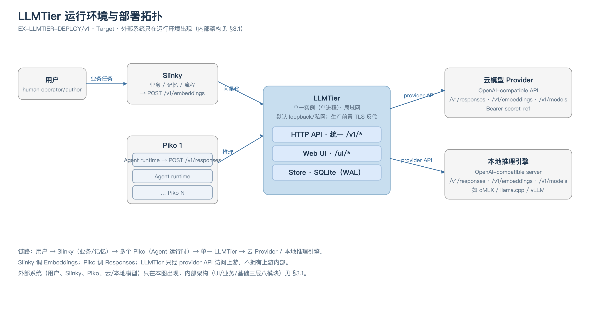
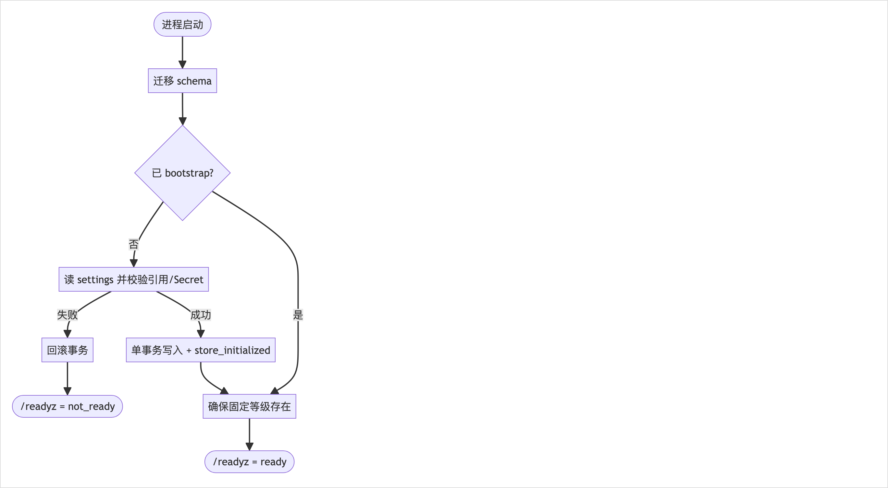
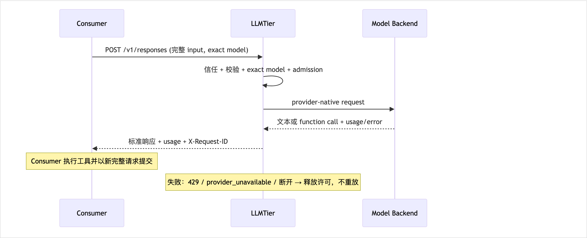
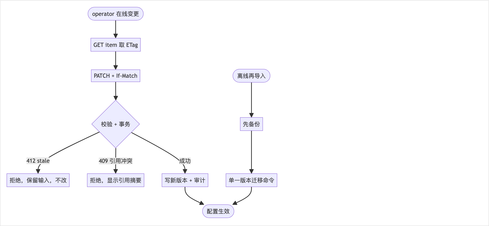
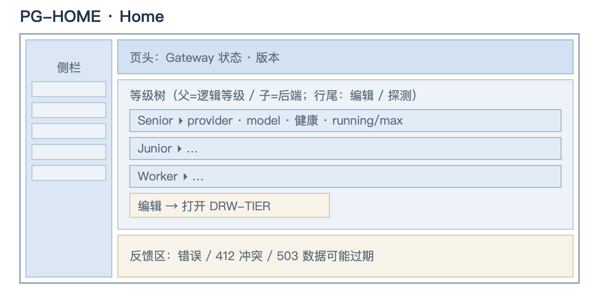
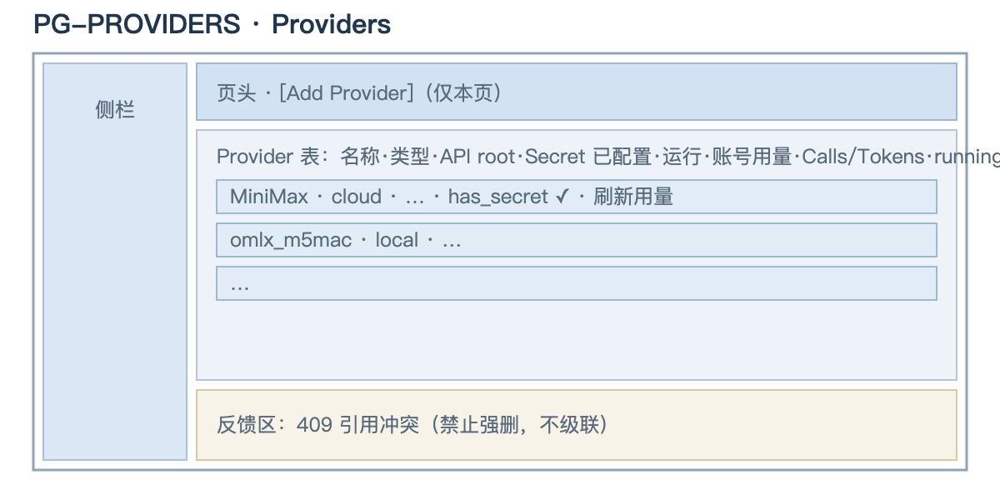
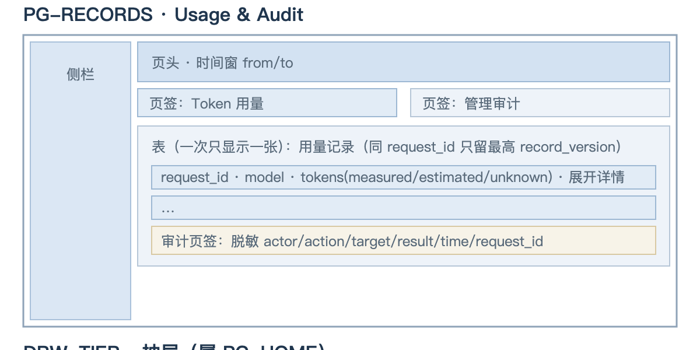
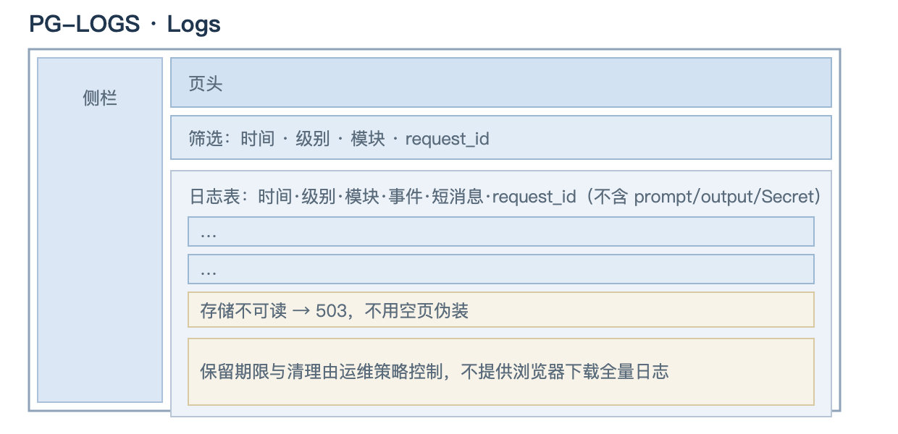
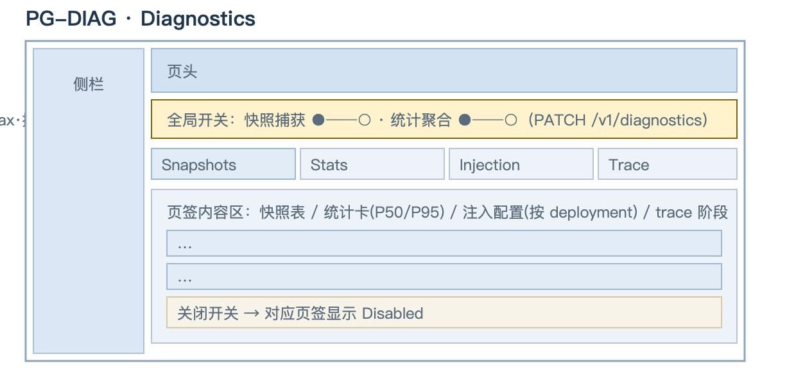
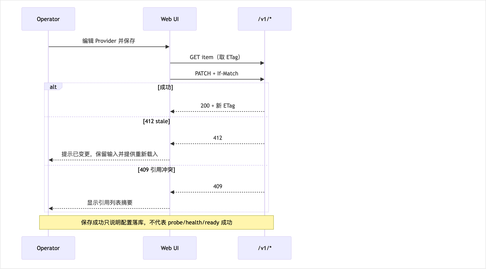

<!-- STD_DOCUMENT_COVER_BEGIN -->
# LLMTier 软件系统设计

> STD 使用入口：[项目采用说明与标准导航](../../README.md#std-entry)

| 文档字段 | 值 |
|---|---|
| Document ID | `llmtier-system-design` |
| Document Version | `0.5.0-draft.1` |
| Status | `In Review` |
| Project | `LLMTier` |
| Authority | `LLMTier` |
| Document Owner | LLMTier |
| Authors | llmtier |
| Reviewer | Piko、Slinky、LLMTier |
| Approver | LLMTier |
| Approval Date | 待定 |
| Created Date | `2026-09-06` |
| Last Modified Date | `2026-09-25` |
| Template Version | `2.0.0` |
| Template ID | `design.software-system` |
| Template Conformance | `tailored` |
| Tailoring Reference | `std-tailoring` |
| Migration Map Reference | none |
| Repository | `corezilla/LLMTier` |
| Canonical Path | `docs/20_system_design/llmtier-system-design.md` |
| Supersedes | `docs/30_subsystem_design/llmtier-service-design.md` |
<!-- STD_DOCUMENT_COVER_END -->

## 1. 文档说明

本文定义 LLMTier 作为纯软件、单进程、单服务的模型网关的完整软件设计：从产品用途到整体软件架构、运行组织与验收。字段级 authority 是 `interfaces/openapi/llmtier.openapi.json`；能力状态由 compatibility manifest 给出，始终保持 `runtime_activation=false`，直到实现与运行门禁另行批准。

本次设计以主流机制优先：没有已确认特殊需求时采用标准 OpenAI-compatible 请求/响应，不增加自定义 header、恢复端点、调用方层级、会话状态机或并行兼容路径。本文是设计，不表示目标接口已经实现或激活。

### 1.1 设计位置与上级承接

| 项 | 值 |
|---|---|
| 设计位置 | 纯软件项目顶层（`design_level=system`，`domain=software`） |
| 父对象 / 父 Document ID | 无（纯软件项目顶层，`parent_document_id` 为空） |
| 固定输入 | 已采用需求 `docs/10_requirements/llmtier-requirements.md` |
| 承担范围 | 产品用途、整体软件架构、运行组织、验收 |
| 不承担范围 | 硬件/FPGA（本系统不含）；跨系统容量/Seat（Slinky 所有）；Agent 会话状态（Piko 所有） |

## 2. 产品应用与设计目标

### 2.1 场景、用户入口与外部环境

LLMTier 部署在局域网，作为 Consumer 与模型后端之间的模型网关。三类使用入口：

| 使用入口 | 使用者 | 用途 |
|---|---|---|
| HTTP API（推理面） | Consumer（Piko 做推理、Slinky 做向量化） | 模型调用、向量化、模型目录、自身用量查询 |
| HTTP API（管理面） | Operator | 配置模型与等级、探测、审计与日志查询 |
| Web UI | Operator | 管理面控制台 |

外部环境：局域网内运行，默认绑定 loopback/内网；操作系统与本地或云端模型后端由部署环境提供。模型后端（含本地推理服务）是外部依赖，不属本系统设计范围。

### 2.2 目标、范围与可观察成功条件

| 目标 | 设计决定 | 可观察成功条件 |
|---|---|---|
| 标准模型调用 | `POST /v1/responses` 使用标准 SSE | Consumer 获得标准响应与 terminal Usage |
| 模型发现 | `GET /v1/models` 与 exact-case detail | 返回逻辑等级与能力，不暴露物理账号 |
| 向量化 | 标准 `POST /v1/embeddings` | 返回向量与 token Usage |
| 工具调用 | 模型可返回 function call | Piko 执行工具并在下一次完整请求带回 tool result |
| Usage | 响应内返回本次 token Usage；只读 `/tier/admin/v1/usage` 提供同一主体统一查询 | measured/estimated/unknown 可区分，unknown 不填零 |
| 自主管理 | 管理面 + Web UI 管理模型、等级、探测、Usage 与审计 | Operator 可自助完成配置与查询 |
| 运维 | 无副作用健康/就绪检查；有费用或改变状态的探测需授权 | `/healthz`、`/readyz` 可用 |

**不在范围**：Cost/账单；SourceInstance；外部容量 snapshot/shared pool/Seat/claim；自定义 Idempotency/Invocation/result recovery；跨系统 close/drain/release；专用 compatibility negotiation；调用方或业务会话管理页面。

### 2.3 关键功能与用户任务

LLMTier 提供的用户可见能力与边界如下；具体操作入口与交互契约见 §8.1（HTTP API）与 §8.4（CLI/WebUI）。

| 用例 | LLMTier 行为 | 非职责 |
|---|---|---|
| Consumer 请求推理 | 校验标准请求，按 exact model 路由，通过标准 SSE 返回文本/function call/terminal Usage/error | Agent 历史、工具执行、任务重试策略 |
| Consumer 请求 embedding | 校验输入和 embedding 模型，返回向量与 Usage | chunk、索引、检索、正式记忆写入 |
| Consumer 查询模型 | 返回逻辑等级、能力、上下文/输出限制和 availability | 项目选人或业务计划决策 |
| Consumer 查询 Usage | 返回 measured/estimated/unknown token 事实 | 金额、币种、定价、结算 |
| Operator 管理模型 | CRUD provider/deployment/逻辑等级，探测并审计 | 调用方、Session、SourceInstance 管理 |
| Operator 查询审计/日志 | 只读返回脱敏审计与运行日志 | mutation、原始日志、prompt/output/credential |
| 调试者观测 | 快照/统计/注入/trace 查询与开关切换 | 不改变推理行为 |

## 3. 系统概览

LLMTier 是无 Agent 会话状态的模型网关：调用方在每次请求中提交完成该次推理所需的全部输入；系统认证、校验、按 exact `model` 选择逻辑等级、调用已配置的云端或本地模型，并返回标准响应与 token Usage。

LLMTier 不保存或补齐 Agent 历史，不做上下文压缩，不执行工具，不拥有 Agent Session/Conversation，不理解 Project、IR、STD、Matrix room/topic，也不创建或匹配后端 KV identity。provider/local runtime 的 cache/KV 是后端内部实现。Piko 管理 Agent session、上下文、工具循环、模型调用与执行内重试；Slinky 管理业务任务、材料、记忆、流程和验收；Embedding 只提供向量化。

### 3.1 软件系统架构


[可编辑 SVG 源](../assets/diagrams/llmtier-architecture-container.svg)

图 A1｜EX-LLMTIER/v3 · Target · LLMTier v0.3.0-draft。本图表达 LLMTier 自身的静态层次与包含关系，**不**绘制外部系统（Consumer、模型后端见 §2.1/§5），也**不**表示进程或调用顺序（重要过程见 §6）。图中每个模块标注正式对象 ID（`M001`–`M008`），与 §3.2 登记表一致。

系统按职责分为三层、八个模块：

- **入口层（UI）**：`HTTP API`（M001）与 `Web UI`（M002）。HTTP API 是统一入口，承载全部接口；Web UI 是 operator 控制台，同源调用 HTTP API。
- **业务层（事务处理）**：`Inference`（M003）、`Management`（M004）、`Observability`（M005）。三者平级，承接入口请求，向下消费基础层能力。
- **基础层（通用能力）**：`libdiag`（M006）、`util`（M007）、`log`（M008）。打包被业务层共同依赖的通用能力。

**分层与依赖规则**：

1. 依赖只向下：入口层 → 业务层 → 基础层。
2. 同层模块不互相调用。
3. 入口层不直接调用基础层：调试开关等能力经 `Observability` 的业务接口暴露。
4. 基础层内部：`libdiag` 可依赖 `util`/`log`；`util`/`log` 不反向依赖 `libdiag`。

**为何这样划分**：

- 三个业务模块对应三类使用者（Consumer、Operator、调试者），接口边界互斥，各自有独立的入口集合。
- 把"被多方调用的通用能力"收敛为**一个基础库**，避免在业务模块内重复实现基础设施；调试能力尤其适合打包，因为 `Inference`（判定注入）、`Observability`（展现开关）和入口层（切换开关）都要用到同一份开关状态。
- 采用"能力提供者（基础层）"与"能力呈现者（业务层）"分离：调试开关由 `libdiag` **提供**，由 `Observability` **呈现与切换**；避免把基础能力误当作某个业务模块的私有物。

### 3.2 组成与职责

LLMTier 无软件子系统（`std-tailoring` LT-TL-003 / LT-TL-013），三层八模块均为**软件系统直属模块**，按 STD 软件设计对象编码规范使用 `M0` 段（`M001`–`M008`），父对象均为 LLMTier 软件系统。此处是本项目模块对象的**唯一登记表**：对象 ID / 名称 / 类型 / 直属父对象 / Document ID / 文件路径 / 状态在此维护，§4、系统机制设计 §14、模块设计与测试均引用同一编号，不另造清单。对象 ID 与文档 ID、章节号、代码符号解耦，移动或改名不重编号。

**入口层（UI）** — 承担用户交互与协议终止，不裁定业务规则。

| 对象 ID / 类型 / 父对象 | 职责 / 非职责 | 状态与资源 | 提供 / 消费接口 | Document ID / 文件名 / 状态 |
|---|---|---|---|---|
| M001 HTTP API / 直属模块 / LLMTier | 终止 HTTP/SSE；路由分发；局域网访问信任（内网放行；可选凭据仅作纵深，不建用户/会话/SSO）。非职责：不含业务规则；不直接访问持久化 | 请求级状态；无自有持久状态 | 提供：全部 `/v1/*` 接口与 SSE；消费：M003–M005 业务接口 | `http-api` / `docs/40_module_design/http-api-design.md` / 已采用（tailored）|
| M002 Web UI / 直属模块 / LLMTier | operator 控制台：展示与操作管理面。非职责：不直读配置或密钥；不承载推理 | 无自有持久状态 | 提供：浏览器页面；消费：M001（同源调用）| `web-ui` / `docs/40_module_design/web-ui-design.md` / 已采用（tailored）|

**业务层（事务处理）** — 承接入口请求，向下消费基础层能力；三模块平级、接口边界互斥。

| 对象 ID / 类型 / 父对象 | 职责 / 非职责 | 状态与资源 | 提供 / 消费接口 | Document ID / 文件名 / 状态 |
|---|---|---|---|---|
| M003 Inference / 直属模块 / LLMTier | 推理、向量化、模型目录：校验输入 → 按逻辑等级选择后端 → 调用 → 返回标准响应与 token Usage。非职责：配置管理；Agent 会话；工具执行 | 无自有持久状态（账本经 M007）| 提供：推理/向量化接口；消费：M004（配置读取）、M006（观测）、M007（存储）| `inference` / `docs/40_module_design/inference-design.md` / 已采用（tailored）|
| M004 Management / 直属模块 / LLMTier | 维护 provider / deployment / 逻辑等级配置；执行探测；提供审计与运行日志查询。非职责：不承载模型推理 | 配置权威（经 M007 持久化）| 提供：管理面接口；消费：M007（存储/审计）| `management` / `docs/40_module_design/management-design.md` / 已采用（tailored）|
| M005 Observability / 直属模块 / LLMTier | 观测数据的查询与呈现；调试开关的展现与切换；故障注入的配置入口（通过 M006）。非职责：不改变推理契约；自身故障 fail-open | 无自有持久状态（记录经 M006 / M007）| 提供：诊断接口；消费：M006（观测能力）、M007（存储）| `observability` / `docs/40_module_design/observability-design.md` / 已采用（tailored）|

**基础层（通用能力）** — 被业务层共同依赖；`libdiag` 可依赖 `util`/`log`，反向不允许。

| 对象 ID / 类型 / 父对象 | 职责 / 非职责 | 状态与资源 | 提供 / 消费接口 | Document ID / 文件名 / 状态 |
|---|---|---|---|---|
| M006 `libdiag` / 直属模块 / LLMTier | 调试开关、注入配置、观测记录（上游快照 / 数据面统计 / 单请求 trace）的底层读写。非职责：不呈现、不改推理契约 | 拥有观测记录、开关与注入配置 | 提供：诊断能力接口；消费：M007、M008 | `libdiag` / `docs/40_module_design/libdiag-design.md` / 已采用（tailored）|
| M007 `util` / 直属模块 / LLMTier | 配置、存储（唯一持久化）、访问信任、杂项工具。非职责：不含业务规则 | 拥有全部持久化数据的存取（配置、账本、审计、日志、观测）| 提供：存储/工具接口；消费：— | `util` / `docs/40_module_design/util-design.md` / 已采用（tailored）|
| M008 `log` / 直属模块 / LLMTier | 运行日志的记录、写入前脱敏与查询接口。非职责：持久化由 M007 承担 | 拥有日志语义；无独立持久化 | 提供：日志接口；消费：M007 | `log` / `docs/40_module_design/log-design.md` / 已采用（tailored）|

### 3.3 总体方案、选择依据与替代方案

| 决策点 | 选择 | 依据 | 已排除的替代方案 |
|---|---|---|---|
| 对外接口形态 | 单一 `/v1/*` 命名空间，资源由路径标识、权限由凭据标识 | 对外提供统一接口；符合主流网关实践 | 用路径前缀区分 consumer/operator（冗余且割裂） |
| 流式协议 | 标准 Responses SSE | 固定 Pi 调用方式实际消费此路径 | 并行 JSON 模式、自定义 fallback |
| 配置权威 | 初始化后 SQLite 唯一权威 | 避免双写与文件热载歧义 | settings 文件持续热加载 |
| 分层方式 | 入口层 / 业务层 / 基础层 | 依赖单向、能力归属清晰 | 按代码目录或技术组件分层 |

### 3.4 约束分配与下游保证

- `usage` 账本只追加不改写：同一 `request_id` 只保留最新 record version，未知不补零。下游模块设计须承接该语义。
- 所有接口同处 `/v1/*`；consumer 与 operator 由凭据区分。下游接口设计不得新增路径前缀。
- 观测子系统 fail-open：其故障不得使 `Inference` 失败。
- Provider Secret 只经引用解析，不进入普通响应、日志或 UI 回显。

### 3.5 机制清单与文档映射

| Mechanism ID / 用途 | 上级 Mechanism ID | 参与对象 / Process或Constraint | 前置依赖 | Document ID / 计划文件名 | Planned或实际基线 / 未决项 |
|---|---|---|---|---|---|
| M-TRUST / 访问信任：内网免登录 + 可选 Bearer 区分角色 | none | HTTP API (M001)、业务模块 (M003–M005)；C-TRUST-1..5 | — | `llmtier-access-trust-mechanism` / `mechanisms/access-trust.md` | 实际：成文（`0.1.0-draft.4`）|
| M-INFER / 推理与流式返回：校验→路由→准入→后端→SSE→终态 | none | HTTP API (M001)、Inference (M003)、Management (M004)；P-INFER；C-INFER-1..5 | M-TRUST（行为）| `llmtier-inference-stream-mechanism` / `mechanisms/inference-stream.md` | 实际：成文（`0.1.0-draft.4`）|
| M-METER / 用量计量与账本：义务/版本/head/unknown | none | Inference (M003)、Management (M004)、util (M007)；C-METER-1..5 | M-INFER（行为）| `llmtier-usage-metering-mechanism` / `mechanisms/usage-metering.md` | 实际：成文（`0.1.0-draft.4`）|
| M-CONFIG / 配置引导与变更：bootstrap → SQLite 权威 | none | HTTP API (M001)、Management (M004)、util (M007)；C-CFG-1..5 | — | `llmtier-config-lifecycle-mechanism` / `mechanisms/config-lifecycle.md` | 实际：成文（`0.1.0-draft.4`）|
| M-OBS / 上游快照、数据面统计、故障注入、单请求 trace、关联标识透传 | none | HTTP API (M001)、Inference (M003)、Observability (M005)、`libdiag` (M006)、util (M007)；C-OBS-1..5 | M-INFER（行为）| `llmtier-observability-mechanism` / `mechanisms/observability.md` | 实际：成文（`0.1.0-draft.4`）；流注入见 LT-OPEN-05 |

均为顶层机制（无设计分解上级）；`M-INFER` 依赖 `M-TRUST` 的行为，`M-METER`/`M-OBS` 依赖 `M-INFER` 的行为。Owner 均为 LLMTier。机制文档 `§14`（跨责任单元分解与接口分配）为下级模块设计的输入，模块设计以附录"机制承接表"逐条承接。

模块与实现设计入口：

- 模块设计（一模块一份，M001–M008 见 §3.2 登记表）：`docs/40_module_design/{http-api,web-ui,inference,management,observability,libdiag,util,log}-design.md`
- 实现设计：`docs/50_implementation_design/{http-api,web-ui,inference,management,observability,libdiag,util,log}.isd.md`

## 4. 子系统与直属模块概要设计

### 4.1 直属对象概要设计（按子系统或直属模块展开）

本系统不建立软件子系统；八个模块均为软件系统直属模块（`M001`–`M008`，登记见 §3.2）。

| 对象 | 输入 | 主要处理 | 输出 |
|---|---|---|---|
| HTTP API (M001) | HTTP/SSE 请求 | 信任判定 → 路由 → 边界校验 → 转发业务接口 | 标准响应 / SSE |
| Web UI (M002) | 浏览器操作 | 调用管理面接口并呈现 | 控制台页面 |
| Inference (M003) | 标准模型请求 | 校验 → 按 exact 等级路由 → 调用后端 → 归一响应与 Usage | 标准响应 + token Usage |
| Management (M004) | operator 配置命令 | 事务化更新配置、探测、审计落库 | 配置版本 + 审计事件 |
| Observability (M005) | 调试命令 / 观测查询 | 读观测记录、聚合、展现；切换开关 | 快照/统计/trace 视图 |
| `libdiag` (M006) | 上层调用 | 开关与注入配置读写、观测记录写入与读取 | 观测事实 |
| `util` (M007) | 上层调用 | 配置、持久化、信任判定 | 持久化事实 |
| `log` (M008) | 上层调用 | 脱敏后写入/读取日志 | 运行日志 |

详细的模块划分、职责与非职责见各模块设计文档（M001–M008，见 §3.2 登记表）。

## 5. 运行组织与部署设计

### 5.1 执行上下文、调度与并发

单进程、单节点运行。内部 admission 使用每个 deployment 一个许可的保守基线，每个 exact service level 使用最多 32 项的 FIFO 等待队列。调度只在 `enabled && healthy` 且能力匹配的 deployment 中选择当前 in-flight 最少者，相同时按 `service_level_deployments.ordinal`；不做跨等级或跨 embedding space fallback。队列已满立即返回 429；排队超过 30 秒仍无许可也返回 429，并返回保守的 `Retry-After`。

### 5.2 通信与跨实例协作

不提供跨实例协作或多节点一致性。所有状态由单一节点的持久化存储持有。

### 5.3 部署拓扑、资源与故障域



[可编辑 SVG 源](../assets/diagrams/diagram-deployment-topology.svg)

图 D1｜EX-LLMTIER-DEPLOY/v1 · Target。链路：**用户 → Slinky（业务/记忆）→ 多个 Piko（Agent 运行时）→ 单一 LLMTier → 云 Provider / 本地推理引擎**。外部系统（用户、Slinky、Piko、云/本地模型）**只在本图出现**；内部架构见 §3.1。

- **链序**：用户 → Slinky（业务/记忆）→ 多个 Piko（Agent 运行时）→ LLMTier。Slinky 驱动 Piko 的 Agent 任务；Piko 经局域网调用 LLMTier 的 Responses；Slinky 另可直调 Embeddings。
- **LLMTier 是单一实例**（单进程、单节点）；上图的多个 Piko 共享同一 LLMTier。
- **默认绑定 loopback/私网**；生产基线在其前置 TLS 反向代理（operator SSO），进程由 systemd 托管，SQLite 加密备份。
- **上游是外部依赖**：LLMTier 只经 provider API（OpenAI-compatible）访问云/本地模型，不拥有其内部实现。
- **故障域**：LLMTier 自身为单故障域；各 provider/本地引擎为独立外部故障域。provider 建连/首字节与 SSE 空闲超时分别固定 30 秒 / 60 秒；超时只结束本次 HTTP 调用，不创建可恢复 Invocation。

### 5.4 软件环境与依赖

**运行平台**：

| 项 | 值 |
|---|---|
| 操作系统 | Linux（生产单节点基线）或 macOS（开发/联调）；POSIX 文件系统 |
| 运行时 | Python ≥ 3.11（当前部署 3.14） |
| 进程托管 | systemd（生产）或前台进程（开发） |
| 网络 | 局域网；生产前置 TLS 反向代理 |

**对外/对上接口（LLMTier 作为客户端）**：

| 上游类型 | 接口 | 说明 |
|---|---|---|
| 云模型 Provider | OpenAI-compatible HTTP：`/v1/models`、`/v1/responses`、`/v1/embeddings` | 经 `provider.endpoint` 拼接；`Authorization: Bearer <secret>`，secret 由 `secret_ref` 解析（见 §9.2）|
| 本地推理引擎 | OpenAI-compatible HTTP：同上 | 例如 oMLX / llama.cpp server / vLLM 等暴露标准 `/v1/*` 的本地服务 |
| Provider 账号用量 | MiniMax Token Plan 官方 API（API Key）；火山 GetCodingPlanUsage（独立 OpenAPI AK/SK）| operator 显式刷新，不自动轮询 |

**软件依赖**：

| 依赖 | 用途 | 说明 |
|---|---|---|
| Python 标准库 | HTTP 服务（`http.server`）、SQLite（`sqlite3`）、HTTP 客户端（`urllib`）、TLS（`ssl`）、加密（`hmac`）、并发（`threading`）等 | **无第三方运行时依赖**（`pyproject.toml` `dependencies = []`）|
| SQLite | 唯一持久化 | stdlib `sqlite3`，WAL 模式；无需外部数据库服务 |
| `jsonschema`（可选，仅测试） | 契约与 fixture 校验 | 不进入运行时 |

**部署外部依赖**：TLS 证书与反向代理、operator SSO、systemd、备份/恢复工具、Secret 文件或 secret manager（见 §9.2）。以上由部署环境提供，不在 LLMTier 内部实现。

## 6. 重要过程

过程事实由服务端产生；状态事实的 Owner 是 LLMTier。过程总表逐项绑定机制与图号，正文保留端到端原理与代表失败。

| Process ID / 模式 | 触发 / 目标 | 统筹者 / 参与方 | 前提事实来源 | 阶段 / 结果可见点 | 失败及清理 / 机制引用 | 图号 / 正文位置 |
|---|---|---|---|---|---|---|
| P-BOOT 冷启动 | 进程启动 / 进入可接流量 | 入口层统筹；Management、util | settings 文件、SQLite | 迁移→bootstrap→固定等级→ready | bootstrap 失败 → 回滚 → not_ready | 图 P1 / §6.1；M-CONFIG |
| P-INFER 模型调用 | Consumer 请求 / 返回响应 + Usage | Inference 统筹；入口层、libdiag | 请求体、Registry | 校验→路由→准入→后端→SSE→终态 | 429 / 5xx / 断开 → 释放许可；M-INFER、M-METER、M-TRUST | 图 P2 / §6.2 |
| P-CONFIG 配置变更 | operator PATCH / 配置生效 | Management 统筹；util | ETag、Registry | 校验→事务→新版本→审计 | 412 stale / 409 引用 → 不改 | 图 P3 / §6.3；M-CONFIG |
| P-RESTART 停止/重启/恢复 | 运维动作 / 服务恢复 | 运维统筹；入口层 | 进程、SQLite | 停入口→在途退出→重启→ready→smoke | 未确认退出不重启 | 图 P4 / §6.4；M-CONFIG |

### 6.1 启动与就绪过程



[可编辑 SVG 源](../assets/diagrams/diagram-flow-startup.svg)

图 P1 · P-BOOT 冷启动。`/healthz` 只表示进程存活；`/readyz` 由 schema、bootstrap 与固定等级共同决定。bootstrap 任一步失败即回滚并保持 not_ready，不接流量。

### 6.2 一次业务处理的完整过程



[可编辑 SVG 源](../assets/diagrams/diagram-flow-inference.svg)

图 P2 · P-INFER 模型调用。每个 HTTP 请求是独立模型调用。网络结果不明时，Consumer 按标准 client retry policy 处理；本系统不承诺跨系统 exactly-once，也不提供 Invocation 查询或结果恢复。异常出口：准入失败 429、后端失败 provider_unavailable、客户端断开（结束本次调用，不创建可恢复 Invocation）。

Embedding 路径同理：Consumer 提交 `POST /v1/embeddings`，系统校验并按 embedding 模型路由，返回向量与 token Usage。同一 embedding 逻辑 model 只允许绑定同一 `embedding_space_id`、模型版本与预处理契约；非兼容变更必须新建逻辑 model ID。

### 6.3 配置生效与模式切换过程



[可编辑 SVG 源](../assets/diagrams/diagram-flow-config.svg)

图 P3 · P-CONFIG 配置变更。SQLite 是初始化后唯一配置 authority；`config/settings.json` 仅作空库首次启动的一次性 bootstrap 输入。初始化后即使文件变化也不自动重导入，管理写入只落 SQLite；再导入必须是 operator 显式离线迁移，先备份并使用单一版本迁移命令，不双写。

### 6.4 停止、取消、重启与异常恢复


[可编辑 SVG 源](../assets/diagrams/diagram-flow-stop-restart.svg)

图 P4 · P-RESTART。服务停止、reload、restart、backend probe 是环境运维，不是任务或模型调用状态机。恢复后以 health/readiness、配置版本、目标模型可用性及受控 smoke request 分层确认；环境恢复不等于上层任务成功。

## 7. 数据结构设计

> 按 STD `design-data-interface-format` 1.2.0：主章为“数据结构设计”，章内按**数据性质**分类（§7.1–§7.8），本层特有的跨结构分析见 §7.9–§7.11。仅保留适用类别；不适用类别在章首说明原因。层内只完整定义**本层拥有**的结构；wire/机器类型（`D-MSG-*`/`D-MODEL`/`D-ERROR-ENVELOPE`）以 `interfaces/openapi/llmtier.openapi.json` 与 `interfaces/vectors/v0.3/*` 为机器权威，本节只给阅读视图与含义。

**类别适用性**：§7.1 公共基础类型与枚举 ✓｜§7.2 业务与操作数据结构 ✓｜§7.3 配置与规则数据结构 ✓｜§7.4 通信报文结构 ✓（机器源继承）｜§7.5 设备与 FPGA 表项结构 ✗（纯软件系统，无连接器/总线/寄存器/FPGA 端口）｜§7.6 运行状态数据结构 ✓｜§7.7 数据库表结构 ✓（authority = `util/migrations/*.sql`）｜§7.8 错误码与错误结构 ✓。

### 7.1 公共基础类型与枚举（适用时）

#### `D-PRINCIPAL` · Principal

- **完整定义、Data/Type/Error ID 与唯一来源**：一次请求经入口鉴权后的调用主体；`D-PRINCIPAL`；本设计 §8.1（鉴权），上层继承（无）。
- **逐字段/逐值类型、范围、含义与跨字段约束**：`principal_id:str`｜必填｜≤128｜主体标识；`role:str`｜必填｜`data`/`admin`｜角色；不可变；`role` 二值；由 M001 入口产生，业务模块只读。
- **生产/修改、所有权、可见点、寿命及失败出口**：请求级内存对象；M001 写、M003–M005 只读；随请求结束释放，不持久。
- **合法与拒绝实例、V/Case 与证据状态**：合法 `{principal_id:"local", role:"data"}`；拒绝：缺/非法凭据 → §7.8 `ERR-AUTH-REQUIRED`/`ERR-AUTH-DENIED`，不构造 Principal；`VRC-API-002`；实现 `src/http_api/auth.py`。

#### `D-CAPABILITY` · Capability 集合

- **完整定义、Data/Type/Error ID 与唯一来源**：一个 tier/deployment 的能力与限额，12 键固定集合；`D-CAPABILITY`；本设计 §4.1；机器源 `openapi`（`ModelCapabilities`）。
- **逐字段/逐值类型、范围、含义与跨字段约束**：`responses`/`embeddings`/`tools`/`structured_outputs`：`bool`；`input_modalities`/`output_modalities`：`str[]`；`context_window`/`max_output_tokens`：`int?`；`embedding_space_id`：`str?`；`embedding_dimensions`：`int[]?`；`embedding_max_batch_inputs`/`embedding_max_input_tokens`：`int?`；键集合固定（12）；tier 能力 = 成员 deployment 的**交集**。
- **生产/修改、所有权、可见点、寿命及失败出口**：内嵌于 `D-DEPLOYMENT`/`D-SERVICE-LEVEL` 持久（§7.7）；operator 经 M004 拥有；随配置 `version`。
- **合法与拒绝实例、V/Case 与证据状态**：合法 12 键齐全；拒绝：缺键或非交集 → 配置写入 `invalid_request`；`VRC-MGMT-*`；`openapi` `ModelCapabilities`。

**共享枚举**（内联于所属结构，不另立机器契约）：`role ∈ {data,admin}`；`kind ∈ {cloud,local}`；`health ∈ {unknown,healthy,unhealthy}`；`measurement_status ∈ {measured,unknown}`；`availability ∈ {available,unavailable}`。

### 7.2 业务与操作数据结构（适用时）

#### `D-USAGE-OBLIGATION` · 用量义务

- **完整定义、Data/Type/Error ID 与唯一来源**：dispatch 前登记的一次调用义务（账本锚点）；`D-USAGE-OBLIGATION`；本设计 §7.9/§7.10；持久 authority `util/migrations/*.sql`。
- **逐字段/逐值类型、范围、含义与跨字段约束**：`principal_id`/`request_id`/`model`/`endpoint`/`recorded_at`/`dispatch_authorized_at`；PK `(principal_id,request_id)`；dispatch 前必先存在。
- **生产/修改、所有权、可见点、寿命及失败出口**：M003 写；按 principal 隔离；追加式，随账本保留策略。
- **合法与拒绝实例、V/Case 与证据状态**：合法：非流式外请求登记 unknown 义务后 dispatch；拒绝：`stream=false` → `ERR-REQ-UNSUPPORTED`（无义务副作用）；`VRC-INF-004`、`VRC-MGMT-006`。

#### `D-USAGE-RECORD` · 用量版本

- **完整定义、Data/Type/Error ID 与唯一来源**：一次调用的一次用量事实版本（追加式）；`D-USAGE-RECORD`；本设计 §7.10；authority `util/migrations/*.sql`。
- **逐字段/逐值类型、范围、含义与跨字段约束**：`principal_id`/`request_id`/`record_version`/`is_final`/`model`/`endpoint`/`recorded_at`/`updated_at`/`measurement_status`(`measured`/`unknown`)/`source`/`input_tokens`/`output_tokens`/`total_tokens`/`cached_input_tokens`/`cache_write_tokens`/`reasoning_tokens`；PK `(principal_id,request_id,record_version)`；同 request 版本绝不累计；`unknown` 时 token 为空（不补零）。
- **生产/修改、所有权、可见点、寿命及失败出口**：M003 写；追加式，按 retention policy 保留。
- **合法与拒绝实例、V/Case 与证据状态**：合法 version=2（final，measured）；边界：`measurement_status=unknown` → token 全空且不被填零；`VRC-INF-004`、`VRC-MGMT-006`。

#### `D-USAGE-HEAD` · 用量 head

- **完整定义、Data/Type/Error ID 与唯一来源**：指向某 request 当前最新版本；`D-USAGE-HEAD`；本设计 §7.10；authority `util/migrations/*.sql`。
- **逐字段/逐值类型、范围、含义与跨字段约束**：`principal_id`/`request_id`/`head_record_version`/`updated_at`；单调递增；FK 指向存在的 record version。
- **生产/修改、所有权、可见点、寿命及失败出口**：M003 写、按 principal 隔离；随账本保留。
- **合法与拒绝实例、V/Case 与证据状态**：合法 head=2 指向 version 2；拒绝：指向不存在的版本 → 持久约束失败；`VRC-INF-004`、`VRC-MGMT-006`。

#### `D-PROVIDER-BINDING` · 请求绑定

- **完整定义、Data/Type/Error ID 与唯一来源**：request 与最终 provider/deployment 的绑定；`D-PROVIDER-BINDING`；本设计 §7.10；authority `util/migrations/*.sql`。
- **逐字段/逐值类型、范围、含义与跨字段约束**：`principal_id`/`request_id`/`provider_id`/`deployment_id`/`bound_at`；PK `(principal_id,request_id)`；每个 request 至多一个绑定。
- **生产/修改、所有权、可见点、寿命及失败出口**：M003 写；与 UsageRecord 一致；按 retention policy。
- **合法与拒绝实例、V/Case 与证据状态**：合法：一次调用绑定一个 deployment；边界：重复绑定被 PK 拒绝；`VRC-INF-004`。

#### `D-PROVIDER-SNAPSHOT` · 账号用量快照

- **完整定义、Data/Type/Error ID 与唯一来源**：provider 账号 quota 的显式刷新快照；`D-PROVIDER-SNAPSHOT`；本设计 §4.1；authority `util/migrations/*.sql`。
- **逐字段/逐值类型、范围、含义与跨字段约束**：`provider_id`/`snapshot_json`（窗口/percent/used/quota/reset/source/status/checked_at）/`checked_at`；PK `provider_id`；仅在 operator 显式刷新后替换；不落 Secret。
- **生产/修改、所有权、可见点、寿命及失败出口**：M004 写、M003/M005 读；operator 显式刷新后替换。
- **合法与拒绝实例、V/Case 与证据状态**：合法：带 `confirm_external_call` 的刷新写入；拒绝：缺确认 → `ERR-CONFIRM`，快照不变；`VRC-MGMT-*`、`VRC-DIAG-004`。

#### `D-AUDIT-EVENT` · 审计事件

- **完整定义、Data/Type/Error ID 与唯一来源**：一次 operator 管理动作的审计事实；`D-AUDIT-EVENT`；本设计 §7.10；authority `util/migrations/*.sql`。
- **逐字段/逐值类型、范围、含义与跨字段约束**：`id`/`actor`/`action`/`target`/`result`(`success`/`failed`)/`created_at`/`request_id`；不含 Secret/prompt/output；与 Registry 变更同事务提交。
- **生产/修改、所有权、可见点、寿命及失败出口**：M004 写、M005 读；按审计策略保留。
- **合法与拒绝实例、V/Case 与证据状态**：合法：`provider.create` 与配置同事务落库；边界：事务回滚则不产生审计事件；`VRC-MGMT-*`。

#### `D-LOG-EVENT` · 运行日志

- **完整定义、Data/Type/Error ID 与唯一来源**：一条脱敏运行日志；`D-LOG-EVENT`；本设计 §7.10；authority `util/migrations/*.sql`。
- **逐字段/逐值类型、范围、含义与跨字段约束**：`id`/`created_at`/`level`/`module`/`event`/`message`（≤512，写前脱敏）/`request_id?`；禁止 Secret/凭据/完整正文；保留期由运维策略。
- **生产/修改、所有权、可见点、寿命及失败出口**：M008 写、M005 读；7 天，稳定分页快照到期后清理。
- **合法与拒绝实例、V/Case 与证据状态**：合法：写前脱敏后落库；边界：含 Secret 的原文被脱敏而非原样写入；`VRC-LOG-001`。

#### `D-MODEL` · 模型（tier）视图

- **完整定义、Data/Type/Error ID 与唯一来源**：对 consumer 暴露的逻辑等级目录条目；`D-MODEL`；机器源 `openapi`（`Model`/`ModelList`），本设计 §8.1。
- **逐字段/逐值类型、范围、含义与跨字段约束**：`id`/`object`/`created`/`owned_by`/`availability`(`available`/`unavailable`)/`capabilities`(`D-CAPABILITY`)；`id` 为 exact-case 逻辑等级名；`availability` 取 `/readyz` 模型级事实；不暴露物理账号/provider。
- **生产/修改、所有权、可见点、寿命及失败出口**：只读投影；M003 产出、M001 返回；随 Registry 变更。
- **合法与拒绝实例、V/Case 与证据状态**：合法：`GET /v1/models` 返回 7 个固定 tier；拒绝：exact 名称不存在 → `ERR-MODEL-NOTFOUND`；`VRC-INF-001`；`openapi` `Model`/`ModelList`。

### 7.3 配置与规则数据结构（适用时）

#### `D-PROVIDER` · Provider

- **完整定义、Data/Type/Error ID 与唯一来源**：一个上游供应商连接与其推理/账号凭据引用；`D-PROVIDER`；本设计 §7.10；持久 DDL 见 `util.isd`（M007）。
- **逐字段/逐值类型、范围、含义与跨字段约束**：`id`/`name`（唯一）/`kind`（`cloud`/`local`）/`endpoint`/`secret_ref`/`enabled`/`version`；使用 profile：`usage_provider`/账号并发/间隔/RPM/凭据引用；`name` 唯一；`secret_ref` 只存引用（`env:`/`file:`），不存明文。
- **生产/修改、所有权、可见点、寿命及失败出口**：operator 经 M004 写、M003 读；SQLite 持久，带 `version`（乐观并发）。
- **合法与拒绝实例、V/Case 与证据状态**：合法 `{name,kind:cloud,endpoint,secret_ref:"file:/run/secrets/x"}`；拒绝明文 `secret_ref="sk-..."` → `invalid_request`；`VRC-MGMT-*`；`openapi` `ProviderView`/`ProviderWrite`。

#### `D-DEPLOYMENT` · Deployment

- **完整定义、Data/Type/Error ID 与唯一来源**：某 provider 上的具体后端模型部署；`D-DEPLOYMENT`；本设计 §7.10；authority `util/migrations/*.sql`。
- **逐字段/逐值类型、范围、含义与跨字段约束**：`id`/`name`（唯一）/`provider_id`/`backend_model`/`capabilities`(`D-CAPABILITY`)/`enabled`/`health`/`version`；运行 profile：`max_in_flight`/`connect_timeout_ms`/`stream_idle_timeout_ms`；`provider_id` 必须存在；`capabilities` 为 12 键。
- **生产/修改、所有权、可见点、寿命及失败出口**：operator 经 M004 写、M003 读；SQLite 持久。
- **合法与拒绝实例、V/Case 与证据状态**：合法引用已存在 provider；拒绝未知 `provider_id` → `ERR-REQ-VALIDATION`，配置不变；`VRC-MGMT-*`；`openapi` `DeploymentView`。

#### `D-SERVICE-LEVEL` · ServiceLevel（tier）

- **完整定义、Data/Type/Error ID 与唯一来源**：对 consumer 暴露的逻辑模型（tier），绑定有序 deployment 成员；`D-SERVICE-LEVEL`；本设计 §4.1；authority `util/migrations/*.sql`。
- **逐字段/逐值类型、范围、含义与跨字段约束**：`id`（固定 tier 名）/`deployment_ids[]`（有序）/`enabled`/`capabilities`（成员交集）/`version`；`id ∈ 7 固定 tier`；`capabilities` = 成员交集；`Embedding-v1` 冻结 BGE-M3 空间。
- **生产/修改、所有权、可见点、寿命及失败出口**：operator 经 M004 管理与 Models 发布；SQLite 持久，带 `version`。
- **合法与拒绝实例、V/Case 与证据状态**：合法 7 个固定 tier 之一；拒绝非固定 tier 名或成员交集非法 → `invalid_request`；`VRC-MGMT-*`；`openapi` `ServiceLevelView`。

### 7.4 通信报文结构（适用时）

> 本类全部**继承机器源**（`interfaces/openapi/llmtier.openapi.json` + `interfaces/vectors/v0.3/*`），本节只给阅读视图与含义，不复制字段权威。

#### `D-MSG-RESPONSE` · Responses 表示（继承，机器源）

- **完整定义、Data/Type/Error ID 与唯一来源**：OpenAI-compatible Responses 请求/响应/流事件；`D-MSG-RESPONSE`；机器源 `openapi`（`ResponsesRequest`/`ResponsesResponse`/`ResponseStreamEvent`）。
- **逐字段/逐值类型、范围、含义与跨字段约束**：`ResponsesRequest{model, input, store(恒 false), stream(恒 true), tools, tool_choice, temperature, max_output_tokens, reasoning, include, service_tier, metadata}`；`ResponsesResponse{id, object, created_at, status, model, output, usage, error}`；SSE 事件子集见 §8.2；`stream:true`、`store:false` 为受理前提；每请求恰好一个 terminal 事件；`usage` 仅 terminal 给出。
- **生产/修改、所有权、可见点、寿命及失败出口**：wire 载荷请求级；机读 authority `openapi`。
- **合法与拒绝实例、V/Case 与证据状态**：合法标准 Responses 请求 → SSE + terminal Usage；拒绝 `stream=false` → `ERR-REQ-UNSUPPORTED`；`VRC-INF-001/002`。

#### `D-MSG-EMBEDDING` · Embeddings 表示（继承，机器源）

- **完整定义、Data/Type/Error ID 与唯一来源**：OpenAI-compatible Embeddings 请求/响应；`D-MSG-EMBEDDING`；机器源 `openapi`（`EmbeddingRequest`/`EmbeddingResponse`）。
- **逐字段/逐值类型、范围、含义与跨字段约束**：`EmbeddingRequest{model, input, encoding_format(float/base64), dimensions, user}`；`EmbeddingResponse{object, data[{object,index,embedding}], model, usage{prompt_tokens,total_tokens}}`；同一 embedding 逻辑 model 只绑定同一 `embedding_space_id`、模型版本与预处理契约；非兼容变更须新建逻辑 model ID。
- **生产/修改、所有权、可见点、寿命及失败出口**：wire 载荷请求级；机读 authority `openapi`。
- **合法与拒绝实例、V/Case 与证据状态**：合法 float/base64 返回向量与 Usage；拒绝不兼容维度 → `ERR-REQ-VALIDATION`；`VRC-INF-001`。

#### `D-ERROR-ENVELOPE` · 错误信封（系统拥有含义）

- **完整定义、Data/Type/Error ID 与唯一来源**：统一错误载荷 `{error:{message,type,code,param}}`；`D-ERROR-ENVELOPE`；本设计 §7.8；机器源 `openapi`（`ErrorEnvelope`/`ErrorDetail`）。
- **逐字段/逐值类型、范围、含义与跨字段约束**：`error.message:str`/`error.type:str`/`error.code:str`/`error.param:str?`；码值语义由 §7.8 目录决定；不含 Secret/凭据/完整正文；429 可带 `Retry-After`。
- **生产/修改、所有权、可见点、寿命及失败出口**：请求级返回；M001 构造、各模块以 `ApiError` 产生。
- **合法与拒绝实例、V/Case 与证据状态**：合法 `{error:{type:"model_not_found",code:"...",param:null}}`；边界：未知端点 → `ERR-NOTFOUND`；`VRC-API-*`；§7.8 承接索引。

#### `D-MSG-SSE` · Responses SSE 事件子集（继承，机器源）

- **完整定义、Data/Type/Error ID 与唯一来源**：Data Plane 流式协议事件子集；`D-MSG-SSE`；机器源 `openapi`（`ResponseStreamEvent` 及具体事件 schema），接口见 §8.2。
- **逐字段/逐值类型、范围、含义与跨字段约束**：`response.created`、`response.output_item.added`、`response.output_text.delta`、`response.refusal.delta`、reasoning summary/text、`response.function_call_arguments.delta|done`、`response.output_item.done`、`response.completed|incomplete|failed`、`error`；每 output item 稳定 `id`；每请求恰好一个 terminal；`X-Request-ID` 为 task 头，可接收标准 trace context。
- **生产/修改、所有权、可见点、寿命及失败出口**：请求级流；M003 产出、M001 传输。
- **合法与拒绝实例、V/Case 与证据状态**：合法完整流以 terminal 结束；边界：上游失败 → `error` 事件，不伪造完成；`VRC-INF-002`、`VRC-INF-005`。

### 7.5 设备与 FPGA 表项结构（适用时）

不适用：LLMTier 为纯软件、单进程、单服务，无连接器、总线、寄存器或 FPGA 端口，无设备/RTL 表项可定义（tailoring `LT-TL-003`）。

### 7.6 运行状态数据结构（适用时）

#### `D-OBS-*` · 观测对象（快照/统计/trace/注入）

- **完整定义、Data/Type/Error ID 与唯一来源**：内部可观测性机制产出的运行状态记录：上游调用快照、数据面统计、单请求 trace、故障注入配置；`D-OBS-*`；本设计 §10.3 与 `mechanisms/observability.md`；authority 见 M006 `libdiag` 设计 §6。
- **逐字段/逐值类型、范围、含义与跨字段约束**：快照/统计/trace/注入各表字段见 M006 `libdiag` 设计 §6.7；均为脱敏记录；默认关闭、关闭时零开销；开启时尽力而为、fail-open；不记录 Secret/凭据/完整 prompt/output 正文。
- **生产/修改、所有权、可见点、寿命及失败出口**：M006 写、M005 读；默认保留 7 天。
- **合法与拒绝实例、V/Case 与证据状态**：合法：开启快照后记录一条 `diagnostic_snapshots`；边界：写失败 → warning，不阻断推理；`VRC-DIAG-001/002/003`、`VRC-OBS-*`。

### 7.7 数据库表结构（适用时）

> authority = `util/migrations/*.sql`（由 M007 `migrate()` 执行）；列级阅读视图见 `util.isd` §4.4。本系统拥有以下持久表。

#### `providers`（`D-PROVIDER`）
- **完整定义、Data/Type/Error ID 与唯一来源**：持久表 `providers`，Data ID `D-PROVIDER`；唯一来源 `util/migrations/*.sql`（由 M007 `migrate()` 执行；列级阅读视图见 `util.isd` §4.4）。
- **逐字段/逐值类型、范围、含义与跨字段约束**：`id` PK；`name` UNIQUE；`kind`∈{cloud,local}；`endpoint`；`secret_ref`（仅引用）；`enabled`；`version`；usage 列。
- **生产/修改、所有权、可见点、寿命及失败出口**：M004 经 M007 写、M003 读；operator 管理，库寿命。
- **合法与拒绝实例、V/Case 与证据状态**：合法建 provider 成功；拒绝重名 → `ERR-CONFLICT`。`VRC-MGMT-*`。

#### `deployments`（`D-DEPLOYMENT`）
- **完整定义、Data/Type/Error ID 与唯一来源**：持久表 `deployments`，Data ID `D-DEPLOYMENT`；唯一来源 `util/migrations/*.sql`（由 M007 `migrate()` 执行；列级阅读视图见 `util.isd` §4.4）。
- **逐字段/逐值类型、范围、含义与跨字段约束**：`id` PK；`name` UNIQUE；`provider_id` FK 必须存在；`capabilities`(JSON 12 键)；`health`；运行 profile 列。
- **生产/修改、所有权、可见点、寿命及失败出口**：M004 写、M003 读；operator 管理。
- **合法与拒绝实例、V/Case 与证据状态**：合法引用已存在 provider；拒绝未知 provider。`VRC-MGMT-*`。

#### `service_levels` / `service_level_deployments`（`D-SERVICE-LEVEL`）
- **完整定义、Data/Type/Error ID 与唯一来源**：持久表 `service_levels` / `service_level_deployments`，Data ID `D-SERVICE-LEVEL`；唯一来源 `util/migrations/*.sql`（由 M007 `migrate()` 执行；列级阅读视图见 `util.isd` §4.4）。
- **逐字段/逐值类型、范围、含义与跨字段约束**：`service_levels.id`（固定 tier 名）/`enabled`/`version`；成员表 `(service_level_id,deployment_id,ordinal)` 有序唯一。
- **生产/修改、所有权、可见点、寿命及失败出口**：M004 写、M003 读；operator 管理与 Models 发布。
- **合法与拒绝实例、V/Case 与证据状态**：合法绑定有序成员；拒绝重复/越序绑定。`VRC-MGMT-*`。

#### `usage_obligations`（`D-USAGE-OBLIGATION`）
- **完整定义、Data/Type/Error ID 与唯一来源**：持久表 `usage_obligations`，Data ID `D-USAGE-OBLIGATION`；唯一来源 `util/migrations/*.sql`（由 M007 `migrate()` 执行；列级阅读视图见 `util.isd` §4.4）。
- **逐字段/逐值类型、范围、含义与跨字段约束**：PK `(principal_id,request_id)`；dispatch 前必先存在。
- **生产/修改、所有权、可见点、寿命及失败出口**：M003 写；按 principal 隔离；追加式。
- **合法与拒绝实例、V/Case 与证据状态**：合法义务先于 dispatch；边界：未登记即 dispatch 被业务禁止。`VRC-INF-004`。

#### `usage_record_versions`（`D-USAGE-RECORD`）
- **完整定义、Data/Type/Error ID 与唯一来源**：持久表 `usage_record_versions`，Data ID `D-USAGE-RECORD`；唯一来源 `util/migrations/*.sql`（由 M007 `migrate()` 执行；列级阅读视图见 `util.isd` §4.4）。
- **逐字段/逐值类型、范围、含义与跨字段约束**：PK `(principal_id,request_id,record_version)`；追加式；`unknown` 时 token 空。
- **生产/修改、所有权、可见点、寿命及失败出口**：M003 写；按 retention policy。
- **合法与拒绝实例、V/Case 与证据状态**：合法 version=2 final；边界：版本绝不累计。`VRC-INF-004`、`VRC-MGMT-006`。

#### `usage_heads`（`D-USAGE-HEAD`）
- **完整定义、Data/Type/Error ID 与唯一来源**：持久表 `usage_heads`，Data ID `D-USAGE-HEAD`；唯一来源 `util/migrations/*.sql`（由 M007 `migrate()` 执行；列级阅读视图见 `util.isd` §4.4）。
- **逐字段/逐值类型、范围、含义与跨字段约束**：PK `(principal_id,request_id)`；`head_record_version` 单调；FK 指向存在版本。
- **生产/修改、所有权、可见点、寿命及失败出口**：M003 写；随账本。
- **合法与拒绝实例、V/Case 与证据状态**：合法 head 单调推进；拒绝指向不存在版本。`VRC-INF-004`。

#### `provider_request_bindings`（`D-PROVIDER-BINDING`）
- **完整定义、Data/Type/Error ID 与唯一来源**：持久表 `provider_request_bindings`，Data ID `D-PROVIDER-BINDING`；唯一来源 `util/migrations/*.sql`（由 M007 `migrate()` 执行；列级阅读视图见 `util.isd` §4.4）。
- **逐字段/逐值类型、范围、含义与跨字段约束**：PK `(principal_id,request_id)`；至多一个绑定。
- **生产/修改、所有权、可见点、寿命及失败出口**：M003 写；与 UsageRecord 一致。
- **合法与拒绝实例、V/Case 与证据状态**：合法单绑定；边界：重复绑定被 PK 拒绝。`VRC-INF-004`。

#### `provider_usage_snapshots`（`D-PROVIDER-SNAPSHOT`）
- **完整定义、Data/Type/Error ID 与唯一来源**：持久表 `provider_usage_snapshots`，Data ID `D-PROVIDER-SNAPSHOT`；唯一来源 `util/migrations/*.sql`（由 M007 `migrate()` 执行；列级阅读视图见 `util.isd` §4.4）。
- **逐字段/逐值类型、范围、含义与跨字段约束**：PK `provider_id`；`snapshot_json`+`checked_at`；不落 Secret。
- **生产/修改、所有权、可见点、寿命及失败出口**：M004 写；operator 显式刷新后替换。
- **合法与拒绝实例、V/Case 与证据状态**：合法显式刷新替换；拒绝缺确认 → `ERR-CONFIRM`。`VRC-DIAG-004`。

#### `audit_events`（`D-AUDIT-EVENT`）
- **完整定义、Data/Type/Error ID 与唯一来源**：持久表 `audit_events`，Data ID `D-AUDIT-EVENT`；唯一来源 `util/migrations/*.sql`（由 M007 `migrate()` 执行；列级阅读视图见 `util.isd` §4.4）。
- **逐字段/逐值类型、范围、含义与跨字段约束**：`id` PK；`actor`/`action`/`target`/`result`/`created_at`/`request_id`；不含 Secret/prompt/output。
- **生产/修改、所有权、可见点、寿命及失败出口**：M004 写、M005 读；与 Registry 变更同事务；按审计策略。
- **合法与拒绝实例、V/Case 与证据状态**：合法管理动作同事务落库；边界：事务回滚无事件。`VRC-MGMT-*`。

#### `operational_logs`（`D-LOG-EVENT`）
- **完整定义、Data/Type/Error ID 与唯一来源**：持久表 `operational_logs`，Data ID `D-LOG-EVENT`；唯一来源 `util/migrations/*.sql`（由 M007 `migrate()` 执行；列级阅读视图见 `util.isd` §4.4）。
- **逐字段/逐值类型、范围、含义与跨字段约束**：`id` PK；`level`/`module`/`event`/`message`(≤512，写前脱敏)/`request_id?`/`created_at`。
- **生产/修改、所有权、可见点、寿命及失败出口**：M008 写、M005 读；7 天。
- **合法与拒绝实例、V/Case 与证据状态**：合法脱敏写入；边界：含 Secret 原文被脱敏。`VRC-LOG-001`。

#### `diagnostic_*`（`D-OBS-*`）
- **完整定义、Data/Type/Error ID 与唯一来源**：持久表组 `diagnostic_*`，Data ID `D-OBS-*`；唯一来源 `util/migrations/002_observability.sql`（列与约束见 M006 §6.7）。
- **逐字段/逐值类型、范围、含义与跨字段约束**：`diagnostic_settings`/`diagnostic_snapshots`/`data_plane_stats`/`data_plane_latency_samples`/`diagnostic_injections`/`trace_events`；authority `util/migrations/002_observability.sql`；列与约束见 M006 §6.7。
- **生产/修改、所有权、可见点、寿命及失败出口**：M006 写、M005 读；默认保留 7 天。
- **合法与拒绝实例、V/Case 与证据状态**：合法空库一次建表；开启后按开关记录。`VRC-DIAG-001/002/003`。

### 7.8 错误码与错误结构（适用时）

机器 Error 目录（代码值/类型/编码）= `interfaces/openapi/llmtier.openapi.json` + `interfaces/error-codes/`（本项目尚未建该目录，见本节目末）。本节决定**公共含义与调用方行为**；接口逐失败条件引用下列 Error ID。每个 Error ID 使用固定八字段记录。

<!-- STD_PUBLIC_ERROR_CATALOG_BEGIN -->
**ERR-REQ-VALIDATION · invalid_request**
- **定义与适用范围**：请求字段/结构非法；**不含**鉴权失败、不支持的形态或字段。
- **触发条件与判定者**：M001 入口按 `ResponsesRequest`/`EmbeddingRequest` schema 校验 body，首个失败字段即判定。
- **结果与副作用**：本次调用未受理；无上游 dispatch、无账本义务；无副作用。
- **错误载荷**：`D-ERROR-ENVELOPE`（§7.4）；`type=invalid_request`、`code` 稳定码值、`param` 指向首个非法字段；不含 Secret/正文。
- **调用方动作**：修正 `param` 指出的字段后重试。
- **模块承接**：M001 产生并返回；M003 不接收。
- **唯一来源与兼容**：机器源 `openapi` candidate `0.3-simplified-candidate.8`（`ErrorEnvelope`+responses）；`interfaces/error-codes/` 未建立 → Proposed（本节目末）。
- **验证**：`VRC-INF-001/004`。

**ERR-REQ-UNSUPPORTED · unsupported_request**
- **定义与适用范围**：不支持的请求形态（如 `stream=false`）；不含字段非法。
- **触发条件与判定者**：M001/M003 判定 `ResponsesRequest.stream` 必须 true、`store` 必须 false。
- **结果与副作用**：未受理；无义务、无上游调用；无副作用。
- **错误载荷**：`D-ERROR-ENVELOPE`；`type=unsupported_request`。
- **调用方动作**：改用标准 SSE 形态重试。
- **模块承接**：M001 校验、M003 编排。
- **唯一来源与兼容**：机器源 `openapi` `ResponsesRequest` 约束 + §6.2 / `LT-ADR-04`；机器目录未建立 → Proposed。
- **验证**：`VRC-INF-001`。

**ERR-REQ-FIELD · unsupported_field**
- **定义与适用范围**：请求含不支持的字段；不含结构整体非法。
- **触发条件与判定者**：M001 按 schema `additionalProperties:false` 发现未知字段。
- **结果与副作用**：未受理；无副作用。
- **错误载荷**：`D-ERROR-ENVELOPE`；`param`=未知字段名。
- **调用方动作**：移除该字段后重试。
- **模块承接**：M001 产生并返回。
- **唯一来源与兼容**：机器源 `openapi` schema；Proposed。
- **验证**：`VRC-INF-001`。

**ERR-REQ-JSON · invalid_json**
- **定义与适用范围**：body 非合法 JSON；不含语义校验失败。
- **触发条件与判定者**：M001 解析 body 失败。
- **结果与副作用**：未受理；无副作用。
- **错误载荷**：`D-ERROR-ENVELOPE`；`type=invalid_json`。
- **调用方动作**：修正 JSON 后重试。
- **模块承接**：M001 产生并返回。
- **唯一来源与兼容**：机器源 `openapi`；Proposed。
- **验证**：`VRC-INF-001`。

**ERR-REQ-TOO-LARGE · request_too_large**
- **定义与适用范围**：body 超过 2 MB 上限（§11.1）。
- **触发条件与判定者**：M001 读取 Content-Length/实际字节超过请求体上限。
- **结果与副作用**：未受理；无副作用。
- **错误载荷**：`D-ERROR-ENVELOPE`；`type=request_too_large`。
- **调用方动作**：缩小 body 后重试；不得分片绕过。
- **模块承接**：M001 产生并返回。
- **唯一来源与兼容**：机器源 `openapi` + §11.1 预算；Proposed。
- **验证**：`VRC-INF-001`。

**ERR-AUTH-REQUIRED · authentication_required**
- **定义与适用范围**：受保护端点缺凭据；不含已提供但无权。
- **触发条件与判定者**：M001 入口鉴权未取得 `D-PRINCIPAL`（未配置鉴权时另见 `ERR-AUTH-NOCFG`）。
- **结果与副作用**：未受理；无副作用。
- **错误载荷**：`D-ERROR-ENVELOPE`；`type=authentication_required`。
- **调用方动作**：携带 Bearer 凭据重试。
- **模块承接**：M001 入口。
- **唯一来源与兼容**：机器源 `openapi` security；Proposed。
- **验证**：`VRC-API-002`。

**ERR-AUTH-DENIED · permission_denied**
- **定义与适用范围**：凭据无权执行该操作；不泄露资源是否存在。
- **触发条件与判定者**：M001 判定角色不足（如非 admin 访问管理面）。
- **结果与副作用**：未受理；无副作用；不泄露存在性。
- **错误载荷**：`D-ERROR-ENVELOPE`；不含目标存在性。
- **调用方动作**：更换具备权限的凭据。
- **模块承接**：M001 入口。
- **唯一来源与兼容**：机器源 `openapi` security；Proposed。
- **验证**：`VRC-API-002`。

**ERR-AUTH-NOCFG · auth_not_configured**
- **定义与适用范围**：服务未配置鉴权，无法判定主体；限于需要授权的部署。
- **触发条件与判定者**：M001 鉴权配置缺失且访问受保护端点。
- **结果与副作用**：未受理；服务处于不可判定授权状态。
- **错误载荷**：`D-ERROR-ENVELOPE`；`type=auth_not_configured`。
- **调用方动作**：联系运维完成鉴权配置；不得自行关闭校验。
- **模块承接**：M001、M007（配置）。
- **唯一来源与兼容**：机器源 `openapi`；Proposed。
- **验证**：`VRC-API-002`、`VRC-MGMT-003`。

**ERR-MODEL-NOTFOUND · model_not_found**
- **定义与适用范围**：请求的逻辑等级（tier）不存在；不含资源 ID 不存在。
- **触发条件与判定者**：M003 按 exact `model` 查 Registry 无匹配。
- **结果与副作用**：未受理；无上游调用、无义务、无副作用。
- **错误载荷**：`D-ERROR-ENVELOPE`；`type=model_not_found`。
- **调用方动作**：改用 `GET /v1/models` 返回的 exact 名称。
- **模块承接**：M003 产生、M001 返回。
- **唯一来源与兼容**：机器源 `openapi`；Proposed。
- **验证**：`VRC-INF-001/004`。

**ERR-NOTFOUND · not_found**
- **定义与适用范围**：路径或资源 ID 不存在。
- **触发条件与判定者**：M001 路由未匹配，或 M004 读取不存在的 provider/deployment/service-level。
- **结果与副作用**：未受理；无副作用。
- **错误载荷**：`D-ERROR-ENVELOPE`；`type=not_found`。
- **调用方动作**：修正路径/ID 后重试。
- **模块承接**：M001/M004。
- **唯一来源与兼容**：机器源 `openapi`；Proposed。
- **验证**：`VRC-MGMT-001`。

**ERR-CONFLICT · resource_conflict**
- **定义与适用范围**：唯一性冲突（如 `name` 重复）。
- **触发条件与判定者**：M004 Registry 写入触发唯一约束。
- **结果与副作用**：本次写入未生效；事务回滚。
- **错误载荷**：`D-ERROR-ENVELOPE`；`type=resource_conflict`。
- **调用方动作**：改名后重试。
- **模块承接**：M004。
- **唯一来源与兼容**：机器源 `openapi`；Proposed。
- **验证**：`VRC-MGMT-001`。

**ERR-INUSE · resource_in_use**
- **定义与适用范围**：资源被引用不能删除。
- **触发条件与判定者**：M004 删除 provider/deployment 时存在引用（如 tier 成员）。
- **结果与副作用**：删除未生效；资源不变。
- **错误载荷**：`D-ERROR-ENVELOPE`；`type=resource_in_use`。
- **调用方动作**：先解除引用再删除。
- **模块承接**：M004。
- **唯一来源与兼容**：机器源 `openapi`；Proposed。
- **验证**：`VRC-MGMT-002`。

**ERR-STALE · version_conflict**
- **定义与适用范围**：`If-Match` ETag 过期，乐观并发失败。
- **触发条件与判定者**：M004 比较 PATCH/DELETE 的 `If-Match` 与当前 `version` 不一致。
- **结果与副作用**：写入未生效；资源不变。
- **错误载荷**：`D-ERROR-ENVELOPE`；`type=version_conflict`。
- **调用方动作**：重新 GET 取新 ETag 后重试；不得覆盖。
- **模块承接**：M004。
- **唯一来源与兼容**：机器源 `openapi`；Proposed。
- **验证**：`VRC-MGMT-002`。

**ERR-CURSOR · cursor_expired**
- **定义与适用范围**：分页 cursor 失效或与当前 filter/授权不匹配。
- **触发条件与判定者**：M003/M004 校验 cursor 失败。
- **结果与副作用**：未返回页；不创建任务、无副作用。
- **错误载荷**：`D-ERROR-ENVELOPE`；`type=cursor_expired`。
- **调用方动作**：从头重开查询。
- **模块承接**：M003/M004。
- **唯一来源与兼容**：机器源 `openapi`；Proposed。
- **验证**：`VRC-MGMT-006`。

**ERR-RATE-LIMIT · rate_limit_exceeded**
- **定义与适用范围**：准入超限（队列满或排队超 30 秒）。
- **触发条件与判定者**：M003 准入判定无许可。
- **结果与副作用**：未受理；无上游调用/无义务；响应带 `Retry-After`。
- **错误载荷**：`D-ERROR-ENVELOPE` + `Retry-After`。
- **调用方动作**：按 `Retry-After` 退避重试。
- **模块承接**：M003。
- **唯一来源与兼容**：机器源 `openapi` + §5.1 预算；Proposed。
- **验证**：`VRC-INF-004`。

**ERR-PROVIDER-UNAVAIL · provider_unavailable**
- **定义与适用范围**：上游不可用/超时/5xx。
- **触发条件与判定者**：M003 适配器建连、首字节或流空闲超时，或上游返回 5xx。
- **结果与副作用**：本次调用失败；已登记义务按 measured/unknown 收敛。
- **错误载荷**：`D-ERROR-ENVELOPE`；`type=provider_unavailable`。
- **调用方动作**：按标准重试策略；不静默跨等级 fallback。
- **模块承接**：M003。
- **唯一来源与兼容**：机器源 `openapi` + §5.3 超时；Proposed。
- **验证**：`VRC-INF-003`。

**ERR-PROVIDER-FAIL · provider_failure**
- **定义与适用范围**：注入/上游故障导致的失败。
- **触发条件与判定者**：M003 适配器或 M006 注入（`fault_502`）。
- **结果与副作用**：本次调用失败；失败事实可入快照。
- **错误载荷**：`D-ERROR-ENVELOPE`；`type=provider_failure`。
- **调用方动作**：重试或更换等级。
- **模块承接**：M003/M006。
- **唯一来源与兼容**：机器源 `openapi`；Proposed。
- **验证**：`VRC-INF-003`。

**ERR-PROVIDER-CONTRACT · provider_contract_error**
- **定义与适用范围**：上游响应契约不符（无法归一）。
- **触发条件与判定者**：M003 解析上游响应失败。
- **结果与副作用**：本次调用失败；无有效 Usage。
- **错误载荷**：`D-ERROR-ENVELOPE`；`type=provider_contract_error`。
- **调用方动作**：不重试（确定性契约错误），上报。
- **模块承接**：M003。
- **唯一来源与兼容**：机器源 `openapi`；Proposed。
- **验证**：`VRC-INF-003`。

**ERR-MODEL-UNAVAIL · model_unavailable**
- **定义与适用范围**：tier 全部候选不健康。
- **触发条件与判定者**：M003 准入时全部成员 deployment 不健康/禁用。
- **结果与副作用**：未受理；无上游调用。
- **错误载荷**：`D-ERROR-ENVELOPE`；`type=model_unavailable`。
- **调用方动作**：稍后重试或改用其他等级。
- **模块承接**：M003。
- **唯一来源与兼容**：机器源 `openapi`；Proposed。
- **验证**：`VRC-INF-004`。

**ERR-STORE · usage_store_unavailable**
- **定义与适用范围**：存储不可用；不用空页冒充无记录。
- **触发条件与判定者**：M007 SQLite 读取/写入异常（Usage/日志/审计查询）。
- **结果与副作用**：本次查询/写入失败；已发生副作用按各接口边界。
- **错误载荷**：`D-ERROR-ENVELOPE`；`type=usage_store_unavailable`。
- **调用方动作**：稍后重试；结果未知时以权威查询核对。
- **模块承接**：M007→M004/M001。
- **唯一来源与兼容**：机器源 `openapi`；Proposed。
- **验证**：`VRC-MGMT-006`。

**ERR-INTERNAL · internal_error**
- **定义与适用范围**：未捕获异常。
- **触发条件与判定者**：M001 捕获未预期异常。
- **结果与副作用**：本次调用失败；已发生副作用可能未知。
- **错误载荷**：`D-ERROR-ENVELOPE`；不含栈/Secret。
- **调用方动作**：上报；必要时查询权威状态。
- **模块承接**：M001。
- **唯一来源与兼容**：机器源 `openapi`；Proposed。
- **验证**：`VRC-API-002`。

**ERR-BOOT · bootstrap_required / bootstrap_invalid**
- **定义与适用范围**：空库缺 bootstrap 或 bootstrap 非法。
- **触发条件与判定者**：M004/M007 启动时校验 settings/引用失败。
- **结果与副作用**：回滚并保持 `not_ready`；不接流量。
- **错误载荷**：`D-ERROR-ENVELOPE`（或以 `/readyz` `not_ready` 表达）。
- **调用方动作**：修正配置后重启。
- **模块承接**：M004/M007。
- **唯一来源与兼容**：机器源 `openapi` + §6.1；Proposed。
- **验证**：`VRC-UTIL-001/002`、`VRC-MGMT-003`。

**ERR-SCHEMA · schema_version_mismatch / schema_unknown / schema_integrity_failed**
- **定义与适用范围**：schema 版本不匹配、旧库未知版本或完整性失败。
- **触发条件与判定者**：M007 迁移/启动校验。
- **结果与副作用**：拒绝启动，保持 `not_ready`。
- **错误载荷**：`D-ERROR-ENVELOPE`（或以 `not_ready` 表达）。
- **调用方动作**：运维离线处理（备份 + 单一版本迁移）；不得并行双写。
- **模块承接**：M007。
- **唯一来源与兼容**：机器源 `openapi` + §7.11；Proposed。
- **验证**：`VRC-UTIL-001/002`、`VRC-MGMT-003`。

**ERR-PATH-UNSAFE · store_path_unsafe**
- **定义与适用范围**：DB 路径为 symlink 等不安全形态。
- **触发条件与判定者**：M007 启动检查路径。
- **结果与副作用**：拒绝启动。
- **错误载荷**：`D-ERROR-ENVELOPE`（或以 `not_ready` 表达）。
- **调用方动作**：修正路径后重启。
- **模块承接**：M007。
- **唯一来源与兼容**：机器源 `openapi`；Proposed。
- **验证**：`VRC-UTIL-002`。

**ERR-INJECTION · invalid_injection**
- **定义与适用范围**：故障注入项类型/字段/范围非法。
- **触发条件与判定者**：M006 校验 diagnostics PATCH 配置。
- **结果与副作用**：未写入；配置不变。
- **错误载荷**：`D-ERROR-ENVELOPE`；`type=invalid_injection`。
- **调用方动作**：修正注入项后重试。
- **模块承接**：M006、M001/M004 返回。
- **唯一来源与兼容**：机器源 `openapi`；Proposed。
- **验证**：`VRC-DIAG-004`。

**ERR-CONFIRM · confirmation_required**
- **定义与适用范围**：有费用或改变状态的操作缺二次确认。
- **触发条件与判定者**：M004 探测/账号用量刷新缺 `confirm_external_call=true`。
- **结果与副作用**：未执行；无副作用。
- **错误载荷**：`D-ERROR-ENVELOPE`；`type=confirmation_required`。
- **调用方动作**：补充确认后重试。
- **模块承接**：M004。
- **唯一来源与兼容**：机器源 `openapi`；Proposed。
- **验证**：`VRC-DIAG-004`。
<!-- STD_PUBLIC_ERROR_CATALOG_END -->

**承接索引**（Error ID → 接口成员 → 机制/模块及使用方式 → 设计 V/Case）：

| Error ID | 接口成员 ID | 机制/子系统/模块及使用方式 | 设计 V / Case |
|---|---|---|---|
| ERR-REQ-VALIDATION | `/v1/responses`、`/v1/embeddings`、管理面 PATCH | M001 校验产生；M004 配置校验 | VRC-INF-001/004 |
| ERR-REQ-UNSUPPORTED | `/v1/responses` | M001/M003 校验形态产生 | VRC-INF-001 |
| ERR-REQ-FIELD | `/v1/responses`、`/v1/embeddings` | M001 schema 校验产生 | VRC-INF-001 |
| ERR-REQ-JSON | `/v1/responses`、`/v1/embeddings` | M001 body 解析产生 | VRC-INF-001 |
| ERR-REQ-TOO-LARGE | `/v1/responses`、`/v1/embeddings` | M001 入口产生 | VRC-INF-001 |
| ERR-AUTH-REQUIRED | 全部受保护端点 | M001 入口产生 | VRC-API-002 |
| ERR-AUTH-DENIED | 全部受保护端点 | M001 入口产生 | VRC-API-002 |
| ERR-AUTH-NOCFG | 全部受保护端点 | M001 入口产生；M007 配置承接 | VRC-API-002、VRC-MGMT-003 |
| ERR-MODEL-NOTFOUND | `/v1/responses`、`/v1/embeddings`、`/v1/models/{model}` | M003 编排产生、M001 返回 | VRC-INF-001/004 |
| ERR-NOTFOUND | 资源子路径、`/v1/trace/{request_id}` | M001 路由/M004 读取产生 | VRC-MGMT-001 |
| ERR-CONFLICT | `/v1/{providers,deployments,service-levels}` | M004 Registry 产生 | VRC-MGMT-001 |
| ERR-INUSE | `/v1/{providers,deployments,service-levels}` | M004 Registry 产生 | VRC-MGMT-002 |
| ERR-STALE | `/v1/{providers,deployments,service-levels}` PATCH/DELETE | M004 Registry 产生 | VRC-MGMT-002 |
| ERR-CURSOR | 分页端点（Usage/Audit/Logs/观测） | M003/M004 校验产生 | VRC-MGMT-006 |
| ERR-RATE-LIMIT | `/v1/responses`、`/v1/embeddings` | M003 准入产生 | VRC-INF-004 |
| ERR-PROVIDER-UNAVAIL | `/v1/responses`、`/v1/embeddings` | M003 适配产生 | VRC-INF-003 |
| ERR-PROVIDER-FAIL | `/v1/responses`、`/v1/embeddings` | M003 适配、M006 注入 | VRC-INF-003 |
| ERR-PROVIDER-CONTRACT | `/v1/responses`、`/v1/embeddings` | M003 适配产生 | VRC-INF-003 |
| ERR-MODEL-UNAVAIL | `/v1/responses`、`/v1/embeddings` | M003 准入产生 | VRC-INF-004 |
| ERR-STORE | `/v1/usage`、`/v1/audit`、`/v1/logs`、观测查询 | M007 产生、M004/M001 透传 | VRC-MGMT-006 |
| ERR-INTERNAL | 全部端点 | M001 兜底产生 | VRC-API-002 |
| ERR-BOOT | 启动、`/readyz` | M004/M007 启动产生 | VRC-UTIL-001/002、VRC-MGMT-003 |
| ERR-SCHEMA | 启动、`/readyz` | M007 迁移/启动产生 | VRC-UTIL-001/002、VRC-MGMT-003 |
| ERR-PATH-UNSAFE | 启动、`/readyz` | M007 启动产生 | VRC-UTIL-002 |
| ERR-INJECTION | `/tier/admin/v1/deployments/{id}/diagnostics` | M006 校验产生、M001/M004 返回 | VRC-DIAG-004 |
| ERR-CONFIRM | `/tier/admin/v1/probes`、`/v1/providers/{id}/usage` POST | M004 产生 | VRC-DIAG-004 |

> **未决**：`interfaces/error-codes/` 机器目录尚未建立（当前 error code 值散在 `openapi` 的 response schema 与各模块 ISD）；建立后本节引用其 version/revision/hash，并运行 `validate-public-error-catalog`。见 §9 / 未决项。

### 7.9 业务数据流与形态变换

请求进入后构造 unknown Usage 义务，dispatch 前持久化；后端返回后归一为 token 事实并落账本；终态只追加版本、单调推进 head。观测数据（快照/统计/trace）独立于账本。

### 7.10 一致性与持久化策略

- **所有权**：配置（`D-PROVIDER`/`D-DEPLOYMENT`/`D-SERVICE-LEVEL`/`D-CAPABILITY`）由 operator 经 M004 拥有；账本（`D-USAGE-*`、`D-PROVIDER-BINDING`）由 M003 写入、按 principal 隔离；审计/日志由 M004/M008 写；观测 `D-OBS-*` 由 M006 写、M005 读。
- **生命周期**：配置在 SQLite 中持久并带 `version`（乐观并发）；账本按保留策略、追加式不可改；观测默认 7 天。
- **状态事实**：用量义务先于 dispatch；head 单调；审计与 Registry 变更同事务；观测 fail-open（不阻断推理）。

任何 provider dispatch 前先持久化该 server request ID 的 unknown Usage 义务；计量版本只追加并单调推进 head，因此 terminal 后写入失败或崩溃也不会在重启后变成“没有调用”。Usage 查询按 `[from,to)` 及 `(recorded_at,request_id)` 稳定排序；首个页面持久冻结精确 record version，cursor 绑定 principal、当前授权和原 filter。相同 request ID 的版本绝不累计；存储不可用返回 typed 503，不用空页冒充无记录。

**来源核对 / V/Case**：wire 类型核对 `openapi`；`VRC-INF-004`/`VRC-MGMT-006`（见 §7.8 承接索引与各机制）。

### 7.11 缓存、保留、清理与数据迁移

观测数据保留 7 天，由清理任务删除过期记录。测试报告、审计与日志保留期限由运维策略控制。schema 迁移由单一版本迁移程序负责，不并行双写。
## 8. 接口设计

> 按 STD `design-data-interface-format` 1.2.0 §3：主章“接口设计”，按**接口形态**分类逐接口完整记录，不设重复“接口清单”，同一接口只定义一次。标题为真实路由，标题下先给完整接口声明，再就地说明输入/输出，最后按六项写完。字段级 authority：`interfaces/openapi/llmtier.openapi.json`（candidate `0.3-simplified-candidate.8`）。全部 HTTP 接口同处单一命名空间：消费者面为 `/v1/*`；管理/观测面契约前缀 `/tier/admin/v1/*`（`llmtier-management-contract-v0.3` 权威），实现同时提供 `/v1/*` 扁平别名，二者同入口（`29efe80`），不影响契约。目标 trace 时间窗端点（`/v1/diagnostics/traces`）为 **Planned**（正式契约待补，扁平别名已实现）。

### 8.1 软件接口（适用时）

**Consumer（OpenAI 兼容）**

#### `POST /v1/responses`

```text
POST /v1/responses
  Content-Type: application/json
  X-Request-ID: string          # client 可缺省；服务端始终回填
  body: ResponsesRequest        # stream 恒 true; store 恒 false
  -> 200 text/event-stream: ResponseStreamEvent (SSE 子集, §8.2)
  -> 4xx/5xx: ErrorEnvelope
```

- **Interface/Member ID、用途、提供责任与唯一来源**：`IF-DP-RESPONSES`；标准模型调用（固定 `stream:true`/`store:false`，返回标准 SSE）；M001 HTTP API 终止 HTTP/SSE、M003 Inference 编排；交接边界=HTTP/SSE 入站→推理服务内部调用；状态=规格已定、Implemented；唯一契约=`openapi`；文件·symbol `src/http_api/app.py` `_dispatch` → `src/inference/responses.py` `ResponsesService.create`。
- **输入与前提**：`ResponsesRequest`（§7.4）——`model`（必填，exact 逻辑等级名）、`input`（必填）、`stream`（必须 true）、`store`（必须 false）、`tools`/`tool_choice`/`temperature`/`max_output_tokens`/`reasoning`/`include`/`service_tier`/`metadata`；授权=`data` 角色凭据（内网可免登录）；校验顺序=鉴权→JSON/schema→形态（stream/store）→模型存在→准入。
- **成功输出与保证**：`D-MSG-SSE` 流（§7.4/§8.2）；`response.created … response.completed|incomplete|failed`，每请求恰好一个 terminal，`usage` 仅 terminal 给出；副作用=登记用量义务→落账本（§7.9/§7.10）。
- **错误与合法下一步**：`ERR-REQ-VALIDATION`/`ERR-REQ-FIELD`/`ERR-REQ-JSON`（400，未受理）；`ERR-REQ-UNSUPPORTED`（400，`stream=false`）；`ERR-REQ-TOO-LARGE`（413）；`ERR-AUTH-*`（401/403/503）；`ERR-MODEL-NOTFOUND`（404）；`ERR-RATE-LIMIT`（429 + `Retry-After`）；`ERR-MODEL-UNAVAIL`/`ERR-PROVIDER-*`（503/502）；已建连后断开=结果未知，不创建可恢复 Invocation。
- **交互与生命周期**：同步建连后流式；单请求独立模型调用，无 Agent 会话/工具执行；客户端断开结束本次调用并释放许可；不承诺跨系统 exactly-once。
- **实现与验证**：正常 exact tier → 200 SSE + terminal Usage；拒绝 `stream=false` → 400 `unsupported_request`。`VRC-INF-001/002/003/004`；`src/inference/responses.py`。

#### `POST /v1/embeddings`

```text
POST /v1/embeddings
  body: EmbeddingRequest {model, input, encoding_format?: "float"|"base64", dimensions?: int, user?: str}
  -> 200: EmbeddingResponse {object, data:[EmbeddingItem], model, usage:EmbeddingUsage}
  -> 4xx/5xx: ErrorEnvelope
```

- **Interface/Member ID、用途、提供责任与唯一来源**：`IF-DP-EMBEDDINGS`；向量化（float / base64）；M001 + M003；交接边界=HTTP 入站→embedding 服务；状态=规格已定、Implemented；唯一契约=`openapi`；文件·symbol `src/http_api/app.py` → `src/inference/embeddings.py` `EmbeddingsService.create`。
- **输入与前提**：`EmbeddingRequest`（§7.4）——`model`（必填，exact embedding tier）、`input`（必填，单条/批量）、`encoding_format`（默认 `float`）、`dimensions`、`user`；授权=`data` 角色；校验顺序=鉴权→schema→embedding 模型路由（`embedding_space_id` 兼容）。
- **成功输出与保证**：`EmbeddingResponse` 向量 `data[]` + token `usage`；副作用=登记用量义务→落账本。
- **错误与合法下一步**：`ERR-REQ-VALIDATION`/`ERR-REQ-TOO-LARGE`（400/413）；`ERR-MODEL-NOTFOUND`（404）；`ERR-RATE-LIMIT`（429）；`ERR-PROVIDER-*`（502/503）；`ERR-STORE`（503）。
- **交互与生命周期**：同步；单请求；同一 embedding 逻辑 model 只绑定同一 `embedding_space_id`、模型版本与预处理契约；非兼容变更必须新建逻辑 model ID。
- **实现与验证**：正常 float 返回向量与 Usage；拒绝不兼容维度 → `ERR-REQ-VALIDATION`。`VRC-INF-001`；`src/inference/embeddings.py`。

#### `GET /v1/models` / `GET /v1/models/{model}`

```text
GET /v1/models                    -> 200 ModelList {object, data:[Model]}
GET /v1/models/{model}            -> 200 Model {id, object, created, owned_by, availability, capabilities}
  -> 4xx/5xx: ErrorEnvelope
```

- **Interface/Member ID、用途、提供责任与唯一来源**：`IF-DP-MODELS`；逻辑等级目录 / exact-case 能力；M001 + M003；状态=规格已定、Implemented；唯一契约=`openapi`；文件·symbol `src/inference/models.py` `ModelsService.list`/`get`。
- **输入与前提**：路径 `model`（exact-case 逻辑等级名）；授权=`data` 角色；无 body。
- **成功输出与保证**：`D-MODEL`（§7.2）——目录返回 `ModelList`，detail 返回单个 `Model`；只暴露逻辑等级与能力，不暴露物理账号。
- **错误与合法下一步**：`ERR-AUTH-*`（401/403）；detail 未知 exact 名 → `ERR-MODEL-NOTFOUND`（404）。
- **交互与生命周期**：同步只读；幂等；随 Registry 变更反映。
- **实现与验证**：正常返回 7 个固定 tier；拒绝未知 exact 名 → 404。`VRC-INF-001`；`src/inference/models.py`。

**Operator（管理 / 用量 / 观测 / 探针）**

#### `GET/POST /v1/providers`；`GET/PATCH/DELETE /v1/providers/{provider_id}`

```text
GET    /v1/providers?cursor=&limit=            -> 200 ProviderPage {data:[ProviderView], page:AdminPageMeta}
POST   /v1/providers {ProviderWrite}           -> 201 ProviderView (ETag)
GET    /v1/providers/{provider_id}             -> 200 ProviderView (ETag)
PATCH  /v1/providers/{provider_id} {ProviderPatch} If-Match -> 200 ProviderView (ETag)
DELETE /v1/providers/{provider_id} If-Match    -> 204
  -> 4xx/5xx: ErrorEnvelope
```

- **Interface/Member ID、用途、提供责任与唯一来源**：`IF-ADM-PROVIDERS`；provider CRUD；M004 Management（事务化 Registry）、M001 暴露；状态=规格已定、Implemented；唯一契约=`openapi` + `llmtier-management-contract-v0.3`；文件·symbol `src/http_api/app.py` → `src/management/registry.py`。
- **输入与前提**：`ProviderWrite`（`name`/`kind`/`endpoint`/`secret_ref`/`enabled`/`usage`）；`ProviderPatch`（全字段可选，partial）；路径 `provider_id`；`If-Match`（PATCH/DELETE 必填）；授权=`admin` 角色。
- **成功输出与保证**：`ProviderView {id,name,kind,endpoint,has_secret,enabled,usage,request_usage,version}` + 强 `ETag`；`secret_ref` 只写不回显；副作用=同事务写审计（`D-AUDIT-EVENT`）。
- **错误与合法下一步**：`ERR-AUTH-*`（401/403）；重名/唯一冲突 → `ERR-CONFLICT`（409）；被引用删除 → `ERR-INUSE`（409）；`If-Match` 过期 → `ERR-STALE`（412）；未知 ID → `ERR-NOTFOUND`（404）；`ERR-STORE`（503）。
- **交互与生命周期**：同步；PATCH 为 partial（只更新出现字段）；DELETE 幂等；ETag 乐观并发。
- **实现与验证**：正常建 provider 返回 201+ETag；拒绝缺 `If-Match` 的 PATCH → `ERR-STALE`。`VRC-MGMT-001/002`；`src/management/registry.py`。

#### `GET/POST /v1/providers/{provider_id}/usage`

```text
GET  /v1/providers/{provider_id}/usage                        -> 200 ProviderAccountUsageSnapshot
POST /v1/providers/{provider_id}/usage {confirm_external_call: true} -> 200 ProviderAccountUsageSnapshot
  -> 4xx/5xx: ErrorEnvelope
```

- **Interface/Member ID、用途、提供责任与唯一来源**：`IF-ADM-PROVIDER-USAGE`；账号用量读取 / 显式刷新；M004（`account_usage`）；状态=规格已定、Implemented；唯一契约=`openapi`；文件·symbol `src/management/account_usage.py` `latest`/`refresh`。
- **输入与前提**：路径 `provider_id`；POST body 仅 `{confirm_external_call: bool}`；授权=`admin` 角色。
- **成功输出与保证**：`D-PROVIDER-SNAPSHOT`（§7.2）——窗口/percent/used/quota/reset/source/status/checked_at；POST 显式刷新并替换快照；不落 Secret。
- **错误与合法下一步**：缺二次确认 → `ERR-CONFIRM`（400）；未知 provider → `ERR-NOTFOUND`（404）；`ERR-AUTH-*`；上游失败记入快照 `status`（HTTP 200 返回快照事实）。
- **交互与生命周期**：同步；GET 只读幂等；POST 仅在显式确认后触发外部调用（不自动轮询）。
- **实现与验证**：正常带确认刷新；拒绝缺确认 → 400。`VRC-MGMT-*`、`VRC-DIAG-004`。

#### `GET /v1/providers/{provider_id}/models`

```text
GET /v1/providers/{provider_id}/models -> 200 {data:[...]}    # 上游模型目录
  -> 4xx/5xx: ErrorEnvelope
```

- **Interface/Member ID、用途、提供责任与唯一来源**：`IF-ADM-PROVIDER-MODELS`；上游模型目录；M004；状态=规格已定、Implemented；唯一契约=`openapi`；文件·symbol `src/management/admin.py` `list_provider_models`。
- **输入与前提**：路径 `provider_id`；授权=`admin`。
- **成功输出与保证**：上游目录列表 `{data:[...]}`；副作用=无。
- **错误与合法下一步**：未知 provider → `ERR-NOTFOUND`（404）；上游不可用 → `ERR-PROVIDER-UNAVAIL`（503）。
- **交互与生命周期**：同步只读；幂等。
- **实现与验证**：正常返回目录；拒绝未知 provider。`VRC-MGMT-*`。

#### `GET/POST /v1/deployments`；`GET/PATCH/DELETE /v1/deployments/{deployment_id}`

```text
GET    /v1/deployments?cursor=&limit=              -> 200 DeploymentPage {data:[DeploymentView], page}
POST   /v1/deployments {DeploymentWrite}           -> 201 DeploymentView (ETag)
GET    /v1/deployments/{deployment_id}             -> 200 DeploymentView (ETag)
PATCH  /v1/deployments/{deployment_id} {DeploymentPatch} If-Match -> 200 DeploymentView (ETag)
DELETE /v1/deployments/{deployment_id} If-Match    -> 204
  -> 4xx/5xx: ErrorEnvelope
```

- **Interface/Member ID、用途、提供责任与唯一来源**：`IF-ADM-DEPLOYMENTS`；deployment CRUD（含 Pause/Resume，经 `enabled`）；M004、M001；状态=规格已定、Implemented；唯一契约=`openapi`；文件·symbol `src/management/registry.py`。
- **输入与前提**：`DeploymentWrite`（`name`/`provider_id`/`backend_model`/`capabilities`/`enabled`）；`DeploymentPatch`（全字段可选）；`If-Match`；授权=`admin`。
- **成功输出与保证**：`DeploymentView {id,name,provider_id,backend_model,capabilities,enabled,health,version}` + ETag；副作用=同事务审计。
- **错误与合法下一步**：未知 `provider_id` → `ERR-REQ-VALIDATION`（400）；重名 → `ERR-CONFLICT`（409）；被 tier 引用删除 → `ERR-INUSE`（409）；`ERR-STALE`（412）；`ERR-AUTH-*`。
- **交互与生命周期**：同步；partial PATCH；ETag 乐观并发。
- **实现与验证**：正常引用已存在 provider；拒绝未知 provider。`VRC-MGMT-001/002`。

#### `GET/POST /v1/service-levels`；`GET/PATCH/DELETE /v1/service-levels/{service_level_id}`

```text
GET    /v1/service-levels?cursor=&limit=               -> 200 ServiceLevelPage {data:[ServiceLevelView], page}
POST   /v1/service-levels {ServiceLevelWrite}          -> 201 ServiceLevelView (ETag)
GET    /v1/service-levels/{service_level_id}           -> 200 ServiceLevelView (ETag)
PATCH  /v1/service-levels/{service_level_id} {ServiceLevelPatch} If-Match -> 200 ServiceLevelView (ETag)
DELETE /v1/service-levels/{service_level_id} If-Match  -> 204
  -> 4xx/5xx: ErrorEnvelope
```

- **Interface/Member ID、用途、提供责任与唯一来源**：`IF-ADM-SERVICE-LEVELS`；tier 成员绑定；M004、M001；状态=规格已定、Implemented；唯一契约=`openapi`；文件·symbol `src/management/registry.py`。
- **输入与前提**：`ServiceLevelWrite`（`id` 固定 tier 名/`deployment_ids[]` 有序/`enabled`）；`ServiceLevelPatch`（`deployment_ids`/`enabled`）；`If-Match`；授权=`admin`。
- **成功输出与保证**：`ServiceLevelView {id,deployment_ids,enabled,capabilities,version}` + ETag；`capabilities` 为成员交集；副作用=同事务审计。
- **错误与合法下一步**：非固定 tier / 非法成员交集 → `ERR-REQ-VALIDATION`（400）；`ERR-CONFLICT`（409）；被引用 → `ERR-INUSE`（409）；`ERR-STALE`（412）。
- **交互与生命周期**：同步；partial PATCH；ETag；成员顺序稳定。
- **实现与验证**：正常绑定有序成员；拒绝非固定 tier 名。`VRC-MGMT-001/002`。

#### `GET /v1/runtime`

```text
GET /v1/runtime -> 200 object    # 并发/队列快照
  -> 4xx/5xx: ErrorEnvelope
```

- **Interface/Member ID、用途、提供责任与唯一来源**：`IF-ADM-RUNTIME`；并发 / 队列快照；M003（`routing`）、M001；状态=规格已定、Implemented；唯一契约=`openapi`；文件·symbol `src/inference/routing.py` `snapshot`。
- **输入与前提**：无参数；授权=`admin`。
- **成功输出与保证**：各 deployment 的 in-flight/许可与各 tier FIFO 队列深度快照；副作用=无。
- **错误与合法下一步**：`ERR-AUTH-*`（401/403）。
- **交互与生命周期**：同步只读；瞬时值，不构成 Slinky capacity/Seat contract。
- **实现与验证**：正常返回快照。`VRC-INF-004`。

#### `GET /v1/stats`

```text
GET /v1/stats?from=&to=&group_by=tier -> 200 object
  -> 4xx/5xx: ErrorEnvelope
```

- **Interface/Member ID、用途、提供责任与唯一来源**：`IF-ADM-STATS`；用量聚合；M004、M001；状态=规格已定、Implemented；唯一契约=`openapi`；文件·symbol `src/management/admin.py` `stats`。
- **输入与前提**：`from`/`to`（必填，RFC3339，`[from,to)`）、`group_by`（默认 `tier`）；授权=`admin`。
- **成功输出与保证**：聚合结果；副作用=无。
- **错误与合法下一步**：缺 `from`/`to` 或非法 → `ERR-REQ-VALIDATION`（400）；`ERR-STORE`（503）。
- **交互与生命周期**：同步只读；窗口稳定。
- **实现与验证**：正常窗口聚合；拒绝缺参数 → 400。`VRC-MGMT-006`。

#### `POST /v1/probes`

```text
POST /v1/probes {deployment_id, confirm_external_call: true} -> 200 ProbeResult
  -> 4xx/5xx: ErrorEnvelope
```

- **Interface/Member ID、用途、提供责任与唯一来源**：`IF-ADM-PROBES`；部署探测（有费用/改变状态）；M004（`admin`）；状态=规格已定、Implemented；唯一契约=`openapi`；文件·symbol `src/management/admin.py` `probe`。
- **输入与前提**：`ProbeRequest {deployment_id, confirm_external_call}`；授权=`admin` + 二次确认。
- **成功输出与保证**：`ProbeResult {deployment_id,status,checked_at,may_have_incurred_cost}`；副作用=可能产生上游调用费用（由 `may_have_incurred_cost` 声明）。
- **错误与合法下一步**：缺确认 → `ERR-CONFIRM`（400）；未知 deployment → `ERR-NOTFOUND`（404）；上游失败 → `ERR-PROVIDER-*`（502）。
- **交互与生命周期**：同步；显式触发，不自动轮询。
- **实现与验证**：正常带确认探测；拒绝缺确认 → 400。`VRC-DIAG-004`。

#### `GET/DELETE /v1/usage`

```text
GET    /v1/usage?cursor=&limit=&from=&to=&model=&request_id= -> 200 UsagePage
DELETE /v1/usage?model=&deployment_id=                        -> 200 object   # 仅 operator
  -> 4xx/5xx: ErrorEnvelope
```

- **Interface/Member ID、用途、提供责任与唯一来源**：`IF-ADM-USAGE`；用量查询 / 清空；M003（`usage`）、M001；状态=规格已定、Implemented；唯一契约=`openapi`；文件·symbol `src/inference/usage.py` `UsageRecorder.page`/`reset_usage`。
- **输入与前提**：GET 过滤/分页参数；DELETE 过滤参数；GET 可按主体或全部，DELETE 仅 `admin`。
- **成功输出与保证**：`UsagePage`（measured/estimated/unknown 可区分，unknown 不填零）；DELETE 返回清空结果；副作用=DELETE 改变账本（仅显式 operator 操作）。
- **错误与合法下一步**：`ERR-AUTH-*`（401/403，非 admin DELETE 拒绝）；`ERR-CURSOR`（400）；`ERR-STORE`（503，不用空页冒充无记录）。
- **交互与生命周期**：GET 稳定分页快照（cursor 绑定 principal/授权/原 filter）；DELETE 显式。
- **实现与验证**：正常分页；拒绝非 admin 清空；拒绝过期 cursor。`VRC-MGMT-006`。

#### `GET /v1/audit`

```text
GET /v1/audit?limit= -> 200 AuditPage {data:[AuditEvent], page}
  -> 4xx/5xx: ErrorEnvelope
```

- **Interface/Member ID、用途、提供责任与唯一来源**：`IF-ADM-AUDIT`；管理审计（脱敏）；M004（`audit`）、M001；状态=规格已定、Implemented；唯一契约=`openapi`；文件·symbol `src/management/audit.py` `page`。
- **输入与前提**：`limit`；授权=`admin`。
- **成功输出与保证**：`D-AUDIT-EVENT` 列表；不含 prompt/output/Secret。
- **错误与合法下一步**：`ERR-AUTH-*`（401/403）；`ERR-STORE`（503）。
- **交互与生命周期**：同步只读；按审计策略保留。
- **实现与验证**：正常返回脱敏审计。`VRC-MGMT-*`。

#### `GET /v1/logs`

```text
GET /v1/logs?limit=&level=&module=&request_id=&from=&to= -> 200 LogPage {data:[LogEntry], page}
  -> 4xx/5xx: ErrorEnvelope
```

- **Interface/Member ID、用途、提供责任与唯一来源**：`IF-ADM-LOGS`；运行日志（脱敏）；M008（`log`）、M005 呈现、M001；状态=规格已定、Implemented；唯一契约=`openapi`；文件·symbol `src/log/logs.py` `page`。
- **输入与前提**：`limit`/`level`/`module`/`request_id`/`from`/`to`；授权=`admin`。
- **成功输出与保证**：`D-LOG-EVENT` 列表（写前脱敏）；不含 Secret/凭据/完整正文。
- **错误与合法下一步**：缺 `from`/`to` → `ERR-REQ-VALIDATION`（400）；`ERR-STORE`（503，返回 503 而非空页）。
- **交互与生命周期**：同步只读；7 天保留。
- **实现与验证**：正常过滤查询；拒绝缺时间窗。`VRC-LOG-001`。

#### `GET/PATCH /v1/diagnostics`

```text
GET   /v1/diagnostics                       -> 200 SwitchState
PATCH /v1/diagnostics {snapshots_enabled?, stats_enabled?} -> 200 SwitchState
  -> 4xx/5xx: ErrorEnvelope
```

- **Interface/Member ID、用途、提供责任与唯一来源**：`IF-OBS-SWITCH`；全局调试开关；M005 展现/切换、M006（`libdiag`）持有；状态=规格已定、Implemented；唯一契约=`openapi`；文件·symbol `src/http_api/app.py` → `src/libdiag/settings.py`。
- **输入与前提**：PATCH body 可选 `snapshots_enabled`/`stats_enabled`（bool）；授权=`admin`。
- **成功输出与保证**：`SwitchState`；生效=同事务提交（`conn` 并入）后可见；副作用=同事务审计。
- **错误与合法下一步**：非法类型 → `ERR-REQ-VALIDATION`（400）；`ERR-AUTH-*`。
- **交互与生命周期**：同步；part 更新；关闭时零写入。
- **实现与验证**：正常切换；边界：关闭后无新记录。`VRC-DIAG-001`。

#### `GET /v1/diagnostics/snapshots`

```text
GET /v1/diagnostics/snapshots?since=&until=&deployment_id=&model=&limit=&cursor= -> 200 SnapshotPage
  -> 4xx/5xx: ErrorEnvelope
```

- **Interface/Member ID、用途、提供责任与唯一来源**：`IF-OBS-SNAPSHOTS`；上游快照查询；M006 提供、M005 呈现；状态=规格已定、Implemented；唯一契约=`openapi`；文件·symbol `src/libdiag/snapshots.py` `snapshots_page`。
- **输入与前提**：时间窗/过滤/分页参数；授权=`admin`。
- **成功输出与保证**：`SnapshotPage`（脱敏）；
- **错误与合法下一步**：`ERR-AUTH-*`；`ERR-STORE`（503）。
- **交互与生命周期**：同步只读；7 天保留；cursor 稳定。
- **实现与验证**：正常分页；空匹配 → `items=[]`。`VRC-DIAG-002`。

#### `GET /v1/diagnostics/stats`

```text
GET /v1/diagnostics/stats?since=&until=&deployment_id=&model= -> 200 StatsView
  -> 4xx/5xx: ErrorEnvelope
```

- **Interface/Member ID、用途、提供责任与唯一来源**：`IF-OBS-STATS`；数据面统计（P50/P95）；M006 提供、M005 呈现；状态=规格已定、Implemented；唯一契约=`openapi`；文件·symbol `src/libdiag/stats.py` `stats`。
- **输入与前提**：`since`/`until`（必填）；`deployment_id`/`model`；授权=`admin`。
- **成功输出与保证**：`StatsView`（无样本时百分位 null、sum=0）。
- **错误与合法下一步**：缺 `since`/`until` → `ERR-REQ-VALIDATION`（400）；`ERR-STORE`（503）。
- **交互与生命周期**：同步只读；统计可丢、非账本。
- **实现与验证**：正常窗口；边界：无样本 → null。`VRC-DIAG-002`。

#### `GET/PATCH /v1/deployments/{deployment_id}/diagnostics`

```text
GET   /v1/deployments/{deployment_id}/diagnostics -> 200 [InjectionView]
PATCH /v1/deployments/{deployment_id}/diagnostics [{type, config, enabled}] -> 200 [InjectionView]
  -> 4xx/5xx: ErrorEnvelope
```

- **Interface/Member ID、用途、提供责任与唯一来源**：`IF-OBS-INJECTIONS`；故障注入配置；M006（`libdiag` 注入）、M005 呈现、M001；状态=规格已定、Implemented；唯一契约=`openapi`；文件·symbol `src/libdiag/injections.py` `injections`/`set_injections`。
- **输入与前提**：路径 `deployment_id`；PATCH body 为注入项列表 `{type, config, enabled}`（字段约束见 M006 §6.3）；授权=`admin`。
- **成功输出与保证**：`InjectionView[]`；生效=同事务 upsert；副作用=同事务审计；流注入（`stream_terminate`/`malformed_event`）需改造流式输出模块（`LT-OPEN-05`）。
- **错误与合法下一步**：类型/字段/范围非法 → `ERR-INJECTION`（400）；未知 deployment → `ERR-NOTFOUND`（404）；`ERR-AUTH-*`。
- **交互与生命周期**：同步；按 `(deployment_id,type)` upsert；注入仅影响命中请求且可撤销。
- **实现与验证**：正常 `delay` 注入；拒绝非法 type → 400。`VRC-DIAG-004`。

#### `GET /v1/trace/{request_id}`

```text
GET /v1/trace/{request_id} -> 200 TraceView
  -> 4xx/5xx: ErrorEnvelope
```

- **Interface/Member ID、用途、提供责任与唯一来源**：`IF-OBS-TRACE`；单请求全生命周期；M006 提供、M005 呈现；状态=规格已定、Implemented；唯一契约=`openapi`；文件·symbol `src/libdiag/traces.py` `trace`。
- **输入与前提**：路径 `request_id`；授权=`admin`。
- **成功输出与保证**：`TraceView`（阶段 + 最近快照 + 用量）；脱敏。
- **错误与合法下一步**：未知 request → `ERR-NOTFOUND`（404）；`ERR-STORE`（503）。
- **交互与生命周期**：同步只读；请求级；幂等。
- **实现与验证**：正常已有请求；拒绝未知 id → 404。`VRC-DIAG-002`。

#### `GET /healthz` / `GET /readyz`

```text
GET /healthz -> 200 HealthView {status, version}          # 进程存活，无凭据
GET /readyz  -> 200 ReadinessView {status, models:[...]}  # schema+bootstrap+固定等级就绪
             -> 503 (not_ready)
```

- **Interface/Member ID、用途、提供责任与唯一来源**：`IF-HEALTH`；存活 / 就绪（无凭据；`/readyz` 模型级 availability）；M001、M004/M007 提供事实；状态=规格已定、Implemented；唯一契约=`openapi`；文件·symbol `src/http_api/health.py` `health_view`/`readiness_view`。
- **输入与前提**：无参数、无凭据。
- **成功输出与保证**：`HealthView`/`ReadinessView`；`/readyz` 由 schema、bootstrap 与固定等级共同决定；副作用=无。
- **错误与合法下一步**：bootstrap/schema 失败 → `/readyz` 503 `not_ready`（不接流量）；对应 `ERR-BOOT`/`ERR-SCHEMA`/`ERR-PATH-UNSAFE`。
- **交互与生命周期**：同步只读；无副作用健康/就绪检查。
- **实现与验证**：正常 READY；边界：bootstrap 失败保持 not_ready。`VRC-UTIL-001/002`、`VRC-MGMT-003`。

### 8.2 消息与数据流接口（适用时）

#### `Responses SSE 事件子集`

```text
stream: text/event-stream
  event: response.created | response.output_item.added | response.output_text.delta
       | response.refusal.delta | response.reasoning_summary_text.delta | response.reasoning_text.delta
       | response.function_call_arguments.delta | response.function_call_arguments.done
       | response.output_item.done | response.completed | response.incomplete | response.failed
       | error
  data: ResponseStreamEvent (每事件带 type/sequence_number)
```

- **Interface/Member ID、用途、提供责任与唯一来源**：`IF-MSG-SSE`；Data Plane 流式协议；M003 产出、M001 传输；唯一契约=`openapi` `ResponseStreamEvent`；数据结构见 §7.4 `D-MSG-SSE`。
- **输入与前提**：输入=一次已受理的 `POST /v1/responses`；`X-Request-ID` 为 task 头，可接收 `X-Correlation-ID`/`traceparent`。
- **成功输出与保证**：输出=SSE 帧；每 output item 稳定 `id`；每请求恰好一个 terminal（`response.completed|incomplete|failed`）。
- **错误与合法下一步**：`error` 事件表达流内失败，上游失败发 `error`/`failed` terminal，不伪造完成；客户端据 terminal 判定终态，不重放有副作用的调用。
- **交互与生命周期**：流式传输；客户端断开结束本次调用并释放许可；不承诺可恢复 Invocation。
- **实现与验证**：`src/http_api/sse.py`、`src/inference/responses.py`；`VRC-INF-002/005`。

### 8.3 硬件与固件接口（适用时）

不适用：纯软件系统，无连接器/总线/寄存器/FPGA 端口（tailoring `LT-TL-003`）。

### 8.4 人机与维护接口（适用时）

本节定义 operator 实际使用的 CLI 与 WebUI 入口；管理/观测端点已在 §8.1 逐接口定义，本节不重复接口合同。状态反馈统一遵循 §8.5：标准 HTTP 错误区分 validation/auth/model_not_found/rate_limit/provider_unavailable/internal_error；429 可带 `Retry-After`；未知用量 `usage=null` 或字段 null + `measurement_status=unknown`，不得填零。

#### 8.4.1 CLI（适用时）

##### `python3 -m http_api`（`llmtier-v03`）· 启动/运维入口

```text
python -m http_api --host --port --database [--settings]     # console script: llmtier-v03
```

- **Interface/Member ID、用途、提供责任与唯一来源**：`IF-CLI-RUN`；启动/运维入口；M001 提供；状态=规格已定、Implemented；唯一契约=本设计 §14 + `src/http_api/__main__.py`。
- **输入与前提**：部署主机 CLI；参数 `--host`/`--port`/`--database`/[`--settings`]；bootstrap 首启需一次性 settings。
- **成功输出与保证**：在指定 host/port 监听；bootstrap 与 schema 校验通过且固定等级就绪后 `/readyz` 可用。
- **错误与合法下一步**：bootstrap/schema 失败保持 `not_ready`、不接流量（`ERR-BOOT`/`ERR-SCHEMA`）；修正配置后重启。
- **交互与生命周期**：前台进程（开发）或 systemd（生产）托管；不热载配置；进程退出即停止服务。
- **实现与验证**：正常启动后 `/healthz`；失败回滚。`VRC-UTIL-001/002`。

#### 8.4.2 WebUI（适用时）

LLMTier 有自有图形界面（英文 operator 控制台）。本节在系统阶段决定**信息架构、导航、共享框架、主要页面布局与交互**；颜色/字体/像素与前端的逐字段细节交 `docs/40_module_design/web-ui-design.md`（M002）。控制台同源调用 `/v1/*`，不直读 SQLite/配置/密钥。

##### `/ui/*` · operator 控制台

```text
GET /ui/* -> Web UI 静态资源（HTML/JS/CSS/图标）
  浏览器操作 -> 同源调用 §8.1 管理接口
```

- **Interface/Member ID、用途、提供责任与唯一来源**：`IF-UI-CONSOLE`；operator 控制台（英文）；M002 Web UI、M001 提供静态资源；状态=规格已定、Implemented；唯一契约=本设计 §8.4.2 + `openapi`（同源调用管理接口）。
- **输入与前提**：浏览器；目标=将管理面能力呈现/操作；权限=operator；不新增业务接口。
- **成功输出与保证**：控制台页面与操作反馈；数据与状态取自 §8.1 管理接口，不直读 SQLite/配置/密钥。
- **错误与合法下一步**：反馈与 §8.1 管理接口一致（412/409/503 等）；存储不可读时显示 503 而非空页；401 跳登录、403 提示无权限。
- **交互与生命周期**：同源调用；切换页面不改变服务状态；跨作用域切换清除旧查询结果，晚到响应不得覆盖新数据。
- **实现与验证**：`src/web_ui/`；`VRC-UI-*`。

**信息架构与导航**（Page ID 稳定；页面不是软件模块）：

| Page ID | 页面 | 用户任务 / 角色 | 入口 / 返回 / 上下文保留 |
|---|---|---|---|
| PG-HOME | Home | 查看等级与后端状态、编辑等级成员 | 侧栏；返回保留展开状态 |
| PG-PROVIDERS | Providers | 管理 cloud/local provider 与账号用量 | 侧栏 |
| PG-RECORDS | Usage & Audit | 查 token 用量与管理审计 | 侧栏；页签状态保留 |
| PG-LOGS | Logs | 查脱敏运行日志 | 侧栏；筛选保留在 URL |
| PG-DIAG | Diagnostics | 观测查询、调试开关、注入配置 | 侧栏 |

抽屉：`DRW-TIER`（Tier 成员编辑，属 PG-HOME）；`DRW-PROVIDER`（属 PG-PROVIDERS）。切换页面不改变服务状态；跨作用域（等级/供应商）切换时清除旧查询结果。


[可编辑 SVG 源](../assets/diagrams/diagram-webui-nav.svg)

图 A3 · PG 导航：侧栏 5 个入口 + 两个抽屉（DRW-TIER / DRW-PROVIDER）。

**共享框架**：固定窄侧栏 + 页头（全局状态、版本）+ 单主卡片区；小屏侧栏收拢为顶部菜单，表格横向滚动。状态与高频操作用单线图标，配 `title`/`aria-label`，不只用颜色表达。


[可编辑 SVG 源](../assets/diagrams/diagram-webui-frame.svg)

图 A4 · 共享框架：侧栏 / 页头 / 主区 / 反馈区。

**逐主要页面**（每页一份布局图；组合总览见 [webui-page-layouts.png](../assets/diagrams/webui-page-layouts.png)）。图中每页画共享框架（窄侧栏 + 页头 + 主卡片 + 反馈条）与页面专属主内容；仅表达布局分区，颜色/字体/像素交模块设计。

**PG-HOME · Home**



以逻辑等级为父节点、后端为子节点的两层树；后端行显示 provider、model、类型、健康、版本、`running/max`。等级状态取 `/readyz.models[].availability`，成员状态独立取 Deployment health/runtime（不互相覆盖）。行右侧图标操作：编辑（开 `DRW-TIER`）、探测（二次确认后 `POST /v1/probes`）。

**PG-PROVIDERS · Providers**



列表显示名称、类型、API root、Secret 是否已配置、运行状态、账号用量、`running/max`；`Add Provider` 仅在此页；Secret 只写不回显（`DRW-PROVIDER`）。

**PG-RECORDS · Usage & Audit**



页签切换 `Token 用量` 与 `管理审计`，一次只显示一张表；用量显示 measured/estimated/unknown（unknown 绝不显示 0），审计不含 prompt/output/Secret。

**PG-LOGS · Logs**



脱敏运行日志，支持时间/级别/模块/request_id 过滤；存储不可读返回 503，不用空页伪装。

**PG-DIAG · Diagnostics**



4 个页签（Snapshots / Stats / Injection / Trace）+ 顶部全局开关；开关调用 `GET/PATCH /tier/admin/v1/diagnostics`；Injection 按 deployment 编辑（`PATCH /tier/admin/v1/deployments/{id}/diagnostics`）。

**重要用户任务**（发布配置变更）：



[可编辑 SVG 源](../assets/diagrams/diagram-webui-config-change.svg)

图 A5 · 发布配置变更（含 412 stale / 409 引用分支）。

**数据、状态与操作映射**：

| 页面/区域/动作 | 权威 Owner | 查询/命令成员 | 权限/前置 | 生效/失败反馈 |
|---|---|---|---|---|
| PG-HOME 树 | Management | provider/deployment/level pages、readyz | operator | 状态取自服务端；加载失败保留旧画面并标 stale |
| PG-HOME 探测 | Management | `POST /v1/probes` | operator + 二次确认 | 探测中禁用该行；结果未知提示复核 |
| PG-PROVIDERS 保存 | Management | `POST/PATCH /v1/providers` + If-Match | operator | 412/409 见上 |
| PG-RECORDS | Management | `GET /v1/usage`、`GET /v1/audit` | operator | 503 显示"存储不可用"，不显示空表 |
| PG-DIAG 开关 | Observability（经 `libdiag`） | `GET/PATCH /tier/admin/v1/diagnostics` | operator | 立即生效；关闭后对应页签显示 Disabled |

**一致性与可用性**：区分 Loading / 合法 Empty / Error / Partial / Stale / 无权限 / 提交中 / 冲突 / 结果未知；重复点击与晚到响应不得覆盖新作用域数据；401 跳登录、403 提示无权限、503 标数据可能过期。基本键盘操作与焦点可用。

不提供独立访问控制、容量、恢复、调用方或费用页面。

### 8.5 通用约定（跨接口）

- **命名空间**：消费者面 `/v1/*`；管理/观测面契约前缀 `/tier/admin/v1/*`（`llmtier-management-contract-v0.3` 权威），实现同时提供 `/v1/*` 扁平别名，二者同入口（`29efe80`）。
- **错误**：统一 `D-ERROR-ENVELOPE` `{error:{message,type,code,param}}`；码值见 §7.8；429 可带 `Retry-After`。
- **分页**：基于 cursor；游标绑定筛选、授权与稳定快照；失效 → `ERR-CURSOR`。
- **并发控制**：管理读返回强 ETag；PATCH / DELETE 必须携带 `If-Match`；stale edit → `ERR-STALE`，引用冲突 → `ERR-INUSE`，partial PATCH 只更新出现字段。
- **凭据**：Bearer 只标识获授权主体；不暴露 Client/Source/SourceInstance。
- **关联**：`X-Request-ID` 是服务端响应关联 ID；可接收标准 trace context；二者不是幂等键或会话 ID。

## 9. 配置与环境管理设计

### 9.1 配置来源、校验与生效范围

配置来源：空库首次启动的 `config/settings.json`（bootstrap）→ SQLite（唯一运行权威）。bootstrap 校验完整配置、引用和 Secret 引用可用性；任一步失败回滚并保持 not_ready。

### 9.2 Secret（API Key）的存储与管理

**存储形式**：Secret 一律以**引用**保存，明文永不入库。引用只允许两种形式：

- `env:<VAR>`：从进程环境变量读取；
- `file:<path>`：从文件读取（`read_text().strip()`）。

`providers.secret_ref` 存引用本身（非明文）；上游账号用量凭据同理，各有 `usage_api_key_ref` / `usage_access_key_ref` / `usage_secret_key_ref`。

**存放位置**：仓库内约定 `config/secrets/`（目录 `0700`、文件 `0600`），并写入 `.gitignore`（`/config/secrets/`）；生产亦可改由外部 secret manager 挂载为文件后以 `file:` 引用，或注入环境变量以 `env:` 引用。

**校验**：bootstrap 与配置写入时校验引用可用性——`env:` 要求变量存在，`file:` 要求是常规文件；否则回滚并保持 not_ready（错误 `bootstrap_invalid`）。

**解析时机**：**调用时按引用解析**（每次请求读取 env/file），不把明文缓存进 SQLite 或长期内存；`env:` 与 `file:` 均无值/不可读时返回 `provider_secret_unavailable`(503)。

**回显与日志**：读接口只返回布尔 `has_secret`（账号用量为 `has_usage_api_key` 等），**绝不回显**引用或明文；`Authorization` 与 secret 值在写日志前脱敏，错误消息不含 secret。

**轮换**：轮换方式是改文件内容（`file:`）或改环境变量（`env:`），再重启进程；引用本身变更走管理面 PATCH（携带 `If-Match`，stale 返回 412）。运行时不热载 Secret，不双写。

**权限与边界**：Secret 文件权限随部署由运维保证；LLMTier 只读引用，不生成、不导出、不写入 Secret 内容到响应、日志、审计或 UI。

## 10. 可靠性、维护与升级

### 10.1 故障模型与恢复保证

标准 HTTP 错误区分 validation/auth/model_not_found/rate_limit/provider_unavailable/internal_error。provider 失败在标准错误中体现，不静默跨等级 fallback。内部队列、并发与超时只在同一 exact 等级的后端集合内工作。

### 10.2 统计、日志与故障定位

外部只发布 health/readiness、Models、token Usage 和标准错误。内部可观察 queue/concurrency/provider quota，但不形成 Slinky capacity/Seat contract。日志只返回服务端先行脱敏的 level/module/event/短消息/可空 request ID/time。SLO 需实测后批准。

### 10.3 自检与诊断设计

内部可观测性机制（Mechanism `M-OBS`，见 §3.5 与 `mechanisms/observability.md`）提供：上游调用快照、数据面统计、运行时故障注入、单请求 trace、consumer 关联标识透传。默认关闭，关闭时零开销；开启时尽力而为写入，故障 fail-open。不记录 Provider Secret、consumer credential 或完整 prompt/输出正文。详细设计见机制文档 `mechanisms/observability.md`、模块设计 `docs/40_module_design/{observability,libdiag}-design.md`（M005/M006）。

### 10.4 升级与回滚

升级通过单一版本迁移与重启；回滚恢复上一版本与备份。生产 procedure 与 evidence 属后续运行门禁。

## 11. 性能、容量、扩展与兼容性

### 11.1 预算、瓶颈与扩展边界

V0.3 **不承诺尚未测量的吞吐/延迟 SLO**，但已固定首版单节点保护预算：

| 预算 | 值 | 依据 |
|---|---|---|
| 每 deployment 并发许可 | 1 | 保守基线（§5.1）|
| 每 exact 等级 FIFO 队列上限 | 32 | 资源保护 |
| 排队等待上限 | 30 秒 | 超时返回 429 |
| provider 建连 / 首字节超时 | 30 秒 | 单节点基线 |
| SSE 空闲超时 | 60 秒 | 单节点基线 |
| 请求体上限 | 2 MB | 入口校验 |
| 观测记录保留期 | 7 天 | §10.3 |

**瓶颈**：单节点单进程；SQLite 串行写；上游 provider 时延与配额。**扩展边界**：先增加同一 service level 的 deployment，再通过内部调度保护资源；不做跨等级或跨 embedding space fallback。**兼容**：以标准 OpenAI shape 和显式版本变更为准，不提供专用 compatibility endpoint 或运行时协商。

## 12. 可测试性与验收设计

### 12.1 主要测试方法与结果判定

静态验收覆盖：OpenAPI 引用解析、Responses/tool-call/tool-result、Embeddings、Models、Usage unknown、429/5xx、管理 CRUD 与 Secret 不回显、旧路径不存在。运行验收另覆盖 provider capture、token truth、健康/重启、探测授权和 Web UI。静态 Contract PASS 不代表实现上线。

### 12.2 受控故障与异常收口验证

故障注入开关可在运行时制造上游故障、时延、限流与流异常，用于验证 Consumer 处置路径可确定性触达。

### 12.3 测试环境快速部署与复位

测试可在本机启动独立实例与隔离数据库，或在联调环境直连；复位通过重建数据库与重启实例完成。

### 12.4 并发测试与环境隔离

admission 队列与并发上限可被并发请求验证；测试实例相互隔离，不共享数据库。

### 12.5 自动化、复现与验证覆盖

需求 ID、OpenAPI operation、fixture 和测试 case 在 traceability 文档中一对一映射。删除的旧扩展必须有"path/schema absent"负例。测试报告随测试保存（`tests/<level>/reports/<run-id>/`）。

## 13. 信息安全架构

### 13.1 身份、权限、数据与供应链边界

局域网信任模型：内网/loopback 免登录；可选 Bearer 凭据区分 consumer 与 operator 权限，仅作纵深防护，不建用户/会话/SSO 体系。Provider Secret 只通过引用解析，不进入普通响应、日志或 UI 回显。Prompt/output 日志默认关闭；默认绑定 loopback/私网。生产 TLS、认证、Secret store、rotation 和审计保留由部署环境与运维设计承接。

## 14. 开发、构建与交付设计

**语言与运行时**：Python ≥ 3.11（当前 3.14），仅用标准库。选择依据：局域网单服务、零第三方运行时依赖、易部署（无需编译工具链或外部数据库）。目标实现只保留一条 OpenAI-compatible inference path。

### 14.1 构建复现、依赖与发布物

**构建**：纯 Python，无编译步骤。构建工具 setuptools ≥ 68（`pyproject.toml`）；`package-dir = src`。构建命令（cwd = 仓库根）：

```
python -m build            # 产出 sdist + wheel（可复现，无公网隐含下载）
```

**交付物**：

| 交付物 | 内容 | 身份 |
|---|---|---|
| Python 包 `llm-tier` | 按模块分包（`http_api`/`inference`/`management`/`observability`/`libdiag`/`util`/`log`/`web_ui`） | wheel/sdist，含版本号 |
| WebUI 静态资源 | `web_ui/`（HTML/JS/CSS/图标），随包分发 | 包内资源 |
| 数据库迁移 | `util/migrations/*.sql`，随包分发 | 包内资源 |
| 默认配置样板 | `config/settings.json`（bootstrap 样例）+ 设置 Schema | 与 `interfaces/schemas/` 同源 |
| 机器契约 | `interfaces/{openapi,compatibility,schemas,vectors}` | candidate 版本标识（见下） |
| 启动入口 | `python -m http_api --host --port --database [--settings]`；entry point `llmtier-v03` | 包 console script |
| 部署件（Planned） | systemd unit；TLS 反代与 SSO 配置（部署环境提供） | `deploy/` |
| 文档 | `docs/`（设计、接口、验证、运维） | 随仓库发布 |

**无编译产物的说明**：与 C 项目产出目标文件不同，LLMTier 的交付物是**可分发的 Python 包 + 随包静态资源 + 迁移 SQL + 配置样板/契约**；运行时由解释器加载，无独立二进制。

**配置样板与默认值**：默认配置只含 `config/settings.json` 样例（空库首次 bootstrap 用），不含 Secret；字段类型与约束由 `interfaces/schemas/llmtier-settings-v0.3.schema.json` 定义。Secret 经引用注入（§9.2），**不进入交付物**。

**版本与组合一致**：软件版本（`__version__`）、OpenAPI/manifest candidate 版本、契约 fixture 版本三者必须指向同一基线；发布时一并记录。

**构建/内容/发布三者区分**：构建可重复（同输入同产物）、内容可追溯（制品 hash + 源码基线 + 锁定依赖）、已验证发布（目标平台安装与启动验证）分属不同门禁；本地构建成功不代表已发布。发布操作按 `docs/80_operations/llmtier-release-and-operations.md` 的 Gate 执行，本设计不授权部署或运行激活。

**安装入口与兼容**：安装 `pip install <wheel>` 后以 `python -m http_api` 或 `llmtier-v03` 启动；不隐含公网下载；跨平台（Linux/macOS）以纯 Python + stdlib sqlite3 保证。

## 15. 实现计划与集成顺序

接口语义、错误行为与测试向量评审后，两端可并行实现；分别通过契约测试后集成，端到端验证后关闭系统目标。

| 阶段 / 能力 | 输入与前置依赖 | 任务 / 承接对象 / Owner | 交付物 | 局部及集成出口 | 未决项 / 影响 |
|---|---|---|---|---|---|
| S1 契约冻结 | 已采用需求、OpenAPI/manifest/fixtures | 冻结 `interfaces/*`；LLMTier | candidate OpenAPI + compat manifest + vectors | 契约测试（静态）PASS | `runtime_activation=false` |
| S2 Data Plane 核心 | S1；固定 Pi 0.85.1 真实 request | Responses/Models + exact 等级路由 + 准入 + 适配器；Inference | `/v1/responses`（标准 SSE 子集）、`/v1/models` | 契约 + 系统测试；m5air smoke | 未消费 JSON 模式不实现 |
| S3 Embeddings | S1 | dedicated Embedding deployment + `/v1/embeddings`；Inference | `/v1/embeddings`、`Embedding-v1` space | 契约 + 系统测试 | `LT-OPEN-02` 权重/runtime digest |
| S4 Usage 账本 | S2/S3 | 义务/版本/head/unknown；Inference、Management | `GET/DELETE /v1/usage`、账本表 | 系统测试（版本替换、unknown、清空） | 对账以账本为准 |
| S5 管理面 + Web UI | S4；Registry 事务 | CRUD/探测/审计/日志 + 5 页控制台；Management | `/v1/{providers,deployments,service-levels,...}`、`/ui/*` | 契约 + 系统 + WebUI 契约测试 | 生产 SSO 由反代承接 |
| S6 可观测性（LT-OBS） | S2；`libdiag` | 快照/统计/注入/trace + 开关；Observability | `/tier/admin/v1/diagnostics/*`、`/tier/admin/v1/trace/{id}` | 系统测试；联调复核 | `LT-OPEN-05` 流注入 |
| S7 legacy 退役 | S2/S5 | 将 `/call`、Role routing、旧 CLI/agent 移出 consumer authority | 退役声明 + 负例 | 旧路径不存在负例 | 保留历史输入，不作 fallback |
| S8 运行门禁 | S2–S7 | 部署证据、provider capture、Piko/Knowledge 联调 | activation 记录 | 第三方联调 | 另行审批才置 `runtime_activation=true` |

依赖不循环；S2 与 S3 在 S1 后可并行；S4–S6 依赖 S2；S8 依赖全部。未决项只阻塞真正受影响的任务。

## 16. 设计决策、风险与下游承接

| ID | 状态 | 决策/问题 |
|---|---|---|
| LT-ADR-01 | decided | 无 Agent 会话状态的 OpenAI-compatible gateway |
| LT-ADR-02 | decided | Cost、SourceInstance、外部容量/Seat、Invocation recovery 退出 V0.3 外部契约 |
| LT-ADR-03 | decided | Usage 只提供 token 事实与来源状态；未知不补零 |
| LT-ADR-04 | decided | 固定 Pi adapter 使用 `stream:true/store:false`；首阶段只支持标准 SSE |
| LT-ADR-05 | decided | SQLite 是初始化后唯一配置 authority；settings 仅一次性 bootstrap |
| LT-ADR-06 | decided | embedding 同逻辑 model 固定同一向量空间；非兼容变更新 model ID |
| LT-ADR-07 | decided | 对外单一 `/v1/*` 命名空间；权限由凭据而非路径区分 |
| LT-ADR-08 | decided | 分层为入口层/业务层/基础层；调试能力归基础库 `libdiag`，由业务层 `Observability` 呈现 |
| LT-OPEN-02 | design closed / implementation gate | `Embedding-v1` 固定 `BAAI/bge-m3` dense family、1024 维、space `bge-m3-dense-1024-v1`、8192 tokens、batch 32；真实权重/runtime digest 由部署证据填写 |
| LT-OPEN-03 | design closed / implementation gate | 单节点 Linux 基线使用 TLS 反向代理、外部 operator SSO、systemd、加密 SQLite 备份；真实环境证据仍未执行 |
| LT-OPEN-04 | decided | 内部可观测性机制（`LT-OBS`）订阅推理与路由事件；快照/统计/注入/trace 各归 1 张新表，保留 7 天；注入事件写 audit，账本 source 标注 `injected` |
| LT-OPEN-05 | design closed / implementation gate | 流注入（stream_terminate/malformed_event）需改造流式输出模块；开工前确认实现方案 |

### 16.1 下级设计与组合验收任务

- 模块设计：`docs/40_module_design/{M001..M008}-design.md`（见 §3.2）
- 实现设计：`docs/50_implementation_design/{http-api,web-ui,inference,management,observability,libdiag,util,log}.isd.md`
- 接口契约：`docs/60_interfaces/` + `interfaces/`
- 组合验收：见 `docs/70_verification/`

## 附录 A. 设计输入、适用性与派生关系

- **设计输入**：`docs/10_requirements/llmtier-requirements.md`、`llmtier-traceability.md`、已采用 OpenAPI/manifest。
- **适用性**：纯软件、单服务、局域网部署。不适用硬件、FPGA、结构/热/工艺设计（本系统不含）。
- **派生**：本模板从总体系统设计方法派生；不建立递归软件子系统。
- **Authority 边界**：字段级 authority 是 `interfaces/openapi/llmtier.openapi.json`；本文件不复制字段级契约。

## 附录 B. 文档控制、修订与交付检查

- **版本**：见封面（本文档已迁移至 `design.software-system` 模板）。
- **状态**：In Review。
- **修订**：见 Git 历史。
- **交付检查**：模板章节完整；组成图与职责表一致；机制清单指向机制/模块/ISD；旧路径负例存在；图为 SVG/PNG（无 mermaid 代码块）。
