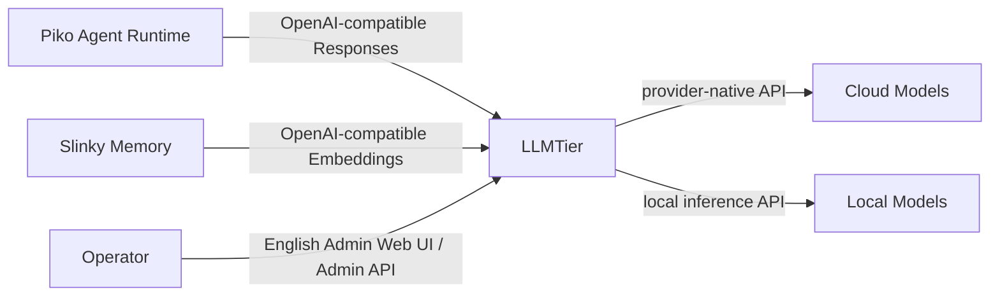
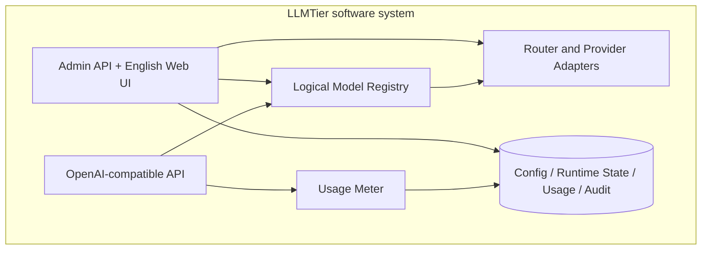
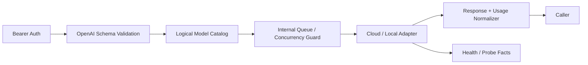
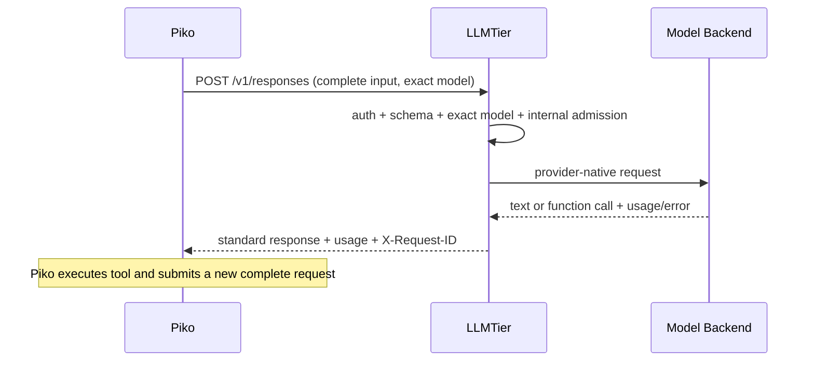
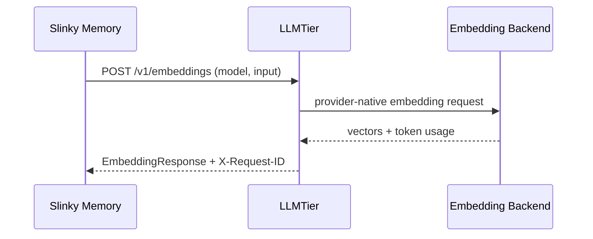
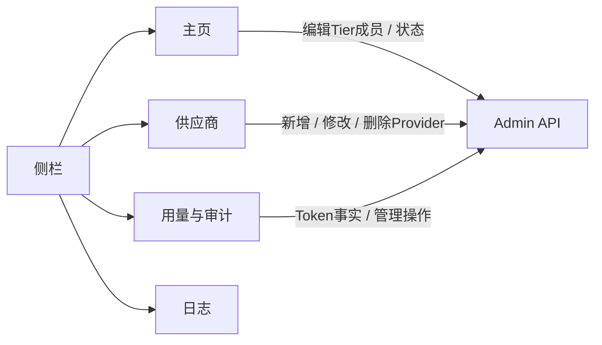

<!-- STD_DOCUMENT_COVER_BEGIN -->
# LLMTier V0.3 系统设计

| 文档字段 | 值 |
|---|---|
| Document ID | `llmtier-system-design` |
| Document Version | `0.3.2-draft.9` |
| Status | `In Review` |
| Project | `LLMTier` |
| Authority | `LLMTier` |
| Document Owner | LLMTier |
| Authors | llmtier |
| Reviewer | Piko、Slinky、LLMTier |
| Approver | LLMTier |
| Approval Date | 待定 |
| Created Date | `2026-09-06` |
| Last Modified Date | `2026-09-18` |
| Template Version | `4.0.0` |
| Template ID | `design.system` |
| Template Conformance | `tailored` |
| Tailoring Reference | `std-tailoring` |
| Migration Map Reference | none |
| Repository | `corezilla/LLMTier` |
| Canonical Path | `docs/20_system_design/llmtier-system-design.md` |
| Supersedes | `docs/30_subsystem_design/llmtier-service-design.md` |
<!-- STD_DOCUMENT_COVER_END -->

## 1. 文档说明

本文定义 LLMTier 作为一个独立、单应用、单服务的软件系统。它描述 V0.3 的目标设计，不表示目标接口已经实现或激活。字段级 authority 是 `interfaces/openapi/llmtier-v0.3.openapi.json`；能力状态由 compatibility manifest 给出，始终保持 `runtime_activation=false`，直到实现与运行门禁另行批准。

本次设计以主流机制优先：没有已确认特殊需求时采用标准 OpenAI-compatible 请求/响应，不增加自定义 header、恢复端点、调用方层级、会话状态机或并行兼容路径。

## 2. 系统概览

LLMTier 是无 Agent 会话状态的模型网关：调用方在每次请求中提交完成该次推理所需的全部输入；LLMTier 认证、校验、按 exact `model` 选择逻辑等级、调用已配置的云端或本地模型，并返回标准响应与 token Usage。

LLMTier 不保存或补齐 Agent 历史，不做上下文压缩，不执行工具，不拥有 Agent Session/Conversation，不理解 Project、IR、STD、Matrix room/topic，也不创建或匹配后端 KV identity。provider/local runtime 的 cache/KV 是后端内部实现。

Piko 管理 Agent session、上下文、工具循环、模型调用与执行内重试；Slinky 管理业务任务、材料、记忆、流程和验收。Embedding 只提供向量化；分块、索引、向量库和检索属于 Slinky 记忆系统。

## 3. 产品应用与设计目标

| 目标 | 设计决定 |
|---|---|
| 标准模型调用 | `POST /v1/responses` 使用固定 Pi 实际需要的标准 SSE；不增加未消费的JSON并行模式 |
| 模型发现 | `GET /v1/models` 与 exact-case detail；`model` 是逻辑等级 ID，不暴露物理账号 |
| 向量化 | 标准 `POST /v1/embeddings`；使用明确配置的 embedding-capable deployment |
| 工具调用 | 模型可返回 function call；Piko 执行工具并在下一次完整请求中带回 tool result |
| Usage | 响应内返回本次 token Usage；最小只读 `/tier/v1/usage` 提供同一授权主体的统一查询 |
| 自主管理 | Admin API + English Web UI 管理云模型、本地模型、逻辑等级、探测、Usage 与审计 |
| 运维 | 提供无副作用健康/就绪检查；有费用或改变状态的探测、reload、restart 必须获运维授权 |

不在范围：Cost/账单；SourceInstance；外部容量 snapshot/shared pool/Seat/claim；自定义 Idempotency/Invocation/result recovery；跨系统 close/drain/release；专用 compatibility negotiation；调用方或业务会话管理页面。

## 4. 功能与需求实现概览

| 用例 | LLMTier 行为 | 非职责 |
|---|---|---|
| Piko 请求推理 | 校验标准请求，按 exact model 路由，通过标准 SSE 返回文本/tool call/terminal Usage/error | Agent 历史、工具执行、任务重试策略 |
| Slinky 请求 embedding | 校验输入和 embedding 模型，返回向量与 Usage | chunk、索引、检索、正式记忆写入 |
| Consumer 查询模型 | 返回逻辑等级、能力、上下文/输出限制和 availability | 项目选人或业务计划决策 |
| Consumer 查询 Usage | 返回 measured/estimated/unknown token 事实 | 金额、币种、定价、结算 |
| Operator 管理模型 | CRUD provider/deployment/service level，探测并审计 | 调用方、Session、SourceInstance 管理 |

## 5. 总体结构

#### System Context（C4 Level 1）

### 5.1 Container View（C4 Level 2）

### 5.2 LLMTier Service Component View（C4 Level 3 / arc42 Level-1 Whitebox）

这些是同一进程内的logical building block，不是已拆分的子系统。当前不建立虚构subsystem；内部模块设计见`docs/40_module_design/llmtier-core-design.md`，实现设计见`docs/50_implementation_design/llmtier-runtime.isd.md`。

## 6. 工作模式与端到端流程

### 6.1 Responses 与 tool loop

Piko 固定依赖 `pi@9767ba275f3e9a5ee0f5c5342249b629ab1b2282`（0.85.1）的
`packages/ai/src/api/openai-responses.ts::buildParams` 固定生成 `stream:true`，并由
`processResponsesStream` 消费标准 Responses SSE。LLMTier 因此要求 `stream:true/store:false`，只提供这条实际消费路径；
`stream:false` 不在首阶段契约中，也不建立JSON并行模式或fallback。

首版固定请求含`store:false`、easy message、assistant/function/reasoning历史、普通function result和所选reasoning字段；不启用grammar/deferred/custom tools或prompt cache协议。必需事件子集为`response.created`、`response.output_item.added`、
`response.output_text.delta`、`response.refusal.delta`、reasoning summary/text事件、`response.function_call_arguments.delta|done`、
`response.output_item.done`、`response.completed|incomplete|failed` 和 `error`。
每个message/function/reasoning output item有稳定`id`，所有delta、added/done/terminal保持一致。refusal最终content使用标准`{type:"refusal",refusal}`，不伪装为`output_text`。Usage位于terminal response并保持标准嵌套details；tool result由Piko执行后以新请求中的`function_call_output`传回。

每个 HTTP 请求是独立模型调用。网络结果不明时，Piko 按标准 client retry policy 处理；V0.3 不承诺跨系统 exactly-once，也不提供 Invocation 查询或结果恢复。LLMTier 内部可保留防重、队列或 provider 可靠性机制，但不得形成对外会话或恢复契约。

### 6.2 Embeddings

同一embedding逻辑model只允许绑定同一`embedding_space_id`、模型版本与预处理契约。`float`返回有限JSON number array；`base64`返回RFC4648编码的连续little-endian float32，且必须与请求表示一致并核验长度、有限值和维数。维数相同不代表向量空间兼容；非兼容变更必须新建逻辑model ID，Slinky据此新建索引generation。Models同时发布允许维数、batch和单项input token上限。

V0.3 首个 dedicated embedding deployment 固定为本地 OpenAI-compatible 服务承载的
`BAAI/bge-m3` dense embedding family：逻辑 model ID 为 `Embedding-v1`，物理Provider模型ID按部署的标准API实际ID配置（例如`BAAI/bge-m3`或本地runtime的`bge-m3`），
`embedding_space_id=bge-m3-dense-1024-v1`，输出维数固定 1024，单项输入上限 8192 tokens，
单请求最多 32 个 input。32 是 LLMTier 首版资源保护上限，不是模型固有限制。预处理固定为 provider tokenizer、
dense output、L2 normalization；LLMTier 不改写正文、不增加 query instruction。部署前必须把模型权重 revision、
tokenizer revision、runtime image digest 和 normalization 设置固定到部署记录；其中任一改变都不得沿用该 space ID。
首版没有云端 embedding fallback，也不把另一个 1024 维模型视为同一向量空间。
模型维数和最大序列长度的来源记录为
[`FlagOpen/FlagEmbedding` BGE-M3官方说明](https://github.com/FlagOpen/FlagEmbedding/blob/master/research/BGE_M3/README.md)；
运行批量、预处理和space ID是本项目设计决定，不从模型说明推导。

### 6.3 运维恢复

服务启动、reload、restart、backend probe 是环境运维，不是 Piko 任务或模型调用状态机。健康检查可自动读取；真实 provider probe 可能计费，配置变更和 restart 改变状态，必须通过受授权 operator 执行。恢复后以 health/readiness、配置版本、目标模型可用性及受控 smoke request 分层确认；环境恢复不等于上层任务成功。

## 7. 硬件实现方案

LLMTier 不规定专用硬件。部署可连接云 provider 或本地主机上的推理服务。本地 GPU/CPU、驱动、模型文件与资源限制由 deployment 配置和运行环境管理，不能从逻辑等级 ID 推断。

## 8. 软件实现方案

| 路径 | 职责 |
|---|---|
| `src/` | 单服务 Python 源码 |
| `config/settings.json` | 仅空SQLite首次启动的一次性bootstrap输入；provider Secret使用引用 |
| `state/` | Git-ignored SQLite Operational Store，是初始化后唯一配置、Usage与audit authority |
| `interfaces/openapi/` | 唯一当前机器接口候选 |
| `interfaces/compatibility/` | 候选能力与 activation 状态，不承担协商协议 |
| `interfaces/vectors/` | 当前正负 contract fixtures |

目标实现只保留一条 OpenAI-compatible inference path。现有 `/call`、Role routing、CLI/agent/mlexp backend 是 legacy implementation baseline，迁移完成后退出 consumer authority；不得作为 fallback。

## 9. 可编程逻辑与专用处理单元

不适用。LLMTier 不含 FPGA、ASIC 或自定义加速逻辑；本地模型服务器的加速实现属于外部 deployment。

## 10. 数据、描述符与存储结构

| 数据 | 最小内容 | 生命周期 |
|---|---|---|
| Provider | type、OpenAI-compatible API root、推理secret reference、usage source/secret refs、账号并发/间隔/RPM、enabled | operator 管理 |
| Deployment | provider/local、model name、capabilities、health | operator 管理 |
| ServiceLevel | exact ID、deployment binding、limits/capabilities；embedding含space ID | operator 管理与 Models 发布 |
| UsageRecord | principal+request ID、record version/final、model、token values、quality、time | 按 LLMTier retention policy |
| ProviderRequestBinding | principal+request ID、最终provider/deployment、dispatch time | 与UsageRecord一致 |
| ProviderUsageSnapshot | provider账号的窗口、percent/used/quota/reset、source/status、checked_at | operator显式刷新后替换 |
| AuditEvent | actor、action、target、result、time；不含 Secret/prompt/output | 按审计策略 |
| OperationalLog | level、module、event、脱敏短消息、可空request ID、time | 7天；稳定分页快照到期后清理 |

不保存 Agent conversation、tool state、project/task content、正式记忆或后端 KV identity。Prompt/output 日志默认关闭；诊断只保存必要的脱敏关联信息。

## 11. 接口与通信协议

### 11.1 Consumer API

- `POST /v1/responses`
- `POST /v1/embeddings`
- `GET /v1/models`
- `GET /v1/models/{model}`
- `GET /tier/v1/usage`：标准 OpenAI API 没有统一跨请求 token 查询；这是唯一最小扩展，只返回 token 事实，不返回 Cost、容量或执行状态。
- `GET /healthz`、`GET /readyz`：环境探针，不参与模型协议协商。

Admin提供Provider账号用量的最后快照读取和显式刷新。MiniMax使用API Key访问官方Token Plan接口，不使用console cookie；火山读取Coding Plan必须使用独立OpenAPI AK/SK签名。该能力只管理LLMTier自己的Provider账号，不引入调用方、SourceInstance或跨系统容量产品。

Bearer credential 只标识获授权调用主体；不暴露 Client/Source/SourceInstance 产品模型。`X-Request-ID` 是服务端响应关联 ID，调用方可发送标准 trace context；它们不是幂等键或会话 ID。

任何provider dispatch前先持久化该server request ID的unknown Usage义务；计量版本只追加并单调推进head，因此terminal后写入失败或崩溃也不会在重启后变成“没有调用”。Usage查询按`[from,to)`及`(recorded_at,request_id)`稳定排序；首个页面持久冻结精确record version，cursor绑定principal、当前授权和原filter。页间更正/插入只进入新snapshot；Admin分页同样冻结view/ETag。相同request ID的版本绝不累计；store不可用返回typed 503，不用空页冒充无记录。成功模型结果不会仅因usage未知而改成失败，但unknown不得显示为0。

### 11.2 Admin API 与 English Web UI

页面保持短而单一职责；逐页线框、状态、字段与交互以`docs/40_module_design/webui-design.md`为authority：

1. **主页**：以Tier父节点、后端子节点的两层树一屏列出全部逻辑Tier。父节点常驻显示三个后端的供应商标签与状态点、可用数和Running汇总；展开后分别显示每个后端的`Account / Model`、类型、健康、provider用量窗口、Running与探测操作。provider配额不得在Tier层合并。Tier是固定逻辑等级，主页只允许编辑其后端绑定，不提供删除Tier。当前目录完整显示`Senior`、`Junior`、`Worker`、`Associate`、`Engineer`、`Executor`和`Embedding-v1`，实际映射以Registry为准。Embedding三个后端必须保持同一向量空间。
2. **Tier成员操作**：每个Tier行提供`Edit`抽屉，可修改现有Deployment、从已有Provider添加成员、从当前Tier解绑成员；不删除固定Tier。添加成员的Provider只能来自供应商页，避免在Tier编辑中重复创建连接和Secret。
3. **供应商管理**：独立短页面维护cloud/local Provider名称、API root、Secret reference和enabled；删除受ETag及引用409保护，不级联删除Deployment或Tier成员。
4. **用量与审计**：在同一短页面用页签切换Token用量与管理审计，一次只显示一张表；用量展示measured/estimated/unknown且不显示Cost，审计不含prompt/output/credential，两者数据语义保持分离。
5. **日志**：查询脱敏的服务运行与故障诊断事件；与operator审计分离，不含prompt/output/reasoning/vector/credential。

不提供独立访问控制、跨系统容量产品、恢复、调用方、SourceInstance 或费用页面；Provider账号限流是本网关内部运行保护，随Provider配置。

## 12. 可靠性、维护与升级

标准 HTTP 错误区分 validation/auth/model_not_found/rate_limit/provider_unavailable/internal_error。429 可带 `Retry-After`；调用方决定重试。未知 token 数用 `usage=null` 或字段 null + `measurement_status=unknown`，不得填零。

Admin item读取返回强ETag；PATCH/DELETE必须携带`If-Match`。stale edit返回412，引用冲突返回409；partial PATCH只更新出现字段。SQLite是初始化后唯一配置authority，settings文件不再自动重载或双写。

内部队列、并发保护、超时、provider failover 只能在同一 exact service level 的已配置后端集合内工作；不得静默跨等级。内部实现不得向 consumer 暴露 Seat、claim、Invocation 或恢复状态。

V0.3 内部 admission 使用每个 deployment 一个许可的保守基线，每个 exact service level 使用最多 32 项的
FIFO 等待队列。Router 只在 `enabled && healthy` 且能力匹配的 deployment 中选择当前 in-flight 最少者，
相同时按 `service_level_deployments.ordinal`；不做跨等级或跨 embedding space fallback。队列已满立即返回429；
排队超过30秒仍无许可也返回429，并以秒为单位返回保守的 `Retry-After`。provider 建连/首字节和SSE空闲超时
分别固定为30秒和60秒；超时只结束本次HTTP调用，不创建可恢复 Invocation。上述值是首版单节点保护参数，
调整属于LLMTier内部部署配置变更，必须审计并经负载验证，不改变外部DTO。

## 13. 性能、扩展与兼容性

V0.3 不承诺尚未测量的吞吐/延迟 SLO。扩展先增加同一 service level 的 deployment，再通过内部调度保护资源。兼容以标准 OpenAI shape 和显式版本变更为准，不提供专用 compatibility endpoint 或运行时协商。

## 14. 可测试性与验收设计

静态验收覆盖：OpenAPI 引用解析、Responses/tool-call/tool-result、Embeddings、Models、Usage unknown、429/5xx、Admin CRUD/Secret 不回显、旧路径不存在。运行验收另覆盖 provider capture、token truth、健康/重启、探测授权和 Web UI。

静态 Contract PASS 不代表实现上线；production capture、故障注入和部署证据属于后续 Gate。

## 15. 信息安全架构

Data Plane 与 Admin 使用不同 credential/权限。Provider Secret 只通过 secret reference 解析，不进入普通响应、日志或 UI 回显。默认 bind 为 loopback/private network；production TLS、认证、Secret store、rotation 和审计保留仍需实现证据。

## 16. 结构、热、工艺与安全设计

硬件结构、热与工艺不适用。软件安全依赖资源限制、请求大小限制、timeout、进程隔离和本地模型部署边界；不得因本节不适用而省略信息安全架构。

## 17. 实现计划

1. 以固定Pi 0.85.1真实request/标准Responses SSE子集实现Piko调用，不增加未消费的JSON并行模式。
2. 实现 OpenAI-compatible Responses/Models 和 exact service-level routing。
3. 实现 dedicated Embeddings deployment 与 `/v1/embeddings`。
4. 实现统一 token Usage 记录/查询，明确 measured/estimated/unknown。
5. 将 legacy `/call` 从 consumer authority 退役。
6. 按内部module/ISD及三页英文UI设计实现精简Admin面和安全运维流程。
7. 完成 provider/Piko/Knowledge capture 后另行决定 runtime activation。

## 18. 设计决策、风险与未决项

| ID | 状态 | 决策/问题 |
|---|---|---|
| LT-ADR-01 | decided | 无 Agent 会话状态的 OpenAI-compatible gateway |
| LT-ADR-02 | decided | Cost、SourceInstance、外部容量/Seat、Invocation recovery 退出 V0.3 外部契约 |
| LT-ADR-03 | decided | Usage 只提供 token 事实与来源状态；未知不补零 |
| LT-ADR-04 | decided | 固定 Pi adapter 使用 `stream:true/store:false`；首阶段只支持标准SSE，不增加JSON或自定义fallback |
| LT-ADR-05 | decided | SQLite是初始化后唯一配置authority；settings仅一次性bootstrap |
| LT-ADR-06 | decided | embedding同逻辑model固定同一向量空间；非兼容变更新model ID |
| LT-OPEN-02 | design closed / implementation gate | `Embedding-v1`固定为`BAAI/bge-m3` dense family、1024维、space `bge-m3-dense-1024-v1`、8192 tokens、batch 32；物理Provider模型ID可按runtime命名，但权重/runtime digest与预处理一致性须在部署证据中填写 |
| LT-OPEN-03 | design closed / implementation gate | 单节点Linux基线使用TLS反向代理、外部operator SSO、systemd、加密SQLite备份和本文/Operations定义的恢复门禁；真实环境证据仍未执行 |

## A. 数据模型与状态机

核心资源只有 Provider、ProviderUsageProfile、ProviderUsageSnapshot、Deployment、ServiceLevel、UsageRecord、ProviderRequestBinding、AuditEvent。请求生命周期仅为 HTTP request → validate → internal admit → backend call → response/error；内部状态不作为跨系统状态机。

## B. API、Schema、Event、寄存器与错误契约

OpenAPI 是唯一字段级 authority。错误统一为 `{error:{message,type,code,param}}`。没有寄存器或跨系统 event bus。

## C. 持久化、一致性、幂等与恢复

V0.3 不承诺跨系统调用幂等或结果恢复。配置与 Usage/Audit 使用 LLMTier 自身存储；内部可靠性不得改变标准 API 语义。环境恢复只恢复服务配置和内部状态，不恢复 Piko Agent session。

## D. 安全、隐私、Secret 与审计

最小权限、Secret 引用、脱敏 audit、prompt/output 默认不落日志。管理变更记录 actor/action/target/result；Secret 值永不记录。

## E. 可观测性、容量、性能、资源与 SLO

外部只发布 health/readiness、Models、token Usage 和标准错误。内部可观察 queue/concurrency/provider quota，但不形成 Slinky capacity/Seat contract。SLO 需实测后批准。

## F. 测试设计与需求 traceability

需求 ID、OpenAPI operation、fixture 和测试 case 在 traceability 文档中一对一映射。删除的旧扩展必须有“path/schema absent”负例。

## G. 集成、部署、迁移、回滚与发布 Gate

迁移为一次性 authority 替换：旧 candidate 和 legacy `/call` 可留作历史/实现迁移输入，但不作为运行 fallback。runtime activation 独立审批。

## H. 未决问题、外部依赖和后续版本

Responses streaming范围已按固定Pi调用方式选择标准SSE，内部module/ISD和三页Web UI设计已建立。candidate.6在已接受candidate.5语义上增加主页全量状态布局与只读脱敏日志查询；不改变模型调用或Usage语义。当前剩余工作是实现与运行证据：固定embedding权重和runtime digest、provider adapter、Web UI、auth/TLS、systemd、备份恢复、测量与运维。`runtime_activation`继续为false。
