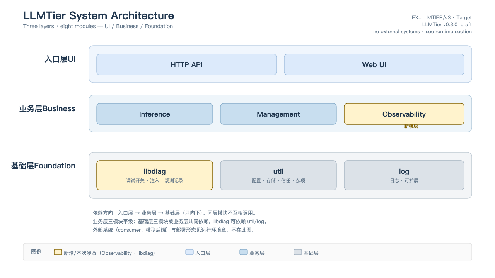
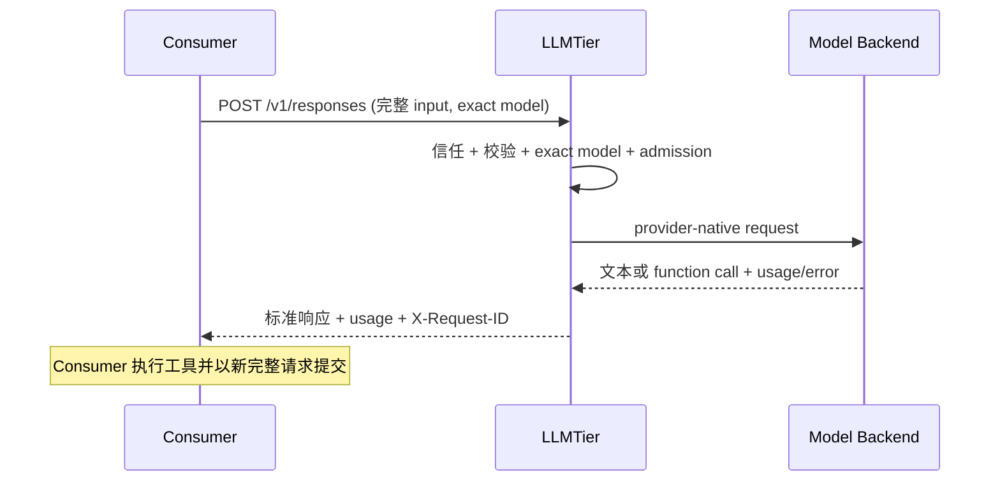

<!-- STD_DOCUMENT_COVER_BEGIN -->
# LLMTier 软件系统设计

> STD 使用入口：[项目采用说明与标准导航](../../README.md#std-entry)

| 文档字段 | 值 |
|---|---|
| Document ID | `llmtier-system-design` |
| Document Version | `0.4.0-draft.1` |
| Status | `In Review` |
| Project | `LLMTier` |
| Authority | `LLMTier` |
| Document Owner | LLMTier |
| Authors | llmtier |
| Reviewer | Piko、Slinky、LLMTier |
| Approver | LLMTier |
| Approval Date | 待定 |
| Created Date | `2026-09-06` |
| Last Modified Date | `2026-09-22` |
| Template Version | `0.4.1` |
| Template ID | `design.software-system` |
| Template Conformance | `tailored` |
| Tailoring Reference | `std-tailoring` |
| Migration Map Reference | none |
| Repository | `corezilla/LLMTier` |
| Canonical Path | `docs/20_system_design/llmtier-system-design.md` |
| Supersedes | `docs/30_subsystem_design/llmtier-service-design.md` |
<!-- STD_DOCUMENT_COVER_END -->

## 1. 文档说明

本文定义 LLMTier 作为纯软件、单进程、单服务的模型网关的完整软件设计：从产品用途到整体软件架构、运行组织与验收。字段级 authority 是 `interfaces/openapi/llmtier.openapi.json`；能力状态由 compatibility manifest 给出，始终保持 `runtime_activation=false`，直到实现与运行门禁另行批准。

本次设计以主流机制优先：没有已确认特殊需求时采用标准 OpenAI-compatible 请求/响应，不增加自定义 header、恢复端点、调用方层级、会话状态机或并行兼容路径。本文是设计，不表示目标接口已经实现或激活。

### 1.1 设计位置与上级承接

| 项 | 值 |
|---|---|
| 设计位置 | 纯软件项目顶层（`design_level=system`，`domain=software`） |
| 父对象 / 父 Document ID | 无（纯软件项目顶层，`parent_document_id` 为空） |
| 固定输入 | 已采用需求 `docs/10_requirements/llmtier-requirements.md` |
| 承担范围 | 产品用途、整体软件架构、运行组织、验收 |
| 不承担范围 | 硬件/FPGA（本系统不含）；跨系统容量/Seat（Slinky 所有）；Agent 会话状态（Piko 所有） |

## 2. 产品应用与设计目标

### 2.1 场景、用户入口与外部环境

LLMTier 部署在局域网，作为 Consumer 与模型后端之间的模型网关。三类使用入口：

| 使用入口 | 使用者 | 用途 |
|---|---|---|
| HTTP API（推理面） | Consumer（Piko 做推理、Slinky 做向量化） | 模型调用、向量化、模型目录、自身用量查询 |
| HTTP API（管理面） | Operator | 配置模型与等级、探测、审计与日志查询 |
| Web UI | Operator | 管理面控制台 |

外部环境：局域网内运行，默认绑定 loopback/内网；操作系统与本地或云端模型后端由部署环境提供。模型后端（含本地推理服务）是外部依赖，不属本系统设计范围。

### 2.2 目标、范围与可观察成功条件

| 目标 | 设计决定 | 可观察成功条件 |
|---|---|---|
| 标准模型调用 | `POST /v1/responses` 使用标准 SSE | Consumer 获得标准响应与 terminal Usage |
| 模型发现 | `GET /v1/models` 与 exact-case detail | 返回逻辑等级与能力，不暴露物理账号 |
| 向量化 | 标准 `POST /v1/embeddings` | 返回向量与 token Usage |
| 工具调用 | 模型可返回 function call | Piko 执行工具并在下一次完整请求带回 tool result |
| Usage | 响应内返回本次 token Usage；只读 `/v1/usage` 提供同一主体统一查询 | measured/estimated/unknown 可区分，unknown 不填零 |
| 自主管理 | 管理面 + Web UI 管理模型、等级、探测、Usage 与审计 | Operator 可自助完成配置与查询 |
| 运维 | 无副作用健康/就绪检查；有费用或改变状态的探测需授权 | `/healthz`、`/readyz` 可用 |

**不在范围**：Cost/账单；SourceInstance；外部容量 snapshot/shared pool/Seat/claim；自定义 Idempotency/Invocation/result recovery；跨系统 close/drain/release；专用 compatibility negotiation；调用方或业务会话管理页面。

## 3. 系统概览

LLMTier 是无 Agent 会话状态的模型网关：调用方在每次请求中提交完成该次推理所需的全部输入；系统认证、校验、按 exact `model` 选择逻辑等级、调用已配置的云端或本地模型，并返回标准响应与 token Usage。

LLMTier 不保存或补齐 Agent 历史，不做上下文压缩，不执行工具，不拥有 Agent Session/Conversation，不理解 Project、IR、STD、Matrix room/topic，也不创建或匹配后端 KV identity。provider/local runtime 的 cache/KV 是后端内部实现。Piko 管理 Agent session、上下文、工具循环、模型调用与执行内重试；Slinky 管理业务任务、材料、记忆、流程和验收；Embedding 只提供向量化。

### 3.1 软件系统架构

[可编辑 SVG 源](../assets/diagrams/llmtier-architecture-container.svg)

图 A1｜EX-LLMTIER/v3 · Target · LLMTier v0.3.0-draft。本图表达 LLMTier 自身的静态层次与包含关系，**不**绘制外部系统（Consumer、模型后端见 §2.1/§6），也**不**表示进程或调用顺序（重要过程见 §7）。

系统按职责分为三层、八个模块：

- **入口层（UI）**：`HTTP API` 与 `Web UI`。HTTP API 是统一入口，承载全部接口；Web UI 是 operator 控制台，同源调用 HTTP API。
- **业务层（事务处理）**：`Inference`、`Management`、`Observability`。三者平级，承接入口请求，向下消费基础层能力。
- **基础层（通用能力）**：`libdiag`、`util`、`log`。打包被业务层共同依赖的通用能力。

**分层与依赖规则**：

1. 依赖只向下：入口层 → 业务层 → 基础层。
2. 同层模块不互相调用。
3. 入口层不直接调用基础层：调试开关等能力经 `Observability` 的业务接口暴露。
4. 基础层内部：`libdiag` 可依赖 `util`/`log`；`util`/`log` 不反向依赖 `libdiag`。

**为何这样划分**：

- 三个业务模块对应三类使用者（Consumer、Operator、调试者），接口边界互斥，各自有独立的入口集合。
- 把"被多方调用的通用能力"收敛为**一个基础库**，避免在业务模块内重复实现基础设施；调试能力尤其适合打包，因为 `Inference`（判定注入）、`Observability`（展现开关）和入口层（切换开关）都要用到同一份开关状态。
- 采用"能力提供者（基础层）"与"能力呈现者（业务层）"分离：调试开关由 `libdiag` **提供**，由 `Observability` **呈现与切换**；避免把基础能力误当作某个业务模块的私有物。

### 3.2 组成与职责

**入口层**

| 模块 | 职责 | 非职责 |
|---|---|---|
| HTTP API | 终止 HTTP/SSE；路由分发；局域网访问信任（内网放行；可选凭据仅作纵深，不建用户/会话/SSO 体系） | 不含业务规则；不直接访问持久化 |
| Web UI | operator 控制台：展示与操作管理面 | 不直读配置或密钥；不承载推理 |

**业务层**

| 模块 | 职责 | 非职责 |
|---|---|---|
| Inference | 推理、向量化、模型目录：校验输入 → 按逻辑等级选择后端 → 调用 → 返回标准响应与 token Usage | 配置管理；Agent 会话；工具执行 |
| Management | 维护 provider / deployment / 逻辑等级配置；执行探测；提供审计与运行日志查询 | 不承载模型推理 |
| Observability | 观测数据的查询与呈现；调试开关的展现与切换；故障注入的配置入口（通过 `libdiag`） | 不改变推理契约；自身故障 fail-open，不影响推理可用性 |

**基础层**

| 模块 | 职责 | 拥有的状态/资源 |
|---|---|---|
| `libdiag` | 调试开关、注入配置、观测记录（上游快照 / 数据面统计 / 单请求 trace）的底层读写 | 观测记录、开关与注入配置 |
| `util` | 配置、存储（唯一持久化）、访问信任、杂项工具 | 全部持久化数据（配置、账本、审计、日志、观测） |
| `log` | 日志记录与写入前脱敏 | 运行日志（独立，后续可扩展） |

### 3.3 总体方案、选择依据与替代方案

| 决策点 | 选择 | 依据 | 已排除的替代方案 |
|---|---|---|---|
| 对外接口形态 | 单一 `/v1/*` 命名空间，资源由路径标识、权限由凭据标识 | 对外提供统一接口；符合主流网关实践 | 用路径前缀区分 consumer/operator（冗余且割裂） |
| 流式协议 | 标准 Responses SSE | 固定 Pi 调用方式实际消费此路径 | 并行 JSON 模式、自定义 fallback |
| 配置权威 | 初始化后 SQLite 唯一权威 | 避免双写与文件热载歧义 | settings 文件持续热加载 |
| 分层方式 | 入口层 / 业务层 / 基础层 | 依赖单向、能力归属清晰 | 按代码目录或技术组件分层 |

### 3.4 约束分配与下游保证

- `usage` 账本只追加不改写：同一 `request_id` 只保留最新 record version，未知不补零。下游模块设计须承接该语义。
- 所有接口同处 `/v1/*`；consumer 与 operator 由凭据区分。下游接口设计不得新增路径前缀。
- 观测子系统 fail-open：其故障不得使 `Inference` 失败。
- Provider Secret 只经引用解析，不进入普通响应、日志或 UI 回显。

### 3.5 机制清单与文档映射

| Mechanism ID | Document ID | 计划文件名 | 范围 | 状态 |
|---|---|---|---|---|
| LT-OBS | `llmtier-observability-mechanism` | `docs/20_system_design/mechanisms/observability.md` | 上游快照、数据面统计、故障注入、单请求 trace、关联标识透传 | 设计已定（本文 §11.3 + 模块/ISD） |

模块与实现设计入口：

- 模块设计：`docs/40_module_design/llmtier-core-design.md`、`llmtier-diagnostics-design.md`、`llmtier-webui-design.md`
- 实现设计：`docs/50_implementation_design/llmtier-runtime.isd.md`、`llmtier-diagnostics.isd.md`

## 4. 功能与用户交互设计

### 4.1 关键功能概要（按能力展开）

| 用例 | LLMTier 行为 | 非职责 |
|---|---|---|
| Consumer 请求推理 | 校验标准请求，按 exact model 路由，通过标准 SSE 返回文本/function call/terminal Usage/error | Agent 历史、工具执行、任务重试策略 |
| Consumer 请求 embedding | 校验输入和 embedding 模型，返回向量与 Usage | chunk、索引、检索、正式记忆写入 |
| Consumer 查询模型 | 返回逻辑等级、能力、上下文/输出限制和 availability | 项目选人或业务计划决策 |
| Consumer 查询 Usage | 返回 measured/estimated/unknown token 事实 | 金额、币种、定价、结算 |
| Operator 管理模型 | CRUD provider/deployment/逻辑等级，探测并审计 | 调用方、Session、SourceInstance 管理 |
| Operator 查询审计/日志 | 只读返回脱敏审计与运行日志 | mutation、原始日志、prompt/output/credential |
| 调试者观测 | 快照/统计/注入/trace 查询与开关切换 | 不改变推理行为 |

### 4.2 页面、命令与交互反馈（按实际入口）

全部接口位于单一 `/v1/*` 命名空间；consumer 端点与 operator 端点通过凭据与资源名区分。管理端点：

- `GET/POST /v1/providers`、`GET/PATCH/DELETE /v1/providers/{provider_id}`
- `GET/POST /v1/providers/{provider_id}/usage`、`GET /v1/providers/{provider_id}/models`
- `GET/POST /v1/deployments`、`GET/PATCH/DELETE /v1/deployments/{deployment_id}`
- `GET/POST /v1/service-levels`、`GET/PATCH/DELETE /v1/service-levels/{service_level_id}`
- `GET /v1/runtime`、`POST /v1/probes`
- `GET /v1/usage`（自身或全部）、`DELETE /v1/usage`（仅 operator）
- `GET /v1/audit`、`GET /v1/logs`
- `GET/PATCH /v1/diagnostics`、`GET /v1/diagnostics/snapshots`、`GET /v1/diagnostics/stats`、`GET/PATCH /v1/deployments/{id}/diagnostics`、`GET /v1/trace/{request_id}`（LT-OBS）

状态反馈：标准 HTTP 错误区分 validation/auth/model_not_found/rate_limit/provider_unavailable/internal_error；429 可带 `Retry-After`；未知道具 `usage=null` 或字段 null + `measurement_status=unknown`，不得填零。

### 4.3 UI 设计（适用时）

Web UI 是英文 operator 控制台，同源调用 `/v1/*`，不直读 SQLite/配置/密钥。页面保持短而单一职责；逐页线框、状态、字段与交互以 `docs/40_module_design/llmtier-webui-design.md` 为 authority：

1. **主页**：以逻辑等级为父节点、后端为子节点的两层树；显示各后端 provider、model、类型、健康、版本与并发。
2. **Tier 成员操作**：每个等级提供编辑抽屉，修改或添加后端绑定，不删除固定等级。
3. **供应商管理**：独立短页维护 cloud/local provider、API root、Secret 引用与 enabled。
4. **用量与审计**：同页页签切换 token 用量与管理审计，两者数据语义分离。
5. **日志**：查询脱敏的运行与故障诊断事件。
6. **诊断（Diagnostics）**：观测查询与调试开关。

不提供独立访问控制、容量、恢复、调用方或费用页面。

## 5. 子系统与直属模块概要设计

### 5.1 直属对象概要设计（按子系统或直属模块展开）

本系统不建立软件子系统；三个业务模块与三个基础模块均为软件系统直属模块。

| 模块 | 输入 | 主要处理 | 输出 |
|---|---|---|---|
| Inference | 标准模型请求 | 校验 → 按 exact 等级路由 → 调用后端 → 归一响应与 Usage | 标准响应 + token Usage |
| Management | operator 配置命令 | 事务化更新配置、探测、审计落库 | 配置版本 + 审计事件 |
| Observability | 调试命令 / 观测查询 | 读观测记录、聚合、展现；切换开关 | 快照/统计/trace 视图 |
| `libdiag` | 上层调用 | 开关与注入配置读写、观测记录写入与读取 | 观测事实 |
| `util` | 上层调用 | 配置、持久化、信任判定 | 持久化事实 |
| `log` | 上层调用 | 脱敏后写入/读取日志 | 运行日志 |

详细的模块划分、职责与非职责见 `docs/40_module_design/llmtier-core-design.md` 与 `llmtier-diagnostics-design.md`。

## 6. 运行组织与部署设计

### 6.1 执行上下文、调度与并发

单进程、单节点运行。内部 admission 使用每个 deployment 一个许可的保守基线，每个 exact service level 使用最多 32 项的 FIFO 等待队列。调度只在 `enabled && healthy` 且能力匹配的 deployment 中选择当前 in-flight 最少者，相同时按 `service_level_deployments.ordinal`；不做跨等级或跨 embedding space fallback。队列已满立即返回 429；排队超过 30 秒仍无许可也返回 429，并返回保守的 `Retry-After`。

### 6.2 通信与跨实例协作

不提供跨实例协作或多节点一致性。所有状态由单一节点的持久化存储持有。

### 6.3 部署拓扑、资源与故障域

单节点部署，默认绑定 loopback/私网。生产基线使用 TLS 反向代理、operator SSO、systemd、加密 SQLite 备份。provider 建连/首字节和 SSE 空闲超时分别固定为 30 秒和 60 秒；超时只结束本次 HTTP 调用，不创建可恢复 Invocation。外部依赖（模型后端、网络）属于部署环境。

## 7. 重要过程

### 7.1 启动与就绪过程

服务启动先迁移 schema，再从配置初始化（空库首次启动）并确保固定等级存在。初始化失败时服务保持 not_ready。`/healthz` 返回进程存活；`/readyz` 返回可接流量判断。

### 7.2 一次业务处理的完整过程

每个 HTTP 请求是独立模型调用。网络结果不明时，Consumer 按标准 client retry policy 处理；本系统不承诺跨系统 exactly-once，也不提供 Invocation 查询或结果恢复。

Embedding 路径同理：Consumer 提交 `POST /v1/embeddings`，系统校验并按 embedding 模型路由，返回向量与 token Usage。同一 embedding 逻辑 model 只允许绑定同一 `embedding_space_id`、模型版本与预处理契约；非兼容变更必须新建逻辑 model ID。

### 7.3 配置生效与模式切换过程

SQLite 是初始化后唯一配置 authority；`config/settings.json` 仅作空库首次启动的一次性 bootstrap 输入。初始化后即使文件变化也不自动重导入，管理写入只落 SQLite。再导入必须是 operator 显式离线迁移，先备份并使用单一版本迁移命令，不双写。

### 7.4 停止、取消、重启与异常恢复

服务停止、reload、restart、backend probe 是环境运维，不是任务或模型调用状态机。恢复后以 health/readiness、配置版本、目标模型可用性及受控 smoke request 分层确认；环境恢复不等于上层任务成功。

## 8. 数据与存储设计

### 8.1 业务数据流与形态变换

请求进入后构造 unknown Usage 义务，dispatch 前持久化；后端返回后归一为 token 事实并落账本；终态只追加版本、单调推进 head。观测数据（快照/统计/trace）独立于账本。

### 8.2 状态所有权、一致性与持久化

| 数据 | 最小内容 | 生命周期 |
|---|---|---|
| Provider | type、API root、推理 Secret 引用、usage source、账号并发/间隔/RPM、enabled | operator 管理 |
| Deployment | provider、model name、capabilities、health | operator 管理 |
| ServiceLevel | exact ID、deployment 绑定、limits/capabilities；embedding 含 space ID | operator 管理与 Models 发布 |
| UsageRecord | principal+request ID、record version/final、model、token values、quality、time | 按 retention policy |
| ProviderRequestBinding | principal+request ID、最终 provider/deployment、dispatch time | 与 UsageRecord 一致 |
| ProviderUsageSnapshot | provider 账号窗口、percent/used/quota/reset、source/status、checked_at | operator 显式刷新后替换 |
| AuditEvent | actor、action、target、result、time；不含 Secret/prompt/output | 按审计策略 |
| OperationalLog | level、module、event、脱敏短消息、可空 request ID、time | 7 天；稳定分页快照到期后清理 |
| Observability 记录 | 快照/统计/trace/注入配置（见 §11.3） | 7 天 |

任何 provider dispatch 前先持久化该 server request ID 的 unknown Usage 义务；计量版本只追加并单调推进 head，因此 terminal 后写入失败或崩溃也不会在重启后变成"没有调用"。Usage 查询按 `[from,to)` 及 `(recorded_at,request_id)` 稳定排序；首个页面持久冻结精确 record version，cursor 绑定 principal、当前授权和原 filter。相同 request ID 的版本绝不累计；存储不可用返回 typed 503，不用空页冒充无记录。

### 8.3 缓存、保留、清理与数据迁移

观测数据保留 7 天，由清理任务删除过期记录。测试报告、审计与日志保留期限由运维策略控制。schema 迁移由单一版本迁移程序负责，不并行双写。

## 9. 接口与通信协议

### 9.1 外部入口与内部接口权威

全部 HTTP 接口位于单一 `/v1/*` 命名空间；consumer 端点与 operator 端点通过凭据与资源名区分，不另设路径前缀。字段级 authority 是 `interfaces/openapi/llmtier.openapi.json`。Bearer 凭据只标识获授权调用主体；`X-Request-ID` 是服务端响应关联 ID，可接收标准 trace context；它们不是幂等键或会话 ID。

### 9.2 单项操作、类型与错误实例（按接口展开）

错误统一为 `{error:{message,type,code,param}}`。分页基于 cursor；管理读返回强 ETag，PATCH/DELETE 必须携带 `If-Match`，stale edit 返回 412，引用冲突返回 409，partial PATCH 只更新出现字段。

### 9.3 维护调试入口与访问方式

`GET/PATCH /v1/diagnostics` 提供全局调试开关（快照捕获、统计聚合）；`GET/PATCH /v1/deployments/{id}/diagnostics` 提供按 deployment 的故障注入配置；`GET /v1/trace/{request_id}` 提供单请求全生命周期；`GET /v1/diagnostics/snapshots`、`GET /v1/diagnostics/stats` 提供观测查询。以上均需 operator 凭据。

## 10. 配置与环境管理设计

### 10.1 配置来源、校验与生效范围

配置来源：空库首次启动的 `config/settings.json`（bootstrap）→ SQLite（唯一运行权威）。bootstrap 校验完整配置、引用和 Secret 引用可用性；任一步失败回滚并保持 not_ready。Secret 明文不进入 SQLite，只保存引用与其非敏感版本。

## 11. 可靠性、维护与升级

### 11.1 故障模型与恢复保证

标准 HTTP 错误区分 validation/auth/model_not_found/rate_limit/provider_unavailable/internal_error。provider 失败在标准错误中体现，不静默跨等级 fallback。内部队列、并发与超时只在同一 exact 等级的后端集合内工作。

### 11.2 统计、日志与故障定位

外部只发布 health/readiness、Models、token Usage 和标准错误。内部可观察 queue/concurrency/provider quota，但不形成 Slinky capacity/Seat contract。日志只返回服务端先行脱敏的 level/module/event/短消息/可空 request ID/time。SLO 需实测后批准。

### 11.3 自检与诊断设计

内部可观测性机制（Mechanism `LT-OBS`，见 §3.5）提供：上游调用快照、数据面统计、运行时故障注入、单请求 trace、consumer 关联标识透传。默认关闭，关闭时零开销；开启时尽力而为写入，故障 fail-open。不记录 Provider Secret、consumer credential 或完整 prompt/输出正文。详细设计见模块设计 `llmtier-diagnostics-design.md` 与实现设计 `llmtier-diagnostics.isd.md`。

### 11.4 升级与回滚

升级通过单一版本迁移与重启；回滚恢复上一版本与备份。生产 procedure 与 evidence 属后续运行门禁。

## 12. 性能、容量、扩展与兼容性

### 12.1 预算、瓶颈与扩展边界

V0.3 不承诺尚未测量的吞吐/延迟 SLO。扩展先增加同一 level 的 deployment，再通过内部调度保护资源。兼容以标准 OpenAI shape 和显式版本变更为准，不提供专用 compatibility endpoint 或运行时协商。

## 13. 可测试性与验收设计

### 13.1 主要测试方法与结果判定

静态验收覆盖：OpenAPI 引用解析、Responses/tool-call/tool-result、Embeddings、Models、Usage unknown、429/5xx、管理 CRUD 与 Secret 不回显、旧路径不存在。运行验收另覆盖 provider capture、token truth、健康/重启、探测授权和 Web UI。静态 Contract PASS 不代表实现上线。

### 13.2 受控故障与异常收口验证

故障注入开关可在运行时制造上游故障、时延、限流与流异常，用于验证 Consumer 处置路径可确定性触达。

### 13.3 测试环境快速部署与复位

测试可在本机启动独立实例与隔离数据库，或在联调环境直连；复位通过重建数据库与重启实例完成。

### 13.4 并发测试与环境隔离

admission 队列与并发上限可被并发请求验证；测试实例相互隔离，不共享数据库。

### 13.5 自动化、复现与验证覆盖

需求 ID、OpenAPI operation、fixture 和测试 case 在 traceability 文档中一对一映射。删除的旧扩展必须有"path/schema absent"负例。测试报告随测试保存（`tests/<level>/reports/<run-id>/`）。

## 14. 信息安全架构

### 14.1 身份、权限、数据与供应链边界

局域网信任模型：内网/loopback 免登录；可选 Bearer 凭据区分 consumer 与 operator 权限，仅作纵深防护，不建用户/会话/SSO 体系。Provider Secret 只通过引用解析，不进入普通响应、日志或 UI 回显。Prompt/output 日志默认关闭；默认绑定 loopback/私网。生产 TLS、认证、Secret store、rotation 和审计保留由部署环境与运维设计承接。

## 15. 开发、构建与交付设计

### 15.1 构建复现、依赖与发布物

目标实现只保留一条 OpenAI-compatible inference path。现有 `/call`、Role routing、CLI/agent/mlexp backend 是 legacy implementation baseline，迁移完成后退出 consumer authority，不作为 fallback。发布物、版本与部署步骤由 `docs/80_operations/llmtier-release-and-operations.md` 承接。

## 16. 实现计划与集成顺序

1. 以固定 Pi 0.85.1 真实 request/标准 Responses SSE 子集实现 Consumer 调用，不增加未消费的 JSON 并行模式。
2. 实现 OpenAI-compatible Responses/Models 和 exact service-level routing。
3. 实现 dedicated Embeddings deployment 与 `/v1/embeddings`。
4. 实现统一 token Usage 记录/查询，明确 measured/estimated/unknown。
5. 将 legacy `/call` 从 consumer authority 退役。
6. 实现精简管理面与英文 UI，及安全运维流程。
7. 实现内部可观测性机制（`LT-OBS`）。
8. 完成 provider/Piko/Knowledge capture 后另行决定 runtime activation。

## 17. 设计决策、风险与下游承接

| ID | 状态 | 决策/问题 |
|---|---|---|
| LT-ADR-01 | decided | 无 Agent 会话状态的 OpenAI-compatible gateway |
| LT-ADR-02 | decided | Cost、SourceInstance、外部容量/Seat、Invocation recovery 退出 V0.3 外部契约 |
| LT-ADR-03 | decided | Usage 只提供 token 事实与来源状态；未知不补零 |
| LT-ADR-04 | decided | 固定 Pi adapter 使用 `stream:true/store:false`；首阶段只支持标准 SSE |
| LT-ADR-05 | decided | SQLite 是初始化后唯一配置 authority；settings 仅一次性 bootstrap |
| LT-ADR-06 | decided | embedding 同逻辑 model 固定同一向量空间；非兼容变更新 model ID |
| LT-ADR-07 | decided | 对外单一 `/v1/*` 命名空间；权限由凭据而非路径区分 |
| LT-ADR-08 | decided | 分层为入口层/业务层/基础层；调试能力归基础库 `libdiag`，由业务层 `Observability` 呈现 |
| LT-OPEN-02 | design closed / implementation gate | `Embedding-v1` 固定 `BAAI/bge-m3` dense family、1024 维、space `bge-m3-dense-1024-v1`、8192 tokens、batch 32；真实权重/runtime digest 由部署证据填写 |
| LT-OPEN-03 | design closed / implementation gate | 单节点 Linux 基线使用 TLS 反向代理、外部 operator SSO、systemd、加密 SQLite 备份；真实环境证据仍未执行 |
| LT-OPEN-04 | decided | 内部可观测性机制（`LT-OBS`）订阅推理与路由事件；快照/统计/注入/trace 各归 1 张新表，保留 7 天；注入事件写 audit，账本 source 标注 `injected` |
| LT-OPEN-05 | design closed / implementation gate | 流注入（stream_terminate/malformed_event）需改造流式输出模块；开工前确认实现方案 |

### 17.1 下级设计与组合验收任务

- 模块设计：`llmtier-core-design.md`、`llmtier-diagnostics-design.md`、`llmtier-webui-design.md`
- 实现设计：`llmtier-runtime.isd.md`、`llmtier-diagnostics.isd.md`
- 接口契约：`docs/60_interfaces/` + `interfaces/`
- 组合验收：见 `docs/70_verification/`

## 附录 A. 设计输入、适用性与派生关系

- **设计输入**：`docs/10_requirements/llmtier-requirements.md`、`llmtier-traceability.md`、已采用 OpenAPI/manifest。
- **适用性**：纯软件、单服务、局域网部署。不适用硬件、FPGA、结构/热/工艺设计（本系统不含）。
- **派生**：本模板从总体系统设计方法派生；不建立递归软件子系统。
- **Authority 边界**：字段级 authority 是 `interfaces/openapi/llmtier.openapi.json`；本文件不复制字段级契约。

## 附录 B. 文档控制、修订与交付检查

- **版本**：`0.4.0-draft.1`（模板迁移至 `design.software-system`）。
- **状态**：In Review。
- **修订**：见 Git 历史。
- **交付检查**：模板章节完整；组成图与职责表一致；机制清单指向模块/ISD；旧路径负例存在。
