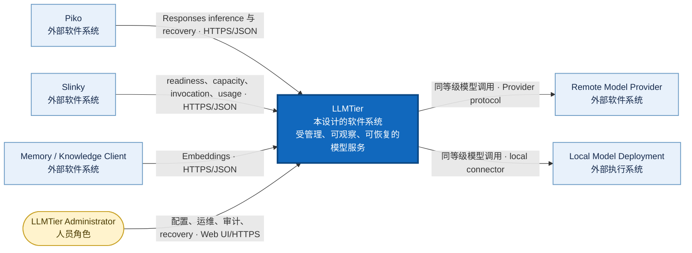
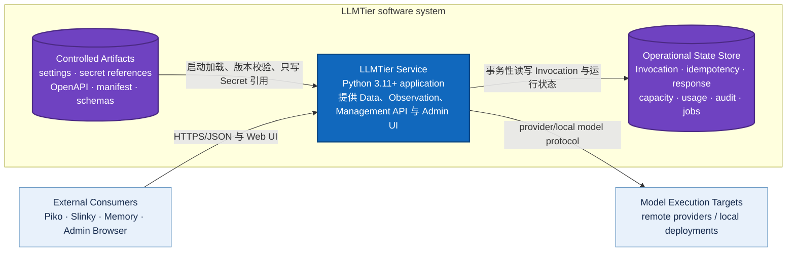
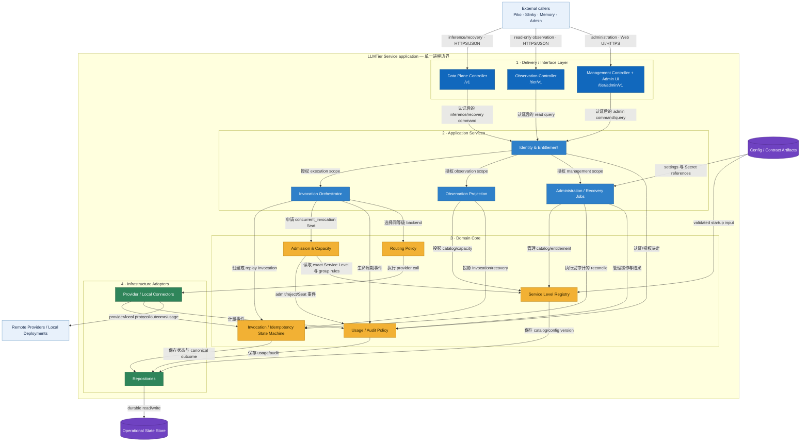
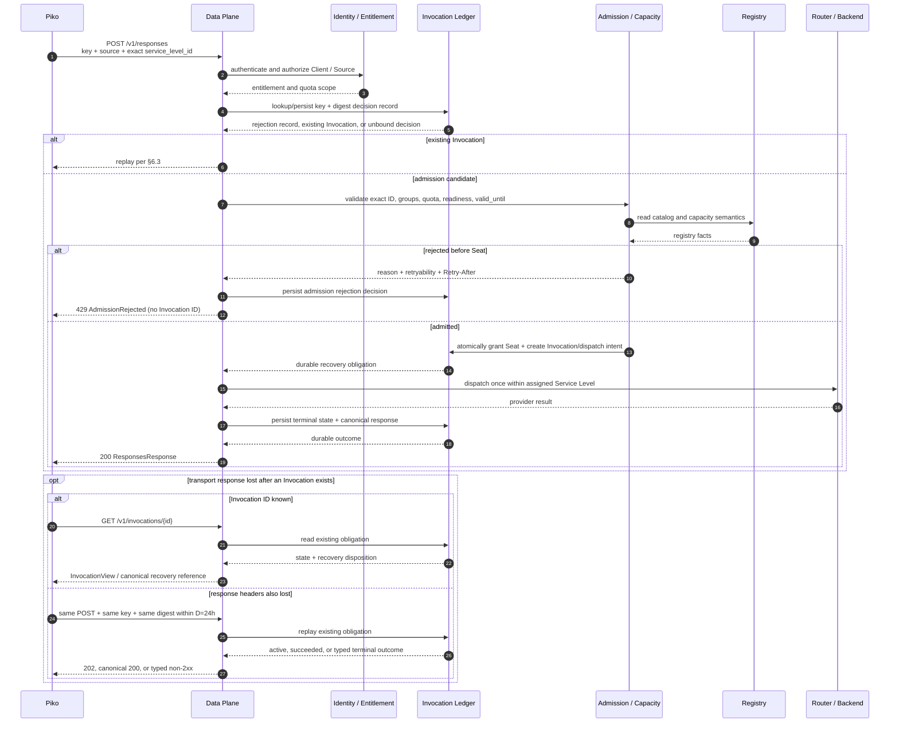

<!-- STD_DOCUMENT_COVER_BEGIN -->
# LLMTier V0.3 系统设计

| 文档字段 | 值 |
|---|---|
| Document ID | `llmtier-system-design` |
| Document Version | `0.3.1-draft.6` |
| Status | `In Review` |
| Project | `LLMTier` |
| Authority | `LLMTier` |
| Document Owner | LLMTier |
| Authors | llmtier |
| Created Date | `2026-09-06` |
| Last Modified Date | `2026-09-15` |
| Template Version | `4.0.0` |
| Template ID | `design.system` |
| Template Conformance | `tailored` |
| Tailoring Reference | `std-tailoring` |
| Migration Map Reference | none |
| Repository | `corezilla/LLMTier` |
| Canonical Path | `docs/20_system_design/llmtier-system-design.md` |
| Supersedes | `docs/30_subsystem_design/llmtier-service-design.md` |

> Reviewer、Approver、Approval Date 和 Release Tag 在进入相应状态时填写。Git commit/tag 是
> 外部不可变证据；不要在文档内容中伪造包含自身的 commit hash。
<!-- STD_DOCUMENT_COVER_END -->

> LLMTier 是本仓库完整的软件系统，不是 Slinky、Piko 或其他仓库内部的 subsystem。当前只有一个
> 部署、配置、状态、发布和 owner 边界；当前没有内部 subsystem design，因此不创建
> `docs/30_subsystem_design/` 文档。未来只有在
> LLMTier 内部形成可独立定义的真实子系统时，才新增 subsystem design。

## 1. 文档说明

本版按 STD `0.1.0-draft.26` 的 `design.system` `4.0.0` 采用 `software-system` profile。
§1–6、§8、§10–15、§17–18 适用；本项目不拥有板卡、FPGA、机箱或生产工艺设计，
故 §7、§9、§16 记录裁剪依据而不虚构硬件内容。§8.4 Admin Web UI 适用。
文档是 V0.3 候选目标设计，非生产实现证明；§3.3、§5 与 §8.1 的图整体是 Target 视图，
并非图内每个逻辑单元都已在现有源码中实现。
当前实现证据只在明确标为 Current 的段落中陈述。字段级权威仍为
`interfaces/openapi/llmtier-v0.3.openapi.json`，本文不自行创建第二套协议。

读者包括 LLMTier owner/实现者、Piko 与 Slinky consumer reviewer、Knowledge consumer 和运维。
外部项目只复核接口边界；LLMTier 对自身服务设计、部署、安全和管理事实负责。

## 2. 系统概览

LLMTier 为 Piko、Knowledge 等调用方解决“逻辑服务等级与物理模型供应解耦”的问题。调用方只选择
exact-case Service Level，例如 `Worker` 或 `Junior`；LLMTier 在自身边界内管理 Provider、Account、
Local Deployment、Pool、credential、容量和路由。没有该边界时，调用方会直接依赖供应商账号和模型名，
无法统一执行配额、公平调度、故障恢复和用量观察。

系统位于 Piko/Knowledge 与远程 Provider/本地模型之间，并向 Slinky 提供只读 Observation，向管理员
提供独立 Management API/Web UI。它不接收任务、Prompt 模板、STD 文档或 Project/Plan/IR 配置；
不执行 Agent 工具。外部输入是经过认证的 inference、recovery、observation 或 management request；
输出是 canonical model response、typed error/recovery state、Client-scoped observation 或受审计的管理结果。

代表主路径为：Piko 以 exact Service Level、canonical Source 和幂等 key 提交 non-stream Responses；
服务完成身份授权、digest/idempotency lookup、admission 和同等级 routing，在首次 backend dispatch 前保存
durable obligation，完成后保存 canonical Response 并返回。最主要等待点是 admission 后的受控 backend
执行；容量不足在 admission 前立即返回 typed rejection，未获得 Seat、未创建 Invocation、未 dispatch。
若响应丢失，Piko 用已知 Invocation ID 查询，或在 ID 也丢失时用原 namespace/key/digest 重放原 POST；
UnknownOutcome 只进入人工 reconcile。

目标系统是一个 Python 3.11+ 服务进程，内部由三个 API Controller、Identity/Entitlement、Registry、
Admission/Capacity、Invocation Ledger、Router/Connector、Usage/Audit 与 Admin/Recovery 构件协作；
Operational State Store 持有 Invocation、idempotency、canonical response、capacity、usage、audit 和 job。
Registry 是逻辑等级和兼容语义的唯一来源，Ledger 是调用事实与恢复义务的唯一来源。

V0.3 Target 仅含 Responses/Embeddings non-stream、Models、Responses recovery、Observation 和 Management。
Chat/SSE 属于 V0.4。Current `src/` 仍是 legacy baseline，目标 Controller、Registry、durable Ledger、
Management/UI 尚无 production wiring；因此 contract candidate 与 `overall.runtime_activation=false` 同时成立。
当前静态测试不构成 production evidence。

三项关键取舍：

1. 选择 exact Service Level + 单一 Registry，而不是 consumer 直接选择 Provider；收益是策略与凭据封装，
   代价是 Registry/admission 成为关键依赖；Registry 不可用时新调用 fail closed。
2. 选择 dispatch 前 durable obligation + M2-C，而不是 transport 失败后新 key 重派；收益是避免重复计费和
   重复副作用，代价是需要强一致 ledger 与至少 168h 结果/去重保留；存储不可用时不得 dispatch。
3. 选择 V0.3 non-stream Scope B，而不是同时引入 Chat/SSE；收益是先冻结唯一恢复语义，代价是 Piko 若确认
   Agent 必须 streaming 则需显式 scope amendment，不能暗建第二路径。

## 3. 产品应用与设计目标

### 3.1 问题与业务背景

现有 legacy 服务能路由部分模型调用，但尚未形成跨 Client 的统一逻辑等级、durable recovery、
Client-scoped Observation 和独立 Management contract。V0.3 目标是把这些职责收敛到 LLMTier 自身，
同时避免把 Slinky 的 Plan/IR 或 Piko 的 Agent/tool loop 引入模型服务边界。

### 3.2 用户与使用场景

| Use Case ID | 角色/触发 | 系统响应与可观察结果 | 失败结果 |
|---|---|---|---|
| LT-UC-001 | Piko 提交 Responses | exact-level admission、同等级 dispatch、canonical response/recovery reference | typed auth/admission/terminal error；UnknownOutcome 不重派 |
| LT-UC-002 | Knowledge 提交 Embeddings | non-stream embedding 与 usage | typed reject/error；不进入 Piko mandatory capture |
| LT-UC-003 | Slinky 查询规划影响 | Client-scoped readiness、capacity、Invocation、usage、compatibility | stale/unknown/unauthorized 显式返回，不补零 |
| LT-UC-004 | Admin 修改 Registry/Entitlement | version/ETag 检查、审计、受控发布 | version conflict、权限拒绝、Secret 不回显 |
| LT-UC-005 | Piko 在响应丢失后恢复 | 查询原 Invocation 或同 key/digest POST replay | 只返回既有 outcome；UnknownOutcome 进入人工处理 |
| LT-UC-006 | 新调用超过容量/配额 | admission 前立即 `429 AdmissionRejected` | 无 Seat、无 Invocation、无 backend dispatch；可按 Retry-After 重新 admission |

### 3.3 应用环境与系统边界

- V0.3 Scope B 仅含 Responses/Embeddings non-stream、Models、recovery、Observation 和 Management；
  Chat Completions、SSE 与 streaming recovery 属于 V0.4。
- Service Level ID exact、大小写敏感；禁止 lowercase、alias、Role selector 和跨等级 fallback。
- 唯一容量单位为 `concurrent_invocation`；direct、全部 shared/overlapping group、Client quota、
  readiness 和 `valid_until` 必须同时满足。
- M2-C 固定 `W=168h`、`M=24h`、产品自动恢复 deadline `D=24h`。
- V0.3 字段级机器 authority 只有 `interfaces/openapi/llmtier-v0.3.openapi.json`。
- 当前实现与批准目标必须分开陈述；静态 PASS 不等于 production 实现或 Runtime Activation。
- 不得新增 config path、selector、alias、fallback、第二 inference/recovery/management path。

| 参与者/相邻系统 | 权威职责 | 与 LLMTier 的边界 |
|---|---|---|
| Piko | Agent Runtime、assigned Service Level、SDK/recovery obligation | Data Plane HTTP consumer；不读取源码、配置或状态 |
| Slinky | Project、Plan、IR、Forecast/Risk/Action、Seat projection | Observation HTTP consumer；不做 admission 或 inference |
| Memory/Knowledge Client | Embeddings consumer | 只使用 Embeddings non-stream |
| LLMTier Admin | Provider、Registry、Client/Source、capacity、audit、recovery 管理 | 独立 Management credential/API/UI |
| Provider/Local Deployment | 执行物理模型调用 | 只由 LLMTier router/connector 访问 |

LLMTier 拥有本系统的 Data Plane、Observation、Management/Admin UI、Registry、admission、routing、
Invocation ledger、capacity、usage、audit 和 recovery。它不执行 Agent tool loop，不组合 Project/Plan/IR，
不取得外部项目的业务 authority。外部 reviewer 只复核其 consumer boundary，不取得 LLMTier 系统 ownership。

#### System Context（C4 Level 1）

**范围：** LLMTier 是中央黑盒；本图只显示使用者、相邻软件系统及双方关系，不展示内部实现。
本节、§5.1 和 §5.2 描述的是已批准但尚未激活的 V0.3 target architecture；它们不是 production
implementation/verification 声明。§8.2 另行标识当前可确认的源码基线。

图例：深蓝框是本次设计范围；浅蓝框是外部软件系统；黄色圆角框是人员角色；箭头文字同时说明目的与
跨进程协议。所有外部调用都终止于 LLMTier，不存在 consumer 到 Provider 的直连路径。

### 3.4 设计目标与成功条件

| Goal ID | 目标与边界 | 度量/目标值 | 验证方式与当前状态 |
|---|---|---|---|
| LT-G-001 | 唯一 inference path 和 exact Service Level | 跨等级 fallback=0；provider-direct path=0 | Contract/legacy scan；static covered，runtime BLOCKED |
| LT-G-002 | 零重复 recovery | 同 namespace/key/digest replay additional dispatch=0 | CT-REC-001/002；fixture PASS，runtime BLOCKED |
| LT-G-003 | 有限恢复保证 | D=24h；W=168h；M=24h | retention/crash test；policy frozen，long-run BLOCKED |
| LT-G-004 | 容量安全 | 每次新 Seat 满足 direct+all groups+quota+readiness+validity | CT-ADM-001/CT-OBS-001；static covered，runtime BLOCKED |
| LT-G-005 | 多调用方隔离 | 跨 Client 或未授权 Source 可见记录=0 | CT-AUTH/CT-SEC；runtime BLOCKED |
| LT-G-006 | V0.3 范围可判定 | Chat/SSE 成功响应=0；runtime activation=false 直到 gates 完成 | negative fixture/manifest；static PASS |

## 4. 功能与需求实现概览

### 4.1 功能总表

| Function ID | 输入→处理→输出 | 实现责任 | 状态/验收 |
|---|---|---|---|
| LT-F-001 | Responses/Embeddings request → auth、admission、routing → canonical response/error | Data Plane、Invocation Orchestrator、Router | Target；CT-DP-001/consumer capture BLOCKED |
| LT-F-002 | Registry data → exact-level catalog/compatibility → Models/ServiceLevel views | Registry、Observation Projection | Target；CT-REG-001 runtime BLOCKED |
| LT-F-003 | capacity/quota/readiness → all-constraints decision → Seat 或 admission rejection | Admission/Capacity | Target；CT-ADM-001 runtime BLOCKED |
| LT-F-004 | key/digest/Invocation → replay/recovery state → canonical outcome/manual reconcile | Invocation Ledger | Target；CT-REC runtime BLOCKED |
| LT-F-005 | runtime facts → Client-scoped projection → readiness/capacity/usage/audit | Meter、Observation Projection | Target；CT-OBS runtime BLOCKED |
| LT-F-006 | admin command → authorization/version/audit → config/job/recovery result | Administration、Management UI/API | Target；CT-MGT/UI BLOCKED |

### 4.2 功能详细说明与 L1–L8 判定

以下是对 Slinky L1–L8 的**设计可满足性**答复，不是 Implemented、Verified 或 runtime active 声明。
“建议调整”表示目标设计可支持，但冻结接口前仍需双方确认精确语义；不授权增加新 V0.3 endpoint。

| ID | 设计结论 | 目标方案与现有契约 | 待确认/验收边界 |
|---|---|---|---|
| L1 统一调用 | 可满足 | `POST /v1/responses` 使用 exact-case `model`=`service_level_id`；Registry 隐藏 Provider、Account、Pool；Piko 唯一 generation 路径为 Runtime → Piko → LLMTier | 以 pinned adapter capture 验证；不引入别名、Role selector 或跨等级 fallback |
| L2 能力目录 | 可满足 | `/v1/models`、detail 与 `/tier/v1/service-levels` 来自同一 Registry；`ServiceLevelView` 声明 kind、availability、context、modalities、structured_output、tool_calling、contract/SLO 与有效期 | 实际能力须由可验证 backend profile 支持；不可把两个等级做纯名称 alias |
| L3 Agent 必需能力 | 可满足（non-stream） | V0.3 Responses schema 已有多条 `message`、`function_call`、`function_call_output`、`tools`；LLMTier 只传递模型工具调用与工具结果，不执行工具 | Piko 须按 §11.2 的 `call_id`/`name`/`arguments`/`output` 形状对齐；如必须 streaming，先做 V0.3 scope amendment，不能暗启 SSE |
| L4 容量与排队 | 建议调整 | admission 同时检验 committed Seat、全部共享/重叠 Capacity Group、Client quota、readiness、有效期；V0.3 pre-admission 不排队，不满足时立即 429 且零 Seat/Invocation/dispatch | admission 后内部 execution queue 的最长等待、deadline 起点和到期 terminal mapping 尚需冻结；不能无限等待或悄悄换等级；active replay `202` 不等于新请求排队承诺 |
| L5 多调用方隔离 | 可满足 | authenticated Client + authorized canonical Source 为调用与恢复范围；SourceInstance 只作关联/观察；Entitlement/配额与公平调度在同一 admission 边界 | 多 Client/Source 和公平性 production evidence 是 activation gate；不接收项目 IR 或团队配置 |
| L6 用量与观察 | 建议调整 | Invocation 状态/错误、token usage、Service Level capacity 的 in-flight/queued/estimated wait、按 Source/Instance/Level/endpoint/status 的 usage 聚合已有候选 DTO；Unknown/Partial 保持 null | 费用/币种/计价来源与队列历史统计目前未在 V0.3 机器契约冻结；如 Slinky 必需，先修订单一 OpenAPI、fixture 与隐私/授权规则，未知费用不得写零 |
| L7 故障与恢复 | 可满足 | 未受理不产生已 dispatch Invocation；已受理的 Pending/Queued/Running、Failed、UnknownOutcome 分离；同 client/source/key/digest 恢复，已知 ID 用 GET，丢失头部用原 POST replay；UnknownOutcome 不重派 | M2-C `W=168h`、`M=24h`、`D=24h` 不变；crash/lost-response 零重复 dispatch 尚需 runtime 证据 |
| L8 独立管理 | 可满足 | `/tier/admin/v1` 与最小 Admin Web UI 管理 Provider/Account/Local Deployment、Registry/Pool、Client/Source/Entitlement、配额、Probe、Capacity、Usage、Audit、Recovery；Secret 只写不读 | 仍为 required target，不能因 Scope B 延后；实现、权限和 UI 正负测试尚未完成 |

LLMTier 不接收任务、Prompt 模板、STD 文档或 IR 团队配置。Slinky 管 Project/Plan/IR；
Piko 管 Agent Runtime、tool loop 和 durable adapter obligation；LLMTier 只管模型服务及其通用 Client/Source
identity、capacity/admission、routing、ledger 和观察。Knowledge 使用 Embeddings non-stream。
V0.3 仅含 non-stream Responses/Embeddings、Models、Responses recovery 查询；Chat 与全部 SSE 在 V0.4。

### 4.3 需求追溯

| 外部要求 | 本设计功能/章节 | LLMTier requirement | Contract/验证 |
|---|---|---|---|
| L1–L3 | LT-F-001/002；§11.2 | LT-FUN-001/002/008、LT-INT-001 | Piko control、OpenAPI、CT-DP-001/CT-REG-001 |
| L4 | LT-F-003；§6.3、§11.4、§13 | LT-CAP-001/002/003 | OpenAPI AdmissionRejected amendment、CT-ADM-001/CT-PERF-001 |
| L5 | LT-F-003/005；§15 | LT-SEC-001 | CT-AUTH/CT-SEC/CT-PERF |
| L6 | LT-F-005；§10、§11.3 | LT-OPS-001 | Slinky control、CT-OBS；cost schema Open Gate |
| L7 | LT-F-004；§6.3、附录 C | LT-REL-001/002 | recovery fixtures、CT-REC |
| L8 | LT-F-006；§8.4、§15.4 | LT-FUN-005、LT-SEC-002 | Management control、CT-MGT/UI |

完整 requirement-to-test 状态由 `docs/10_requirements/llmtier-v0.3-traceability.md` 管理；本表不替代它。

### 4.4 解决方案策略

策略是单一事实来源、分面权限、共享 Registry/ledger、dispatch 前持久化、fail closed 和有限恢复保证。
Data Plane、Observation、Management 使用不同 credential 与 DTO，但不得复制核心状态机。

本文按 C4/arc42 的缩放顺序阅读：§3.3 看系统与外界的关系；§5.1 看系统内可运行单元与数据存储；
§5.2 再放大唯一服务进程，解释分层和关键构件；§6、§8.1 分别描述动态行为与目标部署。这样不会在一张图中
混用 software system、process、component 和 datastore 四种抽象层级。

视图方法参考 [C4 System Context](https://c4model.com/diagrams/system-context)、
[C4 Container](https://c4model.com/diagrams/container)、
[C4 Component](https://c4model.com/diagrams/component) 和
[arc42 Building Block View](https://docs.arc42.org/section-5/)；这些来源只规定表达方法，不取得
LLMTier 的业务或设计 authority。

## 5. 总体结构

LLMTier 当前是一个系统、一个服务进程边界。框内 logical building block 不是已拆分的子系统，也不代表
独立部署的 subsystem。

### 5.1 Container View（C4 Level 2）

**范围：** 放大 LLMTier 系统边界，只显示可运行应用和 data store。C4 的 container 是应用或数据存储，
不是 Docker container，也不等同于本项目的 subsystem。

图例：蓝色矩形是可运行 application；紫色圆柱是 data store/artifact store；浅蓝框是边界外系统。
当前开发部署可由同一 host 上的目录承载两类 store；production persistence 技术仍是 Open Gate。

### 5.2 LLMTier Service Component View（C4 Level 3 / arc42 Level-1 Whitebox）

**范围：** 只放大上图的 `LLMTier Service` application。横向是请求来源和执行目标，纵向是接口、应用编排、
领域核心与基础设施适配层；持久状态放在服务边界外侧，以明确依赖方向。

图例：深蓝是接口层；浅蓝是应用编排；黄色是无 transport/persistence 细节的领域核心；绿色是基础设施
adapter；紫色圆柱是持久数据或受控 artifact；浅蓝外框是相邻系统。箭头表示调用/依赖方向，不表示数据
复制。三种 API 分面共享 IAM、Registry、Ledger 和审计事实，不形成三套实现。

### 5.3 物理与逻辑对应关系（Building Block Catalog）

下表补充 Component View 的职责与禁止项：

| Block ID / Owner | 负责；不负责 | Provided interface / 依赖 | 实现位置与状态 |
|---|---|---|---|
| LT-BB-API / LLMTier | 三个 HTTP 分面和 Admin UI；不复制领域状态机 | `/v1`、`/tier/v1`、`/tier/admin/v1`；依赖 IAM/Application Services | Target：计划在 `src/tier_service.py`/`src/server.py` 收敛；runtime BLOCKED |
| LT-BB-IAM / LLMTier | credential→Client、canonical Source 授权/Entitlement；不把 SourceInstance 当 recovery namespace | authz decision；依赖配置/credential store | Target：计划 `src/identity/`；未创建，runtime BLOCKED |
| LT-BB-REG / LLMTier | exact ID、catalog/version、capability、membership；不做 alias/Role mapping | Registry query/publish；依赖 Repository | Target：计划 `src/registry/`；runtime BLOCKED |
| LT-BB-ADM / LLMTier | all-constraints admission、Seat 与有界内部等待；不把 unknown quota 当可用 | admit/release/reject；依赖 IAM、Registry、Ledger | Target：计划 `src/admission/`；runtime BLOCKED |
| LT-BB-LEDGER / LLMTier | digest、decision record、Invocation、dispatch intent、canonical response、tombstone；不对 UnknownOutcome 重派 | invocation/recovery repository | Target：计划 `src/ledger/`；durability BLOCKED |
| LT-BB-ROUTER / LLMTier | 同一等级内选择 backend 并调用 connector；不跨等级 fallback | backend dispatch；依赖 Registry/Admission | Current legacy：`src/router_core.py`、`src/backends/`；V0.3 wiring BLOCKED |
| LT-BB-METER / LLMTier | 接收 auth/admission/invocation/backend/admin 事实，生成 usage/audit；不将 unknown 补零 | meter/audit sink；依赖 Ledger/Repository | Current partial：`src/provider_usage.py`、`src/stats*`；Target wiring BLOCKED |
| LT-BB-OBS / LLMTier | Client-scoped readiness/capacity/invocation/usage；不暴露 physical credential | `/tier/v1` projection；依赖 REG/ADM/LEDGER/METER | Target：计划 `src/observation/`；runtime BLOCKED |
| LT-BB-ADMIN / LLMTier | inventory、secret-write、probe、publish、job、recovery；不回显 Secret | Management API/UI；依赖 IAM/REG/LEDGER/METER | Current legacy UI：`src/web/tier.html`；V0.3 target BLOCKED |
| LT-BB-REPO / LLMTier | 事务、retention、版本与恢复；不允许 dispatch 绕过 durable write | repository ports；依赖 Operational State Store | Target：计划 `src/repositories/`；engine/HA Open Gate |

源码目前采用 flat `src/` module/package layout。是否把 logical building block 拆成真正 subsystem，必须以独立
owner、部署或发布边界为依据，不能仅按类或目录命名。

## 6. 工作模式与端到端流程

运行模式分为启动校验、Ready admission、Degraded/NotReady 拒绝新 Seat、受控关闭和
durable recovery。模式切换不得清除已持久化的 Invocation obligation；capacity snapshot
失效立即禁止关联 Seat 的新 dispatch，已 admission 的 in-flight Invocation 仅在安全边界收敛。

### 6.1 工作模式矩阵

| Mode ID | 模式 | 输入/处理/输出 | 容量与限制 | 进入/退出条件 |
|---|---|---|---|---|
| LT-MODE-START | 启动校验 | config/contract/store → validate → readiness | 不允许新 Seat | 全部 required dependency Ready 后进入 READY；失败进入 NOT_READY |
| LT-MODE-READY | 正常服务 | request → auth/admission/dispatch → response | all-constraints；pre-admission 不等待 | readiness 有效；依赖失效转 DEGRADED/NOT_READY |
| LT-MODE-DEGRADED | 降级/拒绝 | observation 可读；新 inference fail closed | 新 Seat=0；不撤销已 admission 调用 | 依赖恢复并重新验证后回 READY |
| LT-MODE-RECOVERY | 恢复 | original identity → ledger/replay → existing outcome | 不授权新 backend dispatch | obligation terminal/reconciled 后退出 |
| LT-MODE-DRAIN | 受控关闭/升级 | stop admission → drain in-flight → persist/stop | 新 Seat=0；有界 drain 待部署决策 | drain 完成后 STOPPED；失败保留 durable obligation |

### 6.2 正常数据流：首次 Responses 调用

1. Piko 提交 credential、canonical Source、`Idempotency-Key`、`X-Tier-Client-Request-ID` 和 exact model；
2. LLMTier 认证、授权、规范化请求并计算 digest，创建或读取 content-free IdempotencyDecisionRecord；
3. 若该 key 已绑定 Invocation，直接进入 replay；若为可重试的既有 admission rejection 且尚未到
   `Retry-After`，重复返回相同 rejection；不得创建第二 Invocation；
4. 对未绑定 Invocation 的请求联合检查 Registry、entitlement、capacity groups、quota、readiness 和有效期；
5. admission 未通过时保存 reason/retryability/decision expiry，立即返回 `429 AdmissionRejected`；
   不授予 Seat、不创建 Invocation、不保存 dispatch intent、不调用 backend；
6. admission 通过时，在一个原子事务中授予 Seat 并创建 Invocation、dispatch intent 和 recovery obligation；
7. router 只在同一 Service Level 内执行一次 dispatch；成功时保存 canonical `ResponsesResponse` 并释放 Seat。

### 6.3 异常、过载与恢复流程

| Invocation 状态 | 同一 POST replay | 后续动作 |
|---|---|---|
| Pending/Queued/Running | `202 InvocationAccepted` + Location/Invocation ID/Retry-After | 查询 Invocation readiness |
| Succeeded | 原 endpoint canonical `200` body | 零次 dispatch；必要时 Response GET |
| Failed | `502 invocation_failed` | `retryable=false` |
| Cancelled | `409 invocation_cancelled` | `retryable=false` |
| UnknownOutcome | `503 invocation_outcome_unknown` | manual reconcile；不得重派 |

已有 Invocation ID 时查询 `GET /v1/invocations/{id}`。响应头也丢失、没有 ID 时，在 `D=24h` 内使用原
client/source/body/digest/key 重放同一 POST；这是 transport recovery，不是新 Attempt、endpoint、key 或
Backend redispatch 授权。

### 6.4 模式切换与状态迁移

启动验证 config、Registry/manifest、ledger readiness、required Service Levels 与 Observation readiness。
优雅关闭先停止新 admission，再受控收敛 in-flight Invocation。非优雅退出依赖 durable intent/ledger
恢复，不默认重派。升级与回滚必须保持唯一 Registry/ledger 和单路径，不能运行新旧并行 inference。

## 7. 硬件实现方案

不适用：LLMTier 是独立软件服务，当前设计不拥有板卡、器件选型、时钟、电源或信号完整性。
运行 host 与远程/本地模型执行目标是外部基础设施依赖，软件部署、资源与故障域写于 §8.6；
若未来拥有专用硬件设计责任，应重新裁剪并建立硬件设计基线。

## 8. 软件实现方案

### 8.1 软件架构与部署

当前可确认的开发运行边界是一个 Python 3.11+ LLMTier 进程；下图在该单进程边界上展示尚未接线的
V0.3 目标 API、状态与执行依赖：

| 位置/入口 | 作用 |
|---|---|
| `src/` | 单服务 Python 源码 |
| `config/settings.json` | Git-ignored 默认配置；`--settings`/`LLMTIER_CONFIG` 覆盖 |
| `config/secrets/` | Git-ignored、本机 owner-only Secret 文件 |
| `state/` | Git-ignored 默认状态、统计和 trace；`LLMTIER_STATE_DIR` 覆盖 |
| `interfaces/` | OpenAPI、compatibility、Schema 和 vectors authority |
| `llm-tier` / `python3 -m tier_service` | 安装后/checkout 服务入口 |
| `llm-tier-cli` / `python3 -m cli` | 安装后/checkout operator 入口 |

上图是 V0.3 单节点目标映射，不是现有 server 已提供 Data/Observation/Management/UI 的证明。
当前 server 仅接受 localhost、loopback、RFC1918 或 IPv6 ULA bind/origin。production service manager、
TLS/auth、container、database、HA、RPO/RTO、故障域和多实例 topology 仍是 Open Gate。

### 8.2 模块设计与代码映射

§5.2 是目标 logical component view，不代表这些模块已在源码实现。Current `src/server.py`、
`src/router_core.py`、`src/tier.py`、`src/quota_manager.py`、`src/provider_usage.py`、
`src/backends/` 与 `src/web/tier.html` 构成旧接口与路由基线；目标 Registry、durable ledger、
三个受权 Controller 和 Admin UI 需按同一服务边界接线。不得仅凭现有目录名称宣称目标能力已实现。

### 8.3 通信、配置与状态管理

- 身份：authenticated `client_id`；`X-Tier-Source-ID` 必须在该 Client 下获授权。
- correlation：`X-Tier-Source-Instance-ID` 不形成 recovery namespace；client request ID 不替代幂等 key。
- 配置：只有 `--settings`/`LLMTIER_CONFIG`、`LLMTIER_STATE_DIR` 和既有 trace override；不回读 Slinky。
- Secret：create/rotate 只写不读；DTO、UI、log、audit、backup report 不得包含可逆值。
- ETag：Models、Observation、admission、manifest 引用同一 exact ID/catalog version 与语义；各 endpoint 的
  ETag 各自校验本 resource representation，live capacity/usage 变化不要求其他 DTO ETag 同步。
- 兼容：破坏兼容性的 Service Level 语义使用新 ID 或 API major；unsupported surface fail closed。
- 保留：active record 至 terminal；terminal 后 digest/tombstone、Invocation view 与 canonical Response
  至少 168h。canonical Response 在冻结的 168h recovery window 内仍可恢复；短于任一下限的配置无效并阻断 activation。

### 8.4 页面与交互

Admin Web UI 是 V0.3 required target，与 `/tier/admin/v1` 使用同一权限和资源语义：
Provider/Account/Local Deployment、Model discovery、Service Level/Pool、Client/Source/SourceInstance、
Entitlement、Probe/readiness、Capacity/Usage/Audit/Recovery。Secret create/rotate 只能一次性写入，
页面不得回显；危险 recovery action 需要受权、并发校验、审计和明确结果。
现有 `src/web/tier.html` 不证明该目标 UI 已接线。

### 8.5 软件可靠性与开发平台

实现须先持久化 key/digest decision；admission 成功后在 backend dispatch 前原子持久化 Seat、Invocation、
dispatch intent 与 recovery obligation；
重启后不盲派，store 不可用时 fail closed。开发基线为 Python 3.11+，安装与 CLI 入口见 §17；
production service manager、HA、备份和恢复演练尚无已批准证据。

### 8.6 部署与运行环境

§8.1 图为目标单节点拓扑；production 节点数、TLS termination、状态存储、故障域、容量/性能预算
仍是 Open Gate。无论最终如何部署，三个 API 分面不得形成第二套 Registry 或 ledger。

## 9. 可编程逻辑与专用处理单元

不适用：LLMTier 本项目没有 FPGA、RTL、DSP 或自有专用处理单元。远程 Provider 或本地模型硬件
是被调用的执行目标，不归 LLMTier 本设计的可编程逻辑责任范围。

## 10. 数据、描述符与存储结构

### 10.1 业务数据流

Inference request 进入 Data Plane 后只形成两类持久事实：pre-admission 的 IdempotencyDecisionRecord，
以及 admission 成功后与其一一绑定的 Invocation。Provider result 先提交为 terminal Invocation/canonical
Response，再对 Client 返回；Observation 只读取投影，Management mutation 通过审计事务改变配置事实。

### 10.2 描述符与元数据流

每条业务事实至少携带 authenticated client、canonical source、可选 source instance、exact Service Level、
client request ID、record/config/catalog version 和时间。Idempotency namespace 另含 endpoint/version/key；
digest 覆盖规范化 body 与影响语义的 header。Provider/account identity 仅在 LLMTier 内部关联，不进入
普通 consumer response。

### 10.3 状态表、缓存与持久化

核心业务数据为 Client/Source/SourceInstance、ServiceLevel、Pool/CapacityGroup、Invocation、
CanonicalResponse、Usage、RecoveryItem、AdminJob；Schema authority 见 §11 和附录 A。
Invocation active 状态 Pending/Queued/Running；terminal 状态 Succeeded/Failed/Cancelled/UnknownOutcome。
只有真实测得或可归属的 token、费用和队列估计才可写数值；Unknown/Partial 必须保留 null/状态，
不能补零。持久化引擎、事务实现、备份和清理策略需符合 M2-C 保留下限，详见附录 C。

| Record | Owner/写入点 | 一致性与生命周期 |
|---|---|---|
| IdempotencyDecisionRecord | Ledger；digest 计算后 | key/digest 唯一；rejection 可按 decision expiry 重试；绑定 Invocation 后不可换绑 |
| Invocation/DispatchIntent | Ledger + Admission 原子事务 | admission 成功才创建；active 到 terminal；UnknownOutcome 不自动改写 |
| CanonicalResponse/Tombstone | Ledger | terminal 后至少 168h；privacy 配置不得破坏冻结下限 |
| Capacity/Seat | Admission | 同一原子边界 grant/release；snapshot validity 与全部 group 同时校验 |
| Usage/Audit | Meter | auth/admission/invocation/backend/admin 事件均可关联；Unknown/Partial 不补零 |
| Config/Registry | Admin/Registry | version/ETag/effective_at；Secret 只保存受控引用或加密值，不回读 |

### 10.4 容量与带宽计算

容量单位只有 `concurrent_invocation`。可新增 committed Seat 的上限是 direct availability、每个
shared/overlapping Capacity Group availability、Client/Source entitlement quota 和 readiness/validity
共同约束的最小可行集合，而不是各值相加。吞吐、token/s、费用和排队等待不能从 Seat 数直接推导；
它们需按固定 Provider/model/config/workload 实测。存储容量需覆盖 active obligations 以及 terminal 后
至少 168h 的 tombstone、Invocation view 和 canonical Response；具体字节预算待真实流量/内容保留策略冻结。

## 11. 接口与通信协议

### 11.1 接口总表

| 分面 | V0.3 目标接口 | 权威 |
|---|---|---|
| Data Plane | `POST /v1/responses` non-stream、`POST /v1/embeddings` non-stream、Models list/detail、Invocation/Response GET | `interfaces/openapi/llmtier-v0.3.openapi.json` |
| Observation | `/tier/v1` readiness、Service Level、capacity、Invocation list/detail、usage、compatibility | 同一 OpenAPI |
| Management | `/tier/admin/v1` 配置、目录、授权、容量、审计、Job、Recovery | 同一 OpenAPI |
| V0.4 | Chat Completions、Responses/Chat SSE 与 streaming replay | 非 V0.3 current path；必须 fail closed |

### 11.2 Data Plane 与 Agent tool loop

Piko 的 `model` 必须是 Registry 返回的 exact `service_level_id`，不做 lowercase 或别名映射。
`ResponsesRequest.input` 可为字符串或有序输入项；多轮消息使用 `type=message`、
`role=system|developer|user|assistant` 和 content。可用 `tools[]`、`tool_choice` 与
`parallel_tool_calls` 请求模型生成 `type=function_call`，其 `call_id`、`name`、`arguments`
返回 Piko；Piko 执行工具后以 `type=function_call_output`、相同 `call_id` 和字符串 `output`
在后续 Responses 请求中回传。LLMTier 仅验证、透传和调用模型，不执行工具、不储存 Prompt 模板。
同一逻辑 Invocation 的 transport recovery 复用原 key/digest；下一轮新的模型调用需要新的 logical
Invocation，但工具结果格式与上下文组装由 Piko adapter 的 pinned capture 确认。V0.3 `stream:true`
和 Chat 请求须按 unsupported feature/endpoint fail closed；若 Piko 必须 streaming，先做 scope amendment。

### 11.3 控制、管理与观测协议

`Idempotency-Key` 标识同一 logical Invocation；`X-Tier-Client-Request-ID` 只用于关联，不可代替前者。
`X-Tier-Source-ID` 是已授权的 canonical Source；SourceInstance 仅用于 observation/correlation/audit。
Observation 可在已授权范围按 Source/Instance/Service Level/endpoint/status 过滤与聚合；
Management 只接受独立管理权限。ETag 验证各 resource 的自身表示，不要求不同 DTO 的 ETag 相等。

### 11.4 排队、拒绝与超时待冻结项

V0.3 candidate 选择 pre-admission 不排队：约束不满足立即返回 `429 AdmissionRejectedEnvelope` 与
`Retry-After`，不返回 Location/Invocation ID，Seat/Invocation/backend dispatch 都为零。同 key/digest
在 decision expiry 前重放相同决定，到期后才重新 admission，且不得改变 Service Level。
`Queued` 只表示 admission 成功并已有 Seat/Invocation 后的内部 execution wait；active replay 可对其返回
202，但不能把 202 借作新请求 admission queue。V0.3 activation 前仍须在**现有单一 OpenAPI** 冻结
内部 queue/deadline 上限、timeout 起点、到期后的 Failed/Cancelled mapping、error code、Seat release、
公平性与观察字段；未冻结时不能承诺内部等待能力。费用字段同样待计价来源、币种、未知语义和授权范围
冻结后进入单一 Schema。

## 12. 可靠性、维护与升级

### 12.1 故障模型与可靠性机制

| Failure ID | 触发/检测 | 系统响应与数据影响 | 恢复/验证 |
|---|---|---|---|
| LT-FAIL-001 | auth/entitlement 失败 | fail closed，记录无 Secret 审计；无 Invocation/dispatch | 修复授权后新 admission；CT-AUTH |
| LT-FAIL-002 | capacity/quota/readiness 不满足 | 429 AdmissionRejected；无 Seat/Invocation/dispatch | Retry-After 后原 key/digest 可重新 admission；CT-ADM-001 |
| LT-FAIL-003 | transport response lost | 保留原 obligation，不以新 key 重派 | §6.3 recovery；CT-REC |
| LT-FAIL-004 | backend 失败/结果未知 | Failed 或 UnknownOutcome；后者只人工 reconcile | terminal fixture/crash injection |
| LT-FAIL-005 | ledger/store 不可用 | readiness NotReady、停止新 admission/dispatch | store 恢复和一致性检查后重开；durability test |
| LT-FAIL-006 | snapshot/Registry 失效 | 新 Seat=0；已 admission 调用仅安全收敛 | refresh/revalidate；CT-OBS/REG |

### 12.2 状态指示、监控与故障定位

Readiness、capacity、Invocation、usage、provider health、recovery backlog、audit/store health 均提供
机器可读状态。诊断以 client request ID、Invocation ID、Client/Source、Service Level、backend reference
和 record version 关联；unknown/partial 独立标识。日志、metric、trace 和 audit 不得泄漏 Secret、Prompt/
output 内容或跨 Client 数据。告警阈值、刷新周期和 production retention 随部署/SLO 冻结。

### 12.3 维护、升级与回滚

§6.3 和附录 C 定义 lost-response recovery；无 ID 用原 namespace/key/digest replay，有 ID 查询原
Invocation。升级先停止新 admission、排空或持久化 in-flight obligation，再校验 schema/config/Registry
兼容；失败只回到兼容且未撤销的已知版本。回滚不得丢弃 ledger/canonical response、缩短 M2-C 保留期或
同时运行两条 inference path。所有管理/恢复动作必须授权、version checked、审计且可判定终态。

## 13. 性能、扩展与兼容性

### 13.1 性能模型与预算

唯一容量单位 `concurrent_invocation`；direct 与全部共享/重叠 Capacity Group、Client quota、
readiness、`valid_until` 同时成立才可新增 committed Seat。`request_quota_remaining=null` 阻断新增
committed Seat；burst 不计入 committed capacity。`in_flight_requests`、`queued_requests` 和
`estimated_queue_wait_ms` 是观察数据，不等同预留容量或吞吐承诺。throughput、latency、
fairness、backend SLO、队列等待预算与生产 topology 均须在固定 workload 后测量和冻结；
无实测时不得声明达标。Service Level 兼容语义变化须新 ID 或 API major，禁止暗中跨等级替换。

### 13.2 瓶颈与资源余量

关键瓶颈依次是 Provider/local backend 并发、各重叠 Capacity Group、Client quota、ledger transaction、
connection pool 和 response retention store。任何一项 unknown 或过期均不能当作余量。admission 拒绝、
internal queue wait、backend latency 和 store latency 必须分项测量，避免用端到端均值掩盖容量瓶颈。

### 13.3 扩容方案与兼容矩阵

扩容只可在同一 Service Level 的 approved backend set 内增加 Provider/Account/Deployment 或调整 Pool/
Capacity Group，并重新发布 Registry/capacity version。跨等级 fallback 禁止。多实例 deployment 在选择
共享 ledger、Seat 原子性、leader/fencing 和故障域前仍是 Open Gate。破坏 Service Level 兼容语义的变更
创建新 ID 或 API major；V0.3 consumer 不协商 Chat/SSE。

## 14. 可测试性与验收设计

### 14.1 测试支持与观测点

静态 OpenAPI/manifest/fixture/STD 检查只证明候选文档自洽。runtime activation 还需 pinned Piko
adapter、Knowledge Embeddings consumer、Slinky Observation、Management API/UI、安全隔离、
容量语义、实际公平性、crash/lost-response 零重复 dispatch、168h retention 和 legacy removal 证据。
测试通过受权的 Data Plane/Observation/Management 接口、mock Provider/local connector、可控 clock/
store fault 和审计读取点注入/观察；测试身份不能绕过正常授权，fixture 不使用真实 credential/Prompt。

### 14.2 测试数据源、自检与环回

OpenAPI/vectors 提供标准正负输入；mock backend 覆盖成功、timeout、lost response、Failed 和
UnknownOutcome；capacity fixture 覆盖 direct/group/quota/validity 组合；重启测试重放 durable store。
startup self-check 只证明 config/Registry/store schema 可加载，不证明 Provider、consumer 或 168h retention；
退出测试模式后必须清理临时 Client/Source/credential 并保留无敏感内容的 evidence。

### 14.3 验证与验收矩阵

| Quality ID | 场景与 oracle | 当前状态 |
|---|---|---|
| LT-QR-001 | 同 namespace/key/digest replay additional dispatch=0 | Fixture PASS；runtime BLOCKED |
| LT-QR-002 | UnknownOutcome 只 manual reconcile | Contract PASS；runtime BLOCKED |
| LT-QR-003 | Snapshot 失效立即阻止新 Seat/dispatch | Fixture PASS；production BLOCKED |
| LT-QR-004 | Registry provenance 一致，各 resource ETag/304 自洽 | Static PASS；runtime BLOCKED |
| LT-QR-005 | 同 Client 已授权多 Source 正例；未授权 Source/跨 Client 负例 | Static PASS；runtime BLOCKED |
| LT-QR-006 | Secret 在 API/UI/log/audit 中不可读 | Schema PASS；runtime BLOCKED |
| LT-QR-007 | 24h recovery 与 terminal 后 168h retention | Policy frozen；长时证据 BLOCKED |
| LT-QR-008 | Chat/SSE/stream V0.3 fail closed | Fixture PASS；runtime BLOCKED |
| LT-QR-009 | Management/Observation pagination、ETag、unknown/partial 正确 | Static PASS；runtime BLOCKED |
| LT-QR-010 | pre-admission reject 无 Seat/Invocation/dispatch，decision replay 自洽 | Schema/fixture PASS；runtime BLOCKED |

Piko 的 Responses 正负 capture 应包括多轮 message、function_call、`call_id` 关联的
function_call_output、structured output、工具能力为 false 时的 typed rejection、non-stream 与
`stream:true` fail closed；不能以 stock SDK 支持为 LLMTier runtime 已实现的证据。
排队须测试有界等待、到期、拒绝、取消与同 key replay 的零重复 dispatch；Observer 须测试
queued/in-flight/estimated wait、token 与费用 Unknown/Partial、按 Source/Level 聚合以及跨 Client 负例。
L4/L6 的未冻结字段不能以“测试将来补”代替单一 OpenAPI 设计修订。

throughput、latency、fairness 和 Provider measured SLO 必须在固定 provider/model/config/topology/workload
后测量；当前无 production baseline。

## 15. 信息安全架构

### 15.1 资产、入口与信任边界

| Asset ID | 资产/入口 | 信任边界与保护目标 | Owner/状态 |
|---|---|---|---|
| LT-ASSET-001 | Client/Source credential；三个 HTTP 分面 | 每次跨网络进入 LLMTier 均认证、授权、限额；网络可达性不等于可信 | IAM / Target |
| LT-ASSET-002 | Provider/Local credential；Management secret-write | 仅 Connector/secret manager 可读；consumer、UI、log、audit 不得回显 | Admin/Connector / Target |
| LT-ASSET-003 | Prompt/output/canonical response；Data Plane | Client/Source scope、传输保护、retention/delete policy | Ledger / Target |
| LT-ASSET-004 | Registry/config/capacity；Management | version/ETag、授权发布、审计、回滚 | Registry/Admin / Target |
| LT-ASSET-005 | Invocation/idempotency/usage/audit；store | 完整性、隔离、保留、备份恢复和防未授权修改 | Repository / Open Gate |

外部 Client、Admin Browser、Provider/Local Deployment 和 host/store 是不同信任域；同一内网不自动合并。
跨域连接由 §11 的 IF path 标识。Target 图未画出的 TLS termination/secret manager/store encryption
仍是 production Open Gate，不得以“内网部署”关闭。

### 15.2 身份认证与授权

| 主体 | 允许范围 | 决定点与拒绝行为 | 撤销/验证 |
|---|---|---|---|
| Piko/Knowledge Client | 已授权 Source、Service Level 和 Data Plane | IAM 在创建 decision/Invocation 前校验；默认拒绝，无 dispatch | credential/Entitlement 撤销后新请求拒绝；CT-AUTH |
| Slinky Observer | Client 下已授权 Source 的只读 Observation | IAM + Observation Projection；禁止 mutation/跨 Client | scope/credential 失效即拒绝；CT-OBS/SEC |
| LLMTier Admin | 被授予的资源和危险 action | 独立 admin credential、resource version、审计；默认拒绝 | 会话/credential 撤销和权限负测；CT-MGT/SEC |
| Service/Connector | 最小范围的 Provider/Store access | workload identity 或受控本地权限；依赖不可用时 fail closed | rotation/restart test；production BLOCKED |

authenticated Client + canonical Source 是 Data Plane recovery namespace；SourceInstance 仅用于规定的
correlation/observation/audit。同一 Client 多 Source 的 Observation 由授权范围决定，filter 不建立新权限。

### 15.3 密钥、凭据与敏感数据

Provider/API Secret 通过 Management create/rotate 一次性提交，响应只返回引用和 metadata；存储层只向
授权 Connector 解封。日志、trace、audit、fixture、backup report 和 UI 不保存可逆 Secret。
传输必须使用 production TLS；开发 trusted HTTP 只允许已限定的本地/私网环境且不构成 production 模式。
轮换失败阻断依赖该 credential 的新 dispatch，不静默使用未知旧值；撤销后的缓存/session 失效规则、
at-rest encryption、backup key 和恢复流程需在 production security baseline 冻结。
原始 Prompt/output retention 可以独立配置，但 canonical Response 在 M2-C 168h 窗口内必须可恢复；
不满足冻结下限的配置无效并阻断 activation。

### 15.4 控制面、管理面与调试面防护

| 入口 | 允许操作 | Target 防护/关闭条件 | 负向验证 |
|---|---|---|---|
| `/tier/admin/v1` | inventory、Registry、Entitlement、capacity、Job、Recovery | 独立认证、RBAC、version/If-Match、Idempotency-Key、审计；依赖不健康时危险写入 fail closed | 未授权、跨 scope、stale version、重放 |
| Admin Web UI | 同一 Management API 的交互 | 不另建后门接口；CSRF/session/input/output encoding、Loading/Empty/Error；Secret 不回显 | browser auth/session/secret tests |
| `llm-tier-cli` | 本机 operator action | OS owner 权限与同一 domain policy；不得绕过 Registry/Ledger | 非 owner、非法参数、audit failure |
| debug/trace | 受控诊断 | production 默认关闭敏感 payload；启用/退出需授权和审计 | Prompt/Secret 泄漏扫描 |

### 15.5 启动、升级、回滚与供应链信任

发布 artifact、dependency lock、OpenAPI/manifest/schema/config 均需版本与摘要；启动在开放 admission 前验证
兼容性和来源。升级只接受受批准来源，迁移前保存可恢复 backup，失败只回到兼容且未撤销的已知版本；
不得回滚到会缩短 retention、破坏 ledger schema 或重新启用 legacy inference path 的版本。
签名机制、SBOM/dependency policy、artifact registry 和信任根尚未选型，是 activation Open Gate。

### 15.6 威胁、审计与安全验证

| Threat ID / 路径 | 缓解/审计 | 验证与剩余风险 |
|---|---|---|
| LT-THR-001 未授权/跨 Client 访问 | IAM default-deny；记录主体、scope、结果，不记录 Secret/content | CT-AUTH/SEC；runtime BLOCKED |
| LT-THR-002 畸形 Prompt/tool/schema 或资源耗尽 | strict schema、大小/并发/配额限制、typed rejection | negative/fuzz/load；阈值待冻结 |
| LT-THR-003 Secret/Prompt/output 泄漏 | scoped access、redaction、只写 Secret、retention policy | DTO/log/backup scan；storage encryption Open Gate |
| LT-THR-004 idempotency collision/replay | client+source+endpoint+key namespace、digest conflict、ledger uniqueness | CT-REC/AUTH；runtime BLOCKED |
| LT-THR-005 Registry/config 越权或回滚 | admin authz、version、audit、artifact provenance | CT-MGT/REG；supply-chain机制 Open Gate |
| LT-THR-006 audit/store 失败后继续执行 | mutation/admission fail closed，readiness NotReady | fault injection；runtime BLOCKED |

审计记录至少包含可信时间、主体、Client/Source、action/resource、request/Invocation correlation、决定与版本；
写审计失败时不得执行相应危险 mutation 或新 dispatch。审计访问本身需要授权和记录，保留期随安全/
合规基线冻结。上述 Target 控制均未以静态 Schema 冒充已实现或已验证。

## 16. 结构、热、工艺与安全设计

不适用：本项目不拥有机箱结构、热设计、PCB 工艺、EMC 或硬件制造测试。
host 资源、功耗和 Provider 运行环境属于部署/采购约束，待 §8.6/§13 的 production topology 确定。

## 17. 实现计划

当前只确认设计，不请求 runtime activation。每项完成后保存独立 Review、Contract Test 和 runtime
evidence，不能用本文状态替代。

| 顺序 | Function/Block | 变更与交付物 | 依赖 | Owner | 完成条件 | 回滚边界 |
|---:|---|---|---|---|---|---|
| 1 | LT-F-003 / ADM+LEDGER | 在唯一 OpenAPI/fixture 冻结 AdmissionRejected；实现 decision record 与原子 Seat/Invocation | Slinky/Piko review、store ADR | LLMTier | admission 正负/重放/零 dispatch contract tests PASS | 不改变现有 terminal recovery 状态；可撤回未激活 candidate |
| 2 | LT-F-001/004 / API+LEDGER | `src/` 实现 Responses/Embeddings/Models/recovery 与 durable obligation | 1、persistence decision | LLMTier | crash/lost-response additional dispatch=0 | 保持 legacy 与 V0.3 不同时激活 |
| 3 | LT-F-002/003/005 / REG+ADM+OBS | Registry、capacity、Client/Source isolation 和 Observation wiring | 1–2 | LLMTier | CT-REG-001、CT-OBS-001、CT-AUTH-001、CT-PERF-001 所需 runtime evidence PASS | Registry/version/store 可回退且不复活旧 selector |
| 4 | LT-F-006 / ADMIN+METER | Management API、Admin UI、Secret、usage/audit/recovery jobs | security baseline、1–3 | LLMTier | CT-MGT/UI/SEC PASS；audit failure fail closed | 关闭 UI/management mutation，不影响 recovery read |
| 5 | Consumer/activation | Piko tool/recovery capture、Knowledge Embeddings、Slinky observation、168h retention/fairness | 1–4 | 各接口 Owner | manifest 所列 production gates 全部有不可变 evidence | activation 保持 false；不建 fallback |

当前安装入口为 `python3 -m pip install -e .`、`llm-tier`/`llm-tier-cli`；checkout 等价入口为
`PYTHONPATH=src python3 -m tier_service`/`python3 -m cli`。具体新 package 路径在实现 PR 中按 §5.3
计划位置建立；若实际边界不同，先更新设计而不是悄悄形成第二结构。

## 18. 设计决策、风险与未决项

### 18.1 设计决策

| Decision | 状态 | 来源 |
|---|---|---|
| LLMTier 是独立 system、单服务 repo | Owner directed | 用户 2026-09-09 指示 |
| Authority 分离与唯一 inference path | Candidate accepted | `S-20260906-59891d73fa13` |
| Scope B；Chat/SSE 移到 V0.4 | Frozen | `S-20260906-2f9539048493` |
| M2-C `W=168h`、`M=24h`、`D=24h` | Frozen | `L-20260906-12940a96e148`、`P-20260906-c14b4af35ac3` |
| Amendment 4 contract candidate | Slinky accepted | `S-20260906-1e12f5e61d73` |
| Admission rejection/decision record amendment | Candidate; not active | 本设计 draft.6 / OpenAPI amendment 5，待 consumer review |

新 persistence/HA/deployment、队列超时及费用计价等重大选择必须建立 ADR/Contract amendment；
本文不伪造 retrospective ADR。

### 18.2 风险、技术债与未决项

| ID | 类型/触发 | 影响 | 缓解/下一步 | Owner | 关闭 Gate |
|---|---|---|---|---|---|
| LT-RISK-001 | legacy path 在 V0.3 activation 时仍可达 | parallel inference/selector | route/scan evidence 后删除或禁用 | LLMTier | legacy removal PASS |
| LT-RISK-002 | V0.3 Registry/Ledger/API/UI 未接线 | 目标能力不可用 | 按 §17 实现 | LLMTier | runtime contract tests |
| LT-RISK-003 | persistence/HA/RPO/RTO 未决定 | M2-C/多实例无法证明 | ADR、fault/restore test | LLMTier | activation review |
| LT-RISK-004 | consumer capture 未完成 | L3/L7/Embeddings 兼容性未知 | Piko/Knowledge/Slinky 分别提供 evidence | 接口 Owner | consumer gates PASS |
| LT-RISK-005 | admission 后 internal execution queue/deadline 未冻结 | L4 不完整或已受理请求无限等待 | 同一 OpenAPI amendment；禁止运行时默认值 | LLMTier+consumer review | contract ACCEPTED |
| LT-RISK-006 | cost/currency/pricing source 未冻结 | L6 费用不可解释 | 需求裁决和 schema/隐私设计；Unknown 不填零 | LLMTier+Slinky | contract ACCEPTED |
| LT-RISK-007 | security/supply-chain controls 未实现 | Secret、租户、产物风险 | §15 controls + negative/fault evidence | LLMTier | CT-SEC + release gate |

### 18.3 术语

| 术语 | 定义 |
|---|---|
| System | 本仓库拥有的完整 LLMTier 软件产品与运行边界 |
| Building block | LLMTier 进程内逻辑职责块；不自动等同 subsystem |
| Service Level | exact-case catalog ID 及其 capability/SLO contract |
| Invocation | 一次有 durable identity、状态和 recovery obligation 的调用 |
| Capacity Group | shared/overlapping committed-capacity 约束组 |
| Runtime Activation | production capability 的独立机器/审批状态，不由文档 PASS 推导 |

## A. 数据模型与状态机

核心实体：Client、Source、SourceInstance、Entitlement、ServiceLevel、Pool、CapacityGroup、Provider、
Account、Deployment、Invocation、CanonicalResponse、Usage、RecoveryItem、AdminJob。

Invocation active 状态为 Pending、Queued、Running；terminal 为 Succeeded、Failed、Cancelled、
UnknownOutcome。`InvocationAccepted` 不得包含 UnknownOutcome；成功 create、Succeeded replay 与 Response GET
使用同一 canonical response body。

## B. API、Schema、Event、寄存器与错误契约

- Data Plane、Observation、Management：`interfaces/openapi/llmtier-v0.3.openapi.json`。
- capability/activation：`interfaces/compatibility/compatibility-manifest-v0.3.json`。
- vectors：`interfaces/vectors/v0.3/`。
- current prose controls：`docs/60_interfaces/`。

Markdown 不复制字段 Schema。Failed、Cancelled、UnknownOutcome 使用冻结 typed non-2xx envelope；
hidden/unauthorized/unsupported 均 fail closed。

## C. 持久化、一致性、幂等与恢复

namespace 至少覆盖 authenticated client、canonical source、endpoint/version 和 `Idempotency-Key`；digest
覆盖 exact Service Level、规范化 body 和语义 headers。同 key/different digest 为不可重试 conflict。
先持久化 key/digest decision；只有 admission 成功才在 Backend dispatch 前原子授予 Seat 并持久化
Invocation、dispatch intent 和 recovery obligation。pre-admission rejection 不创建 Invocation。持久化引擎、
transaction implementation、backup/restore 与 HA 仍需 ADR 和 production evidence。

## D. 安全、隐私、Secret 与审计

禁止跨 Client 和未授权 Source；Observation 的 source filter 不建立新的鉴权或 recovery namespace。
Management credential 与 Data Plane/Observation 分离。所有 mutation 需要认证、授权、并发检查和 audit。
原始 prompt/output privacy retention 可独立配置，但不能破坏已冻结 recovery 下限。

## E. 可观测性、容量、性能、资源与 SLO

Readiness、usage、Invocation、capacity、provider health、recovery、audit 和 store health 必须可观测。
`request_quota_remaining=null` 阻止新增 committed Seat；unknown/partial usage 不补零。capacity semantic
validator 与真实 multi-client fairness/SLO evidence 是 activation gate。

## F. 测试设计与需求 traceability

requirements、traceability、V&V 与 contract test specification 分别位于 `docs/10_requirements/` 和
`docs/70_verification/`。静态验证覆盖 OpenAPI refs、manifest、fixtures、路径、metadata 与 CLI；production
还需 crash/lost-response、durability、安全隔离、Admin UI、consumer capture、capacity/fairness 和 SLO。

## G. 集成、部署、迁移、回滚与发布 Gate

当前安装使用 `python3 -m pip install -e .`；安装后入口为 `llm-tier`/`llm-tier-cli`，checkout 入口为
`PYTHONPATH=src python3 -m tier_service`/`python3 -m cli`。发布必须固定 artifact/config/schema、验证
backup/restore 与 rollback，并保持单一路径。文档 review、RAG publication、release 与 Runtime Activation
分别决定。

## H. 未决问题、外部依赖和后续版本

未决：production persistence/HA/RPO/RTO、Admin UI 技术栈、Provider SLO、真实 consumer capture、
isolation/fairness 和 runtime wiring。V0.4 才设计 Chat Completions、Responses/Chat SSE 与 streaming recovery。
如果未来 LLMTier 内部出现两个以上独立 owner/deploy/release 单元，再新增 subsystem design 并重新 tailoring；
在此之前 `docs/30_subsystem_design/` 不承担当前设计 authority。
