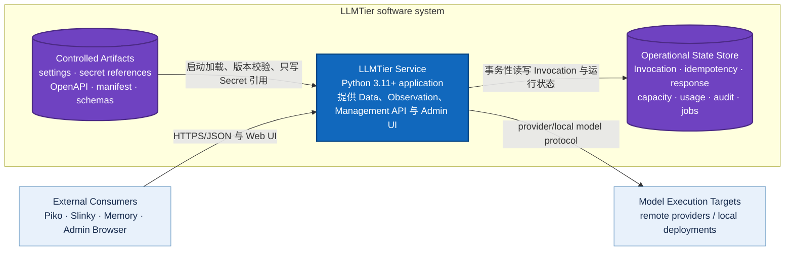
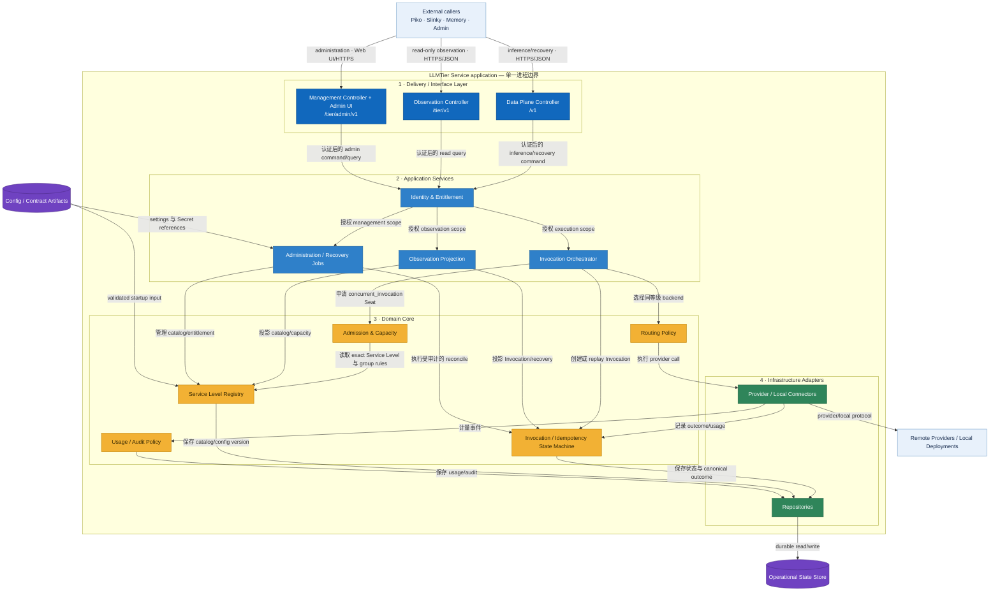
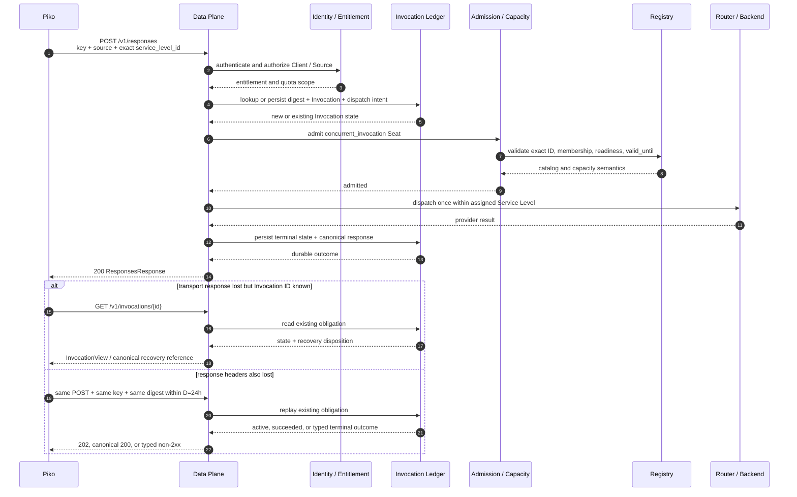

<!-- STD_DOCUMENT_COVER_BEGIN -->
# LLMTier V0.3 系统设计

| 文档字段 | 值 |
|---|---|
| Document ID | `llmtier-system-design` |
| Document Version | `0.3.1-draft.5` |
| Status | `In Review` |
| Project | `LLMTier` |
| Authority | `LLMTier` |
| Document Owner | LLMTier |
| Authors | llmtier |
| Created Date | `2026-09-06` |
| Last Modified Date | `2026-09-15` |
| Template Version | `4.0.0` |
| Template ID | `design.system` |
| Template Conformance | `tailored` |
| Tailoring Reference | `std-tailoring` |
| Migration Map Reference | none |
| Repository | `corezilla/LLMTier` |
| Canonical Path | `docs/20_system_design/llmtier-system-design.md` |
| Supersedes | `docs/30_subsystem_design/llmtier-service-design.md` |

> Reviewer、Approver、Approval Date 和 Release Tag 在进入相应状态时填写。Git commit/tag 是
> 外部不可变证据；不要在文档内容中伪造包含自身的 commit hash。
<!-- STD_DOCUMENT_COVER_END -->

> LLMTier 是本仓库完整的软件系统，不是 Slinky、Piko 或其他仓库内部的 subsystem。当前只有一个
> 部署、配置、状态、发布和 owner 边界；当前没有内部 subsystem design，因此不创建
> `docs/30_subsystem_design/` 文档。未来只有在
> LLMTier 内部形成可独立定义的真实子系统时，才新增 subsystem design。

## 1. 文档说明

本版按 STD `0.1.0-draft.26` 的 `design.system` `4.0.0` 采用 `software-system` profile。
§1–6、§8、§10–15、§17–18 适用；本项目不拥有板卡、FPGA、机箱或生产工艺设计，
故 §7、§9、§16 记录裁剪依据而不虚构硬件内容。§8.4 Admin Web UI 适用。
文档是 V0.3 候选目标设计，非生产实现证明；§3.2、§5 与 §8.1 的图整体是 Target 视图，
并非图内每个逻辑单元都已在现有源码中实现。
当前实现证据只在明确标为 Current 的段落中陈述。字段级权威仍为
`interfaces/openapi/llmtier-v0.3.openapi.json`，本文不自行创建第二套协议。

读者包括 LLMTier owner/实现者、Piko 与 Slinky consumer reviewer、Knowledge consumer 和运维。
外部项目只复核接口边界；LLMTier 对自身服务设计、部署、安全和管理事实负责。

## 2. 系统概览

LLMTier 是独立部署的单服务模型系统，目标是向外部 consumer 提供受管理、可观察、可恢复的模型服务，
同时保持 Provider、Account、Pool、capacity、routing 和 credential 位于自身边界内。

V0.3 成功标准：

1. Piko 经唯一 `Runtime -> Piko -> LLMTier` 路径使用 Responses non-stream；
2. Memory/Knowledge Client 使用 Embeddings non-stream；
3. Slinky 只读观察 readiness、Service Level、capacity、Invocation、usage 与 compatibility；
4. LLMTier 管理员通过 `/tier/admin/v1` 和最小 Admin Web UI 管理系统；
5. 单一 Registry 驱动 Models、Observation、admission、capacity membership 和 manifest；
6. idempotency、lost response、UnknownOutcome、capacity invalidation 与 M2-C 有可执行契约；
7. production evidence 未齐时，`overall.runtime_activation=false`。

当前 `src/` 是一个 Python 3.11+ 服务的 legacy baseline，尚不能以现有静态契约测试证明
V0.3 Data Plane、Registry、ledger、Observation、Management 或 UI 已完成 production wiring。
目标 V0.3 的一句话结构是：外部 Client 经三种受权 API 分面进入同一服务进程，
由统一 Registry、admission 和 durable Invocation ledger 控制同等级后端调用；
模型执行目标与运行状态存储都在服务边界之外。完整系统边界、软件结构和运行流程分别见 §3、§5、§6。

## 3. 产品应用与设计目标

### 3.1 使用场景、边界与设计约束

- V0.3 Scope B 仅含 Responses/Embeddings non-stream、Models、recovery、Observation 和 Management；
  Chat Completions、SSE 与 streaming recovery 属于 V0.4。
- Service Level ID exact、大小写敏感；禁止 lowercase、alias、Role selector 和跨等级 fallback。
- 唯一容量单位为 `concurrent_invocation`；direct、全部 shared/overlapping group、Client quota、
  readiness 和 `valid_until` 必须同时满足。
- M2-C 固定 `W=168h`、`M=24h`、产品自动恢复 deadline `D=24h`。
- V0.3 字段级机器 authority 只有 `interfaces/openapi/llmtier-v0.3.openapi.json`。
- 当前实现与批准目标必须分开陈述；静态 PASS 不等于 production 实现或 Runtime Activation。
- 不得新增 config path、selector、alias、fallback、第二 inference/recovery/management path。

| 参与者/相邻系统 | 权威职责 | 与 LLMTier 的边界 |
|---|---|---|
| Piko | Agent Runtime、assigned Service Level、SDK/recovery obligation | Data Plane HTTP consumer；不读取源码、配置或状态 |
| Slinky | Project、Plan、IR、Forecast/Risk/Action、Seat projection | Observation HTTP consumer；不做 admission 或 inference |
| Memory/Knowledge Client | Embeddings consumer | 只使用 Embeddings non-stream |
| LLMTier Admin | Provider、Registry、Client/Source、capacity、audit、recovery 管理 | 独立 Management credential/API/UI |
| Provider/Local Deployment | 执行物理模型调用 | 只由 LLMTier router/connector 访问 |

LLMTier 拥有本系统的 Data Plane、Observation、Management/Admin UI、Registry、admission、routing、
Invocation ledger、capacity、usage、audit 和 recovery。它不执行 Agent tool loop，不组合 Project/Plan/IR，
不取得外部项目的业务 authority。外部 reviewer 只复核其 consumer boundary，不取得 LLMTier 系统 ownership。

### 3.2 System Context（C4 Level 1）

**范围：** LLMTier 是中央黑盒；本图只显示使用者、相邻软件系统及双方关系，不展示内部实现。
§3.2、§5.1 和 §5.2 描述的是已批准但尚未激活的 V0.3 target architecture；它们不是 production
implementation/verification 声明。§8.2 另行标识当前可确认的源码基线。

图例：深蓝框是本次设计范围；浅蓝框是外部软件系统；黄色圆角框是人员角色；箭头文字同时说明目的与
跨进程协议。所有外部调用都终止于 LLMTier，不存在 consumer 到 Provider 的直连路径。

## 4. 功能与需求实现概览

以下是对 Slinky L1–L8 的**设计可满足性**答复，不是 Implemented、Verified 或 runtime active 声明。
“建议调整”表示目标设计可支持，但冻结接口前仍需双方确认精确语义；不授权增加新 V0.3 endpoint。

| ID | 设计结论 | 目标方案与现有契约 | 待确认/验收边界 |
|---|---|---|---|
| L1 统一调用 | 可满足 | `POST /v1/responses` 使用 exact-case `model`=`service_level_id`；Registry 隐藏 Provider、Account、Pool；Piko 唯一 generation 路径为 Runtime → Piko → LLMTier | 以 pinned adapter capture 验证；不引入别名、Role selector 或跨等级 fallback |
| L2 能力目录 | 可满足 | `/v1/models`、detail 与 `/tier/v1/service-levels` 来自同一 Registry；`ServiceLevelView` 声明 kind、availability、context、modalities、structured_output、tool_calling、contract/SLO 与有效期 | 实际能力须由可验证 backend profile 支持；不可把两个等级做纯名称 alias |
| L3 Agent 必需能力 | 可满足（non-stream） | V0.3 Responses schema 已有多条 `message`、`function_call`、`function_call_output`、`tools`；LLMTier 只传递模型工具调用与工具结果，不执行工具 | Piko 须按 §11.2 的 `call_id`/`name`/`arguments`/`output` 形状对齐；如必须 streaming，先做 V0.3 scope amendment，不能暗启 SSE |
| L4 容量与排队 | 建议调整 | admission 同时检验 committed Seat、全部共享/重叠 Capacity Group、Client quota、readiness、有效期；`Queued`、`queued_requests` 与 `estimated_queue_wait_ms` 已在候选契约中 | 尚需冻结新调用的排队准入、最大等待时间、到期/取消状态及对应 HTTP/错误/Retry-After；超时必须有界，不能无限等候或悄悄换等级；active replay `202` 不等于新请求排队承诺 |
| L5 多调用方隔离 | 可满足 | authenticated Client + authorized canonical Source 为调用与恢复范围；SourceInstance 只作关联/观察；Entitlement/配额与公平调度在同一 admission 边界 | 多 Client/Source 和公平性 production evidence 是 activation gate；不接收项目 IR 或团队配置 |
| L6 用量与观察 | 建议调整 | Invocation 状态/错误、token usage、Service Level capacity 的 in-flight/queued/estimated wait、按 Source/Instance/Level/endpoint/status 的 usage 聚合已有候选 DTO；Unknown/Partial 保持 null | 费用/币种/计价来源与队列历史统计目前未在 V0.3 机器契约冻结；如 Slinky 必需，先修订单一 OpenAPI、fixture 与隐私/授权规则，未知费用不得写零 |
| L7 故障与恢复 | 可满足 | 未受理不产生已 dispatch Invocation；已受理的 Pending/Queued/Running、Failed、UnknownOutcome 分离；同 client/source/key/digest 恢复，已知 ID 用 GET，丢失头部用原 POST replay；UnknownOutcome 不重派 | M2-C `W=168h`、`M=24h`、`D=24h` 不变；crash/lost-response 零重复 dispatch 尚需 runtime 证据 |
| L8 独立管理 | 可满足 | `/tier/admin/v1` 与最小 Admin Web UI 管理 Provider/Account/Local Deployment、Registry/Pool、Client/Source/Entitlement、配额、Probe、Capacity、Usage、Audit、Recovery；Secret 只写不读 | 仍为 required target，不能因 Scope B 延后；实现、权限和 UI 正负测试尚未完成 |

LLMTier 不接收任务、Prompt 模板、STD 文档或 IR 团队配置。Slinky 管 Project/Plan/IR；
Piko 管 Agent Runtime、tool loop 和 durable adapter obligation；LLMTier 只管模型服务及其通用 Client/Source
identity、capacity/admission、routing、ledger 和观察。Knowledge 使用 Embeddings non-stream。
V0.3 仅含 non-stream Responses/Embeddings、Models、Responses recovery 查询；Chat 与全部 SSE 在 V0.4。

### 4.1 解决方案策略

策略是单一事实来源、分面权限、共享 Registry/ledger、dispatch 前持久化、fail closed 和有限恢复保证。
Data Plane、Observation、Management 使用不同 credential 与 DTO，但不得复制核心状态机。

本文按 C4/arc42 的缩放顺序阅读：§3.2 看系统与外界的关系；§5.1 看系统内可运行单元与数据存储；
§5.2 再放大唯一服务进程，解释分层和关键构件；§6、§8.1 分别描述动态行为与目标部署。这样不会在一张图中
混用 software system、process、component 和 datastore 四种抽象层级。

视图方法参考 [C4 System Context](https://c4model.com/diagrams/system-context)、
[C4 Container](https://c4model.com/diagrams/container)、
[C4 Component](https://c4model.com/diagrams/component) 和
[arc42 Building Block View](https://docs.arc42.org/section-5/)；这些来源只规定表达方法，不取得
LLMTier 的业务或设计 authority。

## 5. 总体结构

LLMTier 当前是一个系统、一个服务进程边界。框内 logical building block 不是已拆分的子系统，也不代表
独立部署的 subsystem。

### 5.1 Container View（C4 Level 2）

**范围：** 放大 LLMTier 系统边界，只显示可运行应用和 data store。C4 的 container 是应用或数据存储，
不是 Docker container，也不等同于本项目的 subsystem。

图例：蓝色矩形是可运行 application；紫色圆柱是 data store/artifact store；浅蓝框是边界外系统。
当前开发部署可由同一 host 上的目录承载两类 store；production persistence 技术仍是 Open Gate。

### 5.2 LLMTier Service Component View（C4 Level 3 / arc42 Level-1 Whitebox）

**范围：** 只放大上图的 `LLMTier Service` application。横向是请求来源和执行目标，纵向是接口、应用编排、
领域核心与基础设施适配层；持久状态放在服务边界外侧，以明确依赖方向。

图例：深蓝是接口层；浅蓝是应用编排；黄色是无 transport/persistence 细节的领域核心；绿色是基础设施
adapter；紫色圆柱是持久数据或受控 artifact；浅蓝外框是相邻系统。箭头表示调用/依赖方向，不表示数据
复制。三种 API 分面共享 IAM、Registry、Ledger 和审计事实，不形成三套实现。

### 5.3 Building Block Catalog

下表补充 Component View 的职责与禁止项：

| Building block | 职责 | 禁止项 |
|---|---|---|
| HTTP/API boundary | Data Plane、Observation、Management 与 legacy baseline routes | 第二 API authority、隐式兼容入口 |
| Identity/Entitlement | credential→Client、canonical Source 授权与 quota | SourceInstance 作为 recovery namespace |
| Service Level Registry | exact ID、catalog/version、compatibility、membership | alias、Role mapping |
| Admission/Capacity | 联合校验 capacity、groups、quota、readiness、有效期 | unknown quota 当作可用 |
| Invocation Ledger | digest、dispatch intent、Invocation、canonical response、tombstone | UnknownOutcome 自动重派 |
| Backend Router/Connectors | 同一 Service Level 内选择 Provider/Account/Deployment | 跨等级 fallback、consumer provider-direct |
| Observation views | Client-scoped readiness/capacity/invocation/usage | physical credential 或跨 Client 数据 |
| Management API/UI | inventory、secret-write、probe、publish、job、audit、recovery | Secret 回显、未授权 mutation |

源码目前采用 flat `src/` module/package layout。是否把 logical building block 拆成真正 subsystem，必须以独立
owner、部署或发布边界为依据，不能仅按类或目录命名。

## 6. 工作模式与端到端流程

运行模式分为启动校验、Ready admission、Degraded/NotReady 拒绝新 Seat、受控关闭和
durable recovery。模式切换不得清除已持久化的 Invocation obligation；capacity snapshot
失效立即禁止关联 Seat 的新 dispatch，已 admission 的 in-flight Invocation 仅在安全边界收敛。

### 6.1 首次 Responses 调用

1. Piko 提交 credential、canonical Source、`Idempotency-Key`、`X-Tier-Client-Request-ID` 和 exact model；
2. LLMTier 认证、授权、规范化请求并计算 digest；
3. Backend dispatch 前事务性保存 Invocation、digest、dispatch intent 和 recovery obligation；
4. admission 联合检查 Registry、entitlement、capacity groups、quota、readiness 和有效期；
5. router 只在同一 Service Level 内执行一次 dispatch；
6. 成功时保存并返回 canonical `ResponsesResponse`。

### 6.2 replay 与 lost response

| Invocation 状态 | 同一 POST replay | 后续动作 |
|---|---|---|
| Pending/Queued/Running | `202 InvocationAccepted` + Location/Invocation ID/Retry-After | 查询 Invocation readiness |
| Succeeded | 原 endpoint canonical `200` body | 零次 dispatch；必要时 Response GET |
| Failed | `502 invocation_failed` | `retryable=false` |
| Cancelled | `409 invocation_cancelled` | `retryable=false` |
| UnknownOutcome | `503 invocation_outcome_unknown` | manual reconcile；不得重派 |

已有 Invocation ID 时查询 `GET /v1/invocations/{id}`。响应头也丢失、没有 ID 时，在 `D=24h` 内使用原
client/source/body/digest/key 重放同一 POST；这是 transport recovery，不是新 Attempt、endpoint、key 或
Backend redispatch 授权。

### 6.3 启动、关闭与升级

启动验证 config、Registry/manifest、ledger readiness、required Service Levels 与 Observation readiness。
优雅关闭先停止新 admission，再受控收敛 in-flight Invocation。非优雅退出依赖 durable intent/ledger
恢复，不默认重派。升级与回滚必须保持唯一 Registry/ledger 和单路径，不能运行新旧并行 inference。

## 7. 硬件实现方案

不适用：LLMTier 是独立软件服务，当前设计不拥有板卡、器件选型、时钟、电源或信号完整性。
运行 host 与远程/本地模型执行目标是外部基础设施依赖，软件部署、资源与故障域写于 §8.6；
若未来拥有专用硬件设计责任，应重新裁剪并建立硬件设计基线。

## 8. 软件实现方案

### 8.1 软件架构与部署

当前可确认的开发运行边界是一个 Python 3.11+ LLMTier 进程；下图在该单进程边界上展示尚未接线的
V0.3 目标 API、状态与执行依赖：

| 位置/入口 | 作用 |
|---|---|
| `src/` | 单服务 Python 源码 |
| `config/settings.json` | Git-ignored 默认配置；`--settings`/`LLMTIER_CONFIG` 覆盖 |
| `config/secrets/` | Git-ignored、本机 owner-only Secret 文件 |
| `state/` | Git-ignored 默认状态、统计和 trace；`LLMTIER_STATE_DIR` 覆盖 |
| `interfaces/` | OpenAPI、compatibility、Schema 和 vectors authority |
| `llm-tier` / `python3 -m tier_service` | 安装后/checkout 服务入口 |
| `llm-tier-cli` / `python3 -m cli` | 安装后/checkout operator 入口 |

上图是 V0.3 单节点目标映射，不是现有 server 已提供 Data/Observation/Management/UI 的证明。
当前 server 仅接受 localhost、loopback、RFC1918 或 IPv6 ULA bind/origin。production service manager、
TLS/auth、container、database、HA、RPO/RTO、故障域和多实例 topology 仍是 Open Gate。

### 8.2 模块设计与代码映射

§5.2 是目标 logical component view，不代表这些模块已在源码实现。Current `src/server.py`、
`src/router_core.py`、`src/tier.py`、`src/quota_manager.py`、`src/provider_usage.py`、
`src/backends/` 与 `src/web/tier.html` 构成旧接口与路由基线；目标 Registry、durable ledger、
三个受权 Controller 和 Admin UI 需按同一服务边界接线。不得仅凭现有目录名称宣称目标能力已实现。

### 8.3 通信、配置与状态管理

- 身份：authenticated `client_id`；`X-Tier-Source-ID` 必须在该 Client 下获授权。
- correlation：`X-Tier-Source-Instance-ID` 不形成 recovery namespace；client request ID 不替代幂等 key。
- 配置：只有 `--settings`/`LLMTIER_CONFIG`、`LLMTIER_STATE_DIR` 和既有 trace override；不回读 Slinky。
- Secret：create/rotate 只写不读；DTO、UI、log、audit、backup report 不得包含可逆值。
- ETag：Models、Observation、admission、manifest 引用同一 exact ID/catalog version 与语义；各 endpoint 的
  ETag 各自校验本 resource representation，live capacity/usage 变化不要求其他 DTO ETag 同步。
- 兼容：破坏兼容性的 Service Level 语义使用新 ID 或 API major；unsupported surface fail closed。
- 保留：active record 至 terminal；terminal 后 digest/tombstone、Invocation view 与 canonical Response
  至少 168h。canonical Response 在冻结的 168h recovery window 内仍可恢复；短于任一下限的配置无效并阻断 activation。

### 8.4 页面与交互

Admin Web UI 是 V0.3 required target，与 `/tier/admin/v1` 使用同一权限和资源语义：
Provider/Account/Local Deployment、Model discovery、Service Level/Pool、Client/Source/SourceInstance、
Entitlement、Probe/readiness、Capacity/Usage/Audit/Recovery。Secret create/rotate 只能一次性写入，
页面不得回显；危险 recovery action 需要受权、并发校验、审计和明确结果。
现有 `src/web/tier.html` 不证明该目标 UI 已接线。

### 8.5 软件可靠性与开发平台

实现须在 backend dispatch 前持久化 Invocation、digest、dispatch intent 与 recovery obligation；
重启后不盲派，store 不可用时 fail closed。开发基线为 Python 3.11+，安装与 CLI 入口见 §17；
production service manager、HA、备份和恢复演练尚无已批准证据。

### 8.6 部署与运行环境

§8.1 图为目标单节点拓扑；production 节点数、TLS termination、状态存储、故障域、容量/性能预算
仍是 Open Gate。无论最终如何部署，三个 API 分面不得形成第二套 Registry 或 ledger。

## 9. 可编程逻辑与专用处理单元

不适用：LLMTier 本项目没有 FPGA、RTL、DSP 或自有专用处理单元。远程 Provider 或本地模型硬件
是被调用的执行目标，不归 LLMTier 本设计的可编程逻辑责任范围。

## 10. 数据、描述符与存储结构

核心业务数据为 Client/Source/SourceInstance、ServiceLevel、Pool/CapacityGroup、Invocation、
CanonicalResponse、Usage、RecoveryItem、AdminJob；Schema authority 见 §11 和附录 A。
Invocation active 状态 Pending/Queued/Running；terminal 状态 Succeeded/Failed/Cancelled/UnknownOutcome。
只有真实测得或可归属的 token、费用和队列估计才可写数值；Unknown/Partial 必须保留 null/状态，
不能补零。持久化引擎、事务实现、备份和清理策略需符合 M2-C 保留下限，详见附录 C。

## 11. 接口与通信协议

### 11.1 接口总表

| 分面 | V0.3 目标接口 | 权威 |
|---|---|---|
| Data Plane | `POST /v1/responses` non-stream、`POST /v1/embeddings` non-stream、Models list/detail、Invocation/Response GET | `interfaces/openapi/llmtier-v0.3.openapi.json` |
| Observation | `/tier/v1` readiness、Service Level、capacity、Invocation list/detail、usage、compatibility | 同一 OpenAPI |
| Management | `/tier/admin/v1` 配置、目录、授权、容量、审计、Job、Recovery | 同一 OpenAPI |
| V0.4 | Chat Completions、Responses/Chat SSE 与 streaming replay | 非 V0.3 current path；必须 fail closed |

### 11.2 Data Plane 与 Agent tool loop

Piko 的 `model` 必须是 Registry 返回的 exact `service_level_id`，不做 lowercase 或别名映射。
`ResponsesRequest.input` 可为字符串或有序输入项；多轮消息使用 `type=message`、
`role=system|developer|user|assistant` 和 content。可用 `tools[]`、`tool_choice` 与
`parallel_tool_calls` 请求模型生成 `type=function_call`，其 `call_id`、`name`、`arguments`
返回 Piko；Piko 执行工具后以 `type=function_call_output`、相同 `call_id` 和字符串 `output`
在后续 Responses 请求中回传。LLMTier 仅验证、透传和调用模型，不执行工具、不储存 Prompt 模板。
同一逻辑 Invocation 的 transport recovery 复用原 key/digest；下一轮新的模型调用需要新的 logical
Invocation，但工具结果格式与上下文组装由 Piko adapter 的 pinned capture 确认。V0.3 `stream:true`
和 Chat 请求须按 unsupported feature/endpoint fail closed；若 Piko 必须 streaming，先做 scope amendment。

### 11.3 控制、管理与观测协议

`Idempotency-Key` 标识同一 logical Invocation；`X-Tier-Client-Request-ID` 只用于关联，不可代替前者。
`X-Tier-Source-ID` 是已授权的 canonical Source；SourceInstance 仅用于 observation/correlation/audit。
Observation 可在已授权范围按 Source/Instance/Service Level/endpoint/status 过滤与聚合；
Management 只接受独立管理权限。ETag 验证各 resource 的自身表示，不要求不同 DTO 的 ETag 相等。

### 11.4 排队、拒绝与超时待冻结项

现有候选契约有 `Queued`、`queued_requests`、`estimated_queue_wait_ms`，但没有足以让调用方
实现新请求排队的完整有界等待协议。V0.3 activation 前必须在**现有单一 OpenAPI** 中冻结：
是否允许新请求排队、准入/队列上限、最大等待与超时起点、取消/超时后的 Invocation 状态、
HTTP status 与 typed error、`Retry-After` 的适用场景、队列公平性及观察字段。不能把 active replay
的 `202` 借作未定义的新请求排队响应。未冻结时不能承诺“等待”能力；容量不足应明确、有限地拒绝，
且不得改变 Service Level。费用字段同样待计价来源、币种、未知语义和授权范围冻结后进入单一 Schema。

## 12. 可靠性、维护与升级

§6.2 和附录 C 定义 lost-response recovery；无 ID 用原 namespace/key/digest replay，有 ID 查询原
Invocation，UnknownOutcome 只能人工 reconcile，不因 HTTP 5xx 盲派。capacity snapshot 失效后新 Seat
不可用，但不撤销已 admission 的 in-flight 调用。关闭、升级与回滚必须保护 ledger 与 canonical response；
若存储/Provider 健康未知，readiness 不能假报 Ready。故障定位需保留 Invocation/Client/Source/Backend
关联、typed error、usage status 和审计，且不泄漏 Secret 或跨 Client 记录。

## 13. 性能、扩展与兼容性

唯一容量单位 `concurrent_invocation`；direct 与全部共享/重叠 Capacity Group、Client quota、
readiness、`valid_until` 同时成立才可新增 committed Seat。`request_quota_remaining=null` 阻断新增
committed Seat；burst 不计入 committed capacity。`in_flight_requests`、`queued_requests` 和
`estimated_queue_wait_ms` 是观察数据，不等同预留容量或吞吐承诺。throughput、latency、
fairness、backend SLO、队列等待预算与生产 topology 均须在固定 workload 后测量和冻结；
无实测时不得声明达标。Service Level 兼容语义变化须新 ID 或 API major，禁止暗中跨等级替换。

## 14. 可测试性与验收设计

### 14.1 设计与运行证据边界

静态 OpenAPI/manifest/fixture/STD 检查只证明候选文档自洽。runtime activation 还需 pinned Piko
adapter、Knowledge Embeddings consumer、Slinky Observation、Management API/UI、安全隔离、
容量语义、实际公平性、crash/lost-response 零重复 dispatch、168h retention 和 legacy removal 证据。

### 14.2 质量场景与判定

| Quality ID | 场景与 oracle | 当前状态 |
|---|---|---|
| LT-QR-001 | 同 namespace/key/digest replay additional dispatch=0 | Fixture PASS；runtime BLOCKED |
| LT-QR-002 | UnknownOutcome 只 manual reconcile | Contract PASS；runtime BLOCKED |
| LT-QR-003 | Snapshot 失效立即阻止新 Seat/dispatch | Fixture PASS；production BLOCKED |
| LT-QR-004 | Registry provenance 一致，各 resource ETag/304 自洽 | Static PASS；runtime BLOCKED |
| LT-QR-005 | 同 Client 已授权多 Source 正例；未授权 Source/跨 Client 负例 | Static PASS；runtime BLOCKED |
| LT-QR-006 | Secret 在 API/UI/log/audit 中不可读 | Schema PASS；runtime BLOCKED |
| LT-QR-007 | 24h recovery 与 terminal 后 168h retention | Policy frozen；长时证据 BLOCKED |
| LT-QR-008 | Chat/SSE/stream V0.3 fail closed | Fixture PASS；runtime BLOCKED |
| LT-QR-009 | Management/Observation pagination、ETag、unknown/partial 正确 | Static PASS；runtime BLOCKED |

throughput、latency、fairness 和 Provider measured SLO 必须在固定 provider/model/config/topology/workload
后测量；当前无 production baseline。

### 14.3 L1–L8 设计验收重点

Piko 的 Responses 正负 capture 应包括多轮 message、function_call、`call_id` 关联的
function_call_output、structured output、工具能力为 false 时的 typed rejection、non-stream 与
`stream:true` fail closed；不能以 stock SDK 支持为 LLMTier runtime 已实现的证据。
排队须测试有界等待、到期、拒绝、取消与同 key replay 的零重复 dispatch；Observer 须测试
queued/in-flight/estimated wait、token 与费用 Unknown/Partial、按 Source/Level 聚合以及跨 Client 负例。
L4/L6 的未冻结字段不能以“测试将来补”代替单一 OpenAPI 设计修订。

## 15. 信息安全架构

LLMTier 的保护资产是 Client/Source 凭据、Provider Secret、请求/输出内容、Invocation ledger、
usage/audit 和 Admin mutation。Data Plane、Observation、Management 是不同授权面，但共享统一
身份、Entitlement 与审计事实。Client 不能跨 Client 或未授权 Source 查看记录；同一 Client 已授权
多个 Source 的 Observation 聚合可见范围由授权和过滤契约限定，不把 Source filter 当成新的
recovery namespace。Admin credential、Secret create/rotate、Job/Recovery action 只对相应管理权限开放；
Secret 不可回显到 API/UI/log/audit。TLS、secret storage、backup encryption、供应链与运行态权限
是 production Open Gate；静态 Schema 无法证明这些安全性质。

## 16. 结构、热、工艺与安全设计

不适用：本项目不拥有机箱结构、热设计、PCB 工艺、EMC 或硬件制造测试。
host 资源、功耗和 Provider 运行环境属于部署/采购约束，待 §8.6/§13 的 production topology 确定。

## 17. 实现计划

当前只确认设计，不请求 runtime activation。下一步依次关闭：
（1）Piko pinned adapter 的多轮工具与 non-stream capture；（2）L4 有界排队/超时和 L6 费用观察的
跨方需求裁决及单一 OpenAPI 修订；（3）Registry/admission/ledger/Management/UI 的生产接线；
（4）isolation/fairness、retention、recovery、安全和 legacy removal 验证。每个阶段必须保存独立
Review、Contract Test 和 runtime evidence，不能用本文状态替代。当前安装/入口为
`python3 -m pip install -e .`、`llm-tier`/`llm-tier-cli` 或 checkout 下
`PYTHONPATH=src python3 -m tier_service`/`python3 -m cli`。

## 18. 设计决策、风险与未决项

| Decision | 状态 | 来源 |
|---|---|---|
| LLMTier 是独立 system、单服务 repo | Owner directed | 用户 2026-09-09 指示 |
| Authority 分离与唯一 inference path | Candidate accepted | `S-20260906-59891d73fa13` |
| Scope B；Chat/SSE 移到 V0.4 | Frozen | `S-20260906-2f9539048493` |
| M2-C `W=168h`、`M=24h`、`D=24h` | Frozen | `L-20260906-12940a96e148`、`P-20260906-c14b4af35ac3` |
| Amendment 4 contract candidate | Slinky accepted | `S-20260906-1e12f5e61d73` |

新 persistence/HA/deployment、队列超时及费用计价等重大选择必须建立 ADR/Contract amendment；
本文不伪造 retrospective ADR。

### 18.1 风险与技术债

- 现有 `/call`、`/health`、`/runtime`、`/stats`、Role routing、Agent backend、mlexp 和旧 fallback 仅为
  legacy implementation baseline；不得成为 V0.3 parallel path。
- V0.3 Data Plane、Observation、Management、Registry、durable ledger 与 Admin UI 尚无 production wiring。
- persistence/HA/backup/RPO/RTO、Admin UI 技术栈与 production topology 尚未决定。
- Piko adapter、Slinky Observation、Embeddings consumer、isolation/fairness 与长时 retention evidence 待补。
- L3 多轮工具格式虽已有 schema，Piko adapter 对真实 LLMTier 的双向 capture 未完成。
- L4 新调用有界排队/超时和 L6 费用字段未冻结；不能宣称这两项已完全具备 V0.3 机器契约。

### 18.2 术语

| 术语 | 定义 |
|---|---|
| System | 本仓库拥有的完整 LLMTier 软件产品与运行边界 |
| Building block | LLMTier 进程内逻辑职责块；不自动等同 subsystem |
| Service Level | exact-case catalog ID 及其 capability/SLO contract |
| Invocation | 一次有 durable identity、状态和 recovery obligation 的调用 |
| Capacity Group | shared/overlapping committed-capacity 约束组 |
| Runtime Activation | production capability 的独立机器/审批状态，不由文档 PASS 推导 |

## A. 数据模型与状态机

核心实体：Client、Source、SourceInstance、Entitlement、ServiceLevel、Pool、CapacityGroup、Provider、
Account、Deployment、Invocation、CanonicalResponse、Usage、RecoveryItem、AdminJob。

Invocation active 状态为 Pending、Queued、Running；terminal 为 Succeeded、Failed、Cancelled、
UnknownOutcome。`InvocationAccepted` 不得包含 UnknownOutcome；成功 create、Succeeded replay 与 Response GET
使用同一 canonical response body。

## B. API、Schema、Event、寄存器与错误契约

- Data Plane、Observation、Management：`interfaces/openapi/llmtier-v0.3.openapi.json`。
- capability/activation：`interfaces/compatibility/compatibility-manifest-v0.3.json`。
- vectors：`interfaces/vectors/v0.3/`。
- current prose controls：`docs/60_interfaces/`。

Markdown 不复制字段 Schema。Failed、Cancelled、UnknownOutcome 使用冻结 typed non-2xx envelope；
hidden/unauthorized/unsupported 均 fail closed。

## C. 持久化、一致性、幂等与恢复

namespace 至少覆盖 authenticated client、canonical source、endpoint/version 和 `Idempotency-Key`；digest
覆盖 exact Service Level、规范化 body 和语义 headers。同 key/different digest 为不可重试 conflict。
Backend dispatch 前必须持久化 digest、Invocation、dispatch intent 和 recovery obligation。持久化引擎、
transaction implementation、backup/restore 与 HA 仍需 ADR 和 production evidence。

## D. 安全、隐私、Secret 与审计

禁止跨 Client 和未授权 Source；Observation 的 source filter 不建立新的鉴权或 recovery namespace。
Management credential 与 Data Plane/Observation 分离。所有 mutation 需要认证、授权、并发检查和 audit。
原始 prompt/output privacy retention 可独立配置，但不能破坏已冻结 recovery 下限。

## E. 可观测性、容量、性能、资源与 SLO

Readiness、usage、Invocation、capacity、provider health、recovery、audit 和 store health 必须可观测。
`request_quota_remaining=null` 阻止新增 committed Seat；unknown/partial usage 不补零。capacity semantic
validator 与真实 multi-client fairness/SLO evidence 是 activation gate。

## F. 测试设计与需求 traceability

requirements、traceability、V&V 与 contract test specification 分别位于 `docs/10_requirements/` 和
`docs/70_verification/`。静态验证覆盖 OpenAPI refs、manifest、fixtures、路径、metadata 与 CLI；production
还需 crash/lost-response、durability、安全隔离、Admin UI、consumer capture、capacity/fairness 和 SLO。

## G. 集成、部署、迁移、回滚与发布 Gate

当前安装使用 `python3 -m pip install -e .`；安装后入口为 `llm-tier`/`llm-tier-cli`，checkout 入口为
`PYTHONPATH=src python3 -m tier_service`/`python3 -m cli`。发布必须固定 artifact/config/schema、验证
backup/restore 与 rollback，并保持单一路径。文档 review、RAG publication、release 与 Runtime Activation
分别决定。

## H. 未决问题、外部依赖和后续版本

未决：production persistence/HA/RPO/RTO、Admin UI 技术栈、Provider SLO、真实 consumer capture、
isolation/fairness 和 runtime wiring。V0.4 才设计 Chat Completions、Responses/Chat SSE 与 streaming recovery。
如果未来 LLMTier 内部出现两个以上独立 owner/deploy/release 单元，再新增 subsystem design 并重新 tailoring；
在此之前 `docs/30_subsystem_design/` 不承担当前设计 authority。
