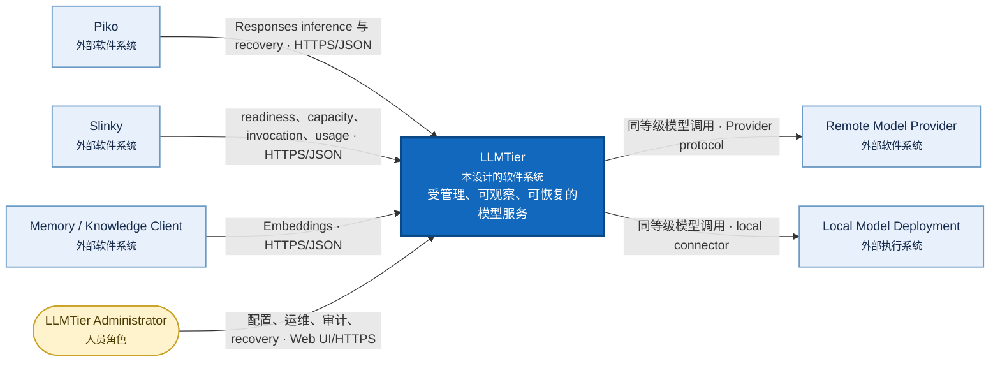
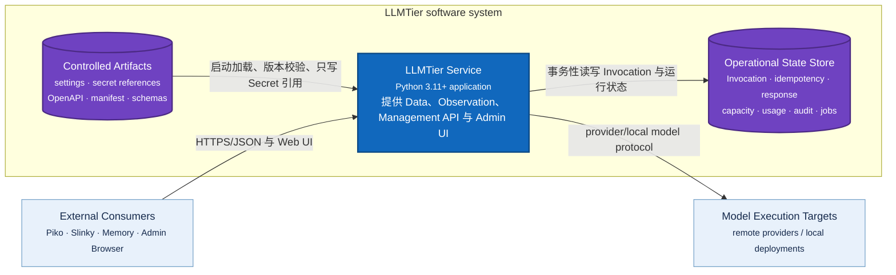
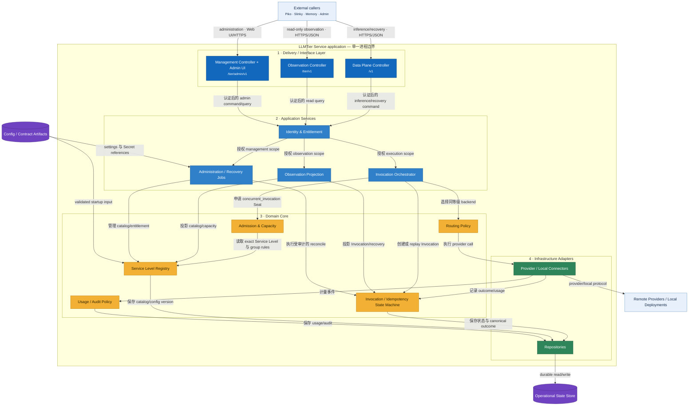
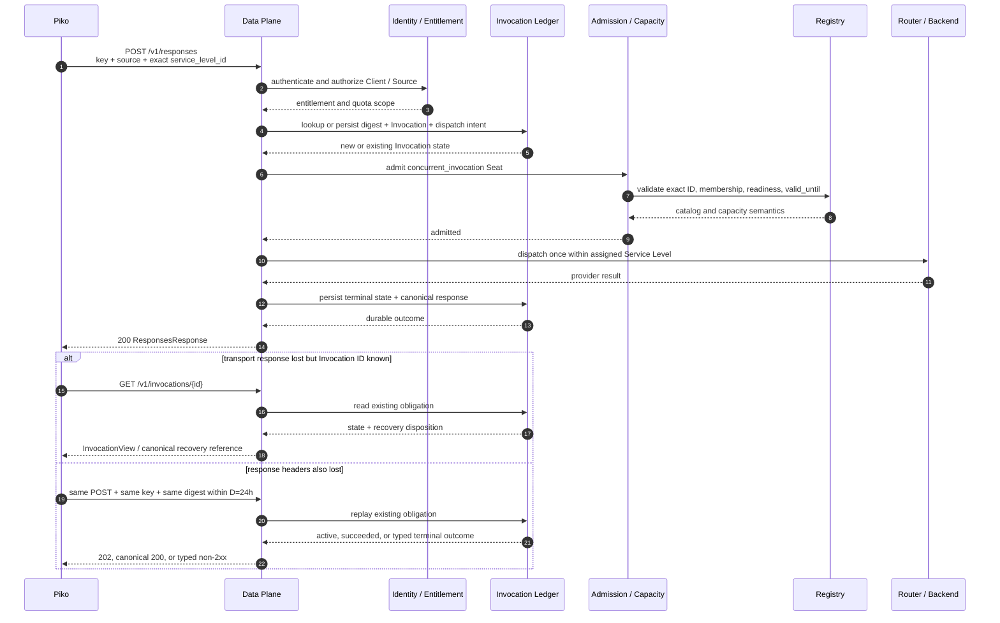
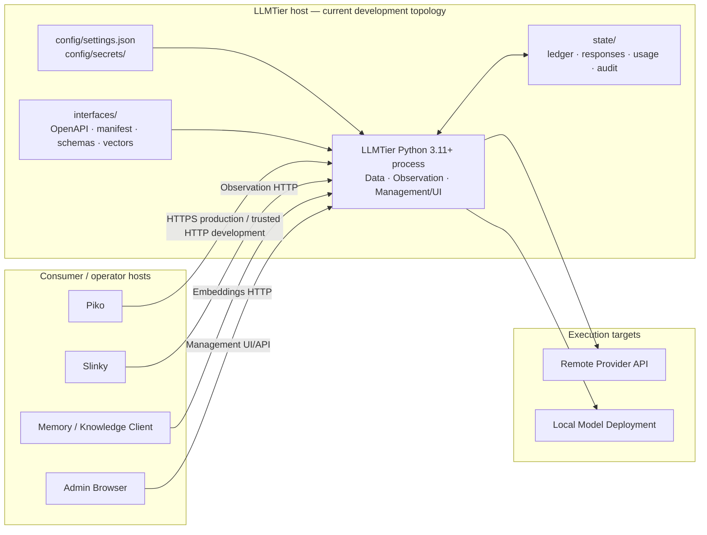

<!-- STD_DOCUMENT_COVER_BEGIN -->
# LLMTier V0.3 系统设计

| 文档字段 | 值 |
|---|---|
| Document ID | `llmtier-system-design` |
| Document Version | `0.3.1-draft.3` |
| Status | `In Review` |
| Project | `LLMTier` |
| Authority | `LLMTier` |
| Document Owner | LLMTier |
| Authors | llmtier |
| Created Date | `2026-09-06` |
| Last Modified Date | `2026-09-09` |
| Template Version | `0.1.0` |
| Template ID | `design.system` |
| Template Conformance | `tailored` |
| Tailoring Reference | `std-tailoring` |
| Migration Map Reference | none |
| Repository | `corezilla/LLMTier` |
| Canonical Path | `docs/20_system_design/llmtier-system-design.md` |
| Supersedes | `docs/30_subsystem_design/llmtier-service-design.md` |

> Reviewer、Approver、Approval Date 和 Release Tag 在进入相应状态时填写。Git commit/tag 是
> 外部不可变证据；不要在文档内容中伪造包含自身的 commit hash。
<!-- STD_DOCUMENT_COVER_END -->

> LLMTier 是本仓库完整的软件系统，不是 Slinky、Piko 或其他仓库内部的 subsystem。当前只有一个
> 部署、配置、状态、发布和 owner 边界；当前没有内部 subsystem design，因此不创建
> `docs/30_subsystem_design/` 文档。未来只有在
> LLMTier 内部形成可独立定义的真实子系统时，才新增 subsystem design。

## 1. 引言与目标

LLMTier 是独立部署的单服务模型系统，目标是向外部 consumer 提供受管理、可观察、可恢复的模型服务，
同时保持 Provider、Account、Pool、capacity、routing 和 credential 位于自身边界内。

V0.3 成功标准：

1. Piko 经唯一 `Runtime -> Piko -> LLMTier` 路径使用 Responses non-stream；
2. Memory/Knowledge Client 使用 Embeddings non-stream；
3. Slinky 只读观察 readiness、Service Level、capacity、Invocation、usage 与 compatibility；
4. LLMTier 管理员通过 `/tier/admin/v1` 和最小 Admin Web UI 管理系统；
5. 单一 Registry 驱动 Models、Observation、admission、capacity membership 和 manifest；
6. idempotency、lost response、UnknownOutcome、capacity invalidation 与 M2-C 有可执行契约；
7. production evidence 未齐时，`overall.runtime_activation=false`。

## 2. 架构约束

- V0.3 Scope B 仅含 Responses/Embeddings non-stream、Models、recovery、Observation 和 Management；
  Chat Completions、SSE 与 streaming recovery 属于 V0.4。
- Service Level ID exact、大小写敏感；禁止 lowercase、alias、Role selector 和跨等级 fallback。
- 唯一容量单位为 `concurrent_invocation`；direct、全部 shared/overlapping group、Client quota、
  readiness 和 `valid_until` 必须同时满足。
- M2-C 固定 `W=168h`、`M=24h`、产品自动恢复 deadline `D=24h`。
- V0.3 字段级机器 authority 只有 `interfaces/openapi/llmtier-v0.3.openapi.json`。
- 当前实现与批准目标必须分开陈述；静态 PASS 不等于 production 实现或 Runtime Activation。
- 不得新增 config path、selector、alias、fallback、第二 inference/recovery/management path。

## 3. 系统范围与上下文

| 参与者/相邻系统 | 权威职责 | 与 LLMTier 的边界 |
|---|---|---|
| Piko | Agent Runtime、assigned Service Level、SDK/recovery obligation | Data Plane HTTP consumer；不读取源码、配置或状态 |
| Slinky | Project、Plan、IR、Forecast/Risk/Action、Seat projection | Observation HTTP consumer；不做 admission 或 inference |
| Memory/Knowledge Client | Embeddings consumer | 只使用 Embeddings non-stream |
| LLMTier Admin | Provider、Registry、Client/Source、capacity、audit、recovery 管理 | 独立 Management credential/API/UI |
| Provider/Local Deployment | 执行物理模型调用 | 只由 LLMTier router/connector 访问 |

LLMTier 拥有本系统的 Data Plane、Observation、Management/Admin UI、Registry、admission、routing、
Invocation ledger、capacity、usage、audit 和 recovery。它不执行 Agent tool loop，不组合 Project/Plan/IR，
不取得外部项目的业务 authority。外部 reviewer 只复核其 consumer boundary，不取得 LLMTier 系统 ownership。

### 3.1 System Context（C4 Level 1）

**范围：** LLMTier 是中央黑盒；本图只显示使用者、相邻软件系统及双方关系，不展示内部实现。
§3.1、§5.1 和 §5.2 描述的是已批准但尚未激活的 V0.3 target architecture；它们不是 production
implementation/verification 声明。§7 另行标识当前可确认的开发部署。

图例：深蓝框是本次设计范围；浅蓝框是外部软件系统；黄色圆角框是人员角色；箭头文字同时说明目的与
跨进程协议。所有外部调用都终止于 LLMTier，不存在 consumer 到 Provider 的直连路径。

## 4. 解决方案策略

策略是单一事实来源、分面权限、共享 Registry/ledger、dispatch 前持久化、fail closed 和有限恢复保证。
Data Plane、Observation、Management 使用不同 credential 与 DTO，但不得复制核心状态机。

本文按 C4/arc42 的缩放顺序阅读：§3.1 看系统与外界的关系；§5.1 看系统内可运行单元与数据存储；
§5.2 再放大唯一服务进程，解释分层和关键构件；§6、§7 分别描述动态行为与物理部署。这样不会在一张图中
混用 software system、process、component 和 datastore 四种抽象层级。

视图方法参考 [C4 System Context](https://c4model.com/diagrams/system-context)、
[C4 Container](https://c4model.com/diagrams/container)、
[C4 Component](https://c4model.com/diagrams/component) 和
[arc42 Building Block View](https://docs.arc42.org/section-5/)；这些来源只规定表达方法，不取得
LLMTier 的业务或设计 authority。

## 5. 构建块视图

LLMTier 当前是一个系统、一个服务进程边界。框内 logical building block 不是已拆分的子系统，也不代表
独立部署的 subsystem。

### 5.1 Container View（C4 Level 2）

**范围：** 放大 LLMTier 系统边界，只显示可运行应用和 data store。C4 的 container 是应用或数据存储，
不是 Docker container，也不等同于本项目的 subsystem。

图例：蓝色矩形是可运行 application；紫色圆柱是 data store/artifact store；浅蓝框是边界外系统。
当前开发部署可由同一 host 上的目录承载两类 store；production persistence 技术仍是 Open Gate。

### 5.2 LLMTier Service Component View（C4 Level 3 / arc42 Level-1 Whitebox）

**范围：** 只放大上图的 `LLMTier Service` application。横向是请求来源和执行目标，纵向是接口、应用编排、
领域核心与基础设施适配层；持久状态放在服务边界外侧，以明确依赖方向。

图例：深蓝是接口层；浅蓝是应用编排；黄色是无 transport/persistence 细节的领域核心；绿色是基础设施
adapter；紫色圆柱是持久数据或受控 artifact；浅蓝外框是相邻系统。箭头表示调用/依赖方向，不表示数据
复制。三种 API 分面共享 IAM、Registry、Ledger 和审计事实，不形成三套实现。

### 5.3 Building Block Catalog

下表补充 Component View 的职责与禁止项：

| Building block | 职责 | 禁止项 |
|---|---|---|
| HTTP/API boundary | Data Plane、Observation、Management 与 legacy baseline routes | 第二 API authority、隐式兼容入口 |
| Identity/Entitlement | credential→Client、canonical Source 授权与 quota | SourceInstance 作为 recovery namespace |
| Service Level Registry | exact ID、catalog/version、compatibility、membership | alias、Role mapping |
| Admission/Capacity | 联合校验 capacity、groups、quota、readiness、有效期 | unknown quota 当作可用 |
| Invocation Ledger | digest、dispatch intent、Invocation、canonical response、tombstone | UnknownOutcome 自动重派 |
| Backend Router/Connectors | 同一 Service Level 内选择 Provider/Account/Deployment | 跨等级 fallback、consumer provider-direct |
| Observation views | Client-scoped readiness/capacity/invocation/usage | physical credential 或跨 Client 数据 |
| Management API/UI | inventory、secret-write、probe、publish、job、audit、recovery | Secret 回显、未授权 mutation |

源码目前采用 flat `src/` module/package layout。是否把 logical building block 拆成真正 subsystem，必须以独立
owner、部署或发布边界为依据，不能仅按类或目录命名。

## 6. 运行时视图

### 6.1 首次 Responses 调用

1. Piko 提交 credential、canonical Source、`Idempotency-Key`、`X-Tier-Client-Request-ID` 和 exact model；
2. LLMTier 认证、授权、规范化请求并计算 digest；
3. Backend dispatch 前事务性保存 Invocation、digest、dispatch intent 和 recovery obligation；
4. admission 联合检查 Registry、entitlement、capacity groups、quota、readiness 和有效期；
5. router 只在同一 Service Level 内执行一次 dispatch；
6. 成功时保存并返回 canonical `ResponsesResponse`。

### 6.2 replay 与 lost response

| Invocation 状态 | 同一 POST replay | 后续动作 |
|---|---|---|
| Pending/Queued/Running | `202 InvocationAccepted` + Location/Invocation ID/Retry-After | 查询 Invocation readiness |
| Succeeded | 原 endpoint canonical `200` body | 零次 dispatch；必要时 Response GET |
| Failed | `502 invocation_failed` | `retryable=false` |
| Cancelled | `409 invocation_cancelled` | `retryable=false` |
| UnknownOutcome | `503 invocation_outcome_unknown` | manual reconcile；不得重派 |

已有 Invocation ID 时查询 `GET /v1/invocations/{id}`。响应头也丢失、没有 ID 时，在 `D=24h` 内使用原
client/source/body/digest/key 重放同一 POST；这是 transport recovery，不是新 Attempt、endpoint、key 或
Backend redispatch 授权。

### 6.3 启动、关闭与升级

启动验证 config、Registry/manifest、ledger readiness、required Service Levels 与 Observation readiness。
优雅关闭先停止新 admission，再受控收敛 in-flight Invocation。非优雅退出依赖 durable intent/ledger
恢复，不默认重派。升级与回滚必须保持唯一 Registry/ledger 和单路径，不能运行新旧并行 inference。

## 7. 部署与物理视图

当前可确认的开发部署是一个 Python 3.11+ LLMTier 进程：

| 位置/入口 | 作用 |
|---|---|
| `src/` | 单服务 Python 源码 |
| `config/settings.json` | Git-ignored 默认配置；`--settings`/`LLMTIER_CONFIG` 覆盖 |
| `config/secrets/` | Git-ignored、本机 owner-only Secret 文件 |
| `state/` | Git-ignored 默认状态、统计和 trace；`LLMTIER_STATE_DIR` 覆盖 |
| `interfaces/` | OpenAPI、compatibility、Schema 和 vectors authority |
| `llm-tier` / `python3 -m tier_service` | 安装后/checkout 服务入口 |
| `llm-tier-cli` / `python3 -m cli` | 安装后/checkout operator 入口 |

当前 server 仅接受 localhost、loopback、RFC1918 或 IPv6 ULA bind/origin。production service manager、
TLS/auth、container、database、HA、RPO/RTO、故障域和多实例 topology 仍是 Open Gate。

## 8. 横切概念

- 身份：authenticated `client_id`；`X-Tier-Source-ID` 必须在该 Client 下获授权。
- correlation：`X-Tier-Source-Instance-ID` 不形成 recovery namespace；client request ID 不替代幂等 key。
- 配置：只有 `--settings`/`LLMTIER_CONFIG`、`LLMTIER_STATE_DIR` 和既有 trace override；不回读 Slinky。
- Secret：create/rotate 只写不读；DTO、UI、log、audit、backup report 不得包含可逆值。
- ETag：Models、Observation、admission、manifest 引用同一 exact ID/catalog version 与语义；各 endpoint 的
  ETag 各自校验本 resource representation，live capacity/usage 变化不要求其他 DTO ETag 同步。
- 兼容：破坏兼容性的 Service Level 语义使用新 ID 或 API major；unsupported surface fail closed。
- 保留：active record 至 terminal；terminal 后 digest/tombstone、Invocation view 与 canonical Response
  至少 168h。canonical Response 在冻结的 168h recovery window 内仍可恢复；短于任一下限的配置无效并阻断 activation。

## 9. 架构决策

| Decision | 状态 | 来源 |
|---|---|---|
| LLMTier 是独立 system、单服务 repo | Owner directed | 用户 2026-09-09 指示 |
| Authority 分离与唯一 inference path | Candidate accepted | `S-20260906-59891d73fa13` |
| Scope B；Chat/SSE 移到 V0.4 | Frozen | `S-20260906-2f9539048493` |
| M2-C `W=168h`、`M=24h`、`D=24h` | Frozen | `L-20260906-12940a96e148`、`P-20260906-c14b4af35ac3` |
| Amendment 4 contract candidate | Slinky accepted | `S-20260906-1e12f5e61d73` |

新 persistence/HA/deployment 等重大选择必须建立 ADR；本文不伪造 retrospective ADR。

## 10. 质量要求

| Quality ID | 场景与 oracle | 当前状态 |
|---|---|---|
| LT-QR-001 | 同 namespace/key/digest replay additional dispatch=0 | Fixture PASS；runtime BLOCKED |
| LT-QR-002 | UnknownOutcome 只 manual reconcile | Contract PASS；runtime BLOCKED |
| LT-QR-003 | Snapshot 失效立即阻止新 Seat/dispatch | Fixture PASS；production BLOCKED |
| LT-QR-004 | Registry provenance 一致，各 resource ETag/304 自洽 | Static PASS；runtime BLOCKED |
| LT-QR-005 | 同 Client 已授权多 Source 正例；未授权 Source/跨 Client 负例 | Static PASS；runtime BLOCKED |
| LT-QR-006 | Secret 在 API/UI/log/audit 中不可读 | Schema PASS；runtime BLOCKED |
| LT-QR-007 | 24h recovery 与 terminal 后 168h retention | Policy frozen；长时证据 BLOCKED |
| LT-QR-008 | Chat/SSE/stream V0.3 fail closed | Fixture PASS；runtime BLOCKED |
| LT-QR-009 | Management/Observation pagination、ETag、unknown/partial 正确 | Static PASS；runtime BLOCKED |

throughput、latency、fairness 和 Provider measured SLO 必须在固定 provider/model/config/topology/workload
后测量；当前无 production baseline。

## 11. 风险与技术债

- 现有 `/call`、`/health`、`/runtime`、`/stats`、Role routing、Agent backend、mlexp 和旧 fallback 仅为
  legacy implementation baseline；不得成为 V0.3 parallel path。
- V0.3 Data Plane、Observation、Management、Registry、durable ledger 与 Admin UI 尚无 production wiring。
- persistence/HA/backup/RPO/RTO、Admin UI 技术栈与 production topology 尚未决定。
- Piko adapter、Slinky Observation、Embeddings consumer、isolation/fairness 与长时 retention evidence 待补。

## 12. 术语表

| 术语 | 定义 |
|---|---|
| System | 本仓库拥有的完整 LLMTier 软件产品与运行边界 |
| Building block | LLMTier 进程内逻辑职责块；不自动等同 subsystem |
| Service Level | exact-case catalog ID 及其 capability/SLO contract |
| Invocation | 一次有 durable identity、状态和 recovery obligation 的调用 |
| Capacity Group | shared/overlapping committed-capacity 约束组 |
| Runtime Activation | production capability 的独立机器/审批状态，不由文档 PASS 推导 |

## A. 数据模型与状态机

核心实体：Client、Source、SourceInstance、Entitlement、ServiceLevel、Pool、CapacityGroup、Provider、
Account、Deployment、Invocation、CanonicalResponse、Usage、RecoveryItem、AdminJob。

Invocation active 状态为 Pending、Queued、Running；terminal 为 Succeeded、Failed、Cancelled、
UnknownOutcome。`InvocationAccepted` 不得包含 UnknownOutcome；成功 create、Succeeded replay 与 Response GET
使用同一 canonical response body。

## B. API、Schema、Event、寄存器与错误契约

- Data Plane、Observation、Management：`interfaces/openapi/llmtier-v0.3.openapi.json`。
- capability/activation：`interfaces/compatibility/compatibility-manifest-v0.3.json`。
- vectors：`interfaces/vectors/v0.3/`。
- current prose controls：`docs/60_interfaces/`。

Markdown 不复制字段 Schema。Failed、Cancelled、UnknownOutcome 使用冻结 typed non-2xx envelope；
hidden/unauthorized/unsupported 均 fail closed。

## C. 持久化、一致性、幂等与恢复

namespace 至少覆盖 authenticated client、canonical source、endpoint/version 和 `Idempotency-Key`；digest
覆盖 exact Service Level、规范化 body 和语义 headers。同 key/different digest 为不可重试 conflict。
Backend dispatch 前必须持久化 digest、Invocation、dispatch intent 和 recovery obligation。持久化引擎、
transaction implementation、backup/restore 与 HA 仍需 ADR 和 production evidence。

## D. 安全、隐私、Secret 与审计

禁止跨 Client 和未授权 Source；Observation 的 source filter 不建立新的鉴权或 recovery namespace。
Management credential 与 Data Plane/Observation 分离。所有 mutation 需要认证、授权、并发检查和 audit。
原始 prompt/output privacy retention 可独立配置，但不能破坏已冻结 recovery 下限。

## E. 可观测性、容量、性能、资源与 SLO

Readiness、usage、Invocation、capacity、provider health、recovery、audit 和 store health 必须可观测。
`request_quota_remaining=null` 阻止新增 committed Seat；unknown/partial usage 不补零。capacity semantic
validator 与真实 multi-client fairness/SLO evidence 是 activation gate。

## F. 测试设计与需求 traceability

requirements、traceability、V&V 与 contract test specification 分别位于 `docs/10_requirements/` 和
`docs/70_verification/`。静态验证覆盖 OpenAPI refs、manifest、fixtures、路径、metadata 与 CLI；production
还需 crash/lost-response、durability、安全隔离、Admin UI、consumer capture、capacity/fairness 和 SLO。

## G. 集成、部署、迁移、回滚与发布 Gate

当前安装使用 `python3 -m pip install -e .`；安装后入口为 `llm-tier`/`llm-tier-cli`，checkout 入口为
`PYTHONPATH=src python3 -m tier_service`/`python3 -m cli`。发布必须固定 artifact/config/schema、验证
backup/restore 与 rollback，并保持单一路径。文档 review、RAG publication、release 与 Runtime Activation
分别决定。

## H. 未决问题、外部依赖和后续版本

未决：production persistence/HA/RPO/RTO、Admin UI 技术栈、Provider SLO、真实 consumer capture、
isolation/fairness 和 runtime wiring。V0.4 才设计 Chat Completions、Responses/Chat SSE 与 streaming recovery。
如果未来 LLMTier 内部出现两个以上独立 owner/deploy/release 单元，再新增 subsystem design 并重新 tailoring；
在此之前 `docs/30_subsystem_design/` 不承担当前设计 authority。
