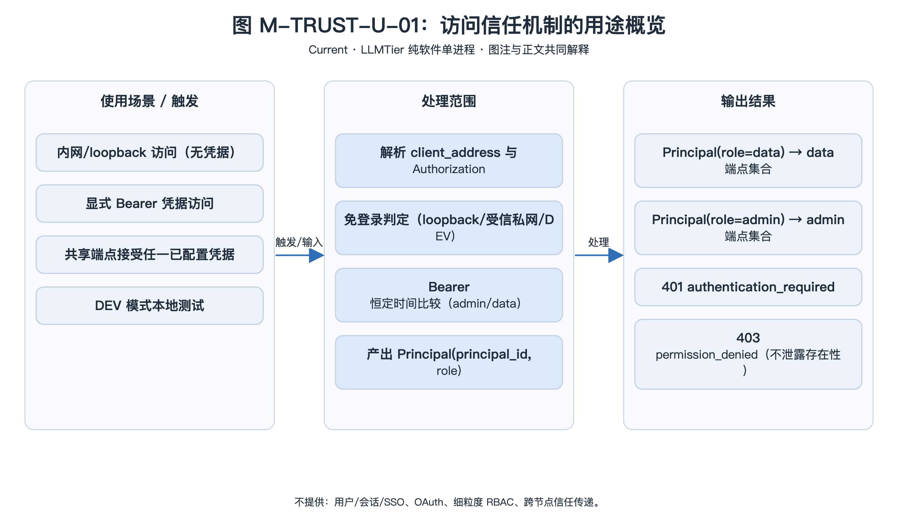
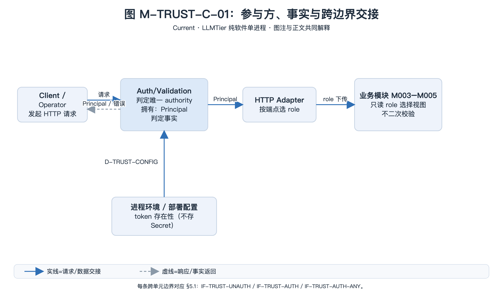
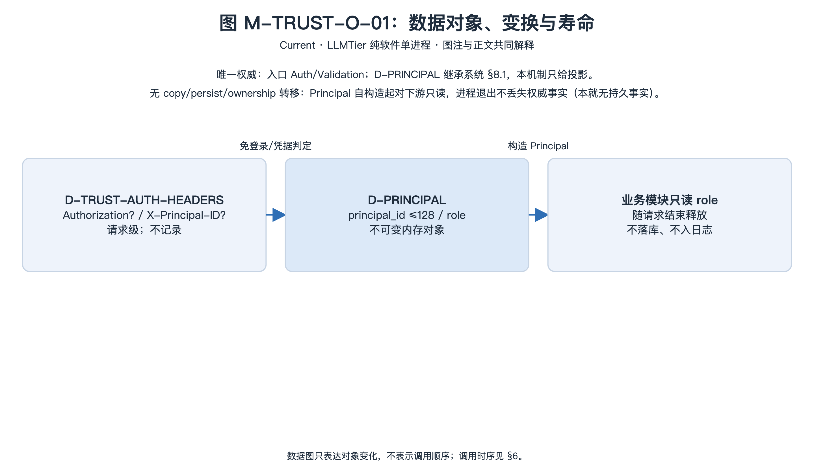
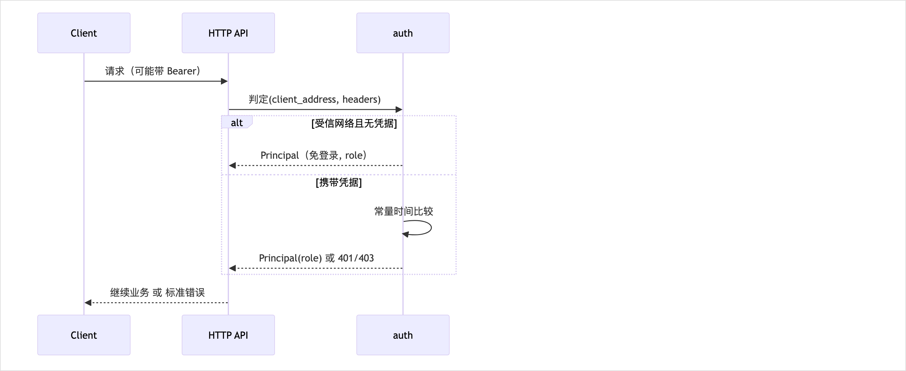

<!-- STD_DOCUMENT_COVER_BEGIN -->
# LLMTier 访问信任机制

> STD 使用入口：[项目采用说明与标准导航](../../../README.md#std-entry)

| 文档字段 | 值 |
|---|---|
| Document ID | `llmtier-access-trust-mechanism` |
| Document Version | `0.1.0-draft.6` |
| Status | `Draft` |
| Project | `LLMTier` |
| Authority | `LLMTier` |
| Document Owner | LLMTier |
| Authors | llmtier |
| Created Date | `2026-09-22` |
| Last Modified Date | `2026-09-25` |
| Template ID | `design.system-mechanism` |
| Template Version | `3.3.0` |
| Template Conformance | `tailored` |
| Tailoring Reference | `std-tailoring` |
| Migration Map Reference | none |
| Repository | `corezilla/LLMTier` |
| Canonical Path | `docs/20_system_design/mechanisms/access-trust.md` |
| Supersedes | none |
<!-- STD_DOCUMENT_COVER_END -->

## 1. 机制摘要：解决什么问题

LLMTier 部署在局域网，需要判定"**请求来自谁、以什么角色**"，并在**不引入用户/会话/SSO 体系**的前提下区分 consumer（data）与 operator（admin）权限。

**为什么是跨模块机制**：判定发生在**入口层**，但结果（`Principal`）被**业务层全部模块消费**，且决定了**可用端点集合**（data 端点 vs admin 端点）；"单点判定 + 下传 + 角色隔离"横跨入口与业务，是安全边界机制。

**输入 → 处理 → 输出**：
- 输入：HTTP 头（`Authorization`、`X-Principal-ID`）、客户端地址
- 处理：内网/loopback 免登录判定 **或** Bearer 恒定时间比较
- 输出：`Principal(principal_id, role)`，role ∈ {`data`, `admin`}

**核心取舍**：**入口单点鉴权**——判定只在入口发生一次，业务模块**不得二次校验**；凭据仅作纵深，不建用户体系。



[可编辑 SVG 源](../../assets/diagrams/diagram-mech-trust-usage.svg)

图 M-TRUST-U-01 · Current；内网/loopback 免登录与 Bearer 凭据两条入口共用入口单点判定，输出 `Principal(principal_id, role)` 并决定可用端点集合（data / admin）；共享端点两者皆可，非法或缺失凭据在采样业务前被拒绝。图只表达使用条件、触发动作与外部结果，不画内部调用顺序；参与方分工与时序另见 §3、§6。

- **机制形态与适用性 / 业务副作用**：只读观测——入口只做出准入判定并构造请求级 `Principal`，不写业务状态、不持久化凭据或主体；唯一外部结果是一次请求被受理或按 §4.8 拒绝。事实依据：§5.1 三条判定路径均无写操作，§4.10 记录本机制无持久事实。
- **交接域**：纯软件。判定、下传与消费发生在同一进程的入口层与业务层模块之间（M001 HTTP API ↔ M003–M005），无连接器、总线、寄存器或 FPGA 责任单元，故 §4.5、§5.3 不适用。
- **裁剪依据**：`std-tailoring` `LT-TL-003`（纯软件、无设备/FPGA 与子系统）；本机制另裁剪 §4.6/§4.7（无跨步骤状态、无持久表），理由就地记录于该两节与附录 A。

## 2. 使用场景与功能

| Capability ID | 业务任务与触发 | 输入与可观察结果 | 提供方 / 消费者 | 实现状态 | 验证判据 |
|---|---|---|---|---|---|
| CAP-TRUST-LAN | 内网/loopback 免登录访问 | 无 `Authorization` + 受信地址 → Principal | HTTP API / 全体 | Implemented | 免登录用例 |
| CAP-TRUST-BEARER | 显式 Bearer 凭据 | token 匹配 → 对应 role | HTTP API / 全体 | Implemented | 凭据用例 |
| CAP-TRUST-DATA | data 角色访问推理/向量化 | 可用 data 端点 | HTTP API / Consumer | Implemented | 端点集合用例 |
| CAP-TRUST-ADMIN | admin 角色访问管理面 | 可用 admin 端点 | HTTP API / Operator | Implemented | 401/403 用例 |
| CAP-TRUST-ANY | 共享端点接受两种凭据 | 按匹配 role 返回 | HTTP API / 两者 | Implemented | `/v1/usage` 用例 |
| CAP-TRUST-DEV | 本地测试免登录 | `LLMTIER_DEV_MODE=1` + loopback | HTTP API / 测试 | Implemented | 测试环境 |

**不提供**：用户/会话/SSO、OAuth、细粒度 RBAC、跨节点信任传递。

## 3. 参与方、责任和 authority



[可编辑 SVG 源](../../assets/diagrams/diagram-mech-trust-collab.svg)

图 M-TRUST-C-01 · Current；入口 Auth/Validation 是"谁以什么角色"的唯一裁决者，拥有 `Principal` 判定事实；HTTP Adapter 按端点选 role；M003–M005 只读 `role` 选择视图，不二次校验；进程环境提供凭据引用而不提供运行决定。蓝实线为请求/数据交接，灰虚线为响应/事实返回；工程 Owner 不作为运行组件。每条跨边界交接对应 §5.1 的成员登记，图中不承诺任何持久状态。

| Participant / 工程 Owner | 负责/不负责 | 决定/写入/事实来源/恢复（适用时） | Provided/Consumed interface | 部署/实现位置 | 依赖机制与基线 |
|---|---|---|---|---|---|
| Auth/Validation · HTTP API / LLMTier | 负责免登录/凭据判定、恒定时间比较、产出 `Principal`；不建用户体系 | 决定=角色归属；写入=无；事实来源=进程环境凭据 + 请求头；恢复=不适用（逐请求无状态） | 提供 `IF-TRUST-UNAUTH`、`IF-TRUST-AUTH`、`IF-TRUST-AUTH-ANY`（§5.1） | M001 入口层 `src/http_api/auth.py` | 无（顶层机制） |
| HTTP Adapter · HTTP API / LLMTier | 负责按端点选 role 分发与错误映射；不承载业务规则 | 决定=端点→role；写入=无；事实来源=`Principal`；恢复=不适用 | 消费 `IF-TRUST-*`；提供端点路由（§5.1） | M001 `src/http_api/app.py` | M-TRUST（本机制） |
| 业务模块（M003 Inference / M004 Management / M005 Observability）· 各模块 Owner | 只读 `role` 选择视图与端点集合；**不二次校验**、不新增鉴权调用点 | 决定=视图裁剪；写入=各自业务状态（非本机制）；事实来源=`D-PRINCIPAL.role`；恢复=请求结束释放内存对象 | 消费 `D-PRINCIPAL`（§4.2） | 业务层各模块 | M-TRUST（行为依赖） |
| 部署方 / 启动 · LLMTier | 提供 `LLMTIER_ADMIN_TOKEN`/`LLMTIER_DATA_TOKEN`/`LLMTIER_DEV_MODE` 的存在性；不存明文 Secret | 决定=凭据是否存在；写入=进程环境；事实来源=env；恢复=变更需重启 | 提供 `D-TRUST-CONFIG`（§4.3） | 部署配置（§13） | 无 |

### 3.1 系统约束与参与方承接

本机制为顶层机制（上级 Mechanism ID = none），约束继承自系统设计 §3。

| Constraint ID | 约束 | 参与方保证 | 自由度 | 本文落实位置 |
|---|---|---|---|---|
| CON-TRUST-001 | 判定只在入口发生一次，业务不二次校验 | HTTP API | 实现方式 | §3.2、§8 |
| CON-TRUST-002 | 不建用户/会话/SSO 体系 | HTTP API | — | §1、§11 |
| CON-TRUST-003 | 凭据比较恒定时间，不泄露存在性 | Auth | 算法 | §5.1、§8 |
| CON-TRUST-004 | 401/403 不泄露资源存在性 | 全体 | 错误映射 | §7、§11 |
| CON-TRUST-005 | 免登录仅在受信网络/loopback/DEV | Auth | 网络集合 | §4.3、§7 |

**约束 ID 说明**：本版按 `design.system-mechanism` 3.3.0 规则把历史 `CON-TRUST-001..5` 登记为 `CON-TRUST-001..005`（类别：机制约束，命名域 M-TRUST），语义不变；系统设计 §3.4 与下级 ISD 中的历史 `C-TRUST-*` 引用为待回写的变更影响，登记于 §16。

### 3.2 运行时统筹与确认责任

入口层在每个请求前判定，产出 `Principal` 并下传；业务模块**只消费** `principal.role` 决定视图/权限，**不再判定**。判定结果同时决定可用端点集合。

### 3.3 拓扑、目标身份与共享故障域

单进程单节点；判定为**进程内无状态函数**，无共享故障域、无跨节点协调、无持久状态。

## 4. 数据结构设计

> 按 STD `design-data-interface-format` 1.2.0 §2：主章“数据结构设计”，章内按**数据性质**分类（§4.1–§4.8）；本机制特有的跨结构分析见 §4.9–§4.10。仅保留适用类别，不适用类别在对应小节说明原因与 tailoring 依据。继承/机器源结构只定位原定义与本层投影，不复制字段权威。本章拥有的类型 ID 前缀 `D-TRUST-*`；唯一契约=本设计 + `src/http_api/auth.py`。

**类别适用性**：§4.1 公共基础类型与枚举 ✓｜§4.2 业务与操作数据结构 ✓（`D-PRINCIPAL` 继承系统 §8.1）｜§4.3 配置与规则数据结构 ✓｜§4.4 通信报文结构 ✓（HTTP 头 + `D-ERROR-ENVELOPE` 继承）｜§4.5 设备与 FPGA 表项结构 ✗（纯软件，无设备/RTL）｜§4.6 运行状态数据结构 ✗（逐请求无状态判定，无跨步骤状态）｜§4.7 数据库表结构 ✗（不持久化）｜§4.8 错误码与错误结构 ✓（引用系统 §8.8）。



[可编辑 SVG 源](../../assets/diagrams/diagram-mech-trust-objects.svg)

图 M-TRUST-O-01 · Current；HTTP 头与受控配置只读投影为请求级 `Principal`，自入口构造起对下游只读，随请求结束释放。对象跨入口层与业务层责任单元进行一次所有权转移，但无复制、无持久化、无变更转换，因此需要数据对象图明确损失边界（token 不进入对象、`X-Principal-ID` 仅作标识）。数据图不表示调用顺序；调用时序见 §6。

### 4.1 公共基础类型与枚举

**4.1.1 `D-TRUST-ROLE` · PrincipalRole（公共基础类型与枚举）**

```text
enum PrincipalRole { data, admin }
```

- **Data/Type ID、用途与来源**：

  `D-TRUST-ROLE`；调用主体角色枚举，决定可用端点集合（data 端点 vs admin 端点）；唯一来源系统设计 §8.1 共享枚举 `role ∈ {data,admin}`，本机制在 `src/http_api/auth.py` 实现投影。

- **`data`**：

  必填枚举值；consumer（推理/向量化/自身用量）；无第三值。

- **`admin`**：

  必填枚举值；operator（管理面/全部用量/诊断/观测）；无第三值。

- **跨字段与寿命**：

  `data` 与 `admin` 互斥；由入口单点判定，业务模块只读；随 `D-PRINCIPAL` 请求级内存传递，不持久，请求结束即释放。

- **合法/拒绝实例**：

  合法 `data`；拒绝其他字符串（如 `root`）不得构造 `Principal`（INV-4）。

- **验证**：

  `T-TRUST-ENDPOINTS`（INV-4）。

### 4.2 业务与操作数据结构

**4.2.1 `D-PRINCIPAL` · Principal（业务与操作数据结构，继承系统 §8.1）**

```text
Principal {
  principal_id: string,
  role: PrincipalRole
}
```

- **Data/Type ID、用途与来源**：

  `D-PRINCIPAL`；一次请求经入口鉴权后的调用主体；系统设计 §8.1 为唯一来源，本机制在 `src/http_api/auth.py:11` 实现投影，不重定义字段全集。

- **`principal_id`**：

  必填、非空字符串，最长 128、超出截断；主体标识；由入口在鉴权成功后写入，请求内不可变。

- **`role`**：

  必填 `D-TRUST-ROLE`（§4.1）；取值 `data`/`admin`。

- **跨字段与寿命**：

  不可变（`@dataclass(frozen=True, slots=True)`）；`role` 二值；构造函数不校验 role，由仅有的三条入口路径保证；请求级内存对象，Auth/Validation 写、业务模块只读；随请求结束释放，不持久、不入库。

- **合法/拒绝实例**：

  合法 `Principal("piko","data")`；拒绝：缺/非法凭据不构造 Principal，改由 §4.8 错误表达。

- **验证**：

  `T-TRUST-BEARER`、`T-TRUST-ENDPOINTS`；`src/http_api/auth.py`。

### 4.3 配置与规则数据结构

**4.3.1 `D-TRUST-CONFIG` · 信任与凭据配置（配置与规则数据结构）**

```text
TrustConfig {
  trusted_networks: ip_network[],
  admin_token_ref: string?,
  data_token_ref: string?,
  dev_mode: bool
}
```

- **Data/Type ID、用途与来源**：

  `D-TRUST-CONFIG`；决定免登录与凭据判定的受控配置；唯一来源 `src/http_api/auth.py`（`_TRUSTED_LAN_NETWORKS`、`_configured_token`）。

- **`trusted_networks`**：

  必填、固定集合 = {`10.0.0.0/8`,`172.16.0.0/12`,`192.168.0.0/16`,`fc00::/7`}；受信私网；不含公网。

- **`admin_token_ref`**：

  可空；`env:LLMTIER_ADMIN_TOKEN` 引用；仅存引用、不存明文。

- **`data_token_ref`**：

  可空；`env:LLMTIER_DATA_TOKEN` 引用；仅存引用、不存明文。

- **`dev_mode`**：

  必填布尔；来自 `LLMTIER_DEV_MODE=1`（仅 loopback，测试用）。

- **跨字段与寿命**：

  只存环境变量引用，不存明文；token 未配置且非 DEV → 503；网络集合为固定常量，不含公网。进程启动时读取（判定时实时读 env）；部署方拥有；token 变更需重启。

- **合法/拒绝实例**：

  合法 `LLMTIER_DATA_TOKEN=<secret>` 已设；拒绝：明文式引用或公网 CIDR（本机制不接受）。

- **验证**：

  `T-TRUST-LAN`、`T-TRUST-NOCFG`。

### 4.4 通信报文结构

**4.4.1 `D-TRUST-AUTH-HEADERS` · 鉴权请求头（通信报文结构，继承 HTTP wire）**

```text
AuthHeaders {
  Authorization: string?,
  X-Principal-ID: string?
}
```

- **Data/Type ID、用途与来源**：

  `D-TRUST-AUTH-HEADERS`；入口鉴权读取的 HTTP 请求头投影；机器权威=系统 `interfaces/openapi/llmtier.openapi.json`（security scheme），本节只给阅读视图。

- **`Authorization`**：

  可空字符串，`Bearer <token>`；缺省进入免登录/401 路径。

- **`X-Principal-ID`**：

  可空字符串，≤128；仅标识，不作授权依据。

- **跨字段与寿命**：

  请求级；M001 入口读取；不持久、不记录；`Authorization` 与免登录路径互斥。

- **合法/拒绝实例**：

  合法 `Authorization: Bearer …` + `X-Principal-ID: piko`；拒绝：`Authorization` 无 `Bearer ` 前缀 → §4.8 401。

- **验证**：

  `T-TRUST-BEARER`。

**4.4.2 `D-ERROR-ENVELOPE` · 错误信封（通信报文结构，继承系统 §8.4）**

```text
ErrorEnvelope {
  error: {
    message: string,
    type: string,
    code: string,
    param: string?,
    retryable: bool
  }
}
```

- **Data/Type ID、用途与来源**：

  `D-ERROR-ENVELOPE`；对外错误响应载荷；机器源 `openapi`（`ErrorEnvelope`），公共含义见系统 §8.8；本机制只产生鉴权类 Error ID。

- **`error`**：

  必填对象；含 `message`/`type`/`code`/`param`/`retryable`。

- **`error.message`**：

  必填字符串；人类可读摘要，不含凭据/Principal 秘密。

- **`error.type`**：

  必填字符串；错误类型（如 `request_error`）。

- **`error.code`**：

  必填字符串；稳定码值（如 `permission_denied`）。

- **`error.param`**：

  可空字符串；出错参数名。

- **`error.retryable`**：

  必填布尔；是否可安全重试。

- **跨字段与寿命**：

  不含凭据/Principal 秘密；401/403 不泄露资源存在性（INV-3）；请求级返回；构造于 `ApiError.envelope()`（`src/http_api/errors.py`）。

- **合法/拒绝实例**：

  合法 `{error:{type:"request_error",code:"permission_denied"}}`；拒绝：载荷含凭据或泄露存在性。

- **验证**：

  `T-TRUST-LEAK`。

### 4.5 设备与 FPGA 表项结构

不适用：LLMTier 为纯软件、单进程，本机制无连接器、总线、寄存器或 FPGA 端口（tailoring `LT-TL-003`）。

### 4.6 运行状态数据结构

不适用：鉴权为逐请求无状态判定，不存在跨步骤状态、唯一写者或恢复事实（§8.1 说明无租约/预留）。

### 4.7 数据库表结构

不适用：本机制不拥有持久表；`Principal` 与凭据不落库（CON-TRUST-002、INV-6）。

### 4.8 错误码与错误结构

**4.8.1 `D-TRUST-ERROR-MAP` · 鉴权错误映射（错误码与错误结构，引用系统 §8.8）**

```text
enum AuthErrorRef { ERR-AUTH-NOCFG, ERR-AUTH-REQUIRED, ERR-AUTH-DENIED }
```

- **Data/Type ID、用途与来源**：

  `D-TRUST-ERROR-MAP`；本机制对外鉴权错误的系统码引用，不新增公共错误码；唯一来源系统设计 §8.8（公共含义）与 `src/http_api/errors.py`（产生）；载荷统一 `D-ERROR-ENVELOPE`（§4.4.2）。

- **`ERR-AUTH-NOCFG`（503 `auth_not_configured`）**：

  未设 token 且非 DEV；未受理、无副作用；运维配置凭据后重试。

- **`ERR-AUTH-REQUIRED`（401 `authentication_required`）**：

  缺 `Authorization` 且地址不受信；未受理、无副作用；携带 Bearer 重试。

- **`ERR-AUTH-DENIED`（403 `permission_denied`）**：

  凭据不匹配（不区分 admin/data）；未受理、无副作用、不泄露存在性；更换正确凭据。

- **跨字段与寿命**：

  错误映射见 §7；载荷统一 `D-ERROR-ENVELOPE`（§4.4.2）；不记录凭据；请求级返回，不持久。

- **合法/拒绝实例**：

  拒绝：错误 token → 403 `permission_denied`。

- **验证**：

  `T-TRUST-BEARER`、`T-TRUST-NOCFG`、`T-TRUST-LEAK`。

### 4.9 编码、布局与共享类型映射

不适用二进制 ABI：本机制为进程内判定，`Principal` 仅内存传参；对外经 HTTP/1.1 + UTF-8 JSON 错误信封。

| 类型 ID / 编码源基线 | 逻辑宽度/序列化长度 | 实际 ABI 定位或不适用理由 | 原类型 → 投影/转换/损失 | 验证项 |
|---|---|---|---|---|
| `D-PRINCIPAL`（系统 §8.1） | 内存对象 | 无二进制布局；`@dataclass(slots=True)` 仅进程内 | 系统 `D-PRINCIPAL` → 本机制同名字段，无损失 | `T-TRUST-ENDPOINTS` |
| `D-TRUST-AUTH-HEADERS`（`openapi` security） | HTTP 头；`principal_id` ≤128 | 无端序/对齐；RFC 7230 头编码 | HTTP 头 → `Principal` 字段投影；token 不落对象 | `T-TRUST-BEARER` |
| `D-ERROR-ENVELOPE`（系统 §8.4） | UTF-8 JSON | 无 wire offset；`openapi` 定义 | 系统信封 → `ApiError.envelope()`，无损失 | `T-TRUST-LEAK` |

### 4.10 一致性、可见性与数据寿命

判定局部一致：每个请求独立读 config/env 并产出 `Principal`，无共享可变状态、无缓存，故并发请求之间无一致性问题。`Principal` 自入口构造起对下游只读，随请求结束释放；不跨请求共享、不持久化。凭据仅存活于 env 与判定栈帧，不进入日志或响应（INV-6）。免登录地址判定基于 `client_address` 去 zone id 后的 IP，地址不构成持久身份；进程退出不丢失任何权威事实（本就无持久事实）。

## 5. 接口设计

> 按 STD `design-data-interface-format` 1.2.0 §3：主章“接口设计”，按**接口用途**分类逐接口完整记录；标题为真实调用形式，标题下先给**完整接口声明**，再就地说明输入/输出，最后按六项写完。数据结构引用 §4；错误引用系统 §8.8。分类：API = 向 Consumer/Operator 提供可调用能力（本机制为 HTTP 端点，登记于系统设计）；消息与数据流 = 组件/系统之间为协作而交换的命令/状态/事件/队列/流/文件。本机制拥有的接口是入口层内部**函数**（Auth/Validation 提供、HTTP Adapter 消费），向使用方提供可调用能力，故归 §5.1 API。

### 5.1 API（适用时）

#### `unauthenticated_principal(client_address: str, headers, role: str) -> Principal | None`

```text
unauthenticated_principal(client_address: str, headers: Headers, role: str) -> Principal | None
```

- **Interface/Member ID、用途、提供责任与唯一来源**：`IF-TRUST-UNAUTH`；对受信来源产出免登录 `Principal`；Auth/Validation 提供、HTTP Adapter 消费；交接边界=入口地址解析后、凭据判定前；状态=Implemented；唯一契约=本设计；`src/http_api/auth.py` `unauthenticated_principal`。
- **输入与前提**：`client_address: str`（去 zone id 的 IP 文本）、`headers`（读 `Authorization` 存在性）、`role: D-TRUST-ROLE`（§4.1）；前置=入口已解析地址；授权=无（判定入口本身）；校验顺序=有 `Authorization` → `None`；IP 解析失败 → `None`；DEV+loopback → 免登录；loopback/受信私网 → 免登录。
- **成功输出与保证**：`D-PRINCIPAL`（§4.2）——受理即时返回；`principal_id` 为 `loopback-*`/`trusted-lan-*`（按 role），`role` 由调用方指定；无副作用、不持久。
- **错误与合法下一步**：无 Error ID；不命中返回 `None`（非错误，调用方继续凭据路径，§7）；无部分成功或未知结果。
- **交互与生命周期**：同步纯函数；无期限/取消；幂等只读；不缓存、不记录凭据。
- **实现与验证**：正常 `client_address="192.168.1.42"`、无 `Authorization`、`role="data"` → `Principal("trusted-lan-consumer","data")`；边界 `1.2.3.4` → `None`。`T-TRUST-LAN`；Run=NOT_RUN。

#### `authenticate(headers, role: str) -> Principal`

```text
authenticate(headers: Headers, role: str) -> Principal
```

- **Interface/Member ID、用途、提供责任与唯一来源**：`IF-TRUST-AUTH`；校验 Bearer 凭据并产出指定 role 的 `Principal`；Auth/Validation 提供、HTTP Adapter 消费；交接边界=免登录未命中后的凭据判定；状态=Implemented；`src/http_api/auth.py` `authenticate`。
- **输入与前提**：`headers`（`Authorization`、`X-Principal-ID`）、`role: D-TRUST-ROLE`；前置=token 已配置或 DEV；授权=凭据匹配指定 role；校验顺序=配置存在性 → `Bearer ` 前缀 → `hmac.compare_digest` 恒定时间比较。
- **成功输出与保证**：`D-PRINCIPAL`——受理=返回 Principal；`principal_id` 取 `X-Principal-ID`（截断 128）或默认 `operator`/`consumer`；生效=本次请求后续按 role 限权；无持久副作用。
- **错误与合法下一步**：`ERR-AUTH-NOCFG`（503，配置缺失，未受理，无副作用）；`ERR-AUTH-REQUIRED`（401，缺 Bearer）；`ERR-AUTH-DENIED`（403，凭据不匹配，不区分 admin/data）；载荷均 `D-ERROR-ENVELOPE`；合法下一步见 §4.8。
- **交互与生命周期**：同步；无期限/取消；幂等；只读，无资源释放。
- **实现与验证**：正常 `Bearer <data-token>` + `X-Principal-ID: piko`、`role="data"` → `Principal("piko","data")`；拒绝错误 token → 403。`T-TRUST-BEARER`；Run=NOT_RUN。

#### `authenticate_any(headers, client_address: str) -> Principal`

```text
authenticate_any(headers: Headers, client_address: str) -> Principal
```

- **Interface/Member ID、用途、提供责任与唯一来源**：`IF-TRUST-AUTH-ANY`；共享端点接受任一已配置凭据或受信免登录并产出 `Principal`；Auth/Validation 提供、HTTP Adapter 消费；交接边界=共享端点（如 `/v1/usage`）入口；状态=Implemented；`src/http_api/auth.py` `authenticate_any`。
- **输入与前提**：`headers`、`client_address: str`；前置=共享端点；授权=任一已配置凭据（admin 先于 data）或受信免登录；校验顺序=admin → data → 免登录 → 401。
- **成功输出与保证**：`D-PRINCIPAL`——role 反映匹配到的凭据（admin 优先）；生效=调用方按 role 选择视图；无副作用。
- **错误与合法下一步**：`ERR-AUTH-NOCFG`（503，均未配置）；`ERR-AUTH-DENIED`（403，有 Bearer 但均不匹配）；`ERR-AUTH-REQUIRED`（401，无 Bearer 且免登录不命中）；载荷 `D-ERROR-ENVELOPE`。
- **交互与生命周期**：同步；固定顺序 admin→data（确定性）；幂等；只读。
- **实现与验证**：正常 data token 访问 `/v1/usage` → `Principal(...,"data")`；边界：无 token 的受信 LAN → admin 免登录。`T-TRUST-SHARED`；Run=NOT_RUN。

### 5.2 消息与数据流接口（适用时）

不适用：本机制不拥有组件/系统间协作交换的消息、队列、流或文件接口；鉴权函数是向使用方提供能力的函数 API（§5.1）。

### 5.3 硬件与固件接口（适用时）

不适用：无连接器、总线、寄存器或 FPGA 端口。

### 5.4 人机与维护接口（适用时）

不适用：凭据与 DEV 模式经进程环境变量注入，属部署配置（§13）与维护入口（§12.2），不构成本机制拥有的独立人机接口。

> **闭合核对**：§3 协作图与 §6、§14.3 中的每条真实跨责任单元交接均在 §5.1 有唯一接口记录（`IF-TRUST-UNAUTH`/`IF-TRUST-AUTH`/`IF-TRUST-AUTH-ANY`）；§5.1 非 N/A，入口 Auth/Validation → HTTP Adapter 的进程内函数交接已登记，故不适用性只落在 §5.2/§5.3/§5.4。§4.8 的 401/403/503 均为已知失败，结果未知不被改写为失败。

## 6. 正常端到端流程



[可编辑 SVG 源](../../assets/diagrams/diagram-mech-trust-sequence.svg)

图 M · 访问信任判定时序（实线=请求，虚线=响应；先后关系非时间比例）。

1. **解析地址**：取 `client_address`（去 zone id）。
2. **免登录判定**：无 `Authorization` 且（DEV+loopback 或 loopback/私网）→ 返回免登录 Principal（role 由端点决定）。
3. **凭据判定**：否则校验 `Bearer`，恒定时间比较 admin/data token。
4. **产出 Principal**：role + principal_id（`X-Principal-ID` 或默认）。
5. **下传**：业务模块按 `role` 选择视图/端点集合，**不再判定**。

**触发 → 结果 → 释放**：触发 = 请求到达入口并解析地址；结果 = 下传 `Principal` 或按 §4.8 拒绝；释放 = 请求结束即释放请求级内存对象，无资源需归还。本机制无业务写入、无持久提交，故不存在"提交前后中断"的恢复分支：客户端在判定后中断只丢弃本次请求，不产生需去重或补偿的状态；入口重启后重新判定只产生新 `Principal`，不恢复旧判定。迟到响应与临时资源边界见 §8.1、§9。

### 6.1 交叠请求、跨轮次与生命周期边界

判定 = 每请求一次（无状态）。**交叠**：多请求各自独立判定；`authenticate_any` 先 admin 后 data（顺序固定）；无共享状态、无锁。

## 7. 分支和替代流程

| 分支 | 触发 | 处理 |
|---|---|---|
| 未配置凭据 | 无 token 环境且非 DEV | 503 `auth_not_configured` |
| 无凭据且地址不受信 | 无 `Authorization` + 非受信 | 401 `authentication_required` |
| 凭据错误 | token 不匹配 | 403 `permission_denied` |
| 未认证 loopback（DEV）| DEV 且 loopback | 免登录 operator/consumer |
| 受信 LAN | 私网地址 | 免登录 |
| 共享端点 | `authenticate_any` | 按匹配 role 返回 |

## 8. 状态机与不变量

| INV-ID | 可验证断言（量词、条件和预期必须明确） | Enforcement / 事实来源 | 反例输入/违反后的结果 | 验证项 |
|---|---|---|---|---|
| INV-1 | 判定只在入口发生一次；∀ 业务模块无鉴权调用点 | `_auth*` 仅在 HTTP Adapter | 下游二次校验 → 边界分叉 | T-TRUST-ENDPOINTS |
| INV-2 | 凭据比较恒定时间（不因前缀匹配提前返回）| `hmac.compare_digest` | 提前返回 → 时序侧信道 | T-TRUST-BEARER |
| INV-3 | ∀ 401/403：不泄露资源存在性与凭据角色差异 | 错误映射（§7）| 可区分响应 → 信息泄露 | T-TRUST-LEAK |
| INV-4 | ∀ Principal：`role ∈ {data, admin}`；无第三种 | `Principal` 类型 | 新增角色 → 端点集合不确定 | T-TRUST-ENDPOINTS |
| INV-5 | 免登录仅在 loopback / 受信私网 / DEV 命中 | `unauthenticated_principal` | 公网免登录 → 越权 | T-TRUST-LAN |
| INV-6 | 不持久化 Principal 与凭据 | 仅内存传递 | 落库/日志 → 泄密 | T-TRUST-LEAK |

### 8.1 资源预留、交付、释放与复位

无预留/租约（无状态判定）。**交付** = 每请求返回 Principal；**复位** = 请求结束即释放（无残留）。

## 9. 失败传播、重试与恢复

| Failure ID / 检测方 | 失败点与传播 | 结果已知性 | 已发生/可能副作用 | 访问安全/证据 | 操作终态 | 资源释放 | 重新准入/重试条件 |
|---|---|---|---|---|---|---|---|
| F-TRUST-1 / Auth | 未配置凭据 | 已知失败 | 无 | 无 | 503 | 无 | 配置后重试 |
| F-TRUST-2 / Auth | 缺凭据 | 已知失败 | 无 | 无 | 401 | 无 | 补凭据后重试 |
| F-TRUST-3 / Auth | 凭据错误 | 已知失败 | 无 | 无 | 403 | 无 | 修正凭据后重试 |

**恢复边界**：判定失败**不影响**已认证请求；无状态、无重试队列。凭据错误不触发任何后端调用。

## 10. 并发、排序与容量

| 作用域 | 约束 | 行为 |
|---|---|---|
| 判定 | 无状态纯函数 | 无锁、无竞争 |
| `authenticate_any` | 固定顺序 admin→data | 确定性 |
| 容量 | 无状态 | 无限流（限流属 M-INFER 准入）|

## 11. 安全、权限与信任边界

| 资产 | 身份来源 | 强制点 | 拒绝 | 审计 |
|---|---|---|---|---|
| data 端点 | Bearer(data) / 免登录 | `_auth("data")` | 401/403 | — |
| admin 端点 | Bearer(admin) / 免登录 | `_auth("admin")` | 401/403 | — |
| 共享端点 | 任一 | `_auth_either()` | 401/403 | — |

边界：consumer 只见自身数据；operator 见全部；不记录凭据；**不泄露资源存在性**（INV-3）。凭据为纵深，不替代网络边界。

## 12. 可观测性与证据

### 12.1 统计、日志、时间与关联

判定结果（role）随请求进入 trace/日志的关联上下文（M-OBS），但**凭据与 Principal 秘密不入日志**。

### 12.2 维护命令、自检与调试路径

| Maintenance API / Command / Diagnostic ID | 执行位置、入口、目标、权限 | 完整请求/语法与结果/错误契约 | 施加/回读点及覆盖 | 依赖/占用/恢复退出 | 验证 |
|---|---|---|---|---|---|
| 配置凭据 `LLMTIER_ADMIN_TOKEN` / `LLMTIER_DATA_TOKEN` | 进程环境变量；部署方 | 值 = token；无 HTTP 契约；未配置则运行期 503 | 施加=进程环境；回读=请求结果 | 需重启生效 | T-TRUST-NOCFG |
| 测试免登录 `LLMTIER_DEV_MODE=1` | 进程环境变量（**仅测试**）| 值 = `1`；仅 loopback 生效 | 施加=进程环境 | 仅测试；非生产 | T-TRUST-LAN |

## 13. 配置、兼容与部署

凭据经环境变量注入；DEV 模式仅限测试。兼容：role 集合与错误码为契约；新增角色需显式变更并回写系统设计 §3.5。

## 14. 跨责任单元分解与接口分配（下级设计输入）

本章是**要求侧**：把本机制分解到各责任单元（LLMTier 为纯软件，责任单元 = 软件模块），说明每个对象必须负责什么、提供什么接口。下级模块设计在附录"机制承接表"逐条记录**落实侧**。

### 14.1 参与方到架构对象映射

| 机制参与方（§3） | 责任单元/Owner | 架构对象 ID / 类型 / 层或领域 | 下级设计文档 | 在本机制中的主责与非职责 |
|---|---|---|---|---|
| 判定 | HTTP API / LLMTier | Auth/Validation（入口层）| `http-api-design.md` | 免登录/凭据判定、产出 Principal；不建用户体系 |
| 下传与消费 | 业务模块 / LLMTier | Inference/Management/Observability（业务层）| `inference-design.md、management-design.md、observability-design.md` | 按 `role` 选择视图/端点，**不二次校验** |
| 入口分发 | HTTP API / LLMTier | HTTP Adapter（入口层）| `http-api-design.md` | `_auth()`/`_auth("admin")`/`_auth_either()` |
| 配置 | 启动 / LLMTier | env 读取 | `http-api-design.md` | token 存在性；不存 Secret |

### 14.2 功能和步骤到责任单元分配

| Capability / Process Step / Constraint | 主责架构对象 | 协作对象 | 必须产生或消费的结果 | 固定行为 / 本地自由度 | 组合验证责任 |
|---|---|---|---|---|---|
| Step 1 解析地址（CON-TRUST-005）| Auth/Validation | — | client address | 地址解析实现可自定 | T-TRUST-LAN |
| Step 2 免登录判定 | Auth/Validation | — | 免登录 Principal | 网络集合固定 | T-TRUST-LAN |
| Step 3 凭据判定（CON-TRUST-003）| Auth/Validation | — | Principal | 恒定时间比较固定 | T-TRUST-BEARER |
| Step 4 产出 Principal（CON-TRUST-002/004）| Auth/Validation | — | `(id, role)` | role 集合固定 | T-TRUST-ENDPOINTS |
| Step 5 下传与消费（CON-TRUST-001）| 业务模块 | HTTP Adapter | 端点集合/视图 | 不二次校验固定 | T-TRUST-ENDPOINTS |

### 14.3 责任单元间接口契约

> 本节为**分配视图**：只把 §14.1 的责任单元映射到 §5 已定义的接口成员 ID 与 §4 结构 ID；完整签名、字段、编码和错误码由 §5 与系统 §8.8 唯一维护，本节不复制字段或错误表。

| 责任单元（§14.1） | 承接的成员/结构 ID（§4/§5） | 角色 | 本机制固定的语义与边界（引用） |
|---|---|---|---|
| Auth/Validation | `IF-TRUST-UNAUTH`、`IF-TRUST-AUTH`、`IF-TRUST-AUTH-ANY` | 提供 | 单点判定、恒定时间比较、Principal 产出（§5.1） |
| HTTP Adapter | `IF-TRUST-AUTH`、`IF-TRUST-AUTH-ANY` | 消费 | 按端点选 role 分发；不二次校验（§5.1、CON-TRUST-001） |
| 业务模块（全体） | `D-PRINCIPAL`（§4.2） | 消费 | 只读 `role` 选择视图/端点，不得新增鉴权调用点 |
| 启动 | `D-TRUST-CONFIG`（§4.3） | 提供 | 环境变量凭据存在性；不存 Secret |

### 14.4 下级设计输入清单

| 下级要求 ID | 承接对象 ID / 下级设计文档 | 来源 Capability / Step / Constraint / 接口成员 | 必须负责的行为与保证 | 必须提供/消费的接口 | 下级必须展开的问题 | 允许自行决定的范围 | 本地验证 / 组合验证交接 |
|---|---|---|---|---|---|---|---|
| R-TRUST-01 | Auth/Validation · `http-api-design.md` | CON-TRUST-001/003/005、Step 1–4、interface `authenticate*` | 单点判定、恒定时间比较、不泄露存在性 | `authenticate`/`authenticate_any`/`unauthenticated_principal` | 地址解析、网络集合、错误映射 | 解析/映射实现 | 契约 |
| R-TRUST-02 | HTTP Adapter · `http-api-design.md` | Step 3–5 | 按端点选 role、分发 | `_auth()`/`_auth("admin")`/`_auth_either()` | 端点→role 映射 | 分发实现 | 契约 |
| R-TRUST-03 | 业务模块（全体）· `inference-design.md、management-design.md、observability-design.md` | CON-TRUST-001/004、Step 5 | **不二次校验**，按 `role` 限制视图 | — | 消费点、越权防护 | 视图实现 | 组合 |
| R-TRUST-04 | 启动 · `management-design.md` | CON-TRUST-002、F-TRUST-1 | env token 存在性 | — | 503 语义 | 读取实现 | T-TRUST-NOCFG |

**约束**：任何业务模块**不得**新增鉴权调用点（CON-TRUST-001）；新增角色/端点须回写本节并关联模块设计。

## 15. 验证、上线与回滚

### 15.1 输入构造、故障控制与独立判据

| Test / Constraint | 输入与预置事实 | arm/hit/release | 独立 Oracle |
|---|---|---|---|
| T-TRUST-LAN / CON-TRUST-005 | 私网地址、无 Authorization | — | 免登录 Principal |
| T-TRUST-BEARER / CON-TRUST-003 | 正确/错误 token | — | 200 / 403 |
| T-TRUST-ENDPOINTS / CAP-TRUST-DATA | data 凭据访问 admin 端点 | — | 403 |
| T-TRUST-SHARED / CAP-TRUST-ANY | 两种凭据访问 `/v1/usage` | — | 视图按 role 区分 |
| T-TRUST-NOCFG / F-TRUST-1 | 无 token 环境 | — | 503 |
| T-TRUST-LEAK / INV-3 | 不存在 vs 无权限资源 | — | 响应不可区分 |

### 15.2 环境部署、复位、并发隔离与自动化

测试可用 DEV 免登录；凭据用例显式设 token；复位无状态、无需清理。

### 15.3 组合验收、启用与旧机制退出

组合验收 = Consumer（Piko）以 data 凭据调用 + Operator 以 admin 凭据管理。

## 16. 风险、未决问题与决定

| ID | 类别 | 影响 | 下一步 | 状态 |
|---|---|---|---|---|
| RISK-TRUST-1 | 风险 | 内网免登录依赖网络边界 | 明文声明边界，凭据作纵深 | 已接受 |
| RISK-TRUST-2 | 风险 | 单一共享 token（无 per-user）| 与"不建用户体系"取舍一致 | 已接受 |
| RISK-TRUST-3 | 变更影响 | `CON-TRUST-*` 已在本机制登记，系统设计 §3.4 与 ISD 仍引用历史 `C-TRUST-*` | 回写系统摘要、ISD 承接与 §14.4 引用 | 待回写（不阻塞本机制） |

## A. 输入基线、适用性与图文规则

- 输入基线：系统设计 §3；`src/http_api/auth.py`、`src/http_api/app.py`；`interfaces/openapi/llmtier.openapi.json`（安全方案）。
- 适用性：纯软件、单进程、入口单点鉴权机制；责任单元按运行边界判定为 M001 入口层与 M003–M005 业务层。§4.5/§5.3（设备/FPGA）不适用（`std-tailoring` `LT-TL-003`）；§4.6（跨步骤状态）、§4.7（持久表）不适用（逐请求无状态、不持久）；§4.9（二进制 ABI）不适用（HTTP + UTF-8 JSON）；§8.1（租约）不适用（无预留）。
- 图文规则：§1 用途概览 `diagram-mech-trust-usage`（Current）、§3 参与方协作 `diagram-mech-trust-collab`（Current）、§4 数据对象 `diagram-mech-trust-objects`（Current）、§6 正常时序 `diagram-mech-trust-sequence`。一图一问题；交互图用语义方向线，数据图不冒充时序；图内中文与框线以本地浏览器抽查可读。
- 数据对象图触发：`D-PRINCIPAL` 在入口层与业务层之间发生所有权转移，故按条件画图；本机制无持久化，故不展开恢复边界。

## B. 文档控制与修订记录

初版 `0.1.0-draft.1`；`draft.3` 补实全部章节、增模块分解与不变量；`draft.6` 按 `design.system-mechanism` 3.3.0 补用途/参与方/数据三图、"机制形态与适用性"块，并把历史 `C-TRUST-*` 约束登记为 `CON-TRUST-*`。修订见 Git。
