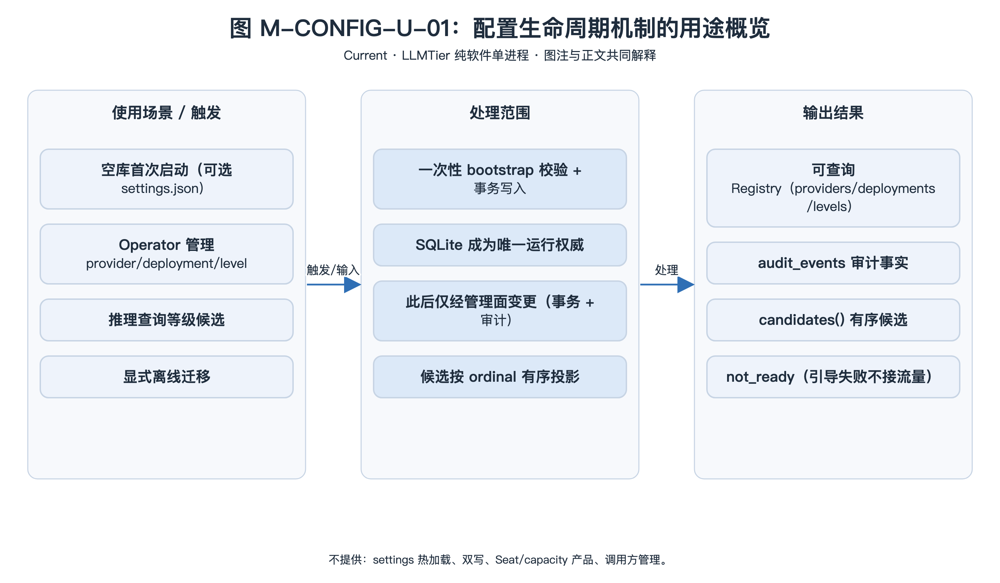
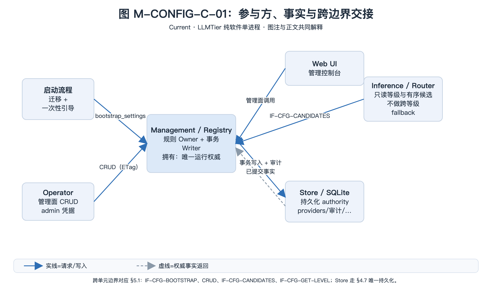
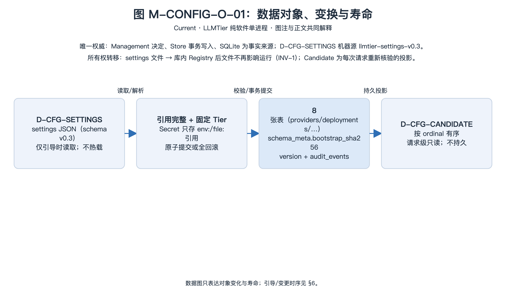
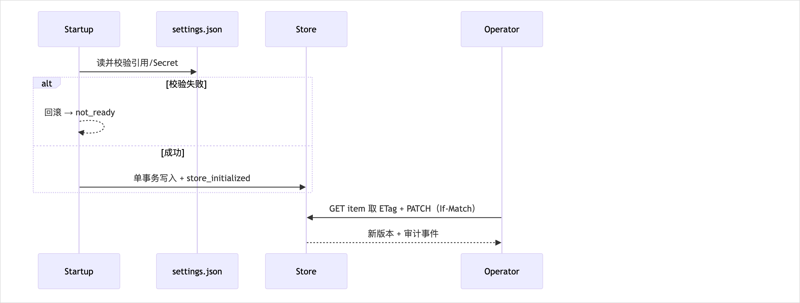

<!-- STD_DOCUMENT_COVER_BEGIN -->
# LLMTier 配置生命周期机制

> STD 使用入口：[项目采用说明与标准导航](../../../README.md#std-entry)

| 文档字段 | 值 |
|---|---|
| Document ID | `llmtier-config-lifecycle-mechanism` |
| Document Version | `0.1.0-draft.6` |
| Status | `Draft` |
| Project | `LLMTier` |
| Authority | `LLMTier` |
| Document Owner | LLMTier |
| Authors | llmtier |
| Created Date | `2026-09-22` |
| Last Modified Date | `2026-09-25` |
| Template ID | `design.system-mechanism` |
| Template Version | `3.3.0` |
| Template Conformance | `tailored` |
| Tailoring Reference | `std-tailoring` |
| Migration Map Reference | none |
| Repository | `corezilla/LLMTier` |
| Canonical Path | `docs/20_system_design/mechanisms/config-lifecycle.md` |
| Supersedes | none |
<!-- STD_DOCUMENT_COVER_END -->

## 1. 机制摘要：解决什么问题

配置**从哪里来、如何校验、何时生效、如何变更与审计**，以及初始化失败时系统如何**保持不可接流量**。

**为什么不能由一个单元独立完成**：启动引导、运行期变更、查询一致性、Secret 解析与审计横跨启动路径、管理面、存储；且必须保证"**初始化后单一权威**"，否则文件与库双写会产生不可判定状态。

**输入 → 处理 → 输出**：
- 输入：空库首次启动（可选 `config/settings.json`）、管理面 CRUD、离线迁移
- 处理：一次性 bootstrap 校验+事务写入 → **SQLite 成为唯一运行权威** → 此后仅经管理面变更（事务 + 审计）
- 输出：可查询的 Registry（providers/deployments/service-levels）+ 审计事件

**核心取舍**：**单次 bootstrap、不热载文件**。初始化后即使文件变化也不自动重导入（避免双写歧义）。



[可编辑 SVG 源](../../assets/diagrams/diagram-mech-config-usage.svg)

图 M-CONFIG-U-01 · Current；空库首次启动读一次 `settings.json`，管理面变更走 ETag 事务，推理按 `ordinal` 只读候选；引导失败保持 not_ready 不接流量。图只表达场景、处理范围与外部结果，不画内部调用顺序；参与方分工见 §3，引导/变更时序见 §6。

- **机制形态与适用性 / 业务副作用**：具体副作用——`bootstrap_settings` 与 CRUD 在 SQLite 单事务内写入 providers/deployments/service_levels 及审计事件，发布提交是唯一"确认"点；事实依据 §5.1 `IF-CFG-*` 的写入事务与 §4.7 持久表。
- **交接域**：纯软件。规则决定在 M004 Management，持久化由 Store 承担，推理只读经 M003 Router；无连接器、总线、寄存器或 FPGA 责任单元，故 §4.5、§5.3 不适用。
- **裁剪依据**：`std-tailoring` `LT-TL-003`（纯软件、无设备/FPGA 与子系统）；§4.5/§5.3 见该决定，§4.9 仅给编码阅读视图（SQLite/JSON，无二进制 ABI）。

## 2. 使用场景与功能

| Capability ID | 业务任务与触发 | 输入与可观察结果 | 提供方 / 消费者 | 实现状态 | 验证判据 |
|---|---|---|---|---|---|
| CAP-CFG-BOOTSTRAP | 空库首次启动 | settings → 库中 Registry + `bootstrap_sha256` | Management / 启动 | Implemented | 首次/重复启动用例 |
| CAP-CFG-CRUD | Operator 管理 provider/deployment/level | ETag 强校验的增删改 | Management / Operator | Implemented | Admin 契约用例 |
| CAP-CFG-VALIDATE | 发布前校验引用与不变量 | 拒绝并回滚 | Management | Implemented | 非法引用/space 用例 |
| CAP-CFG-CANDIDATE | 推理查询等级候选 | 同等级有序候选 | Management / Inference | Implemented | 路由用例 |
| CAP-CFG-MIGRATE | 显式离线迁移 | 备份 + 单一版本命令 | Operator（离线）| Manual | 运维演练 |
| CAP-CFG-NOTREADY | 初始化失败保持不可用 | `/readyz` 未就绪 | 启动 | Implemented | 引导失败用例 |

**不提供**：settings 热加载、双写、Seat/capacity 产品、调用方管理。

## 3. 参与方、责任和 authority



[可编辑 SVG 源](../../assets/diagrams/diagram-mech-config-collab.svg)

图 M-CONFIG-C-01 · Current；启动流程与 Management 共同决定配置，Management 是规则 Owner 与事务 Writer，Store/SQLite 是唯一事实来源；Router 只读候选、Web UI 只经管理面。蓝实线为请求/写入，灰虚线为权威事实返回；工程 Owner 不作为运行组件。每条跨边界交接对应 §5.1 成员登记（`IF-CFG-*`）与 §4.7 唯一持久化。

| Participant / 工程 Owner | 负责/不负责 | 决定/写入/事实来源/恢复（适用时） | Provided/Consumed interface | 部署/实现位置 | 依赖机制与基线 |
|---|---|---|---|---|---|
| 启动流程 · LLMTier | 负责迁移、读 settings、一次性引导、not_ready；不处理运行期变更 | 决定=是否引导；写入=bootstrap 事务；事实来源=`schema_meta.bootstrap_sha256`；恢复=重启以库内事实为准 | 提供/消费 `IF-CFG-BOOTSTRAP`（§5.1） | 启动路径（`__main__`） | 无（顶层机制） |
| Management（Registry/Config、Admin）· LLMTier | 负责 CRUD、ETag、能力/不变量校验、审计、有序候选；不承载推理 | 决定=规则与发布；写入=单事务；事实来源=Registry 行；恢复=发布失败回滚、旧快照不变 | 提供 `IF-CFG-PROVIDERS`、`IF-CFG-DEPLOYMENTS`、`IF-CFG-LEVELS`、`IF-CFG-CANDIDATES`、`IF-CFG-GET-LEVEL`（§5.1） | M004 业务层 | 无 |
| Store / Audit Writer · LLMTier | 负责事务与唯一持久化、审计写入；不做业务规则 | 决定=无；写入=各持久表（§4.7）；事实来源=SQLite 文件；恢复=崩溃以已提交行为准 | 提供 `transaction`（§4.7） | M007 基础层 | 无 |
| Inference / Router · LLMTier | 只读等级/能力与有序候选；不做跨等级 fallback | 决定=同等级内选择；写入=无；事实来源=Registry（每请求核验）；恢复=请求级只读 | 消费 `IF-CFG-CANDIDATES`、`IF-CFG-GET-LEVEL`（§5.1） | M003 业务层 | M-CONFIG（本机制） |
| HTTP Adapter · HTTP API / LLMTier | 管理面路由与错误映射；不含业务规则 | 决定=无；写入=无；事实来源=Registry 响应；恢复=不适用 | 消费 `IF-CFG-PROVIDERS`/`IF-CFG-DEPLOYMENTS`/`IF-CFG-LEVELS`（§5.1） | M001 入口层 | 无 |
| Web UI · Web UI / LLMTier | 管理控制台；不直读库/Secret | 决定=无；写入=无；事实来源=管理面响应；恢复=不适用 | 消费管理面（§5.1） | M002 入口层 | M-CONFIG（本机制） |

### 3.1 系统约束与参与方承接

本机制为顶层机制（上级 Mechanism ID = none），约束继承自系统设计 §3 与 §10。

| Constraint ID | 约束 | 参与方保证 | 自由度 | 本文落实位置 |
|---|---|---|---|---|
| CON-CFG-001 | 初始化后 SQLite 是唯一运行权威 | Management | 存储布局 | §4.6、§4.10、§8 |
| CON-CFG-002 | Secret 明文不入库，只存引用 | Management | 引用形式 | §4.3、§11 |
| CON-CFG-003 | 发布先验证引用/不变量，再原子推进 | Management | 事务实现 | §6、§8 |
| CON-CFG-004 | 变更失败回滚且不改 active snapshot | Management | — | §7、§9 |
| CON-CFG-005 | 初始化失败服务 not_ready | 启动 | — | §9 |

**约束 ID 说明**：本版按 3.3.0 规则把历史 `CON-CFG-001..5` 登记为 `CON-CFG-001..005`（类别：机制约束，命名域 M-CONFIG），语义不变；系统设计 §3.4 与下级 ISD 中的历史 `C-CFG-*` 引用为待回写项，登记于 §16。

### 3.2 运行时统筹与确认责任

**bootstrap** 统筹于启动事务；**变更**统筹于管理动作，成功即写审计。发布事务是唯一的"确认"点。

### 3.3 拓扑、目标身份与共享故障域

单节点单文件；无跨节点协调。SQLite 为唯一权威；`config/settings.json` 仅为一次性输入，**故障域之外**（不参与运行期）。

## 4. 数据结构设计

> 按 STD `design-data-interface-format` 1.2.0 §2：主章“数据结构设计”，章内按**数据性质**分类（§4.1–§4.8），本层特有分析见 §4.9–§4.10。仅保留适用类别。继承/机器源结构只定位原定义与本层投影，不复制字段权威。本机制拥有的类型 ID 前缀 `D-CFG-*`；配置持久 authority = `util/migrations/*.sql`，机器源 = `interfaces/schemas/llmtier-settings-v0.3.schema.json` + `openapi`。

**类别适用性**：§4.1 公共基础类型与枚举 ✓｜§4.2 业务与操作数据结构 ✓｜§4.3 配置与规则数据结构 ✓｜§4.4 通信报文结构 ✓（管理面 wire 继承 `openapi`）｜§4.5 设备与 FPGA 表项结构 ✗（纯软件，无设备/RTL）｜§4.6 运行状态数据结构 ✓｜§4.7 数据库表结构 ✓｜§4.8 错误码与错误结构 ✓（引用系统 §8.8）。



[可编辑 SVG 源](../../assets/diagrams/diagram-mech-config-objects.svg)

图 M-CONFIG-O-01 · Current；`settings.json` 一次性校验并事务变换为 SQLite 行，`bootstrap_sha256` 固定后文件不再影响运行；`D-CFG-CANDIDATE` 是每次请求重新核验的只读投影。对象跨启动/Management/Store/Router 责任单元经历复制、持久化与所有权转移，故需数据对象图明确损失边界（`secret_ref` 只保留引用、不回显明文）。数据图不表示调用顺序；引导/变更时序见 §6。

### 4.1 公共基础类型与枚举

**4.1.1 `D-CFG-KIND` · ProviderKind（公共基础类型与枚举）**

```text
enum ProviderKind { cloud, local }
```

- **Data/Type ID、用途与来源**：

  `D-CFG-KIND`；provider 连接类型；唯一来源 `src/management/registry.py`（bootstrap `kind` 校验）与系统 §8.1 共享枚举 `kind ∈ {cloud,local}`。

- **`cloud`**：

  必填枚举值；使用云端账号；决定默认 usage profile（`_usage_values`）。

- **`local`**：

  必填枚举值；使用本地部署/自带凭据；决定默认 usage profile（`_usage_values`）。

- **跨字段与寿命**：

  `cloud`/`local` 互斥；随 `providers.kind` 持久；operator 经 M004 拥有。

- **合法/拒绝实例**：

  合法 `local`；拒绝其他值 → 引导 503 `bootstrap_invalid` / CRUD 400。

- **验证**：

  `T-CFG-BOOT`、`T-CFG-CAS`。

**4.1.2 `D-CFG-HEALTH` · DeploymentHealth（公共基础类型与枚举）**

```text
enum DeploymentHealth { unknown, healthy, unhealthy }
```

- **Data/Type ID、用途与来源**：

  `D-CFG-HEALTH`；deployment 健康事实；系统 §8.1 共享枚举 `health ∈ {unknown,healthy,unhealthy}`。

- **`unknown`**：

  必填枚举值；新建默认值；Router 视为不可选。

- **`healthy`**：

  必填枚举值；探测/运行事实健康；Router 仅选 `healthy`。

- **`unhealthy`**：

  必填枚举值；探测/运行事实不健康；Router 视为不可选。

- **跨字段与寿命**：

  三值互斥；由探测/运行事实更新，不由 bootstrap 输入直接设定；随 `deployments.health` 持久；运行期由健康检查写。

- **合法/拒绝实例**：

  合法 `healthy`；边界：未探测为 `unknown`（Router 视为不可选）。

- **验证**：

  `T-CFG-BOOT`、路由用例。

**4.1.3 `D-CFG-TIER` · ServiceLevelName（公共基础类型与枚举）**

```text
enum ServiceLevelName {
  Senior, Junior, Worker, Associate, Engineer, Executor, Embedding-v1
}
```

- **Data/Type ID、用途与来源**：

  `D-CFG-TIER`；固定逻辑等级名；唯一来源 `src/management/registry.py` `FIXED_TIERS`（7 个，exact-case）。

- **`Senior`/`Junior`/`Worker`/`Associate`/`Engineer`/`Executor`**：

  必填枚举值；非 embedding 等级名，exact-case。

- **`Embedding-v1`**：

  必填枚举值；只能 embedding-only。

- **跨字段与寿命**：

  启动 `ensure_fixed_tiers` 保证 7 行恒存在；非固定 Tier 名拒绝；随 `service_levels.id` 持久；operator 经 M004 管理。

- **合法/拒绝实例**：

  合法 `Worker`；拒绝 `worker`/`Custom` → 400 `invalid_request`。

- **验证**：

  `T-CFG-SPACE`、`T-CFG-BOOT`。

### 4.2 业务与操作数据结构

**4.2.1 `D-CFG-CANDIDATE` · Candidate（业务与操作数据结构）**

```text
Candidate {
  level_id: string,
  deployment_id: string,
  provider_id: string,
  endpoint: string,
  backend_model: string,
  kind: ProviderKind,
  health: DeploymentHealth,
  ordinal: int
}
```

- **Data/Type ID、用途与来源**：

  `D-CFG-CANDIDATE`；Router 准入的候选后端投影；唯一来源 `src/management/registry.py` `Candidate`（`dataclass`），本机制 §5.1 `candidates()` 产出。

- **`level_id`**：

  必填字符串；等级 ID（`D-CFG-TIER`）。

- **`deployment_id`**：

  必填字符串；deployment 标识。

- **`provider_id`**：

  必填字符串；所属 provider 标识。

- **`endpoint`**：

  必填字符串；上游接入端点。

- **`backend_model`**：

  必填字符串；上游后端模型名。

- **`kind`**：

  必填 `D-CFG-KIND`（§4.1.1）。

- **`health`**：

  必填 `D-CFG-HEALTH`（§4.1.2）。

- **`ordinal`**：

  必填整数；同等级内有序序号。

- **跨字段与寿命**：

  同一 `level_id` 内 `ordinal` 有序且唯一；只含 enabled 成员；`health` 为当时快照；请求级只读投影；M004 Registry 产出、M003 Router 消费；不持久。

- **合法/拒绝实例**：

  合法 `Candidate("Worker","dep_local_gemma",...)`；边界：无成员 → 空列表（Router 转 404/503）。

- **验证**：

  路由用例、`T-CFG-CAS`。

**4.2.2 `D-CFG-VERSION-TAG` · Version/ETag（业务与操作数据结构）**

```text
VersionTag {
  version: int,
  etag: string
}
```

- **Data/Type ID、用途与来源**：

  `D-CFG-VERSION-TAG`；资源乐观并发标记；唯一来源 `registry.py` `_etag`（`"<id>.v<version>"`）。

- **`version`**：

  必填整数，≥1，单调 +1；乐观并发版本。

- **`etag`**：

  必填字符串 = `"<id>.v<version>"`；强 ETag。

- **跨字段与寿命**：

  `version` 与 ETag 一一对应；PATCH/DELETE 必须匹配 `If-Match`，否则 412；随各资源行的 `version` 列持久；写事务拥有。

- **合法/拒绝实例**：

  合法 `provider_id.v3` 匹配；拒绝 stale ETag → 412 `version_conflict`。

- **验证**：

  `T-CFG-CAS`。

### 4.3 配置与规则数据结构

**4.3.1 `D-CFG-SETTINGS` · SettingsDocument（配置与规则数据结构）**

```text
SettingsDocument {
  providers: ProviderEntry[],
  deployments: DeploymentEntry[],
  service_levels: ServiceLevelEntry[]
}
```

- **Data/Type ID、用途与来源**：

  `D-CFG-SETTINGS`；一次性 bootstrap 输入文档；机器源 `interfaces/schemas/llmtier-settings-v0.3.schema.json`。

- **`providers`**：

  必填数组；项字段集恰为 {`id`,`name`,`kind`,`endpoint`,`secret_ref`,`enabled`}。

- **`deployments`**：

  必填数组；项字段集恰为 {`id`,`name`,`provider_id`,`backend_model`,`capabilities`,`enabled`}。

- **`service_levels`**：

  必填数组；项含 `id`∈`D-CFG-TIER`、`deployment_ids[]`、`enabled`。

- **跨字段与寿命**：

  顶层节集**恰为** {`providers`, `deployments`, `service_levels`}；ID 唯一；引用完整；`secret_ref` 仅 `env:`/`file:` 且可达；`capabilities` 键 ⊆ `CAPABILITY_KEYS` 且四个布尔键为 bool；仅引导时读取，不参与运行期（CON-CFG-001），文件不热载。

- **合法/拒绝实例**：

  合法三节齐备且引用可达；拒绝：缺节/未知节/引用错误 → 503 `bootstrap_invalid` + 回滚。

- **验证**：

  `T-CFG-BOOT`、`T-CFG-BADREF`、`T-CFG-SECRET`。

**4.3.2 `D-CAPABILITY` · Capability（配置与规则数据结构，继承系统 §8.1）**

```text
Capability {
  responses: bool,
  embeddings: bool,
  tools: bool,
  structured_outputs: bool,
  input_modalities: string[],
  output_modalities: string[],
  context_window: int?,
  max_output_tokens: int?,
  embedding_space_id: string?,
  embedding_dimensions: int[]?,
  embedding_max_batch_inputs: int?,
  embedding_max_input_tokens: int?
}
```

- **Data/Type ID、用途与来源**：

  `D-CAPABILITY`；系统设计 §8.1 唯一来源，本机制只定位投影与校验点。

- **`responses`/`embeddings`/`tools`/`structured_outputs`**：

  必填布尔；四个能力开关，均为 bool。

- **`input_modalities`/`output_modalities`**：

  必填字符串数组；支持的输入/输出模态集合。

- **`context_window`/`max_output_tokens`**：

  必填字段、值可空整数；不适用时为 null。

- **`embedding_space_id`**：

  必填字段、值可空字符串；非 embedding 能力时为 null。

- **`embedding_dimensions`**：

  必填字段、值可空整数数组；不适用时为 null。

- **`embedding_max_batch_inputs`/`embedding_max_input_tokens`**：

  必填字段、值可空整数；不适用时为 null。

- **跨字段与寿命**：

  本层投影为 12 键固定集；deployment 存 JSON，level `capabilities` = 绑定 deployment 交集的 12 键结果（`_capability_intersection`）；`Embedding-v1` 冻结 `bge-m3-dense-1024-v1` 空间与上限（INV-6）；随配置版本持久。

- **合法/拒绝实例**：

  合法 12 键齐备且交集一致；拒绝：键缺失/超出 12 键或交集不成立 → 400/409。

- **验证**：

  `T-CFG-SPACE`。

**4.3.3 `D-PROVIDER` / `D-DEPLOYMENT` / `D-SERVICE-LEVEL`（配置与规则数据结构，继承系统 §8.2/§8.3）**

```text
Provider {
  id: string, name: string, kind: ProviderKind,
  endpoint: string, secret_ref: string?, enabled: bool,
  version: int, usage_provider: string, usage_*_ref: string?,
  max_concurrent_requests: int, min_request_interval_ms: int, requests_per_minute: int
}
Deployment {
  id: string, name: string, provider_id: string,
  backend_model: string, capabilities: Capability,
  enabled: bool, health: DeploymentHealth, version: int
}
ServiceLevel {
  id: ServiceLevelName, name: string, deployment_ids: string[],
  capabilities: Capability, enabled: bool, version: int
}
```

- **Data/Type ID、用途与来源**：

  系统设计 §8.2（`D-PROVIDER`/`D-DEPLOYMENT`/`D-SERVICE-LEVEL`）为唯一来源；持久 DDL `util/migrations/*.sql`；本机制不重列字段全集，只定位本层投影与校验点。

- **`D-PROVIDER.name`**：

  必填、全局唯一；`secret_ref` 只存引用。

- **`D-DEPLOYMENT.provider_id`**：

  必填、必须存在于 `providers(id)`；`capabilities` 为 `D-CAPABILITY` 12 键。

- **`D-SERVICE-LEVEL.id`**：

  必填、∈`D-CFG-TIER`；成员有序；可删除性受限（`fixed_service_level`）。

- **跨字段与寿命**：

  operator 经 M004 写、M003 读；SQLite 持久带 `version`（乐观并发）。

- **合法/拒绝实例**：

  合法引用已存在 provider；拒绝删除被引用 provider → 409 `resource_in_use`。

- **验证**：

  `T-CFG-DELREF`、`T-CFG-SPACE`。

### 4.4 通信报文结构

**4.4.1 `D-CFG-ADMIN-WRITE` · 管理面写入报文（通信报文结构，继承 `openapi`）**

```text
AdminWrite {
  ProviderWrite / ProviderPatch,
  DeploymentWrite / DeploymentPatch,
  ServiceLevelWrite,
  ETag (header)
}
```

- **Data/Type ID、用途与来源**：

  `D-CFG-ADMIN-WRITE`；CRUD 请求/响应 wire 载荷（`ProviderWrite`/`ProviderPatch`/`DeploymentWrite`/`DeploymentPatch`/`ServiceLevelWrite` 与对应 View + `ETag` 头）；机器权威 `interfaces/openapi/llmtier.openapi.json` 与 `llmtier-management-contract-v0.3`，本节只给阅读视图。

- **`ProviderWrite`/`DeploymentWrite`/`ServiceLevelWrite`**：

  必填写入体；字段同 §4.3 各结构。

- **`ProviderPatch`/`DeploymentPatch`**：

  PATCH 为 partial，只改出现字段。

- **`ETag`（响应头）**：

  强 `ETag`，对应 `D-CFG-VERSION-TAG`（§4.2.2）。

- **`secret_ref`（投影）**：

  只写不回显（`has_secret` 投影）。

- **跨字段与寿命**：

  `If-Match` 必填；错误以 `D-ERROR-ENVELOPE` 返回；请求级 wire；M001 解析、M004 消费。

- **合法/拒绝实例**：

  合法 POST provider → 201+ETag；拒绝 `secret_ref="sk-…"` → 400。

- **验证**：

  `T-CFG-BADREF`、`T-CFG-CAS`。

### 4.5 设备与 FPGA 表项结构

不适用：LLMTier 为纯软件，无连接器、总线、寄存器或 FPGA 端口（tailoring `LT-TL-003`）。

### 4.6 运行状态数据结构

**4.6.1 `D-CFG-BOOTSTRAP-STATE` · 引导状态（运行状态数据结构）**

```text
BootstrapState {
  bootstrap_sha256: string?,
  ready: bool
}
```

- **Data/Type ID、用途与来源**：

  `D-CFG-BOOTSTRAP-STATE`；空库是否已完成一次性 bootstrap 的权威事实；持久于 `schema_meta.bootstrap_sha256`（`registry.py` `bootstrap_settings`）。

- **`bootstrap_sha256`**：

  可空字符串；settings 原始字节的 SHA-256；置位后不再改变。

- **`ready`**：

  派生布尔；仅表示 bootstrap 是否完成（`/readyz` 的就绪还需依赖可用性，可能为 `degraded`）。

- **跨字段与寿命**：

  唯一写者=引导事务；已有 hash → no-op（INV-2）；失败保持 `not_ready` 且不接流量（CON-CFG-005）；单行持久，库寿命；M004 写、启动/健康读。

- **合法/拒绝实例**：

  合法：空库 + 合法 settings → hash 置位 + ready；边界：已有 hash 时再次启动 → no-op，hash 不变。

- **验证**：

  `T-CFG-BOOT`。

### 4.7 数据库表结构

**4.7.1 `providers`/`deployments`/`service_levels` 等 8 张表（数据库表）**

```text
tables {
  providers { id PK, name UNIQUE, kind, endpoint, secret_ref?, enabled, version },
  deployments { id PK, name UNIQUE, provider_id FK->providers.id, backend_model, capabilities_json, enabled, health, version },
  deployment_runtime_profiles { deployment_id PK, max_in_flight, connect_timeout_ms, stream_idle_timeout_ms },
  provider_usage_profiles { provider_id PK, max_concurrent_requests, min_request_interval_ms, requests_per_minute },
  service_levels { id PK },
  service_level_deployments { (service_level_id, deployment_id) PK, UNIQUE(service_level_id, ordinal) },
  schema_meta { singleton=1, bootstrap_sha256? },
  audit_events { id PK }
}
```

- **Data/Type ID、用途与来源**：

  Authority = `util/migrations/*.sql`（M007 `migrate()` 执行）；列级阅读视图见 `util.isd` §4.4；本机制覆盖上列 8 张表，不重列列级权威。

- **`providers.id`**：

  非空主键；`name` 非空 UNIQUE。

- **`deployments.id` / `deployments.provider_id`**：

  `id` 非空主键、`name` 非空 UNIQUE；`provider_id` 外键必须存在于 `providers(id)`。

- **`service_level_deployments`**：

  主键 `(service_level_id, deployment_id)`；`UNIQUE(service_level_id, ordinal)` 保证每等级内 ordinal 有序唯一。

- **`schema_meta.bootstrap_sha256`**：

  可空；置位后不再改写。

- **`audit_events.id`**：

  非空主键；审计事件。

- **跨字段与寿命**：

  `provider_id` FK 必须存在；`capabilities_json` 12 键；`bootstrap_sha256` 置位后不再改写；各表 M004 / M003 读写，库寿命（`audit_events` 按审计策略）。

- **合法/拒绝实例**：

  合法：空库由迁移建表并 bootstrap 一次；拒绝：非空库 schema 版本不符由 M007 拒绝启动（系统 `ERR-SCHEMA`）。

- **验证**：

  `T-CFG-BOOT`、`T-CFG-CAS`。

### 4.8 错误码与错误结构

**4.8.1 `D-CFG-ERROR-MAP` · 配置错误映射（错误码与错误结构，引用系统 §8.8）**

```text
enum ConfigErrorRef {
  ERR-BOOT, ERR-SCHEMA, ERR-REQ-VALIDATION, ERR-CONFLICT,
  ERR-INUSE, ERR-STALE, ERR-NOTFOUND, ERR-STORE
}
```

- **Data/Type ID、用途与来源**：

  `D-CFG-ERROR-MAP`；本机制对外错误的系统码引用，不新增公共错误码；唯一来源系统设计 §8.8（公共含义）与 `openapi`（产生）；载荷统一 `D-ERROR-ENVELOPE`。

- **`ERR-BOOT`（503 `bootstrap_required` / `bootstrap_invalid`）**：

  空库缺 settings 或 settings 非法；已知失败、回滚、`/readyz` 为 `not_ready`；修正 settings 后重启。bootstrap 成功**不等于**就绪：写入的 deployments 初始 `health=unknown`，`/readyz` 先为 `degraded`（503），需探测出至少一个健康候选。

- **`ERR-SCHEMA`（schema 不符/完整性失败）**：

  版本不匹配/旧库未知；已知失败、拒启动；运维离线迁移。

- **`ERR-REQ-VALIDATION`（400 `invalid_request`）**：

  字段非法/非固定 Tier；未写入、无副作用；修正后重试。

- **`ERR-CONFLICT`（409 `resource_conflict`）**：

  name/唯一冲突；未生效、事务回滚；改名重试。

- **`ERR-INUSE`（409 `resource_in_use`）**：

  删除被引用资源；未生效、资源不变；先解除引用。

- **`ERR-STALE`（412 `version_conflict`）**：

  `If-Match` 过期；未生效、资源不变；重新 GET 后重试。

- **`ERR-NOTFOUND`（404）**：

  未知 ID（含重复 `DELETE` 已不存在的 provider/deployment）；未受理、无副作用；修正 ID。

- **`ERR-STORE`（503）**：

  存储不可用；本次失败；稍后重试。

- **跨字段与寿命**：

  载荷统一 `D-ERROR-ENVELOPE`；引导失败绝不以 legacy settings 覆盖已有 Store；请求级返回，不持久。

- **合法/拒绝实例**：

  拒绝：schema 版本不符 → `ERR-SCHEMA` 拒启动。

- **验证**：

  `T-CFG-BADREF`、`T-CFG-CAS`、`T-CFG-DELREF`。

### 4.9 编码、布局与共享类型映射

不适用二进制 ABI：SQLite 行 + JSON 列（紧凑分隔符 `,`/`:`）。

| 类型 ID / 编码源基线 | 逻辑宽度/序列化长度 | 实际 ABI 定位或不适用理由 | 原类型 → 投影/转换/损失 | 验证项 |
|---|---|---|---|---|
| `D-CFG-SETTINGS`（schema `llmtier-settings-v0.3`） | UTF-8 JSON 文档 | 无 wire offset；仅文件读取 | 文件 JSON → 行；`secret_ref` 保留引用，无明文 | `T-CFG-SECRET` |
| `D-CAPABILITY`（系统 §8.1） | 12 键 JSON 对象 | `deployments.capabilities_json` TEXT | 交集运算后写回，字段无损失 | `T-CFG-SPACE` |
| `D-CFG-ADMIN-WRITE`（`openapi`） | UTF-8 JSON + `ETag` 头 | 无端序/对齐 | wire → Registry 行；`secret_ref` 不回显 | `T-CFG-CAS` |
| `D-CFG-BOOTSTRAP-STATE` | 64 hex / bool | `schema_meta.bootstrap_sha256` TEXT | 原始字节 SHA-256 | `T-CFG-BOOT` |

### 4.10 一致性、可见性与数据寿命

初始化后 SQLite 是唯一运行权威；`config/settings.json` 变化不自动重导入、不双写（INV-1）。每次变更在单事务内提交并写审计，`version` 单调 +1，ETag 对应；并发写由 ETag 乐观并发串行化（stale→412）。读取不承诺跨请求一致快照：`candidates()` 在每次请求时重新核验 Registry version 与健康，避免读到陈旧快照。`Embedding-v1` 冻结空间与上限，非兼容变更须显式迁移/新建逻辑 ID。持久性保证对应 SQLite 文件；进程退出/重启以库内事实为准，引导失败不覆盖已有 Store。

## 5. 接口设计

> 按 STD `design-data-interface-format` 1.2.0 §3：主章“接口设计”，按**接口用途**分类逐接口完整记录；标题为真实调用形式，标题下先给完整接口声明，再就地说明输入/输出，最后按六项写完。数据结构引用 §4；错误引用系统 §8.8。分类：API = 向 Consumer/Operator 提供可调用能力（本机制为管理面 HTTP 端点，以及 Registry 进程内方法）；消息与数据流 = 组件/系统之间为协作而交换的命令/状态/事件/队列/流/文件。本机制拥有的 `Registry` 方法向 Router/Inference 提供可调用能力，故归 §5.1 API；本机制不拥有跨边界消息/流接口。

### 5.1 API（适用时）

#### `GET/POST /v1/providers`；`GET/PATCH/DELETE /v1/providers/{provider_id}`

```text
GET    /v1/providers?cursor=&limit=             -> 200 ProviderPage
POST   /v1/providers {ProviderWrite}            -> 201 ProviderView (ETag)
GET    /v1/providers/{provider_id}              -> 200 ProviderView (ETag)
PATCH  /v1/providers/{provider_id} {ProviderPatch} If-Match -> 200 ProviderView (ETag)
DELETE /v1/providers/{provider_id} If-Match     -> 204（已删除）| 404 not_found（不存在）
  -> 4xx/5xx: ErrorEnvelope
```

- **Interface/Member ID、用途、提供责任与唯一来源**：`IF-CFG-PROVIDERS`；provider CRUD（Operator 管理 provider）；M004 Management（事务化 Registry）提供、M001 暴露；交接边界=HTTP 管理面→Registry；状态=Implemented；唯一契约=`openapi` + `llmtier-management-contract-v0.3`；`src/http_api/app.py` → `src/management/registry.py`（`create/get/list/update/delete_provider`）。
- **输入与前提**：`D-CFG-ADMIN-WRITE`（§4.4）；路径 `provider_id`；PATCH/DELETE 必填 `If-Match: D-CFG-VERSION-TAG`（§4.2.2）；授权=`admin` 角色（系统 `ERR-AUTH-*`）；校验顺序=鉴权 → body schema → `If-Match` → 业务约束。
- **成功输出与保证**：`ProviderView`（`D-PROVIDER` 投影，`secret_ref` 只写不回显）+ 强 `ETag`；受理=写事务未提交前不对外；生效=提交后可见；副作用=同事务写 `D-AUDIT-EVENT`。
- **错误与合法下一步**：`ERR-AUTH-*`（401/403/503）；`ERR-REQ-VALIDATION`（400）；`ERR-CONFLICT`（409 重名）；`ERR-INUSE`（409 被引用删除）；`ERR-STALE`（412 `If-Match` 过期）；`ERR-NOTFOUND`（404）；`ERR-STORE`（503）；逐条件结果已知、失败无副作用，载荷 `D-ERROR-ENVELOPE`。
- **交互与生命周期**：同步；PATCH partial（只改出现字段）；DELETE 成功 204，重复删除已不存在的 provider → 404 `not_found`（非幂等 204）；ETag 乐观并发；版本单调 +1。
- **实现与验证**：正常 POST → 201+ETag；拒绝 stale PATCH → 412。`T-CFG-CAS`、`T-CFG-DELREF`；Run=NOT_RUN。

#### `GET/POST /v1/deployments`；`GET/PATCH/DELETE /v1/deployments/{deployment_id}`

```text
GET    /v1/deployments?cursor=&limit=            -> 200 DeploymentPage
POST   /v1/deployments {DeploymentWrite}         -> 201 DeploymentView (ETag)
GET    /v1/deployments/{deployment_id}           -> 200 DeploymentView (ETag)
PATCH  /v1/deployments/{deployment_id} {DeploymentPatch} If-Match -> 200 DeploymentView (ETag)
DELETE /v1/deployments/{deployment_id} If-Match  -> 204（已删除）| 404 not_found（不存在）
  -> 4xx/5xx: ErrorEnvelope
```

- **Interface/Member ID、用途、提供责任与唯一来源**：`IF-CFG-DEPLOYMENTS`；deployment CRUD；M004 Management 提供、M001 暴露；状态=Implemented；唯一契约=`openapi`；`src/http_api/app.py` → `src/management/registry.py`。
- **输入与前提**：`D-CFG-ADMIN-WRITE`（§4.4）；`provider_id` 必须存在；`capabilities` 为 `D-CAPABILITY` 12 键（§4.3.2）；`If-Match`；授权=`admin`。
- **成功输出与保证**：`DeploymentView` + `ETag`；副作用=同事务审计；新建时创建 `deployment_runtime_profiles` 行。
- **错误与合法下一步**：未知 provider/能力非法 → `ERR-REQ-VALIDATION`（400）；重名 `ERR-CONFLICT`；删除被 level 引用 `ERR-INUSE`；`ERR-STALE`/`ERR-NOTFOUND`/`ERR-STORE`。
- **交互与生命周期**：同步；partial PATCH；DELETE 成功 204，重复删除已不存在的 deployment → 404 `not_found`（非幂等 204）；ETag 乐观并发。
- **实现与验证**：正常引用已存在 provider；拒绝未知 provider。`T-CFG-BADREF`；Run=NOT_RUN。

#### `GET/POST /v1/service-levels`；`GET/PATCH /v1/service-levels/{level_id}`（DELETE 禁止）

```text
GET   /v1/service-levels?cursor=&limit=          -> 200 ServiceLevelPage
POST  /v1/service-levels {ServiceLevelWrite}     -> 201 ServiceLevelView (ETag)
GET   /v1/service-levels/{level_id}              -> 200 ServiceLevelView (ETag)
PATCH /v1/service-levels/{level_id} {…} If-Match -> 200 ServiceLevelView (ETag)
DELETE /v1/service-levels/{level_id}             -> 409 fixed_service_level
  -> 4xx/5xx: ErrorEnvelope
```

- **Interface/Member ID、用途、提供责任与唯一来源**：`IF-CFG-LEVELS`；service level 成员绑定；M004 Management 提供、M001 暴露；状态=Implemented；唯一契约=`openapi`；`src/http_api/app.py` → `src/management/registry.py`。
- **输入与前提**：`level_id`∈`D-CFG-TIER`（§4.1.3）；`deployment_ids[]` 有序；`If-Match`；授权=`admin`。
- **成功输出与保证**：`ServiceLevelView`（含 `capabilities`=成员交集）+ `ETag`；副作用=写成员表（ordinal）+ 审计；版本 +1。
- **错误与合法下一步**：非固定 Tier → `ERR-REQ-VALIDATION`（400）；成员无共同能力 → 409 `capability_conflict`；非兼容 Embedding → 409 `embedding_space_conflict`；删除固定 Tier → 409 `fixed_service_level`（`ERR-CONFLICT` 语义，系统无专码）；`ERR-STALE`/`ERR-NOTFOUND`。
- **交互与生命周期**：同步；DELETE 恒定拒绝；partial PATCH；ordinal 决定候选顺序，重启后不漂移。
- **实现与验证**：正常 PATCH Worker 成员 → 交集通过、版本 +1；拒绝 DELETE 固定 Tier → 409。`T-CFG-SPACE`；Run=NOT_RUN。

#### `Registry.bootstrap_settings(settings_path: str | None) -> None`

```text
Registry.bootstrap_settings(settings_path: str | None) -> None
```

- **Interface/Member ID、用途、提供责任与唯一来源**：`IF-CFG-BOOTSTRAP`；空库一次性引导：校验 settings 并事务写入 Registry；Management 提供、启动流程消费；交接边界=迁移建表后、服务开放前；状态=Implemented；唯一契约=本设计 + `llmtier-settings-v0.3.schema.json`；`src/management/registry.py` `Registry.bootstrap_settings`。
- **输入与前提**：`settings_path: str | None`；前置=迁移已建表（`schema_meta` 单行存在）；授权=启动路径，无 HTTP 授权；校验顺序=读文件/解析 JSON → 顶层节集 == {providers,deployments,service_levels} → ID 唯一 → provider 引用完整 → 固定 Tier 与 deployment 引用 → `secret_ref` 仅 `env:`/`file:` 且可达 → 逐项字段集精确匹配。
- **成功输出与保证**：无返回值——受理/生效/完成为同一事务：写入 providers/deployments/levels/成员 + `schema_meta.bootstrap_sha256` + bootstrap 审计；副作用=持久化；`/readyz` 可访问但初始为 `degraded`（deployments `health=unknown`），探测出健康候选后才 `ready`（§4.6.1）。
- **错误与合法下一步**：无 settings 且空库 → `ERR-BOOT`（503 `bootstrap_required`，未受理、无副作用）；解析/校验/事务失败 → `ERR-BOOT`（503 `bootstrap_invalid`，回滚、not_ready）；schema 不符由 M007 提前以 `ERR-SCHEMA` 拒绝；载荷 `D-ERROR-ENVELOPE`。合法下一步：修正 settings/迁移后重启。
- **交互与生命周期**：同步阻塞；启动期一次；事务全成功或全回滚（`store.transaction(True)`）；可重入：已有 `bootstrap_sha256` → 立即 no-op，不重导入（INV-2）；不热载文件（§13）。
- **实现与验证**：正常：空库 + 合法三节 settings → hash 置位、`/readyz` 先为 degraded；边界：重复启动 → no-op 且 hash 不变。`T-CFG-BOOT`；Run=NOT_RUN。

#### `Registry.candidates(level_id: str) -> list[Candidate]`

```text
Registry.candidates(level_id: str) -> list[Candidate]
```

- **Interface/Member ID、用途、提供责任与唯一来源**：`IF-CFG-CANDIDATES`；对 Router 提供同等级有序候选（只读）；Management 提供、M003 Router 消费；交接边界=推理数据面准入前；状态=Implemented；`src/management/registry.py` `Registry.candidates`。
- **输入与前提**：`level_id: D-CFG-TIER`（§4.1.3）；前置=调用方已鉴权（推理数据面）；授权=无额外（只读）；校验=level 存在且 enabled 成员。
- **成功输出与保证**：`list[D-CFG-CANDIDATE]`（§4.2.1，按 `ordinal` 升序）；受理/生效=逐次请求重新读取，不缓存陈旧快照；副作用=无。
- **错误与合法下一步**：无 Error ID；未知/无成员 → 空列表（由 Router 转 404/503）；存储异常 → `ERR-STORE`。
- **交互与生命周期**：同步只读；请求级；幂等；每次调用重新核验版本与健康。
- **实现与验证**：正常返回有序候选；边界：未配置成员 → `[]`。路由用例；Run=NOT_RUN。

#### `Registry.get_service_level(level_id: str) -> tuple[dict, str]`

```text
Registry.get_service_level(level_id: str) -> tuple[dict, str]
```

- **Interface/Member ID、用途、提供责任与唯一来源**：`IF-CFG-GET-LEVEL`；读取单个等级及其成员（只读）；Management 提供、Inference/Internal Admission 消费；交接边界=等级/能力查询；状态=Implemented；`src/management/registry.py`。
- **输入与前提**：`level_id`；授权=内部调用；校验=读取 `service_levels` + 成员。
- **成功输出与保证**：`(ServiceLevelView, ETag)`；受理/生效=只读即时；副作用=无。
- **错误与合法下一步**：未知 ID → `ERR-NOTFOUND`（404）；载荷 `D-ERROR-ENVELOPE`。
- **交互与生命周期**：同步只读；幂等。
- **实现与验证**：正常读 `Worker`；拒绝未知 → 404。路由用例；Run=NOT_RUN。

### 5.2 消息与数据流接口（适用时）

不适用：本机制不拥有组件/系统间协作交换的消息、事件、队列、流或文件接口；`bootstrap_settings`/`candidates`/`get_service_level` 是向使用方提供可调用能力的进程内方法，归 §5.1 API。

### 5.3 硬件与固件接口（适用时）

不适用：无连接器、总线、寄存器或 FPGA 端口。

### 5.4 人机与维护接口（适用时）

#### `GET /readyz`
```text
GET /readyz -> 200 {status:"ready", models:[…]}                    # 全部固定等级 available
             -> 503 {status:"degraded"|"not_ready", models:[…]}    # degraded：有候选但无 healthy；not_ready：bootstrap 失败
```
- **Interface/Member ID、用途、提供责任与唯一来源**：`IF-CFG-READY`；就绪自检，暴露初始化状态与依赖可用性；M001 提供、部署方/运维消费；状态=Implemented；`src/http_api/app.py` → `health.readiness_view`。
- **输入与前提**：无参数；前置=进程存活；执行位置=LLMTier 管理面；授权=无鉴权或 operator 均可；校验=无。
- **成功输出与保证**：`{status, models:[…]}`——`status` 由各固定等级的 `availability` 聚合：全 `available` → `ready`（200）；任一非 `unavailable` 但未全 `available` → `degraded`（503）；全 `unavailable` 或 bootstrap 失败 → `not_ready`（503）；受理/生效=即时；副作用=无。
- **错误与合法下一步**：bootstrap 失败 → 503 `{status:"not_ready", models:[]}`；bootstrap 成功后 deployments 初始 `health=unknown`，故 `/readyz` 先返回 `degraded`（503），经 `POST /v1/probes` 探测出至少一个健康候选后才转 `ready`（200）。以就绪状态表达，非 `D-ERROR-ENVELOPE`；结果已知、无副作用。
- **交互与生命周期**：同步只读；幂等（availability 随 health 变化）；无占用/取消/恢复。
- **实现与验证**：就绪返回 ready；未探测/degraded 返回 503 degraded；bootstrap 失败返回 503 not_ready。`T-CFG-BOOT`；Run=NOT_RUN。

#### 离线迁移（单一版本命令）
```text
migrate(store_path) -> {from_version, to_version} | non-zero exit
```
- **Interface/Member ID、用途、提供责任与唯一来源**：`IF-CFG-MIGRATE`；显式离线迁移 SQLite schema（单一版本命令）；运维流程提供、operator 消费；交接边界=停机后的库迁移；状态=Manual；契约=本项目运维流程（`util` 迁移程序）。
- **输入与前提**：目标=SQLite 文件；输入=单一目标版本；前置=已备份；执行位置=管理主机；授权=operator。
- **成功输出与保证**：`{from_version, to_version}`——受理/完成=迁移提交；副作用=库 schema 变更（先备份）。
- **错误与合法下一步**：失败 → 非零退出码；结果可能需按备份还原；不双写、不可并行（§13）。
- **交互与生命周期**：离线执行；不可与运行实例并行；终止后以备份/迁移结果为基线。
- **实现与验证**：运维演练；Run=NOT_RUN。

> `GET /healthz`（存活探针）为项目健康契约，记录于 §12.2，不构成本机制的数据/接口分配对象。

> **闭合核对**：§3 协作图与 §6、§14.3 的每条真实跨责任单元交接均在 §5.1/§5.4 有唯一接口记录（`IF-CFG-BOOTSTRAP`、`IF-CFG-PROVIDERS`、`IF-CFG-DEPLOYMENTS`、`IF-CFG-LEVELS`、`IF-CFG-CANDIDATES`、`IF-CFG-GET-LEVEL`、`IF-CFG-READY`、`IF-CFG-MIGRATE`）；§5.1 非 N/A，Management→Router 与启动→Management 的进程内交接已登记。Store 持久化边界与 `settings.json` 输入分别经 §4.7 表结构、§4.3 配置结构与 §13 登记，是无独立跨单元调用接口的持久化/配置输入，不构成规格缺口。§4.8 的校验失败/版本冲突/存储不可用均为已知失败，结果未知不被改写为失败。

## 6. 正常端到端流程



[可编辑 SVG 源](../../assets/diagrams/diagram-mech-config-sequence.svg)

图 M · 配置引导与变更时序（实线=请求，虚线=响应；先后关系非时间比例）。

1. **迁移 schema**：启动建表（含 `schema_meta` singleton）。
2. **引导判定**：读 `bootstrap_sha256`；空库且未提供路径 → 503 `bootstrap_required`。
3. **校验**：字段全集、ID 唯一、引用完整、Secret 引用可达（`env:`/`file:`）。
4. **事务写入**：providers/deployments/levels + `bootstrap_sha256` + bootstrap 审计；任一步失败回滚。
5. **就绪**：写入成功 → `/readyz` 可访问；因 bootstrap 写入的 deployments `health=unknown`，固定等级为 `degraded`（503），探测出健康候选后才 `ready`（200）。
6. **运行期变更**：管理面事务 + ETag + 能力/不变量校验 + 审计。

**触发 → 结果 → 释放**：引导触发 = 空库启动；结果 = Registry 可用（`/readyz` 初始可为 `degraded`）或 `not_ready`；释放 = 事务资源随提交/回滚归还，无租约。**关键提交点** = 写入配置行 + `bootstrap_sha256`（引导）或推进资源 `version` + 审计（变更）的同一事务提交。中断点：提交前中断 → 事务回滚、库保持空/旧，重启按 `ERR-BOOT` 继续引导，绝不半写；提交后但确认未达 → 重启见 `bootstrap_sha256` 已置位即 no-op，不回导；CRUD 提交前中断 → 旧版本与 ETag 不变，调用方重读后按 `If-Match` 重试；提交后中断 → 以已提交版本为准，调用方重新 GET。判定只依据库内权威事实，不依赖内存标志。

### 6.1 交叠请求、跨轮次与生命周期边界

引导 = 一次生命周期（迁移→校验→写入→就绪）。变更 = 每管理动作一事务。**交叠**：并发变更由 ETag 串行化（stale → 412）；`candidates()` 在每次请求出队时重新核验 Registry version 与健康（避免读到陈旧快照）。

## 7. 分支和替代流程

| 分支 | 触发 | 处理 |
|---|---|---|
| 空库无路径 | 首次启动未给 settings | 503 `bootstrap_required`；not_ready |
| settings 不可读/非法 | 缺节/未知节/引用错误 | 503 `bootstrap_invalid`；**回滚**；not_ready |
| Secret 引用不可达 | `env:` 空或 `file:` 不存在 | 503 `bootstrap_invalid`；not_ready |
| 已 bootstrap | 再次启动 | no-op（不重导入）|
| 并发 PATCH | ETag 过期 | 412 `version_conflict` |
| 删除被引用 | provider/deployment 在用 | 409 `resource_in_use` |
| 能力不兼容 | 绑定集合无共同能力 | 409 `capability_conflict` |
| 非固定 Tier | 非法等级 ID | 400 `invalid_request` |
| 删固定 Tier | DELETE service-level | 409 `fixed_service_level` |
| 再导入 | 运维需要 | 显式离线迁移（备份 + 单一命令，不双写）|

## 8. 状态机与不变量

| INV-ID | 可验证断言（量词、条件和预期必须明确） | Enforcement / 事实来源 | 反例输入/违反后的结果 | 验证项 |
|---|---|---|---|---|
| INV-1 | 初始化后 SQLite 是唯一运行权威；文件不再影响运行 | `bootstrap_sha256` 置位（§4.6）| 文件热载 → 双写歧义 | T-CFG-BOOT |
| INV-2 | `bootstrap_sha256` 一旦置位不再改变（重复启动 no-op）| 引导事务 | 重复导入 → 覆盖已改配置 | T-CFG-BOOT |
| INV-3 | ∀ provider：Secret 明文不入库，只存 `env:`/`file:` 引用 | 校验 + 存储（§4.3）| 明文入库 → 泄密 | T-CFG-SECRET |
| INV-4 | 发布事务失败不改变 active snapshot（原子性）| 单事务（§6）| 半写 → 引用悬空 | T-CFG-BADREF |
| INV-5 | ∀ level：`capabilities` = 绑定 deployment 能力的交集（12 键）| `_validate_level` | 非交集 → 声明能力未实现 | T-CFG-SPACE |
| INV-6 | `Embedding-v1` 绑定 embedding-only 且 space/dim/上限与冻结契约一致 | `_validate_level` 特判 | 非兼容 space → 向量不可比 | T-CFG-SPACE |
| INV-7 | ∀ 资源：`version` 与 ETag 对应，变更单调 +1 | CRUD 事务 | 版本复用 → 并发覆盖 | T-CFG-CAS |

### 8.1 资源预留、交付、释放与复位

无租约/预留。**交付** = 事务提交 + 审计；**复位** = 误变更由备份/离线迁移回滚。初始化的"复位"即重建空库重引导。

## 9. 失败传播、重试与恢复

| Failure ID / 检测方 | 失败点与传播 | 结果已知性 | 已发生/可能副作用 | 访问安全/证据 | 操作终态 | 资源释放 | 重新准入/重试条件 |
|---|---|---|---|---|---|---|---|
| F-CFG-1 / 启动 | bootstrap 校验/事务失败 | 已知失败 | 无（回滚）| 无 | 进程 not_ready | 事务资源回滚 | 修正 settings 后重启 |
| F-CFG-2 / Management | 变更事务失败 | 已知失败 | 无（回滚）| 无 | 保持旧版本 | 事务资源回滚 | 修正后重试 |
| F-CFG-3 / Management | ETag 不匹配 | 已知失败 | 无 | 无 | 412 + `current_version` | 无 | 重新读取后重试 |
| F-CFG-4 / 启动 | Secret 引用不可达 | 已知失败 | 无 | 无 | not_ready | 无 | 修引用后重启 |
| F-CFG-5 / 迁移 | 离线迁移误操作 | 已知失败 | 需还原 | 备份为证据 | 按备份还原 | 备份恢复 | 运维流程 |

**恢复边界**：引导失败**绝不以 legacy settings 覆盖已有 Store**；重启以 SQLite 事实为准。

## 10. 并发、排序与容量

| 作用域 | 约束 | 行为 |
|---|---|---|
| 变更 | ETag `If-Match` | stale → 412，串行化 |
| 读取一致性 | 事务 + 出队复核 | 不读陈旧快照 |
| 容量 | 配置量小、变更低频 | 无专门限流 |
| 排序 | `service_level_deployments.ordinal` | 候选顺序重启后不漂移 |

## 11. 安全、权限与信任边界

| 资产 | 身份 | 强制点 | 拒绝 | 审计 |
|---|---|---|---|---|
| 配置变更 | operator 凭据 | Management 授权 | 401/403（不泄露存在性）| `audit_events` |
| Secret 引用 | operator | 只写引用 | 明文拒绝 | — |
| 配置读取 | operator | 管理面 | 401/403 | — |

边界：Secret 明文不进入库、普通响应、日志或 UI 回显（CON-CFG-002）。

## 12. 可观测性与证据

### 12.1 统计、日志、时间与关联

变更写 `audit_events`（actor/action/target/result/时间）；`/readyz` 暴露初始化状态与就绪判断；时间统一 UTC。

### 12.2 维护命令、自检与调试路径

| Maintenance API / Command / Diagnostic ID | 执行位置、入口、目标、权限 | 完整请求/语法与结果/错误契约 | 施加/回读点及覆盖 | 依赖/占用/恢复退出 | 验证 |
|---|---|---|---|---|---|
| 就绪自检 `GET /readyz` | LLMTier 管理面；无鉴权/operator | 无参数；结果 = 初始化/依赖状态；错误 503 | 只读 | 无 | T-CFG-BOOT |
| 健康 `GET /healthz` | LLMTier；无鉴权 | 无参数；结果 = 存活 | 只读 | 无 | — |
| 离线迁移（CLI）| 管理主机；operator | 单一版本命令；结果 = 迁移结果；错误非零退出码 | 施加=库迁移；回读=版本 | 需备份；不双写 | 运维演练 |

## 13. 配置、兼容与部署

`config/settings.json` 仅 bootstrap 输入；生产变更只落 SQLite。迁移**先备份、单一版本命令、不双写**。兼容：能力键集与固定 Tier 为契约，变更需显式迁移。

## 14. 跨责任单元分解与接口分配（下级设计输入）

本章是**要求侧**：把本机制分解到各责任单元（LLMTier 为纯软件，责任单元 = 软件模块），说明每个对象必须负责什么、提供什么接口。下级模块设计在附录"机制承接表"逐条记录**落实侧**。

### 14.1 参与方到架构对象映射

| 机制参与方（§3） | 责任单元/Owner | 架构对象 ID / 类型 / 层或领域 | 下级设计文档 | 在本机制中的主责与非职责 |
|---|---|---|---|---|
| 引导 | 启动 / LLMTier | 启动流程（`__main__`）| `management-design.md` | 迁移、校验、事务写入、not_ready；不处理运行期变更 |
| 变更 | Management / LLMTier | Registry/Config、Admin（业务层）| `management-design.md` | CRUD、ETag、能力/不变量校验、审计；不承载推理 |
| 候选查询 | Management / LLMTier | Registry/Config（业务层）| `management-design.md` | 等级候选（只读）|
| 入口 | HTTP API / LLMTier | HTTP Adapter（入口层）| `http-api-design.md` | 管理面路由、错误映射；不含业务规则 |
| 存储/审计 | LLMTier | Store、Audit Writer（基础层）| `util-design.md` | 事务、审计 |
| 管理 UI | Web UI / LLMTier | 管理控制台（入口层）| `web-ui-design.md` | 操作管理面；不直读库/Secret |

### 14.2 功能和步骤到责任单元分配

| Capability / Process Step / Constraint | 主责架构对象 | 协作对象 | 必须产生或消费的结果 | 固定行为 / 本地自由度 | 组合验证责任 |
|---|---|---|---|---|---|
| Step 1 迁移 schema | 启动 / Store | — | 表结构 | 迁移实现可自定 | T-CFG-BOOT |
| Step 2 引导判定 | 启动 | Management | 503 或继续 | `bootstrap_sha256` 语义固定 | T-CFG-BOOT |
| Step 3 校验（CON-CFG-003）| Management | Store（引用可达）| 通过或 typed error | 校验顺序固定；实现可自定 | T-CFG-BADREF |
| Step 4 事务写入（CON-CFG-001/004）| Management | Store、Audit Writer | Registry + hash + 审计 | 原子性固定 | T-CFG-BOOT |
| Step 5 就绪（CON-CFG-005）| 启动 | Health | `/readyz` | 就绪判定固定 | T-CFG-BADREF |
| Step 6 运行期变更 | Management | Store、Audit Writer | 新版本 + 审计 | ETag 固定 | T-CFG-CAS |
| 候选查询 | Management | Inference | 候选列表 | 排序 `ordinal` 固定 | 路由用例 |

### 14.3 责任单元间接口契约

> 本节为**分配视图**：只把 §14.1 的责任单元映射到 §5 已定义的接口成员 ID 与 §4 结构 ID；完整签名、字段、编码和错误码由 §5 与系统 §8.8 唯一维护，本节不复制。

| 责任单元（§14.1） | 承接的成员/结构 ID（§4/§5） | 角色 | 本机制固定的语义与边界（引用） |
|---|---|---|---|
| 启动流程 | `IF-CFG-BOOTSTRAP`、`D-CFG-SETTINGS`（§4.3）、`D-CFG-BOOTSTRAP-STATE`（§4.6） | 消费/提供 | 迁移、一次性引导、not_ready；不处理运行期变更（§5.1） |
| Management（Registry/Config、Admin） | `IF-CFG-PROVIDERS`、`IF-CFG-DEPLOYMENTS`、`IF-CFG-LEVELS`、`IF-CFG-CANDIDATES`、`IF-CFG-GET-LEVEL` | 提供 | CRUD+ETag、能力/不变量校验、审计、有序候选（§5.1） |
| HTTP Adapter | `IF-CFG-PROVIDERS`、`IF-CFG-DEPLOYMENTS`、`IF-CFG-LEVELS` | 消费/映射 | 管理面路由与错误映射；不含业务规则 |
| Inference 编排 / Internal Admission | `IF-CFG-CANDIDATES`、`IF-CFG-GET-LEVEL` | 消费 | 只读等级/能力与有序候选；不做跨等级 fallback |
| Store / Audit Writer | 各持久表（§4.7） | 提供 | 事务、审计；唯一持久化 |
| Web UI | `IF-CFG-PROVIDERS`、`IF-CFG-DEPLOYMENTS`、`IF-CFG-LEVELS` | 消费 | 管理控制台；不直读库/Secret |

### 14.4 下级设计输入清单

| 下级要求 ID | 承接对象 ID / 下级设计文档 | 来源 Capability / Step / Constraint / 接口成员 | 必须负责的行为与保证 | 必须提供/消费的接口 | 下级必须展开的问题 | 允许自行决定的范围 | 本地验证 / 组合验证交接 |
|---|---|---|---|---|---|---|---|
| R-CFG-01 | Management（Registry/Config）· `management-design.md` | CON-CFG-001/002/003/004、Step 3/4/6、interface `bootstrap_settings`/CRUD/`candidates`/`get_service_level` | 唯一权威、发布事务、能力不变量、审计 | `bootstrap_settings`、CRUD、`candidates`、`get_service_level` | 事务边界、ETag、交集算法、Embedding 冻结 | 存储/算法实现 | 契约；系统用例 |
| R-CFG-02 | 启动 · `management-design.md` | CON-CFG-005、Step 1/2/5 | 迁移、引导、not_ready | 启动流程 | 失败回滚、就绪判定 | 引导实现 | T-CFG-BOOT |
| R-CFG-03 | Store · `util-design.md` | Step 1/4、interface `transaction` | 事务与版本 | `transaction` | 原子性、迁移 | 存储实现 | T-CFG-BOOT |
| R-CFG-04 | HTTP Adapter · `http-api-design.md` | Step 6 | 管理面路由与错误映射 | 路由 | 400/404/409/412 映射 | 映射实现 | 契约 |
| R-CFG-05 | Web UI · `web-ui-design.md` | CAP-CFG-CRUD | 管理控制台 | 管理面调用 | 不直读库/Secret | 呈现实现 | 组合 |

**约束**：下游不得新增路径前缀或旁路存储；新增配置维度须回写本节并关联模块设计。

## 15. 验证、上线与回滚

### 15.1 输入构造、故障控制与独立判据

| Test / Constraint | 输入与预置事实 | arm/hit/release | 独立 Oracle |
|---|---|---|---|
| T-CFG-BOOT / CON-CFG-001 | 空库 + 合法 settings | — | Registry 与 hash 一致；重复启动 no-op |
| T-CFG-BADREF / CON-CFG-003 | 非法引用/缺节 | — | 503 + 回滚 + not_ready |
| T-CFG-SECRET / CON-CFG-002 | 含 Secret 明文引用 | — | 库中只有引用、无明文 |
| T-CFG-CAS / §7 | 并发 PATCH | — | 一个成功、一个 412 |
| T-CFG-DELREF / §7 | 删除被引用资源 | — | 409 `resource_in_use` |
| T-CFG-SPACE / INV-6 | 非兼容 Embedding | — | 409 `embedding_space_conflict` |

### 15.2 环境部署、复位、并发隔离与自动化

测试用独立临时库；复位 = 重建空库；并发用例核验 ETag 串行化。

### 15.3 组合验收、启用与旧机制退出

`LT-ADR-05`（单次 bootstrap，不热载）。组合验收 = Operator 管理面 + 推理候选联调。

## 16. 风险、未决问题与决定

| ID | 类别 | 影响 | 下一步 | 状态 |
|---|---|---|---|---|
| LT-ADR-05 | 决定 | 单次 bootstrap、不热载 | 已采用 | 已定 |
| RISK-CFG-1 | 风险 | 离线迁移误操作 | 由备份 + 单一命令约束 | 观察 |
| RISK-CFG-2 | 变更影响 | `CON-CFG-*` 已在本机制登记，系统设计 §3.4 与 ISD 仍引用历史 `C-CFG-*` | 回写系统摘要、ISD 承接与 §14.4 引用 | 待回写（不阻塞本机制） |

## A. 输入基线、适用性与图文规则

- 输入基线：系统设计 §10、§3.4；`LT-ADR-05`；`src/management/registry.py`、`src/management/store.py`；`util/migrations/*.sql`；`interfaces/schemas/llmtier-settings-v0.3.schema.json`、`interfaces/openapi/llmtier.openapi.json`。
- 适用性：纯软件、单节点 SQLite 配置机制。§4.5/§5.3（设备/FPGA）不适用（`std-tailoring` `LT-TL-003`）；§4.9（二进制 ABI）不适用（SQLite 行 + UTF-8 JSON）；§8.1（租约）不适用（无预留/租约，事务代替）。
- 图文规则：§1 用途概览 `diagram-mech-config-usage`（Current）、§3 参与方协作 `diagram-mech-config-collab`（Current）、§4 数据对象 `diagram-mech-config-objects`（Current）、§6 正常时序 `diagram-mech-config-sequence`。一图一问题；交互图用语义方向线，数据图不冒充时序。
- 数据对象图触发：`settings.json` → SQLite 行存在复制、持久化与所有权转移，故按条件画图并标注损失（`secret_ref` 不回显明文）。

## B. 文档控制与修订记录

初版 `0.1.0-draft.1`；`draft.3` 补实全部章节、增模块分解与不变量；`draft.6` 按 `design.system-mechanism` 3.3.0 补用途/参与方/数据三图、"机制形态与适用性"块、关键提交中断点，并把历史 `C-CFG-*` 登记为 `CON-CFG-*`。修订见 Git。
