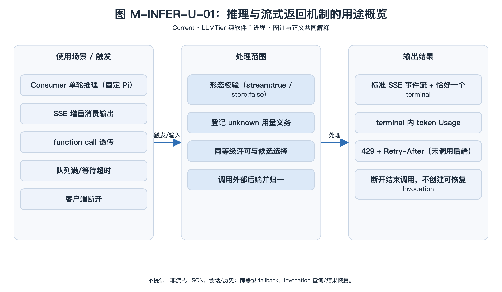
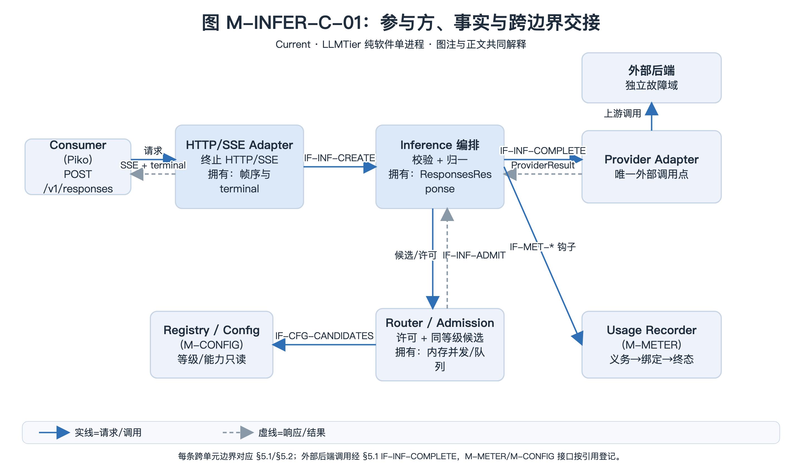
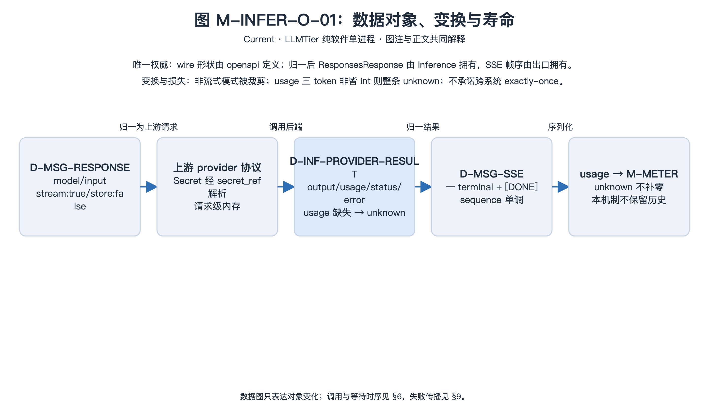
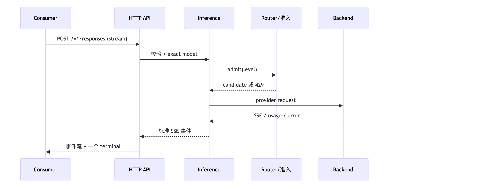

<!-- STD_DOCUMENT_COVER_BEGIN -->
# LLMTier 推理与流式返回机制

> STD 使用入口：[项目采用说明与标准导航](../../../README.md#std-entry)

| 文档字段 | 值 |
|---|---|
| Document ID | `llmtier-inference-stream-mechanism` |
| Document Version | `0.1.0-draft.6` |
| Status | `Draft` |
| Project | `LLMTier` |
| Authority | `LLMTier` |
| Document Owner | LLMTier |
| Authors | llmtier |
| Created Date | `2026-09-22` |
| Last Modified Date | `2026-09-25` |
| Template ID | `design.system-mechanism` |
| Template Version | `3.3.0` |
| Template Conformance | `tailored` |
| Tailoring Reference | `std-tailoring` |
| Migration Map Reference | none |
| Repository | `corezilla/LLMTier` |
| Canonical Path | `docs/20_system_design/mechanisms/inference-stream.md` |
| Supersedes | none |
<!-- STD_DOCUMENT_COVER_END -->

## 1. 机制摘要：解决什么问题

Consumer（Piko）提交一次模型推理请求后，需要拿到**标准 Responses 流式结果**与 **token 用量**，而 LLMTier 必须把这次调用**可靠地**落到一个已配置的后端，并在失败/中断时给出**可判定**的结局。

**为什么不能由一个单元独立完成**：Consumer 不懂后端拓扑（provider/deployment/等级），后端不懂 Piko 的协议与用量账本；本机制横跨入口（HTTP/SSE）、推理编排、准入与路由、外部后端，是数据面主路径。

**输入 → 处理 → 输出**：
- 输入：`POST /v1/responses`（完整 input、exact `model`、`stream:true`、`store:false`）
- 处理：校验 → 记 unknown 义务 → 准入 → 选后端 → 调用 → 归一为 SSE → 记终态用量
- 输出：标准 SSE 事件流 + 一个 terminal 事件；terminal response 内含 token Usage

**本版本范围与取舍**：只支持 `stream:true/store:false`（固定 Pi 实际消费路径）；不提供 JSON 非流式并行模式；不做跨等级 fallback；不承诺跨系统 exactly-once。最坏情形下准入会排队并可能返回 429——用**保守资源保护**换**可预测的失败**。



[可编辑 SVG 源](../../assets/diagrams/diagram-mech-infer-usage.svg)

图 M-INFER-U-01 · Current；固定 `stream:true/store:false` 的单轮推理经校验、准入与路由落到一个后端，归一为恰好一个 terminal 的标准 SSE，并把 token 用量交账本；队列满/超时在调用后端前以 429 拒绝。图只表达场景、处理范围与外部结果；参与方分工见 §3，端到端时序见 §6。

- **机制形态与适用性 / 业务副作用**：具体副作用——一次调用会发起外部后端调用（可能计费）并输出 SSE 字节流，且经 M-METER 写账本（dispatch 前记 unknown 义务、终态版本）；事实依据 §5.1 `IF-INF-COMPLETE` 的上游调用与 `IF-MET-AUTHORIZE`/`IF-MET-FINISH` 的落账副作用。
- **交接域**：纯软件。责任单元为 M001 入口、M003 Inference/Router、M004 Registry 与 M006/M-METER；外部后端是独立故障域、不是本机制拥有的责任单元。
- **裁剪依据**：`std-tailoring` `LT-TL-003`（纯软件、无设备/FPGA 与子系统）；§4.5（设备表项）、§4.7（本机制不拥有持久表，账本/配置分别归 M-METER/M-CONFIG）不适用。

## 2. 使用场景与功能

| Capability ID | 业务任务与触发 | 输入与可观察结果 | 提供方 / 消费者 | 实现状态 | 验证判据 |
|---|---|---|---|---|---|
| CAP-RESP | Consumer 单轮推理（固定 Pi） | 完整 input → 标准 SSE + terminal usage | Inference / Consumer | Implemented | 契约 + 系统用例 DP-RESP-* |
| CAP-RESP-STREAM | 以 SSE 增量消费输出 | 事件序 + 稳定 item id | Inference / Consumer | Implemented | 事件子集与终态断言 |
| CAP-TOOLS | 模型返回 function call，Consumer 执行后以新请求回传 | `response.function_call_arguments.*` 事件 | Inference / Consumer | Implemented | DP-RESP-04 透传 |
| CAP-WAIT-FAIL | 队列满 / 等待超时 | 429 + `Retry-After` | Inference / Consumer | Implemented | 并发用例 |
| CAP-CANCEL | Consumer 断开连接 | 结束本次调用，不产生可恢复 Invocation | Inference | Implemented | 断开用例 |

**不提供**：非流式 JSON 模式；会话/历史；跨等级 fallback；Invocation 查询/结果恢复；prompt cache 协议。

## 3. 参与方、责任和 authority



[可编辑 SVG 源](../../assets/diagrams/diagram-mech-infer-collab.svg)

图 M-INFER-C-01 · Current；HTTP/SSE Adapter 拥有帧序与唯一 terminal 事实，Inference 拥有归一响应，Router/Admission 拥有内存并发与队列，Provider Adapter 是唯一外部调用点；Registry 只读、Usage Recorder 落账、外部后端独立故障域。蓝实线为请求/调用，灰虚线为响应/结果；工程 Owner 不作为运行组件。每条跨边界交接对应 §5.1/§5.2 成员登记，M-METER/M-CONFIG 接口按引用登记。

| Participant / 工程 Owner | 负责/不负责 | 决定/写入/事实来源/恢复（适用时） | Provided/Consumed interface | 部署/实现位置 | 依赖机制与基线 |
|---|---|---|---|---|---|
| Consumer（Piko）· 外部 | 发起单轮推理并消费 SSE；不做鉴权判定、不自建幂等 | 决定=无；写入=无；事实来源=本机制响应；恢复=由 Consumer 自担重试（无幂等键） | 消费 `POST /v1/responses`（`IF-INF-RESPONSES`，§5.1） | 外部 Consumer | M-TRUST（凭据） |
| HTTP/SSE Adapter · HTTP API / LLMTier | 终止 HTTP/SSE、保证帧序与唯一 terminal、请求体上限、断开清理；不承载业务规则 | 决定=输出事件序；写入=SSE 字节流；事实来源=`ResponsesResponse`；恢复=断开结束本次调用 | 提供 `IF-INF-RESPONSES`、`IF-INF-STREAM`、`IF-INF-RUNTIME`；引用 `IF-TRUST-*`（§5.1/§5.2） | M001 入口层 | M-TRUST |
| Inference 编排 · Inference / LLMTier | 校验、编排、归一；不管理配置 | 决定=归一响应；写入=经 `IF-MET-*` 记账；事实来源=`ProviderResult`；恢复=异常经 `finally` 释放许可 | 提供 `IF-INF-CREATE`；消费 `IF-MET-*`（§5.1） | M003 业务层 | M-METER / M-CONFIG / M-OBS |
| Internal Admission / Exact Model Router · Inference / LLMTier | 许可/队列、同等级候选；不做跨等级 fallback | 决定=许可与候选；写入=内存并发/队列（§4.6.1）；事实来源=Router 内存；恢复=进程退出清零 | 提供 `IF-INF-ADMIT`、`IF-INF-SNAPSHOT`；消费 `IF-CFG-CANDIDATES`（§5.1） | M003 业务层 | M-CONFIG |
| Provider Adapter · Inference / LLMTier | 协议映射、usage 归一、typed error；不暴露 provider KV | 决定=上游调用；写入=外部副作用（可能计费）；事实来源=后端响应；恢复=不重放 | 提供/消费 `IF-INF-COMPLETE`（§5.1） | M003 业务层 | 无（外部后端为依赖） |
| Registry/Config · Management / LLMTier | 等级/能力/provider 只读；不发起推理 | 决定=配置读取；写入=无；事实来源=Registry；恢复=请求级只读 | 提供 `IF-CFG-GET-LEVEL`/`IF-CFG-CANDIDATES`（引用 M-CONFIG §5） | M004 业务层 | M-CONFIG |
| Usage Recorder · Inference / LLMTier（M-METER） | 义务→绑定→终态；unknown 不补零；不含 Cost | 决定=终态版本；写入=账本（§4.7 不归本机制）；事实来源=账本；恢复=未知保留 | 提供 `IF-MET-AUTHORIZE`/`IF-MET-BIND`/`IF-MET-FINISH`（引用 M-METER §5） | M003 业务层 | M-METER |

### 3.1 系统约束与参与方承接

本机制为顶层机制（上级 Mechanism ID = none），约束继承自系统设计 §3。

| Constraint ID | 约束 | 参与方保证 | 自由度 | 本文落实位置 |
|---|---|---|---|---|
| CON-INFER-001 | 只提供标准 Responses SSE，不增 JSON 并行模式 | 入口只发标准事件 | 内部编排方式 | §5.1/§5.2、§6 |
| CON-INFER-002 | 已准入且流至完成的请求恰好一个 terminal 事件（准入前拒绝走 `ErrorEnvelope`；中途断开无 terminal、记 `aborted`） | 出口保证 | 事件名由 status 决定 | §6、§8 |
| CON-INFER-003 | 结果未知不补零；账本只追加 | Inference 写 unknown 义务 | 归一实现 | §9、M-METER |
| CON-INFER-004 | 不做跨等级/跨空间 fallback | Router 只在同等级选 | 选择排序 | §10 |
| CON-INFER-005 | 观测 fail-open，不改推理结果 | Inference 不因观测失败而失败 | 捕获实现 | §12、M-OBS |

**约束 ID 说明**：本版按 3.3.0 规则把历史 `CON-INFER-001..5` 登记为 `CON-INFER-001..005`（类别：机制约束，命名域 M-INFER），语义不变；系统设计 §3.4 与下级 ISD 中的历史 `C-INFER-*` 引用为待回写项，登记于 §16。

### 3.2 运行时统筹与确认责任

入口（HTTP API）统筹请求生命周期与 `request_id`；Inference 决定校验与归一；Router 决定准入与候选；后端决定生成内容；出口统一确认 terminal。

### 3.3 拓扑、目标身份与共享故障域

单进程单节点。后端为**外部依赖**，其故障域独立于 LLMTier；本机制不拥有后端内部。请求级身份为 `request_id`（+ 可选关联标识，见 M-OBS）。无跨节点协调。

## 4. 数据结构设计

> 按 STD `design-data-interface-format` 1.2.0 §2：主章“数据结构设计”，章内按**数据性质**分类（§4.1–§4.8），本层特有分析见 §4.9–§4.10。仅保留适用类别。继承/机器源结构只定位原定义与本层投影，不复制字段权威。本机制拥有类型 ID 前缀 `D-INF-*`；wire 权威 = `interfaces/openapi/llmtier.openapi.json` + `interfaces/vectors/v0.3/*`。

**类别适用性**：§4.1 公共基础类型与枚举 ✓｜§4.2 业务与操作数据结构 ✓｜§4.3 配置与规则数据结构 ✓｜§4.4 通信报文结构 ✓（`D-MSG-SSE`/`D-ERROR-ENVELOPE` 继承）｜§4.5 设备与 FPGA 表项结构 ✗（纯软件，无设备/RTL）｜§4.6 运行状态数据结构 ✓｜§4.7 数据库表结构 ✗（本机制不拥有持久表；账本归 M-METER、配置归 M-CONFIG）｜§4.8 错误码与错误结构 ✓（引用系统 §8.8）。



[可编辑 SVG 源](../../assets/diagrams/diagram-mech-infer-objects.svg)

图 M-INFER-O-01 · Current；`ResponsesRequest` 归一为上游请求，`ProviderResult` 再归一为 `ResponsesResponse`，出口序列化为 SSE；usage 交 M-METER 账本。对象在入口/编排/适配器/出口/账本责任单元间经历变换与所有权转移，故需数据对象图明确损失边界（非流式模式被裁剪、usage 非全 int 则整条 unknown、不承诺 exactly-once）。数据图不表示调用顺序；时序见 §6，失败传播见 §9。

### 4.1 公共基础类型与枚举

**4.1.1 `D-INF-RESPONSE-STATUS` · ResponseStatus（公共基础类型与枚举）**

```text
enum ResponseStatus { in_progress, completed, incomplete, failed }
```

- **Data/Type ID、用途与来源**：

  `D-INF-RESPONSE-STATUS`；一次归一响应的状态枚举；唯一来源 `ProviderResult.status` 与 `openapi`（`ResponsesResponse.status`）。

- **`in_progress`**：

  必填枚举值；流期状态、非终态；≠ 成功（INV-3）。

- **`completed`**：

  必填枚举值；终态、成功完成。

- **`incomplete`**：

  必填枚举值；终态、未完整完成。

- **`failed`**：

  必填枚举值；终态、失败；`error` 不为空。

- **跨字段与寿命**：

  已准入且流至完成的请求恰好一个 terminal（准入前拒绝走 `ErrorEnvelope`；中途断开无 terminal、记 `aborted`，见 §8 INV-2）；`in_progress` ≠ 成功；请求级；M003 归一产生、M001 序列化。

- **合法/拒绝实例**：

  合法 `completed`；边界：`failed` + `error` 不为空。

- **验证**：

  `T-STREAM`（INV-2/3）。

**4.1.2 `D-INF-EVENT-NAME` · SSE 事件名子集（公共基础类型与枚举，继承 `openapi`）**

```text
enum SSEEventName {
  response.created, response.output_item.added, response.output_text.delta,
  response.refusal.delta, response.reasoning_summary_text.delta, response.reasoning_text.delta,
  response.function_call_arguments.delta, response.function_call_arguments.done,
  response.output_item.done, response.completed, response.incomplete, response.failed, error
}
```

- **Data/Type ID、用途与来源**：

  `D-INF-EVENT-NAME`；`D-MSG-SSE` 的事件名子集；机器源 `openapi`（`ResponseStreamEvent`），本机制 §5.2 给出固定子集。

- **`response.*` / `error`**：

  必填枚举值；上列固定子集；每 output item 稳定 `id`；`sequence_number` 单调；`[DONE]` 收尾。

- **跨字段与寿命**：

  请求级流；M003 产出、M001 传输。

- **合法/拒绝实例**：

  合法完整流以 terminal 结束；边界：上游失败发生在流开始前，经 HTTP `D-ERROR-ENVELOPE` 返回（不产生流内 `error` 事件），不伪造完成。

- **验证**：

  `T-STREAM`。

### 4.2 业务与操作数据结构

**4.2.1 `D-MSG-RESPONSE` · Responses 请求/响应（业务与操作数据结构，继承系统 §8.4，机器源）**

```text
ResponsesRequest {
  model: string, input: any, stream: true, store: false,
  tools: any?, tool_choice: any?, temperature: number?, max_output_tokens: int?,
  reasoning: any?, include: any?, service_tier: string?, metadata: object?
}
ResponsesResponse {
  id: string, object: string, created_at: int, status: ResponseStatus,
  model: string, output: any[], usage: object?, error: object?
}
```

- **Data/Type ID、用途与来源**：

  `D-MSG-RESPONSE`；OpenAI-compatible Responses 请求/响应；系统设计 §8.4 唯一来源，机器源 `openapi`（`ResponsesRequest`/`ResponsesResponse`），本节只给阅读视图。

- **`model`**：

  必填字符串；exact 逻辑等级名。

- **`input`**：

  必填；完整输入。

- **`stream`**：

  必填且恒为 true；受理前提。

- **`store`**：

  必填且恒为 false；受理前提。

- **`tools`/`tool_choice`/`temperature`/`max_output_tokens`/`reasoning`/`include`/`service_tier`/`metadata`**：

  可选；透传/约束见 `openapi`。

- **`ResponsesResponse.usage`**：

  可空；仅 terminal 给出 token Usage。

- **跨字段与寿命**：

  `stream:true`、`store:false` 为受理前提；禁字段 `prompt_cache_key`/`prompt_cache_retention`/`previous_response_id`；已准入且流至完成的请求恰好一个 terminal（见 §8 INV-2）；wire 载荷请求级；M001 解析、M003 归一。

- **合法/拒绝实例**：

  合法标准请求 → SSE + terminal Usage；拒绝 `stream=false` → `ERR-REQ-UNSUPPORTED`。

- **验证**：

  `T-STREAM`、系统 `VRC-INF-001`。

**4.2.2 `D-INF-PROVIDER-RESULT` · ProviderResult（业务与操作数据结构）**

```text
ProviderResult {
  output: OutputItem[],
  usage: { input_tokens: int, output_tokens: int, total_tokens: int, *_details: any }?,
  status: ResponseStatus,
  error: object?,
  incomplete_details: object?
}
```

- **Data/Type ID、用途与来源**：

  `D-INF-PROVIDER-RESULT`；适配器调用后归一前的后端结果；唯一来源 `src/inference/providers/base.py` `ProviderResult`。

- **`output`**：

  必填 `OutputItem[]`；后端输出项。

- **`usage`**：

  可空对象；`input_tokens`/`output_tokens`/`total_tokens` 及 `*_details`；三 token 皆 int 才可判 measured。

- **`status`**：

  必填 `D-INF-RESPONSE-STATUS`（§4.1.1）。

- **`error`/`incomplete_details`**：

  可空对象；失败/未完整详情。

- **跨字段与寿命**：

  `usage` 三 token 皆 int 才可判 measured，否则整条 unknown（不补零，M-METER INV-5）；请求级内存对象；Provider Adapter 写、Inference 编排读；不持久。

- **合法/拒绝实例**：

  合法 `status=completed` + usage；边界：`status=failed` + 无有效 usage。

- **验证**：

  契约用例；系统 `VRC-INF-003`。

### 4.3 配置与规则数据结构

**4.3.1 `D-INF-RUNTIME-PROFILE` · DeploymentRuntimeProfile（配置与规则数据结构）**

```text
DeploymentRuntimeProfile {
  deployment_id: string,
  max_in_flight: int,
  connect_timeout_ms: int,
  stream_idle_timeout_ms: int
}
```

- **Data/Type ID、用途与来源**：

  `D-INF-RUNTIME-PROFILE`；每 deployment 的运行限制；authority `util/migrations/*.sql`，由 M004 维护。

- **`deployment_id`**：

  必填主键；deployment 标识。

- **`max_in_flight`**：

  必填整数，默认 1，≥1；单 deployment 并发许可上限；Router 据此计算许可。

- **`connect_timeout_ms`**：

  必填整数；建连超时。

- **`stream_idle_timeout_ms`**：

  必填整数；流空闲超时。

- **跨字段与寿命**：

  `max_in_flight ≥ 1`；持久；operator 经 M004 写、Router 读；随配置版本。

- **合法/拒绝实例**：

  合法 `max_in_flight=1`（首版）；边界：缺失 → Router 取默认 1。

- **验证**：

  `T-QUEUE`。

**4.3.2 `D-INF-PROVIDER-PROFILE` · ProviderUsageProfile（配置与规则数据结构）**

```text
ProviderUsageProfile {
  provider_id: string,
  max_concurrent_requests: int,
  min_request_interval_ms: int,
  requests_per_minute: int
}
```

- **Data/Type ID、用途与来源**：

  `D-INF-PROVIDER-PROFILE`；provider 级并发/速率限制；authority `util/migrations/*.sql`。

- **`provider_id`**：

  必填主键；provider 标识。

- **`max_concurrent_requests`**：

  必填整数；并发上限。

- **`min_request_interval_ms`**：

  必填整数；最小请求间隔（ms）。

- **`requests_per_minute`**：

  必填整数；每分钟请求上限；0 表示不限 RPM。

- **跨字段与寿命**：

  三限制共同决定 provider 就绪等待；Router 只选就绪且未超的候选；持久；M004 写、Router 读。

- **合法/拒绝实例**：

  合法 RPM>0；边界：RPM=0 表示不限 RPM。

- **验证**：

  `T-QUEUE`。

**4.3.3 `D-INF-ADMISSION-POLICY` · 准入规则（配置与规则数据结构）**

```text
AdmissionPolicy {
  queue_capacity: int,
  wait_deadline_s: float,
  retry_after_full: string,
  retry_after_timeout: string
}
```

- **Data/Type ID、用途与来源**：

  `D-INF-ADMISSION-POLICY`；队列/等待上限；唯一来源 `src/inference/routing.py`（队列 32、等待 30s、许可释放于 `finally`）。

- **`queue_capacity`**：

  必填整数，默认 32；同等级 FIFO 队列上限。

- **`wait_deadline_s`**：

  必填浮点，默认 30；准入等待上限（秒）。

- **`retry_after_full`**：

  必填字符串，默认 `"30"`；队列满时 `Retry-After`。

- **`retry_after_timeout`**：

  必填字符串，默认 `"1"`；等待超时时 `Retry-After`。

- **跨字段与寿命**：

  同等级 FIFO；满即拒绝，不无限缓冲；只选同等级候选，无跨等级 fallback（CON-INFER-004）；Specified 保护值；随部署/内部配置；变更需审计复测（§13）。

- **合法/拒绝实例**：

  合法第 32 位入队；拒绝第 33 位 → 429。

- **验证**：

  `T-QUEUE`（Specified，尚未实测）。

### 4.4 通信报文结构

**4.4.1 `D-MSG-SSE` · Responses SSE（通信报文结构，继承系统 §8.4，机器源）**

```text
ResponseStreamEvent {
  type: SSEEventName,
  sequence_number: int,
  item_id: string?,
  data: object
}
```

- **Data/Type ID、用途与来源**：

  `D-MSG-SSE`；Data Plane 流式协议事件；系统设计 §8.4 唯一来源，机器源 `openapi`（`ResponseStreamEvent`），接口见 §5.2。

- **`type`**：

  必填，取 `D-INF-EVENT-NAME`（§4.1.2）。

- **`sequence_number`**：

  必填整数；自 0 严格递增。

- **`item_id`**：

  可空字符串；每 output item 稳定 `id`。

- **`data`**：

  必填对象；事件载荷。

- **跨字段与寿命**：

  已准入且流至完成的请求恰好一个 terminal（见 §8 INV-2）；`sequence_number` 自 0 严格递增；`X-Request-ID` 为 task 头；SSE 帧格式 `event: <name>\ndata: <json>\n\n` 空行分隔；请求级流；M003 产出、M001 传输。

- **合法/拒绝实例**：

  合法以 terminal + `[DONE]` 结束；边界：上游失败在流开始前经 HTTP `D-ERROR-ENVELOPE` 返回，不产生流内 `error` 事件。

- **验证**：

  `T-STREAM`。

**4.4.2 `D-ERROR-ENVELOPE` · 错误信封（通信报文结构，继承系统 §8.4）**

```text
ErrorEnvelope {
  error: { message: string, type: string, code: string, param: string?, retryable: bool }
}
```

- **Data/Type ID、用途与来源**：

  `D-ERROR-ENVELOPE`；对外错误响应载荷；机器源 `openapi`，含义见系统 §8.8；本机制以 `ApiError` 产生。

- **`error`**：

  必填对象；含 `message`/`type`/`code`/`param`/`retryable`。

- **`error.message`**：

  必填字符串；不含 Secret/栈。

- **`error.type`**：

  必填字符串；错误类型。

- **`error.code`**：

  必填字符串；稳定码值。

- **`error.param`**：

  可空字符串；出错参数名。

- **`error.retryable`**：

  必填布尔；429 可带 `Retry-After`。

- **跨字段与寿命**：

  不含 Secret/栈；429 可带 `Retry-After`；请求级返回；M001 序列化。

- **合法/拒绝实例**：

  合法 `{error:{type:"server_error",code:"provider_unavailable"}}`。

- **验证**：

  系统 `VRC-API-*`。

### 4.5 设备与 FPGA 表项结构

不适用：LLMTier 为纯软件，无连接器、总线、寄存器或 FPGA 端口（tailoring `LT-TL-003`）。

### 4.6 运行状态数据结构

**4.6.1 `D-INF-ADMISSION-STATE` · Router 准入状态（运行状态数据结构）**

```text
AdmissionState {
  deployment_inflight: map<string,int>,
  provider_inflight: map<string,int>,
  queues: map<string, deque<string>>,
  provider_last_dispatch: map<string, timestamp>,
  provider_dispatches: map<string, deque<timestamp>>
}
```

- **Data/Type ID、用途与来源**：

  `D-INF-ADMISSION-STATE`；路由器的内存并发/队列事实；唯一来源 `src/inference/routing.py` `Router`（`_inflight`/`_provider_inflight`/`_queues`/`_provider_dispatches`）。

- **`deployment_inflight`**：

  必填映射；各 deployment 在途计数。

- **`provider_inflight`**：

  必填映射；各 provider 在途计数。

- **`queues`**：

  必填映射；各等级 FIFO ticket 队列。

- **`provider_last_dispatch`/`provider_dispatches`**：

  必填映射；provider 上次派发时刻与最近 60s 派发时间戳滑动窗口（`deque`，用于 `min_request_interval_ms`/`requests_per_minute`；判定时弹出超 60s 的条目）。

- **跨字段与寿命**：

  唯一写者=Router 的锁内方法；许可在上下文退出（成功/失败/断开）于 `finally` 释放并 `notify_all`；无租约、无持久预留；进程内存，仅当次运行有效；重启即清零；不持久、不跨节点。

- **合法/拒绝实例**：

  合法 `admit` 得候选、退出后计数归零；边界：队列满 → 429 且无许可分配。

- **验证**：

  `T-QUEUE`、`T-DISCONNECT`。

### 4.7 数据库表结构

不适用：本机制不拥有持久表。运行时读取 M004 的配置表（`deployments`/`deployment_runtime_profiles`/`provider_usage_profiles`/`service_levels`）作为只读输入；用量落账由 M-METER（`usage_*`）、观测由 M-OBS 拥有。

### 4.8 错误码与错误结构

**4.8.1 `D-INF-ERROR-MAP` · 推理错误映射（错误码与错误结构，引用系统 §8.8）**

```text
enum InferenceErrorRef {
  ERR-REQ-VALIDATION, ERR-REQ-UNSUPPORTED, ERR-REQ-FIELD, ERR-REQ-JSON, ERR-REQ-TOO-LARGE,
  ERR-MODEL-NOTFOUND, ERR-RATE-LIMIT, ERR-MODEL-UNAVAIL,
  ERR-PROVIDER-UNAVAIL, ERR-PROVIDER-FAIL, ERR-PROVIDER-CONTRACT, ERR-INTERNAL
}
```

- **Data/Type ID、用途与来源**：

  `D-INF-ERROR-MAP`；本机制对外错误的系统码引用，不新增公共错误码；唯一来源系统设计 §8.8（公共含义）与 `openapi`（产生）；载荷统一 `D-ERROR-ENVELOPE`（§4.4.2）。

- **`ERR-REQ-VALIDATION`（400 `invalid_request` / `unsupported_model`）**：

  缺必填/字段非法/等级不支持 `responses`；已知失败、未受理、无副作用；修请求重试。

- **`ERR-REQ-UNSUPPORTED`（400 `unsupported_request`）**：

  `stream!=true` 或 `store!=false`；已知失败、无副作用；改用流式。

- **`ERR-REQ-FIELD`（400 `unsupported_field`）**：

  含禁字段；已知失败、无副作用；移除字段。

- **`ERR-REQ-JSON` / `ERR-REQ-TOO-LARGE`（400 `invalid_json` / 413）**：

  body 非法/超 2MB；已知失败、无副作用；修正后重试。

- **`ERR-MODEL-NOTFOUND`（404 `model_not_found`）**：

  等级不存在；已知失败、无副作用；用 `GET /v1/models` exact 名。

- **`ERR-RATE-LIMIT`（429 `rate_limit_exceeded`）**：

  队列满/等待超 30s；已知失败、**未调用后端**；按 `Retry-After` 退避。

- **`ERR-MODEL-UNAVAIL`（503 `model_unavailable`）**：

  全部候选不健康；已知失败、无上游调用；稍后/换等级。

- **`ERR-PROVIDER-UNAVAIL`/`ERR-PROVIDER-FAIL`/`ERR-PROVIDER-CONTRACT`（502/503 `provider_*`）**：

  后端失败/超时/契约不符；**可能未知**；可能已调用后端；见 §9。

- **`ERR-INTERNAL`（500 `internal_error`）**：

  未捕获异常；可能未知；上报/查询权威状态。

- **跨字段与寿命**：

  载荷统一 `D-ERROR-ENVELOPE`；校验失败/429 零副作用（INV-5）；请求级返回，不持久。

- **合法/拒绝实例**：

  拒绝：`stream=false` → `ERR-REQ-UNSUPPORTED`。

- **验证**：

  `T-STREAM`、`T-QUEUE`、`T-TIMEOUT`。

### 4.9 编码、布局与共享类型映射

不适用二进制 ABI：HTTP + UTF-8 JSON（`Content-Type: application/json`）与 `text/event-stream`；无端序/对齐/padding/wire offset。

| 类型 ID / 编码源基线 | 逻辑宽度/序列化长度 | 实际 ABI 定位或不适用理由 | 原类型 → 投影/转换/损失 | 验证项 |
|---|---|---|---|---|
| `D-MSG-RESPONSE`（`openapi`） | 请求体 ≤2MB | 无二进制布局；JSON | wire → 适配器请求；`stream/store` 固定，丢失非流式模式 | `T-STREAM` |
| `D-INF-PROVIDER-RESULT`（内部） | 内存对象 | 无 ABI；`dataclass` | 后端响应 → 归一字段；usage 缺失即 unknown（不补零） | `T-MET-UNKNOWN` |
| `D-MSG-SSE`（`openapi`） | 事件帧 `event:`+`data:` | 无端序；SSE 文本帧 | 终态响应 → 帧序；每 item 稳定 id | `T-STREAM` |
| `D-ERROR-ENVELOPE`（系统 §8.4） | UTF-8 JSON | 无 wire offset | `ApiError.envelope()` | `T-QUEUE` |

### 4.10 一致性、可见性与数据寿命

请求级一致：同一 `request_id` 内事件有序（`sequence_number` 单调），不同请求各自独立且无全局顺序。流式“已发送”不等于“已完成”——只有 terminal 事件表示本次调用结束；HTTP 200 建连不代表业务成功（INV-3）。准入状态为进程内存，退出/重启即丢失，不承诺跨重启恢复许可；许可在 `admit` 上下文退出时（SSE 发送之前）`finally` 释放，释放后无残留。终态 Usage 一经写入即为 M-METER 账本事实，本机制不保留历史；观测数据独立且 fail-open（CON-INFER-005），失败不改变本机制结果。连通性中断（客户端断开，发生在 SSE 发送阶段）→ 结束本次调用、出口记 `aborted`；许可与终态记账已在 `create()` 返回前完成，不再调用 `finish(None)`；不创建可恢复 Invocation。

## 5. 接口设计

> 按 STD `design-data-interface-format` 1.2.0 §3：主章“接口设计”，按**接口用途**分类逐接口完整记录；标题为真实调用形式，标题下先给完整接口声明，再就地说明输入/输出，最后按六项写完。数据结构引用 §4；错误引用系统 §8.8；用量钩子接口归 M-METER（引用 `IF-MET-*`），本节不重定义。分类：API = 向 Consumer/Operator 提供可调用能力（本机制为 HTTP 端点，以及编排/准入/适配器进程内方法）；消息与数据流 = 组件/系统之间为协作而交换的命令/状态/事件/队列/流/文件。`ResponsesService.create`/`Router.admit`/`Router.snapshot`/`ProviderAdapter.complete` 向调用方提供可调用能力，故归 §5.1 API；SSE 字节流接口（`response_stream`）是跨边界连续数据流，留在 §5.2。

### 5.1 API（适用时）

#### `POST /v1/responses`

```text
POST /v1/responses
  Content-Type: application/json
  X-Request-ID: string?           # 服务端始终回填
  body: ResponsesRequest          # stream 恒 true; store 恒 false
  -> 200 text/event-stream: ResponseStreamEvent (SSE 子集, §5.2)
  -> 4xx/5xx: ErrorEnvelope
```

- **Interface/Member ID、用途、提供责任与唯一来源**：`IF-INF-RESPONSES`；标准模型调用（Consumer 单轮推理，固定 `stream:true`/`store:false`，返回标准 SSE）；M001 HTTP API 终止 HTTP/SSE、M003 Inference 编排；交接边界=HTTP/SSE 入站→推理服务内部调用；状态=规格已定、Implemented；唯一契约=`openapi`；`src/http_api/app.py` `_dispatch` → `src/inference/responses.py` `ResponsesService.create`。
- **输入与前提**：`D-MSG-RESPONSE`（§4.2.1）——`model`（必填 exact 逻辑等级）、`input`（必填）、`stream`（必须 true）、`store`（必须 false）、`tools`/`max_output_tokens` 等；授权=`data` 角色或受信免登录（`IF-TRUST-*`）；校验顺序=鉴权 → JSON/schema → 形态（stream/store）→ 禁字段 → 模型存在 → 能力 `responses=true` → 准入。
- **成功输出与保证**：`D-MSG-SSE` 流（§4.4.1/§5.2）——`response.created … response.completed|incomplete|failed`，已准入且流至完成的请求恰好一个 terminal（见 §8 INV-2），`usage` 仅 terminal 给出；受理=HTTP 建连，完成=terminal 事件；副作用=登记 unknown 用量义务→落账本（`IF-MET-AUTHORIZE`/`IF-MET-BIND`/`IF-MET-FINISH`）；观测 fail-open。
- **错误与合法下一步**：逐条件见 §4.8；典型：`ERR-REQ-VALIDATION`/`ERR-REQ-FIELD`/`ERR-REQ-JSON`（400，未受理）；`ERR-REQ-UNSUPPORTED`（400，`stream=false`）；`ERR-REQ-TOO-LARGE`（413）；`ERR-AUTH-*`（401/403/503）；`ERR-MODEL-NOTFOUND`（404）；`ERR-RATE-LIMIT`（429 + `Retry-After`）；`ERR-MODEL-UNAVAIL`/`ERR-PROVIDER-*`（503/502，可能已调用后端=结果可能未知）；载荷统一 `D-ERROR-ENVELOPE`。
- **交互与生命周期**：同步建连后流式；单请求独立模型调用，无会话；客户端断开结束本次调用并释放许可；**非幂等**（同 input 重发=两次独立调用，无幂等键）；期限=准入等待 ≤30s、建连/首字节 30s、SSE 空闲 60s；不承诺跨系统 exactly-once。
- **实现与验证**：正常 `{"model":"Worker","input":[{"role":"user","content":"hi"}],"stream":true,"store":false,"max_output_tokens":20}` → 200 SSE + terminal Usage；拒绝 `stream=false` → 400。`T-STREAM`、`T-QUEUE`、`T-TIMEOUT`；Run=NOT_RUN。

#### `ResponsesService.create(principal, request_id, body, diagnostics=None, correlation_id=None, out=None) -> ResponsesResponse`

```text
ResponsesService.create(principal: str, request_id: str, body: dict, diagnostics=None, correlation_id: str | None = None, out: dict | None = None) -> dict
```

- **Interface/Member ID、用途、提供责任与唯一来源**：`IF-INF-CREATE`；在流开始前执行校验、编排、后端调用与归一；Inference 编排提供、HTTP/SSE Adapter 消费；交接边界=入口鉴权后、SSE 包装前；状态=Implemented；`src/inference/responses.py` `ResponsesService.create`。
- **输入与前提**：`principal: str`、`request_id: str`、`body: dict`（`ResponsesRequest`）、可选 `diagnostics`/`correlation_id`/`out`；前置=入口已鉴权并构造 `request_id`；授权=已由 `IF-INF-RESPONSES` 完成；校验=内部再次执行形态与模型/能力校验。
- **成功输出与保证**：归一后的 `ResponsesResponse`（`D-MSG-RESPONSE`，§4.2.1）——受理=开始编排，完成=返回值可用于流式；`out` 回填 `deployment_id` 供流包装；副作用=经 `IF-MET-*` 记义务/绑定/终态、经观测写 trace（fail-open）。
- **错误与合法下一步**：以 `ApiError` 抛出，交由 M001 序列化为 `D-ERROR-ENVELOPE`；逐条件同 §4.8；失败在准入前无副作用，后端调用后可能已产生上游副作用且结果可能未知。
- **交互与生命周期**：同步（在流开始前完成归一）；请求级；不幂等；异常由调用方 `finally` 语义释放许可（`IF-INF-ADMIT`）。
- **实现与验证**：正常返回终态响应；拒绝 `stream=false` → `ERR-REQ-UNSUPPORTED`。`T-STREAM`；Run=NOT_RUN。

#### `Router.admit(level_id: str) -> ContextManager[Candidate]`

```text
Router.admit(level_id: str) -> ContextManager[Candidate]
```

- **Interface/Member ID、用途、提供责任与唯一来源**：`IF-INF-ADMIT`；对同等级请求准入并分配临时许可、选出候选；Internal Admission 提供、Inference 编排消费；交接边界=后端调用前、`finally` 释放后；状态=Implemented；`src/inference/routing.py` `Router.admit`。
- **输入与前提**：`level_id: D-CFG-TIER`；前置=已有义务登记；授权=内部；校验=FIFO 入队 → 队列容量 → 候选健康与就绪（deployment/provider 限额、RPM/间隔）→ 选 in-flight 最少且 ordinal 最小者。
- **成功输出与保证**：上下文产出 `D-CFG-CANDIDATE`（§4.2 config）；生效=许可计数 +1；退出上下文时在 `finally` 释放计数并 `notify_all`；副作用=更新 `D-INF-ADMISSION-STATE`（§4.6.1）。
- **错误与合法下一步**：`ERR-RATE-LIMIT`（429 队列满，`Retry-After: 30` / 等待超 30s，`Retry-After: 1`）；`ERR-MODEL-NOTFOUND`（404 无候选）；`ERR-MODEL-UNAVAIL`（503 全不健康）；均在准入前、无后端副作用。
- **交互与生命周期**：同步阻塞式上下文管理器；超时 30s；许可临时、无租约；退出即释放，释放后无残留。
- **实现与验证**：正常得候选；边界：占满队列 → 429。`T-QUEUE`；Run=NOT_RUN。

#### `ProviderAdapter.complete(model: str, request: dict) -> ProviderResult`

```text
ProviderAdapter.complete(model: str, request: dict) -> ProviderResult
```

- **Interface/Member ID、用途、提供责任与唯一来源**：`IF-INF-COMPLETE`；把归一请求发往外部后端并返回归一前结果；Provider Adapter 提供、Inference 编排消费；交接边界=已获许可并绑定后端后；状态=Implemented；`src/inference/providers/base.py` `ProviderAdapter.complete`（各 provider 实现）。
- **输入与前提**：`model: str`（后端模型名）、`request: dict`（归一后的上游请求）；前置=已获许可并绑定后端；授权=Secret 经 `secret_ref` 解析；校验=协议映射。
- **成功输出与保证**：`D-INF-PROVIDER-RESULT`（§4.2.2）——受理=调用发出，完成=返回结果；副作用=上游调用已发生（可能计费）；usage 可能缺失（→ M-METER unknown）。
- **错误与合法下一步**：建连/首字节超时或 5xx → `ERR-PROVIDER-UNAVAIL`；注入/上游故障 → `ERR-PROVIDER-FAIL`；响应无法归一 → `ERR-PROVIDER-CONTRACT`；结果可能未知、可能已调用后端；合法下一步见 §9。
- **交互与生命周期**：同步；建连/首字节 30s、流空闲 60s；不做跨等级 fallback（CON-INFER-004）；不重放（避免重复输出）。
- **实现与验证**：正常返回 usage；边界：超时 → typed error + 许可释放。`T-TIMEOUT`；Run=NOT_RUN。

#### `Router.snapshot() -> dict`

```text
Router.snapshot() -> dict
```

- **Interface/Member ID、用途、提供责任与唯一来源**：`IF-INF-SNAPSHOT`；向管理面提供并发/队列只读时点视图；Internal Admission 提供、`IF-INF-RUNTIME`/operator 消费；交接边界=运行时快照查询；状态=Implemented；`src/inference/routing.py` `Router.snapshot`。
- **输入与前提**：无；授权=operator。
- **成功输出与保证**：`D-INF-ADMISSION-STATE`（§4.6.1）的只读时点视图（deployments/providers/queues）；副作用=无。
- **错误与合法下一步**：无。
- **交互与生命周期**：同步只读；点时刻；幂等。
- **实现与验证**：正常返回并发现状。`T-QUEUE`；Run=NOT_RUN。

### 5.2 消息与数据流接口（适用时）

本机制拥有的跨边界流接口：终态响应经 `response_stream` 序列化为 SSE 字节流（连续数据流），供 HTTP 客户端增量消费。

#### `response_stream(response) -> Iterable[bytes]`

```text
response_stream(response: ResponsesResponse) -> Iterable[bytes]   # text/event-stream
```

- **Interface/Member ID、用途、提供责任与唯一来源**：`IF-INF-STREAM`；把终态响应序列化为 SSE 字节流（组件间数据流）；HTTP/SSE Adapter 提供、HTTP 客户端经 `IF-INF-RESPONSES` 消费；交接边界=归一完成后、HTTP 出站；状态=Implemented；唯一契约=`openapi` `ResponseStreamEvent`（`D-MSG-SSE`，§4.4.1）；`src/http_api/sse.py` `response_stream`。
- **输入与前提**：终态 `ResponsesResponse`（§4.2.1）；前置=归一已完成；授权=已由 `IF-INF-RESPONSES` 完成。
- **成功输出与保证**：SSE 字节流——事件名子集 `D-INF-EVENT-NAME`（§4.1.2），帧格式 `event: <name>\ndata: <json>\n\n`；每 output item 稳定 `id`；`sequence_number` 自 0 递增；一个 terminal + `[DONE]`；受理/完成=按事件产出直至 terminal；副作用=输出已出站。
- **错误与合法下一步**：上游失败在流开始前以 HTTP `D-ERROR-ENVELOPE` 返回，不产生流内 `error` 事件；客户端断开 → `BrokenPipeError`/`ConnectionResetError` → 结束本次调用（`IF-INF-RESPONSES` 记 `aborted`）；流注入可截断/畸形（`IF-OBS-STREAM-WRAP`，Implemented）；结果已部分送达、可能未知；不重传、不重放。
- **交互与生命周期**：顺序=单请求内严格有序；无背压到推理结果；断开即终止；不重放。
- **实现与验证**：正常完整流以 terminal 结束；边界：命中 `stream_terminate` → 提前结束。`T-STREAM`、`T-DISCONNECT`；Run=NOT_RUN。

### 5.3 硬件与固件接口（适用时）

不适用：无连接器、总线、寄存器或 FPGA 端口。

### 5.4 人机与维护接口（适用时）

#### `GET /v1/runtime`
```text
GET /v1/runtime -> 200 {deployments, providers, queues}
```
- **Interface/Member ID、用途、提供责任与唯一来源**：`IF-INF-RUNTIME`；运行时并发/队列只读快照；M003 Internal Admission 提供、M001 暴露、operator 消费；状态=Implemented；`src/http_api/app.py` → `Router.snapshot`。
- **输入与前提**：无参数；前置=进程存活；执行位置=LLMTier 管理面；授权=operator；校验=无。
- **成功输出与保证**：`D-INF-ADMISSION-STATE`（§4.6.1）只读时点快照；受理/生效=即时；副作用=无。
- **错误与合法下一步**：`ERR-AUTH-*`（401/403/503）；只读无副作用。
- **交互与生命周期**：同步只读；幂等；无占用/取消/恢复。
- **实现与验证**：正常返回并发/队列现状。`T-QUEUE`；Run=NOT_RUN。

#### `POST /v1/probes`
```text
POST /v1/probes {deployment_id} -> 200 probe_result | 4xx: ErrorEnvelope
```
- **Interface/Member ID、用途、提供责任与唯一来源**：`IF-INF-PROBE`；对目标后端发起只读探活；M004 Management（`admin`）提供、M001 暴露、operator 消费；状态=Implemented；`src/http_api/app.py` → `src/management/admin.py` `probe`。
- **输入与前提**：请求 `{deployment_id}`；前置=deployment 存在；执行位置=LLMTier → 目标后端；授权=operator。
- **成功输出与保证**：探活结果——受理/完成=探测返回；副作用=对目标后端发起只读探测，不占数据面许可。
- **错误与合法下一步**：`ERR-AUTH-*`（401/403/503）；`ERR-NOTFOUND`（404 未知 deployment）；结果已知、无数据面副作用。
- **交互与生命周期**：同步；只读探测；幂等；不占用请求许可。
- **实现与验证**：正常探活；拒绝未知 deployment。探针用例；Run=NOT_RUN。

> 单请求 trace `GET /v1/trace/{request_id}` 属 M-OBS（`IF-OBS-*`），本机制只在其 §12.2 引用，不重复定义。用量钩子 `authorize_dispatch`/`bind_backend`/`finish` 由 M-METER §5 完整定义（`IF-MET-AUTHORIZE`/`IF-MET-BIND`/`IF-MET-FINISH`）；本机制在 §5.1/§5.2 记录调用点，不重定义签名与字段。

> **闭合核对**：§3 协作图与 §6、§14.3 的每条真实跨责任单元交接均在 §5.1/§5.2 有唯一接口记录（`IF-INF-RESPONSES`、`IF-INF-CREATE`、`IF-INF-ADMIT`、`IF-INF-COMPLETE`、`IF-INF-SNAPSHOT`、`IF-INF-RUNTIME`、`IF-INF-PROBE`、`IF-INF-STREAM`）；外部后端调用经 `IF-INF-COMPLETE`，M-METER/M-CONFIG/M-OBS 接口按引用登记。§5.1 非 N/A，进程内编排→许可→适配器交接已登记。结果未知（`provider_*`/`internal_error`）未被改写为确定失败（§4.8、§9）。

## 6. 正常端到端流程



[可编辑 SVG 源](../../assets/diagrams/diagram-mech-infer-sequence.svg)

图 M · 推理与流式返回时序（实线=请求，虚线=响应；先后关系非时间比例）。

编号步骤：

1. **入口** 信任判定（见 M-INFER §3.1；凭据在入口单点校验，Principal 下传）→ 生成 `request_id`。
2. **校验** 必填/`stream·store`/禁字段/模型存在/能力（§5.1 顺序）；失败即错误出口。
3. **记义务** `usage.authorize_dispatch` 写 unknown Usage 义务（M-METER）。
4. **准入** `router.admit(level)` 取许可并选候选；超限 → 429。
5. **绑定** `usage.bind_backend` 记最终 provider/deployment（M-METER）。
6. **调用** `adapter.complete(backend_model, body)` → `ProviderResult`。
7. **归一** 构造终态 `ResponsesResponse`（status/output/usage）。
8. **终态记账** `usage.finish(usage)`（异常路径 `finish(None)`，unknown）；`router.admit` 上下文退出即释放许可——两者均在 SSE 开始发送之前完成（`create()` 一次性返回终态响应）。
9. **流式** `response_stream` 逐事件发送（§4.9 帧格式），终止于一个 terminal + `[DONE]`。

**触发 → 结果 → 释放**：触发 = Consumer 提交 `POST /v1/responses`；结果 = `create()` 返回终态响应（含已写入的终态 usage），随后恰好一个 terminal 事件，或受理前的 typed error；释放 = 准入许可在 `router.admit` 上下文退出时（后端调用完成、`finish` 与 SSE 发送之前）于 `finally` 释放并 `notify_all`。**关键提交点** = 第 3 步 `authorize_dispatch` 的义务事务（dispatch 前唯一持久事实）与第 8 步 `finish` 的终态版本事务（SSE 发送前唯一终态事实）。中断点：义务提交前中断 → 未 dispatch、无上游副作用，重试视为新调用；义务提交后、后端调用发出前中断 → 库中留 unknown 义务，重启不回填为 0、不重放；后端已调用但响应丢失 → 结果未知，本系统不自动重放、不提供结果查询，交 Consumer 按标准 client retry policy（§9 F-IN-3）；SSE 发送中途客户端断开 → 部分输出已出站，账本保留 `create()` 已写入的终态版本（measured/unknown），出口记 `aborted` 且**不再调用** `finish(None)`。

### 6.1 交叠请求、跨轮次与生命周期边界

一次调用 = 一个生命周期（校验→准入→调用→流式→终态）。**交叠**：多个请求共享同一 LLMTier，各自独立；准入通过许可/队列串行化对同一 deployment 的并发。同一 `request_id` 内事件有序；跨请求无顺序保证。

## 7. 分支和替代流程

| 分支 | 触发 | 处理 |
|---|---|---|
| 队列满 | 同等级等待 > 32 | 立即 429 + `Retry-After: 30`；未调用后端 |
| 等待超时 | 排队 > 30s | 429 + `Retry-After: 1` |
| 后端不可用 | 建连/首字节失败 | `provider_unavailable`；记 unknown usage |
| 后端超时 | 超过 30s / 空闲 60s | 结束本次调用；**不重放**（避免重复输出）|
| 客户端断开 | Consumer 关闭连接 | 结束本次调用；出口记 `aborted`（许可与终态记账已在 `create()` 返回前完成）；不创建可恢复 Invocation |
| 工具调用 | 后端返回 function_call | 发送 `function_call_arguments.*`；由 Consumer 执行并新请求回传 |
| refusal | 后端返回 refusal | 发 `response.refusal.*`，不伪装为 output_text |

## 8. 状态机与不变量

| INV-ID | 可验证断言（量词、条件和预期必须明确） | Enforcement / 事实来源 | 反例输入/违反后的结果 | 验证项 |
|---|---|---|---|---|
| INV-1 | ∀ output item：`added`/`delta`/`done`/terminal 中 `id` 完全一致 | 出口序列化（§14.4 HTTP/SSE Adapter）| 同 item 出现两个 id → Consumer 无法拼接，输出错乱 | T-STREAM |
| INV-2 | 对**已准入且流至完成**的请求：恰好一个 terminal 事件 + `[DONE]`，且 `sequence_number` 自 0 严格递增（准入前拒绝走 `ErrorEnvelope`；中途断开无 terminal、记 `aborted`） | `response_stream` 单次出口 + `admit` | 0 或 2 个 terminal → Consumer 无法判定结束 | T-STREAM、T-DISCONNECT |
| INV-3 | ∀ 请求：仅 terminal 表示完成；`response.created.status=in_progress` ≠ 成功 | 出口状态机（§6）| 以 `in_progress` 判成功 → 误判成功 | T-STREAM |
| INV-4 | ∀ 记录：`usage=null` 或 `measurement_status=unknown` 时 token 字段为 NULL（**≠ 0**）| UsageRecorder（M-METER）| 未测写成 0 → 被误读为"没有调用" | T-MET-UNKNOWN |
| INV-5 | ∀ 校验失败/429：未调用后端（零副作用）| 校验在 dispatch 前（§5.1、§14.4）| 校验后仍发出后端调用 → 无谓消耗与计费 | T-QUEUE |

**INV-2 分情况口径（可观察结果 + 测试判据）**：

| 情形 | 可观察结果 | 测试判据 |
|---|---|---|
| 准入前拒绝（`ERR-REQ-*`/`ERR-MODEL-*`/`ERR-RATE-LIMIT` 等） | **无 SSE 流、无 terminal**；HTTP 返回单一 `D-ERROR-ENVELOPE` JSON | 校验类用例与 `T-QUEUE`：断言响应为 `ErrorEnvelope`、`Content-Type` 非 `text/event-stream`、无 terminal、无 `[DONE]` |
| 流中途客户端断开（已准入） | 流在断开处结束、**不产生 terminal**；出口记 `aborted`；`create()` 已写入的终态 usage 保留、许可已释放 | `T-DISCONNECT`：断言无 terminal、出口记 `aborted`、账本存在终态版本、不再调用 `finish(None)` |
| 正常完成（已准入并流至完成） | **恰一个 terminal**（`response.completed`/`incomplete`/`failed` 之一）+ `[DONE]` | `T-STREAM`：断言 terminal 计数恰 = 1、事件以 `[DONE]` 收尾、`sequence_number` 自 0 严格递增 |

### 8.1 资源预留、交付、释放与复位

准入许可是**临时资源**：`admit` 获取，`create()` 内 `admit` 上下文退出时（后端调用完成、`finish` 与 SSE 发送之前）在 `finally` 中释放并 `notify_all`。无租约、无持久预留。客户端断开发生在 SSE 发送阶段，此时许可早已释放，不涉及许可回收。释放后无残留状态（观测数据独立，见 M-OBS）。

## 9. 失败传播、重试与恢复

| Failure ID / 检测方 | 失败点与传播 | 结果已知性 | 已发生/可能副作用 | 访问安全/证据 | 操作终态 | 资源释放 | 重新准入/重试条件 |
|---|---|---|---|---|---|---|---|
| F-IN-1 / 入口 | 校验失败 | 已知失败 | 无 | 无敏感访问 | 未准入 | 未获许可 | 修请求后重试 |
| F-IN-2 / Router | 队列满/超时 | 已知失败 | 无 | 无 | 429；无调用 | 未分配许可 | 按 `Retry-After` 重试 |
| F-IN-3 / Adapter | 后端 5xx/超时 | **可能未知** | 可能已调用后端 | 后端侧可能已发生 | 记 unknown usage | `finally` 释放许可 | Consumer 按标准 client retry policy；本系统**不自动重放** |
| F-IN-4 / 出口 | SSE 发送中途断开（Consumer）| 未知 | 输出已部分送达 | 部分输出已出站 | 结束调用；出口记 `aborted`，不再 `finish(None)`（终态已在 `create()` 写入）| 许可已在 `create()` 返回前释放 | Consumer 决定；新请求为新调用 |

**边界**：网络结果不明时，Consumer 按标准 client retry policy 处理；本系统不承诺 exactly-once，也不提供结果查询。重放风险由 Consumer 承担（本系统无幂等键）。

## 10. 并发、排序与容量

| 作用域 | 约束来源 | 上限 | 超限行为 |
|---|---|---|---|
| 每 deployment | `deployment_runtime_profiles` | 1 许可 | 排队（同等级）|
| 每 exact 等级 | 内部 admission | FIFO 队列 32 项 | 满 → 429 |
| 准入等待 | 内部 | 30s | 超时 → 429 |
| 每 provider | `provider_usage_profiles` | max_concurrent / RPM / min_interval | 排队/限流 |
| 入口请求体 | HTTP 层 | 2 MB | 413 |

**排序**：同等级内按 `ordinal` 选择 in-flight 最少者；队列 FIFO。**饱和度**：队列满即拒绝（不无限缓冲）。以上为**首版 Specified 保护值，尚未实测**。

## 11. 安全、权限与信任边界

| 入口/资产 | 身份来源 | 授权强制点 | 拒绝 | 审计/观测 |
|---|---|---|---|---|
| `POST /v1/responses` | Bearer（或内网免登录）| 入口 `_auth()` | 401/403 | request_id 日志 |
| Provider Secret | `secret_ref`（env/file）| 适配器调用时解析 | `provider_secret_unavailable` | 不落日志 |
| 上游 token | 后端 | 不进入响应 | — | 仅在 Usage |

信任边界：Consumer 只见自己的用量与模型能力；不得经本机制读取后端内部或他人数据。Secret 只经引用解析（§10.2 系统设计）。本机制无强制点旁路。

## 12. 可观测性与证据

### 12.1 统计、日志、时间与关联

- 响应头 `X-Request-ID` = `request_id`；可透传关联标识（M-OBS）。
- 入口/适配器失败写脱敏日志（module=http/provider）；不含 prompt/output/Secret。
- M-OBS 在 `received/validated/routed/upstream_started/upstream_ended/completed|error` 各阶段写 trace 与快照（fail-open）。

### 12.2 维护命令、自检与调试路径

| Maintenance API / Command / Diagnostic ID | 执行位置、入口、目标、权限 | 完整请求/语法与结果/错误契约 | 施加/回读点及覆盖 | 依赖/占用/恢复退出 | 验证 |
|---|---|---|---|---|---|
| 探测后端 `POST /v1/probes` | LLMTier → 目标后端；operator | 请求 = deployment；结果 = 探活结果；错误 401/403/404 | 施加=目标后端探测；回读=探测结果 | 需 operator；不占数据面许可 | T-OBS 探针用例 |
| 运行时快照 `GET /v1/runtime` | LLMTier 管理面；operator | 无参数；结果 = 并发/队列现状 | 只读 | 无 | 并发用例 |
| 单请求 trace `GET /v1/trace/{request_id}` | LLMTier 管理面；operator | 路径 = `request_id`；结果 = 有序 stages + usage | 只读 | 依赖 M-OBS | T-OBS-TRACE |
| `LLMTIER_SLOW_ADAPTER_DELAY` | 进程环境变量（**仅测试**）| 数值 = 秒；无 HTTP 契约 | 仅测试注入 | 仅测试；非生产协议 | T-TIMEOUT |

## 13. 配置、兼容与部署

- 后端与等级来自 Registry（SQLite authority）；本机制不热载。
- 超时（30s/60s）、队列（32）、等待（30s）、请求体（2MB）为部署/内部配置；变更需审计并复测。
- 兼容：只认标准 Responses shape；`stream`/`store` 固定；版本变化走显式契约变更。
- 部署：随单一实例启动；无独立进程。

## 14. 跨责任单元分解与接口分配（下级设计输入）

本章是**要求侧**：把本机制分解到各责任单元（LLMTier 为纯软件，责任单元 = 软件模块），说明每个对象必须负责什么、向其他对象提供什么接口。下级模块设计在附录"机制承接表"逐条记录**落实侧**，确保无遗漏。软件模块取自系统设计 §3.2 的架构模块，模块内组件取自 `docs/40_module_design/` 下各模块设计。

### 14.1 参与方到架构对象映射

| 机制参与方（§3） | 责任单元/Owner | 架构对象 ID / 类型 / 层或领域 | 下级设计文档 | 在本机制中的主责与非职责 |
|---|---|---|---|---|
| 入口/出口 | HTTP API / LLMTier | HTTP/SSE Adapter（入口层模块）| `http-api-design.md` | 终止 HTTP/SSE、路由、信任判定、SSE 帧序与 terminal；不承载业务规则 |
| 推理编排 | Inference / LLMTier | Inference 编排（业务层）| `inference-design.md` | 校验、编排、归一；不管理配置 |
| 准入与选择 | Inference / LLMTier | Internal Admission、Exact Model Router（业务层）| `management-design.md` | 许可/队列、同等级候选；不做跨等级 fallback |
| 后端调用 | Inference / LLMTier | Provider Adapter（业务层）| `inference-design.md` | 协议映射、usage 归一；不对外暴露 provider KV |
| 记账 | Inference / LLMTier | Usage Recorder（业务层，M-METER）| `inference-design.md` | 义务/绑定/终态 record version；不含 Cost |
| 配置读取 | Management / LLMTier | Registry/Config（业务层）| `management-design.md` | 等级/能力/provider（只读）；不发起推理 |
| 观测 | Observability / LLMTier | 诊断写入（业务层）→ `libdiag`（基础层）| `libdiag-design.md` | trace/快照，fail-open；不改推理契约 |
| 存储/日志 | LLMTier | Store / 脱敏日志（基础层）| `util-design.md` | 唯一持久化、运行日志 |

### 14.2 功能和步骤到责任单元分配

| Capability / Process Step / Constraint | 主责架构对象 | 协作对象 | 必须产生或消费的结果 | 固定行为 / 本地自由度 | 组合验证责任 |
|---|---|---|---|---|---|
| Step 1 信任判定、生成 `request_id` | HTTP/SSE Adapter + Auth/Validation | Store（信任原语）| `Principal`、`request_id` | 凭据解析可自定；`Principal` 语义固定 | 契约 + 组合 |
| Step 2 请求校验（字段/能力）| Auth/Validation | Registry/Config | 通过或 typed error | 实现可自定；**校验顺序固定**（§5.1）| 契约 |
| Step 3 记 unknown 义务（CON-INFER-003）| Usage Recorder | — | 义务行（unknown）| 存储布局可自定；未测不补零固定 | 系统用例 |
| Step 4 准入 + 选后端（CON-INFER-004）| Internal Admission + Exact Model Router | Registry/Config | permit（许可）+ candidate | 排序实现可自定；仅同等级固定 | 并发用例 |
| Step 5 绑定后端 | Usage Recorder | — | provider/deployment 绑定 | — | 系统用例 |
| Step 6 调用后端 | Provider Adapter | — | `ProviderResult`（usage/status/error）| 各后端映射可自定；typed error 固定 | 契约 |
| Step 7 归一响应 | Inference 编排 | — | `ResponsesResponse` | 实现可自定；shape 固定 | 契约 |
| Step 8 终态记账 | Usage Recorder | — | 最新 record version（或 unknown）| 版本实现可自定；head 单调固定 | 系统用例 |
| Step 9 流式发送（CON-INFER-001/002）| HTTP/SSE Adapter | — | SSE 事件序 + 一个 terminal | 缓冲可自定；事件子集与终态固定 | 组合（Piko 联调）|
| 全程观测（CON-INFER-005）| Observability → `libdiag` | — | trace/快照（fail-open）| 存储/聚合可自定；fail-open 固定 | 观测用例 |

### 14.3 责任单元间接口契约

> 本节为**分配视图**：只把 §14.1 的责任单元映射到 §5/§4 已定义的成员 ID；完整签名、字段、编码和错误码由 §5 与系统 §8.8 唯一维护，本节不复制。

| 责任单元（§14.1） | 承接的成员/结构 ID（§4/§5） | 角色 | 本机制固定的语义与边界（引用） |
|---|---|---|---|
| HTTP/SSE Adapter | `IF-INF-RESPONSES`、`IF-INF-STREAM`、`IF-INF-RUNTIME`、`IF-TRUST-*`（引用） | 提供/消费 | 终止 HTTP/SSE、帧序与 terminal 唯一、请求体上限、断开清理（§5.1/§5.2） |
| Inference 编排 | `IF-INF-CREATE`、`IF-INF-COMPLETE` | 提供/消费 | 校验、编排、归一；不管理配置 |
| Internal Admission / Exact Model Router | `IF-INF-ADMIT`、`IF-INF-SNAPSHOT`、`IF-CFG-CANDIDATES`（引用） | 提供/消费 | 许可/队列、同等级候选；不做跨等级 fallback |
| Provider Adapter | `IF-INF-COMPLETE`、`D-INF-PROVIDER-RESULT`（§4.2） | 提供 | 协议映射、usage 归一、typed error；不暴露 provider KV |
| Registry/Config | `IF-CFG-GET-LEVEL`、`IF-CFG-CANDIDATES`（引用 M-CONFIG §5） | 提供 | 等级/能力只读；不发起推理 |
| Usage Recorder | `IF-MET-AUTHORIZE`/`IF-MET-BIND`/`IF-MET-FINISH`（引用 M-METER §5） | 提供 | 义务→绑定→终态；unknown 不补零 |
| Observability → `libdiag` | `IF-OBS-*`（引用 M-OBS §5） | 消费 | trace/快照，fail-open；不改推理契约 |
| Store / 脱敏日志 | M007/M008 契约（引用） | 提供 | 唯一持久化、运行日志 |

**共同输入固定**：§6 事件子集（对照 OpenAPI）为出口与 Consumer 的固定共同输入；等级/候选取自 Registry（唯一配置 authority，M-CONFIG）。

### 14.4 下级设计输入清单

**要求 ID 说明**：本机制的下级设计要求沿用项目历史 ID `R-INF-01..08`（类别：机制下级要求，命名域 M-INFER）。按 `design-writing-guide`「标识命名空间不得复用」——历史 ID 已被项目采用时不静默重命名，而是在登记表中保留旧 ID 并明确类型——下表即该类型的登记表，不新增 `M-INFER-DI-*` 别名。

| 下级要求 ID | 承接对象 ID / 下级设计文档 | 来源 Capability / Step / Constraint / 接口成员 | 必须负责的行为与保证 | 必须提供/消费的接口 | 下级必须展开的问题 | 允许自行决定的范围 | 本地验证 / 组合验证交接 |
|---|---|---|---|---|---|---|---|
| R-INF-01 | HTTP/SSE Adapter · `http-api-design.md` | CON-INFER-001/002、Step 9、interface `response_stream` | SSE 帧序、terminal 唯一、`request_id` 透传、请求体上限 | `response_stream`、`POST /v1/responses` 路由 | 帧缓冲/背压、断开检测与清理、413 | 缓冲与传输实现 | 契约；组合（Piko 联调）|
| R-INF-02 | Auth/Validation · `http-api-design.md、inference-design.md` | Step 1–2、interface `authenticate*` | 校验顺序（§5.1）、`Principal` 产生与下传；推理路径编排侧协同校验 | `_auth()`/`authenticate_any()`；`ResponsesService.create`（消费 `principal`）| 凭据解析、错误映射 | 解析实现 | 契约 |
| R-INF-03 | Internal Admission · `inference-design.md` | CON-INFER-004、Step 4、interface `admit` | 并发/队列/等待/429、许可释放 | `admit()`、`snapshot()` | 队列结构、公平性、`Retry-After` | 队列/排序实现 | 并发用例 |
| R-INF-04 | Exact Model Router · `inference-design.md` | CON-INFER-004、Step 4 | 大小写精确选择、同等级候选 | 候选（经 `admit()`）| 选择排序、健康/版本核验 | 排序实现 | 并发用例 |
| R-INF-05 | Provider Adapter · `inference-design.md` | Step 6、interface `complete` | 协议映射、usage 归一、typed error | `complete()` | 各后端映射、超时、错误分类 | 映射实现 | 契约 |
| R-INF-06 | Usage Recorder · `inference-design.md` | CON-INFER-003、Step 3/5/8 | 义务/绑定/终态、unknown 不补零 | `authorize_dispatch`/`bind_backend`/`finish` | 版本替换、并发写、归一（M-METER）| 存储实现 | 系统用例 |
| R-INF-07 | Registry/Config · `inference-design.md` | Step 2、interface `get_service_level` | 等级/能力只读查询 | `get_service_level()` | 快照读一致性（M-CONFIG）| 查询实现 | 契约 |
| R-INF-08 | 诊断写入 · `inference-design.md、observability-design.md` | CON-INFER-005 | trace/快照、fail-open；推理路径在写入点协同集成 | 观测写入 | 默认关闭零开销、脱敏（M-OBS）| 存储/聚合实现 | 观测用例 |

**约束**：下游模块设计不得改变本机制已固定的对外事件子集与错误语义；跨模块新增接口须回写本节并关联模块设计。R-INF-02 的入口鉴权（M001 Auth/Validation）与推理编排侧校验（M003）分别在 `http-api-design.md`、`inference-design.md` 附录 A 承接；R-INF-08 的推理侧写入集成（M003）与观测侧读写（M005/libdiag）分别在两文档附录 A 承接。R-INF-04（Exact Model Router，代码 `routing.py`）与 R-INF-07（Registry 只读查询，调用方 `responses.py`）的实现承接责任均在 M003，故承接模块记为 `inference-design.md`；M004 仅作为 Registry 的数据提供方（provider 侧由 `R-CFG-01` 承接），不重复承接本机制要求。

## 15. 验证、上线与回滚

### 15.1 输入构造、故障控制与独立判据

| Test / Constraint | 输入与预置事实 | arm/hit/release | 独立 Oracle |
|---|---|---|---|
| T-STREAM / CON-INFER-001..002 | 固定 request（Worker）| — | 事件序 + 已准入流至完成请求恰好一个 terminal（对照 OpenAPI 子集）|
| T-TOOLS / CAP-TOOLS | 带 `tools` | — | `function_call_arguments.*` 出现或 200 完整（上游行为不作断言）|
| T-QUEUE / CON-INFER-004 | 预置占满队列 | arm=并发占满同等级 32 位队列；hit=提交第 33 个请求；release=并发退出释放许可 | 429 + `Retry-After`；未调用后端 |
| T-TIMEOUT / §7 | `LLMTIER_SLOW_ADAPTER_DELAY` | arm=设置该环境变量（>30s）；hit=提交请求触发建连/首字节超时；release=清除环境变量 | 超时错误 + 许可释放 |
| T-DISCONNECT / §7 | 主动断开 | arm=发起流式请求并保持连接；hit=SSE 发送阶段主动断开；release=无需清理（许可已在 `create()` 返回前释放） | 结束调用；无 terminal、出口记 `aborted`；终态已记账 |

### 15.2 环境部署、复位、并发隔离与自动化

本机实例 + 隔离数据库；复位 = 重建库 + 重启；并发用例验证队列上限与 429。

### 15.3 组合验收、启用与旧机制退出

组合验收 = Consumer（Piko）真实调用 + 联调；`runtime_activation` 由独立门禁批准（LT-OPEN-03）。legacy `/call` 退出 consumer authority。

## 16. 风险、未决问题与决定

| ID | 类别 | 影响 | 下一步 | 状态 |
|---|---|---|---|---|
| LT-OPEN-05 | 设计闭合/实现门禁 | 流注入已实现（`stream_wrapper`）| 已确认 | 已定 |
| RISK-INFER-1 | 风险 | 后端长尾延迟导致超时/429 | 由超时与 429 约束；实测后调参 | 观察 |
| RISK-INFER-2 | 变更影响 | `CON-INFER-*` 已在本机制登记，系统设计 §3.4 与 ISD 仍引用历史 `C-INFER-*` | 回写系统摘要、ISD 承接与 §14.4 引用 | 待回写（不阻塞本机制） |

## A. 输入基线、适用性与图文规则

- 输入基线：系统设计 §3/§7.2/§9.1；`LT-ADR-01/04`；`interfaces/openapi/llmtier.openapi.json`、`interfaces/vectors/v0.3/*`。
- 适用性：纯软件、单进程、HTTP API 机制。§4.5/§5.3（设备/FPGA）不适用（`std-tailoring` `LT-TL-003`）；§4.7（持久表）不适用（账本归 M-METER、配置归 M-CONFIG）；§4.9（二进制 ABI）不适用（HTTP/JSON 与 SSE 文本帧）；§8.1（租约/持久预留）不适用（仅临时许可，`finally` 释放）。
- 图文规则：§1 用途概览 `diagram-mech-infer-usage`（Current）、§3 参与方协作 `diagram-mech-infer-collab`（Current）、§4 数据对象 `diagram-mech-infer-objects`（Current）、§6 正常时序 `diagram-mech-infer-sequence`。一图一问题；交互图用语义方向线，数据图不冒充时序。
- 数据对象图触发：请求/结果在入口、编排、适配器、出口与账本之间经历归一变换与所有权转移，故按条件画图并标注损失与 unknown 边界。
- 条件图适用性（§8/§9/§15）：§8 状态与资源图**不画**——准入许可为进程内临时资源、无多状态机、无持久状态，§8.1 短表已给出许可获取/`finally` 释放与无残留语义。§9 异常处置图**不画**——含**流中途客户端断开（disconnect）**分支：结果已部分送达但无持久副作用去重需求，§9 F-IN-4 短表逐项给出「结果已知性/操作终态/资源释放/重新准入」——出口记 `aborted`、不再调用 `finish(None)`（终态已在 `create()` 写入）、许可已在 `create()` 返回前释放；恢复出口单一，故以短表代替异常图；若未来出现跨重启结果恢复或多恢复出口再补图。§15 测试路径图**不画**——`T-DISCONNECT`/`T-QUEUE`/`T-TIMEOUT` 均在单环境内以具名 arm/hit/release 控制与独立 Oracle 表达（§15.1 表），不跨环境、无替代依赖。

## B. 文档控制与修订记录

初版见 Git 历史；`0.1.0-draft.3` 补实全部章节并加入时序图；`0.1.0-draft.6` 按 `design.system-mechanism` 3.3.0 补用途/参与方/数据三图、"机制形态与适用性"块、关键提交中断点，并把历史 `C-INFER-*` 登记为 `CON-INFER-*`。
