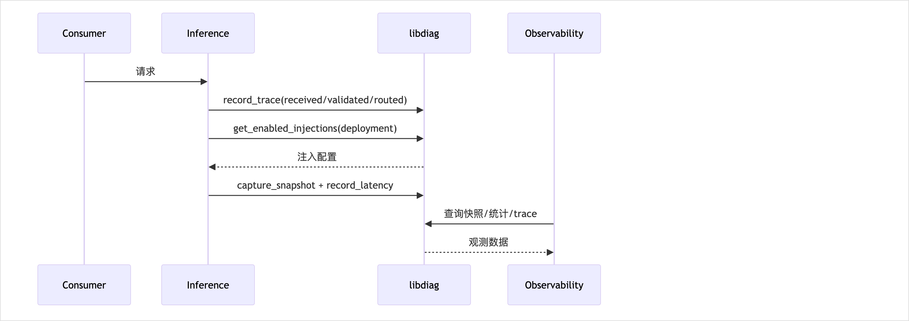

<!-- STD_DOCUMENT_COVER_BEGIN -->
# LLMTier 可观测性机制（LT-OBS）

> STD 使用入口：[项目采用说明与标准导航](../../../README.md#std-entry)

| 文档字段 | 值 |
|---|---|
| Document ID | `llmtier-observability-mechanism` |
| Document Version | `0.1.0-draft.5` |
| Status | `Draft` |
| Project | `LLMTier` |
| Authority | `LLMTier` |
| Document Owner | LLMTier |
| Authors | llmtier |
| Created Date | `2026-09-22` |
| Last Modified Date | `2026-09-25` |
| Template ID | `design.system-mechanism` |
| Template Version | `3.2.0` |
| Template Conformance | `tailored` |
| Tailoring Reference | `std-tailoring` |
| Migration Map Reference | none |
| Repository | `corezilla/LLMTier` |
| Canonical Path | `docs/20_system_design/mechanisms/observability.md` |
| Supersedes | none |
<!-- STD_DOCUMENT_COVER_END -->

## 1. 机制摘要：解决什么问题

跨服务失败时无法定位"**哪一层、哪个请求、哪个上游调用**"。本机制把定位链路产品化：上游环回快照、数据面统计、故障注入、单请求 trace 与关联标识透传。

**为什么不能由一个单元独立完成**：事实在 Inference 的请求路径上产生，开关/注入配置需被入口层切换，查询/呈现属 Observability，底层读写归 `libdiag`；横跨请求路径、管理面、基础库。

**输入 → 处理 → 输出**：
- 输入：推理请求路径事件（received/validated/routed/upstream_started/…）、管理面开关与注入配置
- 处理：按开关决定是否写入；注入配置在路由前生效；统计累积
- 输出：快照 / 统计 / trace 查询结果；`X-Request-ID` 与可选关联标识回显

**核心取舍**：**默认关闭、关闭零开销、开启时尽力而为（fail-open）**——观测**绝不**改变推理结果。

## 2. 使用场景与功能

| Capability ID | 业务任务与触发 | 输入与可观察结果 | 提供方 / 消费者 | 实现状态 | 验证判据 |
|---|---|---|---|---|---|
| CAP-OBS-1 上游快照 | 一次上游调用结束后 | url/status/时延/错误摘要写入并可分页查 | `libdiag` / Observability | Implemented | 快照用例 |
| CAP-OBS-2 数据面统计 | 每次请求完成 | 计数 + P50/P95/min/max | `libdiag` / Observability | Implemented | 统计用例 |
| CAP-OBS-3 全局开关 | Operator 切换 | snapshots/stats 开或关 | Observability / Operator | Implemented | 开关生效用例 |
| CAP-OBS-5 故障注入 | 按 deployment 配置 | delay/fault/rate_limit/流异常 | `libdiag` / Operator | Implemented（流注入见 LT-OPEN-05）| 四类注入用例 |
| CAP-OBS-6 单请求 trace | 按 request_id 查询 | 全生命周期 stages + usage | `libdiag` / Operator | Implemented | trace 用例 |
| CAP-OBS-7 关联标识 | Consumer 传 `X-Correlation-ID`/`traceparent` | 透传并回显 | HTTP API / Consumer | Implemented | 关联用例 |

**不提供**：Secret/credential/完整 prompt 或输出正文记录；自动轮询；跨系统分布式追踪后端。

## 3. 参与方、责任和 authority

### 3.1 系统约束与参与方承接

本机制为顶层机制（上级 Mechanism ID = none），约束继承自系统设计 §3 与 §11。

| Constraint ID | 约束 | 参与方保证 | 自由度 | 本文落实位置 |
|---|---|---|---|---|
| C-OBS-1 | 默认关闭，关闭时零开销 | `libdiag` | 开关存储 | §7、§9 |
| C-OBS-2 | fail-open：观测故障不得使推理失败 | 全体 | 捕获实现 | §7、§9 |
| C-OBS-3 | 不记录 Secret/credential/完整正文 | `libdiag` | 脱敏实现 | §8、§11 |
| C-OBS-4 | 注入调用在账本标注 `injected` | Inference | 标注方式 | §8 |
| C-OBS-5 | 调试能力由 `libdiag` **提供**、Observability **呈现** | Observability | — | §14 |

### 3.2 运行时统筹与确认责任

`libdiag` 提供能力（开关/注入配置/记录读写）；Observability 调用并呈现；Inference 在请求路径**按配置注入并写入事实**。写入是尽力而为，不作为请求成功的条件。

### 3.3 拓扑、目标身份与共享故障域

单节点。观测为**尽力而为**，与推理**故障域隔离**（观测故障不传播到推理）。目标身份为 `request_id` 与可选关联标识。

## 4. 数据结构设计

> 按 STD `design-data-interface-format` 1.2.0 §2：主章“数据结构设计”，章内按**数据性质**分类（§4.1–§4.8），本层特有分析见 §4.9–§4.10。仅保留适用类别。底层结构与列权威见 M006 `libdiag-design.md` §6；本节拥有机制层类型 ID 前缀 `D-OBS-*`，不复制列级权威。

**类别适用性**：§4.1 公共基础类型与枚举 ✓｜§4.2 业务与操作数据结构 ✓｜§4.3 配置与规则数据结构 ✓｜§4.4 通信报文结构 ✗（观测记录为进程内/持久行，无消息/流 wire；查询报文属 HTTP 投影）｜§4.5 设备与 FPGA 表项结构 ✗（纯软件，无设备/RTL）｜§4.6 运行状态数据结构 ✓｜§4.7 数据库表结构 ✓｜§4.8 错误码与错误结构 ✓（引用系统 §8.8）。

### 4.1 公共基础类型与枚举

**4.1.1 `D-OBS-STAGE` · TraceStageName（公共基础类型与枚举）**

```text
enum TraceStageName {
  received, validated, routed, upstream_started, upstream_ended, completed, aborted
}
```

- **Data/Type ID、用途与来源**：

  `D-OBS-STAGE`；trace 阶段名集合；唯一来源 `src/libdiag/traces.py`（调用方约定集合，代码不强制校验）。

- **`received`/`validated`/`routed`/`upstream_started`/`upstream_ended`/`completed`/`aborted`**：

  必填枚举值；每值 ≤64 字符；同 request 的 `stages` 按 `timestamp` 升序（INV-5）。

- **跨字段与寿命**：

  无状态枚举；随 `trace_events.stage` 持久（7 天）。

- **合法/拒绝实例**：

  合法 `completed`；边界：未知字符串可写入，消费方按未知处理。

- **验证**：

  `T-OBS-TRACE`。

**4.1.2 `D-OBS-INJECTION-TYPE` · InjectionType（公共基础类型与枚举）**

```text
enum InjectionType {
  fault_502, fault_503, delay, rate_limit, stream_terminate, malformed_event
}
```

- **Data/Type ID、用途与来源**：

  `D-OBS-INJECTION-TYPE`；故障注入类型枚举；唯一来源 `src/libdiag/injections.py` 白名单。

- **`fault_502`/`fault_503`/`delay`/`rate_limit`/`stream_terminate`/`malformed_event`**：

  必填枚举值；白名单；每类型有固定 `config` 字段集（§4.3.2）。

- **跨字段与寿命**：

  白名单校验；随 `diagnostic_injections.injection_type` 持久。

- **合法/拒绝实例**：

  合法 `delay`；拒绝 `nope` → `ERR-INJECTION` 400。

- **验证**：

  `T-OBS-INJECT`。

**4.1.3 `D-OBS-SNAPSHOT-TYPE` / `D-OBS-MALFORMED-TYPE`（公共基础类型与枚举）**

```text
enum SnapshotType { upstream, error }
enum MalformedEventType { invalid_json, unknown_event_type }
```

- **Data/Type ID、用途与来源**：

  `D-OBS-SNAPSHOT-TYPE` ∈ {`upstream`,`error`}；`D-OBS-MALFORMED-TYPE` ∈ {`invalid_json`,`unknown_event_type`}；唯一来源 `snapshots.py`/`injections.py`。

- **`upstream`/`error`**：

  必填枚举值；`upstream` 由 `http_status` 存在决定。

- **`invalid_json`/`unknown_event_type`**：

  必填枚举值；malformed 类型白名单。

- **跨字段与寿命**：

  随 `diagnostic_snapshots.snapshot_type` / 注入配置持久。

- **合法/拒绝实例**：

  `upstream`（有 status）；`invalid_json`。

- **验证**：

  `T-OBS-SNAP`、`T-OBS-INJECT`。

### 4.2 业务与操作数据结构

**4.2.1 `D-OBS-SNAPSHOT` · SnapshotView（业务与操作数据结构）**

```text
SnapshotView {
  id: string,
  request_id: string,
  captured_at: RFC3339ms,
  upstream_url: string,          # 去 query
  backend_model: string?,
  http_status: int?(100–599),
  latency_ms: float?(>=0),
  error_summary: string?(<=256B),
  model: string?,
  deployment_id: string?,
  snapshot_type: SnapshotType
}
```

- **Data/Type ID、用途与来源**：

  `D-OBS-SNAPSHOT`；一次上游调用快照；唯一来源 `src/libdiag/snapshots.py`，列权威 M006 §6.7。

- **`id`**：

  必填字符串；快照标识。

- **`request_id`**：

  必填字符串；关联请求身份。

- **`captured_at`**：

  必填 `RFC3339ms`；捕获时间。

- **`upstream_url`**：

  必填字符串；去 query 的上游 URL。

- **`backend_model`**：

  可空字符串；后端模型名。

- **`http_status`**：

  可空整数，100–599；`upstream ⇒ 非空`。

- **`latency_ms`**：

  可空浮点，≥0；时延。

- **`error_summary`**：

  可空字符串，≤256B；UTF-8 安全截断。

- **`model`/`deployment_id`**：

  可空字符串；逻辑等级 / deployment。

- **`snapshot_type`**：

  必填 `D-OBS-SNAPSHOT-TYPE`（§4.1.3）。

- **跨字段与寿命**：

  `upstream ⇒ http_status 非空`、`error ⇒ http_status 空`；URL 去 query；summary ≤256B UTF-8 安全截断（INV-1/2）；持久 `diagnostic_snapshots`；M006 写、M005 读；只追加；7 天。

- **合法/拒绝实例**：

  合法 `upstream` 快照；拒绝：`snapshots_enabled=false` → 不写（返回 null）。

- **验证**：

  `T-OBS-SNAP`。

**4.2.2 `D-OBS-STATS` · StatsView / StatsWindow（业务与操作数据结构）**

```text
StatsView { windows: StatsWindow[] }
StatsWindow {
  stat_hour: YYYY-MM-DDTHH,
  deployment_id: string?, model: string?,
  status_breakdown: map<string,int>,
  error_4xx_count: int, error_5xx_count: int, request_count: int, error_count: int,
  latency_p50_ms: float?, latency_p95_ms: float?, latency_min_ms: float?, latency_max_ms: float?,
  latency_sum_ms: float
}
```

- **Data/Type ID、用途与来源**：

  `D-OBS-STATS`；按小时桶聚合统计；唯一来源 `src/libdiag/stats.py`。

- **`windows`**：

  必填数组；无数据 → `[]`。

- **`stat_hour`**：

  必填；小时桶键。

- **`status_breakdown`/`request_count`/`error_count`**：

  必填；状态分解与计数；`error_*_count` 由 breakdown 派生。

- **`latency_p50/p95/min/max_ms`**：

  可空浮点；无样本 ⇒ 百分位 `null`。

- **`latency_sum_ms`**：

  必填浮点；无样本 ⇒ `sum=0`。

- **跨字段与寿命**：

  `error_*_count` 由 breakdown 派生；无样本 ⇒ 百分位 `null`、`sum=0`；内存聚合可丢、非账本；请求级只读（组合 `data_plane_stats` + 内存 samples）；非持久。

- **合法/拒绝实例**：

  合法 window；边界：无数据 → `windows=[]`。

- **验证**：

  `T-OBS-STATS`。

**4.2.3 `D-OBS-TRACE` · TraceView / TraceStage / UsageView（业务与操作数据结构）**

```text
TraceView {
  request_id: string, correlation_id: string?,
  stages: TraceStage[>=1], snapshot: SnapshotView?, usage: UsageView?
}
TraceStage { stage: TraceStageName, timestamp: RFC3339ms, detail: object? }
UsageView {
  record_version: int>=1, is_final: bool, model: string,
  input_tokens: int?, output_tokens: int?, total_tokens: int?,
  measurement_status: string∈{measured,unknown}, source: string
}
```

- **Data/Type ID、用途与来源**：

  `D-OBS-TRACE`；单请求完整 trace 视图；唯一来源 `src/libdiag/traces.py`。

- **`request_id`/`correlation_id`**：

  `request_id` 必填；`correlation_id` 可空。

- **`stages`**：

  必填、≥1、升序；`TraceStage` 含 `stage`/`timestamp`/`detail?`。

- **`snapshot`/`usage`**：

  可空；组合快照与用量视图。

- **`UsageView.measurement_status`**：

  必填 ∈ {`measured`,`unknown`}；`measured⇒tokens 非空`、`unknown⇒空（不补零）`。

- **跨字段与寿命**：

  `stages` 非空且升序；`measured⇒tokens 非空`、`unknown⇒空（不补零）`；只读视图；组合 trace_events + snapshot + usage（M004/M003）；请求级，非持久。

- **合法/拒绝实例**：

  合法完整 trace；拒绝：无记录 → `IF-OBS-TRACE-QUERY` 404。

- **验证**：

  `T-OBS-TRACE`。

**4.2.4 `D-OBS-INJECTION` · InjectionView / EnabledInjection（业务与操作数据结构）**

```text
InjectionView {
  id: string, deployment_id: string, type: InjectionType,
  config: object, enabled: bool, updated_at: RFC3339ms
}
EnabledInjection = diagnostic_injections 全行（enabled:int 恒 1）
```

- **Data/Type ID、用途与来源**：

  `D-OBS-INJECTION`；注入配置视图 / 命中的启用注入；唯一来源 `src/libdiag/injections.py`。

- **`id`/`deployment_id`**：

  必填字符串；注入标识 / 目标 deployment。

- **`type`**：

  必填 `D-OBS-INJECTION-TYPE`（§4.1.2）。

- **`config`**：

  必填对象；字段集与 `type` 一致（§4.3.2）。

- **`enabled`/`updated_at`**：

  必填布尔 / 必填时间。

- **`EnabledInjection`**：

  `diagnostic_injections` 全行，`enabled=1`。

- **跨字段与寿命**：

  `config` 字段集与 `type` 一致；`EnabledInjection` 仅 `enabled=1`；多启用时按固定优先级取单条；持久；M006 写、M006/M005 读。

- **合法/拒绝实例**：

  合法 `delay`；拒绝非法 type/config → `ERR-INJECTION` 400。

- **验证**：

  `T-OBS-INJECT`。

**4.2.5 `D-OBS-PAGE` · TracePage / SnapshotPage（业务与操作数据结构）**

```text
Page<T> { items: T[], next_cursor: string?, has_more: bool }   # items 长度 <= limit
```

- **Data/Type ID、用途与来源**：

  `D-OBS-PAGE`；trace / 快照分页；唯一来源 `traces.py`/`snapshots.py`。

- **`items`**：

  必填数组，≤limit；空匹配 → `[]`。

- **`next_cursor`**：

  可空字符串；`has_more=false ⇒ next_cursor=null`；cursor 稳定（trace=`first_ts|request_id`；快照=末条 `id`）。

- **`has_more`**：

  必填布尔；是否还有下一页。

- **跨字段与寿命**：

  `has_more=false ⇒ next_cursor=null`；cursor 稳定；请求级只读。

- **合法/拒绝实例**：

  合法翻页；边界：空匹配 → `items=[]`、`has_more=false`。

- **验证**：

  `T-OBS-TRACE`。

### 4.3 配置与规则数据结构

**4.3.1 `D-OBS-SWITCH` · 诊断开关（配置与规则数据结构）**

```text
SwitchState {
  snapshots_enabled: bool,
  stats_enabled: bool
}
```

- **Data/Type ID、用途与来源**：

  `D-OBS-SWITCH`；全局诊断开关状态；唯一来源 `src/libdiag/settings.py`（`diagnostic_settings` 单行）。

- **`snapshots_enabled`**：

  必填布尔，默认 false；快照记录开关。

- **`stats_enabled`**：

  必填布尔，默认 false；统计记录开关。

- **跨字段与寿命**：

  两字段独立；恒取自 `singleton=1` 单行；关闭 ⇒ 零写入（INV-4）；持久单行；M006 写、记录路径读；库寿命。

- **合法/拒绝实例**：

  合法 `{true,false}`；边界：缺行返回默认 false（迁移保证恒有）。

- **验证**：

  `T-OBS-SWITCH`。

**4.3.2 `D-OBS-INJECTION-CONFIG` · InjectionConfig（配置与规则数据结构，按类型）**

```text
InjectionConfig {
  fault_502 | fault_503: { error_body: string },              # 非空, <=512B
  delay: { delay_ms: int },                                   # 0–60000
  rate_limit: { retry_after_sec: int },                       # 0–300
  stream_terminate: { stream_terminate_after_events: int },   # 1–10000
  malformed_event: { malformed_after_events: int, malformed_event_type: MalformedEventType }  # 0–10000
}
```

- **Data/Type ID、用途与来源**：

  `D-OBS-INJECTION-CONFIG`；各注入类型的 `config` 字段集与范围；唯一来源 `src/libdiag/injections.py` `_validate`。

- **`fault_502`/`fault_503`**：

  必填 `error_body: string`（非空，≤512B）。

- **`delay`**：

  必填 `delay_ms: int`（0–60000）。

- **`rate_limit`**：

  必填 `retry_after_sec: int`（0–300）。

- **`stream_terminate`**：

  必填 `stream_terminate_after_events: int`（1–10000）。

- **`malformed_event`**：

  必填 `malformed_after_events: int`（0–10000）+ `malformed_event_type: D-OBS-MALFORMED-TYPE`（§4.1.3）。

- **跨字段与寿命**：

  字段齐备且落在范围；越界/缺失 → `ERR-INJECTION` 400；持久于 `diagnostic_injections` 对应列；部分更新 upsert。

- **合法/拒绝实例**：

  合法 `{delay_ms:200}`；拒绝 `{delay_ms:60001}` → 400。

- **验证**：

  `T-OBS-INJECT`。

### 4.4 通信报文结构

不适用：观测记录为进程内对象与 SQLite 行，不存在跨执行边界的消息/事件/流 wire；对外查询报文为 HTTP JSON 投影（字段即 §4.2 视图），不构成本机制拥有的独立通信报文结构。SSE 流归 M-INFER（`D-MSG-SSE`）。

### 4.5 设备与 FPGA 表项结构

不适用：LLMTier 为纯软件，无连接器、总线、寄存器或 FPGA 端口（tailoring `LT-TL-003`）。

### 4.6 运行状态数据结构

**4.6.1 `D-OBS-RUNTIME-STATE` · DiagnosticsRuntimeState（运行状态数据结构）**

```text
DiagnosticsRuntimeState {
  switches: SwitchState,
  stats_cache: map<key, Agg>(上限 + LRU),
  last_cleanup: object?
}
```

- **Data/Type ID、用途与来源**：

  `D-OBS-RUNTIME-STATE`；诊断开关的运行时事实与统计缓存；唯一来源 `settings.py`（开关）与 `stats.py`（内存聚合 LRU）。

- **`switches`**：

  必填，等同 `D-OBS-SWITCH`（§4.3.1）。

- **`stats_cache`**：

  必填映射；统计内存缓存，上限 + LRU 淘汰。

- **`last_cleanup`**：

  可空过程量；最近 `cleanup` 结果，不持久。

- **跨字段与寿命**：

  唯一写者=`set_switches`/`record_latency`；记录前判定（关闭零写入，C-OBS-1/INV-4）；缓存满 LRU 淘汰；单行持久 + 请求级过程量；进程退出丢失内存统计（不承诺恢复）。

- **合法/拒绝实例**：

  关 → 无新行；开 → 正常写入；缓存满 → 淘汰最旧。

- **验证**：

  `T-OBS-SWITCH`、`T-OBS-STATS`。

### 4.7 数据库表结构

**4.7.1 `diagnostic_*` / `data_plane_*` / `trace_events`（数据库表）**

```text
tables {
  diagnostic_settings { singleton=1, snapshots_enabled, stats_enabled },
  diagnostic_snapshots { id PK, snapshot_type, http_status?, ... },
  data_plane_stats { (stat_hour, deployment_id, model, status) PK, ... },
  data_plane_latency_samples { 无 PK（追加）, ... },
  diagnostic_injections { id PK, UNIQUE(deployment_id, injection_type), config_json, enabled },
  trace_events { id PK, request_id, stage, ... }
}
```

- **Data/Type ID、用途与来源**：

  Authority = `util/migrations/002_observability.sql`（M007 `migrate()` 执行）；列级阅读视图见 M006 `libdiag-design.md` §6.7 与 `util.isd` §4.4；本机制覆盖上列 6 张表。

- **`diagnostic_settings.singleton`**：

  主键恒 =1；单行。

- **`diagnostic_snapshots.id`**：

  主键；`snapshot_type` 由 `http_status` 判定。

- **`data_plane_stats`**：

  主键 `(stat_hour,deployment_id,model,status)`；累加 upsert。

- **`data_plane_latency_samples`**：

  无主键；只追加。

- **`diagnostic_injections`**：

  `id` 主键；`UNIQUE(deployment_id,injection_type)`；按 `(deployment_id,injection_type)` upsert。

- **`trace_events.id`**：

  主键；只追加。

- **跨字段与寿命**：

  `diagnostic_snapshots.snapshot_type` 由 `http_status` 判定；`data_plane_stats` 累加 upsert；注入按 `(deployment_id,injection_type)` upsert；`diagnostic_settings`/`diagnostic_injections` 库寿命，快照/trace 7 天（追加），统计与样本按保留期。

- **合法/拒绝实例**：

  合法：空库由 M007 一次性建表；拒绝：schema 版本不符由 M007 拒绝启动（系统 `ERR-SCHEMA`）。

- **验证**：

  `T-OBS-SNAP`、`T-OBS-SWITCH`。

### 4.8 错误码与错误结构

**4.8.1 `D-OBS-ERROR-MAP` · 观测错误映射（错误码与错误结构，引用系统 §8.8）**

```text
enum ObservabilityErrorRef { ERR-INJECTION, ERR-NOTFOUND, ERR-STORE, ERR-REQ-VALIDATION }
```

- **Data/Type ID、用途与来源**：

  `D-OBS-ERROR-MAP`；本机制对外错误的系统码引用，不新增公共错误码；唯一来源系统设计 §8.8（公共含义）与 `openapi`（产生）；载荷 `D-ERROR-ENVELOPE`。

- **`ERR-INJECTION`（400 `invalid_injection`）**：

  注入类型/字段/范围非法；未写入、配置不变；修正注入项。

- **`ERR-NOTFOUND`（404 `not_found`）**：

  `trace()` 无记录 / 未知 deployment；未受理、无副作用；修 id。

- **`ERR-STORE`（503 `usage_store_unavailable`）**：

  存储不可达；本次查询失败；稍后重试。

- **`ERR-REQ-VALIDATION`（400 `invalid_request`）**：

  查询参数非法；未受理；修参数。

- **跨字段与寿命**：

  `record_*` 写失败 **fail-open**（不抛，记 warning），不产生公共错误；`trace`/`injections`/`set_injections` 的拒绝为显式 `ApiError`；载荷 `D-ERROR-ENVELOPE`；请求级返回，不持久。

- **合法/拒绝实例**：

  拒绝：未知 deployment → 404；边界：写失败 → warning，无错误返回。

- **验证**：

  `T-OBS-FAILOPEN`、`T-OBS-SNAP`。

### 4.9 编码、布局与共享类型映射

不适用二进制 ABI：SQLite 行 + JSON 列（`detail`、`config_json`，紧凑分隔符）。

| 类型 ID / 编码源基线 | 逻辑宽度/序列化长度 | 实际 ABI 定位或不适用理由 | 原类型 → 投影/转换/损失 | 验证项 |
|---|---|---|---|---|
| `D-OBS-SNAPSHOT`（M006 §6.7） | `error_summary` ≤256B；URL 去 query | `diagnostic_snapshots` 行 | 上游事实 → 脱敏行；query/正文被丢弃 | `T-OBS-SNAP` |
| `D-OBS-TRACE`（M006 §6.7） | `detail` JSON；stage ≤64 | `trace_events` 行 / 只读视图 | 事件 → 有序 stages；未知 stage 保留 | `T-OBS-TRACE` |
| `D-OBS-STATS`（内存） | 内存聚合 + 小时桶 | 无持久 ABI；可丢 | 样本 → 百分位；无样本 null | `T-OBS-STATS` |
| `D-OBS-INJECTION-CONFIG` | JSON object | `diagnostic_injections.config_json` | type → config 字段集 | `T-OBS-INJECT` |

### 4.10 一致性、可见性与数据寿命

记录为尽力而为：写入失败记 warning、不抛、不阻断推理（C-OBS-2/INV-6）。同 `request_id` 的 trace 事件有序（INV-5），但跨请求无全局顺序；`stages` 升序由唯一写者保证。开关关闭 ⇒ 零写入、零开销（INV-4）。统计为内存缓存，可丢、非账本，样本缺失时百分位为 `null` 而非 0。快照/trace 保留 7 天，由 `cleanup` 删除过期行；`diagnostic_settings` 与注入配置为库寿命。进程退出丢失内存统计与「最近 cleanup 结果」，不承诺恢复；`DiagnosticsService` 初始化失败时降级运行，Data Plane 不受影响。观测数据与账本（M-METER）故障域隔离，不得据观测缺失推断“未发生调用”。

## 5. 接口设计

> 按 STD `design-data-interface-format` 1.2.0 §3：主章“接口设计”，按**接口用途**分类逐接口完整记录；标题为真实调用形式，标题下先给完整接口声明，再就地说明输入/输出，最后按六项写完。数据结构引用 §4；错误引用系统 §8.8；底层 `DiagnosticsService` 实现见 M006 `libdiag-design.md` §9。分类：API = 向 Consumer/Operator 提供可调用能力（本机制为诊断 HTTP 端点，以及 `DiagnosticsService` 进程内方法）；消息与数据流 = 组件/系统之间为协作而交换的命令/状态/事件/队列/流/文件。`DiagnosticsService` 方法向管理面/请求路径提供可调用能力，故归 §5.1 API；本机制不拥有跨边界消息/流接口。

### 5.1 API（适用时）

本机制对 Consumer/Operator 的 API 为 `/v1/diagnostics*` 与 `/v1/trace/{request_id}` HTTP 端点；其底层的 `DiagnosticsService.*` 进程内方法向管理面/请求路径提供可调用能力，归本节 API。

#### `GET/PATCH /v1/diagnostics`
```text
GET   /v1/diagnostics        -> 200 {snapshots_enabled, stats_enabled}
PATCH /v1/diagnostics {snapshots_enabled?, stats_enabled?} -> 200 {…}
  -> 4xx/5xx: ErrorEnvelope
```
- **Interface/Member ID、用途、提供责任与唯一来源**：`IF-OBS-API-SWITCH`；Operator 读写全局诊断开关；M005 Observability 提供、M006 持有；交接边界=诊断管理面 HTTP；状态=Implemented；`src/http_api/app.py` → `app.diagnostics.switches/set_switches`。
- **输入与前提**：PATCH body 可选两布尔；授权=operator（`ERR-AUTH-*`）；校验=`set_switches` 语义。
- **成功输出与保证**：`D-OBS-SWITCH`（§4.3.1）；生效=事务提交；副作用=同事务审计。
- **错误与合法下一步**：`ERR-REQ-VALIDATION`（400）；`ERR-AUTH-*`；`ERR-STORE`（503）。
- **交互与生命周期**：同步；幂等；默认关。
- **实现与验证**：正常切换；拒绝非法布尔 → 400。`T-OBS-SWITCH`；Run=NOT_RUN。

#### `GET /v1/diagnostics/snapshots|stats|traces`；`GET/PATCH /v1/deployments/{deployment_id}/diagnostics`；`GET /v1/trace/{request_id}`
```text
GET /v1/diagnostics/snapshots?since=&until=&deployment_id=&model=&limit=&cursor= -> 200 SnapshotPage
GET /v1/diagnostics/stats?since=&until=&deployment_id=&model=      -> 200 StatsView
GET /v1/diagnostics/traces?since=&until=&deployment_id=&model=&limit=&cursor= -> 200 TracePage   # Planned (G-1)
GET /v1/deployments/{deployment_id}/diagnostics                    -> 200 InjectionView[]
PATCH /v1/deployments/{deployment_id}/diagnostics {items}          -> 200 InjectionView[]
GET /v1/trace/{request_id}                                          -> 200 TraceView
  -> 4xx/5xx: ErrorEnvelope
```
- **Interface/Member ID、用途、提供责任与唯一来源**：`IF-OBS-API-QUERY`；Operator 查询快照/统计/trace、读写故障注入；M005 Observability 提供、M006 持有；交接边界=诊断管理面 HTTP；状态=Implemented（`traces` 时间窗为 Planned，G-1）；`src/http_api/app.py` → `app.diagnostics`。
- **输入与前提**：查询参数（RFC3339 窗、filter、分页）；PATCH body=注入项列表；授权=operator。
- **成功输出与保证**：`D-OBS-SNAPSHOT`/`D-OBS-STATS`/`D-OBS-TRACE`/`D-OBS-PAGE`（§4.2）；无副作用（PATCH 副作用=注入配置写 + 审计）。
- **错误与合法下一步**：`ERR-INJECTION`（400 PATCH）；`ERR-NOTFOUND`（404 trace/未知 deployment）；`ERR-STORE`（503）；`ERR-REQ-VALIDATION`（400 缺 since/until）。
- **交互与生命周期**：同步；GET 幂等只读；PATCH partial upsert。
- **实现与验证**：演练：PATCH `dep_local_gemma`（`delay`/2000ms）→ 推理 → trace `routed` 带注入 → 快照/统计含该请求 → `GET /v1/trace/req_…` 有序 stages + usage。`T-OBS-INJECT`、`T-OBS-TRACE`；Run=NOT_RUN。

#### `DiagnosticsService.switches() / set_switches(snapshots_enabled=None, stats_enabled=None, conn=None) -> SwitchState`

```text
switches() -> SwitchState
set_switches(snapshots_enabled: bool | None = None, stats_enabled: bool | None = None, conn: Connection | None = None) -> SwitchState
```

- **Interface/Member ID、用途、提供责任与唯一来源**：`IF-OBS-SWITCH`；`libdiag` 向管理面提供全局诊断开关的读写；`libdiag` 提供、Observability/HTTP Adapter 消费；交接边界=诊断管理面→`libdiag`；状态=Implemented；唯一契约=本设计 + M006 §9.1；`src/libdiag/settings.py`。
- **输入与前提**：部分更新（`None`=保持）；授权=operator（经 M001 管理面）；校验=非 `bool` 且非 `None` → 拒绝。
- **成功输出与保证**：`D-OBS-SWITCH`（§4.3.1）——受理=返回规范化开关；生效=`conn` 非空并入调用方事务，否则自开 `BEGIN IMMEDIATE` 提交后对外可见；副作用=开关状态更新。
- **错误与合法下一步**：非法类型 → `ERR-REQ-VALIDATION`（400）；存储异常 → `ERR-STORE`（503）；失败无副作用。
- **交互与生命周期**：同步；幂等（重复设同值无副作用）；调用方线程。
- **实现与验证**：正常 `set_switches(stats_enabled=True)`；拒绝 `"yes"` → 400。`T-OBS-SWITCH`；Run=NOT_RUN。

#### `DiagnosticsService.record_trace(request_id, stage, detail=None, correlation_id=None) -> None`

```text
record_trace(request_id: str, stage: str, detail: dict | None = None, correlation_id: str | None = None) -> None
```

- **Interface/Member ID、用途、提供责任与唯一来源**：`IF-OBS-RECORD-TRACE`；向 `libdiag` 追加一次 trace 阶段事实；Inference/入口消费、`libdiag` 提供；交接边界=请求路径→trace 记录；状态=Implemented；`src/libdiag/traces.py`。
- **输入与前提**：`request_id`（非空）；`stage: D-OBS-STAGE`（§4.1.1）；`detail`；`correlation_id`；授权=内部（Inference/入口）；受 `D-OBS-SWITCH` 影响（仅 trace 无独立开关，默认记录）。
- **成功输出与保证**：无返回——受理即追加 `trace_events` 行；完成=行提交；副作用=持久一行。
- **错误与合法下一步**：写失败 → **fail-open**：不抛、记 `OperationalLog(warning)`；结果已知性=丢失该阶段；无部分写。
- **交互与生命周期**：同步；不幂等（每次一行）；请求级；无期限。
- **实现与验证**：正常 `record_trace("req","received")`；边界：DB 只读 → warning 不阻断。`T-OBS-FAILOPEN`；Run=NOT_RUN。

#### `DiagnosticsService.capture_snapshot(request_id, deployment_id, model, upstream_url, backend_model, http_status, latency_ms, error_summary) -> str | None`

```text
capture_snapshot(request_id: str, deployment_id: str | None, model: str | None, upstream_url: str, backend_model: str | None, http_status: int | None, latency_ms: float | None, error_summary: str | None) -> str | None
```

- **Interface/Member ID、用途、提供责任与唯一来源**：`IF-OBS-RECORD-SNAPSHOT`；记录一次上游调用脱敏快照；Inference/入口消费、`libdiag` 提供；交接边界=上游调用结束后；状态=Implemented；`src/libdiag/snapshots.py`。
- **输入与前提**：`request_id`、`deployment_id`、`model`、`upstream_url`（去 query）、`backend_model`、`http_status`（100–599）、`latency_ms`（≥0）、`error_summary`（≤256B 截断）；受 `D-OBS-SWITCH.snapshots_enabled` 控制；授权=内部。
- **成功输出与保证**：`snap_id: str`——受理并持久 `diagnostic_snapshots` 行；完成=行提交；副作用=持久一行。
- **错误与合法下一步**：开关关 → `null`（未受理）；写失败 → `null` + warning（fail-open）；无公共错误。
- **交互与生命周期**：同步；不幂等（每次新 id）；请求级。
- **实现与验证**：正常（200）→ `snap_*`；边界：开关关 → `null` 且无行。`T-OBS-SNAP`；Run=NOT_RUN。

#### `DiagnosticsService.record_latency(deployment_id, model, status_code, latency_ms) -> None`

```text
record_latency(deployment_id: str | None, model: str | None, status_code: int | None, latency_ms: float | None) -> None
```

- **Interface/Member ID、用途、提供责任与唯一来源**：`IF-OBS-RECORD-LATENCY`；记录一次请求的状态与时延到统计聚合；Inference/入口消费、`libdiag` 提供；交接边界=请求完成后；状态=Implemented；`src/libdiag/stats.py`。
- **输入与前提**：`deployment_id`、`model`、`status_code`（100–599；`None`/<100 → `upstream_error`）、`latency_ms`（≥0；`None` 只计请求不计延迟）；受 `stats_enabled` 控制。
- **成功输出与保证**：无返回——`UPSERT data_plane_stats`；`latency_ms` 非空时追加 `data_plane_latency_samples`；内存缓存累加，满则 LRU 淘汰。
- **错误与合法下一步**：写失败 → fail-open warning；缓存满 → 淘汰最旧；无公共错误。
- **交互与生命周期**：同步；不幂等（累加）；请求级。
- **实现与验证**：正常（200,120ms）；边界 `status_code=None` → `upstream_error`。`T-OBS-STATS`；Run=NOT_RUN。

#### `DiagnosticsService.trace(request_id) / traces(...) / snapshots_page(...) / stats(...) -> dict`

```text
trace(request_id: str) -> dict
traces(since=None, until=None, deployment_id=None, model=None, limit=50, cursor=None) -> dict
snapshots_page(since=None, until=None, deployment_id=None, model=None, limit=50, cursor=None) -> dict
stats(since: str, until: str, deployment_id=None, model=None) -> dict
```

- **Interface/Member ID、用途、提供责任与唯一来源**：`IF-OBS-TRACE-QUERY`；为诊断 HTTP 端点提供 trace/快照/统计只读查询；`libdiag` 提供、HTTP Adapter 消费；交接边界=诊断查询→读取；状态=Implemented；`src/libdiag/traces.py`/`snapshots.py`/`stats.py`。
- **输入与前提**：`request_id`；时间窗（RFC3339）；`limit`（夹 `[1,500]`）；`cursor`（`D-OBS-PAGE`，§4.2.5）；授权=operator（管理面）。
- **成功输出与保证**：`D-OBS-TRACE` / `D-OBS-PAGE` / `D-OBS-SNAPSHOT` / `D-OBS-STATS`（§4.2）——只读；无副作用。
- **错误与合法下一步**：`trace` 无记录 → `ERR-NOTFOUND`（404）；存储不可达 → `ERR-STORE`（503）；空匹配非错误（返回空页）。
- **交互与生命周期**：同步只读；幂等；cursor 稳定基于 `(first_ts,request_id)` 或末条 `id`。
- **实现与验证**：正常窗口分页；边界：空窗口 → `has_more=false`。`T-OBS-TRACE`；Run=NOT_RUN。

#### `DiagnosticsService.set_injections(deployment_id, actor_items, conn=None) / injections(deployment_id) / enabled_injection(deployment_id) / enabled_stream_injection(deployment_id) -> ...`

```text
set_injections(deployment_id: str, actor_items: list[dict], conn: Connection | None = None) -> list[dict]
injections(deployment_id: str) -> list[dict]
enabled_injection(deployment_id: str) -> dict | None
enabled_stream_injection(deployment_id: str) -> dict | None
```

- **Interface/Member ID、用途、提供责任与唯一来源**：`IF-OBS-INJECT`；向管理面提供故障注入配置读写、向推理路径提供命中注入读取；`libdiag` 提供、Observability/Inference 消费；交接边界=管理面↔`libdiag`↔请求路径；状态=Implemented；`src/libdiag/injections.py`。
- **输入与前提**：`deployment_id`；`actor_items`（每项 `{type:D-OBS-INJECTION-TYPE, config:D-OBS-INJECTION-CONFIG, enabled}`，§4.3.2）；授权=operator（写）/内部（读 enabled）；校验=白名单 + 每类型字段/范围。
- **成功输出与保证**：全量 `D-OBS-INJECTION[]`（§4.2.4）——受理=upsert 提交后可见；`enabled_*` 按固定优先级返回**单条**（前置 `fault_502→fault_503→rate_limit→delay`；流 `stream_terminate→malformed_event`）；副作用=持久注入配置。
- **错误与合法下一步**：类型/字段/范围非法 → `ERR-INJECTION`（400）；未知 deployment（读）→ `ERR-NOTFOUND`（404）；`ERR-STORE`（503）；校验失败不写、副作用无。
- **交互与生命周期**：同步；`conn` 非空并入调用方事务；按 `(deployment_id,type)` upsert 幂等；`enabled_*` 只读。
- **实现与验证**：正常 `[{type:"delay",config:{delay_ms:2000},enabled:true}]`；拒绝未知 type → 400。`T-OBS-INJECT`；Run=NOT_RUN。

#### `DiagnosticsService.stream_wrapper(deployment_id, base_stream) -> Iterable[bytes]`

```text
stream_wrapper(deployment_id: str, base_stream: Iterable[bytes]) -> Iterable[bytes]
```

- **Interface/Member ID、用途、提供责任与唯一来源**：`IF-OBS-STREAM-WRAP`；对流式输出实施按 deployment 的流异常注入（组件间数据流变换）；`libdiag` 提供、HTTP/SSE Adapter 消费；交接边界=SSE 出站前；状态=Implemented（`LT-OPEN-05` 流注入见未决）；`src/libdiag/stream.py`。
- **输入与前提**：`deployment_id`；`base_stream`（SSE 字节流）；授权=内部（M001 输出）。
- **成功输出与保证**：惰性字节流——无注入透传；`stream_terminate` 第 N 块后结束；`malformed_event` 第 N 块后追加一帧畸形事件并结束；受理/完成=按块产出；副作用=改变出站流。
- **错误与合法下一步**：无注入即透传；注入确定性触发。
- **交互与生命周期**：同步惰性；请求级流；不改变无注入流。
- **实现与验证**：正常透传；边界 `stream_terminate` → 提前结束。`T-OBS-INJECT`；Run=NOT_RUN。

#### `DiagnosticsService.cleanup(days=7) -> int`

```text
cleanup(days: int = 7) -> int
```

- **Interface/Member ID、用途、提供责任与唯一来源**：`IF-OBS-CLEANUP`；过期快照/trace/统计清理；`libdiag` 提供、启动/运维消费；交接边界=启动或显式运维调用；状态=Implemented；`src/libdiag/retention.py`。
- **输入与前提**：`days`（默认 7，≥0）；授权=内部（启动/运维）。
- **成功输出与保证**：删除行数 `int`（≥0）——删除早于 `now-days` 的快照/trace/统计；副作用=删除过期行。
- **错误与合法下一步**：失败 → `0` + warning（fail-open，不抛）。
- **交互与生命周期**：启动/显式调用；同步；幂等。
- **实现与验证**：正常删除过期；边界：无过期 → `0`。`T-OBS-SNAP`；Run=NOT_RUN。

### 5.2 消息与数据流接口（适用时）

不适用：本机制不拥有组件/系统间协作交换的消息、事件、队列、流或文件接口；`DiagnosticsService.*` 是向管理面/请求路径提供可调用能力的进程内方法，归 §5.1 API。

### 5.3 硬件与固件接口（适用时）

不适用：无连接器、总线、寄存器或 FPGA 端口。

### 5.4 人机与维护接口（适用时）

#### `/ui/diagnostics` 诊断页面；`joint-diagnose.sh`
```text
/ui/diagnostics (浏览器, 4 tabs: 快照/统计/注入/Trace)
joint-diagnose.sh --x-request-id <request_id> -> trace/snapshots
```
- **Interface/Member ID、用途、提供责任与唯一来源**：`IF-OBS-UI`；`/ui/diagnostics` 诊断页面；M002 Web UI 提供、M001 提供静态资源、operator 消费；`IF-OBS-DIAG`；`joint-diagnose.sh` 只读联调脚本；Manual；执行位置=浏览器/消费方主机；授权=operator。
- **输入与前提**：页面=用户操作（4 tabs + 全局开关），目标=当前 LLMTier 实例；脚本入参 `x-request-id`；前置=诊断 API 可用。
- **成功输出与保证**：页面=快照/统计/注入/Trace 视图与开关状态反馈；脚本=只读 trace/快照；副作用=开关切换（页面）或只读（脚本）。
- **错误与合法下一步**：失败走 HTTP 错误（`ERR-AUTH-*`/`ERR-NOTFOUND`/`ERR-STORE`）或非零退出；不直读库；无危险控制/恢复动作。
- **交互与生命周期**：交互式；页面可取消；脚本一次性执行；审计由管理动作承担。
- **实现与验证**：组合=Piko 联调（`joint-diagnose.sh`）。`T-OBS-TRACE`；Run=NOT_RUN。

## 6. 正常端到端流程



[可编辑 SVG 源](../../assets/diagrams/diagram-mech-obs-sequence.svg)

图 M · 可观测性记录与查询时序（实线=请求，虚线=响应；先后关系非时间比例）。

1. **received**：入口生成/接收 `request_id`，提取可选关联标识并回显。
2. **validated**：校验阶段写 trace。
3. **routed**：读该 deployment 的 enabled 注入并**生效**（delay/fault/rate_limit）。
4. **upstream_started / upstream_ended**：写上游快照 + `record_latency`。
5. **completed / error / aborted**：终态 trace；注入命中时账本 `source=injected`。
6. **查询**：快照/统计/trace 按各自接口返回。

### 6.1 交叠请求、跨轮次与生命周期边界

逐阶段记录；同一 `request_id` 事件有序。**交叠**：多请求共享内存统计（并发累积，LRU 上限）；注入配置为**逐请求读取**，切换即时生效；观测写入与推理路径解耦（fail-open）。

## 7. 分支和替代流程

| 分支 | 触发 | 处理 |
|---|---|---|
| 开关关闭 | snapshots/stats 关 | **不写入、零开销** |
| 注入命中 | enabled 注入 | 按类型 delay/fault/rate_limit/流异常 |
| 观测写入失败 | 库/缓存错误 | 记 warning，**不阻塞**推理 |
| 缓存满 | 统计上限 | LRU 淘汰最旧，继续 |
| 清理到期 | 7 天前记录 | 删除 |
| 流注入 | `stream_terminate`/`malformed_event` | 需改造流式输出（`LT-OPEN-05`）|

## 8. 状态机与不变量

| INV-ID | 可验证断言（量词、条件和预期必须明确） | Enforcement / 事实来源 | 反例输入/违反后的结果 | 验证项 |
|---|---|---|---|---|
| INV-1 | ∀ 记录：不含 Secret、credential、完整 prompt/输出/reasoning/vector | 写入前脱敏（§11）| 记录正文 → 泄密 | T-OBS-SNAP |
| INV-2 | ∀ `error_summary`：≤256 字节且 UTF-8 安全截断 | 截断函数 | 截断非法 → 查询报错 | T-OBS-SNAP |
| INV-3 | ∀ 注入调用：账本 `source=injected` | Inference 标注（§14.4）| 注入混入真实账本 → 对账失真 | T-OBS-INJECT |
| INV-4 | 开关关闭时：零写入 | `snapshots_enabled`/`stats_enabled` 短路 | 关闭仍写 → 违反零开销 | T-OBS-SWITCH |
| INV-5 | ∀ request：trace 事件有序 | `record_trace` 追加 | 乱序 → 无法还原时序 | T-OBS-TRACE |
| INV-6 | ∀ 观测失败：不影响推理结果（fail-open）| 捕获 + warning（§7）| 观测抛错 → 阻断推理 | T-OBS-FAILOPEN |

### 8.1 资源预留、交付、释放与复位

无预留/租约。**交付** = 尽力而为写入；**复位** = 清理任务（7 天）+ 关闭开关即零开销。`DiagnosticService` 初始化失败时**降级运行**。

## 9. 失败传播、重试与恢复

| Failure ID / 检测方 | 失败点与传播 | 结果已知性 | 已发生/可能副作用 | 访问安全/证据 | 操作终态 | 资源释放 | 重新准入/重试条件 |
|---|---|---|---|---|---|---|---|
| F-OBS-1 / `capture_snapshot` | 写入失败 | — | 记 warning | 无 | 返回空串，不抛 | 无 | 下次调用重试 |
| F-OBS-2 / `record_latency` | 缓存满 | — | 记 warning | 无 | LRU 淘汰 | 淘汰最旧缓存 | — |
| F-OBS-3 / `record_trace` | 写入失败 | — | 记 warning | 无 | 继续 | 无 | 下次调用重试 |
| F-OBS-4 / 初始化 | `DiagnosticService` 失败 | — | 记 error | 无 | **降级运行**，Data Plane 不受影响 | 无 | 重启 |

**恢复边界**：任何观测失败**不得**改变推理结果或阻断请求（C-OBS-2）。

## 10. 并发、排序与容量

| 作用域 | 约束 | 行为 |
|---|---|---|
| 统计缓存 | 内存上限 | LRU 淘汰 |
| trace/快照写 | 尽力而为 | 无背压到推理 |
| 注入读 | 逐请求 | 即时生效 |
| 保留 | 7 天 | 定时清理 |

## 11. 安全、权限与信任边界

| 资产 | 身份 | 强制点 | 拒绝 | 审计 |
|---|---|---|---|---|
| 开关/注入/快照/统计/trace | operator 凭据 | 管理面授权 | 401/403 | — |
| 关联标识 | Consumer | 入口透传并回显 | — | — |

边界：需 operator 凭据；`upstream_url` 移除 query string；`error_summary` UTF-8 安全截断（INV-1/2）。

## 12. 可观测性与证据

### 12.1 统计、日志、时间与关联

本机制即**证据来源**；与 `logs`（脱敏运行日志）、`audit`（管理动作审计）**分离**但互补。关联由 `X-Request-ID` + 可选 `X-Correlation-ID`/`traceparent`。

### 12.2 维护命令、自检与调试路径

| Maintenance API / Command / Diagnostic ID | 执行位置、入口、目标、权限 | 完整请求/语法与结果/错误契约 | 施加/回读点及覆盖 | 依赖/占用/恢复退出 | 验证 |
|---|---|---|---|---|---|
| 联合诊断 `joint-diagnose.sh` | 消费方主机；operator | 入参 = `x-request-id`；结果 = trace/snapshots | 只读查询 | 依赖 LLMTier 诊断 API | T-OBS-TRACE |
| 全局开关 `GET/PATCH /v1/diagnostics` | LLMTier 管理面；operator | PATCH = `snapshots_enabled`/`stats_enabled`；结果 = 开关状态；错误 401/403 | 施加=开关；回读=状态 | 默认关；无危险控制 | T-OBS-SWITCH |
| 诊断页面 `/ui/diagnostics` | 浏览器 → LLMTier；operator | 4 tabs：快照/统计/注入/Trace | 只读/切换 | 依赖各诊断 API | 组合 |

## 13. 配置、兼容与部署

开关与注入配置存于存储；**默认关闭**。保留期 7 天为配置项。部署随单一实例；清理任务在应用内定时运行。

## 14. 跨责任单元分解与接口分配（下级设计输入）

本章是**要求侧**：把本机制分解到各责任单元（LLMTier 为纯软件，责任单元 = 软件模块），说明每个对象必须负责什么、提供什么接口。下级模块设计在附录"机制承接表"逐条记录**落实侧**。

### 14.1 参与方到架构对象映射

| 机制参与方（§3） | 责任单元/Owner | 架构对象 ID / 类型 / 层或领域 | 下级设计文档 | 在本机制中的主责与非职责 |
|---|---|---|---|---|
| 能力提供 | LLMTier | `libdiag`（基础层）| `libdiag-design.md` | 开关/注入/记录读写；不改推理契约 |
| 查询与呈现 | Observability / LLMTier | 诊断管理面（业务层）| `observability-design.md` | 查询、切换开关；不直读库 |
| 事件产生 | Inference / LLMTier | 请求路径集成（业务层）| `inference-design.md` | 按配置注入、写事实；不改推理结果 |
| 入口 | HTTP API / LLMTier | HTTP Adapter（入口层）| `http-api-design.md` | 诊断路由、关联标识透传/回显 |
| 页面 | Web UI / LLMTier | `/ui/diagnostics`（入口层）| `web-ui-design.md` | 4 tabs + 全局开关；不直读库 |
| 存储 | LLMTier | Store（基础层）| `util-design.md` | 4 张表 |

### 14.2 功能和步骤到责任单元分配

| Capability / Process Step / Constraint | 主责架构对象 | 协作对象 | 必须产生或消费的结果 | 固定行为 / 本地自由度 | 组合验证责任 |
|---|---|---|---|---|---|
| Step 1 生成/接收 request_id、关联标识 | HTTP Adapter | — | request_id、回显头 | 头解析实现可自定 | 契约 |
| Step 2 validated trace | Inference | `libdiag` | trace 事件 | fail-open 固定 | T-OBS-TRACE |
| Step 3 读注入并生效（CAP-OBS-5）| Inference | `libdiag` | delay/fault/limit | 注入类型固定 | T-OBS-INJECT |
| Step 4 上游快照 + 时延（CAP-OBS-1/2）| Inference | `libdiag` | 快照 + 统计 | 脱敏/截断固定 | T-OBS-SNAP |
| Step 5 终态 trace；注入标注（C-OBS-4）| Inference | `libdiag`、M-METER | trace + `source=injected` | 标注固定 | T-OBS-INJECT |
| Step 6 查询/开关/页面（C-OBS-1）| Observability | HTTP Adapter、Web UI | 查询结果 | 默认关固定 | T-OBS-SWITCH |
| 清理 | `libdiag` | Store | 删除 7 天前 | 保留期固定 | — |

### 14.3 责任单元间接口契约

> 本节为**分配视图**：只把 §14.1 的责任单元映射到 §5 已定义的接口成员 ID 与 §4 结构 ID；完整签名、字段、编码和错误码由 §5、M006 §9 与系统 §8.8 唯一维护，本节不复制。

| 责任单元（§14.1） | 承接的成员/结构 ID（§4/§5） | 角色 | 本机制固定的语义与边界（引用） |
|---|---|---|---|
| `libdiag`（能力提供） | `IF-OBS-SWITCH`、`IF-OBS-RECORD-TRACE`、`IF-OBS-RECORD-SNAPSHOT`、`IF-OBS-RECORD-LATENCY`、`IF-OBS-TRACE-QUERY`、`IF-OBS-INJECT`、`IF-OBS-STREAM-WRAP`、`IF-OBS-CLEANUP` | 提供 | 开关/注入/记录底层读写、脱敏、fail-open（§5.1） |
| Observability（查询与呈现） | `IF-OBS-API-SWITCH`、`IF-OBS-API-QUERY`、`IF-OBS-UI` | 提供/消费 | 查询、切换、页面；不直读库 |
| Inference（事件产生） | `IF-OBS-RECORD-*`、`IF-OBS-INJECT` | 消费 | 按配置注入、写事实、`source=injected`；不改推理结果 |
| HTTP Adapter | `IF-OBS-API-*` | 提供/映射 | 诊断路由、关联标识透传/回显 |
| Web UI | `IF-OBS-UI` | 消费 | `/ui/diagnostics` 4 tabs + 开关；不直读库 |
| Store | 各观测表（§4.7） | 提供 | 6 张表事务/schema |

### 14.4 下级设计输入清单

| 下级要求 ID | 承接对象 ID / 下级设计文档 | 来源 Capability / Step / Constraint / 接口成员 | 必须负责的行为与保证 | 必须提供/消费的接口 | 下级必须展开的问题 | 允许自行决定的范围 | 本地验证 / 组合验证交接 |
|---|---|---|---|---|---|---|---|
| R-OBS-01 | `libdiag` · `libdiag-design.md` | C-OBS-3、Step 2/3/4/5、interface `DiagnosticService` 全部 | 开关/注入/记录底层读写、脱敏、fail-open | `capture_snapshot`/`record_latency`/`record_trace`/`get_enabled_injections`/查询 | 存储布局、缓存/LRU、TTL、截断 | 存储/聚合实现 | 系统用例 |
| R-OBS-02 | Observability · `observability-design.md` | C-OBS-1/5、Step 6 | 查询与呈现、开关切换 | 诊断路由 | 授权、页面 | 呈现实现 | T-OBS-SWITCH |
| R-OBS-03 | Inference · `inference-design.md` | C-OBS-2/4、Step 3/4/5 | 按配置注入、写事件、`source=injected` | 集成点 | 注入执行点、fail-open 包裹 | 集成实现 | T-OBS-INJECT |
| R-OBS-04 | HTTP Adapter · `http-api-design.md` | Step 1 | 诊断路由、关联标识透传/回显 | 路由 | 头解析、错误映射 | 解析实现 | 契约 |
| R-OBS-05 | Web UI · `web-ui-design.md` | CAP-OBS-3 | `/ui/diagnostics` 4 tabs + 开关 | 页面 | 呈现（不直读库）| 呈现实现 | 组合 |
| R-OBS-06 | Store · `util-design.md` | §8 4 张表 | 4 张表事务 | Store | schema/迁移 | 存储实现 | 系统用例 |

**约束**：下游不得记录 Secret/正文；观测不得阻断推理；新增观测维度须回写本节并关联模块设计。

## 15. 验证、上线与回滚

### 15.1 输入构造、故障控制与独立判据

| Test / Constraint | 输入与预置事实 | arm/hit/release | 独立 Oracle |
|---|---|---|---|
| T-OBS-SWITCH / C-OBS-1 | 开/关 snapshots/stats | 切换 | 关闭时零写入 |
| T-OBS-SNAP / CAP-OBS-1 | 一次上游调用 | — | 快照字段与脱敏正确 |
| T-OBS-STATS / CAP-OBS-2 | 多次请求 | — | P50/P95/计数正确 |
| T-OBS-INJECT / CAP-OBS-5 | 四类注入 | 配/清 | delay/fault/limit 生效；`source=injected` |
| T-OBS-TRACE / CAP-OBS-6 | 固定 request_id | — | stages 有序 + usage |
| T-OBS-FAILOPEN / C-OBS-2 | 注入库写失败 | — | 推理结果不变 |

### 15.2 环境部署、复位、并发隔离与自动化

测试实例独立库；**测试中注入默认关闭**；并发用例核验缓存/写入与推理隔离。

### 15.3 组合验收、启用与旧机制退出

随 Phase 化实现启用；流注入见 `LT-OPEN-05`。组合验收 = Piko 联调（`joint-diagnose.sh`）。

## 16. 风险、未决问题与决定

| ID | 类别 | 影响 | 下一步 | 状态 |
|---|---|---|---|---|
| LT-OPEN-04 | 决定 | 四类数据各归 1 张表，保留 7 天 | 已采用 | 已定 |
| LT-OPEN-05 | 未决 | 流注入需改造流式输出 | 确认实现方案 | 未决 |
| RISK-OBS-1 | 风险 | 统计为内存、可丢 | 明示非账本语义 | 观察 |

## A. 输入基线、适用性与图文规则

- 输入：系统设计 §11.3、`docs/99_reference/handoff-piko-joint-obs.md`（Piko 联调输入）。
- 适用性：纯软件、单节点、默认关闭的可观测机制。§4.9（二进制 ABI）不适用；§8.1（租约）不适用（清理代替释放）。
- 图：时序图（§6）表达逐阶段记录与查询。

## B. 文档控制与修订记录

初版 `0.1.0-draft.1`；`draft.3` 补实全部章节、增模块分解与不变量。修订见 Git。
