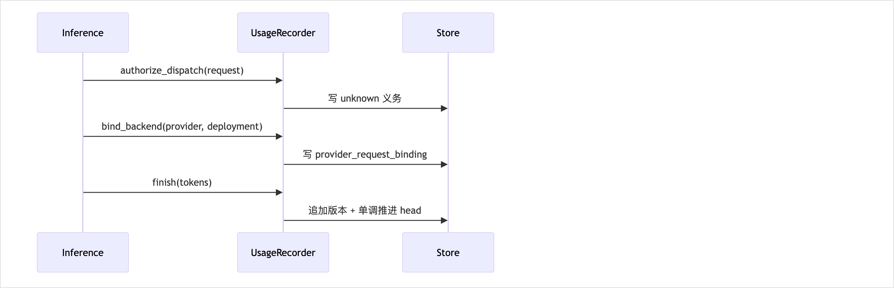

<!-- STD_DOCUMENT_COVER_BEGIN -->
# LLMTier 用量计量机制

> STD 使用入口：[项目采用说明与标准导航](../../../README.md#std-entry)

| 文档字段 | 值 |
|---|---|
| Document ID | `llmtier-usage-metering-mechanism` |
| Document Version | `0.1.0-draft.5` |
| Status | `Draft` |
| Project | `LLMTier` |
| Authority | `LLMTier` |
| Document Owner | LLMTier |
| Authors | llmtier |
| Created Date | `2026-09-22` |
| Last Modified Date | `2026-09-22` |
| Template ID | `design.system-mechanism` |
| Template Version | `2.4.0` |
| Template Conformance | `tailored` |
| Tailoring Reference | `std-tailoring` |
| Migration Map Reference | none |
| Repository | `corezilla/LLMTier` |
| Canonical Path | `docs/20_system_design/mechanisms/usage-metering.md` |
| Supersedes | none |
<!-- STD_DOCUMENT_COVER_END -->

## 1. 机制摘要：解决什么问题

一次模型调用的 token 用量必须"**不丢、不重复、可读、可对账**"，并在崩溃/写入失败下**不产生"没有调用"的假象**。

**为什么不能由一个单元独立完成**：Inference 只知"要调用"，后端只知"返回了什么"，Consumer 只该看到"自己的量"，Operator 需要"全部并可按范围清空"；计量横跨请求路径、存储事务与查询接口，是**账本型**机制。

**输入 → 处理 → 输出**：
- 输入：`(principal, request_id)` + dispatch 意图 + 后端返回的 usage
- 处理：dispatch 前登记 **unknown 义务** → 绑定最终后端 → 归一 token → **追加不可变版本并原子推进 head**
- 输出：`GET /v1/usage` 的稳定分页视图；`DELETE /v1/usage` 的范围清空

**核心取舍**：**只追加不改写** + **unknown 不补零**。宁可留一个"已调用但未测"的 unknown 事实，也绝不写成 0（0 会被误读为"没有调用"）。

## 2. 使用场景与功能

| Capability ID | 业务任务与触发 | 输入与可观察结果 | 提供方 / 消费者 | 实现状态 | 验证判据 |
|---|---|---|---|---|---|
| CAP-METER-WRITE | 每次 dispatch 前登记义务 | dispatch 前存在 unknown 记录 | Usage Recorder / Inference | Implemented | 崩溃序 fixture |
| CAP-METER-FINAL | 后端返回后写 measured | head 推进到 measured 版本 | Usage Recorder / Inference | Implemented | 契约用例 |
| CAP-METER-QUERY | Consumer 查自身用量 | 时间窗 + cursor 分页，稳定 | Management / Consumer | Implemented | 分页 snapshot 用例 |
| CAP-METER-ADMIN | Operator 查全部 | 401/403 语义，不泄露存在性 | Management / Operator | Implemented | Admin 用例 |
| CAP-METER-RESET | Operator 按 model/deployment 或全部清空 | `{deleted}` 计数 | Management / Operator | Implemented | 清空范围用例 |
| CAP-METER-SNAPSHOT | 分页期间冻结成员 | 旧页不受后续更正影响 | Management / Consumer | Implemented | snapshot 序列 fixture |

**不提供**：Cost/金额、业务任务汇总、自动对账、跨 principal 聚合。

## 3. 参与方、责任和 authority

### 3.1 系统约束与参与方承接

本机制为顶层机制（上级 Mechanism ID = none），约束继承自系统设计 §3 与 §3.4。

| Constraint ID | 约束 | 参与方保证 | 自由度 | 本文落实位置 |
|---|---|---|---|---|
| C-METER-1 | 账本只追加不改写，同 request 只留最新版本 | Usage Recorder | 存储布局 | §4.1、§8 |
| C-METER-2 | 未知不补零（unknown ≠ 0）| Usage Recorder | 归一实现 | §4.1、§7 |
| C-METER-3 | dispatch 前先持久义务，失败则不 dispatch | Inference | 事务边界 | §6、§9 |
| C-METER-4 | 查询稳定分页（snapshot 冻结）| Management | 分页实现 | §6、§10 |
| C-METER-5 | 存储不可用显式 503，不用空页冒充 | Management | 错误映射 | §7、§9 |

### 3.2 运行时统筹与确认责任

写入由**请求路径**在事务内完成（Inference 触发，Usage Recorder 执行）；读取/清空由 Management 面负责。head 的推进是"确认"，且只能单调向前。

### 3.3 拓扑、目标身份与共享故障域

单节点 SQLite（唯一持久化由 `util` 承担）。记录身份为 `(principal_id, request_id)`；不使用 Agent/Run/Project/SourceInstance。存储不可用为独立故障域，**不得**降级为"无记录"。

## 4. 数据结构设计

### 4.1 类型目录与完整字段

> 数据定义分支：**已有机器源**（见下表“机器源”列）；正文只给阅读视图与差异，不另抄完整规范。

| 表 | 用途 | 关键字段 | 生命周期 |
|---|---|---|---|
| `usage_obligations` | dispatch 前登记"已发生" | `(principal_id, request_id)` 主键、model、endpoint、记录/更新时间 | 与记录同寿 |
| `usage_record_versions` | **不可变**版本事实 | 版本、`is_final`、model、endpoint、`recorded_at`/`updated_at`、`measurement_status`、`source`、input/output/total、cached_input、cache_write、reasoning | 只追加 |
| `usage_heads` | 当前版本指针 | `(principal_id, request_id)` → `head_record_version`、`updated_at` | 单调推进 |
| `provider_request_bindings` | 最终 provider/deployment | `(principal_id, request_id)` → provider_id、deployment_id | `ON CONFLICT DO NOTHING` |
| `query_snapshots` / `query_snapshot_items` | 分页冻结 | snapshot_id、principal、filter_digest、auth、创建/过期、frozen_view_json | 有期限 |

**测量语义**：`measurement_status ∈ {unknown, measured}`；`source ∈ {unavailable, provider}`。`measured` 仅当 input/output/total **三者皆为 int**；否则整体 unknown（不写部分值）。

### 4.2 编码、布局与共享类型映射

不适用二进制 ABI：SQLite 行 + JSON（`frozen_view_json`，紧凑分隔符）。查询视图字段见 `_record()`。

### 4.3 一致性、可见性与数据寿命

同 `request_id` **只保留最高版本**，读者按版本取整条、**绝不把版本相加**。`recorded_at` 固定为首次记录时间，`updated_at` 随替换推进。snapshot 冻结后，页间更正/插入/删除只对**新** snapshot 可见。

## 5. 接口设计

### 5.1 逐操作签名、错误与调用演练

**内部操作（Inference → Usage Recorder）**：

| 操作 | 签名 | 语义 | 失败 |
|---|---|---|---|
| `authorize_dispatch` | `(principal, request_id, model, endpoint)` | 写义务 + 首个 unknown 版本（可重入，`INSERT OR IGNORE`）| 事务失败 → 不 dispatch |
| `bind_backend` | `(principal, request_id, provider_id, deployment_id)` | 记最终归属（首次为准）| 忽略冲突 |
| `finish` | `(principal, request_id, usage)` | 追加版本并推进 head | 无义务则 no-op；不影响已返回结果 |

**对外操作（Management 面）**：

| 项 | `GET /v1/usage` | `DELETE /v1/usage` |
|---|---|---|
| 身份 | consumer 自身 / operator 全部 | operator |
| 参数 | `from`,`to`（`[from,to)`）、`model`、`request_id`、`limit`、`cursor` | `model`、`deployment_id` |
| 成功 | `{data,next_cursor,has_more,snapshot_id,snapshot_at}` | `{deleted}` |
| 错误 | 400 `invalid_request`（时间窗/cursor 不符）、400 `cursor_expired`、403 `permission_denied`（他人 cursor）、503 `usage_store_unavailable` | 403；503 |
| 幂等 | 只读 | 幂等（重复清空 deleted=0）|

**调用演练**：Inference 调 `authorize_dispatch("piko","req_1","Worker","/v1/responses")` → `bind_backend("piko","req_1","prov_local","dep_local_gemma")` → 后端返回 `{input:2,output:1,total:3}` → `finish(..., usage)` → head=2、`measurement_status=measured`。之后 `GET /v1/usage?from=…&to=…` 返回该 request 的 **v2**（非 v1+v2）。

## 6. 正常端到端流程

[可编辑 SVG 源](../../assets/diagrams/diagram-mech-meter-sequence.svg)

图 M · 用量计量时序（实线=请求，虚线=响应；先后关系非时间比例）。

1. **登记义务**：dispatch 前写 `usage_obligations` + v1 `unknown/unavailable`（C-METER-3）。
2. **绑定后端**：准入选定候选后写 `provider_request_bindings`。
3. **归一**：后端返回 → 判定 `measured`（三 token 皆 int）→ 追加 v(n+1) → 推进 head。
4. **查询（首屏）**：同一事务创建 `query_snapshots` + 固化有序成员 `(principal, request_id, record_version)`。
5. **查询（后续页）**：按 `sid:offset` 读冻结项；`(recorded_at, request_id)` 稳定排序。
6. **清空**：按 model/deployment/全部范围删义务+版本+head+绑定。

### 6.1 交叠请求、跨轮次与生命周期边界

一条记录 = 一个生命周期（义务→绑定→终态）。**交叠**：同 request 的并发 `finish` 由单事务推进 head（§10）；分页期间的新写入只对新 snapshot 可见（§4.3）；`finish` 与查询并发不互相阻塞（读快照）。

## 7. 分支和替代流程

| 分支 | 触发 | 处理 |
|---|---|---|
| 后端失败/无 usage | 返回值非 int 或缺失 | `unknown/unavailable`；**成功结果不改判为失败**，但保留 unknown 事实 |
| 存储不可用 | 写/读失败 | 写：不 dispatch；读：503（**不返回空页**）|
| cursor 过期 | snapshot 超 10 分钟 | 400 `cursor_expired` |
| cursor 跨 principal | 非 admin 用他人 cursor | 403 `permission_denied` |
| filter 不符 | cursor 的 filter_digest 不一致 | 400 `invalid_request` |
| 清空范围 | model / deployment / 全部 | 删除对应义务+版本+head+绑定 |

## 8. 状态机与不变量

| INV-ID | 可验证断言（量词、条件和预期必须明确） | Enforcement / 事实来源 | 反例输入/违反后的结果 | 验证项 |
|---|---|---|---|---|
| INV-1 | ∀ 记录：`usage_record_versions` 只追加，`(principal, request_id, record_version)` 唯一 | 单事务插入 + 主键 | 覆盖旧版本 → 不可复现的对账 | T-MET-FINAL |
| INV-2 | ∀ 记录：`head_record_version` 单调不减，且 = 当前最高版本 | `finish` 单事务 `UPDATE` | head 回退 → 读到旧事实 | T-MET-FINAL |
| INV-3 | ∀ 读取：同 request 只取 head 指向的单条版本，**不累加** | `page` join head | 版本相加 → 重复计量 | T-MET-FINAL |
| INV-4 | ∀ 记录：`is_final=true` 后不得降级或改小版本 | 版本只增 | 终态被改 → 对账漂移 | T-MET-CRASH |
| INV-5 | ∀ 未测记录：`measurement_status=unknown` 时 token 字段为 NULL（**≠ 0**）| 归一判定（§4.1）| 未测填 0 → 误报"没有调用" | T-MET-UNKNOWN |
| INV-6 | ∀ 记录：`recorded_at` 跨版本不变，`updated_at` 随版本推进 | `finish` 保留 `recorded_at` | 时间漂移 → 排序错乱 | T-MET-PAGE |

### 8.1 资源预留、交付、释放与复位

**预留 = unknown 义务**（dispatch 前落库，崩溃后仍存在）；**交付 = 终态版本 + head**；**复位 = `DELETE /v1/usage`**（管理动作 + 审计）。无租约、TTL 只作用于查询 snapshot。

## 9. 失败传播、重试与恢复

| Failure ID / 检测方 | 失败点与传播 | 结果已知性 | 已发生/可能副作用 | 访问安全/证据 | 操作终态 | 资源释放 | 重新准入/重试条件 |
|---|---|---|---|---|---|---|---|
| F-MET-1 / Usage Recorder | 义务写入失败 | 已知失败 | 无 | 无 | **不 dispatch** | 无预留 | 请求失败；修正后重试 |
| F-MET-2 / Usage Recorder | terminal 后 `finish` 写入失败 | 结果已返回 | 已返回结果不改判 | 义务证据在库 | head 停留 | 无 | 保留 unknown，重启可见 |
| F-MET-3 / Store | 查询存储不可用 | 已知失败 | 无 | 无 | 503 | 无 | 稍后重试 |
| F-MET-4 / 崩溃 | 义务在、终态缺 | **未知** | 无 | 义务即证据 | 重启后仍为 unknown | 无 | 不回填为 0 |

**恢复边界**：重启以 SQLite 事实为准；**不得**把"已发生但计量缺失"误报为"没有调用"。

## 10. 并发、排序与容量

| 作用域 | 约束 | 上限/行为 |
|---|---|---|
| 同 request 写 | 单事务推进 head | 无竞争丢失 |
| 分页 | snapshot 冻结 + cursor | TTL 10 分钟（覆盖一次正常分页）|
| 排序 | `(recorded_at, request_id)` | 稳定、可续 |
| 清空 | 单事务 | 与查询互不阻塞（快照读）|

## 11. 安全、权限与信任边界

| 资产 | 身份 | 强制点 | 拒绝 | 审计 |
|---|---|---|---|---|
| 自身用量 | consumer 凭据 | `page(admin=False)` 过滤 principal | 403（他人 cursor）| — |
| 全部用量 | operator 凭据 | `page(admin=True)` | 401/403 | — |
| 清空 | operator | `DELETE /v1/usage` | 403 | 审计 |

边界：consumer 只见自身；不记录 Cost/金额；用量不含 Secret/prompt 正文。

## 12. 可观测性与证据

### 12.1 统计、日志、时间与关联

用量事实即**对账证据**；与 M-OBS 的数据面统计**不同**（后者是观测、可丢，前者是账本、不可补零）。时间统一 UTC ISO8601（毫秒、`Z`）。

### 12.2 维护命令、自检与调试路径

| Maintenance API / Command / Diagnostic ID | 执行位置、入口、目标、权限 | 完整请求/语法与结果/错误契约 | 施加/回读点及覆盖 | 依赖/占用/恢复退出 | 验证 |
|---|---|---|---|---|---|
| 查用量 `GET /v1/usage` | LLMTier 管理面；consumer/operator | 参数 = `from,to,model,request_id,limit,cursor`；结果 = 分页视图；错误 400/403/503 | 只读查询 | 无 | T-MET-PAGE |
| 清空 `DELETE /v1/usage` | LLMTier 管理面；operator | 参数 = `model,deployment_id`；结果 = `{deleted}`；错误 403/503 | 施加=范围删除；回读=计数 | 单事务；不可回滚 | T-MET-RESET |
| 孤儿清理 `reset_usage`（管理动作）| 同上 | 一并清 obligations/bindings | 施加=范围 | 依赖 `util` 事务 | T-MET-RESET |

## 13. 配置、兼容与部署

存储为 SQLite 单文件（`util` 唯一持久化）；snapshot TTL（10 分钟）为配置项，须覆盖一次正常分页耗时。清空为管理动作，变更需审计。保留期策略按运维配置。

## 14. 跨责任单元分解与接口分配（下级设计输入）

本章是**要求侧**：把本机制分解到各责任单元（LLMTier 为纯软件，责任单元 = 软件模块），说明每个对象必须负责什么、提供什么接口。下级模块设计在附录"机制承接表"逐条记录**落实侧**。

### 14.1 参与方到架构对象映射

| 机制参与方（§3） | 责任单元/Owner | 架构对象 ID / 类型 / 层或领域 | 下级设计文档 | 在本机制中的主责与非职责 |
|---|---|---|---|---|
| 计量写入 | Inference / LLMTier | Usage Recorder（业务层）| `llmtier-core-design.md` | 义务/绑定/终态、unknown；不含 Cost |
| 查询/清空 | Management / LLMTier | Usage Reader、Admin（业务层）| `llmtier-core-design.md` | 分页、清空、授权；不承载推理 |
| 入口 | HTTP API / LLMTier | HTTP Adapter（入口层）| `llmtier-core-design.md` | `/v1/usage` 路由、错误映射；不含业务规则 |
| 存储 | LLMTier | Store（基础层）| `llmtier-core-design.md` | 事务、快照表 |

### 14.2 功能和步骤到责任单元分配

| Capability / Process Step / Constraint | 主责架构对象 | 协作对象 | 必须产生或消费的结果 | 固定行为 / 本地自由度 | 组合验证责任 |
|---|---|---|---|---|---|
| Step 1 登记义务（C-METER-3）| Usage Recorder | — | v1 unknown | 未测不补零固定；存储可自定 | 系统用例 |
| Step 2 绑定后端 | Usage Recorder | Internal Admission（触发）| binding | 首次为准固定 | 系统用例 |
| Step 3 归一与推进 head（C-METER-1）| Usage Recorder | — | 终态版本 + head | head 单调固定；归一实现可自定 | 系统用例 |
| Step 4 查询首屏（C-METER-4）| Usage Reader | Store | snapshot + 冻结项 | 排序 `(recorded_at,request_id)` 固定 | T-MET-PAGE |
| Step 5 后续页 | Usage Reader | Store | 冻结视图 | cursor 实现可自定 | T-MET-PAGE |
| Step 6 清空 | Admin | Store、Audit Writer | `{deleted}` + 审计 | 范围语义固定 | T-MET-RESET |

### 14.3 责任单元间接口契约

| 接口成员 ID / 固定 baseline | 提供对象 | 全部消费对象 | 调用/事件形态 | 本机制固定的语义与错误 | 期限/取消/重复及边界 |
|---|---|---|---|---|---|
| `authorize_dispatch` / `bind_backend` / `finish` | Usage Recorder | Inference 编排 | 函数 | 义务/绑定/终态 | 见 §9 |
| `page(principal, cursor, …, admin)` | Usage Reader | HTTP Adapter | 函数 | 冻结分页视图 | 400/403/503 |
| `reset_usage(model, deployment_id)` | Admin | HTTP Adapter | 函数 | 范围清空计数 | — |
| `transaction(True)` | `util` Store | Usage Recorder/Reader | 上下文 | 原子提交 | 存储错误 |

### 14.4 下级设计输入清单

| 下级要求 ID | 承接对象 ID / 下级设计文档 | 来源 Capability / Step / Constraint / 接口成员 | 必须负责的行为与保证 | 必须提供/消费的接口 | 下级必须展开的问题 | 允许自行决定的范围 | 本地验证 / 组合验证交接 |
|---|---|---|---|---|---|---|---|
| R-MET-01 | Usage Recorder · `llmtier-core-design.md` | C-METER-1/2/3、Step 1/2/3/9、interface `authorize_dispatch/bind_backend/finish` | 只追加版本、head 单调、unknown 不补零 | `authorize_dispatch`/`bind_backend`/`finish` | 事务边界、并发写、归一 | 存储实现 | 系统用例 |
| R-MET-02 | Usage Reader · `llmtier-core-design.md` | C-METER-4、Step 4/5、interface `page` | snapshot 冻结分页、权限每页复核 | `page()` | cursor 结构、TTL、排序 | 分页实现 | T-MET-PAGE |
| R-MET-03 | Admin · `llmtier-core-design.md` | CAP-METER-RESET、Step 6、interface `reset_usage` | 范围清空 + 审计 | `reset_usage()` | 范围语义、孤儿清理 | 范围实现 | T-MET-RESET |
| R-MET-04 | HTTP Adapter · `llmtier-core-design.md` | C-METER-5、`/v1/usage` | 路由与错误映射 | 路由 | 503 显式化 | 映射实现 | 503 用例 |

**约束**：下游不得改变"只追加/不补零"语义；新增查询维度须回写本节并关联模块设计。

## 15. 验证、上线与回滚

### 15.1 输入构造、故障控制与独立判据

| Test / Constraint | 输入与预置事实 | arm/hit/release | 独立 Oracle |
|---|---|---|---|
| T-MET-FINAL / C-METER-1..2 | 一次成功调用 | — | head=2、v2 measured、token 相等 |
| T-MET-CRASH / C-METER-3 | 断开故障注入 | — | 崩溃后存在 unknown 义务 |
| T-MET-UNKNOWN / C-METER-2 | 后端无 usage | — | `unknown` 且 token 为 NULL（非 0）|
| T-MET-PAGE / C-METER-4 | 首屏后更正记录 | — | 旧页返回冻结版本 |
| T-MET-RESET / CAP-METER-RESET | 按 model/deployment | — | `{deleted}` 与范围一致 |

### 15.2 环境部署、复位、并发隔离与自动化

本机实例 + 隔离数据库；复位 = 重建库 + 重启；并发用例核验 head 单调与查询隔离。

### 15.3 组合验收、启用与旧机制退出

见 `LT-ADR-03`（unknown 不补零）。组合验收 = Consumer 查自身 + Operator 清空联调。

## 16. 风险、未决问题与决定

| ID | 类别 | 影响 | 下一步 | 状态 |
|---|---|---|---|---|
| LT-ADR-03 | 决定 | 未知不补零；以义务保证崩溃可见 | 已采用 | 已定 |
| RISK-METER-1 | 风险 | 写放大（每请求多行）| 由单事务与保留策略约束 | 观察 |

## A. 输入基线、适用性与图文规则

- 输入：系统设计 §3.4/§8、`LT-ADR-03`、`usage.py`、`store.py`。
- 适用性：纯软件、单节点 SQLite 账本机制。§4.2（二进制 ABI）不适用；§8.1 的"预留/释放"映射为义务/清空（无租约）。
- 图：时序图（§6）表达义务→绑定→终态与冻结分页。

## B. 文档控制与修订记录

初版 `0.1.0-draft.1`；`draft.3` 补实全部章节、增模块分解与不变量。修订见 Git。
