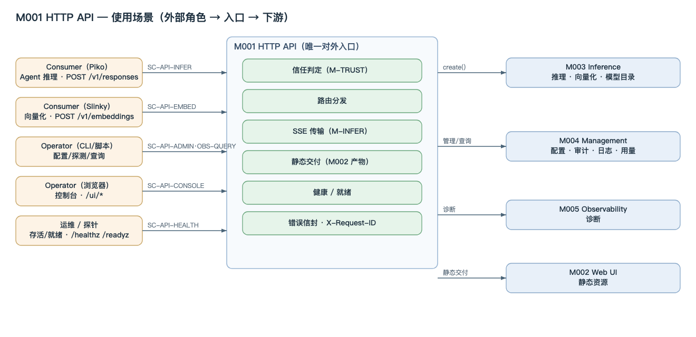
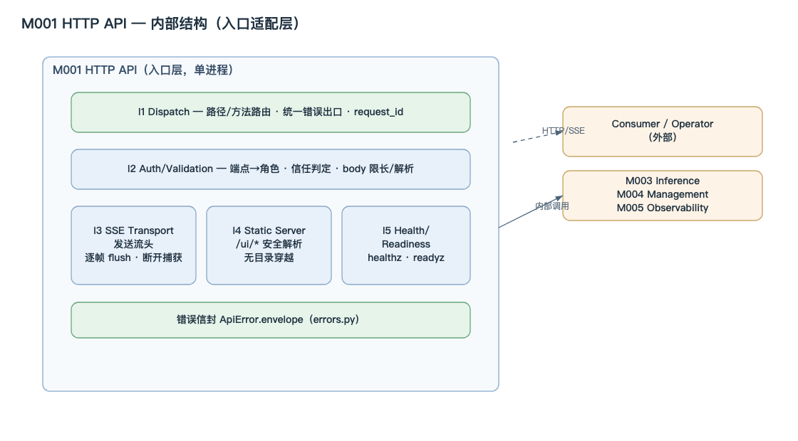
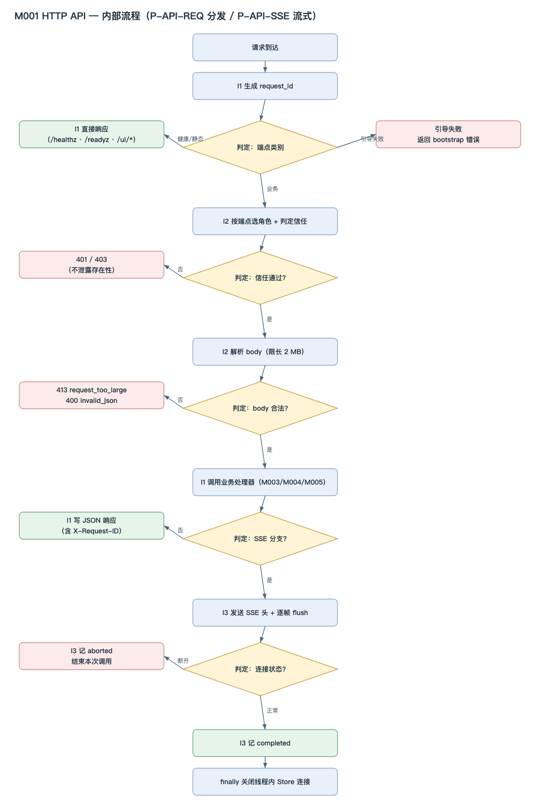

<!-- STD_DOCUMENT_COVER_BEGIN -->
# LLMTier M001 HTTP API 模块设计

> STD 使用入口：[项目采用说明与标准导航](../../README.md#std-entry)

| 文档字段 | 值 |
|---|---|
| Document ID | `http-api` |
| Document Version | `0.1.0-draft.2` |
| Status | `Draft` |
| Project | `LLMTier` |
| Authority | `LLMTier` |
| Document Owner | LLMTier |
| Authors | llmtier |
| Created Date | `2026-09-23` |
| Last Modified Date | `2026-09-25` |
| Template ID | `design.definition` |
| Template Version | `3.2.0` |
| Template Conformance | `tailored` |
| Tailoring Reference | `std-tailoring` |
| Migration Map Reference | none |
| Repository | `corezilla/LLMTier` |
| Canonical Path | `docs/40_module_design/http-api-design.md` |
| Supersedes | none |
<!-- STD_DOCUMENT_COVER_END -->

## 1. 单元摘要：为什么存在

| 项目 | 内容 |
|---|---|
| 模块编号 / 正式英文名称 | **M001** / HTTP API |
| 直属父对象编号 / 名称 | LLMTier 软件系统（本项目无子系统）|
| 父设计 Document ID / 登记位置 | `llmtier-system-design` / 系统设计 §3.2（唯一登记表）|
| 上级系统 / 父单元 | LLMTier 软件系统 |
| 解决的问题 | 提供统一的 HTTP/SSE 入口：终止连接、路由分发、局域网访问信任与请求身份，使业务模块无需各自处理传输与鉴权 |
| 提供的能力 | 全部 `/v1/*` 端点与 `text/event-stream` 流式传输；`/healthz`、`/readyz`；Web UI 静态资源；`X-Request-ID` 与关联标识透传 |
| 主要使用者 | Consumer（Piko/Slinky）、Operator（浏览器/运维脚本）；下游 M003 Inference、M004 Management、M005 Observability |
| 不负责 | 业务规则（校验/路由/计量）；持久化访问；用户/会话/SSO 体系；不下发订阅启动/重定向 |

### 1.1 继承的上级约束与落实方式

#### 1.1.1 `C-TRUST-1` · 入口单点鉴权
- **上级基线与决定状态**：机制 M-TRUST §3.1；已采用
- **适用条件**：全部端点
- **继承预算或行为保证**：判定只在入口发生一次，下游不二次校验
- **可自行选择 / 不可改变**：实现方式可自选；单点不可变
- **本地落实 / 内部再分配**：I2；§8.2、§8.3
- **验证方法与结果 / 证据**：`VRC-API-002`；NOT_RUN
- **差距 / 变更影响 / 反馈责任**：无

#### 1.1.2 `C-TRUST-2` · 不建用户/会话/SSO 体系
- **上级基线与决定状态**：机制 M-TRUST §3.1；已采用
- **适用条件**：鉴权
- **继承预算或行为保证**：凭据仅作纵深
- **可自行选择 / 不可改变**：— 
- **本地落实 / 内部再分配**：I2
- **验证方法与结果 / 证据**：`VRC-API-002`；NOT_RUN
- **差距 / 变更影响 / 反馈责任**：无

#### 1.1.3 `C-TRUST-3` · 恒定时间比较
- **上级基线与决定状态**：机制 M-TRUST §3.1；已采用
- **适用条件**：凭据校验
- **继承预算或行为保证**：`hmac.compare_digest`
- **可自行选择 / 不可改变**：实现可自选；恒定时间不可变
- **本地落实 / 内部再分配**：`auth.py`
- **验证方法与结果 / 证据**：`VRC-API-002`；NOT_RUN
- **差距 / 变更影响 / 反馈责任**：无

#### 1.1.4 `C-TRUST-4` · 401/403 不泄露存在性
- **上级基线与决定状态**：机制 M-TRUST §3.1；已采用
- **适用条件**：错误映射
- **继承预算或行为保证**：响应不可区分
- **可自行选择 / 不可改变**：—
- **本地落实 / 内部再分配**：I1 错误信封；§8.5
- **验证方法与结果 / 证据**：`VRC-API-002`；NOT_RUN
- **差距 / 变更影响 / 反馈责任**：无

#### 1.1.5 `C-TRUST-5` · 免登录仅限受信网络
- **上级基线与决定状态**：机制 M-TRUST §3.1；已采用
- **适用条件**：免登录判定
- **继承预算或行为保证**：loopback / 受信私网 / DEV
- **可自行选择 / 不可改变**：网络集合可自选；范围不可变
- **本地落实 / 内部再分配**：`auth.py` `unauthenticated_principal`
- **验证方法与结果 / 证据**：`VRC-API-002`；NOT_RUN
- **差距 / 变更影响 / 反馈责任**：无

#### 1.1.6 `C-INFER-1/2` · 标准 Responses SSE、terminal 唯一
- **上级基线与决定状态**：机制 M-INFER §3.1；已采用
- **适用条件**：`POST /v1/responses`
- **继承预算或行为保证**：只发标准事件；恰好一个 terminal
- **可自行选择 / 不可改变**：传输实现可自选；事件子集/终态不可变
- **本地落实 / 内部再分配**：I3；§5.2、§7
- **验证方法与结果 / 证据**：`VRC-API-003`；NOT_RUN
- **差距 / 变更影响 / 反馈责任**：与 M003 一致

#### 1.1.7 `C-OBS-5` · 调试能力经 Observability 暴露
- **上级基线与决定状态**：系统设计 §3.1；已采用
- **适用条件**：调试开关
- **继承预算或行为保证**：入口层不直连基础层
- **可自行选择 / 不可改变**：—
- **本地落实 / 内部再分配**：I1 经 M005；§5.5
- **验证方法与结果 / 证据**：`VRC-API-001`；NOT_RUN
- **差距 / 变更影响 / 反馈责任**：与 M005 一致

### 1.2 使用场景（谁在什么情况下用它）

M001 是 LLMTier 的**唯一对外入口**：所有外部交互都先经过它，再按端点转给业务模块。因此它的使用场景覆盖三类使用者、七类调用：



[可编辑 SVG 源](../assets/diagrams/diagram-m001-usecase.svg)

图 M001-U1 · 使用场景：5 类外部角色经 M001 进入，M001 内部做信任判定/路由/SSE/静态/健康/错误信封，再转给 M003/M004/M005 或交付 M002 产物。外部系统只在场景图中出现，不进入 M001 内部。

#### 1.1.1 SC-API-INFER · 推理
- **使用方 / 角色**：Consumer（Piko）
- **何时触发**：Agent 需要一次模型推理
- **入口**：`POST /v1/responses`（SSE）
- **可观察结果**：标准 SSE + terminal + token Usage
- **去向**：M003 Inference（机制 M-INFER）

#### 1.1.2 SC-API-EMBED · 向量化
- **使用方 / 角色**：Consumer（Slinky）
- **何时触发**：业务需要向量化
- **入口**：`POST /v1/embeddings`
- **可观察结果**：向量 + Usage
- **去向**：M003 Inference

#### 1.1.3 SC-API-SELF-USAGE · 查自身用量
- **使用方 / 角色**：Consumer
- **何时触发**：需要核对自身 token 用量
- **入口**：`GET /v1/usage`
- **可观察结果**：分页用量（仅自身）
- **去向**：M004 Management（机制 M-METER）

#### 1.1.4 SC-API-ADMIN · 管理配置与探测
- **使用方 / 角色**：Operator
- **何时触发**：维护 provider/deployment/等级、探测后端
- **入口**：`GET/POST/PATCH/DELETE /v1/providers`、`/v1/deployments`、`/v1/service-levels`、`POST /v1/probes`
- **可观察结果**：配置版本 + `ETag` / 探测结果
- **去向**：M004 Management（机制 M-CONFIG）

#### 1.1.5 SC-API-OBS-QUERY · 查询审计/日志/统计/诊断
- **使用方 / 角色**：Operator
- **何时触发**：需要证据或排障
- **入口**：`/v1/audit`、`/v1/logs`、`/v1/stats`、`/v1/runtime`、`/v1/diagnostics*`、`/v1/trace/{id}`
- **可观察结果**：视图（审计/日志/统计/快照/trace）
- **去向**：M004 / M005（机制 M-OBS）

#### 1.1.6 SC-API-HEALTH · 存活/就绪探测
- **使用方 / 角色**：运维 / 探针
- **何时触发**：存活或可接流量的探测
- **入口**：`GET /healthz`、`GET /readyz`
- **可观察结果**：健康/就绪 JSON
- **去向**：本模块

#### 1.1.7 SC-API-CONSOLE · 打开控制台
- **使用方 / 角色**：Operator（浏览器）
- **何时触发**：打开 Web 控制台
- **入口**：`GET /ui/*`
- **可观察结果**：静态资源（M002 产物）
- **去向**：本模块（交付 M002）

**共性**：所有场景都走同一条入口链——**信任判定 → 路由 → （业务请求）转发 或 （健康/静态）直接响应**。这正是 M001 存在的理由：把"传输、鉴权、请求身份、错误信封"从各业务模块中收口到一处，业务模块只需面对已认证的 `Principal` 与已解析的 body。

**场景 → 端点 → 机制**：SC-API-INFER 承载机制 M-INFER（§9 端点、§10 失败）；SC-API-ADMIN/OBS-QUERY 承载 M-CONFIG/M-METER/M-OBS；全部场景承载 M-TRUST（信任判定）。

## 2. 需求、功能与验收条件

每个功能用固定字段列出（调用方 / 输入 / 行为 / 输出 / 错误 / 验收）。来源：使用场景 §1.1 与机制 §14.4。

### 2.1 F-API-LISTEN · 启动监听服务
- **调用方**：运维
- **输入**：`host` / `port` / `database` / `settings`
- **行为**：装配 `Application`，启动 `ThreadingHTTPServer`（每请求一线程）
- **输出**：监听就绪
- **错误**：端口占用 → 启动失败
- **验收**：进程监听指定地址

### 2.2 F-API-DISPATCH · 路由分发
- **调用方**：Consumer / Operator
- **输入**：`method` + `path` + `headers` + `body`
- **行为**：健康/静态优先 → 引导拦截 → 路由匹配 → 调用业务处理器
- **输出**：分发调用
- **错误**：未命中 → 404 `not_found`
- **验收**：已知路由命中，未知路由 404

### 2.3 F-API-AUTH · 访问信任判定
- **调用方**：全部
- **输入**：`Authorization` / 客户端地址 / 端点
- **行为**：按端点选 `data`/`admin` 角色，免登录或 Bearer 判定，产出 `Principal`
- **输出**：`Principal`
- **错误**：503 `auth_not_configured` / 401 / 403
- **验收**：端点→角色映射正确；**下游不二次校验**（C-TRUST-1）

### 2.4 F-API-REQID · 请求身份
- **调用方**：全部
- **输入**：—
- **行为**：每请求生成 `req_<32hex>`，写入响应头与日志/trace
- **输出**：`X-Request-ID`
- **错误**：—
- **验收**：响应头与日志/trace 一致

### 2.5 F-API-BODY · 请求体限长与解析
- **调用方**：POST / PATCH
- **输入**：JSON body
- **行为**：限长 2 MB 后 `json.loads`
- **输出**：`dict`
- **错误**：413 `request_too_large`；400 `invalid_json`
- **验收**：超限 413；非法 JSON 或非 JSON 对象 400

### 2.6 F-API-SSE · 流式传输
- **调用方**：Consumer
- **输入**：业务 `ResponsesResponse`
- **行为**：发送 `text/event-stream`，逐帧 `flush`
- **输出**：SSE 帧 + terminal
- **错误**：客户端断开 → 结束本次调用（不抛）
- **验收**：帧序与 terminal 唯一（C-INFER-1/2）

### 2.7 F-API-STATIC · 静态资源交付
- **调用方**：Operator
- **输入**：`/ui/*` 路径
- **行为**：安全解析并返回 Web UI 静态资源
- **输出**：文件响应
- **错误**：越界/缺失 → 404
- **验收**：目录穿越被拒

### 2.8 F-API-HEALTH · 健康与就绪
- **调用方**：运维 / 探针
- **输入**：—
- **行为**：`/healthz`（存活）、`/readyz`（就绪）
- **输出**：JSON 状态
- **错误**：not ready → 503
- **验收**：引导失败时 `/readyz` 503

### 2.9 F-API-ERRMAP · 统一错误信封
- **调用方**：全部
- **输入**：`ApiError` / 未知异常
- **行为**：统一错误信封；未知异常记日志后 500
- **输出**：错误 JSON
- **错误**：—
- **验收**：所有错误走同一信封

## 3. UI、CLI 或设备操作面

本模块是服务端点，无独立 CLI/UI；对外"操作面"即 HTTP 端点集合，逐条契约见 §9。

#### S-API-V1 · `/v1/*` 业务端点
- **操作**：HTTP 调用
- **输入**：见 §9
- **正常结果**：2xx JSON / SSE
- **Empty/Error/Disabled**：见 §2 各功能错误列

#### S-API-UI · `/ui/*` 控制台静态资源
- **操作**：浏览器
- **输入**：路径
- **正常结果**：静态资源
- **Empty/Error/Disabled**：404

#### S-API-HEALTH · 健康与就绪
- **操作**：GET
- **输入**：无
- **正常结果**：健康/就绪 JSON
- **Empty/Error/Disabled**：503 not_ready

## 4. 外部边界与依赖

#### 依赖 1 · M003 Inference
- **本单元调用或消费**：消费推理 / 向量化业务接口
- **本单元提供**：转发 `/v1/responses`、`/v1/embeddings`
- **契约**：内部函数（§9）
- **timeout/失败影响**：业务错误按 `ApiError` 映射

#### 依赖 2 · M004 Management
- **本单元调用或消费**：消费管理 / 审计 / 日志 / 统计接口
- **本单元提供**：转发 `/v1/providers` 等管理面
- **契约**：内部函数
- **timeout/失败影响**：同上

#### 依赖 3 · M005 Observability
- **本单元调用或消费**：消费诊断接口与关联标识
- **本单元提供**：转发 `/v1/diagnostics`、`/v1/trace`
- **契约**：内部函数
- **timeout/失败影响**：观测 fail-open

#### 依赖 4 · Consumer（外部）
- **本单元调用或消费**：—
- **本单元提供**：`/v1/responses`、`/v1/embeddings`、SSE
- **契约**：见 OpenAPI（机器 authority）
- **timeout/失败影响**：断开 → 结束本次调用

#### 依赖 5 · Operator（外部）
- **本单元调用或消费**：—
- **本单元提供**：管理面 + `/ui/*`
- **契约**：见 OpenAPI
- **timeout/失败影响**：—

## 5. 内部结构与实现位置

### 5.1 内部组成

本模块为单进程内的入口适配层
，内部由五个组件组成；组件共享同一请求上下文（`request_id`、`Principal`、body）。



[可编辑 SVG 源](../assets/diagrams/diagram-m001-http-api-structure.svg)

图 M001-S1 · M001 内部结构：I1 Dispatch 与 I2 Auth/Validation 为公共层，I3 SSE Transport / I4 Static Server / I5 Health 为出口组件；对外是 Consumer/Operator（HTTP/SSE），对下调用 M003/M004/M005（内部函数）。

#### I1 · Dispatch
- **处理与协作**：解析 path/method、路由表匹配、调用业务处理器、统一错误出口
- **输入/输出**：`self.path` → 业务调用
- **文件/symbol**：`app.py` `Handler._dispatch`

#### I2 · Auth/Validation
- **处理与协作**：端点→角色、免登录/凭据判定、body 解析与限长
- **输入/输出**：headers/address/body → `Principal`、dict
- **文件/symbol**：`app.py` `_auth`/`_auth_either`/`_body` + `auth.py`

#### I3 · SSE Transport
- **处理与协作**：发送 SSE 头、逐帧 flush、断开捕获
- **输入/输出**：`ResponsesResponse` → 帧序列
- **文件/symbol**：`app.py`（`/v1/responses` 分支）+ `sse.py`

#### I4 · Static Server
- **处理与协作**：安全解析 `/ui/*`、返回静态文件
- **输入/输出**：路径 → 文件
- **文件/symbol**：`app.py` `_static` + `webui/`

#### I5 · Health/Readiness
- **处理与协作**：`/healthz`、`/readyz`、引导失败状态
- **输入/输出**：无 → 状态 JSON
- **文件/symbol**：`app.py` + `health.py`

图 A1（系统设计 §3.1）中 M001 的框即本模块边界；内部五个组件同进程、无线程池自建（由 `ThreadingHTTPServer` 每请求一线程提供）。请求级生命周期见 §6，主流程见 §7。

### 5.2 内部调用过程

#### 5.2.1 `CALL-API-REQ` · 一次请求的分发与调用链
- **入口与调用上下文**：`ThreadingHTTPServer` 每请求一线程 → `Handler._run`（进程内、请求线程）
- **调用链（文件 / symbol → 文件 / symbol）**：见下方调用链代码块
- **逐步传递的数据**：`self.path`/`method`/`headers` → `Principal` → body dict → 业务结果 → HTTP 响应
- **返回、异常与清理**：`ApiError` 统一信封；未知异常 500；`finally` 关闭线程内 Store 连接
- **对应流程 / 接口 / 验证**：§7 P-API-REQ / §9 端点 / `VRC-API-001..003`

```text
ThreadingHTTPServer（进程级）
 └─ Handler._run()                                # app.py：生成 self.request_id
      ├─ Handler._dispatch()                      # 路由（path/method）
      │    ├─ health_view(version)                # health.py  → dict           （/healthz）
      │    ├─ readiness_view(registry)            # health.py  → (dict, status)（/readyz）
      │    ├─ Handler._static(path)               # /ui/* 静态
      │    ├─ Handler._auth(role)                 # 端点→角色
      │    │    ├─ unauthenticated_principal(addr, headers, role)  # auth.py → Principal|None
      │    │    └─ authenticate(headers, role)                     # auth.py → Principal（否则 401/403）
      │    ├─ Handler._body()                     # 限长 2 MB → json.loads → dict（否则 413/400）
      │    ├─ diagnostics.record_trace(...)       # M005（received）
      │    ├─ ResponsesService.create(principal, request_id, body, ...)   # M003 业务
      │    ├─ response_stream(response)           # sse.py → Iterable[bytes] 逐帧
      │    └─ (except ApiError) ApiError.envelope()   # errors.py → 错误信封
      └─ finally: Store.close()                   # M007 线程内连接
```

### 5.3 文件间接口契约

> 本模块内部文件交接逐项映射到 §9 的成员定义；签名、输入输出、错误与寿命以 §9 对应记录为唯一来源，本节不再复写。

| 内部契约 ID | provider → consumer | §9 成员 | 本文件责任 | 验证 |
|---|---|---|---|---|
| `IF-1/IF-2` | `app.py` `Handler._run`/`_dispatch` 内部 | §9.1 `IF-API-DISPATCH` | 生成 `request_id` 并路由/统一错误出口 | `VRC-API-001` |
| `IF-3/IF-4/IF-8/IF-9/IF-10` | `app.py` → `auth.py` | §9.1 `IF-API-AUTH` | 端点→角色与信任判定 | `VRC-API-002` |
| `IF-5` | `app.py` `Handler._body` 内部 | §9.1 `IF-API-BODY` | 限长/解析 body | `VRC-API-003` |
| `IF-6` | `app.py` `Handler._json` 内部 | §9.1 `IF-API-JSON` | JSON 响应 + `X-Request-ID` | `VRC-API-001` |
| `IF-7` | `app.py` `Handler._static` → `webui/` | §9.1 `IF-API-STATIC` | 安全交付静态资源 | `VRC-API-004` |
| `IF-11/IF-12/IF-13` | `app.py` → `errors.py` | §9.1 `IF-API-ERROR` | typed 错误与统一信封 | `VRC-API-001` |
| `IF-14/IF-15` | `app.py` → `sse.py` | §9.1 `IF-API-SSE`（单帧函数）/ §9.2 `IF-API-SSE-STREAM`（SSE 字节流） | SSE 单帧与事件序列 | `VRC-API-003` |
| `IF-16/IF-17` | `app.py` → `health.py` | §9.1 `IF-API-HEALTH` | 健康/就绪视图 | `VRC-API-001` |
| `IF-API-EP` | Consumer/Operator → `app.py`（HTTP） | §9.1 `IF-API-RESPONSES`…`IF-API-STATIC` | 对外端点路由 | `VRC-API-001..003` |

### 5.4 HTTP 服务提供方式（服务器、线程模型与生命周期）

| 方面 | 本项目的做法 |
|---|---|
| 服务器 | Python 标准库 `http.server.ThreadingHTTPServer` + `BaseHTTPRequestHandler`（`app.py`）；**不**引入第三方 web 框架、不自建 WSGI/ASGI 栈 |
| 装配与启动 | `serve(host, port, database, settings)`：建 `Application` → `ThreadingHTTPServer((host,port), handler_factory(app))` → `serve_forever()`；`KeyboardInterrupt` → `server_close()` + `app.store.close()` |
| 处理器绑定 | `do_GET = do_POST = do_PATCH = do_DELETE = _run`；`server_version = "LLMTier/0.3"` |
| 线程模型 | `ThreadingHTTPServer` **每请求一线程**；无自建线程池/工作队列（并发上限受 OS 线程/连接数约束）|
| 连接与 fd 管理 | `Store` 按线程缓存 SQLite 连接（`threading.local`）；`Handler._run` 的 `finally` 调 `app.store.close()` 关闭**当前线程**连接，防止每请求泄漏 db/wal/shm fd（macOS 默认 256 fd 上限）|
| 请求生命周期 | `_run` 生成 `request_id` → `_dispatch` → 统一错误出口；每请求独立、无跨请求状态 |
| 绑定与安全边界 | 默认绑定 loopback / 私网；TLS **不在**进程内，生产由前置反向代理终止（系统设计 §6.3），进程由 systemd 托管 |
| 限流/超时 | 本模块不做业务限流；准入/队列/超时属 M003；本模块只做 body 限长（2 MB）与传输层读写 |

### 5.5 依赖方向

`app.py` 依赖
 `auth.py`/`errors.py`/`sse.py`/`health.py` 与业务服务；反向**不被**依赖（基础层不回调入口），符合系统设计 §3.1 的单向依赖。

## 6. 数据结构设计

> 按 STD `design-data-interface-format` 1.2.0：主章“数据结构设计”，章内按**数据性质分类**。M001 是入口适配层，拥有 HTTP 传输层结构（请求级运行状态不构成受控结构，见 §6.6），但对外的请求/响应体 machine authority 为 `interfaces/openapi/llmtier.openapi.json`。`6.5 设备与 FPGA 表项` 不适用；`6.7 数据库表结构` 不适用（本模块不写库）。继承结构只定位原定义；本层拥有的结构逐项完整记录（Data/Type ID、用途与来源／逐字段／跨字段与寿命／合法与拒绝实例／验证），每个结构以真实名称作带编号小节标题。

**适用性**：6.1 公共基础类型与枚举 ✓｜6.2 业务与操作数据结构 ✓｜6.3 配置与规则数据结构 ✓｜6.4 通信报文结构 ✓（读视图；machine authority = OpenAPI）｜6.5 设备与 FPGA 表项 ✗（无设备）｜6.6 运行状态数据结构 ✗（仅请求级标量 `request_id`，无受控跨步骤结构）｜6.7 数据库表结构 ✗（不写库，持久化归 M007）｜6.8 错误码与错误结构 ✓（引用系统 Error ID）。

### 6.1 公共基础类型与枚举

**6.1.1 `Role`（公共基础类型与枚举）**

```text
enum Role { data, admin }
```

- **Data/Type ID、用途与来源**：

  `D-TRUST-ROLE`；请求所需访问角色；来源 `src/http_api/auth.py`，映射 M-TRUST。

- **`data`**：

  数据面角色；可访问 `/v1/models`、`/v1/responses`、`/v1/embeddings`。

- **`admin`**：

  管理面角色；可访问管理/观测端点。

- **跨字段与寿命**：

  端点→角色映射由 `RULE-API-ROLE` 固定；同一请求只判定一次；无状态枚举，随 `Principal.role` 请求级存在。

- **合法/拒绝实例**：

  合法 `admin`；拒绝：data 访问管理面 → 403（不泄露存在性）。

- **验证**：

  `VRC-API-002`；`auth.py`。

### 6.2 业务与操作数据结构

**6.2.1 `Principal`（业务与操作数据结构）**

```text
Principal {
  principal_id: string,    // ≤128
  role: Role
}
```

- **Data/Type ID、用途与来源**：

  `D-PRINCIPAL`；入口信任判定的主体；来源 `src/http_api/auth.py`。

- **`principal_id`**：

  必填、非空字符串，长度 ≤128；主体标识；免登录取自受信来源（`trusted-lan-consumer` / `trusted-lan-operator`，DEV loopback 为 `loopback-consumer` / `loopback-operator`），带 Bearer 时取自 `X-Principal-ID`，缺省为 `consumer`（data）/`operator`（admin）。

- **`role`**：

  必填，取 §6.1.1 `Role`（`data`/`admin`）。

- **跨字段与寿命**：

  `@dataclass(frozen=True, slots=True)`；请求级、不落库、不落日志；下游只读消费、不二次校验（C-TRUST-1）；请求开始构造、请求结束废弃。

- **合法/拒绝实例**：

  合法 `{principal_id:"trusted-lan-consumer",role:"data"}`、`{principal_id:"loopback-consumer",role:"data"}`、`{principal_id:"operator",role:"admin"}`；拒绝：缺/非法凭据 → `ERR-AUTH-REQUIRED`/`ERR-AUTH-DENIED`，不构造。

- **验证**：

  `VRC-API-002`；`auth.py`；系统 §8.1。

**6.2.2 `ApiError` / `ErrorEnvelope`（业务与操作数据结构）**

```text
ApiError {
  status: int,
  code: string,
  message: string,
  param: string?,
  retryable: bool,
  headers: dict?,
  extra: dict?
}
ErrorEnvelope {
  error: { message, type, code, param, retryable, ... }
}
```

- **Data/Type ID、用途与来源**：

  `D-ERROR-ENVELOPE`；统一错误载体与 HTTP 错误信封；来源 `src/http_api/errors.py`，机器源 OpenAPI `ErrorEnvelope`。

- **`status`**：

  必填整数；HTTP 状态。

- **`code`**：

  必填字符串；稳定错误码。

- **`message`**：

  必填字符串；面向调用方的说明。

- **`param`**：

  可空字符串；定位字段。

- **`retryable`**：

  必填布尔；是否可安全重试。

- **`headers`**：

  可空映射；附加头（如 429 的 `Retry-After`）。

- **`extra`**：

  可空映射；附加结构化信息。

- **跨字段与寿命**：

  所有错误走同一信封；不含栈/Secret；429 可带 `Retry-After`；请求级异常对象，不持久。

- **合法/拒绝实例**：

  合法 `ApiError(404,"not_found")`；边界：未知异常 → 记 `unhandled_error` 后 500 `ERR-INTERNAL`。

- **验证**：

  `VRC-API-001`；`errors.py`；系统 §8.4 `D-ERROR-ENVELOPE`。

### 6.3 配置与规则数据结构

**6.3.1 `RequestLimits`（配置与规则数据结构）**

```text
RequestLimits {
  max_body_bytes: uint32,   // 2*1024*1024
  sse_idle_timeout_s: uint32 // 60
}
```

- **Data/Type ID、用途与来源**：

  `D-API-REQUEST-LIMITS`；入口传输层硬限制与超时；来源 `src/http_api/app.py` 常量规则。

- **`max_body_bytes`**：

  必填整数，`2*1024*1024`（2 MB）；超限 `413 ERR-REQ-TOO-LARGE`。

- **`sse_idle_timeout_s`**：

  必填整数，`60`；即 `Handler.timeout` 的套接字超时（读写均适用），对 SSE 长连接表现为 idle/传输超时；业务侧超时归 M003。

- **跨字段与寿命**：

  超限 `413`；不在此层做业务限流/队列；代码常量，随版本。

- **合法/拒绝实例**：

  合法 body ≤2 MB；拒绝 `Content-Length > 2MB` → 413。

- **验证**：

  `VRC-API-003`；`app.py`。

### 6.4 通信报文结构

**6.4.1 `SseFrame`（通信报文结构，wire authority = OpenAPI 事件子集）**

```text
SseFrame {
  event: string,
  data: json
}
// wire: event:<name>\ndata:<json>\n\n（UTF-8）
```

- **Data/Type ID、用途与来源**：

  `D-SSE-FRAME`；SSE 单帧传输单元；machine authority = OpenAPI ResponseStreamEvent 子集；来源 `src/http_api/sse.py`。

- **`event`**：

  必填字符串；事件名（子集见 OpenAPI）。

- **`data`**：

  必填 JSON；事件载荷；`response_stream` 以 terminal 事件 + `[DONE]` 结束。

- **跨字段与寿命**：

  帧序与 terminal 唯一由 M003 保证；本层只序列化与 `flush`；流式临时字节，请求结束丢弃。

- **合法/拒绝实例**：

  合法 `event: response.completed`；边界：客户端断开 → 结束本次调用（记 `aborted`）。

- **验证**：

  `VRC-API-003`；`sse.py` + OpenAPI。

### 6.6 运行状态数据结构

不适用：M001 是入口适配层，请求级状态不构成受控数据结构。`request_id` 是 `Handler._run` 在请求开始时生成、贯穿请求并在结束时废弃的标量（格式 `req_<32hex>`，写入 `X-Request-ID` 与日志/trace，见 §2.4、§7 步骤 1）；线程内 `Store` 连接的所有权与关闭归 M007（见 §5.4）。故本模块不拥有跨步骤运行状态结构。（tailoring 依据：入口适配层无自有跨请求状态。）

### 6.7 数据库表结构

不适用：本模块不写库，持久化由 M007 `util` 统一拥有（tailoring 依据：M001 只经 `Store` 连接读写，不拥有 DDL）。

### 6.8 错误码与错误结构

本模块**不新增公共错误码**；逐错误引用系统目录（`llmtier-system-design` §8.8）：

| 本层错误（HTTP） | 条件 | 系统 Error ID | 合法下一步 |
|---|---|---|---|
| 400 invalid_json | body 非合法 JSON 或非 JSON 对象 | `ERR-REQ-JSON` | 修 JSON 后重试 |
| 400 invalid_request | 字段/结构非法 | `ERR-REQ-VALIDATION` | 修 `param` 字段 |
| 400 unsupported_request / field | `stream=false` / 未知字段 | `ERR-REQ-UNSUPPORTED` / `ERR-REQ-FIELD` | 改用标准 SSE / 移除字段 |
| 413 request_too_large | body >2MB | `ERR-REQ-TOO-LARGE` | 缩小 body |
| 401/403 authentication_required / permission_denied | 缺/不足凭据 | `ERR-AUTH-REQUIRED` / `ERR-AUTH-DENIED` | 换凭据 |
| 503 auth_not_configured | 鉴权未配置 | `ERR-AUTH-NOCFG` | 完成配置 |
| 404 not_found | 未知路由/资源 | `ERR-NOTFOUND` | 修路径/ID |
| 400/409/412 由业务模块冒泡 | 管理面校验/冲突/ETag | `ERR-REQ-VALIDATION`/`ERR-CONFLICT`/`ERR-STALE`/… | 见系统 §8.8 |
| 500 internal_error | 未捕获异常 | `ERR-INTERNAL` | 上报 |

- **约束 / 不变量**：`ApiError` 直出信封；未知异常统一 500；401/403 不泄露存在性。
- **实例**：拒绝：未知路径 → 404 `ERR-NOTFOUND`；边界：未知异常 → 500 + 日志。
- **来源 / 验证**：`errors.py` + 系统 §8.8；`VRC-API-001/002/003`。

## 7. 主流程与数据流



[可编辑 SVG 源](../assets/diagrams/diagram-m001-http-api-flow.svg)

图 M001-P1 · M001 请求级内部流程：分发（P-API-REQ）与流式（P-API-SSE）在同一条入口链上，正常、拒绝、断开分支都展开。菱形判定来自 `_dispatch` 当前的路径/方法/信任/body 结果，不依赖远端等待。

**内部流程正文**：请求进入后由 **I1 Dispatch** 生成 `request_id` 并按路径分类；**健康/静态**由 I1 直接响应，**引导失败**在业务路由前拦截返回，**业务请求**交 **I2 Auth/Validation**。I2 先按端点选角色并判定信任（失败 → 401/403），再解析 body（超限 413 / 非法 400），随后回到 I1 调用业务处理器（M003/M004/M005）。业务返回后分两条路：**非 SSE** 由 I1 写 JSON 响应；**SSE** 交 **I3 SSE Transport** 发送流头并逐帧 `flush`——连接断开则记 `aborted` 结束本次调用，正常则记 `completed`。无论走到哪个出口，`finally` 都关闭线程内的 Store 连接。

#### P-API-REQ · 任意 HTTP 请求
- **触发/适用条件**：任意 HTTP 请求
- **图与正文位置**：本段 / 图 M001-P1
- **正常出口**：I1 分发并返回业务结果
- **异常出口**：`ApiError` 信封；未知异常 500；引导失败拦截

#### P-API-SSE · 流式返回
- **触发/适用条件**：`/v1/responses` 成功
- **图与正文位置**：本段 / 图 M001-P1；机制 M-INFER §6
- **正常出口**：SSE 帧 + terminal，记 `completed`
- **异常出口**：客户端断开 → 记 `aborted` 并结束

**P-API-REQ 步骤**（数据形态 / 执行上下文 / 状态变化）：

#### 步骤 1 · 生成请求身份
- **输入**：HTTP 请求
- **执行组件**：I1
- **处理/规则**：生成 `req_<hex>`
- **输出/交给谁**：`self.request_id`（贯穿全链）

#### 步骤 2 · 分类与路由
- **输入**：path/method
- **执行组件**：I1
- **处理/规则**：健康/静态优先 → 引导拦截 → 路由匹配
- **输出/交给谁**：命中分支；未命中 → 404

#### 步骤 3 · 角色与信任
- **输入**：端点
- **执行组件**：I2
- **处理/规则**：端点→角色；免登录/凭据判定
- **输出/交给谁**：`Principal`（交业务只读）

#### 步骤 4 · body 限长与解析
- **输入**：body（POST/PATCH）
- **执行组件**：I2
- **处理/规则**：限长 2 MB、JSON 解析
- **输出/交给谁**：dict（交业务只读）；413/400

#### 步骤 5 · 调用业务处理器
- **输入**：端点 + Principal + dict
- **执行组件**：I1
- **处理/规则**：调用业务处理器（M003/M004/M005）
- **输出/交给谁**：业务结果 或 `ApiError`

#### 步骤 6 · 写响应
- **输入**：结果
- **执行组件**：I1
- **处理/规则**：写响应头（`X-Request-ID` / `ETag` / 关联）与体
- **输出/交给谁**：HTTP 响应；非 SSE 出口

#### 步骤 7 · 清理连接
- **输入**：—
- **执行组件**：I1
- **处理/规则**：`finally` 关闭线程内 Store 连接
- **输出/交给谁**：fd 释放

**P-API-SSE 步骤**：Step 5 返回 `ResponsesResponse` 后，I1 发送 `Content-Type: text/event-stream` 与回显头 → I3 逐帧 `response_stream` 写出并 `flush`（帧序/terminal 唯一由 M003 保证）→ 断开捕获记 `aborted`，正常记 `completed`。SSE 的详细事件契约见机制 M-INFER §6，不在本模块重复。

## 8. 关键算法与业务规则

#### 8.1 `RULE-API-ROUTE` · 路由匹配
- **输入前提 / 适用条件**：任意请求
- **算法 / 规则 / 选择依据**：`path` 精确匹配 + 正则匹配（`/v1/models/{id}` 等）；先健康/静态 → `bootstrap_error` 拦截 → 业务路由
- **结果 / 不变量 / 边界**：无匹配 → 404 `not_found`
- **复杂度 / 资源限制**：O(路由数)
- **允许替换范围 / 不可改变保证**：匹配实现可自选；优先级不可变
- **具体输入推演 / 验证项**：未知路径 → 404；`VRC-API-001`

#### 8.2 `RULE-API-ROLE` · 端点→角色映射
- **输入前提 / 适用条件**：鉴权
- **算法 / 规则 / 选择依据**：`/v1/models`、`/v1/responses`、`/v1/embeddings` → `data`；`/v1/usage` → either（按凭据定 role）；其余管理面 → `admin`
- **结果 / 不变量 / 边界**：映射固定
- **复杂度 / 资源限制**：O(1)
- **允许替换范围 / 不可改变保证**：实现可自选；映射不可变
- **具体输入推演 / 验证项**：data 访问 admin 端点 → 403；`VRC-API-002`

#### 8.3 `RULE-API-TRUST` · 信任判定（M-TRUST）
- **输入前提 / 适用条件**：入口
- **算法 / 规则 / 选择依据**：无 `Authorization` 且地址为 loopback/受信私网（或 DEV loopback）→ 免登录；否则 Bearer 恒定时间比较
- **结果 / 不变量 / 边界**：401/403 不泄露存在性
- **复杂度 / 资源限制**：O(1)
- **允许替换范围 / 不可改变保证**：实现可自选；恒定时间不可变
- **具体输入推演 / 验证项**：受信地址免登录；`VRC-API-002`

#### 8.4 `RULE-API-STATIC` · 静态安全
- **输入前提 / 适用条件**：`/ui/*`
- **算法 / 规则 / 选择依据**：`target.resolve()` 必须落在 `webui/` 内
- **结果 / 不变量 / 边界**：越界/缺失 → 404
- **复杂度 / 资源限制**：O(1)
- **允许替换范围 / 不可改变保证**：实现可自选；越界拒绝不可变
- **具体输入推演 / 验证项**：`../` 路径 → 404；`VRC-API-004`

#### 8.5 `RULE-API-ERRMAP` · 错误信封
- **输入前提 / 适用条件**：任意错误
- **算法 / 规则 / 选择依据**：`ApiError.envelope()` → `{"error":{message,type,code,param,retryable,...}}`；未知异常记 `unhandled_error` 后 500
- **结果 / 不变量 / 边界**：所有错误走同一信封
- **复杂度 / 资源限制**：O(1)
- **允许替换范围 / 不可改变保证**：实现可自选；信封字段不可变
- **具体输入推演 / 验证项**：未知异常 → 500 + 日志；`VRC-API-001`

## 9. 接口设计

> 按 STD `design-data-interface-format` 1.2.0 §3：主章“接口设计”，按**接口设计用途**分类（面向使用方的 API 与组件/系统间协作的消息与数据流接口），逐接口完整记录；标题为真实调用形式（HTTP 路由或内部方法），标题下先给**完整接口声明**，再就地说明参数/结果字段，最后按固定六项。**函数/方法即 API**：对外 HTTP 端点与内部处理器方法（含 SSE 单帧序列化函数 `frame`）归 §9.1 API；终态响应经 `response_stream` 序列化出的 SSE 字节流是跨边界连续数据流，留在 §9.2 消息与数据流接口（端点只在 §9.1 定义一次，流格式在 §9.2）。数据结构引用 §6；对外字段 machine authority = `interfaces/openapi/llmtier.openapi.json`。

### 9.1 API（适用时）

#### `POST /v1/responses`

```text
POST /v1/responses (ResponsesRequest, stream=true) -> 200 text/event-stream (ResponsesResponse 事件子集)
```

- **Interface/Member ID、用途、提供责任与唯一来源**：`IF-API-RESPONSES`；标准模型调用（固定 `stream:true`/`store:false`，返回标准 SSE）；M001 终止 HTTP/SSE、M003 编排；状态=Implemented；唯一契约=OpenAPI；文件·symbol `app.py`（`/v1/responses` 分支）+ `sse.py` + M003 `ResponsesService.create`。
- **输入与前提**：`ResponsesRequest`（§6.2 引用 OpenAPI；本层只解析/限长/转发）；授权=`data` 角色（内网可免登录）。
- **成功输出与保证**：SSE 字节流（`SseFrame`，§6.4.1；事件/流格式见 §9.2）；terminal 唯一由 M003 保证。
- **错误与合法下一步**：400 `ERR-REQ-VALIDATION`/`ERR-REQ-UNSUPPORTED`/`ERR-REQ-FIELD`；404 `ERR-MODEL-NOTFOUND`；429 `ERR-RATE-LIMIT`；502/503 `ERR-PROVIDER-FAIL`/`ERR-PROVIDER-UNAVAIL`/`ERR-MODEL-UNAVAIL`（映射后统一信封）。
- **交互与生命周期**：SSE 长连接；断开捕获记 `aborted`、结束本次调用，不重放。
- **实现与验证**：正常固定 request → 标准 SSE + terminal；边界：断开 → `aborted`。`VRC-API-003`。

#### `POST /v1/embeddings`

```text
POST /v1/embeddings (EmbeddingRequest) -> 200 {object:"list", data:[...], usage:{...}}
```

- **Interface/Member ID、用途、提供责任与唯一来源**：`IF-API-EMBEDDINGS`；向量化；M001 终止 HTTP、M003 编排；状态=Implemented；唯一契约=OpenAPI；文件·symbol `app.py` → M003 `EmbeddingsService.create`。
- **输入与前提**：`EmbeddingRequest`（authority = OpenAPI）；授权=`data` 角色。
- **成功输出与保证**：Embeddings JSON 载荷（转发 M003）。
- **错误与合法下一步**：400 `ERR-REQ-VALIDATION`；404 `ERR-MODEL-NOTFOUND`；502/503 `ERR-PROVIDER-FAIL`/`ERR-PROVIDER-UNAVAIL`。
- **交互与生命周期**：同步请求-响应；请求级。
- **实现与验证**：正常向量返回；边界：非法维数 → 400。`VRC-API-003`。

#### `GET /v1/models` / `GET /v1/models/{id}`

```text
GET /v1/models -> 200 {object:"list", data:[ModelView]}
GET /v1/models/{id} -> 200 ModelView | 404
```

- **Interface/Member ID、用途、提供责任与唯一来源**：`IF-API-MODELS`；逻辑等级目录 / exact 能力；M001 终止 HTTP、M003 提供；状态=Implemented；唯一契约=OpenAPI；文件·symbol `app.py` → M003 `ModelCatalog`。
- **输入与前提**：可选 `{id}`（exact 等级名）；授权=`data` 角色。
- **成功输出与保证**：`ModelView{id,object,owned_by,availability,capabilities}`（转发 M003 `ModelCatalog`）。
- **错误与合法下一步**：未知 exact 名 → 404 `ERR-MODEL-NOTFOUND`。
- **交互与生命周期**：同步只读；请求级。
- **实现与验证**：正常 7 个固定 tier；边界：未知 id → 404。`VRC-API-001`。

#### `GET /v1/usage` / `DELETE /v1/usage`

```text
GET /v1/usage?from&to&model&request_id&cursor&limit -> 200 UsagePage
DELETE /v1/usage?model&deployment_id -> 200 {deleted}
```

- **Interface/Member ID、用途、提供责任与唯一来源**：`IF-API-USAGE`；用量查询 / 清空；M001 终止 HTTP、M004 提供；状态=Implemented；唯一契约=OpenAPI；文件·symbol `app.py` → M004 `usage.py`。
- **输入与前提**：`GET` 分页参数（`[from,to)`）；`DELETE` 可选范围；授权=GET `data`/either，DELETE `admin`。
- **成功输出与保证**：冻结分页 / 删除计数（转发 M004 `UsageRecorder`）。
- **错误与合法下一步**：400 `ERR-REQ-VALIDATION`/`ERR-CURSOR`；403 `ERR-AUTH-DENIED`；503 `ERR-STORE`。
- **交互与生命周期**：同步；`DELETE` 经审计；请求级。
- **实现与验证**：正常分页；边界：存储不可读 → 503（不伪装空页）。`VRC-MGMT-004`。

#### `GET /v1/audit` / `GET /v1/logs`

```text
GET /v1/audit?limit -> 200 {data,next_cursor,has_more}
GET /v1/logs?from&to&level&module&request_id&limit -> 200 {data,page}
```

- **Interface/Member ID、用途、提供责任与唯一来源**：`IF-API-RECORDS`；审计/日志查询；M001 终止 HTTP、M004/M008 提供；状态=Implemented；唯一契约=OpenAPI；文件·symbol `app.py` → M004/M008。
- **输入与前提**：`/v1/logs` 分页/过滤参数，其中 `from`/`to`（半开区间 `[from,to)`）必填；授权=`admin`。
- **成功输出与保证**：脱敏审计/日志行（转发 M004 `AuditLog` / M008 `OperationalLog`）。
- **错误与合法下一步**：400 `ERR-REQ-VALIDATION`（缺 `from`/`to`）/`ERR-CURSOR`；503 `ERR-STORE`。
- **交互与生命周期**：同步只读；请求级。
- **实现与验证**：正常列表；边界：无匹配 → `data=[]`。`VRC-MGMT-003/004`。

#### `/v1/providers`、`/v1/deployments`、`/v1/service-levels`（GET/POST/PATCH/DELETE）

```text
GET    /v1/providers[/{id}]        -> 200 entity | {data,...}
POST   /v1/providers               -> 201 entity + ETag
PATCH  /v1/providers/{id}          -> 200 entity + ETag   (If-Match)
DELETE /v1/providers/{id}          -> 204
（deployments / service-levels 同构）
```

- **Interface/Member ID、用途、提供责任与唯一来源**：`IF-API-ADMIN`；provider/deployment/service-level CRUD；M001 终止 HTTP、M004 事务化提供；状态=Implemented；唯一契约=OpenAPI；文件·symbol `app.py` → M004 `registry.py`/`admin.py`。
- **输入与前提**：路径/body/`If-Match`；授权=`admin`。
- **成功输出与保证**：配置视图 + `ETag`（转发 M004 `Registry`）。
- **错误与合法下一步**：400 `ERR-REQ-VALIDATION`；404 `ERR-NOTFOUND`；409 `ERR-CONFLICT`/`ERR-INUSE`；412 `ERR-STALE`；503 `ERR-STORE`。
- **交互与生命周期**：同步；写经 `AdminService.mutate` 审计；请求级。
- **实现与验证**：正常建 provider 201+ETag；拒绝缺 `If-Match` PATCH → 412。`VRC-MGMT-001/002`。

#### `/v1/providers/{id}/usage`、`/v1/providers/{id}/models`

```text
GET  /v1/providers/{id}/usage -> 200 AccountUsageView
POST /v1/providers/{id}/usage {confirm_external_call:true} -> 200 AccountUsageView
GET  /v1/providers/{id}/models -> 200 {data:[model_name]}
```

- **Interface/Member ID、用途、提供责任与唯一来源**：`IF-API-PROVIDER-USAGE` / `IF-API-PROVIDER-MODELS`；provider 账号用量快照读取与显式刷新、可用模型名列表；M001 终止 HTTP、M004 提供；状态=Implemented；唯一契约=OpenAPI；文件·symbol `app.py` → M004 `account_usage.py` / `AdminService.list_provider_models`。
- **输入与前提**：`{id}` provider；`POST /usage` 仅接受 body `{confirm_external_call}`（含其他键 → 400）；授权=`admin`。
- **成功输出与保证**：`AccountUsageView`（`status`/`windows`/`percent`/`error`）与 `{"data":[string]}`（转发 M004）。
- **错误与合法下一步**：400 `ERR-REQ-VALIDATION`（未知字段）；404 `ERR-NOTFOUND`；503 `ERR-STORE`。
- **交互与生命周期**：同步；`POST /usage` 经 `AdminService.mutate(..., atomic=False)` 审计并触发上游外部调用（需确认）；请求级。
- **实现与验证**：正常读取/刷新与模型列表；边界：未确认不触网、无模型 → `data=[]`。`VRC-MGMT-005`。

#### `POST /v1/probes`

```text
POST /v1/probes {deployment_id, confirm_external_call=true} -> 200 {deployment_id, status, checked_at}
```

- **Interface/Member ID、用途、提供责任与唯一来源**：`IF-API-PROBES`；部署探测；M001 终止 HTTP、M004 提供；状态=Implemented；唯一契约=OpenAPI；文件·symbol `app.py` → M004 `admin.py`/`health.py`。
- **输入与前提**：`deployment_id`、`confirm_external_call`；授权=`admin` + 二次确认。
- **成功输出与保证**：探测结果并落库 health（转发 M004 `AdminService.probe`）。
- **错误与合法下一步**：缺确认 → 400 `ERR-CONFIRM`；未知 deployment → 404 `ERR-NOTFOUND`。
- **交互与生命周期**：同步；5 s 上游超时；请求级。
- **实现与验证**：正常 `healthy/unhealthy`；边界：未确认 → 400。`VRC-MGMT-005`。

#### `GET /v1/runtime` / `GET /v1/stats`

```text
GET /v1/runtime -> 200 RuntimeView
GET /v1/stats?from&to&group_by=tier|deployment -> 200 {from,to,group_by,data:[...]}
```

- **Interface/Member ID、用途、提供责任与唯一来源**：`IF-API-RUNTIME`；运行时状态 / 聚合统计；M001 终止 HTTP、M003/M004 提供；状态=Implemented；唯一契约=OpenAPI；文件·symbol `app.py` → M004。
- **输入与前提**：`stats` 时间窗与 `group_by`；授权=`admin`。
- **成功输出与保证**：运行时状态 / 聚合统计（转发 M004 `AdminService`）。
- **错误与合法下一步**：400 `ERR-REQ-VALIDATION`；503 `ERR-STORE`。
- **交互与生命周期**：同步只读；请求级。
- **实现与验证**：正常聚合；边界：非法 `group_by` → 400。`VRC-MGMT-006`。

#### `/v1/diagnostics*`、`/v1/trace/{request_id}`（诊断族）

```text
GET/PATCH /v1/diagnostics
GET /v1/diagnostics/snapshots
GET /v1/diagnostics/stats
GET /v1/diagnostics/traces
GET/PATCH /v1/deployments/{id}/diagnostics
GET /v1/trace/{request_id}
```

- **Interface/Member ID、用途、提供责任与唯一来源**：`IF-API-DIAGNOSTICS`；诊断查询/切换（含快照、统计、trace 列表与注入）；M001 终止 HTTP、M005/M006 提供；状态=Implemented；唯一契约=M005 §9（本层只路由与错误映射）；文件·symbol `app.py` → M005/M006。
- **输入与前提**：见 M005 §9（快照/统计/trace 使用 `since`/`until`）；授权=`admin`。
- **成功输出与保证**：见 M005 §9；本层只路由与错误映射。
- **错误与合法下一步**：400 `ERR-REQ-VALIDATION`/`ERR-INJECTION`；404 `ERR-NOTFOUND`；503 `ERR-STORE`。
- **交互与生命周期**：同步；写经审计；请求级。
- **实现与验证**：正常查询/切换；边界：开关关闭零写入。`VRC-OBS-001..005`。

#### `/tier/admin/v1/*`（契约别名命名空间）

```text
GET/PATCH /tier/admin/v1/diagnostics
GET /tier/admin/v1/diagnostics/snapshots
GET /tier/admin/v1/diagnostics/stats
GET /tier/admin/v1/diagnostics/traces
GET/PATCH /tier/admin/v1/deployments/{id}/diagnostics
GET /tier/admin/v1/trace/{request_id}
```

- **Interface/Member ID、用途、提供责任与唯一来源**：`IF-API-CONTRACT-ALIAS`；与 `/v1/*` 扁平命名空间并存的契约层别名（`llmtier-management-contract-v0.3` 诊断子集）；M001 提供、M005/M006 提供；状态=Implemented；唯一契约=管理契约；文件·symbol `app.py`（`/tier/admin/v1/*` 分支）。
- **输入与前提**：与对应 `/v1/*` 诊断端点同参数；授权=`admin`（先经 `/v1` 路由前的统一鉴权）。
- **成功输出与保证**：与 `/v1/*` 诊断端点逐字一致；仅路径前缀不同（同一处理与存储）。
- **错误与合法下一步**：同诊断族：400 `ERR-REQ-VALIDATION`/`ERR-INJECTION`；404 `ERR-NOTFOUND`；503 `ERR-STORE`。
- **交互与生命周期**：同步；写经审计；请求级。
- **实现与验证**：两命名空间在已实现子集上等价；当前仅诊断/追踪别名已实现（管理契约其余资源路由未在本层实现 → 404）；边界：未知别名 → 404。`VRC-OBS-001..005`。

#### `GET /healthz` / `GET /readyz`

```text
GET /healthz -> 200 {"status":"ok","version":...}
GET /readyz  -> 200 readiness JSON | 503 not_ready
```

- **Interface/Member ID、用途、提供责任与唯一来源**：`IF-API-HEALTH`；存活/就绪；M001 提供；状态=Implemented；唯一契约=OpenAPI；文件·symbol `app.py` + `health.py`。
- **输入与前提**：无参数、无凭据。
- **成功输出与保证**：健康/就绪 JSON（`health_view`/`readiness_view`）。
- **错误与合法下一步**：引导失败 → `/readyz` 503 `ERR-BOOT`/`ERR-SCHEMA`。
- **交互与生命周期**：同步只读；幂等；探针周期调用。
- **实现与验证**：正常 200；边界：空库无 settings → 503。`VRC-API-001`。

#### `GET /ui/*`（控制台静态资源）

```text
GET /ui/* -> 200 静态资源 | 404
```

- **Interface/Member ID、用途、提供责任与唯一来源**：`IF-API-STATIC`；静态资源交付；M001 提供；状态=Implemented；唯一契约=本设计；文件·symbol `app.py` `_static` + `webui/`。
- **输入与前提**：路径。
- **成功输出与保证**：`webui/` 内文件；`target.resolve()` 必须落在 `webui/`。
- **错误与合法下一步**：越界/缺失 → 404 `ERR-NOTFOUND`。
- **交互与生命周期**：同步；请求级；`Cache-Control: no-store`。
- **实现与验证**：正常交付；边界：`../` → 404。`VRC-API-004`。

#### `Handler._run() -> None` / `Handler._dispatch() -> None`

```text
_run() -> None
_dispatch() -> None
```

- **Interface/Member ID、用途、提供责任与唯一来源**：`IF-API-DISPATCH`；请求分发与统一错误出口；M001 提供；状态=Implemented；唯一契约=本设计；文件·symbol `app.py` `Handler._run/_dispatch`。
- **输入与前提**：`self.path`/`self.command`/`self.headers`。
- **成功输出与保证**：写响应；统一错误出口。
- **错误与合法下一步**：可抛 `ApiError`（由 `_run` 统一信封）；未知路径 → 404。
- **交互与生命周期**：每请求一线程；`finally` 关闭线程内 `Store` 连接。
- **实现与验证**：正常分发；边界：未知路径 → 404。`VRC-API-001`；`app.py`。

#### `Handler._auth(role="data") -> Principal` / `_auth_either() -> tuple[Principal,bool]`

```text
_auth(role: str = "data") -> Principal
_auth_either() -> tuple[Principal, bool]
```

- **Interface/Member ID、用途、提供责任与唯一来源**：`IF-API-AUTH`；入口信任判定；M001 提供；状态=Implemented；唯一契约=本设计；文件·symbol `app.py` + `auth.py` `unauthenticated_principal/authenticate/authenticate_any`。
- **输入与前提**：headers、client_address、端点角色。
- **成功输出与保证**：`Principal`（§6.2.1）/ `(Principal,is_admin)`。
- **错误与合法下一步**：503 `ERR-AUTH-NOCFG`；401 `ERR-AUTH-REQUIRED`；403 `ERR-AUTH-DENIED`（不泄露存在性）。
- **交互与生命周期**：同步；每请求一次；恒定时间比较。
- **实现与验证**：正常受信地址免登录/凭据判定；边界：data 访问 admin → 403。`VRC-API-002`。

#### `Handler._body() -> dict`

```text
_body() -> dict
```

- **Interface/Member ID、用途、提供责任与唯一来源**：`IF-API-BODY`；请求体限长与解析；M001 提供；状态=Implemented；唯一契约=本设计；文件·symbol `app.py` `Handler._body`。
- **输入与前提**：request body；仅 POST/PATCH 调用。
- **成功输出与保证**：`dict`（只读交接业务）。
- **错误与合法下一步**：超限 413 `ERR-REQ-TOO-LARGE`；非法 JSON 或非 JSON 对象 400 `ERR-REQ-JSON`。
- **交互与生命周期**：同步。
- **实现与验证**：正常解析；边界：>2MB → 413，顶层非对象 → 400。`VRC-API-003`。

#### `Handler._json(status, data, headers=None) -> None`

```text
_json(status: int, data, headers: dict | None = None) -> None
```

- **Interface/Member ID、用途、提供责任与唯一来源**：`IF-API-JSON`；写 JSON 响应；M001 提供；状态=Implemented；唯一契约=本设计；文件·symbol `app.py` `Handler._json`。
- **输入与前提**：状态码、载荷、附加头。
- **成功输出与保证**：写 JSON 响应 + `X-Request-ID`。
- **错误与合法下一步**：无（写失败按断开处理）。
- **交互与生命周期**：同步；每响应一次。
- **实现与验证**：正常写响应；边界：响应头含 `X-Request-ID`。`VRC-API-001`。

#### `Handler._static(path) -> None`

```text
_static(path: str) -> None
```

- **Interface/Member ID、用途、提供责任与唯一来源**：`IF-API-STATIC-INTERNAL`；写静态文件；M001 提供；状态=Implemented；唯一契约=本设计；文件·symbol `app.py` `Handler._static`。
- **输入与前提**：路径。
- **成功输出与保证**：写静态文件。
- **错误与合法下一步**：越界/缺失 → `ApiError(404,"not_found")`（`ERR-NOTFOUND`）。
- **交互与生命周期**：同步；请求级。
- **实现与验证**：正常交付；边界：目录穿越拒绝。`VRC-API-004`。

#### `ApiError` / `ApiError.envelope()` / `require(...)`

```text
ApiError(status:int, code:str, message:str, param:str|None=None, retryable:bool=False, headers:dict|None=None, extra:dict|None=None)
envelope() -> dict
require(condition: bool, status: int, code: str, message: str, param: str | None = None) -> None
```

- **Interface/Member ID、用途、提供责任与唯一来源**：`IF-API-ERROR`；错误对象与信封构造；M001 提供；状态=Implemented；唯一契约=本设计；文件·symbol `errors.py`。
- **输入与前提**：错误字段/校验条件。
- **成功输出与保证**：错误对象 / 信封 dict（§6.2.2）；`require` 不成立时抛 `ApiError`。
- **错误与合法下一步**：自身即错误类型；信封不含栈/Secret。
- **交互与生命周期**：请求级。
- **实现与验证**：正常 `envelope()` 结构；边界：未知异常 → 500。`VRC-API-001`。

#### `health_view(version) -> dict` / `readiness_view(registry) -> tuple[dict,int]`

```text
health_view(version: str) -> dict
readiness_view(registry) -> tuple[dict, int]
```

- **Interface/Member ID、用途、提供责任与唯一来源**：`IF-API-HEALTH`；构造健康/就绪视图；M001 提供；状态=Implemented；唯一契约=本设计；文件·symbol `health.py`。
- **输入与前提**：版本字符串 / Registry。
- **成功输出与保证**：`{"status":"ok","version":...}` / 就绪 JSON + HTTP 状态。
- **错误与合法下一步**：引导失败 → 503（`ERR-BOOT`/`ERR-SCHEMA`）。
- **交互与生命周期**：同步只读；幂等。
- **实现与验证**：正常 200；边界：空库 → 503。`VRC-API-001`。

#### `frame(event, data) -> bytes`

```text
frame(event: str, data: dict) -> bytes
```

- **Interface/Member ID、用途、提供责任与唯一来源**：`IF-API-SSE`；把单个 SSE 事件序列化为 SSE 帧字节；M001 提供；状态=Implemented；唯一契约=OpenAPI `ResponseStreamEvent`（`D-MSG-SSE`）；文件·symbol `src/http_api/sse.py` `frame`。
- **输入与前提**：`event: str`（事件名，取自 `ResponseStreamEvent` 子集）、`data: dict`（事件载荷）；前置=§9.1 `POST /v1/responses` 已建连。
- **成功输出与保证**：单帧字节 `bytes`（`SseFrame`，§6.4.1）——`event: <name>\ndata: <json>\n\n`；不校验事件语义。
- **错误与合法下一步**：无（纯函数，无失败条件）；写出失败由调用方按断开处理（§9.2 记 `aborted`）。
- **交互与生命周期**：同步纯函数；无状态；请求级。
- **实现与验证**：正常 `frame("response.output_text.delta", {...})` → 合法帧；边界：事件名子集由调用方保证。`VRC-API-003`；`sse.py`。

### 9.2 消息与数据流接口（适用时）

本模块拥有的跨边界流接口：终态响应经 `response_stream` 序列化为 SSE 字节流（连续数据流），供调用方增量消费。

#### `response_stream(response) -> Iterable[bytes]`

```text
response_stream(response: ResponsesResponse) -> Iterable[bytes]   # text/event-stream
```

- **Interface/Member ID、用途、提供责任与唯一来源**：`IF-API-SSE-STREAM`；把终态 `ResponsesResponse` 序列化为 SSE 字节流（系统→使用方的连续数据流）；M001 提供、M003 产出事件语义；状态=Implemented；唯一契约=OpenAPI `ResponseStreamEvent`（`D-MSG-SSE`）；文件·symbol `src/http_api/sse.py` `response_stream`（帧由 §9.1 `IF-API-SSE` 生成）。
- **输入与前提**：终态 `ResponsesResponse`（事件语义由 M003 保证）；前置=§9.1 `POST /v1/responses` 已建连；授权=已由入口完成。
- **成功输出与保证**：SSE 字节流（`SseFrame`，§6.4.1）——事件名子集，帧格式 `event: <name>\ndata: <json>\n\n`；每 output item 稳定 `id`；`sequence_number` 自 0 递增；一个 terminal + `[DONE]`。
- **错误与合法下一步**：客户端断开 → `BrokenPipeError`/`ConnectionResetError` → 结束本次调用（§9.1 记 `aborted`）；结果可能已部分送达、可能未知；不重传、不重放。
- **交互与生命周期**：顺序=单请求内严格有序；无背压到推理结果；断开即终止；流式临时字节，请求结束丢弃。
- **实现与验证**：正常完整流以 terminal 结束；边界：命中 `stream_terminate` → 提前结束。`VRC-API-003`；`sse.py`。

### 9.3 硬件与固件接口（适用时）

不适用（无连接器/总线/寄存器/FPGA 端口）。

### 9.4 人机与维护接口（适用时）

不适用（`/ui/*` 只是静态资源交付，见 `IF-API-STATIC`；控制台交互归 M002）。

## 10. 并发、失败与恢复

#### 10.1 并发请求
- **并发/失败点**：每请求一线程
- **检测**：—
- **行为**：各请求独立；共享 `Application` 只读引用
- **幂等/重试**：无状态
- **最终状态**：正常

#### 10.2 客户端断开（SSE）
- **并发/失败点**：写失败
- **检测**：`BrokenPipeError` / `ConnectionResetError`
- **行为**：记 `aborted`，结束本次调用
- **幂等/重试**：不重放
- **最终状态**：结束

#### 10.3 请求体超限
- **并发/失败点**：请求处理
- **检测**：`Content-Length > 2MB`
- **行为**：413 `request_too_large`
- **幂等/重试**：可重试（改小）
- **最终状态**：拒绝

#### 10.4 未知异常
- **并发/失败点**：处理中
- **检测**：`except Exception`
- **行为**：记 `unhandled_error` 日志后 500
- **幂等/重试**：由调用方决定
- **最终状态**：500

#### 10.5 连接泄漏
- **并发/失败点**：线程结束
- **检测**：`finally`
- **行为**：关闭线程内 Store 连接
- **幂等/重试**：—
- **最终状态**：fd 释放

#### 10.6 引导失败
- **并发/失败点**：任意 `/v1/*`
- **检测**：`bootstrap_error`
- **行为**：返回引导错误（`/healthz`、`/readyz`、`/ui/*` 除外）
- **幂等/重试**：—
- **最终状态**：503 等

## 11. 安全、权限与可观测性

- **入口单点鉴权**（M-TRUST C-TRUST-1）：本模块是唯一判定点；下游只消费 `Principal`。
- **不泄露存在性**（INV-3）：401/403 语义统一。
- **观测**（M-OBS）：每请求 `X-Request-ID`；接收并回显 `X-Correlation-ID`/`traceparent`；`/v1/responses` 分支写 `received`/`aborted`/`completed` trace。
- 不记录凭据/body 正文；`log_message` 走脱敏日志（M008）。

## 12. 容量、性能与运行限制

#### 12.1 `CAP-API-BODY` · 请求体
- **目标 / 限制 / 单位**：≤ 2 MB
- **适用版本 / 配置 / 硬件 / 虚拟化 / 依赖**：HTTP 层
- **负载、数据规模与并发口径**：单请求
- **推导 / 测量方法与证据等级**：Specified
- **共享资源扣减 / 峰值重叠 / 余量**：—
- **超限行为 / 责任出口**：413
- **验证项 / Evidence**：`VRC-API-003`；NOT_RUN

#### 12.2 `CAP-API-CONC` · 并发
- **目标 / 限制 / 单位**：线程 / 请求
- **适用版本 / 配置 / 硬件 / 虚拟化 / 依赖**：`ThreadingHTTPServer`
- **负载、数据规模与并发口径**：局域网并发请求
- **推导 / 测量方法与证据等级**：Specified
- **共享资源扣减 / 峰值重叠 / 余量**：OS 线程上限
- **超限行为 / 责任出口**：OS 层拒绝
- **验证项 / Evidence**：`VRC-API-001`；NOT_RUN

#### 12.3 `CAP-API-SSE` · SSE 空闲超时
- **目标 / 限制 / 单位**：60 s
- **适用版本 / 配置 / 硬件 / 虚拟化 / 依赖**：业务侧 M003 规定
- **负载、数据规模与并发口径**：单流
- **推导 / 测量方法与证据等级**：Specified
- **共享资源扣减 / 峰值重叠 / 余量**：—
- **超限行为 / 责任出口**：结束本次调用
- **验证项 / Evidence**：`VRC-API-003`；NOT_RUN

#### 12.4 `CAP-API-FD` · 每请求 fd
- **目标 / 限制 / 单位**：每请求 ≤ 1 线程内 Store 连接，`finally` 关闭
- **适用版本 / 配置 / 硬件 / 虚拟化 / 依赖**：`Store`（M007）
- **负载、数据规模与并发口径**：持续请求
- **推导 / 测量方法与证据等级**：Measured（连接泄漏修复）
- **共享资源扣减 / 峰值重叠 / 余量**：OS fd 上限（macOS 256）
- **超限行为 / 责任出口**：`finally` 关闭兜底
- **验证项 / Evidence**：`VRC-API-001`；NOT_RUN

## 13. 实现步骤与文件清单

### 13.1 文件分解（设计 → 代码文件）

#### 13.1.1 `src/http_api/app.py`
- **职责（本模块内）**：I1 Dispatch、I2 Auth 分发、I3 SSE 传输、I4 静态、I5 健康；`Application` 装配
- **关键 symbol**：`Application`、`handler_factory`、`Handler._run/_dispatch/_auth/_auth_either/_body/_json/_static`
- **实现状态**：Implemented

#### 13.1.2 `src/http_api/auth.py`
- **职责（本模块内）**：信任判定（免登录 / Bearer），产出 `Principal`
- **关键 symbol**：`Principal`、`unauthenticated_principal`、`authenticate`、`authenticate_any`
- **实现状态**：Implemented

#### 13.1.3 `src/http_api/errors.py`
- **职责（本模块内）**：统一错误类型与错误信封
- **关键 symbol**：`ApiError`、`require`
- **实现状态**：Implemented

#### 13.1.4 `src/http_api/sse.py`
- **职责（本模块内）**：SSE 单帧与事件序列
- **关键 symbol**：`frame`、`response_stream`
- **实现状态**：Implemented

#### 13.1.5 `src/http_api/health.py`
- **职责（本模块内）**：健康/就绪视图
- **关键 symbol**：`health_view`、`readiness_view`
- **实现状态**：Implemented

#### 13.1.6 `src/web_ui/`
- **职责（本模块内）**：静态资源位（由 M002 提供；M001 只交付）
- **关键 symbol**：—
- **实现状态**：Implemented

### 13.2 实现步骤

#### 13.2.1 路由与分发
- **新增/修改文件**：`src/http_api/app.py`
- **关键 symbol**：`Handler._dispatch`
- **前置依赖**：业务服务实例
- **完成条件**：全部端点可达

#### 13.2.2 鉴权分发
- **新增/修改文件**：`app.py` / `src/http_api/auth.py`
- **关键 symbol**：`_auth` / `authenticate_any`
- **前置依赖**：M007 信任原语
- **完成条件**：端点→角色正确

#### 13.2.3 SSE 传输
- **新增/修改文件**：`app.py` / `src/http_api/sse.py`
- **关键 symbol**：`response_stream`
- **前置依赖**：M003 响应对象
- **完成条件**：帧序 + terminal

#### 13.2.4 静态服务
- **新增/修改文件**：`app.py` + `webui/`
- **关键 symbol**：`_static`
- **前置依赖**：M002 产物
- **完成条件**：无目录穿越

#### 13.2.5 健康/就绪
- **新增/修改文件**：`app.py` / `src/http_api/health.py`
- **关键 symbol**：`health_view` / `readiness_view`
- **前置依赖**：引导状态
- **完成条件**：503 语义正确

#### 13.2.6 错误信封
- **新增/修改文件**：`src/http_api/errors.py`
- **关键 symbol**：`ApiError.envelope`
- **前置依赖**：—
- **完成条件**：统一信封

## 14. 测试与验收

#### 14.1 F-API-DISPATCH · 路由分发
- **Test**：`at_*` 路由用例
- **正常/边界/失败场景**：正常 / 未知路由
- **Oracle**：200 / 404
- **Evidence**：系统测试报告
- **状态**：Implemented

#### 14.2 F-API-AUTH（C-TRUST-1）· 访问信任
- **Test**：T-TRUST-ENDPOINTS
- **正常/边界/失败场景**：data 凭据访问 admin 端点
- **Oracle**：403
- **Evidence**：契约 / 系统测试
- **状态**：Implemented

#### 14.3 F-API-BODY · 请求体
- **Test**：413 / invalid_json 用例
- **正常/边界/失败场景**：超限 / 非法 JSON
- **Oracle**：413 / 400
- **Evidence**：系统测试
- **状态**：Implemented

#### 14.4 F-API-SSE（C-INFER-1/2）· 流式传输
- **Test**：T-STREAM
- **正常/边界/失败场景**：事件序 / terminal 唯一
- **Oracle**：对照 OpenAPI 事件子集
- **Evidence**：契约测试
- **状态**：Implemented

#### 14.5 F-API-STATIC · 静态资源
- **Test**：目录穿越负例
- **正常/边界/失败场景**：`../` 路径
- **Oracle**：404
- **Evidence**：契约测试
- **状态**：Implemented

#### 14.6 F-API-HEALTH · 健康/就绪
- **Test**：引导失败用例
- **正常/边界/失败场景**：空库无 settings
- **Oracle**：`/readyz` 503
- **Evidence**：系统测试
- **状态**：Implemented

## 15. 风险、未决问题与引用

#### 15.ISD · 实现规格采用方式
- **采用模式**：`separate`（模块设计不兼作 ISD）
- **模块对象 ID**：M001
- **实现规格 Document ID**：`http-api-isd`（Planned）
- **metadata 覆盖映射入口**：`http-api-isd` 的 `implementation_specification.coverage_mapping`
- **理由 / 决定引用**：模块设计不兼作 ISD；独立 ISD 见 `docs/50_implementation_design/http-api-isd.md`（Planned）；原兼作理由：逻辑集中在 `app.py`，实现细节在本设计内

#### OPEN-API-1 · §5 结构图与 §3 操作面
- **问题**：§5 内部结构图已出（图 M001-S1）；§3 无独立 UI（服务端点型模块）
- **阻塞影响**：不影响实现
- **Owner**：LLMTier
- **截止/Gate**：本轮 review
- **决定或状态**：已闭环

引用：系统设计 §3.2/§7；机制 M-TRUST/M-INFER/M-METER/M-CONFIG/M-OBS §14.4；`interfaces/openapi/llmtier.openapi.json`；`tests/system/api_test_v03/`。

## 附录 A. 机制承接表

本表是**承接侧**：逐行承接各机制 §14.4 对 M001 的要求（要求侧见机制文档）。列名与机制 §14.4 对齐，改用段落式以容纳完整字段。

#### A.1 `llmtier-access-trust-mechanism` / R-TRUST-02 · 访问信任
- **来源 Capability / Step / Constraint / 接口成员**：C-TRUST-1/4、Step 3–5
- **本模块必须负责的行为与保证**：按端点选 `role`、分发；**不二次校验**
- **本模块提供 / 消费的接口**：`_auth()` / `_auth("admin")` / `_auth_either()`
- **本文落实位置**：§8、§9
- **代码文件 / symbol**：`app.py`
- **允许自行决定的范围**：分发实现
- **本地验证 / 组合验证交接**：契约

#### A.2 `llmtier-inference-stream-mechanism` / R-INF-01 · 推理与流式返回
- **来源 Capability / Step / Constraint / 接口成员**：C-INFER-1/2、Step 8、interface `response_stream`
- **本模块必须负责的行为与保证**：SSE 帧序、terminal 唯一、`request_id` 透传、请求体上限
- **本模块提供 / 消费的接口**：`response_stream`、`/v1/responses` 路由
- **本文落实位置**：§7、§8、§12
- **代码文件 / symbol**：`app.py` + `sse.py`
- **允许自行决定的范围**：缓冲/传输实现
- **本地验证 / 组合验证交接**：契约；组合（Piko 联调）

#### A.3 `llmtier-usage-metering-mechanism` / R-MET-04 · 用量计量
- **来源 Capability / Step / Constraint / 接口成员**：C-METER-5、`/v1/usage`
- **本模块必须负责的行为与保证**：路由与错误映射（503 显式化）
- **本模块提供 / 消费的接口**：路由
- **本文落实位置**：§9
- **代码文件 / symbol**：`app.py`
- **允许自行决定的范围**：映射实现
- **本地验证 / 组合验证交接**：503 用例

#### A.4 `llmtier-config-lifecycle-mechanism` / R-CFG-04 · 配置生命周期
- **来源 Capability / Step / Constraint / 接口成员**：Step 6
- **本模块必须负责的行为与保证**：管理面路由与 400/404/409/412 映射
- **本模块提供 / 消费的接口**：管理面路由
- **本文落实位置**：§8、§9
- **代码文件 / symbol**：`app.py`
- **允许自行决定的范围**：映射实现
- **本地验证 / 组合验证交接**：契约

#### A.5 `llmtier-observability-mechanism` / R-OBS-04 · 可观测性
- **来源 Capability / Step / Constraint / 接口成员**：Step 1
- **本模块必须负责的行为与保证**：诊断路由、关联标识透传/回显
- **本模块提供 / 消费的接口**：诊断路由
- **本文落实位置**：§11
- **代码文件 / symbol**：`app.py`
- **允许自行决定的范围**：解析实现
- **本地验证 / 组合验证交接**：契约
