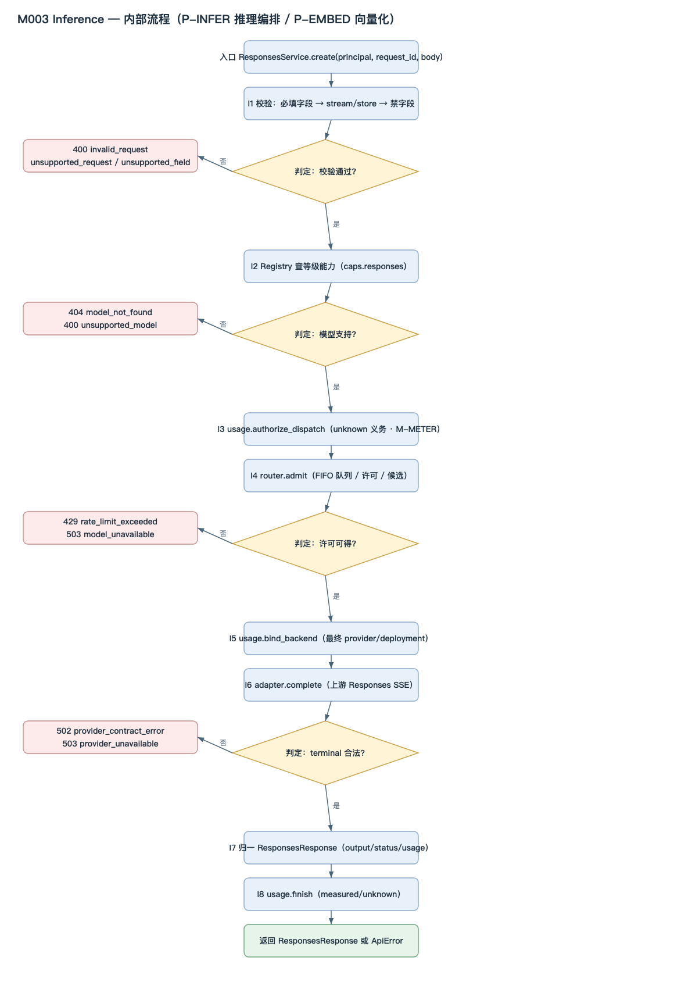

<!-- STD_DOCUMENT_COVER_BEGIN -->
# LLMTier M003 Inference 模块设计

> STD 使用入口：[项目采用说明与标准导航](../../../README.md#std-entry)

| 文档字段 | 值 |
|---|---|
| Document ID | `inference` |
| Document Version | `0.1.0-draft.1` |
| Status | `Draft` |
| Project | `LLMTier` |
| Authority | `LLMTier` |
| Document Owner | LLMTier |
| Authors | llmtier |
| Created Date | `2026-09-23` |
| Last Modified Date | `2026-09-23` |
| Template ID | `design.definition` |
| Template Version | `2.4.0` |
| Template Conformance | `tailored` |
| Tailoring Reference | `std-tailoring` |
| Migration Map Reference | none |
| Repository | `corezilla/LLMTier` |
| Canonical Path | `docs/40_module_design/inference-design.md` |
| Supersedes | none |
<!-- STD_DOCUMENT_COVER_END -->

## 1. 单元摘要：为什么存在

| 项目 | 内容 |
|---|---|
| 模块编号 / 正式英文名称 | **M003** / Inference |
| 直属父对象编号 / 名称 | LLMTier 软件系统（本项目无子系统）|
| 父设计 Document ID / 登记位置 | `llmtier-system-design` / 系统设计 §3.2（唯一登记表）|
| 上级系统 / 父单元 | LLMTier 软件系统 |
| 解决的问题 | 一次模型请求落到哪个后端、怎样调用、怎样归一为标准响应与用量——把"路由决策 + 外部调用 + 协议归一"从入口与配置中分离 |
| 提供的能力 | 推理（Responses，SSE）、向量化（Embeddings）、模型目录（Models）；准入与同等级候选选择；上游协议归一为 token Usage |
| 主要使用者 | M001 HTTP API（唯一调用方）；间接使用者 Consumer（Piko/Slinky）|
| 不负责 | HTTP/SSE 传输与鉴权（M001）；provider/等级配置管理（M004）；账本的持久化版本（M-METER）；跨等级 fallback、会话、工具执行 |

### 1.1 继承的上级约束与落实方式

#### 1.1.1 `C-INFER-1` · 只提供标准 Responses SSE
- **上级基线与决定状态**：系统设计 §3.3；已采用
- **适用条件**：`POST /v1/responses`
- **继承预算或行为保证**：对外只发标准 Responses SSE，不增 JSON 并行模式
- **可自行选择 / 不可改变**：内部编排可自选；事件子集不可变
- **本地落实 / 内部再分配**：I2 编排 + I7 归一；§7、§9
- **验证方法与结果 / 证据**：`VRC-INF-001`；契约测试；NOT_RUN
- **差距 / 变更影响 / 反馈责任**：无

#### 1.1.2 `C-INFER-2` · 每请求恰好一个 terminal 事件
- **上级基线与决定状态**：系统设计 §3.3；已采用
- **适用条件**：`POST /v1/responses`
- **继承预算或行为保证**：终态唯一
- **可自行选择 / 不可改变**：事件名由 status 决定
- **本地落实 / 内部再分配**：I7 归一 + M001 SSE 传输；§8、§10
- **验证方法与结果 / 证据**：`VRC-INF-001`；NOT_RUN
- **差距 / 变更影响 / 反馈责任**：无

#### 1.1.3 `C-INFER-3` · 结果未知不补零；账本只追加
- **上级基线与决定状态**：系统设计 §3.4；已采用
- **适用条件**：任意终态
- **继承预算或行为保证**：unknown 义务先落库；usage 缺失不写 0
- **可自行选择 / 不可改变**：归一实现可自选；不补零不可变
- **本地落实 / 内部再分配**：I8 用量记账（M-METER）；§8、§9
- **验证方法与结果 / 证据**：`VRC-INF-003`；NOT_RUN
- **差距 / 变更影响 / 反馈责任**：与 M-METER 一致

#### 1.1.4 `C-INFER-4` · 不做跨等级 / 跨空间 fallback
- **上级基线与决定状态**：系统设计 §3.3；已采用
- **适用条件**：准入与候选选择
- **继承预算或行为保证**：只在同一 exact 等级内选择
- **可自行选择 / 不可改变**：排序实现可自选；不跨等级不可变
- **本地落实 / 内部再分配**：I5 准入路由；§8
- **验证方法与结果 / 证据**：`VRC-INF-004`；NOT_RUN
- **差距 / 变更影响 / 反馈责任**：无

#### 1.1.5 `C-INFER-5` · 观测 fail-open，不改推理结果
- **上级基线与决定状态**：系统设计 §3.4；已采用
- **适用条件**：观测写入
- **继承预算或行为保证**：观测失败不得使推理失败
- **可自行选择 / 不可改变**：捕获实现可自选；fail-open 不可变
- **本地落实 / 内部再分配**：I8/观测集成；§10、§11
- **验证方法与结果 / 证据**：`VRC-INF-005`；NOT_RUN
- **差距 / 变更影响 / 反馈责任**：与 M-OBS 一致

## 2. 需求、功能与验收条件

### 2.1 `F-INF-RESPONSES` · 推理（Responses）
- **上级需求 / Constraint ID**：`C-INFER-1/2/3`；机制 M-INFER CAP-RESP-STREAM
- **调用方**：M001（`/v1/responses`）
- **输入与前提**：`ResponsesRequest`（`model` / `input` / `stream=true` / `store=false`）
- **行为**：校验 → 记义务 → 准入 → 调后端 → 归一为标准 `ResponsesResponse`
- **输出**：`ResponsesResponse`（`output` / `status` / `usage`）
- **错误与边界**：400 `invalid_request`/`unsupported_request`/`unsupported_field`；404 `model_not_found`；400 `unsupported_model`；429 `rate_limit_exceeded`；502 `provider_contract_error`；503 `provider_unavailable`
- **验收条件**：事件子集与终态对照 OpenAPI；token Usage 与上游一致

### 2.2 `F-INF-EMBED` · 向量化（Embeddings）
- **上级需求 / Constraint ID**：机制 M-INFER CAP（embeddings）
- **调用方**：M001（`/v1/embeddings`）
- **输入与前提**：`{model, input, encoding_format?, dimensions?, user?}`
- **行为**：校验 → 能力核对 → 记义务 → 准入 → `embed()` → 校验向量 → 归一 usage
- **输出**：Embeddings 载荷（`object=list`、`data[]`）
- **错误与边界**：400 `invalid_request`/`unsupported_model`/`unsupported_dimensions`；502 `provider_contract_error`；503 `provider_unavailable`
- **验收条件**：向量长度/有限性校验通过；base64 解码正确；usage 归一为 `prompt_tokens`

### 2.3 `F-INF-MODELS` · 模型目录
- **上级需求 / Constraint ID**：系统设计 §3.2（Inference 含模型目录）
- **调用方**：M001（`/v1/models`、`/v1/models/{id}`）
- **输入与前提**：无 / 等级 id
- **行为**：按等级候选健康度计算 `availability`
- **输出**：`{id, object:"model", owned_by, availability, capabilities}`
- **错误与边界**：404 `model_not_found`
- **验收条件**：`availability` 规则正确（全部健康→available；部分/未知→degraded；无候选或全不健康→unavailable）

### 2.4 `F-INF-VALIDATE` · 请求校验
- **上级需求 / Constraint ID**：`C-INFER-1`；机制 M-INFER §5.1
- **调用方**：M001 → I2
- **输入与前提**：解析后的 body dict
- **行为**：必填字段 → `stream/store` 约束 → 禁字段 → 模型存在 → 能力
- **输出**：通过，或 typed `ApiError`
- **错误与边界**：见 §2.1
- **验收条件**：校验顺序固定且可测；失败不调用后端

### 2.5 `F-INF-ROUTE` · 准入与同等级候选选择
- **上级需求 / Constraint ID**：`C-INFER-4`；机制 M-INFER CAP-WAIT-FAIL
- **调用方**：I2 → I5
- **输入与前提**：`level_id`、已启用且能力匹配的候选
- **行为**：FIFO 排队 → 许可/限流检查 → 选 in-flight 最少者
- **输出**：候选（许可持有，退出即释放）
- **错误与边界**：429 队列满/等待超时；503 全候选不健康
- **验收条件**：许可释放无泄漏；同等级内选择；不跨等级

### 2.6 `F-INF-USAGE` · 用量归一与记账
- **上级需求 / Constraint ID**：`C-INFER-3`；机制 M-METER
- **调用方**：I2
- **输入与前提**：后端返回的 `usage`
- **行为**：dispatch 前记 unknown 义务；终态追加版本并推进 head；未测不补零
- **输出**：账本 record version
- **错误与边界**：义务写入失败 → 不 dispatch；终态写入失败 → 保留 unknown
- **验收条件**：见机制 M-METER §14.4 R-MET-01

## 3. UI、CLI、服务端点或设备操作面

**N/A — 本模块没有直接操作面。** M003 是进程内的嵌入式业务库，不被最终用户直接调用；所有对外端点由 **M001 HTTP API** 暴露（见 M001 §3/§9）。实际调用入口见 §5.3 与 §9。Tailoring 依据：系统设计 §3.2 规定入口层终止 HTTP/SSE，业务层模块只提供内部调用接口。

## 4. 外部边界与依赖

#### 4.1 `DEP-M001` · HTTP API（唯一调用方）
- **角色 / 运行位置 / Owner**：调用方；同进程；LLMTier
- **本模块调用或消费**：—
- **本模块提供**：`ResponsesService.create` / `EmbeddingsService.create` / `ModelCatalog.*`
- **契约 authority / 版本 / selector**：本文 §9；对外 OpenAPI 由 M001 映射
- **同步方式 / timeout / 生命周期**：同步函数调用；请求级
- **不可用或失败影响 / 责任出口**：`ApiError` 冒泡到 M001 错误信封

#### 4.2 `DEP-M004` · Management（配置读取）
- **角色 / 运行位置 / Owner**：依赖；同进程；LLMTier
- **本模块调用或消费**：`Registry.get_service_level` / `Registry.candidates`
- **本模块提供**：—
- **契约 authority / 版本 / selector**：`llmtier-config-lifecycle-mechanism` §14.4 `R-CFG-01`
- **同步方式 / timeout / 生命周期**：同步只读查询
- **不可用或失败影响 / 责任出口**：404 `model_not_found`

#### 4.3 `DEP-OBS` · Observability / libdiag（观测）
- **角色 / 运行位置 / Owner**：依赖；同进程；LLMTier
- **本模块调用或消费**：`record_trace` / `capture_snapshot` / `record_latency` / `get_enabled_injections`
- **本模块提供**：—
- **契约 authority / 版本 / selector**：`llmtier-observability-mechanism` §14.4 `R-OBS-03`
- **同步方式 / timeout / 生命周期**：同步、fail-open
- **不可用或失败影响 / 责任出口**：记 warning，不改推理结果（C-INFER-5）

#### 4.4 `DEP-PROVIDER` · 模型后端（外部）
- **角色 / 运行位置 / Owner**：外部依赖；进程外；各 provider/本地引擎
- **本模块调用或消费**：OpenAI-compatible `/responses`、`/embeddings`、`/models`
- **本模块提供**：—
- **契约 authority / 版本 / selector**：上游协议（OpenAI-compatible）
- **同步方式 / timeout / 生命周期**：同步 HTTP；连接 30 s / 首字节 30 s / SSE 空闲 60 s
- **不可用或失败影响 / 责任出口**：502/503 typed error；不跨等级重试

#### 4.5 `DEP-M007` · util（存储）
- **角色 / 运行位置 / Owner**：依赖；同进程；LLMTier
- **本模块调用或消费**：`Store.one/all/transaction`（经 M-METER）
- **本模块提供**：—
- **契约 authority / 版本 / selector**：`llmtier-config-lifecycle-mechanism` §14.4 `R-CFG-03`
- **同步方式 / timeout / 生命周期**：同步
- **不可用或失败影响 / 责任出口**：存储错误 → 请求失败

#### 4.6 `DEP-M008` · log（脱敏日志）
- **角色 / 运行位置 / Owner**：依赖；同进程；LLMTier
- **本模块调用或消费**：脱敏日志写入
- **本模块提供**：—
- **契约 authority / 版本 / selector**：—（M008 §9）
- **同步方式 / timeout / 生命周期**：同步、尽力而为
- **不可用或失败影响 / 责任出口**：不阻塞推理

## 5. 内部结构与实现位置

[可编辑 SVG 源](../assets/diagrams/diagram-m003-inference-flow.svg)

图 M003-P1 · P-INFER 内部流程（正常/拒绝/失败分支），下节逐组件给出职责与调用。

### 5.1 内部组成

#### 5.1.1 `I1` · 请求校验
- **职责与非职责**：校验必填/`stream·store`/禁字段；不查能力、不调后端
- **输入、处理与输出**：body dict → typed `ApiError` 或通过
- **协作对象**：I2 编排
- **文件 / symbol / 实现状态**：`responses.py` `ResponsesService.create` 前段；Implemented
- **拆分依据与替代方案代价**：校验先于任何持久化/外部副作用，保证"In a 失败不 dispatch"

#### 5.1.2 `I2` · 推理编排
- **职责与非职责**：串联校验→义务→准入→调用→归一→记账；不做传输
- **输入、处理与输出**：`(principal, request_id, body)` → `ResponsesResponse`
- **协作对象**：I1、I3、I4、I5、I6、I7、I8
- **文件 / symbol / 实现状态**：`responses.py` `ResponsesService.create`；Implemented
- **拆分依据与替代方案代价**：编排与准入分离，便于单独测试准入策略

#### 5.1.3 `I3` · 向量化编排
- **职责与非职责**：Embeddings 的校验/准入/调用/向量校验/usage 归一；不处理 Responses 事件
- **输入、处理与输出**：body dict → Embeddings 载荷
- **协作对象**：I5、I6、I8
- **文件 / symbol / 实现状态**：`embeddings.py` `EmbeddingsService.create`；Implemented
- **拆分依据与替代方案代价**：与 I2 共用准入/适配，但协议不同，独立成类

#### 5.1.4 `I4` · 模型目录
- **职责与非职责**：按等级计算 `availability`；不发起模型调用
- **输入、处理与输出**：等级 → `{id, availability, capabilities}`
- **协作对象**：M004 Registry
- **文件 / symbol / 实现状态**：`models.py` `ModelCatalog`；Implemented
- **拆分依据与替代方案代价**：只读视图，与编排解耦

#### 5.1.5 `I5` · 准入与路由
- **职责与非职责**：FIFO 队列、许可、provider 限流、同等级候选选择；不做协议映射
- **输入、处理与输出**：`level_id` → 候选（上下文管理器）
- **协作对象**：I2、I3、M004
- **文件 / symbol / 实现状态**：`routing.py` `Router.admit`；Implemented
- **拆分依据与替代方案代价**：把资源准入与后端执行隔开，避免把并发策略漏进各调用点

#### 5.1.6 `I6` · Provider 适配
- **职责与非职责**：云/本地协议映射、usage 归一、typed error；不对外暴露 provider 凭据
- **输入、处理与输出**：`(backend_model, body)` → `ProviderResult`
- **协作对象**：I2、I3、M007（secret ref）
- **文件 / symbol / 实现状态**：`providers/base.py`、`providers/openai.py`、`providers/local.py`；Implemented
- **拆分依据与替代方案代价**：Adapter 隔离上游差异；Local 复用 OpenAI 传输

#### 5.1.7 `I7` · 响应归一
- **职责与非职责**：构造 `ResponsesResponse`（status/output/usage/error/incomplete_details）；不改下游协议
- **输入、处理与输出**：`ProviderResult` → `ResponsesResponse`
- **协作对象**：I2、M001
- **文件 / symbol / 实现状态**：`responses.py`（返回段）；Implemented
- **拆分依据与替代方案代价**：归一与调用分离，便于契约测试

#### 5.1.8 `I8` · 用量记账
- **职责与非职责**：义务/绑定/终态版本、unknown 不补零；不含 Cost
- **输入、处理与输出**：`(principal, request_id, usage)` → 账本版本
- **协作对象**：I2、I3、M007
- **文件 / symbol / 实现状态**：`usage.py` `UsageRecorder`；Implemented
- **拆分依据与替代方案代价**：账本独立于推理路径，保证"已发生不丢失"

### 5.2 内部调用过程

#### 5.2.1 `CALL-INFER` · 一次推理调用链
- **入口与调用上下文**：M001 调用 `ResponsesService.create`（同进程、请求线程）
- **调用链**：`ResponsesService.create` →（校验）→ `registry.get_service_level` [M004] → `usage.authorize_dispatch` [I8] → `router.admit` [I5] → `usage.bind_backend` [I8] → `adapter.complete` [I6] → `usage.finish` [I8]
- **逐步传递的数据**：`body(dict)` → `caps(dict)` → `candidate(Candidate)` → `ProviderResult` → `ResponsesResponse(dict)`
- **返回、异常与清理**：`ApiError` 冒泡；异常路径 `usage.finish(None)`；`admit` 退出释放许可
- **对应流程 / 接口 / 验证**：§7 P-INFER / §9 IF-INF-01..06 / `VRC-INF-001..005`

#### 5.2.2 `CALL-EMBED` · 一次向量化调用链
- **入口与调用上下文**：M001 调用 `EmbeddingsService.create`
- **调用链**：`EmbeddingsService.create` →（校验）→ `registry.get_service_level` → `usage.authorize_dispatch` → `router.admit` → `usage.bind_backend` → `adapter.embed` →（向量校验）→ `usage.finish`
- **逐步传递的数据**：body → caps → candidate → Embeddings 载荷
- **返回、异常与清理**：同上；`base64` 解码失败 → 502
- **对应流程 / 接口 / 验证**：§7 P-EMBED / §9 IF-INF-02 / `VRC-INF-002`

### 5.3 文件间接口契约

#### 5.3.1 `IF-INF-01` · `app.py` → `responses.py`
- **签名 / 入口**：`ResponsesService.create(principal, request_id, body, ...) -> ResponsesResponse`
- **输入与前置条件**：已认证 `Principal`；解析后 body
- **输出 / 异常**：`ResponsesResponse`；`ApiError`
- **ownership / 生命周期**：请求级；body 只读
- **实现与验证位置**：`responses.py`；`VRC-INF-001`

#### 5.3.2 `IF-INF-02` · `app.py` → `embeddings.py`
- **签名 / 入口**：`EmbeddingsService.create(principal, request_id, body) -> dict`
- **输入与前置条件**：已认证 `Principal`
- **输出 / 异常**：Embeddings 载荷；`ApiError`
- **ownership / 生命周期**：请求级
- **实现与验证位置**：`embeddings.py`；`VRC-INF-002`

#### 5.3.3 `IF-INF-03` · `responses.py` → `registry.py`[M004]
- **签名 / 入口**：`Registry.get_service_level(model) -> (view, etag)`
- **输入与前置条件**：逻辑等级 id
- **输出 / 异常**：等级 + `capabilities`；404
- **ownership / 生命周期**：只读快照
- **实现与验证位置**：`registry.py`；`VRC-INF-004`

#### 5.3.4 `IF-INF-04` · `responses.py` → `routing.py`
- **签名 / 入口**：`Router.admit(level_id)`（上下文管理器）
- **输入与前置条件**：等级 id、已启用候选
- **输出 / 异常**：候选；429/503
- **ownership / 生命周期**：持有许可，退出上下文释放
- **实现与验证位置**：`routing.py`；`VRC-INF-004`

#### 5.3.5 `IF-INF-05` · `responses.py` → `providers/*`
- **签名 / 入口**：`ProviderAdapter.complete(model, body) -> ProviderResult`
- **输入与前置条件**：`backend_model`、上游 body
- **输出 / 异常**：`ProviderResult`；502/503
- **ownership / 生命周期**：请求级；连接 `Connection: close`
- **实现与验证位置**：`providers/openai.py`；`VRC-INF-003`

#### 5.3.6 `IF-INF-06` · `responses.py` → `usage.py`
- **签名 / 入口**：`UsageRecorder.authorize_dispatch/bind_backend/finish`
- **输入与前置条件**：`(principal, request_id, …)`
- **输出 / 异常**：账本版本；存储错误
- **ownership / 生命周期**：账本由 M007 持久化
- **实现与验证位置**：`usage.py`；`VRC-INF-003`

### 5.4 服务提供方式（条件适用）

- **运行载体与入口**：N/A + 依据 —— M003 是**嵌入式库**，无独立 server；由 M001 进程内调用
- **并发/线程模型**：N/A + 依据 —— 使用调用方线程（M001 每请求一线程）；仅 `Router` 内部持有锁/条件变量
- **初始化、Ready、生效与停止**：N/A + 依据 —— 随进程装配（`Application.__init__` 构造各 Service）；无自有生命周期
- **宿主装配、失败和资源回收责任**：由 M001/启动装配；`Router` 的许可在上下文退出时释放；无自有 fd/线程

### 5.5 依赖方向

- **允许方向**：M001 → M003 → {M004, M005/M006, M007, M008, 外部 provider}
- **禁止方向与原因**：M003 不得回调 M001（入口）或 M002（UI）；不得直连 provider 以外的基础层旁路
- **循环/越层检查**：`routing.py`/`providers/*` 不 import `app.py`；契约测试检查 import 方向
- **变更影响**：改动 `Router`/`ProviderAdapter` 影响 M001 的错误映射与 M-METER 的绑定

## 6. 数据模型、状态与 ownership

#### 6.1 `ResponsesRequest`
- **Authority / 定义位置**：OpenAPI `/v1/responses` requestBody（机器 authority）；`responses.py` 只读消费
- **字段**：`model:str`、`input:list`、`stream:bool(=true)`、`store:bool(=false)`、`tools?:list`、`max_output_tokens?:int`
- **键与跨字段约束**：禁 `prompt_cache_key`/`prompt_cache_retention`/`previous_response_id`
- **Writer / Reader**：M001 写入；M003 只读
- **创建、持有、借用/复制与释放**：请求级；body dict 只读借用
- **状态转换 / 并发规则**：无状态
- **验证项**：`VRC-INF-001`

#### 6.2 `ResponsesResponse`
- **Authority / 定义位置**：OpenAPI response；`responses.py` 构造
- **字段**：`id:str`、`object:"response"`、`created_at:int`、`status:str`、`model:str`、`output:list`、`usage:dict|None`、`error:dict|None`、`incomplete_details:dict|None`
- **键与跨字段约束**：`status ∈ {completed,incomplete,failed}`
- **Writer / Reader**：M003 构造；M001 序列化为 SSE
- **创建、持有、借用/复制与释放**：请求级
- **状态转换 / 并发规则**：无状态
- **验证项**：`VRC-INF-001`

#### 6.3 `ProviderResult`
- **Authority / 定义位置**：`providers/base.py`（`@dataclass(slots=True)`）
- **字段**：`output:list`、`usage:dict|None`、`provider_request_id:str|None`、`status:str`、`error:dict|None`、`incomplete_details:dict|None`
- **键与跨字段约束**：`status` 与上游 terminal 事件一致
- **Writer / Reader**：I6 构造；I7 消费
- **创建、持有、借用/复制与释放**：请求级
- **状态转换 / 并发规则**：不可变（返回后只读）
- **验证项**：`VRC-INF-003`

#### 6.4 `Candidate`
- **Authority / 定义位置**：`registry.py`（`@dataclass(frozen=True, slots=True)`）
- **字段**：`level_id`、`deployment_id`、`provider_id`、`endpoint`、`backend_model`、`kind`、`health`、`ordinal`
- **键与跨字段约束**：`health ∈ {healthy, degraded, unhealthy, unknown}`
- **Writer / Reader**：M004 构造；I5 消费
- **创建、持有、借用/复制与释放**：查询返回，只读
- **状态转换 / 并发规则**：不可变
- **验证项**：`VRC-INF-004`

#### 6.5 `Usage`（归一后）
- **Authority / 定义位置**：M-METER §14.4 `R-MET-01`（账本）；M003 只做归一
- **字段**：`input_tokens`、`output_tokens`、`total_tokens`、`input_tokens_details{cached_tokens,cache_write_tokens}`、`output_tokens_details{reasoning_tokens}`
- **键与跨字段约束**：`measured` 仅当三者皆为 int；`cached ⊂ input`、`reasoning ⊂ output`
- **Writer / Reader**：I8 写账本；ModelCatalog/调用方读
- **创建、持有、借用/复制与释放**：账本持久；响应内的即时值
- **状态转换 / 并发规则**：版本只追加（M-METER）
- **验证项**：`VRC-INF-003`

## 7. 主流程与数据流

[可编辑 SVG 源](../assets/diagrams/diagram-m003-inference-flow.svg)

图 M003-P1 · P-INFER 与 P-EMBED 在同一编排族；正常、校验拒绝、能力拒绝、准入拒绝、上游契约失败分支全部展开。判定来自当前请求、Registry 能力与 Router 许可，不依赖远端等待。

**内部流程正文**：M001 调用 `create` 后，**I1** 先校验（必填 → `stream/store` → 禁字段，失败 400）；**I2 Registry 查询**等级能力（不支持 → 404/400）；**I3 I8 记义务**（unknown，M-METER）；**I4 I5 准入**取许可并选候选（队列满/超时 429，全不健康 503）；**I5 I8 绑后端**；**I6 调后端**（`complete`/`embed`，上游契约/不可达 → 502/503）；**I7 归一**为标准响应；**I8 终态记账**（measured/unknown，异常路径 `finish(None)`）。P-EMBED 复用同一准入/适配，只把归一换成向量校验 + usage→prompt_tokens。

#### 7.1 `P-INFER` · 推理编排
- **触发/适用条件**：`POST /v1/responses`
- **图与正文位置**：本段 / 图 M003-P1；机制 M-INFER §6（事件级）
- **正常出口**：`ResponsesResponse`（terminal 由 M001 流式发送）
- **异常出口**：400/404/429/502/503（typed `ApiError`）

#### 7.2 `P-EMBED` · 向量化编排
- **触发/适用条件**：`POST /v1/embeddings`
- **图与正文位置**：本段 / 图 M003-P1
- **正常出口**：Embeddings 载荷
- **异常出口**：400/502/503

#### 7.3 `P-MODELS` · 模型目录查询
- **触发/适用条件**：`GET /v1/models[/{id}]`
- **图与正文位置**：§5.1.4
- **正常出口**：模型列表/单体
- **异常出口**：404

## 8. 关键算法与业务规则

#### 8.1 `RULE-INF-VALIDATE` · 校验顺序
- **输入前提 / 适用条件**：任意推理/向量化请求
- **算法 / 规则 / 选择依据**：必填 → `stream/store` → 禁字段 → 模型存在 → 能力；顺序固定以给出稳定错误
- **结果 / 不变量 / 边界**：失败**不产生**任何后端调用与持久化副作用
- **复杂度 / 资源限制**：O(字段数)
- **允许替换范围 / 不可改变保证**：实现可自选；顺序与错误码不可变
- **具体输入推演 / 验证项**：缺 `store` → 400 `invalid_request`；`store=true` → 400 `unsupported_request`；`VRC-INF-001`

#### 8.2 `RULE-INF-ROUTE` · 同等级候选选择
- **输入前提 / 适用条件**：已准入
- **算法 / 规则 / 选择依据**：在 `enabled && healthy` 且能力匹配的候选中选 `(inflight, ordinal)` 最小者；provider 限流（min_interval/RPM/max_concurrent）满足才可用
- **结果 / 不变量 / 边界**：同一 exact 等级内；不跨等级/空间
- **复杂度 / 资源限制**：O(候选数)（候选数小）
- **允许替换范围 / 不可改变保证**：排序实现可自选；范围不可变
- **具体输入推演 / 验证项**：两个健康候选 inflight 0/1 → 选前者；`VRC-INF-004`

#### 8.3 `RULE-INF-TERMINAL` · 上游 SSE 终态校验
- **输入前提 / 适用条件**：`adapter.complete`
- **算法 / 规则 / 选择依据**：逐个 SSE 块解析；恰好一个 terminal（`completed/incomplete/failed`）；terminal 事件名与 `response.status` 必须一致
- **结果 / 不变量 / 边界**：不一致/缺失/多个 → 502 `provider_contract_error`
- **复杂度 / 资源限制**：O(事件数)
- **允许替换范围 / 不可改变保证**：解析实现可自选；"唯一 + 一致"不可变
- **具体输入推演 / 验证项**：上游返回两个 terminal → 502；`VRC-INF-003`

#### 8.4 `RULE-INF-EMBED` · 向量与 base64 校验
- **输入前提 / 适用条件**：`adapter.embed`
- **算法 / 规则 / 选择依据**：`base64` → `struct.unpack("<f*", …)`；向量非空且全为有限数值；`dimensions` 属等级允许维数
- **结果 / 不变量 / 边界**：非法 → 502 `provider_contract_error` / 400 `unsupported_dimensions`
- **复杂度 / 资源限制**：O(维度)
- **允许替换范围 / 不可改变保证**：解码实现可自选；有限性校验不可变
- **具体输入推演 / 验证项**：非有限值 → 502；`VRC-INF-002`

#### 8.5 `RULE-INF-MODELS` · availability 计算
- **输入前提 / 适用条件**：`GET /v1/models`
- **算法 / 规则 / 选择依据**：无候选或全 `unhealthy` → `unavailable`；任一 `degraded/unhealthy/unknown` → `degraded`；否则 `available`
- **结果 / 不变量 / 边界**：与 `/readyz` 的等级可用性一致口径
- **复杂度 / 资源限制**：O(候选数)
- **允许替换范围 / 不可改变保证**：实现可自选；规则不可变
- **具体输入推演 / 验证项**：混合健康 → degraded；`VRC-INF-004`

## 9. 接口与机器契约

对外端点由 M001 暴露；字段 authority 为 `interfaces/openapi/llmtier.openapi.json`。以下为 M003 提供的内部操作。

#### 9.1 `IF-RESPONSES` · 推理
- **Direction / Operation / 责任模块 / backend**：in；`POST /v1/responses`；M003；provider `/responses`
- **Request / Response / Error / ownership**：`ResponsesRequest` → `ResponsesResponse`；`ApiError`；请求级
- **Contract authority / version / revision / hash / selector**：OpenAPI `0.3-simplified-candidate.8`
- **前提 / timeout / 兼容边界 / Error model**：`stream=true`、`store=false`；30 s/60 s；`{error:{code,message,param,retryable}}`
- **本地文件 / symbol 或 NOT_IMPLEMENTED**：`responses.py` `ResponsesService.create`
- **Constraint / VRC / Case / 环境 / Run**：`C-INFER-1/2/3`；`VRC-INF-001`；NOT_RUN
- **关联类型字段 ID**：`ResponsesRequest` / `ResponsesResponse`（§6.1/§6.2）

#### 9.2 `IF-EMBEDDINGS` · 向量化
- **Direction / Operation / 责任模块 / backend**：in；`POST /v1/embeddings`；M003；provider `/embeddings`
- **Request / Response / Error / ownership**：`{model,input,encoding_format?,dimensions?}` → 载荷；`ApiError`
- **Contract authority / version / revision / hash / selector**：OpenAPI
- **前提 / timeout / 兼容边界 / Error model**：`Embedding-v1` 冻结 space；30 s
- **本地文件 / symbol 或 NOT_IMPLEMENTED**：`embeddings.py` `EmbeddingsService.create`
- **Constraint / VRC / Case / 环境 / Run**：`VRC-INF-002`；NOT_RUN
- **关联类型字段 ID**：Embeddings 载荷

#### 9.3 `IF-MODELS` · 模型目录
- **Direction / Operation / 责任模块 / backend**：in；`GET /v1/models`、`/v1/models/{id}`；M003
- **Request / Response / Error / ownership**：— / `{id,object,owned_by,availability,capabilities}`；404
- **Contract authority / version / revision / hash / selector**：OpenAPI
- **前提 / timeout / 兼容边界 / Error model**：只读
- **本地文件 / symbol 或 NOT_IMPLEMENTED**：`models.py` `ModelCatalog`
- **Constraint / VRC / Case / 环境 / Run**：`VRC-INF-004`；NOT_RUN
- **关联类型字段 ID**：—

## 10. 并发、失败与恢复

#### 10.1 `F-INF-VALIDATE` · 校验失败
- **初始条件 / 并发交错 / 失败点**：字段/能力不满足
- **检测事实 / authority / 期限**：校验结果（本文 §8.1）
- **处理行为 / 副作用边界**：无副作用；未准入、未 dispatch
- **状态查询 / 同请求重放 / 接管 / 新业务重试**：N/A + 理由：无副作用，直接修请求
- **最终状态 / 资源归属 / 后续合法入口**：400；无资源
- **验证项 / 组合责任**：`VRC-INF-001`

#### 10.2 `F-INF-ADMIT` · 队列满/等待超时
- **初始条件 / 并发交错 / 失败点**：同等级等待 > 32 或 > 30 s
- **检测事实 / authority / 期限**：Router 队列（§8.2）
- **处理行为 / 副作用边界**：无调用；返回 429 + `Retry-After`
- **状态查询 / 同请求重放 / 接管 / 新业务重试**：N/A + 理由：未调用后端
- **最终状态 / 资源归属 / 后续合法入口**：429
- **验证项 / 组合责任**：`VRC-INF-004`

#### 10.3 `F-INF-UPSTREAM` · 上游失败/超时
- **初始条件 / 并发交错 / 失败点**：连接/首字节/SSE 空闲超时或 5xx
- **检测事实 / authority / 期限**：urllib HTTPError/URLError（§5.3.5）
- **处理行为 / 副作用边界**：**可能已调用后端**；释放许可；记 unknown usage
- **状态查询 / 同请求重放 / 接管 / 新业务重试**：N/A + 理由：本系统不自动重放，不承诺 exactly-once；重放风险由 Consumer 承担
- **最终状态 / 资源归属 / 后续合法入口**：502/503；许可已释放
- **验证项 / 组合责任**：`VRC-INF-003`；组合（Piko 联调）

#### 10.4 `F-INF-DISCONNECT` · 调用方断开
- **初始条件 / 并发交错 / 失败点**：Consumer 断开（M001 捕获）
- **检测事实 / authority / 期限**：写失败（M001）
- **处理行为 / 副作用边界**：结束本次调用；`finish(None)`
- **状态查询 / 同请求重放 / 接管 / 新业务重试**：N/A + 理由：新请求为新调用
- **最终状态 / 资源归属 / 后续合法入口**：记 aborted
- **验证项 / 组合责任**：`VRC-INF-005`

## 11. 安全、权限与可观测性

- **权限**：M003 不鉴权（**C-TRUST-1**：入口单点鉴权）；只消费 `Principal.principal_id` 记用量
- **Secret**：provider 凭据只经 `secret_ref`（`env:`/`file:`）在适配器内解析（`DEP-PROVIDER`）；不进入响应/日志
- **可观测**：`record_trace`（received/validated/routed/upstream_started/upstream_ended/completed|error）、`capture_snapshot`、`record_latency`、注入（`get_enabled_injections`）；全 fail-open（**C-INFER-5**）
- **不记录**：prompt/输出正文/Secret 进入日志或快照

## 12. 容量、性能与运行限制

#### 12.1 `CAP-INF-QUEUE` · 同等级准入队列
- **目标 / 限制 / 单位**：≤ 32 项；等待 ≤ 30 s
- **适用版本 / 配置 / 硬件 / 虚拟化 / 依赖**：`deployment_runtime_profiles` / `provider_usage_profiles`
- **负载、数据规模与并发口径**：单等级并发请求
- **推导 / 测量方法与证据等级**：Specified
- **共享资源扣减 / 峰值重叠 / 余量**：per-deployment `max_in_flight=1`（首版）
- **超限行为 / 责任出口**：429 + `Retry-After`
- **验证项 / Evidence**：`VRC-INF-004`；NOT_RUN

#### 12.2 `CAP-INF-UPSTREAM` · 上游超时
- **目标 / 限制 / 单位**：建连/首字节 30 s；SSE 空闲 60 s
- **适用版本 / 配置 / 硬件 / 虚拟化 / 依赖**：适配器 `timeout`
- **负载、数据规模与并发口径**：单次上游调用
- **推导 / 测量方法与证据等级**：Specified
- **共享资源扣减 / 峰值重叠 / 余量**：—
- **超限行为 / 责任出口**：结束本次调用；记 unknown usage
- **验证项 / Evidence**：`VRC-INF-003`；NOT_RUN

#### 12.3 `CAP-INF-EMBED` · 向量化上限
- **目标 / 限制 / 单位**：单项 ≤ 8192 provider tokens；批 ≤ 32 inputs；维数固定 1024
- **适用版本 / 配置 / 硬件 / 虚拟化 / 依赖**：`Embedding-v1` 冻结 space
- **负载、数据规模与并发口径**：单批
- **推导 / 测量方法与证据等级**：Specified
- **共享资源扣减 / 峰值重叠 / 余量**：—
- **超限行为 / 责任出口**：400 `unsupported_dimensions` / provider 侧错误
- **验证项 / Evidence**：`VRC-INF-002`；NOT_RUN

## 13. 实现步骤与文件清单

### 13.1 文件分解（设计 → 代码文件）

#### 13.1.1 `src/llmtier_v03/responses.py`
- **职责 / 非职责**：I1 校验、I2 编排、I7 归一；不做传输/准入策略
- **关键 symbol / 导出范围**：`ResponsesService.create`、`_adapter`
- **承接 Function / Rule / Constraint / Interface ID**：`F-INF-RESPONSES`、`F-INF-VALIDATE`、`RULE-INF-VALIDATE`、`C-INFER-1/2/3`、`IF-RESPONSES`
- **构建目标 / 依赖 / 宿主装配**：随 `Application` 装配；依赖 Registry/Router/Usage/Diagnostics
- **实现状态**：Implemented（含 `LLMTIER_SLOW_ADAPTER_DELAY` 测试注入）
- **验证入口**：`VRC-INF-001`；`tests/system/api_test_v03/`

#### 13.1.2 `src/llmtier_v03/embeddings.py`
- **职责 / 非职责**：I3 向量化编排 + 向量/base64 校验；不处理 Responses
- **关键 symbol / 导出范围**：`EmbeddingsService.create`
- **承接 Function / Rule / Constraint / Interface ID**：`F-INF-EMBED`、`RULE-INF-EMBED`、`IF-EMBEDDINGS`
- **构建目标 / 依赖 / 宿主装配**：随 `Application`
- **实现状态**：Implemented
- **验证入口**：`VRC-INF-002`

#### 13.1.3 `src/llmtier_v03/models.py`
- **职责 / 非职责**：I4 模型目录 + availability；不发起调用
- **关键 symbol / 导出范围**：`ModelCatalog.list/get/_view`
- **承接 Function / Rule / Constraint / Interface ID**：`F-INF-MODELS`、`RULE-INF-MODELS`、`IF-MODELS`
- **构建目标 / 依赖 / 宿主装配**：随 `Application`
- **实现状态**：Implemented
- **验证入口**：`VRC-INF-004`

#### 13.1.4 `src/llmtier_v03/routing.py`
- **职责 / 非职责**：I5 准入/队列/限流/候选选择；不做协议映射
- **关键 symbol / 导出范围**：`Router.admit`、`Router.snapshot`
- **承接 Function / Rule / Constraint / Interface ID**：`F-INF-ROUTE`、`RULE-INF-ROUTE`、`C-INFER-4`、`IF-INF-04`
- **构建目标 / 依赖 / 宿主装配**：随 `Application`；内部锁/条件变量
- **实现状态**：Implemented
- **验证入口**：`VRC-INF-004`；并发用例

#### 13.1.5 `src/llmtier_v03/providers/base.py`
- **职责 / 非职责**：`ProviderResult` + `ProviderAdapter` 协议；不含具体协议
- **关键 symbol / 导出范围**：`ProviderResult`、`ProviderAdapter`
- **承接 Function / Rule / Constraint / Interface ID**：`IF-INF-05`
- **构建目标 / 依赖 / 宿主装配**：被适配器实现
- **实现状态**：Implemented
- **验证入口**：`VRC-INF-003`

#### 13.1.6 `src/llmtier_v03/providers/openai.py` / `local.py`
- **职责 / 非职责**：I6 OpenAI-compatible 适配（complete/embed/probe/list_models）；不对外暴露凭据
- **关键 symbol / 导出范围**：`OpenAIProvider`（`LocalProvider` 子类化）
- **承接 Function / Rule / Constraint / Interface ID**：`F-INF-RESPONSES`、`F-INF-EMBED`、`RULE-INF-TERMINAL`、`IF-INF-05`
- **构建目标 / 依赖 / 宿主装配**：`urllib`；`Connection: close`；certifi 可选
- **实现状态**：Implemented
- **验证入口**：`VRC-INF-003`

#### 13.1.7 `src/llmtier_v03/usage.py`
- **职责 / 非职责**：I8 用量记账（义务/绑定/终态/unknown）；不含 Cost
- **关键 symbol / 导出范围**：`UsageRecorder.authorize_dispatch/bind_backend/finish`
- **承接 Function / Rule / Constraint / Interface ID**：`F-INF-USAGE`、`C-INFER-3`、`IF-INF-06`、机制 `R-MET-01`
- **构建目标 / 依赖 / 宿主装配**：随 `Application`；依赖 Store
- **实现状态**：Implemented
- **验证入口**：`VRC-INF-003`

### 13.2 实现步骤

#### 13.2.1 校验与编排
- **前置输入 / 依赖**：`ResponsesRequest` 契约；Registry
- **新增 / 修改文件与 symbol**：`responses.py` `create`
- **固定语义 / 可自行决定范围**：校验顺序/错误码固定；编排实现可自选
- **交付结果**：`ResponsesResponse`
- **完成检查**：`VRC-INF-001`

#### 13.2.2 准入与路由
- **前置输入 / 依赖**：等级候选；provider 限流 profile
- **新增 / 修改文件与 symbol**：`routing.py` `admit`
- **固定语义 / 可自行决定范围**：同等级、许可释放固定；队列实现可自选
- **交付结果**：候选（许可）
- **完成检查**：`VRC-INF-004`

#### 13.2.3 Provider 适配与终态校验
- **前置输入 / 依赖**：上游 endpoint、`secret_ref`
- **新增 / 修改文件与 symbol**：`providers/*`
- **固定语义 / 可自行决定范围**：terminal 唯一/一致固定；解析实现可自选
- **交付结果**：`ProviderResult`
- **完成检查**：`VRC-INF-003`

#### 13.2.4 用量记账
- **前置输入 / 依赖**：Store；M-METER 语义
- **新增 / 修改文件与 symbol**：`usage.py`
- **固定语义 / 可自行决定范围**：不补零/只追加固定；存储实现可自选
- **交付结果**：账本版本
- **完成检查**：`VRC-INF-003`

## 14. 测试与验收

#### 14.1 `VRC-INF-001` · 推理与流式契约
- **覆盖 Function / Rule / Constraint / Interface**：`F-INF-RESPONSES`、`RULE-INF-VALIDATE`、`C-INFER-1/2`、`IF-RESPONSES`
- **Case / 正常、边界与失败输入**：固定 request（Worker）；缺字段/`store=true`/禁字段；未知 model
- **环境 / 配置 / 隔离与复位**：本机实例 + 隔离库
- **独立 Oracle / Expected**：事件子集对照 OpenAPI；恰好一个 terminal
- **Actual / Evidence / Run ID**：NOT_RUN
- **Verdict / 状态**：NOT_RUN
- **父级组合验证交接**：Piko 联调

#### 14.2 `VRC-INF-002` · 向量化契约
- **覆盖 Function / Rule / Constraint / Interface**：`F-INF-EMBED`、`RULE-INF-EMBED`、`IF-EMBEDDINGS`
- **Case**：正常向量；base64；非有限值；非法维数；`Embedding-v1` 约束
- **环境 / 配置 / 隔离与复位**：隔离库
- **独立 Oracle / Expected**：向量长度/有限性；usage→`prompt_tokens`
- **Actual / Evidence / Run ID**：NOT_RUN
- **Verdict / 状态**：NOT_RUN
- **父级组合验证交接**：Slinky（Embeddings）

#### 14.3 `VRC-INF-003` · 失败与用量
- **覆盖 Function / Rule / Constraint / Interface**：`F-INF-USAGE`、`RULE-INF-TERMINAL`、`C-INFER-3`、`IF-INF-05/06`
- **Case**：上游 5xx/超时；两个 terminal；usage 缺失
- **环境 / 配置 / 隔离与复位**：`LLMTIER_SLOW_ADAPTER_DELAY` 注入
- **独立 Oracle / Expected**：unknown 不补零；head 单调；typed error
- **Actual / Evidence / Run ID**：NOT_RUN
- **Verdict / 状态**：NOT_RUN
- **父级组合验证交接**：M-METER

#### 14.4 `VRC-INF-004` · 准入与目录
- **覆盖 Function / Rule / Constraint / Interface**：`F-INF-ROUTE`、`F-INF-MODELS`、`RULE-INF-ROUTE`、`RULE-INF-MODELS`、`C-INFER-4`
- **Case**：占满队列→429；全不健康→503；availability 三态
- **环境 / 配置 / 隔离与复位**：隔离库 + 并发请求
- **独立 Oracle / Expected**：429/503；availability 规则
- **Actual / Evidence / Run ID**：NOT_RUN
- **Verdict / 状态**：NOT_RUN
- **父级组合验证交接**：M001

#### 14.5 `VRC-INF-005` · 观测 fail-open
- **覆盖 Function / Rule / Constraint / Interface**：`C-INFER-5`；`R-OBS-03`
- **Case**：注入库写失败/断开
- **环境 / 配置 / 隔离与复位**：隔离库
- **独立 Oracle / Expected**：推理结果不变
- **Actual / Evidence / Run ID**：NOT_RUN
- **Verdict / 状态**：NOT_RUN
- **父级组合验证交接**：M-OBS

## 15. 风险、未决问题与引用

#### 15.ISD · 实现规格采用方式
- **采用模式**：`separate`（模块设计不兼作 ISD）
- **模块对象 ID**：M003
- **实现规格 Document ID**：`inference-isd`
- **metadata 覆盖映射入口**：`inference-isd` 的 `implementation_specification.coverage_mapping`
- **理由 / 决定引用**：模块设计不兼作 ISD；独立 ISD 见 `docs/50_implementation_design/inference-isd.md`（Planned）

#### 15.1 `RISK-INF-1` · 上游长尾延迟
- **类型 / 影响的规则、接口、流程或约束**：Risk；影响 `C-INFER-3`、`F-INF-RESPONSES`
- **事实缺口 / 触发条件**：上游在某些负载下延迟超 30 s
- **影响 / 阻塞边界**：超时/502 增多；不阻塞设计
- **Owner / 最晚关闭 Gate**：LLMTier / 实测后
- **选项 / 推荐 / 下一步取证**：超时与 429 约束；实测调参
- **关闭条件 / 决定或当前状态**：观察

#### 15.2 `OPEN-INF-1` · 内部结构图
- **类型 / 影响的规则、接口、流程或约束**：Open Question；§5.1
- **事实缺口 / 触发条件**：§5.1 目前用固定字段组件记录（8 个组件含文件间依赖）
- **影响 / 阻塞边界**：不阻塞实现
- **Owner / 最晚关闭 Gate**：LLMTier / 本轮 review
- **选项 / 推荐 / 下一步取证**：补结构图，或按模板 §5.1 "多对象模块须画结构图" 保留
- **关闭条件 / 决定或当前状态**：未决

引用：系统设计 §3.2/§6.1；机制 M-INFER §14.4（`R-INF-03..07`）、M-METER §14.4（`R-MET-01`）、M-OBS §14.4（`R-OBS-03`）、M-TRUST §14.4（`R-TRUST-03`）；`interfaces/openapi/llmtier.openapi.json`。

## 附录 A. 机制承接表

本表是承接侧：逐行承接各机制 §14.4 对 M003 的要求。

#### A.1 `llmtier-inference-stream-mechanism` / `R-INF-03` · 内部准入
- **来源 Capability / Step / Constraint / 接口成员**：C-INFER-4、Step 4、`admit`
- **本模块必须负责的行为与保证**：并发/队列/等待/429、许可释放
- **本模块提供 / 消费的接口**：`Router.admit`、`Router.snapshot`
- **本文落实位置**：§5.1.5、§8.2、§10.2
- **代码文件 / symbol 或 NOT_IMPLEMENTED**：`routing.py`
- **允许自行决定的范围**：队列/排序实现
- **本地验证 / 组合验证交接**：`VRC-INF-004`

#### A.2 `llmtier-inference-stream-mechanism` / `R-INF-04` · 同等级候选选择
- **来源 Capability / Step / Constraint / 接口成员**：C-INFER-4、Step 4
- **本模块必须负责的行为与保证**：大小写精确选择、同等级候选
- **本模块提供 / 消费的接口**：候选（经 `admit`）
- **本文落实位置**：§5.1.5、§8.2
- **代码文件 / symbol 或 NOT_IMPLEMENTED**：`routing.py`
- **允许自行决定的范围**：排序实现
- **本地验证 / 组合验证交接**：`VRC-INF-004`

#### A.3 `llmtier-inference-stream-mechanism` / `R-INF-05` · Provider 适配
- **来源 Capability / Step / Constraint / 接口成员**：Step 6、`complete`
- **本模块必须负责的行为与保证**：协议映射、usage 归一、typed error
- **本模块提供 / 消费的接口**：`complete()`、`embed()`
- **本文落实位置**：§5.1.6、§8.3
- **代码文件 / symbol 或 NOT_IMPLEMENTED**：`providers/*`
- **允许自行决定的范围**：映射实现
- **本地验证 / 组合验证交接**：`VRC-INF-003`

#### A.4 `llmtier-inference-stream-mechanism` / `R-INF-06` · Usage Recorder 承接
- **来源 Capability / Step / Constraint / 接口成员**：C-INFER-3、Step 3/5/9
- **本模块必须负责的行为与保证**：义务/绑定/终态、unknown 不补零
- **本模块提供 / 消费的接口**：`authorize_dispatch`/`bind_backend`/`finish`
- **本文落实位置**：§5.1.8、§8、§10.3
- **代码文件 / symbol 或 NOT_IMPLEMENTED**：`usage.py`
- **允许自行决定的范围**：存储实现
- **本地验证 / 组合验证交接**：`VRC-INF-003`

#### A.5 `llmtier-inference-stream-mechanism` / `R-INF-07` · Registry 只读查询
- **来源 Capability / Step / Constraint / 接口成员**：Step 2、`get_service_level`
- **本模块必须负责的行为与保证**：等级/能力只读查询
- **本模块提供 / 消费的接口**：`get_service_level()`
- **本文落实位置**：§5.1.2、§5.3.3
- **代码文件 / symbol 或 NOT_IMPLEMENTED**：`responses.py`（调用方）+ `registry.py`[M004]
- **允许自行决定的范围**：查询实现
- **本地验证 / 组合验证交接**：`VRC-INF-004`

#### A.6 `llmtier-usage-metering-mechanism` / `R-MET-01` · 用量记账
- **来源 Capability / Step / Constraint / 接口成员**：C-METER-1/2/3、Step 1/2/3
- **本模块必须负责的行为与保证**：只追加版本、head 单调、unknown 不补零
- **本模块提供 / 消费的接口**：`authorize_dispatch`/`bind_backend`/`finish`
- **本文落实位置**：§5.1.8、§6.5、§10.3
- **代码文件 / symbol 或 NOT_IMPLEMENTED**：`usage.py`
- **允许自行决定的范围**：存储实现
- **本地验证 / 组合验证交接**：`VRC-INF-003`；M-METER

#### A.7 `llmtier-observability-mechanism` / `R-OBS-03` · 推理侧观测
- **来源 Capability / Step / Constraint / 接口成员**：C-OBS-2/4、Step 3/4/5
- **本模块必须负责的行为与保证**：按配置注入、写事件、`source=injected`
- **本模块提供 / 消费的接口**：集成点（`record_trace`/`capture_snapshot`/`record_latency`/`get_enabled_injections`）
- **本文落实位置**：§11、§13.1.1
- **代码文件 / symbol 或 NOT_IMPLEMENTED**：`responses.py` + diagnostics
- **允许自行决定的范围**：集成实现
- **本地验证 / 组合验证交接**：`VRC-INF-005`

#### A.8 `llmtier-access-trust-mechanism` / `R-TRUST-03` · 业务模块不二次校验
- **来源 Capability / Step / Constraint / 接口成员**：C-TRUST-1/4、Step 5
- **本模块必须负责的行为与保证**：**不二次校验**，按 `role` 限制视图
- **本模块提供 / 消费的接口**：—
- **本文落实位置**：§11
- **代码文件 / symbol 或 NOT_IMPLEMENTED**：`responses.py`/`embeddings.py`（只消费 `principal_id`）
- **允许自行决定的范围**：消费实现
- **本地验证 / 组合验证交接**：M001
