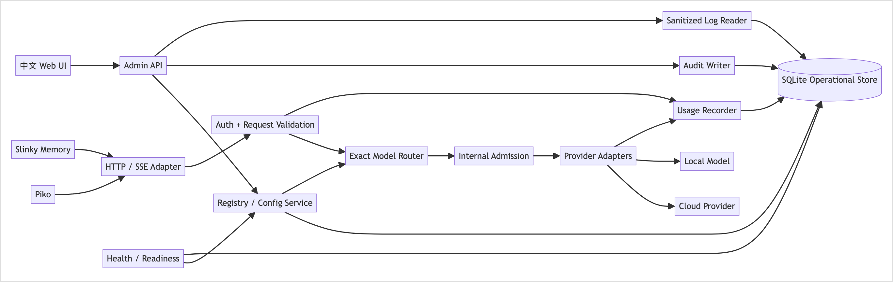
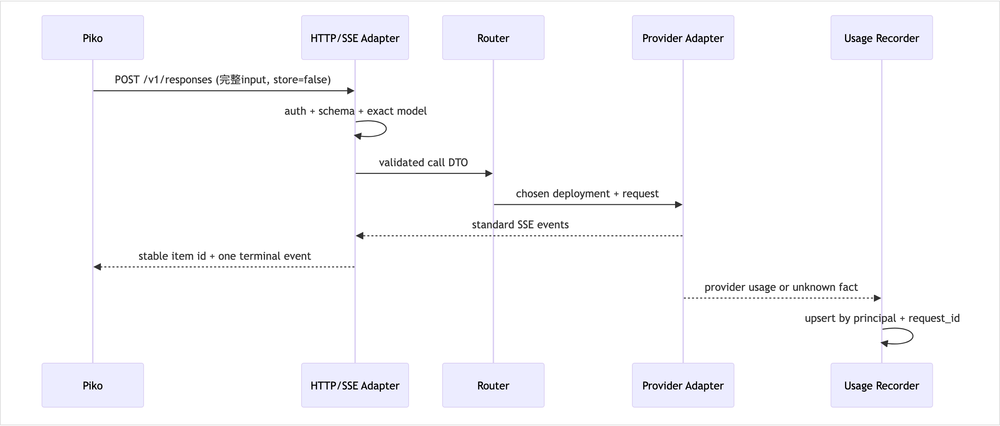

<!-- STD_DOCUMENT_COVER_BEGIN -->
# LLMTier V0.3 内部模块设计

| 文档字段 | 值 |
|---|---|
| Document ID | `llmtier-core-module-design` |
| Document Version | `0.3.0-draft.7` |
| Status | `In Review` |
| Project | `LLMTier` |
| Authority | `LLMTier` |
| Document Owner | LLMTier |
| Authors | llmtier |
| Reviewer | Piko、Slinky、LLMTier |
| Approver | LLMTier |
| Approval Date | 待定 |
| Created Date | `2026-09-17` |
| Last Modified Date | `2026-09-22` |
| Template Version | `1.0.0` |
| Template ID | `design.definition` |
| Template Conformance | `tailored` |
| Tailoring Reference | `std-tailoring` |
| Migration Map Reference | none |
| Repository | `corezilla/LLMTier` |
| Canonical Path | `docs/40_module_design/llmtier-core-design.md` |
| Supersedes | none |
<!-- STD_DOCUMENT_COVER_END -->

## 1. 目的与边界

本文把单一 LLMTier 软件系统拆成可独立实现和测试的内部模块，不建立虚构 subsystem。外部字段仍以 OpenAPI `0.3-simplified-candidate.8` 为唯一 authority。LLMTier 无 Agent 会话状态：Piko 每次提供完整输入并执行工具；Slinky 管业务与 Memory。

## 2. 模块图

[可编辑 SVG 源](../assets/diagrams/diagram-core-module-graph.svg)

## 3. 模块职责

| 模块 | 输入/输出 | 必须负责 | 明确不负责 |
|---|---|---|---|
| HTTP/SSE Adapter | OpenAPI request/标准SSE | content type、SSE顺序、terminal、request ID | Agent history、工具执行、未消费JSON并行模式 |
| Auth/Validation | bearer、body、trace | principal、schema、exact model可见性 | SourceInstance、业务Session |
| Exact Model Router | logical model、Registry snapshot | 大小写精确选择；同等级后端 | alias、跨等级fallback |
| Internal Admission | 已验证请求 | Deployment并发、Provider账号并发/最小间隔/RPM、队列、timeout、429 | 外部Seat/capacity产品 |
| Provider Adapter | 标准内部调用DTO | 云/本地协议映射、标准usage归一 | provider KV identity对外化 |
| Usage Recorder | request ID、provider事实 | 每request唯一record、版本替换、unknown、最终Provider归属 | Cost、业务任务汇总 |
| Account Usage Reader | operator显式刷新 | MiniMax API Key与火山AK/SK只读用量、持久快照 | 自动轮询、cookie抓取、计费结算 |
| Registry/Config | Admin command | provider/deployment/level事务、embedding space约束 | 调用方管理 |
| Audit Writer | 管理动作结果 | 脱敏审计 | prompt/output/Secret |
| Sanitized Log Reader | operator filter/cursor | 查询写入前已脱敏的有界运行事件、稳定分页、503故障显式化 | 原始日志、prompt/output/reasoning/vector/credential、mutation |
| Health/Readiness | store/registry/provider状态 | 无副作用健康、可接流量判断 | 主动收费probe |
| Web UI | Admin API | 四个英文短页；主页全量状态、Provider账号用量、独立日志页 | 直读DB/config/Secret |

## 4. 唯一配置 authority

SQLite Operational Store 是初始化后的唯一运行配置 authority。`config/settings.json`只允许作为空库首次启动时的一次性 bootstrap 输入：

1. 启动事务检查 `store_initialized=false`；
2. 校验完整配置、引用和Secret reference可用性；
3. 同一事务写入版本化Registry、bootstrap hash、`store_initialized=true`和Audit；
4. 任一步失败则回滚，服务保持not_ready；
5. 初始化后即使文件变化也不自动重导入，Admin写入只落SQLite；
6. 再导入必须是Operator显式离线迁移，先备份并使用单一版本迁移命令，不双写。

Secret明文不进入SQLite；只保存Secret reference与其非敏感版本。

## 5. Responses 与 SSE 内部流程

[可编辑 SVG 源](../assets/diagrams/diagram-core-responses-flow.svg)

固定Pi首阶段：`stream=true`、`store=false`；允许普通function tools、assistant/function/reasoning历史和标准reasoning/refusal事件。不启用grammar/deferred/custom tools或prompt cache协议。Opaque reasoning由Piko保存并在后续完整输入中重放；LLMTier不把它变成Conversation。

## 6. Usage事务与查询

- 每个通过验证并分配服务端`request_id`的HTTP attempt最多有一个逻辑UsageRecord。
- 主键为内部认证principal + request_id；不使用Agent/Run/Project/SourceInstance。
- 首次分配服务端`request_id`后、任何provider dispatch之前，先持久写入`UsageObligation`和version 1 unknown事实；该写入失败则不得dispatch。模型结果成功不因后续计量更新失败而改为失败，但持久unknown事实必须保留，使重启后不会把“已发生但计量缺失”误报为“没有调用”。
- unknown/estimated可由更高`record_version`追加新版本为measured；`UsageRecordVersion`不可变，`UsageHead`只原子推进到更高版本。消费者按request_id选择指定snapshot冻结的版本，绝不把版本相加。
- `recorded_at`固定为首次记录时间，`updated_at`随替换推进；`is_final=true`后不可降级或改小版本。
- 第一页在同一事务创建有期限的`QuerySnapshot`，固化有序成员`(principal, request_id, record_version)`；后续页按这些不可变版本读取，因此页间发生的更正、插入或删除只对新snapshot可见。Admin列表的snapshot同样固化授权范围内的序列化view与ETag，避免更新/删除改变后续页。
- cursor绑定principal、当前权限摘要、from/to/model/request_id、snapshot ID和最后位置；每页重新核验当前权限。权限缩小、filter不符、签名错误或snapshot到期均使用既有400 `invalid_request`，不返回混合页；排序为`(recorded_at, request_id)`。snapshot最少存活到服务配置的分页TTL，TTL必须覆盖正常完成一次分页的时间并在运维文档中固定。
- 查询区间为`[from,to)`；store不可用返回503 `usage_store_unavailable`，不得返回空页冒充无记录。
- 标准模型响应Usage与查询中的同request记录是同一事实的即时值与持久值，Piko只能核对/替换，不能相加。
- `input_tokens`包含cached token，cached是input子集；`reasoning_tokens`是output子集；cache-write仅作细分观测，不重复加入total。

## 7. Registry与Embedding不变量

一个`service_level_id`为embedding模型时必须固定：`embedding_space_id`、允许维数、每批输入上限、单项token上限、归一化/预处理兼容事实。绑定的所有deployment必须属于同一向量空间；仅维数相同不够。非兼容模型/版本/预处理变更必须创建新逻辑model ID，旧ID不可原地切换，Slinky据新ID新建索引generation。

配置发布事务先验证所有引用与上述不变量，再原子推进Registry version和Audit；失败不改变active snapshot。

首版Registry必须包含唯一的embedding逻辑等级：

| 字段 | 固定值/规则 |
|---|---|
| service level | `Embedding-v1` |
| backend | 本地OpenAI-compatible `BAAI/bge-m3` dense family endpoint；物理Provider模型ID按runtime实际ID配置 |
| space | `bge-m3-dense-1024-v1` |
| dimensions | 仅1024；省略`dimensions`等价于1024 |
| max input | 单项8192 provider tokens |
| max batch | 32 inputs/request（LLMTier运行上限） |
| preprocessing | provider tokenizer；不改写正文；无query instruction；dense + L2 normalization |
| immutable evidence | model/tokenizer revision、runtime image digest、normalization设置 |

immutable evidence未固定或与Registry不一致时deployment不得变为healthy。模型、tokenizer、pooling或normalization
变化必须新建space ID；只有batch资源上限变化可以保持space ID。

## 8. 内部Admission与路由

- admission scope是单个deployment；首版`max_in_flight=1`，一个exact service level最多排队32项，FIFO。
- 只将请求放入其exact service level队列；没有任何alias、跨等级或provider-direct旁路。
- eligible deployment必须enabled、healthy、能力覆盖请求；Embedding还必须匹配同一space及维数。
- 选择最少in-flight者；相同按持久`ordinal`，保证重启后策略不漂移。请求出队后再次核验Registry version和健康。
- 队列满或等待30秒无许可返回标准429；`Retry-After`为1至30秒的保守整数。全部候选unhealthy返回503。
- provider connect/first-byte timeout为30秒，SSE idle timeout为60秒。超时释放内部许可并记录Usage/Audit事实，
  不生成外部Invocation或结果恢复状态。
- 许可、队列深度和timeout只作内部指标；它们不是外部容量承诺。未来调高并发必须有同backend负载证据和审计变更。

## 9. Admin并发与授权

- GET item返回强ETag；PATCH/DELETE必须提供`If-Match`。
- ETag不匹配返回412 `version_conflict`；引用占用返回409 `resource_in_use`。
- PATCH只修改出现字段；Secret字段省略表示保持，显式null表示移除。
- 删除的引用检查、删除和Audit在同一SQLite事务完成。
- 401表示凭据无效，403表示凭据有效但无operator权限；两者不泄露资源存在性。
- 列表采用limit/cursor，并复用§6的持久`QuerySnapshot`；cursor绑定当前权限、filter和snapshot。资源在第一页后更新或删除时，旧snapshot仍返回第一页冻结的view；新snapshot才看到变化。权限每页复核，snapshot到期或权限缩小返回400 `invalid_request`。

## 10. 失败与恢复

Provider连接失败、timeout或SSE缺terminal由Adapter映射标准typed error并记录脱敏request ID。LLMTier不提供Invocation恢复；Piko按任务策略处理。内部队列和provider failover仅限同exact logical level，Embedding还需满足同space约束。重启先恢复SQLite、Registry snapshot和审计连续性，再通过readyz；不得以legacy settings覆盖Store。

## 11. 验证分配

| Oracle | Owner测试 |
|---|---|
| 固定Pi首轮、assistant/history、function output | contract fixtures + Piko consumer复审 |
| SSE item ID、terminal、reasoning/refusal | semantic validator |
| Usage unknown、子集/source、单调版本与持久缺口 | schema + semantic validator + crash-order fixture |
| Usage/Admin分页期间更正、插入、删除与cursor到期 | snapshot sequence fixture |
| ETag/If-Match/partial patch | Admin contract tests |
| Embedding same-space | Registry publish tests |
| bootstrap唯一authority | store migration/operations tests |

静态通过不表示provider或runtime已经实现；`runtime_activation=false`。
