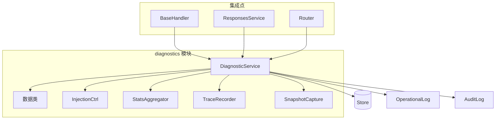
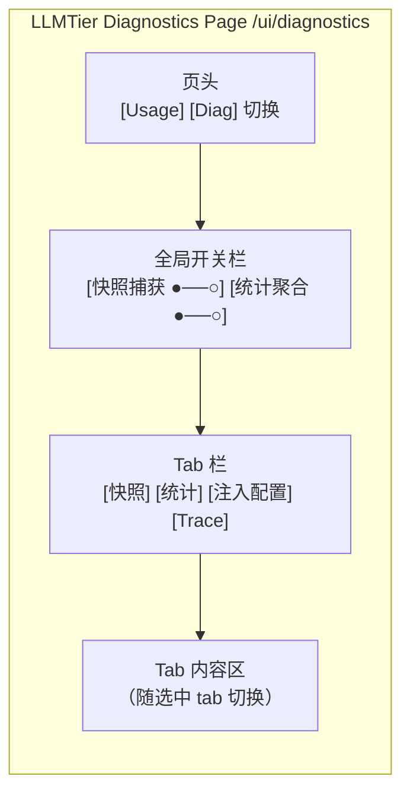
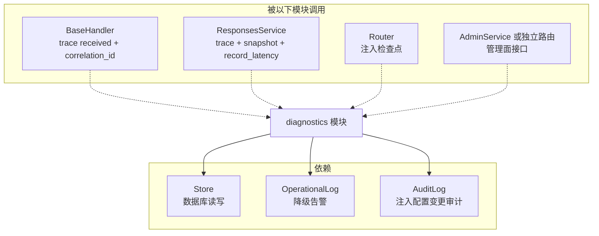

<!-- STD_DOCUMENT_COVER_BEGIN -->
# LLMTier Diagnostics 模块设计

> STD 使用入口：[项目采用说明与标准导航](../../README.md#std-entry）

| 文档字段 | 值 |
|---|---|
| Document ID | `llmtier-diagnostics-module-design` |
| Document Version | `0.1.0-draft.4` |
| Status | `Draft` |
| Project | `LLMTier` |
| Authority | `LLMTier` |
| Document Owner | LLMTier |
| Authors | llmtier |
| Created Date | `2026-09-22` |
| Last Modified Date | `2026-09-22` |
| Template ID | `design.definition` |
| Template Version | `1.0.0` |
| Template Conformance | `tailored` |
| Tailoring Reference | `std-tailoring` |
| Migration Map Reference | none |
| Repository | `corezilla/LLMTier` |
| Canonical Path | `docs/40_module_design/llmtier-diagnostics-design.md` |
| Supersedes | none |
<!-- STD_DOCUMENT_COVER_END -->

## 1. 目的与边界

`diagnostics` 模块是 LLMTier V0.3 的可观测性子系统，为 Piko 联调提供：
- LT-OBS-1：上游调用环回快照
- LT-OBS-2：数据面统计（P50/P95）
- LT-OBS-5：运行时故障注入开关
- LT-OBS-6：单请求全链路 trace
- LT-OBS-7：Consumer 关联标识透传

**模块边界**：diagnostics 是独立子模块，通过 `Store`、`OperationalLog`、`AuditLog` 与核心系统交互，不直接干预 Data Plane 推理路径（注入开关除外）。

## 2. 模块图



## 3. 模块职责

| 子组件 | 职责 |
|---|---|
| `DiagnosticService` | 统一入口，聚合所有诊断功能 |
| `InjectionCtrl` | 注入配置 CRUD，按 deployment 管理开关 |
| `StatsAggregator` | 内存缓存聚合统计，TTL cleanup |
| `TraceRecorder` | trace_events 写入，按 request_id 查询 |
| `SnapshotCapture` | diagnostic_snapshots 写入，分页查询 |
| `数据类` | `DiagnosticSnapshot`、`DiagnosticInjection` 等数据结构 |

## 4. 公开接口

### 4.1 DiagnosticService 公共 API

```python
class DiagnosticService:
    # ---- 全局开关（LT-OBS-1/2 总开关）----
    def get_diagnostics_settings(self) -> dict:
        """获取全局调试开关状态 {snapshots_enabled, stats_enabled}。"""

    def update_diagnostics_settings(self, snapshots_enabled: bool | None = None,
                                     stats_enabled: bool | None = None) -> dict:
        """更新全局调试开关（部分更新，None 表示保持原值）。"""

    def snapshots_enabled(self) -> bool:
        """当前快照捕获是否开启。"""

    def stats_enabled(self) -> bool:
        """当前统计聚合是否开启。"""

    # ---- 快照（LT-OBS-1）----
    def capture_snapshot(
        self,
        request_id: str,
        upstream_url: str,
        backend_model: str | None,
        http_status: int,
        latency_ms: float,
        error_summary: str | None,
        model: str | None,
        deployment_id: str | None,
        snapshot_type: str = "upstream",
    ) -> str:
        """捕获上游快照，返回 snapshot_id。失败时记录 warning 并返回空字符串。"""

    def list_snapshots(
        self,
        since: str | None = None,
        until: str | None = None,
        deployment_id: str | None = None,
        model: str | None = None,
        limit: int = 50,
        cursor: str | None = None,
    ) -> dict:
        """分页查询快照，返回 {items, next_cursor, has_more}。"""

    # ---- 统计（LT-OBS-2）----
    def record_latency(
        self,
        deployment_id: str | None,
        model: str | None,
        http_status: int,
        latency_ms: float,
    ) -> None:
        """每次 Data Plane 请求完成后调用，追加到内存缓存。"""

    def get_stats(
        self,
        since: str | None = None,
        until: str | None = None,
        deployment_id: str | None = None,
        model: str | None = None,
    ) -> dict:
        """查询统计数据，返回 request_count、error_4xx_count、error_5xx_count、P50/P95/min/max。"""

    # ---- 注入（LT-OBS-5）----
    def get_injections(self, deployment_id: str) -> list[dict]:
        """获取某 deployment 所有注入配置（包括 enabled=False）。"""

    def upsert_injections(self, deployment_id: str, injections: list[dict]) -> None:
        """批量 upsert 注入配置（部分更新：列表中有该 type 则 upsert，无则保持现状）。"""

    def get_enabled_injections(self, deployment_id: str) -> list[dict]:
        """获取某 deployment 所有 enabled=True 的注入配置（可能多个同时生效）。"""

    # ---- Trace（LT-OBS-6）----
    def record_trace(
        self,
        request_id: str,
        stage: str,
        detail: dict | None = None,
        correlation_id: str | None = None,
    ) -> None:
        """写入 trace_events 记录。失败时记录 warning 并继续。"""

    def get_trace(self, request_id: str) -> dict:
        """查询某 request_id 的完整 trace（包含 stages 和 usage 数据）。"""

    # ---- TTL Cleanup ----
    def cleanup_old_records(self) -> int:
        """删除 7 天前的 snapshots 和 trace_events，返回删除总条数。"""
```

### 4.2 管理面路由

| 路由 | 方法 | 描述 |
|---|---|---|
| `GET /v1/diagnostics` | GET, PATCH | **全局调试开关**（snapshots_enabled / stats_enabled） |
| `GET /v1/diagnostics/snapshots` | GET | LT-OBS-1 快照查询（分页） |
| `GET /v1/diagnostics/stats` | GET | LT-OBS-2 统计查询 |
| `GET /v1/deployments/{id}/diagnostics` | GET, PATCH | LT-OBS-5 注入配置查询/修改 |
| `GET /v1/trace/{request_id}` | GET | LT-OBS-6 trace 查询 |

### 4.3 WebUI 诊断页面

**路由**：`/ui/diagnostics`（与 `/ui/usage` 并列）

**Tabs**：

| Tab | 内容 | 对应 API |
|---|---|---|
| 快照 | 快照列表查询、分页、筛选 | `GET /v1/diagnostics/snapshots` |
| 统计 | P50/P95/请求数/错误数 图表 | `GET /v1/diagnostics/stats` |
| 注入 | per-deployment 注入配置开关 | `GET/PATCH /v1/deployments/{id}/diagnostics` |
| Trace | request_id 查询 trace | `GET /v1/trace/{request_id}` |

**全局开关**：`/ui/diagnostics` 页面顶部有全局调试开关 toggle：
- `快照捕获：`ON/OFF
- `统计聚合：`ON/OFF
- 对应 `GET/PATCH /v1/diagnostics`

**布局参考**：



## 5. 数据结构

### 5.1 DiagnosticSnapshot

```python
@dataclass
class DiagnosticSnapshot:
    id: str                           # "snap_{uuid}"
    request_id: str
    captured_at: str                  # ISO 8601
    upstream_url: str                 # 已脱敏（移除 query string）
    backend_model: str | None
    http_status: int | None
    latency_ms: float | None
    error_summary: str | None         # UTF-8 安全截断 256 字节
    model: str | None
    deployment_id: str | None
    snapshot_type: str = "upstream"   # 'upstream' | 'error'
```

### 5.2 DiagnosticInjection

```python
@dataclass
class DiagnosticInjection:
    id: str
    deployment_id: str
    injection_type: str               # 'fault_502'|'fault_503'|'delay'|'rate_limit'|'stream_terminate'|'malformed_event'
    enabled: bool
    # 配置字段（按 type 共用列）
    fault_status: int | None = None
    fault_body: str | None = None
    delay_ms: int | None = None
    retry_after_sec: int | None = None
    stream_terminate_after_events: int | None = None
    malformed_after_events: int | None = None
    malformed_event_type: str | None = None
    config_json: str = "{}"
    created_at: str = ""
    updated_at: str = ""
```

## 6. 模块依赖



## 7. 错误处理策略

| 场景 | 策略 |
|---|---|
| `capture_snapshot` 写入失败 | 记录 warning 到 `operational_logs`，返回空字符串，不抛异常 |
| `record_latency` 缓存满 | 记录 warning，LRU 淘汰最旧条目，继续运行 |
| `record_trace` 写入失败 | 记录 warning，继续运行 |
| `DiagnosticService` 初始化失败 | 记录 error，继续运行（fail-open，Data Plane 不受影响） |

## 8. 持久化数据（4 张新表）

| 表 | 用途 | 主键 |
|---|---|---|
| `diagnostic_snapshots` | LT-OBS-1 上游快照 | `id` (TEXT) |
| `diagnostic_injections` | LT-OBS-5 注入配置 | `id` (TEXT)，UNIQUE(deployment_id, injection_type) |
| `data_plane_stats` | LT-OBS-2 统计聚合 | `id` (TEXT) |
| `trace_events` | LT-OBS-6 trace 事件 | `id` (TEXT) |

详细 schema 见 `docs/50_implementation_design/llmtier-diagnostics.isd.md`。

## 9. 实现检查清单

- [ ] `migrations/002_diagnostics.sql` 创建 4 张表
- [ ] `diagnostics.py` 实现 `DiagnosticService` 及各子组件
- [ ] `logs.py` 的 `MODULE_KEYS` 注册 `'diagnostics'`
- [ ] `app.py` 创建 `DiagnosticService` 实例并注册管理面路由
- [ ] 全局调试开关存储（settings 或独立小表 `diagnostic_settings`）
- [ ] `BaseHandler._run()` 集成 trace received + correlation_id 提取
- [ ] `responses.py` 集成 trace 各阶段 + snapshot + record_latency
- [ ] 注入检查集成（Phase 5a：delay/fault/rate_limit）
- [ ] TTL cleanup job（应用内 24h 定时）
- [ ] WebUI 新增 `/ui/diagnostics` 页面（4 tabs：快照/统计/注入/Trace）
- [ ] WebUI 全局开关 toggle 组件
- [ ] 单元测试
- [ ] B-class 系统测试（API + WebUI）

## 10. 参考

- [可观测性子系统系统设计](../20_system_design/llmtier-observability-subsystem-design-v0.1.md)
- [Diagnostics ISD](../50_implementation_design/llmtier-diagnostics.isd.md)
- `docs/40_module_design/llmtier-core-design.md` — 核心模块设计参考
- `docs/40_module_design/webui-design.md` — WebUI 设计参考
