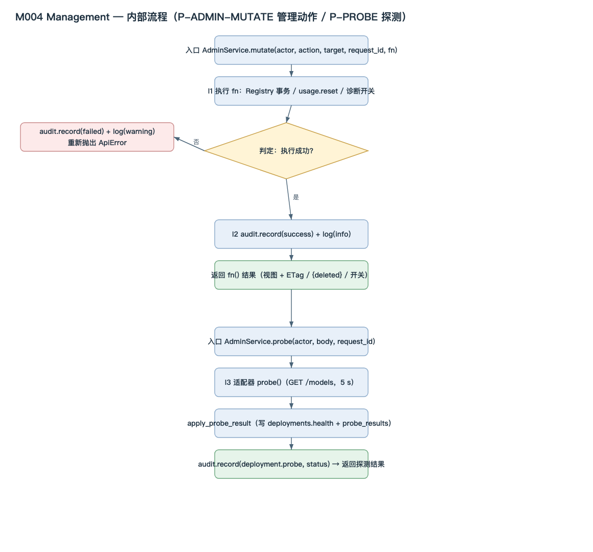

<!-- STD_DOCUMENT_COVER_BEGIN -->
# LLMTier M004 Management 模块设计

> STD 使用入口：[项目采用说明与标准导航](../../../README.md#std-entry)

| 文档字段 | 值 |
|---|---|
| Document ID | `management` |
| Document Version | `0.1.0-draft.2` |
| Status | `Draft` |
| Project | `LLMTier` |
| Authority | `LLMTier` |
| Document Owner | LLMTier |
| Authors | llmtier |
| Created Date | `2026-09-23` |
| Last Modified Date | `2026-09-23` |
| Template ID | `design.definition` |
| Template Version | `2.4.0` |
| Template Conformance | `tailored` |
| Tailoring Reference | `std-tailoring` |
| Migration Map Reference | none |
| Repository | `corezilla/LLMTier` |
| Canonical Path | `docs/40_module_design/management-design.md` |
| Supersedes | none |
<!-- STD_DOCUMENT_COVER_END -->

## 1. 单元摘要：为什么存在

| 项目 | 内容 |
|---|---|
| 模块编号 / 正式英文名称 | **M004** / Management |
| 直属父对象编号 / 名称 | LLMTier 软件系统（本项目无子系统）|
| 父设计 Document ID / 登记位置 | `llmtier-system-design` / 系统设计 §3.2（唯一登记表）|
| 上级系统 / 父单元 | LLMTier 软件系统 |
| 解决的问题 | 配置从哪里来、如何校验与生效、如何审计；provider 账号用量与运行日志如何被 operator 查询——把"配置权威 + 管理动作 + 证据查询"集中到一处 |
| 提供的能力 | provider/deployment/逻辑等级配置的事务化维护（bootstrap + CRUD + ETag）；探测并落库健康；用量查询与范围清空；审计/日志/统计查询；provider 账号用量快照 |
| 主要使用者 | M001 HTTP API（管理面调用）、M002 Web UI、M003 Inference（只读等级能力）|
| 不负责 | 模型推理（M003）；账本持久化机制本身（M-METER，由 M007 落库）；观测记录（M005/M006）|

### 1.1 继承的上级约束与落实方式

#### 1.1.1 `C-CFG-1` · 初始化后 SQLite 是唯一运行权威
- **上级基线与决定状态**：系统设计 §3.4/§10；已采用
- **适用条件**：bootstrap 之后
- **继承预算或行为保证**：文件不再影响运行；不双写
- **可自行选择 / 不可改变**：存储布局可自选；唯一权威不可变
- **本地落实 / 内部再分配**：I1 配置权威；§8
- **验证方法与结果 / 证据**：`VRC-MGMT-001`；NOT_RUN
- **差距 / 变更影响 / 反馈责任**：无

#### 1.1.2 `C-CFG-2` · Secret 只存引用
- **上级基线与决定状态**：系统设计 §10；已采用
- **适用条件**：provider 写入
- **继承预算或行为保证**：明文不入库/不入响应/不入 UI
- **可自行选择 / 不可改变**：引用形式固定（`env:`/`file:`）
- **本地落实 / 内部再分配**：I1 校验；§8、§11
- **验证方法与结果 / 证据**：`VRC-MGMT-001`；NOT_RUN
- **差距 / 变更影响 / 反馈责任**：无

#### 1.1.3 `C-CFG-3` · 先验证再原子推进
- **上级基线与决定状态**：系统设计 §3.4；已采用
- **适用条件**：配置发布
- **继承预算或行为保证**：引用/能力不变量通过才提交；失败不改 active snapshot
- **可自行选择 / 不可改变**：事务实现可自选；原子性不可变
- **本地落实 / 内部再分配**：I1 发布事务；§8、§10
- **验证方法与结果 / 证据**：`VRC-MGMT-002`；NOT_RUN
- **差距 / 变更影响 / 反馈责任**：无

#### 1.1.4 `C-CFG-4` · 变更失败回滚
- **上级基线与决定状态**：系统设计 §3.4；已采用
- **适用条件**：任意管理变更
- **继承预算或行为保证**：失败保持旧版本
- **可自行选择 / 不可改变**：—
- **本地落实 / 内部再分配**：I1 + Store 事务；§10
- **验证方法与结果 / 证据**：`VRC-MGMT-002`；NOT_RUN
- **差距 / 变更影响 / 反馈责任**：无

#### 1.1.5 `C-CFG-5` · 初始化失败 not_ready
- **上级基线与决定状态**：系统设计 §10；已采用
- **适用条件**：启动引导
- **继承预算或行为保证**：引导失败服务 not_ready
- **可自行选择 / 不可改变**：—
- **本地落实 / 内部再分配**：I3 引导；§10
- **验证方法与结果 / 证据**：`VRC-MGMT-003`；NOT_RUN
- **差距 / 变更影响 / 反馈责任**：无

#### 1.1.6 `C-METER-4` · 查询稳定分页
- **上级基线与决定状态**：机制 M-METER §3.1；已采用
- **适用条件**：用量/审计/日志分页
- **继承预算或行为保证**：snapshot 冻结；权限每页复核
- **可自行选择 / 不可改变**：cursor 实现可自选；冻结不可变
- **本地落实 / 内部再分配**：I2 分页；§8
- **验证方法与结果 / 证据**：`VRC-MGMT-004`；NOT_RUN
- **差距 / 变更影响 / 反馈责任**：与 M-METER 一致

## 2. 需求、功能与验收条件

### 2.1 `F-MGMT-BOOTSTRAP` · 首次引导
- **上级需求 / Constraint ID**：`C-CFG-1/2/3/5`；机制 M-CONFIG CAP-CFG-BOOTSTRAP
- **调用方**：启动（`__main__`）
- **输入与前提**：空库 + 显式 settings 路径
- **行为**：迁移 schema → 校验字段/ID/引用/Secret 可达 → 单事务写入 providers/deployments/levels + `bootstrap_sha256` + 审计
- **输出**：库内 Registry + hash
- **错误与边界**：503 `bootstrap_required`/`bootstrap_invalid`；失败回滚、not_ready
- **验收条件**：空库无路径 → 503；重复启动 no-op；非法引用回滚

### 2.2 `F-MGMT-CRUD` · 配置增删改查
- **上级需求 / Constraint ID**：`C-CFG-1/3/4`；机制 M-CONFIG CAP-CFG-CRUD
- **调用方**：M001（`/tier/admin/v1/providers`、`/tier/admin/v1/deployments`、`/tier/admin/v1/service-levels`）
- **输入与前提**：operator 凭据；`If-Match`（PATCH/DELETE）
- **行为**：事务化 CRUD + 能力/不变量校验 + 审计；`version+1`
- **输出**：视图 + `ETag`
- **错误与边界**：400/404/409 `resource_conflict`/`resource_in_use`/412 `version_conflict`/409 `fixed_service_level`
- **验收条件**：ETag 串行化；引用保护；能力交集正确

### 2.3 `F-MGMT-PROBE` · 探测
- **上级需求 / Constraint ID**：机制 M-CONFIG（探测）
- **调用方**：M001（`POST /v1/probes`）
- **输入与前提**：`{deployment_id, confirm_external_call=true}`
- **行为**：适配器 `probe()` → `apply_probe_result` 写健康 → 审计
- **输出**：`{deployment_id, status, checked_at}`
- **错误与边界**：400 `confirmation_required`；404
- **验收条件**：未确认不触网；探测结果落库

### 2.4 `F-MGMT-USAGE-QUERY` · 用量查询
- **上级需求 / Constraint ID**：`C-METER-4`；机制 M-METER CAP-METER-QUERY/ADMIN
- **调用方**：M001（`GET /v1/usage`）
- **输入与前提**：`from/to`（`[from,to)`）、可选 `model/request_id/cursor/limit`
- **行为**：首屏建 snapshot 冻结成员；后续页按冻结视图
- **输出**：`{data,next_cursor,has_more,snapshot_id,snapshot_at}`
- **错误与边界**：400 `invalid_request`/`cursor_expired`；403；503 `usage_store_unavailable`
- **验收条件**：同 request 只取最高版本；旧页不受后续更正影响

### 2.5 `F-MGMT-USAGE-RESET` · 范围清空
- **上级需求 / Constraint ID**：机制 M-METER CAP-METER-RESET
- **调用方**：M001（`DELETE /v1/usage`，admin）
- **输入与前提**：可选 `model`/`deployment_id`
- **行为**：单事务删除义务/版本/head/绑定（`_del_pairs`）
- **输出**：`{deleted}`
- **错误与边界**：403
- **验收条件**：范围与计数一致；孤儿清理

### 2.6 `F-MGMT-STATS` · 统计聚合
- **上级需求 / Constraint ID**：机制 M-METER（统计视图）
- **调用方**：M001（`GET /v1/stats`）
- **输入与前提**：`from/to/group_by ∈ {tier,deployment}`
- **行为**：按最高 record version 聚合 calls/tokens
- **输出**：`{from,to,group_by,data[]}`
- **错误与边界**：400 `invalid_request`（group_by/缺时间）
- **验收条件**：只聚合 head 版本；measured/unknown 分列

### 2.7 `F-MGMT-AUDIT` · 审计查询
- **上级需求 / Constraint ID**：机制 M-CONFIG（审计）
- **调用方**：M001（`GET /v1/audit`）
- **输入与前提**：`limit`
- **行为**：按时间倒序分页
- **输出**：脱敏 `{id,actor,action,target,result,created_at}`
- **错误与边界**：—
- **验收条件**：不含 prompt/output/Secret

### 2.8 `F-MGMT-LOGS` · 运行日志查询
- **上级需求 / Constraint ID**：机制 M-OBS（日志）
- **调用方**：M001（`GET /v1/logs`）
- **输入与前提**：`from/to` + 可选 `level/module/request_id`
- **行为**：查询**写入前已脱敏**的结构化日志
- **输出**：`{data[]}`
- **错误与边界**：400（缺时间）；503
- **验收条件**：脱敏字段；不返回正文/凭据

### 2.9 `F-MGMT-ACCOUNT-USAGE` · provider 账号用量
- **上级需求 / Constraint ID**：机制 M-CONFIG（账号用量只读）
- **调用方**：M001（`GET`/`POST /v1/providers/{id}/usage`）
- **输入与前提**：GET 只读快照；POST 需 `confirm_external_call=true`
- **行为**：GET 读库；POST 调 provider usage API 并持久化快照
- **输出**：账号用量快照（window/percent/reset_at）
- **错误与边界**：400 `invalid_request`；404；快照 `unavailable`+`error`
- **验收条件**：GET 不触网；缺字段保持 Unknown

## 3. UI、CLI、服务端点或设备操作面

**N/A — 本模块没有直接操作面。** 管理面端点由 **M001 HTTP API** 暴露、由 **M002 Web UI** 呈现；M004 只提供内部管理服务对象。Tailoring 依据：系统设计 §3.2 规定入口层终止 HTTP/SSE。

## 4. 外部边界与依赖

#### 4.1 `DEP-M001` · HTTP API（调用方）
- **角色 / 运行位置 / Owner**：调用方；同进程；LLMTier
- **本模块调用或消费**：—
- **本模块提供**：`Registry.*`、`AdminService.*`、`UsageRecorder.page/reset_usage`、`AuditLog.page`、`OperationalLog.page`、`AccountUsageService.*`
- **契约 authority / 版本 / selector**：本文 §9；对外 OpenAPI 由 M001 映射
- **同步方式 / timeout / 生命周期**：同步；请求级
- **不可用或失败影响 / 责任出口**：`ApiError` 冒泡到 M001

#### 4.2 `DEP-M003` · Inference（探测经适配器）
- **角色 / 运行位置 / Owner**：依赖；同进程；LLMTier
- **本模块调用或消费**：`providers/openai.py`、`providers/local.py`（探测/列模型）
- **本模块提供**：—
- **契约 authority / 版本 / selector**：`llmtier-inference-stream-mechanism` §14.4 `R-INF-05`
- **同步方式 / timeout / 生命周期**：同步；探测 5 s
- **不可用或失败影响 / 责任出口**：探测失败 → `unhealthy`

#### 4.3 `DEP-M007` · util（存储）
- **角色 / 运行位置 / Owner**：依赖；同进程；LLMTier
- **本模块调用或消费**：`Store.transaction/one/all/connection`
- **本模块提供**：—
- **契约 authority / 版本 / selector**：`llmtier-config-lifecycle-mechanism` §14.4 `R-CFG-03`
- **同步方式 / timeout / 生命周期**：同步
- **不可用或失败影响 / 责任出口**：存储错误 → 请求失败

#### 4.4 `DEP-M005/M006` · Observability（诊断开关）
- **角色 / 运行位置 / Owner**：依赖；同进程；LLMTier
- **本模块调用或消费**：诊断开关/注入（管理动作转发）
- **本模块提供**：—
- **契约 authority / 版本 / selector**：`llmtier-observability-mechanism` §14.4 `R-OBS-02`
- **同步方式 / timeout / 生命周期**：同步、fail-open
- **不可用或失败影响 / 责任出口**：观测不可用不阻塞管理面

#### 4.5 `DEP-USAGE-API` · Provider 账号用量 API（外部）
- **角色 / 运行位置 / Owner**：外部依赖；进程外；MiniMax / 火山
- **本模块调用或消费**：`GET https://www.minimaxi.com/v1/token_plan/remains`；火山 `GetCodingPlanUsage`
- **本模块提供**：—
- **契约 authority / 版本 / selector**：各 provider 官方 API
- **同步方式 / timeout / 生命周期**：同步 HTTP；15 s；显式刷新
- **不可用或失败影响 / 责任出口**：快照标 `unavailable`+`error`

## 5. 内部结构与实现位置

[可编辑 SVG 源](../assets/diagrams/diagram-m004-management-flow.svg)

图 M004-P1 · P-ADMIN-MUTATE 与 P-PROBE 内部流程；成功/失败审计分支展开。

### 5.1 内部组成

#### 5.1.1 `I1` · 配置权威（Registry）
- **职责与非职责**：bootstrap、provider/deployment/level 事务 CRUD、能力交集、候选查询；不承载推理
- **输入、处理与输出**：管理命令 → 视图 + ETag / 候选
- **协作对象**：I3、I5、M007
- **文件 / symbol / 实现状态**：`registry.py` `Registry.*`；Implemented
- **拆分依据与替代方案代价**：配置权威与入口分离，避免文件热载双写歧义

#### 5.1.2 `I2` · 管理动作编排
- **职责与非职责**：`mutate`（审计包裹）、分页快照、统计聚合；不做具体 CRUD
- **输入、处理与输出**：`(actor, action, target, request_id, fn)` → 结果；`data → 页`
- **协作对象**：I1、I5、I6、I8
- **文件 / symbol / 实现状态**：`admin.py` `AdminService.mutate/page/stats`；Implemented
- **拆分依据与替代方案代价**：把"审计 + 成功/失败"统一包裹，避免各调用点漏审计

#### 5.1.3 `I3` · 引导
- **职责与非职责**：空库首次引导、校验、单事务写入、not_ready；不处理运行期变更
- **输入、处理与输出**：settings 路径 → Registry + hash
- **协作对象**：I1、M007
- **文件 / symbol / 实现状态**：`registry.py` `bootstrap_settings` + `app.py` 启动装配；Implemented
- **拆分依据与替代方案代价**：引导独立于 CRUD，保证"一次性"

#### 5.1.4 `I4` · 探测
- **职责与非职责**：适配器探活、健康落库、审计；不做计费探测
- **输入、处理与输出**：`{deployment_id, confirm}` → `{status, checked_at}`
- **协作对象**：I1、I2、I5、M003 适配器
- **文件 / symbol / 实现状态**：`admin.py` `probe`、`health.py` `apply_probe_result`；Implemented
- **拆分依据与替代方案代价**：探测写 `deployments.health` + `probe_results`，与配置分离

#### 5.1.5 `I5` · 审计
- **职责与非职责**：脱敏审计写入与查询；不含 prompt/output/Secret
- **输入、处理与输出**：`(actor, action, target, result, request_id)` → 行
- **协作对象**：I1、I2、I4
- **文件 / symbol / 实现状态**：`audit.py` `AuditLog`；Implemented
- **拆分依据与替代方案代价**：审计独立于业务事务（管理动作成功后写）

#### 5.1.6 `I6` · 运行日志
- **职责与非职责**：写入前脱敏（`_SENSITIVE`）、结构化查询；不含原始日志
- **输入、处理与输出**：`(level, module, event, message, request_id)` → 行
- **协作对象**：I2、M001/M003
- **文件 / symbol / 实现状态**：`logs.py` `OperationalLog`；Implemented
- **拆分依据与替代方案代价**：脱敏在写入前完成，查询侧不再兜底

#### 5.1.7 `I7` · 账号用量
- **职责与非职责**：显式刷新 provider 账号用量并持久化快照；不自动轮询、不 cookie 抓取
- **输入、处理与输出**：`(provider_id, confirm)` → 快照
- **协作对象**：M007、M004 I5
- **文件 / symbol / 实现状态**：`account_usage.py` `AccountUsageService`；Implemented
- **拆分依据与替代方案代价**：MiniMax（API Key）与火山（AK/SK 签名）分实现

#### 5.1.8 `I8` · 用量查询与清空
- **职责与非职责**：分页/清空/范围语义；具体账本语义归 M-METER
- **输入、处理与输出**：`(principal, cursor, …)` → 页；`(model, deployment)` → 计数
- **协作对象**：I2、M007
- **文件 / symbol / 实现状态**：`usage.py` `UsageRecorder.page/reset_usage`；Implemented
- **拆分依据与替代方案代价**：读取/清空与写入分离

### 5.2 内部调用过程

#### 5.2.1 `CALL-MUTATE` · 一次管理动作
- **入口与调用上下文**：M001 → `AdminService.mutate`（请求线程）
- **调用链**：`mutate` → `fn()`（`Registry.create_*` / `update_*` / `delete_*` 或 `usage.reset_usage` 或 `diagnostics.set_*`）→ `audit.record` + `logs.record`
- **逐步传递的数据**：`(actor, action, target, request_id)`；`fn` 返回视图/计数/开关
- **返回、异常与清理**：成功 → result；异常 → 记 failed 后重抛
- **对应流程 / 接口 / 验证**：§7 P-ADMIN-MUTATE / `VRC-MGMT-002/004`

#### 5.2.2 `CALL-PROBE` · 一次探测
- **入口与调用上下文**：M001 → `AdminService.probe`
- **调用链**：`probe` → `get_deployment`/`get_provider` → `adapter.probe()` → `apply_probe_result` → `audit.record`
- **逐步传递的数据**：`deployment_id` → provider/endpoint/secret_ref → `bool` → 健康行
- **返回、异常与清理**：返回 `{status, checked_at}`；未确认 → 400
- **对应流程 / 接口 / 验证**：§7 P-PROBE / `VRC-MGMT-005`

#### 5.2.3 `CALL-QUERY` · 一次分页查询（用量/审计/日志）
- **入口与调用上下文**：M001 → `page` / `audit.page` / `logs.page`
- **调用链**：首屏建 `query_snapshots` 冻结 → 后续按 `ordinal` 读冻结视图
- **逐步传递的数据**：`(principal, cursor, filters)` → 冻结项
- **返回、异常与清理**：`{data, page}`；cursor 过期 → 400
- **对应流程 / 接口 / 验证**：§7 P-MGMT-QUERY / `VRC-MGMT-004`

### 5.3 文件间接口契约

#### 5.3.1 `IF-MGMT-01` · `app.py` → `registry.py`
- **签名 / 入口**：`Registry.create/get/list/update/delete_{provider,deployment,service_level}`、`candidates`、`bootstrap_settings`
- **输入与前置条件**：operator `Principal`；`If-Match`
- **输出 / 异常**：`(view, etag)`；400/404/409/412
- **ownership / 生命周期**：配置权威（Store）
- **实现与验证位置**：`registry.py`；`VRC-MGMT-001/002`

#### 5.3.2 `IF-MGMT-02` · `app.py` → `admin.py`
- **签名 / 入口**：`AdminService.mutate/page/stats/probe/list_provider_models`
- **输入与前置条件**：`(actor, action, target, request_id, fn)`
- **输出 / 异常**：结果 / 页 / 统计；`ApiError`
- **ownership / 生命周期**：请求级；审计行持久
- **实现与验证位置**：`admin.py`；`VRC-MGMT-002`

#### 5.3.3 `IF-MGMT-03` · `admin.py` → `audit.py` / `logs.py`
- **签名 / 入口**：`AuditLog.record`、`OperationalLog.record`
- **输入与前置条件**：脱敏字段
- **输出 / 异常**：行；存储错误
- **ownership / 生命周期**：持久（Store）
- **实现与验证位置**：`audit.py`、`logs.py`；`VRC-MGMT-003`

#### 5.3.4 `IF-MGMT-04` · `admin.py` → `health.py`
- **签名 / 入口**：`apply_probe_result(registry, deployment_id, status, request_id)`
- **输入与前置条件**：合法 `status`
- **输出 / 异常**：结果行；400/404
- **ownership / 生命周期**：更新 `deployments.health` + `probe_results`
- **实现与验证位置**：`health.py`；`VRC-MGMT-005`

#### 5.3.5 `IF-MGMT-05` · `app.py` → `account_usage.py`
- **签名 / 入口**：`AccountUsageService.latest/refresh`
- **输入与前置条件**：`provider_id`；refresh 需 `confirm_external_call=true`
- **输出 / 异常**：快照；400/404
- **ownership / 生命周期**：快照持久（`provider_usage_snapshots`）
- **实现与验证位置**：`account_usage.py`；`VRC-MGMT-006`

#### 5.3.6 `IF-MGMT-06` · `app.py` → `usage.py`（读/清空）
- **签名 / 入口**：`UsageRecorder.page`、`reset_usage`
- **输入与前置条件**：`principal`、cursor、范围
- **输出 / 异常**：页 / `{deleted}`；400/403/503
- **ownership / 生命周期**：账本持久（M-METER）
- **实现与验证位置**：`usage.py`；`VRC-MGMT-004`

### 5.4 服务提供方式（条件适用）

- **运行载体与入口**：N/A + 依据 —— 嵌入式库，由 M001 进程内调用
- **并发/线程模型**：N/A + 依据 —— 使用调用方线程；写路径用 `Store.transaction(immediate=True)` 串行化
- **初始化、Ready、生效与停止**：引导在 `Application.__init__`（`bootstrap_settings` + `ensure_fixed_tiers`）；失败置 `bootstrap_error` 供 `/readyz`
- **宿主装配、失败和资源回收责任**：由 M001/启动装配；无自有线程/fd

### 5.5 依赖方向

- **允许方向**：M001 → M004 → {M003(适配器), M005/M006, M007, M008, 外部 usage API}
- **禁止方向与原因**：M004 不得回调 M001/M002；不得直接承载推理
- **循环/越层检查**：`registry.py`/`admin.py` 不 import `app.py`
- **变更影响**：`Registry` 变更影响 M003 候选与 M001 管理面

## 6. 数据模型、状态与 ownership

#### 6.1 `Provider` / `Deployment` / `ServiceLevel` 视图
- **Authority / 定义位置**：`registry.py`（Store 表）；OpenAPI 视图
- **字段**：Provider `{id,name,kind,endpoint,has_secret,enabled,usage{...},request_usage{...},version}`；Deployment `{id,name,provider_id,backend_model,capabilities,enabled,health,version}`；ServiceLevel `{id,deployment_ids,enabled,capabilities,version}`
- **键与跨字段约束**：name 唯一；capabilities 12 键；`Embedding-v1` 冻结 space
- **Writer / Reader**：I1 写；M001/M003 读
- **创建、持有、借用/复制与释放**：持久（Store）；`version` 单调
- **状态转换 / 并发规则**：事务 + ETag 串行化
- **验证项**：`VRC-MGMT-001/002`

#### 6.2 `AuditEvent`
- **Authority / 定义位置**：`audit.py`（`audit_events`）
- **字段**：`id`、`actor`、`action`、`target`、`result`、`created_at`、`request_id`
- **键与跨字段约束**：脱敏（无 prompt/output/Secret）
- **Writer / Reader**：I5 写；I2 读
- **创建、持有、借用/复制与释放**：持久
- **状态转换 / 并发规则**：只追加
- **验证项**：`VRC-MGMT-003`

#### 6.3 `LogEvent`
- **Authority / 定义位置**：`logs.py`（`operational_logs`）
- **字段**：`id`、`created_at`、`level`、`module`、`event`、`message(≤512,已脱敏)`、`request_id`
- **键与跨字段约束**：写入前 `_SENSITIVE` 脱敏
- **Writer / Reader**：I6 / M001/M003 写；I2 读
- **创建、持有、借用/复制与释放**：持久；保留期由运维
- **状态转换 / 并发规则**：只追加
- **验证项**：`VRC-MGMT-003`

#### 6.4 `QuerySnapshot`（配置/审计/日志分页）
- **Authority / 定义位置**：`admin.py`/`usage.py`（`query_snapshots`/`query_snapshot_items`）
- **字段**：`snapshot_id`、`principal_id`、`snapshot_kind`、`filter_digest`、`created_at`、`expires_at`；item `ordinal`、`frozen_view_json`
- **键与跨字段约束**：TTL 10 分钟；权限每页复核
- **Writer / Reader**：I2/I8 写；I2 读
- **创建、持有、借用/复制与释放**：有期限，到期 400
- **状态转换 / 并发规则**：只写一次
- **验证项**：`VRC-MGMT-004`

#### 6.5 `AccountUsageSnapshot`
- **Authority / 定义位置**：`account_usage.py`（`provider_usage_snapshots`）
- **字段**：`provider`、`source`、`status`、`windows[]`、`checked_at`、`error`
- **键与跨字段约束**：缺失字段保持 Unknown
- **Writer / Reader**：I7 写；I2/M001 读
- **创建、持有、借用/复制与释放**：持久（每 provider 一行）
- **状态转换 / 并发规则**：显式刷新覆盖
- **验证项**：`VRC-MGMT-006`

## 7. 主流程与数据流

[可编辑 SVG 源](../assets/diagrams/diagram-m004-management-flow.svg)

图 M004-P1 · P-ADMIN-MUTATE 与 P-PROBE：管理动作统一经审计包裹（成功/失败分支）；探测写健康并审计。

**内部流程正文**：管理动作由 M001 调用 `mutate`，内部执行 `fn`（Registry 事务 / `reset_usage` / 诊断开关）；成功记 `success` 审计与 info 日志并返回结果，失败记 `failed` 审计与 warning 日志后重抛，`fn` 本身在 Store 事务内保证回滚。探测由 `probe` 二次确认后调用适配器 `probe()`，结果经 `apply_probe_result` 落库并审计。查询走 `query_snapshots` 冻结分页。

#### 7.1 `P-ADMIN-MUTATE` · 管理动作
- **触发/适用条件**：任意管理面写操作
- **图与正文位置**：本段 / 图 M004-P1
- **正常出口**：结果 + 审计(success)
- **异常出口**：`ApiError` + 审计(failed)

#### 7.2 `P-PROBE` · 探测
- **触发/适用条件**：`POST /v1/probes`
- **图与正文位置**：本段 / 图 M004-P1
- **正常出口**：`{status, checked_at}`
- **异常出口**：400 未确认；探测 false → `unhealthy`

#### 7.3 `P-MGMT-QUERY` · 分页查询
- **触发/适用条件**：用量/审计/日志查询
- **图与正文位置**：§5.2.3
- **正常出口**：冻结页
- **异常出口**：400 cursor 过期/不符

## 8. 关键算法与业务规则

#### 8.1 `RULE-MGMT-CAPS` · 等级能力 = 绑定 deployment 交集
- **输入前提 / 适用条件**：创建/更新 service level
- **算法 / 规则 / 选择依据**：对绑定集合取 12 键交集（bool 全真/值一致）；`Embedding-v1` 必须 embedding-only 且 space/dim/上限冻结
- **结果 / 不变量 / 边界**：无共同能力 → 409 `capability_conflict` / `embedding_space_conflict`
- **复杂度 / 资源限制**：O(deployments×keys)
- **允许替换范围 / 不可改变保证**：算法实现可自选；语义不可变
- **具体输入推演 / 验证项**：两个 deployment 能力不含共同 `responses` → 409；`VRC-MGMT-002`

#### 8.2 `RULE-MGMT-ETAG` · 乐观并发
- **输入前提 / 适用条件**：PATCH/DELETE
- **算法 / 规则 / 选择依据**：`ETag = "<id>.v<version>"`；`If-Match` 不等 → 412 + `current_version`
- **结果 / 不变量 / 边界**：`version` 单调 +1
- **复杂度 / 资源限制**：O(1)
- **允许替换范围 / 不可改变保证**：实现可自选；语义不可变
- **具体输入推演 / 验证项**：并发 PATCH → 一个 200、一个 412；`VRC-MGMT-002`

#### 8.3 `RULE-MGMT-REF` · 引用保护
- **输入前提 / 适用条件**：DELETE
- **算法 / 规则 / 选择依据**：provider 被 deployment 引用、deployment 被 level 引用 → 409 `resource_in_use`
- **结果 / 不变量 / 边界**：不级联删除
- **复杂度 / 资源限制**：O(1)（索引）
- **允许替换范围 / 不可改变保证**：实现可自选；语义不可变
- **具体输入推演 / 验证项**：删除在用 provider → 409；`VRC-MGMT-002`

#### 8.4 `RULE-MGMT-PROBE` · 探测确认与落库
- **输入前提 / 适用条件**：`POST /v1/probes`
- **算法 / 规则 / 选择依据**：必须 `confirm_external_call=true`；适配器 `probe()`（5 s，GET `/models`）→ `healthy/unhealthy`；写 `deployments.health` + `probe_results`
- **结果 / 不变量 / 边界**：保存/health/probe 三态分离
- **复杂度 / 资源限制**：单次外部 HTTP
- **允许替换范围 / 不可改变保证**：实现可自选；确认语义不可变
- **具体输入推演 / 验证项**：未确认 → 400 `confirmation_required`；`VRC-MGMT-005`

#### 8.5 `RULE-MGMT-SNAPSHOT` · 分页冻结
- **输入前提 / 适用条件**：首屏查询
- **算法 / 规则 / 选择依据**：同事务建 `query_snapshots` + 固化有序成员；后续按 `ordinal` 读
- **结果 / 不变量 / 边界**：TTL 10 分钟；权限/过滤每页复核
- **复杂度 / 资源限制**：O(页大小)
- **允许替换范围 / 不可改变保证**：实现可自选；冻结语义不可变
- **具体输入推演 / 验证项**：首屏后更正 → 旧页不变；`VRC-MGMT-004`

#### 8.6 `RULE-MGMT-USAGE-REFRESH` · 账号用量刷新
- **输入前提 / 适用条件**：`POST /v1/providers/{id}/usage`
- **算法 / 规则 / 选择依据**：必须 `confirm_external_call=true`；按 `usage_provider` 分 MiniMax（API Key）/火山（AK/SK HMAC 签名）；GET 不触网
- **结果 / 不变量 / 边界**：缺字段 Unknown；失败标 `unavailable`+`error`
- **复杂度 / 资源限制**：单次外部 HTTP（15 s）
- **允许替换范围 / 不可改变保证**：实现可自选；"只读快照/显式刷新"不可变
- **具体输入推演 / 验证项**：GET 不触网；未确认 POST → 400；`VRC-MGMT-006`

## 9. 接口与机器契约

对外端点由 M001 暴露；字段 authority 为 `interfaces/openapi/llmtier.openapi.json`。

#### 9.1 `IF-PROVIDERS` · provider 管理
- **Direction / Operation / 责任模块 / backend**：in；`/v1/providers[/{id}]`、`/tier/admin/v1/providers/{id}/usage`、`/tier/admin/v1/providers/{id}/models`；M004
- **Request / Response / Error / ownership**：视图/POST body；400/404/409/412
- **Contract authority / version / revision / hash / selector**：OpenAPI
- **前提 / timeout / 兼容边界 / Error model**：`If-Match`；name 唯一；Secret 只写不回显
- **本地文件 / symbol 或 NOT_IMPLEMENTED**：`registry.py`、`account_usage.py`
- **Constraint / VRC / Case / 环境 / Run**：`C-CFG-1/2/3`；`VRC-MGMT-001/002/006`；NOT_RUN
- **关联类型字段 ID**：`Provider` 视图（§6.1）

#### 9.2 `IF-DEPLOYMENTS` · deployment 管理
- **Direction / Operation / 责任模块 / backend**：in；`/v1/deployments[/{id}]`；M004
- **Request / Response / Error / ownership**：视图/body；400/404/409/412
- **Contract authority / version / revision / hash / selector**：OpenAPI
- **前提 / timeout / 兼容边界 / Error model**：`If-Match`；capabilities 12 键
- **本地文件 / symbol 或 NOT_IMPLEMENTED**：`registry.py`
- **Constraint / VRC / Case / 环境 / Run**：`C-CFG-3`；`VRC-MGMT-002`；NOT_RUN
- **关联类型字段 ID**：`Deployment` 视图

#### 9.3 `IF-LEVELS` · service level 管理
- **Direction / Operation / 责任模块 / backend**：in；`/tier/admin/v1/service-levels`；M004
- **Request / Response / Error / ownership**：视图/body；400/409/412；DELETE → 409 `fixed_service_level`
- **Contract authority / version / revision / hash / selector**：OpenAPI
- **前提 / timeout / 兼容边界 / Error model**：固定 7 个 Tier
- **本地文件 / symbol 或 NOT_IMPLEMENTED**：`registry.py`
- **Constraint / VRC / Case / 环境 / Run**：`C-CFG-3`；`VRC-MGMT-002`；NOT_RUN
- **关联类型字段 ID**：`ServiceLevel` 视图

#### 9.4 `IF-PROBES` · 探测
- **Direction / Operation / 责任模块 / backend**：in；`POST /v1/probes`；M004；provider `/models`
- **Request / Response / Error / ownership**：`{deployment_id, confirm_external_call}`；400
- **Contract authority / version / revision / hash / selector**：OpenAPI
- **前提 / timeout / 兼容边界 / Error model**：确认必需；5 s
- **本地文件 / symbol 或 NOT_IMPLEMENTED**：`admin.py`、`health.py`
- **Constraint / VRC / Case / 环境 / Run**：`VRC-MGMT-005`；NOT_RUN
- **关联类型字段 ID**：-

#### 9.5 `IF-USAGE` · 用量查询/清空/统计
- **Direction / Operation / 责任模块 / backend**：in；`/tier/admin/v1/usage`、`/v1/stats`；M004
- **Request / Response / Error / ownership**：查询/`{deleted}`/统计；400/403/503
- **Contract authority / version / revision / hash / selector**：OpenAPI
- **前提 / timeout / 兼容边界 / Error model**：`[from,to)`；cursor 冻结
- **本地文件 / symbol 或 NOT_IMPLEMENTED**：`usage.py`、`admin.py`
- **Constraint / VRC / Case / 环境 / Run**：`C-METER-4`；`VRC-MGMT-004`；NOT_RUN
- **关联类型字段 ID**：`Usage`（§6.4/M-METER）

#### 9.6 `IF-AUDIT-LOGS` · 审计与日志
- **Direction / Operation / 责任模块 / backend**：in；`GET /v1/audit`、`GET /v1/logs`；M004
- **Request / Response / Error / ownership**：分页；400/503
- **Contract authority / version / revision / hash / selector**：OpenAPI
- **前提 / timeout / 兼容边界 / Error model**：脱敏；时间窗必填（logs）
- **本地文件 / symbol 或 NOT_IMPLEMENTED**：`audit.py`、`logs.py`
- **Constraint / VRC / Case / 环境 / Run**：`VRC-MGMT-003`；NOT_RUN
- **关联类型字段 ID**：`AuditEvent`/`LogEvent`

## 10. 并发、失败与恢复

#### 10.1 `F-MGMT-ETAG` · 并发编辑冲突
- **初始条件 / 并发交错 / 失败点**：两 operator 同时 PATCH
- **检测事实 / authority / 期限**：ETag `If-Match`（§8.2）
- **处理行为 / 副作用边界**：412 + `current_version`；不覆盖
- **状态查询 / 同请求重放 / 接管 / 新业务重试**：重新 GET 后重试
- **最终状态 / 资源归属 / 后续合法入口**：旧版本保留
- **验证项 / 组合责任**：`VRC-MGMT-002`

#### 10.2 `F-MGMT-REF` · 删除被引用
- **初始条件 / 并发交错 / 失败点**：provider/deployment 在用
- **检测事实 / authority / 期限**：引用查询（§8.3）
- **处理行为 / 副作用边界**：409 `resource_in_use`；不级联
- **状态查询 / 同请求重放 / 接管 / 新业务重试**：先解绑
- **最终状态 / 资源归属 / 后续合法入口**：资源保留
- **验证项 / 组合责任**：`VRC-MGMT-002`

#### 10.3 `F-MGMT-BOOT` · 引导失败
- **初始条件 / 并发交错 / 失败点**：settings 不可读/非法/SECRET 不可达
- **检测事实 / authority / 期限**：校验结果（§8）
- **处理行为 / 副作用边界**：回滚；置 `bootstrap_error`
- **状态查询 / 同请求重放 / 接管 / 新业务重试**：修正后重启
- **最终状态 / 资源归属 / 后续合法入口**：not_ready（`/readyz` 503）
- **验证项 / 组合责任**：`VRC-MGMT-003`

#### 10.4 `F-MGMT-STORE` · 存储不可用
- **初始条件 / 并发交错 / 失败点**：查询/写入存储失败
- **检测事实 / authority / 期限**：Store 异常
- **处理行为 / 副作用边界**：读 → 503（不返回空页）；写 → 回滚
- **状态查询 / 同请求重放 / 接管 / 新业务重试**：稍后重试
- **最终状态 / 资源归属 / 后续合法入口**：503
- **验证项 / 组合责任**：`VRC-MGMT-004`

#### 10.5 `F-MGMT-USAGE-REFRESH` · 账号用量刷新失败
- **初始条件 / 并发交错 / 失败点**：provider usage API 报错/超时
- **检测事实 / authority / 期限**：HTTPError/OSError（§5.3.5）
- **处理行为 / 副作用边界**：快照标 `unavailable`+`error`；不影响推理
- **状态查询 / 同请求重放 / 接管 / 新业务重试**：稍后重新刷新
- **最终状态 / 资源归属 / 后续合法入口**：快照持久
- **验证项 / 组合责任**：`VRC-MGMT-006`

## 11. 安全、权限与可观测性

- **权限**：不鉴权（入口单点，M-TRUST C-TRUST-1）；M001 传 `actor=principal_id` 用于审计
- **Secret**：只存引用；`registry` 校验 `env:`/`file:`；账号用量凭据经 `secret_ref` 解析，不入库不回显
- **审计/日志**：`mutate` 统一记审计；日志写入前脱敏；禁止 prompt/output/Secret 进入
- **不泄露存在性**：401/403 语义由 M001 统一

## 12. 容量、性能与运行限制

#### 12.1 `CAP-MGMT-CONFIG` · 配置规模
- **目标 / 限制 / 单位**：provider/deployment/level 数量小（数十）；变更低频
- **适用版本 / 配置 / 硬件 / 虚拟化 / 依赖**：SQLite 单文件
- **负载、数据规模与并发口径**：operator 顺序操作
- **推导 / 测量方法与证据等级**：Specified
- **共享资源扣减 / 峰值重叠 / 余量**：无专门限流
- **超限行为 / 责任出口**：—
- **验证项 / Evidence**：`VRC-MGMT-002`；NOT_RUN

#### 12.2 `CAP-MGMT-PAGE` · 分页上限
- **目标 / 限制 / 单位**：`limit ≤ 200`；snapshot TTL 10 分钟
- **适用版本 / 配置 / 硬件 / 虚拟化 / 依赖**：`query_snapshots`
- **负载、数据规模与并发口径**：单查询
- **推导 / 测量方法与证据等级**：Specified
- **共享资源扣减 / 峰值重叠 / 余量**：—
- **超限行为 / 责任出口**：400 cursor 过期
- **验证项 / Evidence**：`VRC-MGMT-004`；NOT_RUN

#### 12.3 `CAP-MGMT-PROBE` · 探测超时
- **目标 / 限制 / 单位**：5 s（GET `/models`）
- **适用版本 / 配置 / 硬件 / 虚拟化 / 依赖**：适配器
- **负载、数据规模与并发口径**：单次
- **推导 / 测量方法与证据等级**：Specified
- **共享资源扣减 / 峰值重叠 / 余量**：—
- **超限行为 / 责任出口**：`unhealthy`
- **验证项 / Evidence**：`VRC-MGMT-005`；NOT_RUN

## 13. 实现步骤与文件清单

### 13.1 文件分解（设计 → 代码文件）

#### 13.1.1 `src/llmtier_v03/registry.py`
- **职责 / 非职责**：I1 配置权威 + I3 引导 + 候选查询；不做管理动作审计
- **关键 symbol / 导出范围**：`Registry.bootstrap_settings/ensure_fixed_tiers/create_*/get_*/list_*/update_*/delete_*/candidates`
- **承接 Function / Rule / Constraint / Interface ID**：`F-MGMT-BOOTSTRAP`、`F-MGMT-CRUD`、`RULE-MGMT-CAPS/ETAG/REF`、`C-CFG-1/2/3/4/5`、`IF-PROVIDERS/DEPLOYMENTS/LEVELS`
- **构建目标 / 依赖 / 宿主装配**：随 `Application`；依赖 Store
- **实现状态**：Implemented
- **验证入口**：`VRC-MGMT-001/002/003`

#### 13.1.2 `src/llmtier_v03/admin.py`
- **职责 / 非职责**：I2 管理动作编排（mutate/分页/统计）+ I4 探测 + 列模型；不做具体 CRUD
- **关键 symbol / 导出范围**：`AdminService.mutate/page/stats/probe/list_provider_models`
- **承接 Function / Rule / Constraint / Interface ID**：`F-MGMT-CRUD/PROBE/STATS`、`RULE-MGMT-PROBE/SNAPSHOT`、`IF-MGMT-02/04`、`IF-PROBES`
- **构建目标 / 依赖 / 宿主装配**：随 `Application`
- **实现状态**：Implemented
- **验证入口**：`VRC-MGMT-002/004/005`

#### 13.1.3 `src/llmtier_v03/account_usage.py`
- **职责 / 非职责**：I7 账号用量只读/显式刷新；不自动轮询/不 cookie
- **关键 symbol / 导出范围**：`AccountUsageService.latest/refresh`（`_minimax`/`_volc`/`_volc_request`）
- **承接 Function / Rule / Constraint / Interface ID**：`F-MGMT-ACCOUNT-USAGE`、`RULE-MGMT-USAGE-REFRESH`、`IF-MGMT-05`
- **构建目标 / 依赖 / 宿主装配**：随 `Application`
- **实现状态**：Implemented
- **验证入口**：`VRC-MGMT-006`

#### 13.1.4 `src/llmtier_v03/audit.py`
- **职责 / 非职责**：I5 审计写入/查询；不含正文
- **关键 symbol / 导出范围**：`AuditLog.record/page`
- **承接 Function / Rule / Constraint / Interface ID**：`F-MGMT-AUDIT`、`IF-MGMT-03`、`IF-AUDIT-LOGS`
- **构建目标 / 依赖 / 宿主装配**：随 `Application`
- **实现状态**：Implemented
- **验证入口**：`VRC-MGMT-003`

#### 13.1.5 `src/llmtier_v03/logs.py`
- **职责 / 非职责**：I6 写前脱敏 + 结构化查询；不含原始日志
- **关键 symbol / 导出范围**：`OperationalLog.record/page`、`_SENSITIVE`
- **承接 Function / Rule / Constraint / Interface ID**：`F-MGMT-LOGS`、`IF-MGMT-03`、`IF-AUDIT-LOGS`
- **构建目标 / 依赖 / 宿主装配**：随 `Application`
- **实现状态**：Implemented
- **验证入口**：`VRC-MGMT-003`

#### 13.1.6 `src/llmtier_v03/health.py`
- **职责 / 非职责**：健康/就绪视图 + 探测结果落库；不做主动收费探测
- **关键 symbol / 导出范围**：`health_view`、`readiness_view`、`apply_probe_result`
- **承接 Function / Rule / Constraint / Interface ID**：`F-MGMT-PROBE`、`RULE-MGMT-PROBE`、`IF-MGMT-04`
- **构建目标 / 依赖 / 宿主装配**：随 `Application`；由 M001 路由
- **实现状态**：Implemented
- **验证入口**：`VRC-MGMT-005`

### 13.2 实现步骤

#### 13.2.1 配置权威与引导
- **前置输入 / 依赖**：settings schema；固定 Tier 集合
- **新增 / 修改文件与 symbol**：`registry.py`、`app.py` 装配
- **固定语义 / 可自行决定范围**：能力交集/引用/ETag 固定；实现可自选
- **交付结果**：可查询 Registry
- **完成检查**：`VRC-MGMT-001/002`

#### 13.2.2 管理动作编排与审计
- **前置输入 / 依赖**：`mutate` 包裹语义
- **新增 / 修改文件与 symbol**：`admin.py`、`audit.py`、`logs.py`
- **固定语义 / 可自行决定范围**：审计必写固定；实现可自选
- **交付结果**：结果 + 审计
- **完成检查**：`VRC-MGMT-003`

#### 13.2.3 探测与账号用量
- **前置输入 / 依赖**：适配器、provider usage API
- **新增 / 修改文件与 symbol**：`admin.py`、`health.py`、`account_usage.py`
- **固定语义 / 可自行决定范围**：确认语义固定；实现可自选
- **交付结果**：健康行 / 快照
- **完成检查**：`VRC-MGMT-005/006`

#### 13.2.4 分页与清空
- **前置输入 / 依赖**：`query_snapshots`；M-METER 语义
- **新增 / 修改文件与 symbol**：`admin.py`、`usage.py`
- **固定语义 / 可自行决定范围**：冻结/TTL/只追加固定；实现可自选
- **交付结果**：冻结页 / `{deleted}`
- **完成检查**：`VRC-MGMT-004`

## 14. 测试与验收

#### 14.1 `VRC-MGMT-001` · 引导与 Secret 引用
- **覆盖 Function / Rule / Constraint / Interface**：`F-MGMT-BOOTSTRAP`、`C-CFG-1/2`、`IF-PROVIDERS`
- **Case / 正常、边界与失败输入**：合法 settings；重复启动；缺节；`env:` 空/`file:` 不存在
- **环境 / 配置 / 隔离与复位**：独立临时库
- **独立 Oracle / Expected**：Registry 与 hash 一致；503 + 回滚 + not_ready
- **Actual / Evidence / Run ID**：NOT_RUN
- **Verdict / 状态**：NOT_RUN
- **父级组合验证交接**：启动/M001

#### 14.2 `VRC-MGMT-002` · CRUD 与不变量
- **覆盖 Function / Rule / Constraint / Interface**：`F-MGMT-CRUD`、`RULE-MGMT-CAPS/ETAG/REF`、`IF-DEPLOYMENTS/LEVELS`
- **Case**：并发 PATCH；删除被引用；能力不兼容；`Embedding-v1` 冻结
- **环境 / 配置 / 隔离与复位**：隔离库
- **独立 Oracle / Expected**：412/409/`capability_conflict`/`embedding_space_conflict`
- **Actual / Evidence / Run ID**：NOT_RUN
- **Verdict / 状态**：NOT_RUN
- **父级组合验证交接**：M003（候选）

#### 14.3 `VRC-MGMT-003` · 审计与日志
- **覆盖 Function / Rule / Constraint / Interface**：`F-MGMT-AUDIT`、`F-MGMT-LOGS`、`IF-AUDIT-LOGS`
- **Case**：成功/失败管理动作；含 Authorization/Secret 的消息
- **环境 / 配置 / 隔离与复位**：隔离库
- **独立 Oracle / Expected**：审计 success/failed；日志脱敏为 `[REDACTED]`
- **Actual / Evidence / Run ID**：NOT_RUN
- **Verdict / 状态**：NOT_RUN
- **父级组合验证交接**：M002（日志页）

#### 14.4 `VRC-MGMT-004` · 分页与清空
- **覆盖 Function / Rule / Constraint / Interface**：`F-MGMT-USAGE-QUERY/RESET`、`F-MGMT-STATS`、`RULE-MGMT-SNAPSHOT`、`C-METER-4`
- **Case**：首屏后更正；cursor 过期/跨 principal；范围清空
- **环境 / 配置 / 隔离与复位**：隔离库
- **独立 Oracle / Expected**：旧页冻结；400/403；计数一致
- **Actual / Evidence / Run ID**：NOT_RUN
- **Verdict / 状态**：NOT_RUN
- **父级组合验证交接**：M-METER

#### 14.5 `VRC-MGMT-005` · 探测
- **覆盖 Function / Rule / Constraint / Interface**：`F-MGMT-PROBE`、`RULE-MGMT-PROBE`、`IF-PROBES`
- **Case**：未确认；正常探测；不可达
- **环境 / 配置 / 隔离与复位**：隔离库 + 上游可达/不可达
- **独立 Oracle / Expected**：400；`healthy`/`unhealthy` 落库
- **Actual / Evidence / Run ID**：NOT_RUN
- **Verdict / 状态**：NOT_RUN
- **父级组合验证交接**：M003 适配器

#### 14.6 `VRC-MGMT-006` · 账号用量
- **覆盖 Function / Rule / Constraint / Interface**：`F-MGMT-ACCOUNT-USAGE`、`RULE-MGMT-USAGE-REFRESH`、`IF-MGMT-05`
- **Case**：GET 不触网；未确认 POST；凭据缺失；provider 报错
- **环境 / 配置 / 隔离与复位**：隔离库
- **独立 Oracle / Expected**：`not_refreshed`/`unavailable`+`error`；快照持久
- **Actual / Evidence / Run ID**：NOT_RUN
- **Verdict / 状态**：NOT_RUN
- **父级组合验证交接**：M002（Providers 页）

## 15. 风险、未决问题与引用

#### 15.ISD · 实现规格采用方式
- **采用模式**：`embedded`
- **模块对象 ID**：M004
- **实现规格 Document ID**：`management`（本文）
- **metadata 覆盖映射入口**：§5/§6/§9/§10/§13/§14
- **理由 / 决定引用**：本文已含文件/符号/数据结构/失败/验证

#### 15.1 `RISK-MGMT-1` · 离线迁移误操作
- **类型 / 影响的规则、接口、流程或约束**：Risk；影响 `C-CFG-1`
- **事实缺口 / 触发条件**：operator 误用迁移命令
- **影响 / 阻塞边界**：配置损坏；不阻塞设计
- **Owner / 最晚关闭 Gate**：LLMTier / 运维流程
- **选项 / 推荐 / 下一步取证**：备份 + 单一命令 + 不双写
- **关闭条件 / 决定或当前状态**：观察

#### 15.2 `RISK-MGMT-2` · 账号用量字段缺失
- **类型 / 影响的规则、接口、流程或约束**：Risk；影响 `F-MGMT-ACCOUNT-USAGE`
- **事实缺口 / 触发条件**：provider 返回窗口字段缺省
- **影响 / 阻塞边界**：显示 Unknown；不阻塞
- **Owner / 最晚关闭 Gate**：LLMTier / —
- **选项 / 推荐 / 下一步取证**：缺字段保持 Unknown，不填 0
- **关闭条件 / 决定或当前状态**：已接受

引用：系统设计 §3.2/§10；机制 M-CONFIG §14.4（`R-CFG-01/02/03`）、M-METER §14.4（`R-MET-02/03`）、M-OBS §14.4（`R-OBS-02`）；`interfaces/openapi/llmtier.openapi.json`。

## 附录 A. 机制承接表

#### A.1 `llmtier-config-lifecycle-mechanism` / `R-CFG-01` · 配置权威与发布
- **来源 Capability / Step / Constraint / 接口成员**：C-CFG-1/2/3/4、Step 3/4/6、`bootstrap_settings`/CRUD/`candidates`/`get_service_level`
- **本模块必须负责的行为与保证**：唯一权威、发布事务、能力不变量、审计
- **本模块提供 / 消费的接口**：`bootstrap_settings`、CRUD、`candidates`、`get_service_level`
- **本文落实位置**：§5.1.1、§5.1.2、§8.1–8.3、§9.1–9.3
- **代码文件 / symbol 或 NOT_IMPLEMENTED**：`registry.py`、`admin.py`
- **允许自行决定的范围**：存储/算法实现
- **本地验证 / 组合验证交接**：`VRC-MGMT-001/002`

#### A.2 `llmtier-config-lifecycle-mechanism` / `R-CFG-02` · 引导
- **来源 Capability / Step / Constraint / 接口成员**：C-CFG-5、Step 1/2/5
- **本模块必须负责的行为与保证**：迁移、引导、not_ready
- **本模块提供 / 消费的接口**：启动流程
- **本文落实位置**：§5.1.3、§10.3
- **代码文件 / symbol 或 NOT_IMPLEMENTED**：`registry.py` `bootstrap_settings` + `app.py`
- **允许自行决定的范围**：引导实现
- **本地验证 / 组合验证交接**：`VRC-MGMT-001/003`

#### A.3 `llmtier-config-lifecycle-mechanism` / `R-CFG-03` · Store 事务
- **来源 Capability / Step / Constraint / 接口成员**：Step 1/4、`transaction`
- **本模块必须负责的行为与保证**：原子事务与版本
- **本模块提供 / 消费的接口**：`transaction`
- **本文落实位置**：§5.3.1、§10.4
- **代码文件 / symbol 或 NOT_IMPLEMENTED**：`registry.py`（消费方）+ `store.py`[M007]
- **允许自行决定的范围**：存储实现
- **本地验证 / 组合验证交接**：M007

#### A.4 `llmtier-usage-metering-mechanism` / `R-MET-02` · 用量查询
- **来源 Capability / Step / Constraint / 接口成员**：C-METER-4、Step 4/5、`page`
- **本模块必须负责的行为与保证**：snapshot 冻结分页、权限每页复核
- **本模块提供 / 消费的接口**：`page()`
- **本文落实位置**：§5.1.8、§8.5、§9.5
- **代码文件 / symbol 或 NOT_IMPLEMENTED**：`usage.py`
- **允许自行决定的范围**：分页实现
- **本地验证 / 组合验证交接**：`VRC-MGMT-004`

#### A.5 `llmtier-usage-metering-mechanism` / `R-MET-03` · 范围清空
- **来源 Capability / Step / Constraint / 接口成员**：CAP-METER-RESET、Step 6、`reset_usage`
- **本模块必须负责的行为与保证**：范围清空 + 审计
- **本模块提供 / 消费的接口**：`reset_usage()`
- **本文落实位置**：§5.1.8、§7.1、§9.5
- **代码文件 / symbol 或 NOT_IMPLEMENTED**：`usage.py` + `admin.py`
- **允许自行决定的范围**：范围实现
- **本地验证 / 组合验证交接**：`VRC-MGMT-004`

（说明：诊断开关/注入的**呈现与路由**是机制 M-OBS §14.4 `R-OBS-02` 对 **M005** 的要求；M004 只提供 `mutate` 审计包裹，不在本附录重复承接。）
