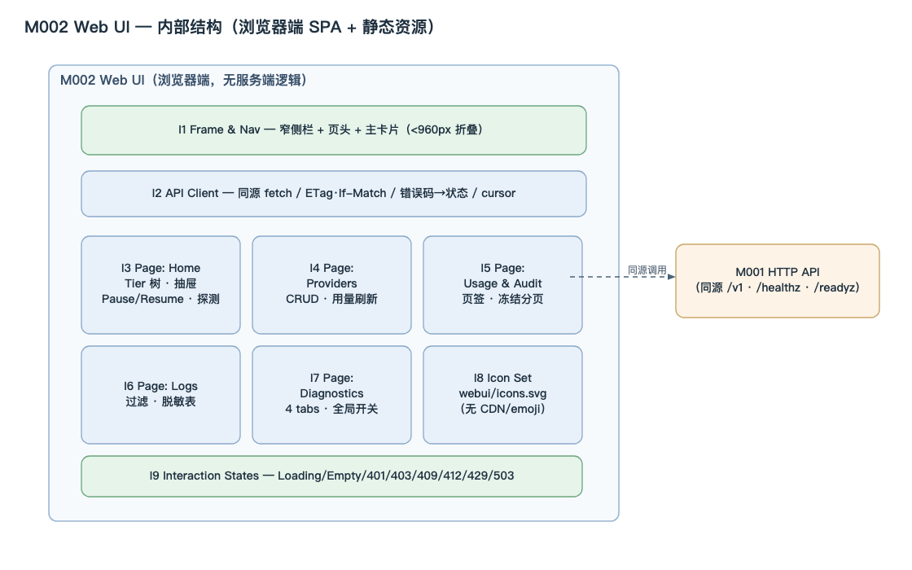
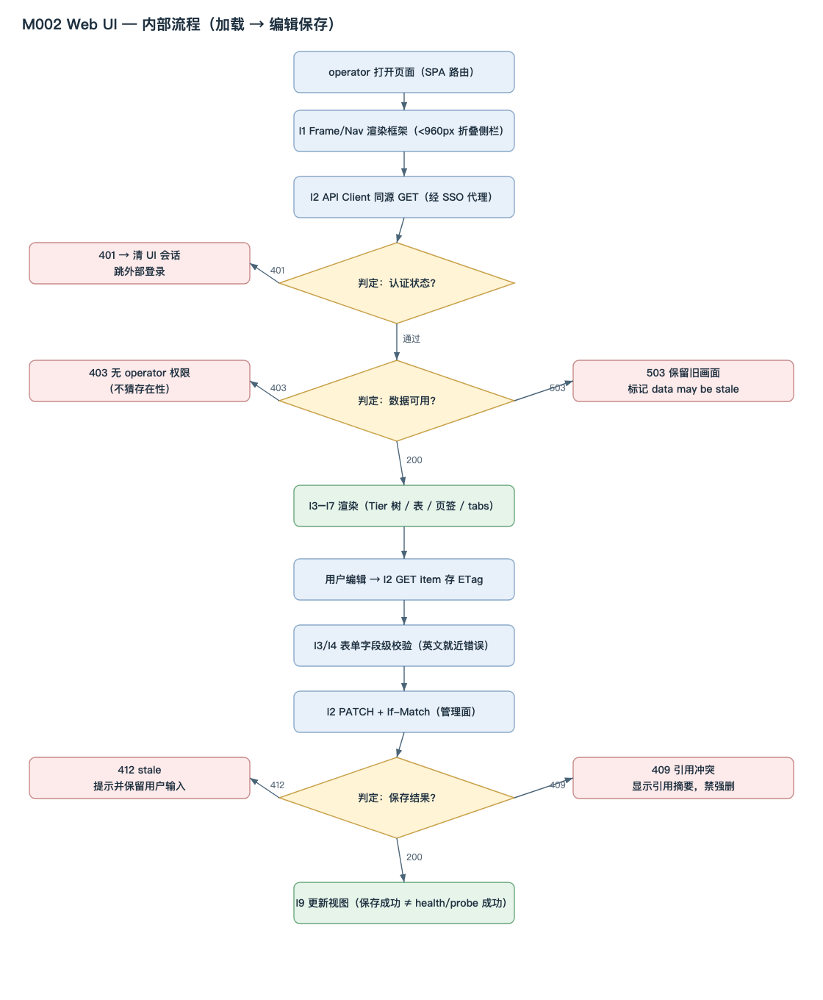

<!-- STD_DOCUMENT_COVER_BEGIN -->
# LLMTier M002 Web UI 模块设计

> STD 使用入口：[项目采用说明与标准导航](../../README.md#std-entry)

| 文档字段 | 值 |
|---|---|
| Document ID | `web-ui` |
| Document Version | `0.1.0-draft.2` |
| Status | `Draft` |
| Project | `LLMTier` |
| Authority | `LLMTier` |
| Document Owner | LLMTier |
| Authors | llmtier |
| Created Date | `2026-09-23` |
| Last Modified Date | `2026-09-25` |
| Template ID | `design.definition` |
| Template Version | `3.2.0` |
| Template Conformance | `tailored` |
| Tailoring Reference | `std-tailoring` |
| Migration Map Reference | none |
| Repository | `corezilla/LLMTier` |
| Canonical Path | `docs/40_module_design/web-ui-design.md` |
| Supersedes | none |
<!-- STD_DOCUMENT_COVER_END -->

## 1. 单元摘要：为什么存在

| 项目 | 内容 |
|---|---|
| 模块编号 / 正式英文名称 | **M002** / Web UI |
| 直属父对象编号 / 名称 | LLMTier 软件系统（本项目无子系统）|
| 父设计 Document ID / 登记位置 | `llmtier-system-design` / 系统设计 §3.2（唯一登记表）|
| 上级系统 / 父单元 | LLMTier 软件系统 |
| 解决的问题 | 为 operator 提供图形化控制台，把管理面（配置、用量、审计、日志、诊断）从命令行解放出来，降低运维误操作 |
| 提供的能力 | 五个英文短页（Home / Providers / Usage & Audit / Logs / Diagnostics）+ Tier 成员编辑抽屉 + 诊断 4 tabs + 全局调试开关；同源调用 `/v1` |
| 主要使用者 | Operator（浏览器）|
| 不负责 | 不直读 SQLite/settings/Secret；不承载推理；不实现账号库或访问控制；不提供容量/恢复/费用/调用方页面；不新增认证路径 |

### 1.1 继承的上级约束与落实方式

#### 1.1.1 `C-TRUST-1` · 入口单点鉴权（浏览器不鉴权）
- **上级基线与决定状态**：机制 M-TRUST §3.1；已采用
- **适用条件**：全部调用
- **继承预算或行为保证**：Web UI 自身不实现访问控制；由同源反代/入口判定
- **可自行选择 / 不可改变**：—
- **本地落实 / 内部再分配**：I2（401/403 呈现）；§8、§11
- **验证方法与结果 / 证据**：`VRC-UI-002`；NOT_RUN
- **差距 / 变更影响 / 反馈责任**：无

#### 1.1.2 `C-TRUST-2` · 不建用户/会话/SSO 体系
- **上级基线与决定状态**：机制 M-TRUST §3.1；已采用
- **适用条件**：会话
- **继承预算或行为保证**：浏览器只持代理签发 cookie；不新增登录 endpoint
- **可自行选择 / 不可改变**：—
- **本地落实 / 内部再分配**：§11
- **验证方法与结果 / 证据**：`VRC-UI-002`；NOT_RUN
- **差距 / 变更影响 / 反馈责任**：无

#### 1.1.3 `C-METER-…` · 用量未知不填零
- **上级基线与决定状态**：机制 M-METER §1；已采用
- **适用条件**：用量/账号用量显示
- **继承预算或行为保证**：Unknown 不显示 0
- **可自行选择 / 不可改变**：渲染可自选；不填零不可变
- **本地落实 / 内部再分配**：I5；§8.2
- **验证方法与结果 / 证据**：`VRC-UI-004`；NOT_RUN
- **差距 / 变更影响 / 反馈责任**：与 M004 一致

#### 1.1.4 `C-OBS-1` · 调试默认关闭
- **上级基线与决定状态**：机制 M-OBS §3.1；已采用
- **适用条件**：Diagnostics 页
- **继承预算或行为保证**：关闭时对应 tab 显示 Disabled
- **可自行选择 / 不可改变**：呈现可自选；默认关不可变
- **本地落实 / 内部再分配**：I7；§8
- **验证方法与结果 / 证据**：`VRC-UI-006`；NOT_RUN
- **差距 / 变更影响 / 反馈责任**：与 M005 一致

## 2. 需求、功能与验收条件

每个功能用固定字段列出（调用方 / 输入 / 行为 / 输出 / 错误 / 验收）。来源：系统设计 §4.3 Page ID 与机制 §14.4。

### 2.1 F-UI-HOME · 主页（PG-HOME）
- **调用方**：Operator
- **输入**：打开 Home
- **行为**：读 `/healthz`·`/readyz` + registry + `/v1/runtime` + `/v1/usage`，渲染 Tier 两层树
- **输出**：两层树（Tier → 后端）+ 页头全局状态
- **错误**：401 跳登录 / 403 无权限 / 503 stale
- **验收**：Tier 状态取自 `/readyz.models[].availability`；成员状态独立（不互相覆盖）

### 2.2 F-UI-TIER-EDIT · 等级成员编辑（DRW-TIER）
- **调用方**：Operator
- **输入**：Tier 抽屉操作
- **行为**：GET item 存 ETag → POST Deployment / PATCH service-level（带 `If-Match`）
- **输出**：配置落库 + 新 ETag
- **错误**：409 引用 / 412 stale
- **验收**：保存成功 ≠ probe/health 成功；两步失败不谎称原子

### 2.3 F-UI-PAUSE · 后端暂停/恢复
- **调用方**：Operator
- **输入**：后端行 Pause / Resume
- **行为**：用 Deployment partial PATCH 切 `enabled` + `If-Match`
- **输出**：状态变更
- **错误**：412
- **验收**：Pause 不取消已开始请求；`running>0` 前须确认

### 2.4 F-UI-PROVIDERS · 供应商管理（PG-PROVIDERS）
- **调用方**：Operator
- **输入**：Providers 页操作
- **行为**：列 provider + Secret 是否配置 + 账号用量 + `running/max`
- **输出**：Provider 表
- **错误**：409 引用
- **验收**：Calls/Tokens 只聚合最高 Usage 版本；未知不填 0

### 2.5 F-UI-PROBE · 显式探测
- **调用方**：Operator
- **输入**：点“探测”
- **行为**：二次确认后 POST 探活（`confirm_external_call=true`）
- **输出**：探测结果
- **错误**：—
- **验收**：未确认不触网；未知结果不自动重复

### 2.6 F-UI-RECORDS · 用量与审计（PG-RECORDS）
- **调用方**：Operator
- **输入**：页签切换 / 翻页
- **行为**：GET `/v1/usage`、`/v1/audit`（一次只显示一张表）
- **输出**：表
- **错误**：503 显示“存储不可用”，不显示空表
- **验收**：同 request 只显示最高版本；Unknown ≠ 0；不显示 Cost

### 2.7 F-UI-LOGS · 运行日志（PG-LOGS）
- **调用方**：Operator
- **输入**：时间/级别/模块/request_id 过滤
- **行为**：GET `/v1/logs`
- **输出**：脱敏日志表
- **错误**：503 显式化
- **验收**：只显示已脱敏字段；不渲染 HTML

### 2.8 F-UI-DIAG · 诊断（PG-DIAG）
- **调用方**：Operator
- **输入**：4 tabs 切换 / 注入编辑
- **行为**：读 `/v1/diagnostics*`、`/v1/trace/{id}`；`PATCH` 注入配置
- **输出**：快照/统计/注入/trace 视图
- **错误**：—
- **验收**：开关关闭时对应 tab 显示 Disabled

### 2.9 F-UI-DIAG-SWITCH · 全局调试开关
- **调用方**：Operator
- **输入**：顶部 toggle
- **行为**：`PATCH /v1/diagnostics`
- **输出**：开关状态
- **错误**：—
- **验收**：状态反映 `GET /v1/diagnostics` 返回值

### 2.10 F-UI-STATES · 通用交互状态
- **调用方**：Operator
- **输入**：任意交互
- **行为**：Loading / Empty / 401 / 403 / 409 / 412 / 429 / 503 的统一呈现
- **输出**：界面反馈
- **错误**：—
- **验收**：见 §7 通用状态规则

## 3. UI、CLI 或设备操作面

Web UI 是纯浏览器控制台，无 CLI；布局基线由可切换静态 Demo 在 1280×760 视口生成（不是已接线截图）。

**页面清单（Page ID 来自系统设计 §4.3，稳定；页面不是软件模块）**

共 **5 个页面 + 2 个抽屉**。每页的目的、DOM 容器、JS 与 CSS 划分如下（HTML 只放壳与容器，交互与渲染在 `app.js`，样式在 `styles.css`）：

#### PG-HOME · Home
- **目的（用户任务）**：查看等级与后端状态、编辑等级成员
- **操作**：查看 Tier 树、编辑成员、Pause/Resume、探测（二次确认）
- **输入**：无
- **正常结果**：两层树 + 页头状态
- **Empty/Error**：Loading 骨架；空 Tier 显示 no members 且可 Edit
- **HTML 容器**：`#home`（`#tree`、`#stamp`）
- **JS（装载 / 渲染 / mutation）**：`loadHome`、`renderTree`、`toggleDeployment`、`probeDeployment`、`openTierEditor`、`renderTierMembers`、`saveMember`、`removeMember`、`addMember`、`reloadAddMemberModels`
- **CSS 区块**：`.page #home`、`.tree`、`.tiername`、`.backend`

#### PG-PROVIDERS · Providers
- **目的（用户任务）**：管理 cloud/local provider、账号用量
- **操作**：Add/Edit/Delete Provider、刷新账号用量
- **输入**：表单
- **正常结果**：Provider 表 + 编辑
- **Empty/Error**：Secret 只写不回显；编辑空白=保持
- **HTML 容器**：`#providers`（`#provider-tree`、`#provider-error`）
- **JS**：`loadProviders`、`renderProviders`、`openProviderEditor`、`saveProvider`、`deleteProvider`、`refreshProviderUsage`、`fetchProviderModels`
- **CSS 区块**：`#providers`、`.toolbar`、`.card`

#### PG-RECORDS · Usage & Audit
- **目的（用户任务）**：查 token 用量与管理审计
- **操作**：页签切 Token 用量 / 管理审计、翻页
- **输入**：时间窗 / cursor
- **正常结果**：单表
- **Empty/Error**：503 显示“存储不可用”，不显示空表
- **HTML 容器**：`#records`（子页签 `#usage-body`、`#audit-body`）
- **JS**：`loadUsage`、`loadAudit`
- **CSS 区块**：`#records`、`.tabs`、`.sub`、`.tablewrap`

#### PG-LOGS · Logs
- **目的（用户任务）**：查脱敏运行日志
- **操作**：过滤查看脱敏日志
- **输入**：时间 / 级别 / 模块 / request_id
- **正常结果**：日志表
- **Empty/Error**：503 显式化；“无日志”不伪装
- **HTML 容器**：`#logs`（`#log-body`、`#log-level`、`#log-module`）
- **JS**：`loadLogs`
- **CSS 区块**：`#logs`、`.tabs`、`.sub`

#### PG-DIAG · Diagnostics
- **目的（用户任务）**：观测查询、调试开关、注入配置
- **操作**：4 tabs（Snapshots/Stats/Injection/Trace）+ 全局开关
- **输入**：筛选 / 开关
- **正常结果**：快照 / 统计 / 注入 / trace
- **Empty/Error**：开关关闭 → tab 显示 Disabled
- **HTML 容器**：`#diag`（4 tabs：Snapshots / Stats / Injection / Trace）
- **JS**：`loadStats`、`loadTrace`、注入读写
- **CSS 区块**：`#diag`、`.tabs`

抽屉（`DRW-*`，属其宿主页面）：

#### DRW-TIER · 等级成员编辑（属 PG-HOME）
- **目的**：Tier 成员增/删/改
- **HTML 容器**：`#tier-mask`（`#tier-members`、`#add-member-form`）
- **JS**：`openTierEditor`、`renderTierMembers`、`saveMember`、`removeMember`、`addMember`

#### DRW-PROVIDER · 供应商新增/编辑（属 PG-PROVIDERS）
- **目的**：Provider 新增/编辑（Secret 只写不回显）
- **HTML 容器**：`#provider-mask`（`#provider-form`）
- **JS**：`openProviderEditor`、`saveProvider`

**HTML / CSS / JS 文件划分**：

| 文件 | 划分（放什么 / 不放什么）|
|---|---|
| `index.html` | 只放**结构壳**：侧栏导航（5 项）、页头全局状态、5 个 `<section class="page">` 与其容器 id、2 个抽屉的 `<form>`/字段、`<datalist>`。**不放**业务逻辑、不放内联数据 |
| `styles.css` | 分区：①基础与变量（`:root` 颜色、`html/body`）②框架（`.shell`/`aside`/`.brand`/`nav`/`header`/`.status-chip`）③页面（`.page`/`.active`）④组件（`.card`/`.toolbar`/`.tabs`/`.sub`/`.tablewrap`/`.pill`/`.icon-button`）⑤树（`.tiername`/`.backend`/`.metric`）⑥抽屉（`.mask`/`.drawer`）。**不**在 HTML 内联样式 |
| `app.js` | 分区：①`api()` 客户端 ②hash 路由与页面切换 ③各页 `load*`/`render*` ④mutation（`save*`/`toggle*`/`probe*`）⑤状态映射（`backendState`/`tierState`/`statusMarkup`）⑥交互状态 I9。**不**直读 DB/Secret、不落 localStorage |
| `icons.svg` | 单线图标 sprite：`<symbol id="icon-…">`，`<use href="/ui/icons.svg#icon-…">` 引用 |

**实现映射（当前 `index.html`）**：侧栏 4 项（Home / Providers / Stats / Logs），其中 Logs 含 3 个子页签（Token Usage / Audit Log / Runtime Logs）。与系统设计 §4.3 的 `PG-RECORDS`/`PG-DIAG` 尚未一一对应 → 登记 `OPEN-UI-2`（见 §15）。

**共享框架与导航**


[可编辑 SVG 源](../assets/diagrams/diagram-webui-frame.svg)

图 M002-U0 · 共享框架：窄侧栏 + 页头 + 主卡片 + 反馈条；每页共用。


[可编辑 SVG 源](../assets/diagrams/diagram-webui-nav.svg)

图 M002-U1 · 导航结构：Home / Providers / Usage / Logs / Diagnostics 五页项稳定。

**页面布局总览（Page ID 稳定）**


[可编辑 SVG 源](../assets/diagrams/webui-page-layouts.svg)

图 M002-U2 · 五页布局总览：仅表达布局分区，颜色/字体/像素交实现。

**各页视图（Demo 在 1280×760 视口生成，布局与信息层级基线；非已接线截图）**


图 M002-U3 · Home（Tier 树 + 抽屉）


图 M002-U4 · Tier 成员编辑抽屉


图 M002-U5 · 用量与审计


[可编辑 SVG 源](../assets/diagrams/diagram-webui-diag-switches.svg)

图 M002-U6 · 诊断全局开关（Snapshot Capture / Stats Aggregation）

可切换静态 Demo：`docs/assets/webui-demo/index.html`；其余截图 `docs/assets/webui/{records-audit,logs}.png`。

**图标系统（§3 专用）**：只使用项目内单线 SVG `webui/icons.svg`，不从 CDN 加载、不用 emoji；颜色只是补充，语义由 `title`/`aria-label`/非颜色文字承载。核心状态语义：

| 图标 | 语义 | 图标 | 语义 |
|---|---|---|---|
| `circle-dot` | Idle（健康且无活动请求，非暂停）| `circle-pause` | Paused（暂停单 Deployment）|
| `activity` | Running（≥1 活动请求）| `gauge` | Exhausted（无可用并发槽）|
| `scan-search` | Probing | `triangle-alert` | Attention（需检查）|
| `cloud-off` | Unreachable | `circle-off` | Disabled（上级禁用）|
| `circle-help` | Unknown | `package-open` | Empty（Tier 无成员）|
| `circle-check` | Ready | | |

## 4. 外部边界与依赖

#### 依赖 1 · M001 HTTP API
- **本单元调用或消费**：同源调用全部管理面 `/v1` 与 `/healthz`、`/readyz`
- **本单元提供**：浏览器页面（同源）
- **契约**：见 OpenAPI（机器 authority）
- **timeout/失败影响**：401/403/409/412/429/503 按 §7 呈现

#### 依赖 2 · M004 Management
- **本单元调用或消费**：provider / deployment / level、审计、日志、用量查询接口
- **本单元提供**：—
- **契约**：内部 / HTTP
- **timeout/失败影响**：数据边界——后端行不虚构单模型用量

#### 依赖 3 · M005 Observability
- **本单元调用或消费**：诊断接口
- **本单元提供**：—
- **契约**：HTTP
- **timeout/失败影响**：fail-open；诊断不可用不阻塞其他页

#### 依赖 4 · operator SSO 代理（外部）
- **本单元调用或消费**：同源 TLS 反向代理注入 Admin bearer
- **本单元提供**：会话 cookie
- **契约**：`Secure; HttpOnly; SameSite=Strict`
- **timeout/失败影响**：401 跳外部登录；403 留在当前页

#### 依赖 5 · M003 Inference
- **本单元调用或消费**：—（不直连）
- **本单元提供**：—
- **契约**：—
- **timeout/失败影响**：仅经 M001

**边界**：Web UI 不读 SQLite/settings/Secret，不新增登录 endpoint/用户 Schema/第二认证路径；development 无认证代理时保持 disabled。

## 5. 内部结构与实现位置

### 5.1 内部组成

本模块是**浏览器端单页应用
 + 静态资源**，由 `M001` 的静态服务交付；无服务端逻辑。



[可编辑 SVG 源](../assets/diagrams/diagram-m002-web-ui-structure.svg)

图 M002-S1 · M002 内部结构：框架（I1）与 API 客户端（I2）为公共层，五个页面组件（I3–I7）、图标库（I8）与交互状态（I9）在其内；对 `M001 HTTP API` 只有同源调用（虚线），无服务端逻辑。

#### I1 · Frame & Nav
- **处理与协作**：窄侧栏 + 页头 + 主卡片；<960px 折叠为顶部菜单
- **输入/输出**：路由 → 框架
- **文件/symbol**：`webui/index.html`、`webui/app.js`

#### I2 · API Client
- **处理与协作**：同源 `fetch` 封装——ETag/If-Match、错误码→UI 状态、cursor 翻页
- **输入/输出**：调用 → JSON
- **文件/symbol**：`webui/app.js`

#### I3 · Page: Home
- **处理与协作**：Tier 树渲染、Tier 抽屉、Pause/Resume、探测确认
- **输入/输出**：数据 → 树/抽屉
- **文件/symbol**：`webui/app.js`（Home）

#### I4 · Page: Providers
- **处理与协作**：Provider CRUD + 账号用量刷新
- **输入/输出**：表单 → 表
- **文件/symbol**：`webui/app.js`（Providers）

#### I5 · Page: Usage & Audit
- **处理与协作**：页签 + 两表 + 冻结分页
- **输入/输出**：查询 → 表
- **文件/symbol**：`webui/app.js`

#### I6 · Page: Logs
- **处理与协作**：过滤 + 脱敏表
- **输入/输出**：查询 → 表
- **文件/symbol**：`webui/app.js`

#### I7 · Page: Diagnostics
- **处理与协作**：4 tabs + 全局开关
- **输入/输出**：查询/开关 → 视图
- **文件/symbol**：`webui/app.js`（Diagnostics）

#### I8 · Icon Set
- **处理与协作**：单线 SVG 图标（状态/操作）
- **输入/输出**：名称 → 图形
- **文件/symbol**：`webui/icons.svg`

#### I9 · Interaction States
- **处理与协作**：Loading / Empty / 401 / 403 / 409 / 412 / 429 / 503 统一处理
- **输入/输出**：状态 → UI
- **文件/symbol**：`webui/app.js`

图 A1（系统设计 §3.1）中 M002 的框即本模块边界；组件全在浏览器内，服务端仅静态交付。主流程见 §7。

### 5.2 内部调用过程

#### 5.2.1 `CALL-UI-LOAD` · 页面加载到渲染
- **入口与调用上下文**：浏览器打开页面（SPA hash 路由）
- **调用链（文件 / symbol → 文件 / symbol）**：见下方调用链代码块
- **逐步传递的数据**：`path`/fetch → JSON → 渲染字符串 → 容器
- **返回、异常与清理**：非 2xx → I9 状态；无服务端清理
- **对应流程 / 接口 / 验证**：§7 P-UI-LOAD / §9 / `VRC-UI-001..004`

```text
index.html（页面壳：容器 id + 装配 styles.css / icons.svg / app.js）
 └─ app.js 初始化（hash 路由 = 页面）
      ├─ loadRegistry() / loadHome() / loadProviders()               # 各页数据装载
      │    └─ api(path, opts)        # app.js：fetch(path,{credentials:'same-origin'})
      │         └─ 失败按状态分派 → I9（401/403/409/412/429/503）
      ├─ renderTree() / renderProviders() / renderTierMembers() / loadUsage() / loadLogs() / loadStats() / loadTrace()
      │    └─ backendState() / tierState() / statusMarkup()          # 状态→图标
      └─ 用户操作 → toggleDeployment() / probeDeployment() / saveProvider() / saveMember() / removeMember() / refreshProviderUsage()
           └─ api(path,{method:'PATCH'|'POST'|'DELETE', headers:{'If-Match':etag}, body})
```

### 5.3 文件间接口契约

> 本模块内部文件交接逐项映射到 §9 的成员定义；签名、输入输出、错误与寿命以 §9 对应记录为唯一来源，本节不再复写。

| 内部契约 ID | provider → consumer | §9 成员 | 本文件责任 | 验证 |
|---|---|---|---|---|
| `IF-1` | `webui/index.html` → `app.js`（容器 id） | §9.1 `IF-UI-DOM` | 提供 5 页与 2 抽屉容器 | `VRC-UI-001` |
| `IF-2` | `webui/app.js` `api` 内部 | §9.1 `IF-UI-API` | 同源 `fetch` 封装（ETag/cursor/错误分派） | `VRC-UI-002` |
| `IF-3` | `webui/app.js` `load*` | §9.1 `IF-UI-LOAD` | 各页数据装载 | `VRC-UI-001` |
| `IF-4` | `webui/app.js` `render*` | §9.1 `IF-UI-RENDER` | 生成 HTML 注入容器 | `VRC-UI-001` |
| `IF-5` | `app.js` `backendState/tierState/statusMarkup` | §9.1 `IF-UI-STATE` | 状态→图标/文本 | `VRC-UI-001/003` |
| `IF-6` | `app.js` mutation 函数 | §9.1 `IF-UI-MUTATE` | 带 `If-Match` 的写操作 | `VRC-UI-002` |
| `IF-7` | `webui/icons.svg` `<symbol>` | §9.1 `IF-UI-ICON` | 图标 sprite 契约 | `VRC-UI-001` |
| `IF-8` | `webui/styles.css` 类选择器 | §9.1 `IF-UI-CSS` | 布局与状态样式契约 | `VRC-UI-001` |

### 5.4 服务提供方式（条件适用）

- **运行载体与入口**：N/A + 依据 —— M002 是**浏览器端静态资源**，无独立 server；由 M001 静态交付
- **并发/线程模型**：N/A + 依据 —— 浏览器单线程事件循环；无服务端并发
- **初始化、Ready、生效与停止**：N/A + 依据 —— 随页面加载；无自有生命周期
- **宿主装配、失败和资源回收责任**：由 M001 静态服务装配；无自有 fd/线程

### 5.5 依赖方向

`index.html` → `app.js`/`styles.css`/`icons.svg`；`app.js` 只经 `api()` 调 `M001`（同源 HTTP），**不直读**任何服务端文件/DB/Secret。

## 6. 数据结构设计

> 按 STD `design-data-interface-format` 1.2.0：主章“数据结构设计”，章内按**数据性质分类**。M002 是浏览器端静态资源，无 wire 自有报文、无设备、不写库；`6.4 通信报文`、`6.5 设备与 FPGA 表项`、`6.7 数据库表结构` 不适用。继承结构只定位原定义；本层拥有的结构逐项完整记录（Data/Type ID、用途与来源／逐字段／跨字段与寿命／合法与拒绝实例／验证），每个结构以真实名称作带编号小节标题。

**适用性**：6.1 公共基础类型与枚举 ✓｜6.2 业务与操作数据结构 ✓｜6.3 配置与规则数据结构 ✗（浏览器端无受控配置载荷）｜6.4 通信报文 ✗（wire 归 M001/OpenAPI）｜6.5 设备与 FPGA 表项 ✗（无设备）｜6.6 运行状态数据结构 ✓｜6.7 数据库表结构 ✗（不直读 SQLite，服务端数据经 M001）｜6.8 错误码与错误结构 ✓（引用系统 Error ID）。

### 6.1 公共基础类型与枚举

**6.1.1 `BackendState`（公共基础类型与枚举）**

```text
enum BackendState { Idle, Running, Paused, Exhausted, Attention, Unreachable, Disabled, Unknown }
```

- **Data/Type ID、用途与来源**：

  `D-UI-BACKEND-STATE`；后端行状态图标语义；来源 `webui/app.js` `backendState`。

- **`Idle`**：

  健康且 `running=0`。

- **`Running`**：

  `running>0`。

- **`Paused`**：

  `enabled=false`。

- **`Exhausted`**：

  无可用并发槽。

- **`Attention`**：

  需要关注（degraded/未知健康）。

- **`Unreachable`**：

  不可达。

- **`Disabled`**：

  已停用。

- **`Unknown`**：

  未知；不显示为 0/Idle。

- **跨字段与寿命**：

  成员状态与 Tier 状态**互不覆盖**；`Unknown` 不显示为 0/Idle；随 `state` 内存映射，页面刷新重建。

- **合法/拒绝实例**：

  合法：`running=0` 且健康 → `Idle`；边界：未知 → `Unknown`（icon `circle-help`）。

- **验证**：

  `VRC-UI-001`；`webui/app.js`。

**6.1.2 `TierAvailability`（公共基础类型与枚举）**

```text
enum TierAvailability { available, degraded, unavailable }
```

- **Data/Type ID、用途与来源**：

  `D-UI-TIER-AVAILABILITY`；Tier 可用性呈现；源 `/readyz.models[].availability`，映射 M003 `RULE-INF-MODELS`。

- **`available`**：

  呈现为 Ready。

- **`degraded`**：

  呈现为 Attention。

- **`unavailable`**：

  呈现为 Unreachable。

- **跨字段与寿命**：

  Tier 状态**只取** `/readyz`，不从成员聚合；随页面刷新重建。

- **合法/拒绝实例**：

  合法 `degraded` → Attention；边界：缺字段 → `Unknown`。

- **验证**：

  `VRC-UI-001`；`webui/app.js` + M003 `RULE-INF-MODELS`。

**6.1.3 `UiErrorStatus`（公共基础类型与枚举）**

```text
enum UiErrorStatus { 401, 403, 409, 412, 429, 503 }
```

- **Data/Type ID、用途与来源**：

  `D-UI-ERROR-STATUS`；统一交互错误状态；来源 `webui/app.js` I9。

- **`401`**：

  会话过期/缺凭据 → 跳外部登录。

- **`403`**：

  权限不足 → 留在当前页、不猜存在性。

- **`409`**：

  唯一/引用冲突 → 显示引用摘要，禁强删。

- **`412`**：

  ETag 过期 → 提示 stale、保留草稿。

- **`429`**：

  准入限流 → 按 `Retry-After` 退避。

- **`503`**：

  存储不可用 → 显示不可用，不显示空表。

- **跨字段与寿命**：

  401 跳外部登录、403 不猜存在性、409 显示引用冲突、412 保留草稿、429/503 显示 `Retry-After`（若有）且不无限重试；请求级，随 UI 呈现。

- **合法/拒绝实例**：

  合法 `412` → “他人已修改”；边界：`403` → 留在当前页。

- **验证**：

  `VRC-UI-002`；`webui/app.js`。

### 6.2 业务与操作数据结构

**6.2.1 `UiState`（业务与操作数据结构）**

```text
UiState {
  registry: object?,
  providers: ProviderView[],
  deployments: DeploymentView[],
  usage: UsagePage?,
  runtime: RuntimeView?
}
```

- **Data/Type ID、用途与来源**：

  `D-UI-STATE`；页面内存缓存；来源 `webui/app.js` `state`。

- **`registry`**：

  可空对象；注册表快照。

- **`providers`**：

  必填数组；provider 视图。

- **`deployments`**：

  必填数组；deployment 视图。

- **`usage`**：

  可空；用量分页投影。

- **`runtime`**：

  可空；运行时快照。

- **跨字段与寿命**：

  不持久化、不落 `localStorage`/`sessionStorage`；页面进入创建、刷新销毁。

- **合法/拒绝实例**：

  合法：装载后缓存；边界：请求失败保留旧画面（stale）。

- **验证**：

  `VRC-UI-001`；`webui/app.js`。

**6.2.2 `LoadedView`（业务与操作数据结构）**

```text
LoadedView {
  ProviderView | DeploymentView | UsagePage | LogPage | StatsView | TraceView | ...
}
```

- **Data/Type ID、用途与来源**：

  `D-UI-LOADED-VIEW`；各接口响应投影，字段 authority = OpenAPI；来源 `webui/app.js` `loadRegistry/loadHome/...`。

- **`ProviderView` / `DeploymentView`**：

  管理面实体视图投影（只读）。

- **`UsagePage` / `LogPage`**：

  用量/日志分页投影（只读）。

- **`StatsView` / `TraceView`**：

  统计/trace 投影（只读）。

- **跨字段与寿命**：

  只读；同 `request_id` 只显示最高 `record_version`；`Unknown ≠ 0`；请求级内存。

- **合法/拒绝实例**：

  合法：用量页显示最高版本；边界：未知 token → “未知”。

- **验证**：

  `VRC-UI-004`；`webui/app.js` + OpenAPI。

**6.2.3 `ErrorStatus`（业务与操作数据结构）**

```text
ErrorStatus {
  status: int,
  code: string?,
  retry_after: string?
}
```

- **Data/Type ID、用途与来源**：

  `D-UI-ERROR-OBJECT`；错误状态对象；来源 `webui/app.js` I9。

- **`status`**：

  必填整数；取 §6.1.3 `UiErrorStatus`。

- **`code`**：

  可空字符串；后端错误码。

- **`retry_after`**：

  可空字符串；`Retry-After` 原值。

- **跨字段与寿命**：

  与 `UiErrorStatus` 对应；不渲染 HTML、不回显 token；请求级。

- **合法/拒绝实例**：

  合法 `{status:503}` → “存储不可用”；边界：`{status:403}` → 无权限。

- **验证**：

  `VRC-UI-002`；`webui/app.js`。

### 6.6 运行状态数据结构

**6.6.1 `PageViewState`（运行状态数据结构）**

```text
PageViewState {
  page: string,
  loading: bool,
  data: object?,
  empty: bool,
  error: ErrorStatus?
}
```

- **Data/Type ID、用途与来源**：

  `D-UI-PAGE-VIEW-STATE`；单页视图状态（骨架/数据/空/错误）；来源 `webui/app.js` I3–I7。

- **`page`**：

  必填字符串；当前页标识。

- **`loading`**：

  必填布尔；加载中。

- **`data`**：

  可空；已装载数据。

- **`empty`**：

  必填布尔；空结果标记。

- **`error`**：

  可空，§6.2.3 `ErrorStatus`。

- **跨字段与寿命**：

  Loading 不清空上次数据；Empty 说明“无数据≠加载失败”；页面内存，切换页面重建。

- **合法/拒绝实例**：

  合法：Loading → 数据；边界：503 → 保留旧画面 + stale。

- **验证**：

  `VRC-UI-001`；`webui/app.js`。

**6.6.2 `FormDraft`（运行状态数据结构）**

```text
FormDraft {
  fields: map<string, value>   // Secret 字段只写不回显；空白=保持
}
```

- **Data/Type ID、用途与来源**：

  `D-UI-FORM-DRAFT`；编辑抽屉的表单草稿；来源 `webui/app.js` I3/I4。

- **`fields`**：

  必填映射；编辑字段值；Secret 字段只写不回显，空白表示保持原值。

- **跨字段与寿命**：

  412 时保留供复制后重载；不自动覆盖；编辑开始创建、保存/放弃销毁。

- **合法/拒绝实例**：

  合法：保存成功清除草稿；边界：412 保留草稿。

- **验证**：

  `VRC-UI-002`；`webui/app.js`。

**6.6.3 `EditEtag`（运行状态数据结构）**

```text
EditEtag {
  value: string   // "<id>.v<n>"
}
```

- **Data/Type ID、用途与来源**：

  `D-UI-EDIT-ETAG`；编辑事务内暂存的 ETag；来源 `webui/app.js` I2。

- **`value`**：

  必填字符串，格式 `"<id>.v<n>"`；乐观并发标记。

- **跨字段与寿命**：

  `PATCH + If-Match` 提交；变更后失效；不跨页复用；编辑事务内。

- **合法/拒绝实例**：

  合法 `If-Match: "p1.v3"`；边界：过期 → 412。

- **验证**：

  `VRC-UI-002`；`webui/app.js` + M004 §8.2。

**6.6.4 `PagingCursor`（运行状态数据结构）**

```text
PagingCursor {
  value: string?   // 审计页存 URL query 可刷新恢复
}
```

- **Data/Type ID、用途与来源**：

  `D-UI-PAGING-CURSOR`；分页游标；来源 `webui/app.js` I2。

- **`value`**：

  可空字符串；审计页存 URL query 可刷新恢复。

- **跨字段与寿命**：

  `has_more=false ⇒ cursor=null`；翻页内有效；URL 持久（仅 query）。

- **合法/拒绝实例**：

  合法翻页；边界：空页 → 无 cursor。

- **验证**：

  `VRC-UI-004`；`webui/app.js`。

**6.6.5 `SessionCookie`（运行状态数据结构，外部 SSO 代理所有）**

```text
SessionCookie {
  attributes: "Secure; HttpOnly; SameSite=Strict",
  value: opaque            // 本层不解析
}
```

- **Data/Type ID、用途与来源**：

  `D-UI-SESSION-COOKIE`；`Secure; HttpOnly; SameSite=Strict` 短期会话 cookie；所有者=外部 SSO 代理。

- **`attributes`**：

  固定 `Secure; HttpOnly; SameSite=Strict`。

- **`value`**：

  不透明；本层只随同源请求携带，**不解析、不存 token**。

- **跨字段与寿命**：

  bearer 不进入 JS/URL/storage；随浏览器会话。

- **合法/拒绝实例**：

  合法：同源请求自动携带；边界：无 cookie → 401 跳登录。

- **验证**：

  `VRC-UI-002`；M002 §11。

### 6.8 错误码与错误结构

本模块**不新增公共错误码**；UI 状态映射系统目录（`llmtier-system-design` §8.8）：

| UI 状态 | 条件 | 系统 Error ID | 呈现行为 |
|---|---|---|---|
| 401 | 会话过期/缺凭据 | `ERR-AUTH-REQUIRED` | 清会话并跳外部登录 |
| 403 | 权限不足 | `ERR-AUTH-DENIED` | 留在当前页，不猜存在性 |
| 409 | 唯一/引用冲突 | `ERR-CONFLICT` / `ERR-INUSE` | 显示引用摘要，禁强删 |
| 412 | ETag 过期 | `ERR-STALE` | 提示 stale，保留草稿 |
| 429 | 准入限流 | `ERR-RATE-LIMIT` | 按 `Retry-After` 退避 |
| 503 | 存储不可用 | `ERR-STORE` | 显示“不可用”，不显示空表 |

- **约束 / 不变量**：结果未知先 GET 核对，不盲目重发 mutation；错误不泄露存在性。
- **实例**：拒绝：并发编辑 → 412；边界：存储不可用 → 503 保留旧画面。
- **来源 / 验证**：`app.js` + 系统 §8.8；`VRC-UI-002`。

## 7. 主流程与数据流



[可编辑 SVG 源](../assets/diagrams/diagram-m002-web-ui-flow.svg)

图 M002-P1 · M002 内部流程：页面加载（P-UI-LOAD）与编辑保存（P-UI-EDIT）在浏览器端贯通，认证/可用性/保存三类判定及其 401/403/503/412/409 分支全部展开。

**内部流程正文**：operator 打开页面后，**I1 Frame/Nav** 先渲染框架，**I2 API Client** 通过同源 SSO 代理发起 GET。认证判定失败（401）→ 清 UI 会话并跳外部登录；通过后按数据可用性分岔——403 显示无权限且不猜存在性，503 保留旧画面并标记 stale，200 交 **I3–I7** 渲染（Tier 树 / 表 / 页签 / tabs）。进入编辑时 I2 先 GET item 存 ETag，**I3/I4** 做字段级校验，再由 I2 以 `PATCH + If-Match` 提交：412 → 提示 stale 并保留用户输入，409 → 显示引用冲突且禁强删，200 → 交 **I9** 更新视图（保存成功 ≠ health/probe 成功）。

#### P-UI-LOAD · 页面加载
- **触发/适用条件**：进入任意页面
- **图与正文位置**：本段 / 图 M002-P1；§3 布局图
- **正常出口**：I3–I7 渲染数据
- **异常出口**：401 跳登录；403 无权限；503 stale

#### P-UI-EDIT · 编辑保存
- **触发/适用条件**：Tier / Provider 编辑
- **图与正文位置**：本段 / 图 M002-P1
- **正常出口**：PATCH 成功 + 新 ETag
- **异常出口**：412 stale；409 引用；未知先 GET

#### P-UI-PAUSE · 暂停/恢复
- **触发/适用条件**：后端行 Pause / Resume
- **图与正文位置**：§3 Home
- **正常出口**：`enabled` 切换
- **异常出口**：412；`running>0` 前确认

#### P-UI-PROBE · 探测
- **触发/适用条件**：点“探测”
- **图与正文位置**：§3 Home
- **正常出口**：二次确认后 POST
- **异常出口**：未知结果不自动重复

#### P-UI-DIAG · 诊断
- **触发/适用条件**：诊断开关 / 注入
- **图与正文位置**：§3 Diagnostics
- **正常出口**：PATCH 生效
- **异常出口**：关闭 → Disabled

**P-UI-EDIT 步骤**（执行组件 / 数据形态 / 状态变化）：

#### 步骤 1 · 打开编辑
- **输入**：打开编辑
- **执行组件**：I2
- **处理/规则**：GET item，存 ETag
- **输出/交给谁**：表单初值 + ETag → I3/I4

#### 步骤 2 · 用户修改
- **输入**：用户修改
- **执行组件**：I3/I4
- **处理/规则**：字段级校验（英文错误就近）
- **输出/交给谁**：草稿（内存）

#### 步骤 3 · 保存
- **输入**：保存
- **执行组件**：I2
- **处理/规则**：PATCH + `If-Match`
- **输出/交给谁**：200 + 新 ETag → I9

#### 步骤 4 · 冲突
- **输入**：冲突
- **执行组件**：I2/I9
- **处理/规则**：412 → 提示“他人已修改”，保留输入供重载
- **输出/交给谁**：不自动覆盖

#### 步骤 5 · 引用
- **输入**：引用
- **执行组件**：I2/I9
- **处理/规则**：409 → 显示引用摘要，禁强删
- **输出/交给谁**：不级联

**通用交互状态（I9）**：Loading 用局部骨架、不清空上次数据；Empty 说明“无数据≠加载失败”；401 清会话跳登录、不回显 token；403 不猜存在性；409 显示引用冲突；412 允许复制草稿后重载；429/503 显示 `Retry-After`（若有）且不无限重试；结果未知先 GET 核对，不盲目重发 mutation。

## 8. 关键算法与业务规则

#### 8.1 `RULE-UI-TIERSTATE` · Tier 状态 vs 成员状态
- **输入前提 / 适用条件**：Home 渲染
- **算法 / 规则 / 选择依据**：Tier 行取 `/readyz.models[].availability`（available→Ready / degraded→Attention / unavailable→Unreachable），**不从成员聚合**；成员行独立取 Deployment health/runtime（健康且 `running=0`→Idle，仅 `running>0`→Running，`enabled=false`→Paused）
- **结果 / 不变量 / 边界**：两者互不覆盖
- **复杂度 / 资源限制**：O(Tier×成员)
- **允许替换范围 / 不可改变保证**：渲染实现可自选；状态来源不可变
- **具体输入推演 / 验证项**：`running=0` 且健康 → Idle；`VRC-UI-001`

#### 8.2 `RULE-UI-UNKNOWN` · 未知不填零
- **输入前提 / 适用条件**：用量/账号用量显示
- **算法 / 规则 / 选择依据**：token 事实 Unknown → 显示“未知”；后端行因子模型用量缺失显示 `—` 并说明边界
- **结果 / 不变量 / 边界**：绝不显示 0
- **复杂度 / 资源限制**：O(1)
- **允许替换范围 / 不可改变保证**：渲染实现可自选；不填零不可变
- **具体输入推演 / 验证项**：未知 token → “未知”；`VRC-UI-004`

#### 8.3 `RULE-UI-VERSION` · 用量版本替换
- **输入前提 / 适用条件**：Usage 页
- **算法 / 规则 / 选择依据**：同 `request_id` 只显示最高 `record_version`
- **结果 / 不变量 / 边界**：版本更新替换原行、不累计
- **复杂度 / 资源限制**：O(1)
- **允许替换范围 / 不可改变保证**：实现可自选；不累计不可变
- **具体输入推演 / 验证项**：v2 替换 v1；`VRC-UI-004`

#### 8.4 `RULE-UI-ETAG` · 编辑并发流
- **输入前提 / 适用条件**：编辑
- **算法 / 规则 / 选择依据**：GET item 存 ETag → PATCH 带 `If-Match`；412 提示 stale 并保留输入
- **结果 / 不变量 / 边界**：不自动覆盖
- **复杂度 / 资源限制**：O(1)
- **允许替换范围 / 不可改变保证**：实现可自选；`If-Match` 不可变
- **具体输入推演 / 验证项**：并发编辑 → 412；`VRC-UI-002`

#### 8.5 `RULE-UI-PAUSE` · Pause 边界
- **输入前提 / 适用条件**：Pause/Resume
- **算法 / 规则 / 选择依据**：Pause 阻止新请求进入该 Deployment，**不取消已开始请求**；`running>0` 前须确认
- **结果 / 不变量 / 边界**：Resume 仅恢复路由资格
- **复杂度 / 资源限制**：O(1)
- **允许替换范围 / 不可改变保证**：实现可自选；边界不可变
- **具体输入推演 / 验证项**：`running>0` → 先确认；`VRC-UI-003`

#### 8.6 `RULE-UI-PROBE` · 探测付费确认
- **输入前提 / 适用条件**：探测
- **算法 / 规则 / 选择依据**：二次确认后 `confirm_external_call=true`
- **结果 / 不变量 / 边界**：未确认不触网；未知结果不自动重复
- **复杂度 / 资源限制**：O(1)
- **允许替换范围 / 不可改变保证**：实现可自选；确认不可变
- **具体输入推演 / 验证项**：未确认 → 不 POST；`VRC-UI-005`

#### 8.7 `RULE-UI-TRISTATE` · 保存/health/probe 三态分离
- **输入前提 / 适用条件**：任意写操作
- **算法 / 规则 / 选择依据**：保存成功只说明配置落库，不等于 probe 或健康恢复
- **结果 / 不变量 / 边界**：三态不互相推导
- **复杂度 / 资源限制**：O(1)
- **允许替换范围 / 不可改变保证**：实现可自选；语义不可变
- **具体输入推演 / 验证项**：保存成功但 health unknown；`VRC-UI-002`

## 9. 接口设计

> 按 STD `design-data-interface-format` 1.2.0 §3：主章“接口设计”，按**接口设计用途**分类（面向使用方的 API 与组件/系统间协作的消息与数据流接口），逐接口完整记录；标题为真实调用形式（浏览器端函数/DOM 契约），标题下先给**完整接口声明**，再就地说明参数/结果字段，最后按固定六项。本模块接口全部向 operator 提供页面能力，归 API；消息流/硬件/人机三类不适用。数据结构引用 §6；消费的服务端字段 machine authority = OpenAPI。

### 9.1 API（适用时）

#### `api(path, {method='GET', body, headers={}}) -> Promise<object>`

```text
api(path: string, opts?: {method?: string, body?: object, headers?: object}) -> Promise<object>
```

- **Interface/Member ID、用途、提供责任与唯一来源**：`IF-UI-API`；浏览器端统一 HTTP 客户端；M002 提供；状态=Implemented；唯一契约=本设计；文件·symbol `webui/app.js` `api`。
- **输入与前提**：`path`（同源 `/v1`、`/healthz`、`/readyz`）；`opts.method/body/headers`（含 `If-Match`）。
- **成功输出与保证**：解析后的 JSON 对象；非 2xx 抛错交 I9（`ErrorStatus`，§6.2.3）。
- **错误与合法下一步**：401/403/409/412/429/503 → `UiErrorStatus`（§6.1.3，映射 `ERR-AUTH-REQUIRED`/`ERR-AUTH-DENIED`/`ERR-CONFLICT`/`ERR-STALE`/`ERR-RATE-LIMIT`/`ERR-STORE`）；按 §6.1.3 呈现，未知结果先 GET 核对。
- **交互与生命周期**：浏览器单线程；`credentials:'same-origin'`；每页请求独立。
- **实现与验证**：正常 `api('/v1/models')`；边界：412 → 保留草稿提示。`VRC-UI-002`；`webui/app.js`。

#### `loadRegistry() / loadHome() / loadProviders() / loadUsage() / loadLogs() / loadStats() / loadTrace() -> Promise<void>`

```text
loadRegistry() -> Promise<void>
loadHome() -> Promise<void>
loadProviders() -> Promise<void>
loadUsage() -> Promise<void>
loadLogs() -> Promise<void>
loadStats() -> Promise<void>
loadTrace() -> Promise<void>
```

- **Interface/Member ID、用途、提供责任与唯一来源**：`IF-UI-LOAD`；各页面数据装载；M002 提供；状态=Implemented；唯一契约=本设计；文件·symbol `webui/app.js`。
- **输入与前提**：当前页 hash 路由与查询参数。
- **成功输出与保证**：无返回（写 `state`/DOM 容器）。
- **错误与合法下一步**：失败交 I9；`loadLogs/loadUsage` 503 显示“存储不可用”（不显示空表）。
- **交互与生命周期**：进入页面/切页调用；请求级。
- **实现与验证**：正常装载渲染；边界：空数据 → Empty（非错误）。`VRC-UI-001/004`；`webui/app.js`。

#### `renderTree() / renderProviders() / renderTierMembers() -> void`

```text
renderTree() -> void
renderProviders() -> void
renderTierMembers() -> void
```

- **Interface/Member ID、用途、提供责任与唯一来源**：`IF-UI-RENDER`；渲染 Tier 树/表；M002 提供；状态=Implemented；唯一契约=本设计；文件·symbol `webui/app.js`。
- **输入与前提**：`state` 内存数据。
- **成功输出与保证**：生成 HTML 字符串注入对应容器。
- **错误与合法下一步**：无；数据缺失显示 Empty/`—`。
- **交互与生命周期**：数据装载后调用。
- **实现与验证**：正常两层树；边界：Empty Tier 显示 no members 且可 Edit。`VRC-UI-001`；`webui/app.js`。

#### `backendState(deployment) / tierState(tier) / statusMarkup(kind) -> string`

```text
backendState(deployment: object) -> string
tierState(tier: object) -> string
statusMarkup(kind: string) -> string
```

- **Interface/Member ID、用途、提供责任与唯一来源**：`IF-UI-STATE`；状态到图标/文本标记映射；M002 提供；状态=Implemented；唯一契约=本设计；文件·symbol `webui/app.js`。
- **输入与前提**：deployment/tier 视图；状态 kind。
- **成功输出与保证**：图标/文本标记（`BackendState`/`TierAvailability`，§6.1.1/§6.1.2）。
- **错误与合法下一步**：无；未知 → `Unknown`。
- **交互与生命周期**：渲染时调用；无状态。
- **实现与验证**：正常状态→图标；边界：未知 → `circle-help`。`VRC-UI-001/003`；`webui/app.js`。

#### `toggleDeployment(id) / probeDeployment(id) / saveProvider(...) / saveMember(...) / removeMember(...) / refreshProviderUsage(id) -> Promise<void>`

```text
toggleDeployment(id: string) -> Promise<void>
probeDeployment(id: string) -> Promise<void>
saveProvider(form: object, etag?: string) -> Promise<void>
saveMember(form: object, etag?: string) -> Promise<void>
removeMember(id: string) -> Promise<void>
refreshProviderUsage(id: string) -> Promise<void>
```

- **Interface/Member ID、用途、提供责任与唯一来源**：`IF-UI-MUTATE`；页面写操作（暂停/探测/保存/删除/刷新）；M002 提供；状态=Implemented；唯一契约=本设计；文件·symbol `webui/app.js`。
- **输入与前提**：目标 id、表单值、`If-Match` ETag。
- **成功输出与保证**：成功更新 `state` 与视图；新 ETag。
- **错误与合法下一步**：412 `ERR-STALE`（保留输入）、409 `ERR-CONFLICT`/`ERR-INUSE`（禁强删）、探测未确认不发 POST（`ERR-CONFIRM`）；结果未知先 GET 核对。
- **交互与生命周期**：用户操作触发；先 GET 取 ETag 再写。
- **实现与验证**：正常保存 + 新 ETag；边界：并发编辑 → 412。`VRC-UI-002/005`；`webui/app.js`。

#### `#home / #providers / #records / #logs / #diag / #tier-mask / #provider-mask`（DOM 容器契约）

```text
index.html -> 5 × <section class="page"> + 2 × 抽屉容器（稳定 id）
```

- **Interface/Member ID、用途、提供责任与唯一来源**：`IF-UI-DOM`；页面/抽屉容器结构与 id；M002 提供；状态=Implemented；唯一契约=本设计；文件·symbol `webui/index.html`。
- **输入与前提**：无。
- **成功输出与保证**：各页/抽屉容器 id 与结构壳（导航 5 项、页头状态、`<datalist>`）。
- **错误与合法下一步**：无。
- **交互与生命周期**：页面加载时建立；`app.js` 注入内容。
- **实现与验证**：正常容器存在；边界：容器缺失 → 渲染无声失败（由行为用例覆盖）。`VRC-UI-001`；`webui/index.html`。

#### `<symbol id="icon-…">`（`icons.svg` 图标 sprite 契约）

```text
<use href="/ui/icons.svg#icon-<name>">
```

- **Interface/Member ID、用途、提供责任与唯一来源**：`IF-UI-ICON`；单线图标 sprite 契约；M002 提供；状态=Implemented；唯一契约=本设计；文件·symbol `webui/icons.svg`。
- **输入与前提**：图标名。
- **成功输出与保证**：单线 SVG 图形；语义由 `title`/`aria-label` 承载。
- **错误与合法下一步**：未知名 → 空图形（不崩溃）。
- **交互与生命周期**：静态；无 CDN/emoji。
- **实现与验证**：正常 `circle-pause` → Paused；边界：缺图标名不崩溃。`VRC-UI-001`；`webui/icons.svg`。

#### `styles.css` 类选择器契约

```text
.shell/.page/.card/.toolbar/.tabs/.tablewrap/.tree/.mask/.drawer ...
```

- **Interface/Member ID、用途、提供责任与唯一来源**：`IF-UI-CSS`；布局与状态样式契约；M002 提供；状态=Implemented；唯一契约=本设计；文件·symbol `webui/styles.css`。
- **输入与前提**：无。
- **成功输出与保证**：布局与状态样式（窄侧栏 + 页头 + 主卡片；<960px 折叠）。
- **错误与合法下一步**：无。
- **交互与生命周期**：静态。
- **实现与验证**：1280×760 基线；边界：表格横向滚动。`VRC-UI-001`；`webui/styles.css`。

### 9.2 消息与数据流接口（适用时）

不适用（浏览器端无自有的命令/状态/事件/队列/流交换；HTTP 消费经 M001，属消费而非本模块拥有的协作接口）。

### 9.3 硬件与固件接口（适用时）

不适用（无连接器/总线/寄存器/FPGA 端口）。

### 9.4 人机与维护接口（适用时）

不适用——本模块的操作面（PG-* 页面与 DRW-* 抽屉）已在 §3 唯一登记，其浏览器端软件接口在 §9.1（`IF-UI-*`）记录；本节不重复定义，无独立 CLI/维护入口。

## 10. 并发、失败与恢复

#### 10.1 并发编辑
- **并发/失败点**：双 operator
- **检测**：412
- **行为**：提示 stale，保留输入
- **幂等/重试**：重新 GET 后重试
- **最终状态**：不自动覆盖

#### 10.2 删除被引用资源
- **并发/失败点**：Provider / Deployment 被引用
- **检测**：409
- **行为**：显示引用摘要，禁强删
- **幂等/重试**：先解绑
- **最终状态**：资源保留

#### 10.3 存储不可用
- **并发/失败点**：Usage / Logs 查询
- **检测**：503
- **行为**：显示“不可用”，不显示空表
- **幂等/重试**：稍后重试
- **最终状态**：旧画面 + stale 标记

#### 10.4 会话过期
- **并发/失败点**：任意调用
- **检测**：401
- **行为**：清 UI 会话，跳外部登录
- **幂等/重试**：重新登录
- **最终状态**：—

#### 10.5 无权限
- **并发/失败点**：管理面
- **检测**：403
- **行为**：留在当前页显示权限不足
- **幂等/重试**：—
- **最终状态**：—

#### 10.6 结果未知
- **并发/失败点**：mutation 网络中断
- **检测**：超时 / 无响应
- **行为**：**先 GET 核对**，不盲目重发
- **幂等/重试**：核对后再决定
- **最终状态**：以服务端事实为准

## 11. 安全、权限与可观测性

- **不实现访问控制**：production 由同源 TLS 反代完成 operator SSO/MFA；浏览器只持有代理签发的 `Secure; HttpOnly; SameSite=Strict` 短期会话 cookie；代理在服务端换取/注入 Admin bearer，**bearer 不进入 JS/URL/localStorage/sessionStorage**。
- **CSRF**：所有 mutation 校验同源 `Origin` 和代理 CSRF token。
- **Secret 不回显**：编辑时空白=保持已有 Secret；物理凭据不展示。
- **脱敏可见性**：Logs 只显示服务端已脱敏字段；禁止 prompt/输出/reasoning/vector/Authorization/Secret 进入 API 或渲染（不渲染 HTML）。
- **401 vs 403**：401 跳外部登录；403 留在当前页，不猜资源存在性。
- **可观测**：本模块自身不产生服务端观测；其调用携带 `X-Request-ID`（由 M001 生成）。

## 12. 容量、性能与运行限制

#### 12.1 `CAP-UI-COST` · 服务端成本
- **目标 / 限制 / 单位**：仅静态交付（`Cache-Control: no-store`）
- **适用版本 / 配置 / 硬件 / 虚拟化 / 依赖**：M001 静态服务
- **负载、数据规模与并发口径**：单 operator
- **推导 / 测量方法与证据等级**：Specified
- **共享资源扣减 / 峰值重叠 / 余量**：—
- **超限行为 / 责任出口**：—
- **验证项 / Evidence**：`VRC-UI-001`；NOT_RUN

#### 12.2 `CAP-UI-VIEWPORT` · 视口
- **目标 / 限制 / 单位**：1280×760 基线；<960px 侧栏折叠
- **适用版本 / 配置 / 硬件 / 虚拟化 / 依赖**：CSS 媒体查询
- **负载、数据规模与并发口径**：单浏览器
- **推导 / 测量方法与证据等级**：Specified
- **共享资源扣减 / 峰值重叠 / 余量**：—
- **超限行为 / 责任出口**：表格横向滚动
- **验证项 / Evidence**：`VRC-UI-001`；NOT_RUN

#### 12.3 `CAP-UI-PAGE` · 分页与页面长度
- **目标 / 限制 / 单位**：cursor-based；Diagnostics 快照 50/页；五页各自短页
- **适用版本 / 配置 / 硬件 / 虚拟化 / 依赖**：API cursor
- **负载、数据规模与并发口径**：单查询
- **推导 / 测量方法与证据等级**：Specified
- **共享资源扣减 / 峰值重叠 / 余量**：—
- **超限行为 / 责任出口**：`next_cursor`；页签/抽屉分载
- **验证项 / Evidence**：`VRC-UI-004`；NOT_RUN

## 13. 实现步骤与文件清单

### 13.1 文件分解（设计 → 代码文件）

#### 13.1.1 `src/web_ui/index.html`
- **职责（本模块内）**：页面壳 + 五页容器 `id`；装配 `styles.css`/`icons.svg`/`app.js`
- **关键 symbol**：容器 `id`（`#usage-body`、`#log-body`、`#audit-body` 等）
- **实现状态**：Implemented

#### 13.1.2 `src/web_ui/app.js`
- **职责（本模块内）**：hash 路由、数据装载、渲染、mutation、交互状态
- **关键 symbol**：`api`、`loadRegistry/loadHome/loadProviders/loadUsage/loadLogs/loadStats`、`renderTree/renderProviders/renderTierMembers`、`toggleDeployment/probeDeployment/saveProvider/saveMember/refreshProviderUsage`
- **实现状态**：Implemented

#### 13.1.3 `src/web_ui/styles.css`
- **职责（本模块内）**：布局（窄侧栏 + 页头 + 主卡片）与状态样式
- **关键 symbol**：类选择器
- **实现状态**：Implemented

#### 13.1.4 `src/web_ui/icons.svg`
- **职责（本模块内）**：单线图标 sprite（状态/操作）
- **关键 symbol**：`<symbol id>`
- **实现状态**：Implemented

### 13.2 实现步骤

#### 13.2.1 框架与导航
- **新增/修改文件**：`src/web_ui/index.html`
- **关键 symbol**：Frame / Nav
- **前置依赖**：M001 静态服务
- **完成条件**：五页可达

#### 13.2.2 API 客户端
- **新增/修改文件**：`src/web_ui/app.js`
- **关键 symbol**：`api`、ETag
- **前置依赖**：M001 端点
- **完成条件**：错误码 → 状态

#### 13.2.3 Home
- **新增/修改文件**：`webui/app.js`
- **关键 symbol**：Tier 树、抽屉、Pause/Resume
- **前置依赖**：`/readyz`、registry
- **完成条件**：状态语义正确

#### 13.2.4 Providers
- **新增/修改文件**：`webui/app.js`
- **关键 symbol**：Provider 表单、用量刷新
- **前置依赖**：provider 端点
- **完成条件**：Secret 不回显

#### 13.2.5 Usage & Audit
- **新增/修改文件**：`webui/app.js`
- **关键 symbol**：两表 + cursor
- **前置依赖**：`/v1/usage`、`/v1/audit`
- **完成条件**：Unknown ≠ 0

#### 13.2.6 Logs
- **新增/修改文件**：`webui/app.js`
- **关键 symbol**：过滤 + 脱敏表
- **前置依赖**：`/v1/logs`
- **完成条件**：503 显式化

#### 13.2.7 Diagnostics
- **新增/修改文件**：`webui/app.js`
- **关键 symbol**：4 tabs + 开关
- **前置依赖**：M005 端点
- **完成条件**：关闭 → Disabled

#### 13.2.8 图标库
- **新增/修改文件**：`webui/icons.svg`
- **关键 symbol**：状态/操作图标
- **前置依赖**：—
- **完成条件**：无 CDN / emoji

## 14. 测试与验收

#### 14.1 F-UI-HOME · 主页
- **Test**：WebUI 用例
- **正常/边界/失败场景**：Tier/成员状态、`readyz` 映射
- **Oracle**：状态语义表
- **Evidence**：系统测试报告
- **状态**：Implemented

#### 14.2 F-UI-TIER-EDIT · 等级成员编辑
- **Test**：Admin / 系统用例
- **正常/边界/失败场景**：412 stale、409 引用
- **Oracle**：错误呈现
- **Evidence**：系统测试
- **状态**：Implemented

#### 14.3 F-UI-PAUSE · 后端暂停/恢复
- **Test**：系统用例
- **正常/边界/失败场景**：`running>0` 确认边界
- **Oracle**：Pause 不取消在途
- **Evidence**：系统测试
- **状态**：Implemented

#### 14.4 F-UI-PROVIDERS · 供应商管理
- **Test**：系统用例
- **正常/边界/失败场景**：Secret 只写不回显
- **Oracle**：表单行为
- **Evidence**：系统测试
- **状态**：Implemented

#### 14.5 F-UI-RECORDS · 用量与审计
- **Test**：契约 / 系统用例
- **正常/边界/失败场景**：Unknown ≠ 0、版本替换
- **Oracle**：账本语义
- **Evidence**：系统测试
- **状态**：Implemented

#### 14.6 F-UI-LOGS · 运行日志
- **Test**：系统用例
- **正常/边界/失败场景**：503 显式化、脱敏
- **Oracle**：日志规范
- **Evidence**：系统测试
- **状态**：Implemented

#### 14.7 F-UI-DIAG · 诊断
- **Test**：系统用例
- **正常/边界/失败场景**：开关关闭 → Disabled
- **Oracle**：开关语义
- **Evidence**：系统测试
- **状态**：Implemented

## 15. 风险、未决问题与引用

#### 15.ISD · 实现规格采用方式
- **采用模式**：`separate`（模块设计不兼作 ISD）
- **模块对象 ID**：M002
- **实现规格 Document ID**：`web-ui-isd`（Planned）
- **metadata 覆盖映射入口**：`web-ui-isd` 的 `implementation_specification.coverage_mapping`
- **理由 / 决定引用**：模块设计不兼作 ISD；独立 ISD 见 `docs/50_implementation_design/web-ui-isd.md`（Planned）；原兼作理由：静态资源 + 单脚本，实现细节在本设计内

#### OPEN-UI-1 · §5 内部结构图
- **问题**：§5 内部结构图已出（图 M002-S1）
- **阻塞影响**：—
- **Owner**：LLMTier
- **截止/Gate**：本轮 review
- **决定或状态**：已闭环

#### OPEN-UI-2 · 页面划分与上游不一致
- **问题**：当前 `index.html` 侧栏 4 项（Home/Providers/Stats/Logs，Logs 含子页签），与系统设计 §4.3 的 `PG-RECORDS`/`PG-DIAG` 未一一对应
- **阻塞影响**：页面划分与上游不一致
- **Owner**：LLMTier
- **截止/Gate**：与上游对齐时
- **决定或状态**：未决（按上游 Page ID 收敛）

#### R-UI-1 · 子模型用量缺失
- **问题**：Usage 只存逻辑 Tier，无最终 Deployment，子模型用量缺失
- **阻塞影响**：后端行显示 `—` 并说明数据边界
- **Owner**：LLMTier
- **截止/Gate**：—
- **决定或状态**：已接受

引用：系统设计 §3.2/§4.3；机制 M-CONFIG/M-OBS §14.4；`interfaces/openapi/llmtier.openapi.json`；`docs/assets/webui*`；`tests/system/api_test_v03/`（含 WebUI 行为用例）。

## 附录 A. 机制承接表

本表是**承接侧**：逐行承接各机制 §14.4 对 M002 的要求（要求侧见机制文档）。列名与机制 §14.4 对齐，改用段落式。

#### A.1 `llmtier-config-lifecycle-mechanism` / R-CFG-05 · 配置生命周期
- **来源 Capability / Step / Constraint / 接口成员**：CAP-CFG-CRUD、Step 6
- **本模块必须负责的行为与保证**：管理控制台——操作 management 面
- **本模块提供 / 消费的接口**：消费 `/v1/providers`、`/v1/deployments`、`/v1/service-levels`
- **本文落实位置**：§3、§9
- **代码文件 / symbol**：`webui/app.js`
- **允许自行决定的范围**：呈现实现
- **本地验证 / 组合验证交接**：组合

#### A.2 `llmtier-observability-mechanism` / R-OBS-05 · 可观测性
- **来源 Capability / Step / Constraint / 接口成员**：CAP-OBS-3、Step 6
- **本模块必须负责的行为与保证**：`/ui/diagnostics` 4 tabs + 全局开关；不直读库
- **本模块提供 / 消费的接口**：消费 `/v1/diagnostics*`、`/v1/trace`
- **本文落实位置**：§3、§9
- **代码文件 / symbol**：`webui/app.js`
- **允许自行决定的范围**：呈现实现
- **本地验证 / 组合验证交接**：组合
