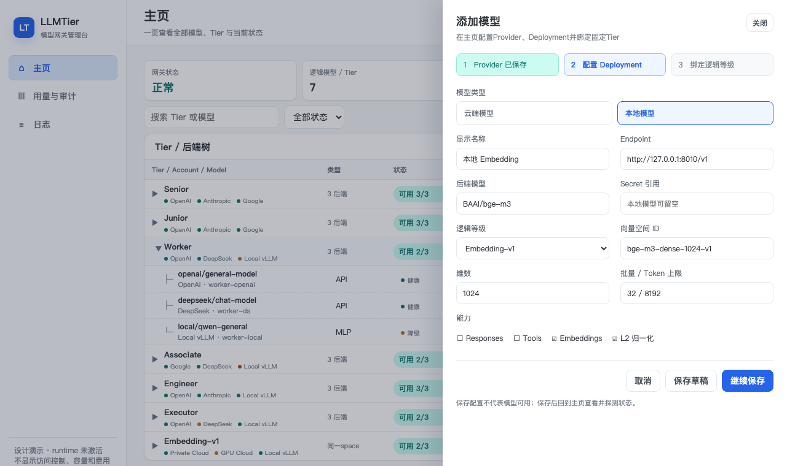
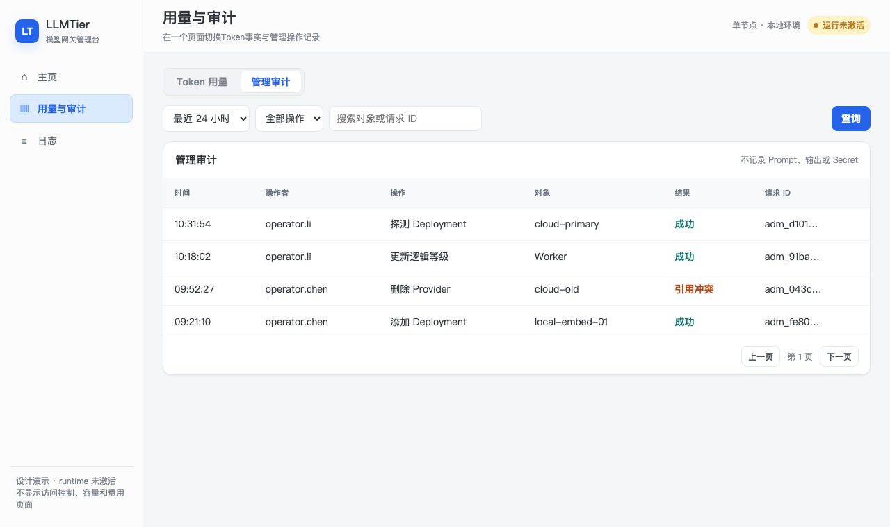
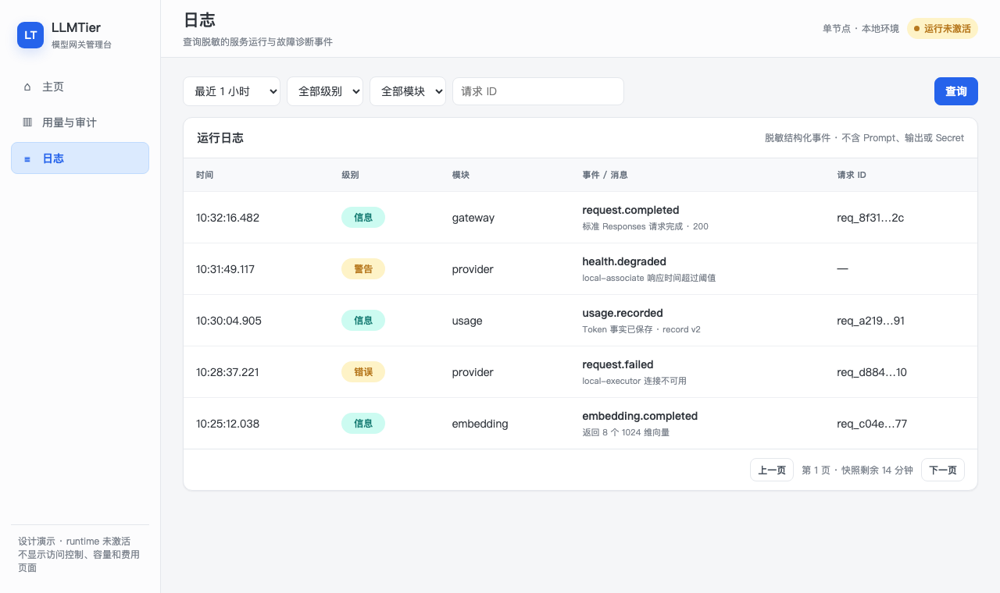

<!-- STD_DOCUMENT_COVER_BEGIN -->
# LLMTier V0.3 English Web UI Design

| 文档字段 | 值 |
|---|---|
| Document ID | `llmtier-webui-module-design` |
| Document Version | `0.3.0-draft.9` |
| Status | `In Review` |
| Project | `LLMTier` |
| Authority | `LLMTier` |
| Document Owner | LLMTier |
| Authors | llmtier |
| Reviewer | Piko、Slinky、LLMTier |
| Approver | LLMTier |
| Approval Date | 待定 |
| Created Date | `2026-09-17` |
| Last Modified Date | `2026-09-18` |
| Template Version | `1.0.0` |
| Template ID | `design.definition` |
| Template Conformance | `tailored` |
| Tailoring Reference | `std-tailoring` |
| Migration Map Reference | none |
| Repository | `corezilla/LLMTier` |
| Canonical Path | `docs/40_module_design/webui-design.md` |
| Supersedes | none |
<!-- STD_DOCUMENT_COVER_END -->

## 1. 设计原则

Web UI is LLMTier's English-language operator console. It calls `/tier/admin/v1` on the same origin and never reads SQLite, settings, or Secrets directly. It keeps the established compact frame: fixed narrow sidebar, page title and status header, and one primary card per short page. It has four pages only: Home, Providers, Usage & Audit, and Logs. Runtime status and Tier membership are managed from the Tier tree; provider connections are managed on the Providers page. There is no global Add Model action.

[打开可切换的静态 Demo](demos/webui/index.html)。以下图片由该Demo在1280×760视口生成，作为布局和信息层级基线；它们不是已经接线的产品截图。

不提供访问控制、容量配置、恢复、费用、调用方页面；主页只读显示当前running/max并发事实。宽度小于960px时侧栏折叠为顶部菜单；表格允许横向滚动，不把三个页面拼成长页。状态与高频操作优先使用紧凑图标，并用`title`、`aria-label`和非颜色文字保留可理解性。

## 2. 页面一：主页

- 主页使用两层树形表格，而不是把三个后端横向塞进同一行。Tier是父节点；展开后每个后端成为独立子节点，显示provider、model、类型、健康状态、版本与`running/max`并发。Tier行显示聚合状态、聚合并发及最近七日Tier级Calls/Tokens；token事实存在Unknown时不填0。由于当前Usage记录只保存逻辑Tier而不保存最终选中的Deployment，后端行不得虚构单模型用量，显示`—`并说明数据边界。
- 主页不显示重复的Gateway/Tier/Backend/Health统计卡，也不显示搜索、手工刷新或全局`Add Model`。全局页头紧凑显示Gateway总状态、可用Tier/总Tier、Running模型/总模型、当前请求/配置并发上限以及Version/Updated。每个Tier行右侧使用图标`Edit`。V0.3当前Tier集合为`Senior`、`Junior`、`Worker`、`Associate`、`Engineer`、`Executor`与独立的`Embedding-v1`，不分页隐藏当前目录项。
- Tier集合和映射来自Registry；演示中的后端模型名仅用于布局，不构成生产配置。物理凭据不展示。
- 推理Tier可绑定不同供应商但必须能力兼容且保持同一exact Tier；`Embedding-v1`的三个deployment必须是同一`BAAI/bge-m3`模型版本、预处理和`embedding_space_id`，不能把不同向量空间挂在同一Tier下。物理Provider模型ID按各runtime实际API ID展示，不要求字符串都写成`BAAI/bge-m3`。
- 编辑先GET item保存ETag，PATCH携带If-Match。412显示“配置已被他人修改”，保留用户输入并提供重新载入，不自动覆盖。
- Tier是固定逻辑等级，主页不提供删除Tier；只允许编辑其后端绑定。Provider或Deployment等可删除资源仍须在对应编辑流程显示引用关系、携带If-Match；409显示引用列表摘要，禁止强删。
- Loading用表格骨架；空Tier显示“no members”并仍可进入`Edit`；401跳登录，403显示无operator权限；503保留旧画面并标“data may be stale”。

### 2.1 Tier成员编辑抽屉

- 抽屉列出当前Tier全部成员，每项可修改已有Deployment的Provider、显示名和backend model ID；保存使用Deployment当前ETag与partial PATCH。
- `Add Member`的Provider下拉框只列出Providers页面中已存在的Provider。页面不在此处创建Provider、Secret或第二套连接配置；没有Provider时禁用添加并提示先进入Providers页面。
- 添加成员先POST Deployment，再以Tier当前ETag PATCH ServiceLevel的`deployment_ids`。第一步成功、第二步失败时保留真实错误和已创建Deployment，不谎称原子成功，也不自动删除可能已被引用的资源。
- `Remove`只从当前Tier解绑Deployment，不删除Deployment或Provider。共享Deployment可继续被其他Tier使用；资源删除由其专属管理流程和409引用保护处理。
- Tier固定且不可删除。`Embedding-v1`新成员沿用该Tier固定的Embedding能力和向量空间约束；推理Tier新成员沿用Responses能力。跨向量空间变更不得通过仅修改backend model ID绕过。
- 保存成功只说明配置落库，不说明probe、health或ready成功。

主页首次进入和从其他页面返回时自动读取health/readiness，不触发模型请求。后端行的“探测”先显示二次确认：“可能产生费用并改变最后探测状态”，确认后发送`confirm_external_call=true`。探测中仅禁用对应后端；网络结果未知时提示重新进入主页核对，不自动重复。保存成功、health成功和probe成功仍是三个不同状态。

## 3. 页面二：供应商管理

- 页面列出Provider名称、类型、OpenAI-compatible API root、Secret是否已配置、运行状态、账号用量、Calls/Tokens、聚合`running/max`和操作。当前v0.3 provider adapter未提供账号quota且Usage记录不能可靠归属到最终Provider，因此对应账号用量及Provider Calls/Tokens必须显示`Unknown`，不能从Tier总量猜测；并发可由该Provider下Deployment runtime snapshot安全聚合。
- `Add Provider`仅在本页出现。新增/编辑支持cloud/local、名称、API root、Secret reference和enabled；Secret只写不回显，编辑时空白表示保持已有Secret。
- 删除携带当前ETag。Provider仍被任何Deployment引用时，服务端409拒绝删除；UI显示错误，不级联删除Deployment或Tier成员。
- Provider API root通常以`/v1`结尾；运行时在其后调用`/models`、`/responses`或`/embeddings`，页面不得猜测或重复拼接版本段。

## 4. 页面三：用量与审计

页面顶部用页签切换`Token用量`和`管理审计`，一次只显示一张表，避免页面过长。页签切换不改变查询条件之外的服务状态，也不把用量事实与审计事件混成同一数据集。

### 4.1 Token用量

- 同request ID只展示最高record_version；版本更新替换原行，不累计。
- Unknown显示“未知”，绝不显示0；cache read/write和reasoning token在展开行展示。
- cursor绑定筛选与snapshot；翻页期间的新记录下次查询显示。503显示“用量存储不可用”，不能显示空表。
- 不显示Cost、币种或估算金额。

### 4.2 管理审计

- 只显示脱敏actor/action/target/result/time/request ID；无prompt/output/token/Secret。
- Audit只读；过滤与cursor保留在URL query，刷新可恢复同一视图。

## 5. 页面四：日志

- 日志是服务运行与故障诊断事件；审计是operator管理动作，两者不混用。
- 只返回服务端先行脱敏的结构化字段：时间、级别、模块、事件、短消息和可空request ID。禁止Prompt、模型输出、reasoning正文、Embedding向量、Authorization、Secret或完整请求头进入日志记录和API。
- 支持时间、级别、模块和request ID过滤；游标绑定稳定快照。日志存储不可读时返回503，不用空页伪装“没有日志”。
- 日志详情文本有长度上限；UI不渲染HTML。保留期限和清理由运维设计控制，不提供浏览器下载全量日志。

## 6. 通用交互状态

| 状态 | 规则 |
|---|---|
| Loading | 保持页面框架，局部骨架；不清空上次成功数据 |
| Empty | 说明是“无数据”而不是“加载失败” |
| Validation | English field-level error beside the field; focus the first error |
| 401 | 清除UI会话并要求重新认证，不回显token |
| 403 | 显示无operator权限，不猜资源是否存在 |
| 409 | 显示引用冲突，可跳回主页 |
| 412 | 显示stale edit，允许复制未保存输入后重新载入 |
| 429/503 | 显示Retry-After（若有）；不自动无限重试 |
| Unknown result | 先GET核对，不盲目重发mutation |

All buttons support keyboard operation and visible focus; status never relies on color alone; delete and chargeable probes require confirmation. All visible page copy, labels, status values, provider types, and empty/error states use English. Machine error codes remain available in Details for diagnosis.

## 7. 认证与浏览器安全

Web UI本身不提供“访问控制”业务页，也不实现账号库。production由同源TLS反向代理完成operator SSO/MFA，
浏览器只持有代理签发的`Secure; HttpOnly; SameSite=Strict`短期会话cookie；代理在服务端换取/注入Admin bearer，
bearer不进入JavaScript、URL、localStorage或sessionStorage。所有mutation还必须校验同源`Origin`和代理CSRF token。
401跳转到外部登录，403留在当前页并显示权限不足；logout由代理撤销会话后清空内存草稿。LLMTier Admin API仍只
接受现有`AdminBearerAuth`，不新增登录endpoint、用户管理Schema或第二认证路径。development若没有认证代理，
Web UI保持disabled，operator使用CLI/API；不提供把长期token粘贴进浏览器的降级模式。

## 8. API字段映射

| UI | Read | Mutation |
|---|---|---|
| 主页 | provider/deployment/service-level pages、healthz/readyz、admin runtime snapshot、admin usage page、deployment health + ETag | Tier抽屉POST Deployment、PATCH Deployment、PATCH Tier membership + If-Match；不创建Provider |
| Providers | provider/deployment pages、admin runtime snapshot + ETag；账号quota和Provider归属Usage不可得时显示Unknown | Provider POST/PATCH/DELETE + If-Match；引用中的Provider由409保护 |
| 用量与审计 | admin usage page、audit page | 无 |
| 日志 | sanitized log page | 无 |

`runtime_activation=false`；本文是设计，不是浏览器实现或capture。
