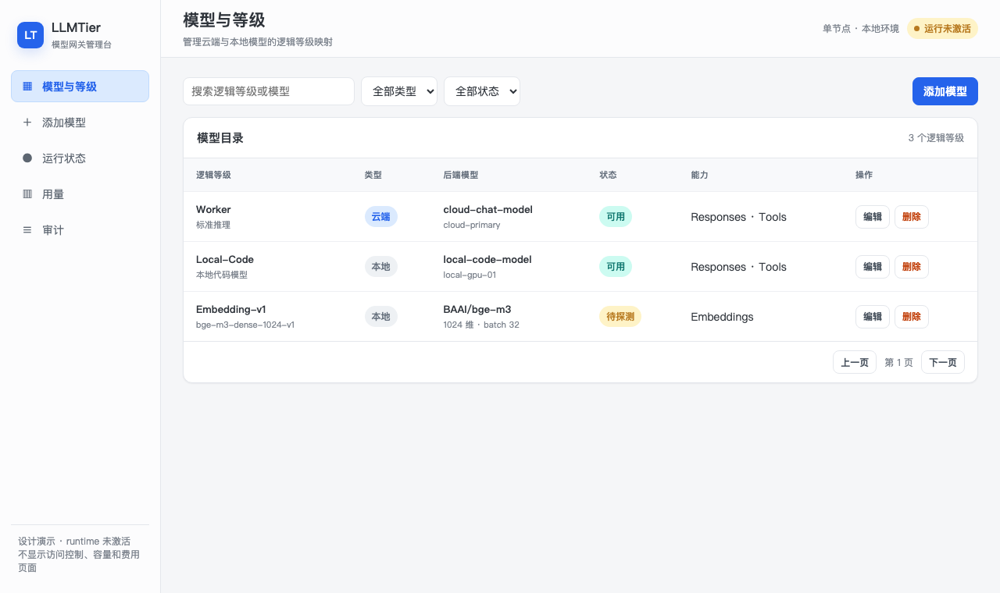
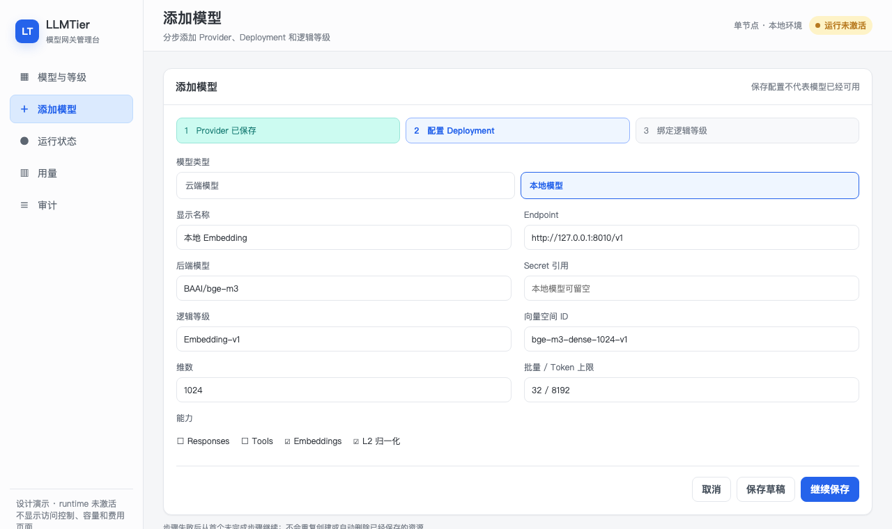
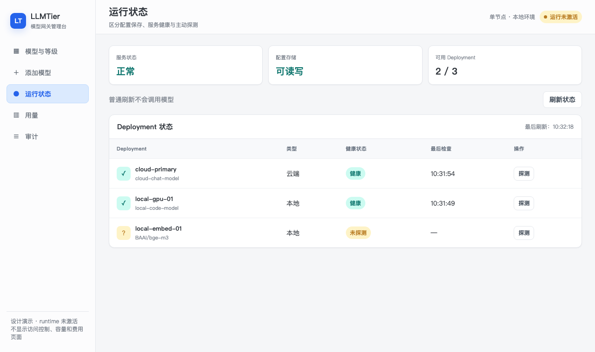
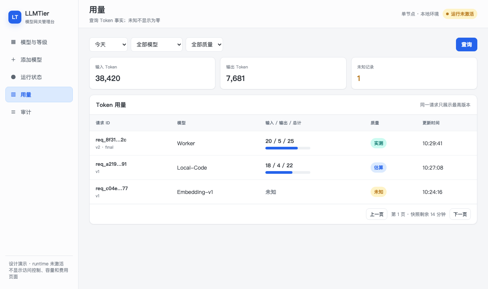
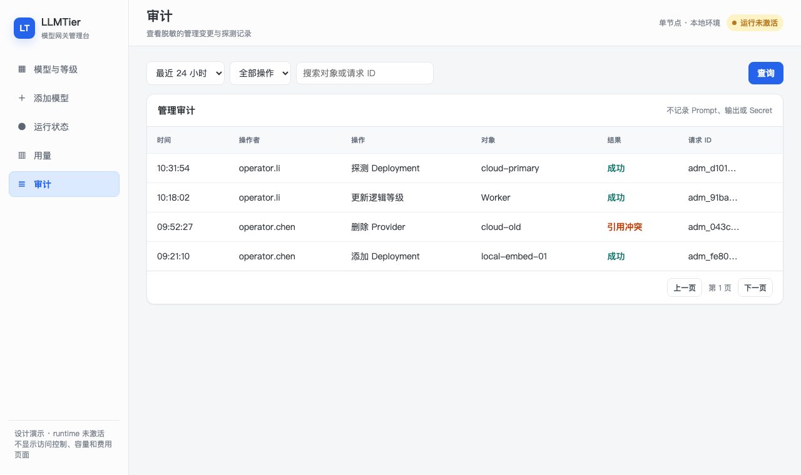

<!-- STD_DOCUMENT_COVER_BEGIN -->
# LLMTier V0.3 中文 Web UI 设计

| 文档字段 | 值 |
|---|---|
| Document ID | `llmtier-webui-module-design` |
| Document Version | `0.3.0-draft.3` |
| Status | `In Review` |
| Project | `LLMTier` |
| Authority | `LLMTier` |
| Document Owner | LLMTier |
| Authors | llmtier |
| Reviewer | Piko、Slinky、LLMTier |
| Approver | LLMTier |
| Approval Date | 待定 |
| Created Date | `2026-09-17` |
| Last Modified Date | `2026-09-17` |
| Template Version | `1.0.0` |
| Template ID | `design.definition` |
| Template Conformance | `tailored` |
| Tailoring Reference | `std-tailoring` |
| Migration Map Reference | none |
| Repository | `corezilla/LLMTier` |
| Canonical Path | `docs/40_module_design/webui-design.md` |
| Supersedes | none |
<!-- STD_DOCUMENT_COVER_END -->

## 1. 设计原则

Web UI 是LLMTier自己的中文operator界面，同源调用`/tier/admin/v1`，不直读SQLite、settings或Secret。沿用Slinky式框架：固定窄侧栏、顶部标题/状态、单页主卡片；页面短、一次只完成一个目标。只有五页：模型与等级、添加模型、运行状态、用量、审计。

[打开可切换的静态 Demo](demos/webui/index.html)。以下图片由该Demo在1280×760视口生成，作为布局和信息层级基线；它们不是已经接线的产品截图。

不提供访问控制、容量、恢复、费用、调用方页面。宽度小于960px时侧栏折叠为顶部菜单；表格允许横向滚动，不把五页拼成长页。

## 2. 页面一：模型与等级

- 数据：Provider/Deployment/ServiceLevel分页视图合成；物理凭据不展示。
- 编辑先GET item保存ETag，PATCH携带If-Match。412显示“配置已被他人修改”，保留用户输入并提供重新载入，不自动覆盖。
- 删除弹窗显示被引用资源；携带If-Match。409显示引用列表摘要，禁止强删。
- Loading用表格骨架；空状态提供“添加模型”；401跳登录，403显示无operator权限；503保留旧画面并标“数据可能过期”。

## 3. 页面二：添加/修改模型

- 添加按Provider→Deployment→ServiceLevel顺序提交；任一步失败显示已完成步骤，不谎称整体成功。后续实现可用单次页面编排，但不新增外部聚合endpoint。
- 页面先在浏览器内存创建`ModelDraft`，只保存非Secret表单值和本次已创建资源的ID/ETag。每一步成功后立即更新进度：
  `Provider已保存 → Deployment已保存 → ServiceLevel已保存`。失败后“继续保存”从第一个未完成步骤开始，
  已完成步骤改用GET+ETag核对，不重复POST。刷新或关闭页面会丢弃草稿，但不会删除已落库资源；重新进入时可从
  模型与等级页继续编辑。取消也不自动补偿删除，避免误删已被其他等级引用的资源；用户只能通过已有带If-Match
  的显式删除操作清理。这样没有伪原子事务，也不新增聚合endpoint。
- 修改时Secret空白=保持；用户选择“移除Secret”才发null。页面不读取原值。
- Embedding必须填写space ID、允许维数、batch/input token上限；同逻辑等级绑定不兼容space时保存前阻止并提示新建逻辑model ID。
- 保存成功只说明配置落库，不说明probe或ready成功。

## 4. 页面三：运行状态

- 普通刷新只读health/readiness，不触发模型请求。
- “探测”先显示二次确认：“可能产生费用并改变最后探测状态”；确认后发送`confirm_external_call=true`。
- 探测中逐行禁用；网络结果未知时显示“结果未知，请刷新核对”，不自动重复。
- 保存成功、health成功和probe成功为三个不同状态。

## 5. 页面四：用量

- 同request ID只展示最高record_version；版本更新替换原行，不累计。
- Unknown显示“未知”，绝不显示0；cache read/write和reasoning token在展开行展示。
- cursor绑定筛选与snapshot；翻页期间的新记录下次查询显示。503显示“用量存储不可用”，不能显示空表。
- 不显示Cost、币种或估算金额。

## 6. 页面五：审计

- 只显示脱敏actor/action/target/result/time/request ID；无prompt/output/token/Secret。
- Audit只读；过滤与cursor保留在URL query，刷新可恢复同一视图。

## 7. 通用交互状态

| 状态 | 规则 |
|---|---|
| Loading | 保持页面框架，局部骨架；不清空上次成功数据 |
| Empty | 说明是“无数据”而不是“加载失败” |
| Validation | 字段旁中文错误，首个错误获焦点 |
| 401 | 清除UI会话并要求重新认证，不回显token |
| 403 | 显示无operator权限，不猜资源是否存在 |
| 409 | 显示引用冲突，可跳回模型与等级 |
| 412 | 显示stale edit，允许复制未保存输入后重新载入 |
| 429/503 | 显示Retry-After（若有）；不自动无限重试 |
| Unknown result | 先GET核对，不盲目重发mutation |

所有按钮可用键盘操作，有可见焦点；状态不只依赖颜色；删除/收费probe必须二次确认。页面文本使用简体中文，机器错误码保留在“详情”中便于诊断。

## 8. 认证与浏览器安全

Web UI本身不提供“访问控制”业务页，也不实现账号库。production由同源TLS反向代理完成operator SSO/MFA，
浏览器只持有代理签发的`Secure; HttpOnly; SameSite=Strict`短期会话cookie；代理在服务端换取/注入Admin bearer，
bearer不进入JavaScript、URL、localStorage或sessionStorage。所有mutation还必须校验同源`Origin`和代理CSRF token。
401跳转到外部登录，403留在当前页并显示权限不足；logout由代理撤销会话后清空内存草稿。LLMTier Admin API仍只
接受现有`AdminBearerAuth`，不新增登录endpoint、用户管理Schema或第二认证路径。development若没有认证代理，
Web UI保持disabled，operator使用CLI/API；不提供把长期token粘贴进浏览器的降级模式。

## 9. API字段映射

| UI | Read | Mutation |
|---|---|---|
| 模型与等级 | provider/deployment/service-level pages + ETag | PATCH/DELETE + If-Match |
| 添加模型 | item GET（编辑时） | POST或partial PATCH |
| 运行状态 | healthz/readyz、deployment health | POST probes |
| 用量 | admin usage page | 无 |
| 审计 | audit page | 无 |

`runtime_activation=false`；本文是设计，不是浏览器实现或capture。
