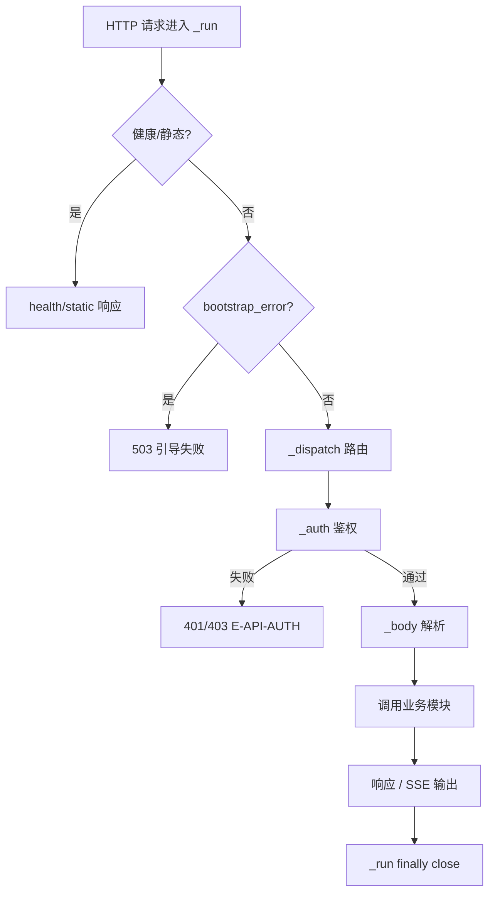

<!-- STD_DOCUMENT_COVER_BEGIN -->
# LLMTier M001 HTTP API 实现规格设计（ISD）

> STD 使用入口：[项目采用说明与标准导航](../../README.md#std-entry)

| 文档字段 | 值 |
|---|---|
| Document ID | `http-api-isd` |
| Document Version | `0.1.0-draft.1` |
| Status | `Draft` |
| Project | `LLMTier` |
| Document Owner | LLMTier |
| Last Modified Date | `2026-09-23` |
| Template ID | `design.implementation` |
| Template Version | `0.5.0` |
<!-- STD_DOCUMENT_COVER_END -->

## 1. 实现目标与输入基线

<a id="isd-scope"></a>

### 1.1 实现对象

- **模块 ID / 名称**：M001 / HTTP API
- **直属父对象 / 父设计**：LLMTier 软件系统 / `llmtier-system-design`（§3.2 登记）
- **模块设计 Document ID / 版本 / 路径 / 摘要**：`http-api` / `0.1.0-draft.2` / `docs/40_module_design/http-api-design.md` / §2 F-API-LISTEN/DISPATCH/AUTH/REQID/BODY/SSE/STATIC/HEALTH/ERRMAP、§8 RULE-API-*
- **需求与 Constraint ID**：`C-TRUST-1..5`、`C-INFER-1/2`、`C-OBS-5`；机制 `R-TRUST-02`、`R-INF-01`、`R-MET-04`、`R-CFG-04`、`R-OBS-04`
- **实现范围 / 非目标**：实现统一 HTTP/SSE 入口（路由/信任/请求身份/body 限长/静态/健康/错误信封）；**非目标**：业务规则、持久化、SSO
- **ISD 默认落位或项目批准路径**：`docs/50_implementation_design/http-api.isd.md`

<a id="isd-handoff"></a>

### 1.2.1 `HO-API-01` · 访问信任分发

- **上游信息项 / 规则 ID**：`R-TRUST-02`
- **固定来源 / 版本 / 锚点 / 摘要**：机制 `M-TRUST` §14.4 `R-TRUST-02`
- **ISD 细化内容 / 章节**：端点→角色、免登录/Bearer、`Principal` → §5.1.2/§5.1.3
- **唯一权威位置**：行为在 M-TRUST §14.4；本层管落实
- **实现自由度**：分发实现
- **原 V/Case 及本地验证位置**：`VRC-API-002` → §9.1

### 1.2.2 `HO-API-02` · SSE 传输

- **上游信息项 / 规则 ID**：`R-INF-01`
- **固定来源 / 版本 / 锚点 / 摘要**：机制 `M-INFER` §14.4 `R-INF-01`
- **ISD 细化内容 / 章节**：流头、逐帧 flush、终态唯一 → §5.1.5
- **唯一权威位置**：行为在 M-INFER §14.4；本层管落实
- **实现自由度**：传输实现
- **原 V/Case 及本地验证位置**：`VRC-API-003` → §9.1

### 1.2.3 `HO-API-03` · 用量/配置/诊断路由

- **上游信息项 / 规则 ID**：`R-MET-04`、`R-CFG-04`、`R-OBS-04`
- **固定来源 / 版本 / 锚点 / 摘要**：机制 `M-METER`/`M-CONFIG`/`M-OBS` §14.4
- **ISD 细化内容 / 章节**：路由与错误映射 → §5.1.1
- **唯一权威位置**：行为在各机制 §14.4；本层管落实
- **实现自由度**：映射实现
- **原 V/Case 及本地验证位置**：`VRC-API-004` → §9.1

## 2. 既有实现差异（条件章节）

<a id="isd-current-target"></a>

### 2.1 适用性

- **适用性**：`not_applicable`
- **依据**：greenfield/设计先行
- **Tailoring / 范围决定引用**：`std-tailoring`（设计先行）

## 3. 文件、内部组件与调用关系

<a id="isd-structure"></a>

```text
app.py
 ├─ Application（装配 Store/Registry/Router/Usage/... + Handler）
 ├─ handler_factory(app) -> Handler
 │    ├─ _run()           # request_id + 统一错误出口 + finally close
 │    ├─ _dispatch()      # 路由
 │    ├─ _auth(role)/_auth_either()
 │    ├─ _body()/_json()/_static()
 │    └─ do_GET/do_POST/do_PATCH/do_DELETE = _run
 └─ serve(host, port, database, settings)
auth.py     # Principal / authenticate / authenticate_any / unauthenticated_principal
errors.py   # ApiError / require
sse.py      # frame / response_stream
health.py   # health_view / readiness_view
webui/      # 静态资源（M002 产物）
```

### 3.1 `app.py` · `Application` / `Handler`

- **职责及调用者**：路由、信任分发、body 限长、SSE、静态、健康、错误信封；caller=HTTP 客户端
- **类型 / 函数**：`Application`、`handler_factory`、`Handler._run/_dispatch/_auth/_auth_either/_body/_json/_static`、`serve`
- **可见性**：public（进程入口）
- **调用与类型依赖**：依赖 M003/M004/M005 服务；`auth`/`errors`/`sse`/`health`
- **构建目标 / 生成源 / 输出**：进程入口
- **实现状态**：PLANNED

### 3.2 `auth.py` · 信任判定

- **职责及调用者**：免登录/Bearer 判定，产出 `Principal`；caller=`Handler._auth*`
- **类型 / 函数**：`Principal`、`unauthenticated_principal`、`authenticate`、`authenticate_any`
- **可见性**：private
- **调用与类型依赖**：标准库 `hmac`/`ipaddress`
- **构建目标 / 生成源 / 输出**：随包
- **实现状态**：PLANNED

### 3.3 `errors.py` / `sse.py` / `health.py`

- **职责及调用者**：错误类型与信封 / SSE 帧 / 健康就绪；caller=`Handler` 与业务模块
- **类型 / 函数**：`ApiError`、`require`；`frame`、`response_stream`；`health_view`、`readiness_view`
- **可见性**：private
- **调用与类型依赖**：标准库
- **构建目标 / 生成源 / 输出**：随包
- **实现状态**：PLANNED

## 4. 内部数据与所有权

<a id="isd-data"></a>

纯软件：无原生 ABI（HTTP/UTF-8 JSON）。

### 4.1 `Principal`

- **类型 / 字段**：`principal_id: str(≤128)`；`role: Literal["data","admin"]`
- **单位 / 初值 / 范围 / 不变量**：不可变；role 二值
- **逻辑编码与原生 ABI 适用性**：N/A + 依据（HTTP 头/内存对象）
- **创建 / 修改者**：`auth` 构造
- **Owner / 借用期限 / 释放者**：请求级；业务只读
- **公共类型 authority**：private
- **持久化与敏感性**：transient；不落日志/库

### 4.2 `ApiError`

- **类型 / 字段**：`status:int`；`code:str`；`message:str`；`param:str|None`；`retryable:bool`；`headers:dict|None`；`extra:dict|None`
- **单位 / 初值 / 范围 / 不变量**：`envelope()` 产 `{"error":{...}}`
- **逻辑编码与原生 ABI 适用性**：N/A
- **创建 / 修改者**：任意模块抛出
- **Owner / 借用期限 / 释放者**：请求级
- **公共类型 authority**：private
- **持久化与敏感性**：transient

### 4.3 SSE 帧

- **类型 / 字段**：`event:<name>\ndata:<json>\n\n`（UTF-8）
- **单位 / 初值 / 范围 / 不变量**：`sequence_number` 单调
- **逻辑编码与原生 ABI 适用性**：N/A（文本协议）
- **创建 / 修改者**：`sse.frame`/`response_stream`
- **Owner / 借用期限 / 释放者**：请求级流
- **公共类型 authority**：private
- **持久化与敏感性**：transient

## 5. 函数与接口实现规格

<a id="isd-functions"></a>

### 5.1.1 `FUNC-API-DISPATCH` · `Handler._dispatch`

- **文件 / symbol / 可见性**：`app.py` / `Handler._dispatch` / private
- **原成员 ID 或私有来源**：`F-API-DISPATCH`
- **完整签名与 caller**：`_dispatch(self) -> None`；caller=`_run`
- **输入参数 / 数据结构 authority**：`self.path/command/headers`
- **输入约束 / 校验顺序 / 失败映射**：健康/静态优先 → `bootstrap_error` 拦截 → 业务路由；未知 → `E-API-404`
- **成功输出 / 数据结构 / 后置条件**：写响应；调用业务服务
- **错误输出 / 触发条件 / 优先级**：`E-API-404`（404）
- **副作用 / 执行上下文 / 幂等性**：调用下游（可能副作用）
- **输入输出 ownership 与寿命**：请求级
- **不可改变的规则 / Constraint ID**：路由优先级
- **实现自由度**：路由表实现
- **Thread-safe / reentrant**：每请求一线程
- **Nested-call policy**：allowed
- **Transaction participation**：none
- **Blocking / timeout / cancellation**：SSE 空闲 60 s
- **实现状态 / 验证项**：PLANNED；`VRC-API-001`

### 5.1.2 `FUNC-API-AUTH` · `Handler._auth` / `_auth_either`

- **文件 / symbol / 可见性**：`app.py` / `Handler._auth/_auth_either` / private
- **原成员 ID 或私有来源**：`F-API-AUTH`（`R-TRUST-02`）
- **完整签名与 caller**：`_auth(role="data") -> Principal`；`_auth_either() -> (Principal,bool)`
- **输入参数 / 数据结构 authority**：headers、client_address
- **输入约束 / 校验顺序 / 失败映射**：免登录 → 否则 Bearer；失败 → `E-API-AUTH`
- **成功输出 / 数据结构 / 后置条件**：`Principal`
- **错误输出 / 触发条件 / 优先级**：503/401/403
- **副作用 / 执行上下文 / 幂等性**：无副作用；幂等
- **输入输出 ownership 与寿命**：请求级
- **不可改变的规则 / Constraint ID**：端点→角色固定；恒定时间；401/403 不泄露存在性
- **实现自由度**：解析实现
- **Thread-safe / reentrant**：yes
- **Nested-call policy**：allowed
- **Transaction participation**：none
- **Blocking / timeout / cancellation**：无
- **实现状态 / 验证项**：PLANNED；`VRC-API-002`

### 5.1.3 `FUNC-API-BODY` · `Handler._body`

- **文件 / symbol / 可见性**：`app.py` / `Handler._body` / private
- **原成员 ID 或私有来源**：`F-API-BODY`
- **完整签名与 caller**：`_body(self) -> dict`；caller=`_dispatch`
- **输入参数 / 数据结构 authority**：request body
- **输入约束 / 校验顺序 / 失败映射**：`Content-Length > 2MB` → 413；JSON 非法 → 400
- **成功输出 / 数据结构 / 后置条件**：dict（只读交业务）
- **错误输出 / 触发条件 / 优先级**：`E-API-413`、`E-API-400`
- **副作用 / 执行上下文 / 幂等性**：无
- **输入输出 ownership 与寿命**：请求级
- **不可改变的规则 / Constraint ID**：2 MB 上限
- **实现自由度**：解析实现
- **Thread-safe / reentrant**：yes
- **Nested-call policy**：allowed
- **Transaction participation**：none
- **Blocking / timeout / cancellation**：读 body 无超时
- **实现状态 / 验证项**：PLANNED；`VRC-API-003`

### 5.1.4 `FUNC-API-STATIC` · `Handler._static`

- **文件 / symbol / 可见性**：`app.py` / `Handler._static` / private
- **原成员 ID 或私有来源**：`F-API-STATIC`
- **完整签名与 caller**：`_static(self, path) -> None`
- **输入参数 / 数据结构 authority**：路径
- **输入约束 / 校验顺序 / 失败映射**：`target.resolve()` 必须落在 `webui/`；否则 404
- **成功输出 / 数据结构 / 后置条件**：文件响应（`Cache-Control: no-store`）
- **错误输出 / 触发条件 / 优先级**：404
- **副作用 / 执行上下文 / 幂等性**：只读
- **输入输出 ownership 与寿命**：请求级
- **不可改变的规则 / Constraint ID**：无目录穿越
- **实现自由度**：解析实现
- **Thread-safe / reentrant**：yes
- **Nested-call policy**：allowed
- **Transaction participation**：none
- **Blocking / timeout / cancellation**：本地读
- **实现状态 / 验证项**：PLANNED；`VRC-API-004`

### 5.1.5 `FUNC-API-SSE` · `response_stream`

- **文件 / symbol / 可见性**：`sse.py` / `frame`、`response_stream` / private
- **原成员 ID 或私有来源**：`F-API-SSE`（`R-INF-01`）
- **完整签名与 caller**：`frame(event, data) -> bytes`；`response_stream(response) -> Iterable[bytes]`；caller=`_dispatch`（responses 分支）
- **输入参数 / 数据结构 authority**：终态 `ResponsesResponse`
- **输入约束 / 校验顺序 / 失败映射**：帧序固定；恰好一个 terminal
- **成功输出 / 数据结构 / 后置条件**：SSE 帧序列 + terminal + `[DONE]`
- **错误输出 / 触发条件 / 优先级**：断开 → 结束（不抛）
- **副作用 / 执行上下文 / 幂等性**：流式；不幂等
- **输入输出 ownership 与寿命**：请求级流
- **不可改变的规则 / Constraint ID**：帧序/terminal 唯一（`C-INFER-1/2`）
- **实现自由度**：缓冲实现
- **Thread-safe / reentrant**：请求线程
- **Nested-call policy**：allowed
- **Transaction participation**：none
- **Blocking / timeout / cancellation**：空闲 60 s
- **实现状态 / 验证项**：PLANNED；`VRC-API-003`

### 5.1.6 `FUNC-API-HEALTH` · `health_view` / `readiness_view`

- **文件 / symbol / 可见性**：`health.py` / `health_view`、`readiness_view` / private
- **原成员 ID 或私有来源**：`F-API-HEALTH`
- **完整签名与 caller**：`health_view(version) -> dict`；`readiness_view(registry) -> (dict,int)`
- **输入参数 / 数据结构 authority**：版本、Registry
- **输入约束 / 校验顺序 / 失败映射**：引导失败 → `/readyz` 503
- **成功输出 / 数据结构 / 后置条件**：健康/就绪 JSON + 状态码
- **错误输出 / 触发条件 / 优先级**：503 not_ready
- **副作用 / 执行上下文 / 幂等性**：无副作用；幂等
- **输入输出 ownership 与寿命**：请求级
- **不可改变的规则 / Constraint ID**：无副作用健康
- **实现自由度**：实现
- **Thread-safe / reentrant**：yes
- **Nested-call policy**：allowed
- **Transaction participation**：none
- **Blocking / timeout / cancellation**：—
- **实现状态 / 验证项**：PLANNED；`VRC-API-004`

### 5.2 错误传播矩阵

#### 5.2.1 `E-API-404` · 未知路由

- **底层异常 / 失败事实**：路由未命中
- **模块是否处理及处理函数**：reject（`_dispatch` 抛 `ApiError`）
- **Typed 异常与原生异常所有权**：`ApiError(404)`；`_run` 捕获 → 信封
- **宿主 / public payload 或状态码**：404 `not_found`
- **日志级别 / 脱敏 / 关联字段**：无
- **是否可重试及前提**：修路径
- **状态与副作用影响 / 验证项**：`VRC-API-001`

#### 5.2.2 `E-API-AUTH` · 鉴权失败

- **底层异常 / 失败事实**：缺配置/缺凭据/凭据错误
- **模块是否处理及处理函数**：reject（`auth`）
- **Typed 异常与原生异常所有权**：`ApiError(503/401/403)`
- **宿主 / public payload 或状态码**：503/401/403（不泄露存在性）
- **日志级别 / 脱敏 / 关联字段**：无
- **是否可重试及前提**：修凭据
- **状态与副作用影响 / 验证项**：`VRC-API-002`

#### 5.2.3 `E-API-BODY` · body 限长/解析失败

- **底层异常 / 失败事实**：超限 / 非法 JSON
- **模块是否处理及处理函数**：reject（`_body`）
- **Typed 异常与原生异常所有权**：`ApiError(413/400)`
- **宿主 / public payload 或状态码**：413/400
- **日志级别 / 脱敏 / 关联字段**：无
- **是否可重试及前提**：修 body
- **状态与副作用影响 / 验证项**：`VRC-API-003`

#### 5.2.4 `E-API-INTERNAL` · 未知异常

- **底层异常 / 失败事实**：未捕获异常
- **模块是否处理及处理函数**：recover（`_run` 记 `unhandled_error` + 500）
- **Typed 异常与原生异常所有权**：兜底；`ApiError(500)`
- **宿主 / public payload 或状态码**：500 `internal_error`
- **日志级别 / 脱敏 / 关联字段**：error（脱敏）
- **是否可重试及前提**：无
- **状态与副作用影响 / 验证项**：`VRC-API-001`

## 6. 关键流程与算法

<a id="isd-algorithms"></a>



### 6.1 `P-API-REQ` · 请求分发

- **触发与执行者**：HTTP 请求；请求线程
- **入口函数及数据**：`_run` → `_dispatch`
- **步骤 / 算法 / 复杂度**：生成 request_id → 分类（健康/静态/引导/业务）→ 鉴权 → body → 调业务 → 响应 → finally close；O(路由数)
- **判断事实来源**：path/method/headers
- **成功可见点**：HTTP 响应
- **失败、取消与清理**：`ApiError` 信封；未知 500；finally 关闭
- **代表输入与中间值**：`POST /v1/responses` → SSE
- **规则 / 接口 / 验证引用**：`RULE-API-ROUTE/ROLE/TRUST/ERRMAP`；`VRC-API-001..003`

### 6.2 `P-API-SSE` · 流式输出

- **触发与执行者**：`/v1/responses` 成功；请求线程
- **入口函数及数据**：`response_stream`
- **步骤 / 算法 / 复杂度**：发流头 → 逐帧 flush → terminal + `[DONE]`；O(事件数)
- **判断事实来源**：终态响应
- **成功可见点**：SSE 帧 + terminal
- **失败、取消与清理**：断开 → 记 aborted
- **代表输入与中间值**：`ResponsesResponse` → 帧序
- **规则 / 接口 / 验证引用**：`RULE-API-SSE`；`VRC-API-003`

### 6.3 `P-API-STATIC` · 静态交付

- **触发与执行者**：`/ui/*`；请求线程
- **入口函数及数据**：`_static`
- **步骤 / 算法 / 复杂度**：安全解析 → 读文件；O(1)
- **判断事实来源**：`target.resolve()` 落在 `webui/`
- **成功可见点**：文件响应
- **失败、取消与清理**：404
- **代表输入与中间值**：`../` → 404
- **规则 / 接口 / 验证引用**：`RULE-API-STATIC`；`VRC-API-004`

## 7. 并发、失败、持久化与安全生命周期

<a id="isd-lifecycle"></a>

### 7.1 并发、交错与失败收口

#### 7.1.1 `CF-API-DISCONNECT` · 客户端断开

- **参与线程 / 回调 / 事务**：请求线程
- **已产生或可能产生的副作用**：部分输出已送达
- **检测事实 / 期限**：`BrokenPipeError`/`ConnectionResetError`
- **状态 / 错误 / 结果已知性**：未知
- **保留 / 释放责任**：`finally` 释放
- **允许的 query / replay / takeover / retry**：新请求为新调用
- **验证项**：`VRC-API-003`

#### 7.1.2 `CF-API-FD` · 连接泄漏

- **参与线程 / 回调 / 事务**：请求线程
- **已产生或可能产生的副作用**：fd 增长
- **检测事实 / 期限**：fd 计数
- **状态 / 错误 / 结果已知性**：无
- **保留 / 释放责任**：`_run` finally `Store.close()`
- **允许的 query / replay / takeover / retry**：无
- **验证项**：`VRC-API-001`

<a id="isd-persistence"></a>

### 7.2 持久化、恢复与 schema 演进

#### 7.2.1.1 N/A · 无自有持久化

- **原规则 / 事务**：本模块无自有持久状态（不写库；持久化由 M007 承担）
- **原子范围 / 事务外副作用**：无
- **开始 / 提交 / 回滚函数**：无
- **持久提交点 / 对外响应点**：无
- **响应丢失后的权威核对**：无
- **恢复入口 / 判定记录 / 重复恢复条件**：无
- **验证项**：无

#### 7.2.2 Schema 演进策略决定

- **Schema authority / 当前版本事实来源**：无本层 schema；事实来源为 M007 `schema_meta.schema_version`（`util.isd.md` §4.4）
- **允许的升级模式**：随 M007 —— 仅 **schema initialization**（空库建当前结构）
- **明确不接受的迁移模式**：无本层独立迁移；**不接受增量升级 / downgrade / 自动修复**
- **兼容边界**：本层不定义版本；仅在 M007 判定 ready 后服务
- **失败后的系统状态与责任方**：M007 拒绝启动（`not_ready`）；责任方=运维

#### 7.2.2.1 `SR-HTTPAPI-DELEGATE` · 拒绝规则

- **原规则**：本模块无自有 schema（随 M007）
- **升级 / 降级策略**：无升级、无降级（M007 仅初始化）
- **接受 / 拒绝条件**：接受=M007 空库初始化成功；拒绝=M007 判定版本不匹配 / 无版本表旧库 / 完整性失败
- **源 / 目标版本与转换函数**：无转换函数；随 M007 `schema_version`
- **拒绝后如何处理**：M007 拒绝启动，本模块不服务（不得静默修复）
- **验证项**：`VRC-API-001`

#### 7.2.3 库状态分支矩阵

| 库状态 | 判定事实 | 启动结果 | 是否允许重跑及条件 |
|---|---|---|---|
| 空库 | 无 `schema_meta` 且无用户表 | M007 原子初始化 → ready | 是（幂等）|
| 版本匹配 | `schema_version == EXPECTED` | ready | 是 |
| 版本不匹配 | `schema_version != EXPECTED` | M007 拒绝：`schema_version_mismatch` | 否 |
| 无版本表旧库 | 有用户表但无 `schema_meta` | M007 拒绝：`schema_unknown` | 否 |
| 部分初始化 | 初始化事务失败回滚 | 库保持空 | 是 |
| 完整性失败 | `integrity_check != ok` | M007 拒绝：`schema_integrity_failed` | 否 |

<a id="isd-security"></a>

### 7.3 安全、权限与可观测性

#### 7.3.1.1 `SEC-API-AUTH` · 入口单点鉴权

- **原规则**：`C-TRUST-1..5`
- **可信输入 / 敏感字段 / 检查对象**：`Authorization`、client_address、端点
- **检查函数 / 时点**：`_auth*` 在业务处理前
- **拒绝 / 宿主交付出口**：503/401/403（不泄露存在性）
- **脱敏 / 禁止输出**：凭据不落日志
- **日志 / 指标 / trace 口径及触发**：`X-Request-ID`；关联标识透传
- **验证项**：`VRC-API-002`

#### 7.3.2.1 `LSS-API-NONE` · 本地持久化安全

- **适用对象 / 路径 / Owner**：N/A（本模块无本地持久化）
- **依据**：本模块不写库/文件（静态只读交付）

## 8. 资源、构建与宿主接入

<a id="isd-resources"></a>

### 8.1 配置实现（条件项）

- **适用性 / 固定 authority**：applicable（少量部署参数）
- **配置 key / 来源 / 优先级**：`host`/`port`/`database`/`settings`（启动参数）；请求体上限 2 MB 固定
- **类型 / 单位 / 默认值 / 范围 / 字段约束**：`port` 1–65535；`database` 路径非空
- **读取 / 解析 / 校验 symbol**：`serve` / `Application.__init__`
- **生效点 / reload / 原子性 / 在途操作**：启动时；无 reload
- **缺失 / 非法 / 部分更新的错误出口**：端口占用 → 启动失败
- **敏感值存储 / 日志脱敏**：无敏感配置
- **验证项**：`VRC-API-001`

### 8.2.1 `RB-API-BUILD` · 构建与装配

- **目标文件 / 产物 / 构建目标**：`app.py`+`auth.py`+`errors.py`+`sse.py`+`health.py`；进程入口
- **工具链 / 语言 / 依赖版本**：Python 3.14；标准库 `http.server`
- **宿主接入 / 初始化 / 退出次序**：`serve` 建 `Application` → `ThreadingHTTPServer` → `serve_forever`；停机 `server_close` + `store.close`
- **环境 / 数据规模 / 冷热条件**：单进程；每请求一线程
- **峰值构成 / 上限 / 共享额度**：线程/请求；请求体 ≤2 MB
- **分段预算 / 总期限 / 计时点**：准入 30 s、上游 30 s/SSE 60 s（业务侧）
- **超限、部分启动与清理出口**：端口占用 → 启动失败；body 超限 → 413
- **构建或运行命令及前置条件**：`PYTHONPATH=src python3 -m pytest tests/ -q`

## 9. 验证规格与实现任务

<a id="isd-verification"></a>

### 9.1.1 `VRC-API-001` · 分发/错误/资源

- **Rule / 成员**：`FUNC-API-DISPATCH`、`RULE-API-ROUTE/ERRMAP`
- **V / Case / Vector**：v1 已知/未知路由；v2 未知异常→500；v3 fd 基线；v4 端口占用
- **输入 / 故障 / 环境**：请求；异常注入；隔离库
- **独立 Oracle / Expected**：200/404；500 + 日志；fd 稳定
- **Actual / Evidence**：NOT_RUN
- **Verdict**：NOT_RUN
- **测试入口 / 清理**：`tests/unit`；隔离库
- **Run ID / Status**：NOT_RUN

### 9.1.2 `VRC-API-002` · 鉴权

- **Rule / 成员**：`FUNC-API-AUTH`、`RULE-API-ROLE/TRUST`、`R-TRUST-02`
- **V / Case / Vector**：v1 免登录；v2 Bearer 正确/错误；v3 data 访问 admin；v4 不泄露存在性
- **输入 / 故障 / 环境**：地址/凭据；隔离库
- **独立 Oracle / Expected**：Principal；403；响应不可区分
- **Actual / Evidence**：NOT_RUN
- **Verdict**：NOT_RUN
- **测试入口 / 清理**：`tests/unit` + 契约
- **Run ID / Status**：NOT_RUN

### 9.1.3 `VRC-API-003` · body 与 SSE

- **Rule / 成员**：`FUNC-API-BODY`、`FUNC-API-SSE`、`R-INF-01`
- **V / Case / Vector**：v1 正常 SSE；v2 超限 413；v3 非法 JSON 400；v4 断开
- **输入 / 故障 / 环境**：请求/断开；隔离库
- **独立 Oracle / Expected**：事件子集 + terminal 唯一；413/400
- **Actual / Evidence**：NOT_RUN
- **Verdict**：NOT_RUN
- **测试入口 / 清理**：`tests/system`（Piko 联调）
- **Run ID / Status**：NOT_RUN

### 9.1.4 `VRC-API-004` · 静态与健康

- **Rule / 成员**：`FUNC-API-STATIC`、`FUNC-API-HEALTH`、`RULE-API-STATIC`
- **V / Case / Vector**：v1 目录穿越负例；v2 引导失败 `/readyz` 503
- **输入 / 故障 / 环境**：路径；空库
- **独立 Oracle / Expected**：404；503 not_ready
- **Actual / Evidence**：NOT_RUN
- **Verdict**：NOT_RUN
- **测试入口 / 清理**：`tests/unit`
- **Run ID / Status**：NOT_RUN

**运行命令**：全量 `PYTHONPATH=src python3 -m pytest tests/ tests/system/st_*.py -q`

<a id="isd-tasks"></a>

### 9.2.1 `TASK-API-DISPATCH` · 路由与错误

- **顺序 / 前置项**：1 / —
- **文件 / symbol / 构建目标**：`app.py` `_run/_dispatch`
- **不可改变的规则**：路由优先级、统一信封
- **实施动作**：实现路由与错误出口
- **完成检查**：`VRC-API-001`
- **实现状态**：PLANNED
- **验证状态 / Run**：NOT_RUN

### 9.2.2 `TASK-API-AUTH` · 鉴权分发

- **顺序 / 前置项**：2 / `TASK-API-DISPATCH`
- **文件 / symbol / 构建目标**：`app.py` `_auth*`、`auth.py`
- **不可改变的规则**：端点→角色、恒定时间、不泄露
- **实施动作**：实现信任分发
- **完成检查**：`VRC-API-002`
- **实现状态**：PLANNED
- **验证状态 / Run**：NOT_RUN

### 9.2.3 `TASK-API-SSE` · SSE/静态/健康

- **顺序 / 前置项**：3 / `TASK-API-DISPATCH`
- **文件 / symbol / 构建目标**：`sse.py`、`app.py` `_static`、`health.py`
- **不可改变的规则**：帧序/terminal、无穿越、503 语义
- **实施动作**：实现 SSE/静态/健康
- **完成检查**：`VRC-API-003/004`
- **实现状态**：PLANNED
- **验证状态 / Run**：NOT_RUN

## 10. 映射、复核与未决项

<a id="isd-mapping"></a>

### 10.1.1 `MAP-API` · 映射

- **模块 / 原成员 ID**：M001 / `F-API-*`
- **唯一来源 / 版本 / selector / hash**：`http-api` / `0.1.0-draft.2`
- **提供或消费 / backend**：提供（HTTP/SSE）/ 客户端
- **实际位置或 Planned 计划位置**：`src/http_api/app.py`、`auth.py`、`errors.py`、`sse.py`、`health.py`
- **验证项**：`VRC-API-001..004`
- **实现状态**：PLANNED
- **验证状态 / Run**：NOT_RUN

<a id="isd-status"></a>

### 10.2.1 `SC-API` · 状态一致性复核

- **上游承接状态 / 固定来源**：模块 `http-api` §15.ISD 声明 `separate`
- **本层派生状态 / 事实依据**：无实际实现/Run；全部 `PLANNED`/`NOT_RUN`
- **§2 Current / Target**：N/A（greenfield）
- **§3 / §5 文件与函数状态**：PLANNED
- **§9 任务 / Actual / Verdict / Run**：PLANNED / NOT_RUN / NOT_RUN / NOT_RUN
- **§10 汇总状态**：PLANNED
- **差异解释 / Owner / 收敛动作**：none

### 10.3.1 `RISK-API-1` · 单点鉴权网络边界

- **既有台账引用 / 具体缺口 / 反例**：`RISK-TRUST-1`
- **风险等级 / 判定依据**：Medium；内网免登录依赖网络边界
- **Owner**：LLMTier
- **最晚关闭阶段 / 截止 Gate**：无
- **阻断范围**：`SEC-API-AUTH`
- **分析 / 决策引用**：机制 M-TRUST
- **所需输入 / 下一步选择判据**：无
- **解决动作 / 完成条件**：明文声明边界，凭据作纵深
- **状态**：Open

### 10.4 Metadata 与 coverage 交付检查

metadata 必须包含：`design_object_id=M001`、`implementation_view_of_document_id=http-api`、`volume_of_document_id=null`；模块设计 `implementation_specification.mode=separate/document_id=http-api-isd`。

`coverage_mapping` 恰好覆盖十项：`scope`(#isd-scope)、`structure`(#isd-structure)、`data`(#isd-data)、`functions`(#isd-functions)、`algorithms`(#isd-algorithms)、`lifecycle`(#isd-lifecycle)、`resources`(#isd-resources)、`security`(#isd-security)、`persistence`(#isd-persistence)、`verification`(#isd-verification)。

交付前运行 `validate-design <完整设计目录> --check-isd-delivery --json`。

<!-- STD_DOCUMENT_CONTROL_BEGIN -->
| 文档字段 | 值 |
|---|---|
| Authority | `LLMTier` |
| Authors | llmtier |
| Created Date | `2026-09-23` |
| Template Conformance | `tailored` |
| Tailoring Reference | `std-tailoring` |
| Migration Map Reference | none |
| Repository | `corezilla/LLMTier` |
| Canonical Path | `docs/50_implementation_design/http-api.isd.md` |
| Supersedes | none |
<!-- STD_DOCUMENT_CONTROL_END -->
