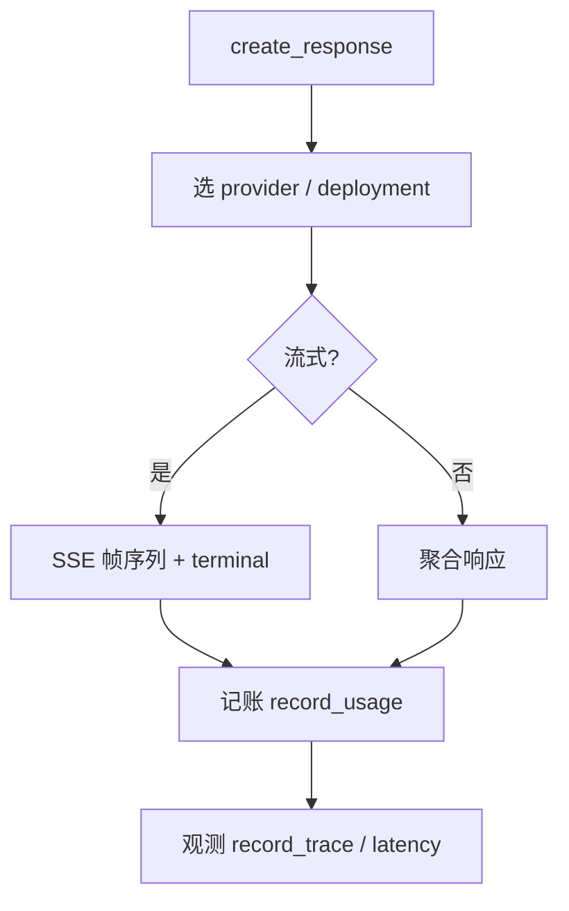

<!-- STD_DOCUMENT_COVER_BEGIN -->
# LLMTier M003 Inference 实现规格设计（ISD）

> STD 使用入口：[项目采用说明与标准导航](../../README.md#std-entry)

| 文档字段 | 值 |
|---|---|
| Document ID | `inference-isd` |
| Document Version | `0.1.0-draft.1` |
| Status | `Draft` |
| Project | `LLMTier` |
| Document Owner | LLMTier |
| Last Modified Date | `2026-09-25` |
| Template ID | `design.implementation` |
| Template Version | `1.2.0` |
<!-- STD_DOCUMENT_COVER_END -->

## 1. 实现目标与输入基线

<a id="isd-scope"></a>

### 1.1 实现对象

- **模块 ID / 名称**：M003 / Inference
- **直属父对象 / 父设计**：LLMTier 软件系统 / `llmtier-system-design`（§3.2 登记）
- **模块设计 Document ID / 版本 / 路径 / 摘要**：`inference` / `0.1.0-draft.1` / `docs/40_module_design/inference-design.md` / §2 F-INF-RESPONSES/EMBED/MODELS/VALIDATE/ROUTE/USAGE、§8 RULE-INF-*
- **需求与 Constraint ID**：`C-INFER-1..5`、`C-TRUST-1`、`C-METER`；机制 `R-INF-03..07`、`R-MET-01`、`R-OBS-03`、`R-TRUST-03`
- **实现范围 / 非目标**：实现推理/向量化编排、准入与路由、Provider 适配、响应归一与用量归一；**非目标**：HTTP（M001）、配置管理（M004）、账本版本语义（M-METER）、跨等级 fallback
- **ISD 默认落位或项目批准路径**：`docs/50_implementation_design/inference.isd.md`

<a id="isd-handoff"></a>

### 1.2.1 `HO-INF-01` · 内部准入

- **上游信息项 / 规则 ID**：`R-INF-03`
- **固定来源 / 版本 / 锚点 / 摘要**：机制 `M-INFER` §14.4 `R-INF-03`
- **ISD 细化内容 / 章节**：许可/队列/等待/429 → §5.1.4
- **唯一权威位置**：行为在 M-INFER §14.4；本层管落实
- **实现自由度**：队列/排序实现
- **原 V/Case 及本地验证位置**：`VRC-INF-004` → §9.1

### 1.2.2 `HO-INF-02` · 同等级候选

- **上游信息项 / 规则 ID**：`R-INF-04`
- **固定来源 / 版本 / 锚点 / 摘要**：机制 `M-INFER` §14.4 `R-INF-04`
- **ISD 细化内容 / 章节**：精确选择、同等级 → §5.1.4/§6.4
- **唯一权威位置**：行为在 M-INFER §14.4；本层管落实
- **实现自由度**：排序实现
- **原 V/Case 及本地验证位置**：`VRC-INF-004` → §9.1

### 1.2.3 `HO-INF-03` · Provider 适配

- **上游信息项 / 规则 ID**：`R-INF-05`
- **固定来源 / 版本 / 锚点 / 摘要**：机制 `M-INFER` §14.4 `R-INF-05`
- **ISD 细化内容 / 章节**：协议映射、usage 归一、typed error → §5.1.5/§5.1.6
- **唯一权威位置**：行为在 M-INFER §14.4；本层管落实
- **实现自由度**：映射实现
- **原 V/Case 及本地验证位置**：`VRC-INF-003` → §9.1

### 1.2.4 `HO-INF-04` · 用量记账承接

- **上游信息项 / 规则 ID**：`R-INF-06`、`R-MET-01`
- **固定来源 / 版本 / 锚点 / 摘要**：机制 `M-INFER`/`M-METER` §14.4
- **ISD 细化内容 / 章节**：义务/绑定/终态 → §5.1.7
- **唯一权威位置**：行为在 M-METER §14.4；本层管调用落点
- **实现自由度**：存储实现
- **原 V/Case 及本地验证位置**：`VRC-INF-003` → §9.1

### 1.2.5 `HO-INF-05` · Registry 只读查询

- **上游信息项 / 规则 ID**：`R-INF-07`
- **固定来源 / 版本 / 锚点 / 摘要**：机制 `M-INFER` §14.4 `R-INF-07`
- **ISD 细化内容 / 章节**：等级/能力只读 → §5.1.2
- **唯一权威位置**：行为在 M-INFER §14.4；本层管调用
- **实现自由度**：查询实现
- **原 V/Case 及本地验证位置**：`VRC-INF-004` → §9.1

### 1.2.6 `HO-INF-06` · 观测集成

- **上游信息项 / 规则 ID**：`R-OBS-03`
- **固定来源 / 版本 / 锚点 / 摘要**：机制 `M-OBS` §14.4 `R-OBS-03`
- **ISD 细化内容 / 章节**：注入/写事件/`source=injected` → §5.1.2/§7.3
- **唯一权威位置**：行为在 M-OBS §14.4；本层管集成
- **实现自由度**：集成实现
- **原 V/Case 及本地验证位置**：`VRC-INF-005` → §9.1

### 1.2.7 `HO-INF-07` · 业务模块不二次校验

- **上游信息项 / 规则 ID**：`R-TRUST-03`
- **固定来源 / 版本 / 锚点 / 摘要**：机制 `M-TRUST` §14.4 `R-TRUST-03`
- **ISD 细化内容 / 章节**：只消费 `principal_id` → §7.3
- **唯一权威位置**：行为在 M-TRUST §14.4；本层管消费
- **实现自由度**：消费实现
- **原 V/Case 及本地验证位置**：`VRC-INF-005` → §9.1

## 2. 既有实现差异（条件章节）

<a id="isd-current-target"></a>

### 2.1 适用性

- **适用性**：`not_applicable`
- **依据**：greenfield/设计先行
- **Tailoring / 范围决定引用**：`std-tailoring`（设计先行）

## 3. 文件、内部组件与调用关系

<a id="isd-structure"></a>

```text
responses.py    ResponsesService.create          # 校验→编排→归一
embeddings.py   EmbeddingsService.create         # 校验→编排→向量校验
models.py       ModelCatalog.list/get            # availability
routing.py      Router.admit/snapshot            # 许可/队列/候选
providers/base.py    ProviderResult/ProviderAdapter（embed → dict）
providers/openai.py  OpenAIProvider.complete/embed/probe/list_models
providers/local.py   LocalProvider（复用 OpenAI 传输）
usage.py        UsageRecorder.authorize_dispatch/bind_backend/finish/page/reset_usage
```

### 3.1 `responses.py` / `embeddings.py` · 编排

- **职责及调用者**：校验、编排、归一；caller=M001
- **类型 / 函数**：`ResponsesService.create`、`EmbeddingsService.create`
- **可见性**：private
- **调用与类型依赖**：依赖 Registry/Router/Usage/Diagnostics/Provider 适配
- **构建目标 / 生成源 / 输出**：随包
- **实现状态**：PLANNED

### 3.2 `models.py` / `routing.py`

- **职责及调用者**：模型目录；准入与候选；caller=编排
- **类型 / 函数**：`ModelCatalog`、`Router.admit/snapshot`
- **可见性**：private
- **调用与类型依赖**：依赖 Registry
- **构建目标 / 生成源 / 输出**：随包
- **实现状态**：PLANNED

### 3.3 `providers/*` / `usage.py`

- **职责及调用者**：上游适配；用量记账；caller=编排
- **类型 / 函数**：`ProviderAdapter`、`OpenAIProvider`/`LocalProvider`、`UsageRecorder`
- **可见性**：private
- **调用与类型依赖**：`urllib`；`Store`（用法）
- **构建目标 / 生成源 / 输出**：随包
- **实现状态**：PLANNED

## 4. 数据结构设计

<a id="isd-data"></a>

> 按 STD `design-data-interface-format` 1.2.0：主章“数据结构设计”，章内按**数据性质**分类（§4.1–§4.8）。仅保留适用类别，不适用类别在章首给出原因与 tailoring 依据；每个结构以真实名称为带编号的粗体标题，先给代码式声明，再逐项写 `Data/Type ID、用途与来源`、逐字段记录（必填·缺省·可空 / 类型·范围·枚举·含义 / 条件有效性）、`跨字段与寿命`、`合法/拒绝实例` 与 `验证`。继承结构只定位原定义与固定机器源，不复制字段。

**类别适用性**：§4.1 公共基础类型与枚举 ✗（`status`/`availability`/`health` 取值继承 OpenAPI 与 Registry，无本层独立枚举）｜§4.2 业务与操作数据结构 ✓｜§4.3 配置与规则数据结构 ✗（超时/队列为固定常量，见 §8.1）｜§4.4 通信报文结构 ✗（无本层拥有的消息结构；SSE 由 M001）｜§4.5 设备与 FPGA 表项结构 ✗（纯软件）｜§4.6 运行状态数据结构 ✗（Router 许可为临时资源，随上下文释放）｜§4.7 数据库表结构 ✗（账本表归 M007）｜§4.8 错误码与错误结构 ✓。

### 4.2 业务与操作数据结构

**4.2.1 `ResponsesRequest`（`responses.py`）**

```text
ResponsesRequest {
  model: str
  input: object | array
  stream: true
  store: false
  tools?: object[]
  max_output_tokens?: int
}
```

- **Data/Type ID、用途与来源**

  `D-RESPONSES-REQUEST`；推理请求。机器权威=`interfaces/openapi/llmtier.openapi.json`，本层只投影，不复制字段全集。

- **`model`**（必填）

  `str`；逻辑等级 ID，必须存在于 Registry，否则 `E-INF-MODEL`。

- **`input`**（必填）

  `object | array`；对话/文本输入，形状由 OpenAPI 定义。

- **`stream`**（必填、固定）

  恒 `true`；`false` 不受支持 → `ERR-REQ-UNSUPPORTED`。

- **`store`**（必填、固定）

  恒 `false`；`true` 不受支持 → `ERR-REQ-UNSUPPORTED`。

- **`tools` / `max_output_tokens`**（可选）

  `object[]?` / `int?`；能力需在等级声明内，否则 `ERR-REQ-UNSUPPORTED`。

- **禁用字段**（条件有效性）

  禁止 `prompt_cache_key`/`prompt_cache_retention`/`previous_response_id`；出现即 `ERR-REQ-FIELD`。

- **跨字段与寿命**

  `additionalProperties:false`；`stream` 恒 true、`store` 恒 false 为跨字段硬约束；请求级所有权，M001 传入只读，本层不修改、不持久。

- **合法/拒绝实例**

  合法 `{model:"Worker", input:"hi", stream:true, store:false}`；拒绝 `store=true` → `ERR-REQ-UNSUPPORTED`。

- **验证**

  `VRC-INF-001`。

**4.2.2 `ResponsesResponse`（`responses.py`）**

```text
ResponsesResponse {
  id: str
  object: str
  created_at: int
  status: "completed" | "incomplete" | "failed"
  model: str
  output: object[]
  usage: UsageView?
  error: object?
  incomplete_details: object?
}
```

- **Data/Type ID、用途与来源**

  `D-RESPONSES-RESPONSE`；推理响应。机器权威=OpenAPI；本层只投影并保证与 terminal 一致。

- **`id` / `object` / `created_at` / `model`**（必填）

  标准响应元数据；`created_at` 为 Unix 秒；`model` 回显请求等级。

- **`status`**（必填、枚举）

  `"completed" | "incomplete" | "failed"`；必须与恰好一个 terminal 事实一致。

- **`output`**（必填、数组）

  `object[]`；按帧序输出，`response.completed` 后不得追加。

- **`usage`**（可空）

  `UsageView?`；缺失时按 `unknown` 处理，不补零。

- **`error` / `incomplete_details`**（条件有效）

  `object?`；`failed` 时 `error` 有效，`incomplete` 时 `incomplete_details` 有效，其余为 `null`。

- **跨字段与寿命**

  `status` 与 terminal 互斥且唯一；`additionalProperties:false`；请求级所有权，由编排构造、随请求释放；不持久化。

- **合法/拒绝实例**

  合法：`status=completed` + `output[]` + `usage`；拒绝：terminal 缺失/多个或 `status` 与 terminal 不一致 → `ERR-PROVIDER-CONTRACT`。

- **验证**

  `VRC-INF-001/003`。

**4.2.3 `ProviderResult`（`providers/base.py`）**

```text
@dataclass(slots=True)
ProviderResult {
  output: list
  usage: dict | None
  provider_request_id: str | None
  status: "completed" | "incomplete" | "failed"
  error: dict | None
  incomplete_details: dict | None
}
```

- **Data/Type ID、用途与来源**

  `D-PROVIDER-RESULT`；Provider 适配归一结果。唯一来源=本 ISD。

- **`output`**（必填）与 **`status`**（必填、枚举）

  `list` / 三值枚举；`status` 必须与上游 terminal 一致。

- **`usage`**（可空）

  `dict | None`；缺失 → `unknown`，不补零。

- **`provider_request_id`**（可空）

  `str | None`；上游请求 ID，用于关联。

- **`error` / `incomplete_details`**（条件有效）

  与 `status` 对应，规则同 `ResponsesResponse`。

- **跨字段与寿命**

  `@dataclass(slots=True)`；请求级所有权，Adapter 构造、编排消费；不可变，随请求释放。

- **合法/拒绝实例**

  合法 `status=completed` 带 usage；边界：terminal 缺失/多个 → `ERR-PROVIDER-CONTRACT`。

- **验证**

  `VRC-INF-003`。

**4.2.4 `Candidate`（`registry.py`）**

```text
@dataclass(frozen=True, slots=True)
Candidate {
  level_id: str
  deployment_id: str
  provider_id: str
  endpoint: str
  backend_model: str
  kind: str
  health: "healthy" | "degraded" | "unhealthy" | "unknown"
  ordinal: int
}
```

- **Data/Type ID、用途与来源**

  `D-CANDIDATE`；Routing 候选；权威 M004 `registry.py`，本层只读。唯一来源=Registry（M004）视图。

- **`level_id` / `deployment_id` / `provider_id` / `endpoint` / `backend_model` / `kind`**（必填）

  标识与目标地址；均来自 Registry 只读快照。

- **`health`**（必填、枚举）

  四值枚举；来自 Registry 事实，`unhealthy` 候选不得被选中。

- **`ordinal`**（必填、范围）

  `int`，同等级内非负序号，决定候选顺序。

- **跨字段与寿命**

  `ordinal` 决定同等级顺序，`health` 决定可用性；查询返回只读快照，请求级所有权，随准入上下文释放。

- **合法/拒绝实例**

  合法 `health=healthy`；边界：全部 `unhealthy` → `ERR-MODEL-UNAVAIL`。

- **验证**

  `VRC-INF-004`。

**4.2.5 `UsageView`（`usage.py`）**

```text
UsageView {
  input_tokens: int
  output_tokens: int
  total_tokens: int
  input_tokens_details: {cached_tokens: int, cache_write_tokens: int}
  output_tokens_details: {reasoning_tokens: int}
  measurement_status: "measured" | "unknown"
}
```

- **Data/Type ID、用途与来源**

  `D-USAGE`；归一后用量。公共字段 authority=机制 `M-METER` §14.4 `R-MET-01`（机器 source=OpenAPI usage schema）。

- **`input_tokens` / `output_tokens` / `total_tokens`**（条件必填，随 `measurement_status`）

  `int`；`measured` 时三者必须皆存在。

- **`input_tokens_details` / `output_tokens_details`**（可选）

  嵌套计数；`cached⊂input`、`reasoning⊂output`。

- **`measurement_status`**（必填、枚举）

  `measured | unknown`；`unknown` 不得补零。

- **跨字段与寿命**

  `measured` 仅当三个总计数皆为 `int`；持久（M-METER 账本），`UsageRecorder` 写、M-METER 读；版本化追加。

- **合法/拒绝实例**

  合法：measured 三值齐备且子项包含正确；边界：上游缺 usage → `unknown` 且所有计数为空，不补零。

- **验证**

  `VRC-INF-003`。

### 4.8 错误码与错误结构

**4.8.1 推理侧 `ApiError`（`errors.py`）**

```text
ApiError {
  status: int
  code: str
  message: str
  param: str | null
  retryable: bool
  headers: dict | null
  extra: dict | null
}
```

- **Data/Type ID、用途与来源**

  编排/适配失败 typed error；公共含义与码由系统设计 §8.8 唯一维护，载荷为 `D-ERROR-ENVELOPE`。

- **`status`**（必填）与 **`code`**（必填）

  `int` / `str`；`code` 与系统 §8.8 一致，本层不新增公共码。

- **`message` / `param` / `retryable` / `headers` / `extra`**（按需）

  与 M001 `ApiError` 同构；不含 Secret/正文。

- **跨字段与寿命**

  请求级所有权，编排/Adapter 抛出、M001 `Handler._run` 映射写出后释放；不得跨请求保留。

- **合法/拒绝实例**

  合法 `ApiError(400,"invalid_request")`；边界：上游 5xx → `ERR-PROVIDER-UNAVAIL`。

- **验证**

  `VRC-INF-001..005`。

**本层公共错误引用**（ID 定义见系统 §8.8）：

| 本层别名 | 条件 | 系统 Error ID | 合法下一步 |
|---|---|---|---|
| `E-INF-VALIDATE` | 字段/形态/能力不满足 | `ERR-REQ-VALIDATION` / `ERR-REQ-UNSUPPORTED` / `ERR-REQ-FIELD` | 修请求 |
| `E-INF-MODEL` | 等级不存在 | `ERR-MODEL-NOTFOUND` | 换模型 |
| `E-INF-ADMIT` | 队列满/超时/全不健康 | `ERR-RATE-LIMIT` / `ERR-MODEL-UNAVAIL` | 按 `Retry-After` |
| `E-INF-CONTRACT` | terminal 缺失/多个/载荷非法 | `ERR-PROVIDER-CONTRACT` | 不重试、上报 |
| `E-INF-UPSTREAM` | 连接/超时/5xx | `ERR-PROVIDER-UNAVAIL` / `ERR-PROVIDER-FAIL` | 标准重试 |
| `E-INF-USAGE` | 账本写失败 | `ERR-STORE` | 稍后重试 / 核对账本 |

## 5. 接口设计

<a id="isd-functions"></a>

> 按 STD `design-data-interface-format` 1.2.0 §3：主章“接口设计”，**按接口用途分类**：向本模块使用方提供可调用能力的函数/端点归 §5.1 API；组件或系统间为协作而交换的命令、状态、事件、流等归 §5.2 消息与数据流（使用 HTTP 时仍按用途判断）。每个接口以真实限定名称为标题，标题下先给完整声明，再按六项固定标签（`Interface/Member ID、用途、提供责任与唯一来源`、`输入与前提`、`成功输出与保证`、`错误与合法下一步`、`交互与生命周期`、`实现与验证`）就地记录。数据结构引用 §4；错误传播落在各接口的 `错误与合法下一步`，公共错误 ID 定义见 `llmtier-system-design` §8.8，本层只产生/映射。

### 5.1 API（适用时）

#### 5.1.1 `create(principal, request_id, body, diagnostics=None, correlation_id=None, out=None) -> dict`

```text
create(principal, request_id, body, diagnostics=None, correlation_id=None, out=None) -> dict
```

- **Interface/Member ID、用途、提供责任与唯一来源**

  - **Interface/Member ID、状态**：`FUNC-INF-RESPONSES` / PLANNED
  - **文件 / symbol / 可见性**：`responses.py` / `ResponsesService.create` / private
  - **原成员 ID 或私有来源**：`F-INF-RESPONSES`、`F-INF-VALIDATE`
  - **完整签名与 caller**：`create(principal, request_id, body, diagnostics=None, correlation_id=None, out=None) -> dict`；caller=M001

- **输入与前提**

  - **输入参数 / 数据结构 authority**：`principal:str`（来自 `Principal`，只读）；`request_id:str`；`body:dict`（`ResponsesRequest` 形状，OpenAPI）
  - **输入约束 / 校验顺序 / 失败映射**：必填 → `stream/store` → 禁字段 → 模型存在 → 能力；失败 → `E-INF-VALIDATE`

- **成功输出与保证**

  - **成功输出 / 数据结构 / 后置条件**：`ResponsesResponse`（`status/output/usage`）

- **错误与合法下一步**

  - **错误输出 / 触发条件 / 优先级**：E-INF-VALIDATE（ERR-REQ-VALIDATION / ERR-REQ-UNSUPPORTED / ERR-REQ-FIELD）：400（`invalid_request`/`unsupported_request`/`unsupported_field`/`unsupported_model`）；E-INF-MODEL（ERR-MODEL-NOTFOUND · model_not_found）：404 `model_not_found`；E-INF-ADMIT（ERR-RATE-LIMIT / ERR-MODEL-UNAVAIL / ERR-MODEL-NOTFOUND）：404/429（+`Retry-After`）/503；E-INF-UPSTREAM（ERR-PROVIDER-UNAVAIL / ERR-PROVIDER-FAIL）：503 `provider_unavailable`/`provider_secret_unavailable`、上游 4xx 原码 `provider_error`
  - **E-INF-VALIDATE（公共 ERR-REQ-VALIDATION / ERR-REQ-UNSUPPORTED / ERR-REQ-FIELD）**
    - **底层异常 / 失败事实**：字段/能力不满足
    - **模块是否处理及处理函数**：reject（`create` 前段）
    - **Typed 异常与原生异常所有权**：编排抛 `ApiError(400)`；M001 映射
    - **宿主 / public payload 或状态码**：400（`invalid_request`/`unsupported_request`/`unsupported_field`/`unsupported_model`）
    - **日志级别 / 脱敏 / 关联字段**：无
    - **是否可重试及前提**：修请求
    - **状态与副作用影响 / 验证项**：无副作用；`VRC-INF-001`
  - **E-INF-MODEL（公共 ERR-MODEL-NOTFOUND · model_not_found）**
    - **底层异常 / 失败事实**：等级不存在
    - **模块是否处理及处理函数**：reject
    - **Typed 异常与原生异常所有权**：`ApiError(404)`
    - **宿主 / public payload 或状态码**：404 `model_not_found`
    - **日志级别 / 脱敏 / 关联字段**：无
    - **是否可重试及前提**：换模型
    - **状态与副作用影响 / 验证项**：`VRC-INF-004`
  - **E-INF-ADMIT（公共 ERR-RATE-LIMIT / ERR-MODEL-UNAVAIL / ERR-MODEL-NOTFOUND）**
    - **底层异常 / 失败事实**：无候选/队列满/等待超时/全不健康
    - **模块是否处理及处理函数**：reject（Router）
    - **Typed 异常与原生异常所有权**：`ApiError(404/429/503)`
    - **宿主 / public payload 或状态码**：404 `model_not_found`/429（+`Retry-After`）/503
    - **日志级别 / 脱敏 / 关联字段**：无
    - **是否可重试及前提**：按 `Retry-After`
    - **状态与副作用影响 / 验证项**：未调用后端；`VRC-INF-004`
  - **E-INF-UPSTREAM（公共 ERR-PROVIDER-UNAVAIL / ERR-PROVIDER-FAIL）**
    - **底层异常 / 失败事实**：连接/首字节/SSE 空闲超时、5xx、Secret 不可解析，或上游 4xx
    - **模块是否处理及处理函数**：propagate（Adapter 映射 typed error）
    - **Typed 异常与原生异常所有权**：`ApiError(503/4xx)`；由 M001 映射
    - **宿主 / public payload 或状态码**：503 `provider_unavailable`/`provider_secret_unavailable`；上游 4xx 原码 `provider_error`
    - **日志级别 / 脱敏 / 关联字段**：warning（脱敏）
    - **是否可重试及前提**：Consumer 按标准 client retry policy；**本系统不重放**
    - **状态与副作用影响 / 验证项**：记 unknown usage；`VRC-INF-003`

- **交互与生命周期**

  - **副作用 / 执行上下文 / 幂等性**：调用后端 + 记账；**非幂等**
  - **输入输出 ownership 与寿命**：请求级；body 只读
  - **Thread-safe / reentrant**：多请求线程；服务实例共享只读
  - **Nested-call policy**：allowed
  - **Transaction participation**：none（编排层；记账在 UsageRecorder）
  - **Blocking / timeout / cancellation**：准入 30 s；上游 30 s/SSE 60 s

- **实现与验证**

  - **不可改变的规则 / Constraint ID**：标准 SSE、终态唯一、未知不补零、不跨等级、fail-open
  - **实现自由度**：编排/归一实现
  - **实现状态 / 验证项**：PLANNED；`VRC-INF-001/003/004`

#### 5.1.2 `create(principal, request_id, body) -> dict`

```text
create(principal, request_id, body) -> dict
```

- **Interface/Member ID、用途、提供责任与唯一来源**

  - **Interface/Member ID、状态**：`FUNC-INF-EMBED` / PLANNED
  - **文件 / symbol / 可见性**：`embeddings.py` / `EmbeddingsService.create` / private
  - **原成员 ID 或私有来源**：`F-INF-EMBED`
  - **完整签名与 caller**：`create(principal, request_id, body) -> dict`；caller=M001

- **输入与前提**

  - **输入参数 / 数据结构 authority**：`{model,input,encoding_format?,dimensions?,user?}`
  - **输入约束 / 校验顺序 / 失败映射**：字段 → 能力 → 维数；失败 → 400

- **成功输出与保证**

  - **成功输出 / 数据结构 / 后置条件**：Embeddings 载荷（`object=list`、`data[]`）

- **错误与合法下一步**

  - **错误输出 / 触发条件 / 优先级**：E-INF-VALIDATE（ERR-REQ-VALIDATION / ERR-REQ-UNSUPPORTED / ERR-REQ-FIELD）：400（`invalid_request`/`unsupported_request`/`unsupported_field`/`unsupported_model`）；E-INF-MODEL（ERR-MODEL-NOTFOUND · model_not_found）：404 `model_not_found`；E-INF-UPSTREAM（ERR-PROVIDER-UNAVAIL / ERR-PROVIDER-FAIL）：503 `provider_unavailable`/`provider_secret_unavailable`、上游 4xx 原码 `provider_error`
  - **E-INF-VALIDATE（公共 ERR-REQ-VALIDATION / ERR-REQ-UNSUPPORTED / ERR-REQ-FIELD）**
    - **底层异常 / 失败事实**：字段/能力不满足
    - **模块是否处理及处理函数**：reject（`create` 前段）
    - **Typed 异常与原生异常所有权**：编排抛 `ApiError(400)`；M001 映射
    - **宿主 / public payload 或状态码**：400（`invalid_request`/`unsupported_request`/`unsupported_field`/`unsupported_model`）
    - **日志级别 / 脱敏 / 关联字段**：无
    - **是否可重试及前提**：修请求
    - **状态与副作用影响 / 验证项**：无副作用；`VRC-INF-001`
  - **E-INF-UPSTREAM（公共 ERR-PROVIDER-UNAVAIL / ERR-PROVIDER-FAIL）**
    - **底层异常 / 失败事实**：连接/首字节/SSE 空闲超时、5xx、Secret 不可解析，或上游 4xx
    - **模块是否处理及处理函数**：propagate（Adapter 映射 typed error）
    - **Typed 异常与原生异常所有权**：`ApiError(503/4xx)`；由 M001 映射
    - **宿主 / public payload 或状态码**：503 `provider_unavailable`/`provider_secret_unavailable`；上游 4xx 原码 `provider_error`
    - **日志级别 / 脱敏 / 关联字段**：warning（脱敏）
    - **是否可重试及前提**：Consumer 按标准 client retry policy；**本系统不重放**
    - **状态与副作用影响 / 验证项**：记 unknown usage；`VRC-INF-003`

- **交互与生命周期**

  - **副作用 / 执行上下文 / 幂等性**：调用后端 + 记账；非幂等
  - **输入输出 ownership 与寿命**：请求级
  - **Thread-safe / reentrant**：多请求线程
  - **Nested-call policy**：allowed
  - **Transaction participation**：none
  - **Blocking / timeout / cancellation**：30 s

- **实现与验证**

  - **不可改变的规则 / Constraint ID**：`Embedding-v1` 冻结 space；向量有限性校验
  - **实现自由度**：解码实现
  - **实现状态 / 验证项**：PLANNED；`VRC-INF-002`

#### 5.1.3 `list() -> dict`

```text
list() -> dict
get(model_id) -> dict
```

- **Interface/Member ID、用途、提供责任与唯一来源**

  - **Interface/Member ID、状态**：`FUNC-INF-MODELS` / PLANNED
  - **文件 / symbol / 可见性**：`models.py` / `ModelCatalog.list/get/_view` / private
  - **原成员 ID 或私有来源**：`F-INF-MODELS`
  - **完整签名与 caller**：`list() -> dict`；`get(model_id) -> dict`；caller=M001

- **输入与前提**

  - **输入参数 / 数据结构 authority**：model_id
  - **输入约束 / 校验顺序 / 失败映射**：404 if unknown

- **成功输出与保证**

  - **成功输出 / 数据结构 / 后置条件**：`list()` → `{object:"list",data:[{id,object,created,owned_by,availability,capabilities}]}`；`get()` → 单个 `ModelView`（含 `created`）

- **错误与合法下一步**

  - **错误输出 / 触发条件 / 优先级**：E-INF-MODEL（ERR-MODEL-NOTFOUND · model_not_found）：404 `model_not_found`
  - **E-INF-MODEL（公共 ERR-MODEL-NOTFOUND · model_not_found）**
    - **底层异常 / 失败事实**：等级不存在
    - **模块是否处理及处理函数**：reject
    - **Typed 异常与原生异常所有权**：`ApiError(404)`
    - **宿主 / public payload 或状态码**：404 `model_not_found`
    - **日志级别 / 脱敏 / 关联字段**：无
    - **是否可重试及前提**：换模型
    - **状态与副作用影响 / 验证项**：`VRC-INF-004`

- **交互与生命周期**

  - **副作用 / 执行上下文 / 幂等性**：只读；幂等
  - **输入输出 ownership 与寿命**：请求级
  - **Thread-safe / reentrant**：yes
  - **Nested-call policy**：allowed
  - **Transaction participation**：none
  - **Blocking / timeout / cancellation**：无

- **实现与验证**

  - **不可改变的规则 / Constraint ID**：availability 规则
  - **实现自由度**：实现
  - **实现状态 / 验证项**：PLANNED；`VRC-INF-004`

#### 5.1.4 `admit(level_id) -> ContextManager[Candidate]`

```text
admit(level_id) -> ContextManager[Candidate]
snapshot() -> dict
```

- **Interface/Member ID、用途、提供责任与唯一来源**

  - **Interface/Member ID、状态**：`FUNC-INF-ADMIT` / PLANNED
  - **文件 / symbol / 可见性**：`routing.py` / `Router.admit/snapshot` / private
  - **原成员 ID 或私有来源**：`F-INF-ROUTE`、`R-INF-03/04`
  - **完整签名与 caller**：`admit(level_id) -> ContextManager[Candidate]`；`snapshot() -> dict`；caller=编排/Observability

- **输入与前提**

  - **输入参数 / 数据结构 authority**：`level_id`
  - **输入约束 / 校验顺序 / 失败映射**：无候选 → 404 `model_not_found`；FIFO 队列 32；等待 30 s；provider 限流；失败 → `E-INF-MODEL`/`E-INF-ADMIT`

- **成功输出与保证**

  - **成功输出 / 数据结构 / 后置条件**：候选（许可持有）

- **错误与合法下一步**

  - **错误输出 / 触发条件 / 优先级**：E-INF-MODEL（ERR-MODEL-NOTFOUND · model_not_found）：404 `model_not_found`；E-INF-ADMIT（ERR-RATE-LIMIT / ERR-MODEL-UNAVAIL）：429（+`Retry-After`）/503
  - **E-INF-ADMIT（公共 ERR-RATE-LIMIT / ERR-MODEL-UNAVAIL / ERR-MODEL-NOTFOUND）**
    - **底层异常 / 失败事实**：无候选/队列满/等待超时/全不健康
    - **模块是否处理及处理函数**：reject（Router）
    - **Typed 异常与原生异常所有权**：`ApiError(404/429/503)`
    - **宿主 / public payload 或状态码**：404 `model_not_found`/429（+`Retry-After`）/503
    - **日志级别 / 脱敏 / 关联字段**：无
    - **是否可重试及前提**：按 `Retry-After`
    - **状态与副作用影响 / 验证项**：未调用后端；`VRC-INF-004`

- **交互与生命周期**

  - **副作用 / 执行上下文 / 幂等性**：增/减 in-flight；退出上下文释放
  - **输入输出 ownership 与寿命**：许可临时资源
  - **Thread-safe / reentrant**：内部锁/条件变量；跨线程安全
  - **Nested-call policy**：forbidden（不可重入同一许可）
  - **Transaction participation**：none
  - **Blocking / timeout / cancellation**：等待 30 s

- **实现与验证**

  - **不可改变的规则 / Constraint ID**：同等级、许可释放、`Retry-After`
  - **实现自由度**：队列/排序实现
  - **实现状态 / 验证项**：PLANNED；`VRC-INF-004`

#### 5.1.5 `complete(model, request) -> ProviderResult`

```text
complete(model, request) -> ProviderResult
```

- **Interface/Member ID、用途、提供责任与唯一来源**

  - **Interface/Member ID、状态**：`FUNC-INF-COMPLETE` / PLANNED
  - **文件 / symbol / 可见性**：`providers/openai.py` / `OpenAIProvider.complete`（`LocalProvider` 复用）/ private
  - **原成员 ID 或私有来源**：`F-INF-ROUTES`→Adapter、`R-INF-05`
  - **完整签名与 caller**：`complete(model, request) -> ProviderResult`；caller=编排

- **输入与前提**

  - **输入参数 / 数据结构 authority**：`backend_model`、上游 body（OpenAI-compatible）
  - **输入约束 / 校验顺序 / 失败映射**：上游 SSE；恰好一个 terminal；格式错误 → `E-INF-CONTRACT`

- **成功输出与保证**

  - **成功输出 / 数据结构 / 后置条件**：`ProviderResult`

- **错误与合法下一步**

  - **错误输出 / 触发条件 / 优先级**：E-INF-CONTRACT（ERR-PROVIDER-CONTRACT · provider_contract_error）：502 `provider_contract_error`；E-INF-UPSTREAM（ERR-PROVIDER-UNAVAIL / ERR-PROVIDER-FAIL）：503 `provider_unavailable`/`provider_secret_unavailable`、上游 4xx 原码 `provider_error`
  - **E-INF-CONTRACT（公共 ERR-PROVIDER-CONTRACT · provider_contract_error）**
    - **底层异常 / 失败事实**：terminal 缺失/多个/不一致；载荷非法
    - **模块是否处理及处理函数**：reject（Adapter）
    - **Typed 异常与原生异常所有权**：`ApiError(502)`
    - **宿主 / public payload 或状态码**：502 `provider_contract_error`
    - **日志级别 / 脱敏 / 关联字段**：warning
    - **是否可重试及前提**：无
    - **状态与副作用影响 / 验证项**：可能已调用后端；`VRC-INF-003`
  - **E-INF-UPSTREAM（公共 ERR-PROVIDER-UNAVAIL / ERR-PROVIDER-FAIL）**
    - **底层异常 / 失败事实**：连接/首字节/SSE 空闲超时、5xx、Secret 不可解析，或上游 4xx
    - **模块是否处理及处理函数**：propagate（Adapter 映射 typed error）
    - **Typed 异常与原生异常所有权**：`ApiError(503/4xx)`；由 M001 映射
    - **宿主 / public payload 或状态码**：503 `provider_unavailable`/`provider_secret_unavailable`；上游 4xx 原码 `provider_error`
    - **日志级别 / 脱敏 / 关联字段**：warning（脱敏）
    - **是否可重试及前提**：Consumer 按标准 client retry policy；**本系统不重放**
    - **状态与副作用影响 / 验证项**：记 unknown usage；`VRC-INF-003`

- **交互与生命周期**

  - **副作用 / 执行上下文 / 幂等性**：外部调用；不幂等
  - **输入输出 ownership 与寿命**：请求级；`Connection: close`
  - **Thread-safe / reentrant**：每实例请求级
  - **Nested-call policy**：allowed
  - **Transaction participation**：none
  - **Blocking / timeout / cancellation**：30 s/60 s

- **实现与验证**

  - **不可改变的规则 / Constraint ID**：terminal 唯一/一致；typed error
  - **实现自由度**：解析实现
  - **实现状态 / 验证项**：PLANNED；`VRC-INF-003`

#### 5.1.6 `embed(model, request) -> dict`

```text
embed(model, request) -> dict
```

- **Interface/Member ID、用途、提供责任与唯一来源**

  - **Interface/Member ID、状态**：`FUNC-INF-EMBED-CALL` / PLANNED
  - **文件 / symbol / 可见性**：`providers/openai.py` / `OpenAIProvider.embed` / private
  - **原成员 ID 或私有来源**：`R-INF-05`
  - **完整签名与 caller**：`embed(model, request) -> dict`；caller=编排

- **输入与前提**

  - **输入参数 / 数据结构 authority**：上游 body
  - **输入约束 / 校验顺序 / 失败映射**：`object=list`、`data[]`；否则 `E-INF-CONTRACT`

- **成功输出与保证**

  - **成功输出 / 数据结构 / 后置条件**：Embeddings 载荷

- **错误与合法下一步**

  - **错误输出 / 触发条件 / 优先级**：E-INF-CONTRACT（ERR-PROVIDER-CONTRACT · provider_contract_error）：502 `provider_contract_error`；E-INF-UPSTREAM（ERR-PROVIDER-UNAVAIL / ERR-PROVIDER-FAIL）：503 `provider_unavailable`/`provider_secret_unavailable`、上游 4xx 原码 `provider_error`
  - **E-INF-CONTRACT（公共 ERR-PROVIDER-CONTRACT · provider_contract_error）**
    - **底层异常 / 失败事实**：terminal 缺失/多个/不一致；载荷非法
    - **模块是否处理及处理函数**：reject（Adapter）
    - **Typed 异常与原生异常所有权**：`ApiError(502)`
    - **宿主 / public payload 或状态码**：502 `provider_contract_error`
    - **日志级别 / 脱敏 / 关联字段**：warning
    - **是否可重试及前提**：无
    - **状态与副作用影响 / 验证项**：可能已调用后端；`VRC-INF-003`
  - **E-INF-UPSTREAM（公共 ERR-PROVIDER-UNAVAIL / ERR-PROVIDER-FAIL）**
    - **底层异常 / 失败事实**：连接/首字节/SSE 空闲超时、5xx、Secret 不可解析，或上游 4xx
    - **模块是否处理及处理函数**：propagate（Adapter 映射 typed error）
    - **Typed 异常与原生异常所有权**：`ApiError(503/4xx)`；由 M001 映射
    - **宿主 / public payload 或状态码**：503 `provider_unavailable`/`provider_secret_unavailable`；上游 4xx 原码 `provider_error`
    - **日志级别 / 脱敏 / 关联字段**：warning（脱敏）
    - **是否可重试及前提**：Consumer 按标准 client retry policy；**本系统不重放**
    - **状态与副作用影响 / 验证项**：记 unknown usage；`VRC-INF-003`

- **交互与生命周期**

  - **副作用 / 执行上下文 / 幂等性**：外部调用
  - **输入输出 ownership 与寿命**：请求级
  - **Thread-safe / reentrant**：请求级
  - **Nested-call policy**：allowed
  - **Transaction participation**：none
  - **Blocking / timeout / cancellation**：30 s

- **实现与验证**

  - **不可改变的规则 / Constraint ID**：载荷校验
  - **实现自由度**：实现
  - **实现状态 / 验证项**：PLANNED；`VRC-INF-002`

#### 5.1.7 `authorize_dispatch(principal, request_id, model, endpoint) -> None`

```text
authorize_dispatch(principal, request_id, model, endpoint) -> None
bind_backend(principal, request_id, provider_id, deployment_id) -> None
finish(principal, request_id, usage, source_override=None) -> None
```

- **Interface/Member ID、用途、提供责任与唯一来源**

  - **Interface/Member ID、状态**：`FUNC-INF-USAGE` / PLANNED
  - **文件 / symbol / 可见性**：`usage.py` / `authorize_dispatch/bind_backend/finish` / private
  - **原成员 ID 或私有来源**：`F-INF-USAGE`、`R-MET-01`
  - **完整签名与 caller**：`authorize_dispatch(principal, request_id, model, endpoint) -> None`；`bind_backend(principal, request_id, provider_id, deployment_id) -> None`；`finish(principal, request_id, usage, source_override=None) -> None`；caller=编排

- **输入与前提**

  - **输入参数 / 数据结构 authority**：`(principal, request_id, …)`
  - **输入约束 / 校验顺序 / 失败映射**：dispatch 前先写义务；失败 → 不 dispatch（`E-INF-USAGE`）

- **成功输出与保证**

  - **成功输出 / 数据结构 / 后置条件**：账本版本

- **错误与合法下一步**

  - **错误输出 / 触发条件 / 优先级**：无公共错误输出

- **交互与生命周期**

  - **副作用 / 执行上下文 / 幂等性**：写账本；`authorize_dispatch` 可重入（`INSERT OR IGNORE`）
  - **输入输出 ownership 与寿命**：持久（M007）
  - **Thread-safe / reentrant**：经事务
  - **Nested-call policy**：allowed
  - **Transaction participation**：creates new
  - **Blocking / timeout / cancellation**：`timeout=10`

- **实现与验证**

  - **不可改变的规则 / Constraint ID**：只追加、head 单调、unknown 不补零
  - **实现自由度**：存储实现
  - **实现状态 / 验证项**：PLANNED；`VRC-INF-003`

#### 5.1.8 `page(principal, cursor, limit, admin, since, until, model, request_id) -> dict` / `reset_usage(model, deployment_id, conn=None) -> dict`

```text
page(principal, cursor, limit=50, admin=False, since=None, until=None, model=None, request_id=None) -> dict
reset_usage(model=None, deployment_id=None, conn=None) -> dict
```

- **Interface/Member ID、用途、提供责任与唯一来源**

  - **Interface/Member ID、状态**：`FUNC-INF-USAGE-PAGE` / PLANNED
  - **文件 / symbol / 可见性**：`usage.py` / `UsageRecorder.page`、`UsageRecorder.reset_usage` / private
  - **原成员 ID 或私有来源**：`F-INF-USAGE`、`R-MET-01`（M004 消费）
  - **完整签名与 caller**：`page(principal, cursor, limit=50, admin=False, since=None, until=None, model=None, request_id=None) -> dict`；`reset_usage(model=None, deployment_id=None, conn=None) -> dict`；caller=M001/M004

- **输入与前提**

  - **输入参数 / 数据结构 authority**：分页/范围参数；`since`/`until` 为 RFC3339
  - **输入约束 / 校验顺序 / 失败映射**：`[since,until)` 必需（缺失/倒置 → 400 `invalid_request`）；cursor 冻结；跨 principal → 403

- **成功输出与保证**

  - **成功输出 / 数据结构 / 后置条件**：`{data,next_cursor,has_more,snapshot_id,snapshot_at}` / `{deleted}`

- **错误与合法下一步**

  - **错误输出 / 触发条件 / 优先级**：400 `invalid_request`/`cursor_expired`；403 `permission_denied`；503 `usage_store_unavailable`

- **交互与生命周期**

  - **副作用 / 执行上下文 / 幂等性**：首屏写 `query_snapshots` + 冻结项；清空删除；非幂等
  - **输入输出 ownership 与寿命**：账本/快照持久
  - **Thread-safe / reentrant**：经事务/快照
  - **Nested-call policy**：allowed
  - **Transaction participation**：creates new
  - **Blocking / timeout / cancellation**：`timeout=10`

- **实现与验证**

  - **不可改变的规则 / Constraint ID**：只追加、head 单调、unknown 不补零、冻结分页
  - **实现自由度**：分页/范围实现
  - **实现状态 / 验证项**：PLANNED；`VRC-INF-003`

### 5.2 消息与数据流接口（适用时）

不适用（本模块不拥有消息/队列/流；与 M001/M007 的交接均为同步函数调用）。

### 5.3 硬件与固件接口（适用时）

不适用（纯软件模块，无连接器/总线/寄存器/FPGA 端口）。

### 5.4 人机与维护接口（适用时）

不适用（无独立 UI/CLI；推理入口为 M001 HTTP 端点，已在 §5.1 记录）。

## 6. 关键流程与算法

<a id="isd-algorithms"></a>



### 6.1 `P-INFER` · 推理编排

- **触发与执行者**：M001 → `ResponsesService.create`；请求线程
- **入口函数及数据**：`create`；body
- **步骤 / 算法 / 复杂度**：校验 → 能力 → 义务 → 准入 → 绑定 → 调用 → 归一 → 终态；O(候选数)
- **判断事实来源**：字段/Registry 能力/Router 许可
- **成功可见点**：`ResponsesResponse`
- **失败、取消与清理**：typed error；异常路径 `finish(None)`；许可释放
- **代表输入与中间值**：`{model:"Worker", input:"hi", stream:true, store:false}` → SSE
- **规则 / 接口 / 验证引用**：`RULE-INF-VALIDATE/ROUTE/TERMINAL`；`VRC-INF-001..004`

### 6.2 `P-EMBED` · 向量化

- **触发与执行者**：M001 → `EmbeddingsService.create`
- **入口函数及数据**：`create`；body
- **步骤 / 算法 / 复杂度**：校验 → 能力 → 义务 → 准入 → `embed` → 向量校验 → usage 归一；O(维度)
- **判断事实来源**：字段/能力/上游载荷
- **成功可见点**：Embeddings 载荷
- **失败、取消与清理**：400/502/503
- **代表输入与中间值**：base64 → `struct.unpack("<f*")`
- **规则 / 接口 / 验证引用**：`RULE-INF-EMBED`；`VRC-INF-002`

### 6.3 `P-MODELS` · 目录查询

- **触发与执行者**：M001 → `ModelCatalog`
- **入口函数及数据**：`list/get`
- **步骤 / 算法 / 复杂度**：按候选健康度求 availability；O(候选数)
- **判断事实来源**：Registry 候选
- **成功可见点**：模型列表/单体
- **失败、取消与清理**：404
- **代表输入与中间值**：混合健康 → degraded
- **规则 / 接口 / 验证引用**：`RULE-INF-MODELS`；`VRC-INF-004`

## 7. 并发、失败、持久化与安全生命周期

<a id="isd-lifecycle"></a>

### 7.1 并发、交错与失败收口

#### 7.1.1 `CF-INF-ADMIT` · 准入排队

- **参与线程 / 回调 / 事务**：多请求线程
- **已产生或可能产生的副作用**：无
- **检测事实 / 期限**：队列/许可（30 s）
- **状态 / 错误 / 结果已知性**：429/503 已知失败
- **保留 / 释放责任**：`admit` 退出释放许可
- **允许的 query / replay / takeover / retry**：按 `Retry-After`
- **验证项**：`VRC-INF-004`

#### 7.1.2 `CF-INF-DISCONNECT` · 断开

- **参与线程 / 回调 / 事务**：请求线程
- **已产生或可能产生的副作用**：可能已调用后端
- **检测事实 / 期限**：M001 写失败
- **状态 / 错误 / 结果已知性**：未知
- **保留 / 释放责任**：许可释放；`finish(None)`
- **允许的 query / replay / takeover / retry**：新请求为新调用
- **验证项**：`VRC-INF-005`

<a id="isd-persistence"></a>

### 7.2 持久化、恢复与 schema 演进

#### 7.2.1.1 `PF-INF-USAGE` · 用量记账事务

- **原规则 / 事务**：`R-MET-01`
- **原子范围 / 事务外副作用**：单事务写版本/head；无事务外副作用
- **开始 / 提交 / 回滚函数**：`UsageRecorder`（经 M007 `transaction`）
- **持久提交点 / 对外响应点**：commit
- **响应丢失后的权威核对**：核对账本 head
- **恢复入口 / 判定记录 / 重复恢复条件**：向 M-METER 承接
- **验证项**：`VRC-INF-003`

#### 7.2.2 Schema 演进策略决定

- **Schema authority / 当前版本事实来源**：无本层 schema；事实来源为 M007 `schema_meta.schema_version`（`util.isd.md` §4.4）
- **允许的升级模式**：随 M007 —— 仅 **schema initialization**（空库建当前结构）
- **明确不接受的迁移模式**：无本层独立迁移；**不接受增量升级 / downgrade / 自动修复**
- **兼容边界**：本层不定义版本；仅在 M007 判定 ready 后服务
- **失败后的系统状态与责任方**：M007 拒绝启动（`not_ready`）；责任方=运维

#### 7.2.2.1 `SR-INFERENCE-DELEGATE` · 拒绝规则

- **原规则**：本模块无自有 schema（随 M007）
- **升级 / 降级策略**：无升级、无降级（M007 仅初始化）
- **接受 / 拒绝条件**：接受=M007 空库初始化成功；拒绝=M007 判定版本不匹配 / 无版本表旧库 / 完整性失败
- **源 / 目标版本与转换函数**：无转换函数；随 M007 `schema_version`
- **拒绝后如何处理**：M007 拒绝启动，本模块不服务（不得静默修复）
- **验证项**：`VRC-INF-003`

#### 7.2.3 库状态分支矩阵

| 库状态 | 判定事实 | 启动结果 | 是否允许重跑及条件 |
|---|---|---|---|
| 空库 | 无 `schema_meta` 且无用户表 | M007 原子初始化 → ready | 是（幂等）|
| 版本匹配 | `schema_version == EXPECTED` | ready | 是 |
| 版本不匹配 | `schema_version != EXPECTED` | M007 拒绝：`schema_version_mismatch` | 否 |
| 无版本表旧库 | 有用户表但无 `schema_meta` | M007 拒绝：`schema_unknown` | 否 |
| 部分初始化 | 初始化事务失败回滚 | 库保持空 | 是 |
| 完整性失败 | `integrity_check != ok` | M007 拒绝：`schema_integrity_failed` | 否 |

<a id="isd-security"></a>

### 7.3 安全、权限与可观测性

#### 7.3.1.1 `SEC-INF-NOAUTH` · 不二次校验

- **原规则**：`R-TRUST-03`（`C-TRUST-1`）
- **可信输入 / 敏感字段 / 检查对象**：`Principal`（入口已判）
- **检查函数 / 时点**：不鉴权；只消费 `principal_id`
- **拒绝 / 宿主交付出口**：无
- **脱敏 / 禁止输出**：provider 凭据只经 `secret_ref` 解析；不落日志
- **日志 / 指标 / trace 口径及触发**：`record_trace`/`capture_snapshot`/`record_latency`；fail-open
- **验证项**：`VRC-INF-005`

#### 7.3.2.1 `LSS-INF-DB` · 存储安全

- **适用对象 / 路径 / Owner**：账本/观测表（经 M007）
- **文件与目录权限 / umask**：由 M007
- **Symlink / hardlink / 路径替换策略**：由 M007
- **备份 / 恢复 / 敏感数据静态保护**：不写 Secret；用量非敏感
- **删除 / 擦除 / 保留期限**：账本由 M004 清空；观测 7 天
- **磁盘耗尽 / 只读文件系统行为**：写失败 → 请求失败/unknown
- **检查时点 / 判定 / 拒绝或降级出口**：随 M007
- **验证项**：`VRC-INF-003`

## 8. 资源、构建与宿主接入

<a id="isd-resources"></a>

### 8.1 配置实现（条件项）

- **适用性 / 固定 authority**：applicable（超时/队列/测试注入）
- **配置 key / 来源 / 优先级**：`LLMTIER_SLOW_ADAPTER_DELAY`（测试用）；队列 32、等待 30 s 为 `routing.py` 固定常量；上游超时读自 `deployment_runtime_profiles.connect_timeout_ms`/`stream_idle_timeout_ms`（缺省 30000/60000）
- **类型 / 单位 / 默认值 / 范围 / 字段约束**：`SLOW_ADAPTER_DELAY` 秒（浮点）；profile 超时为毫秒
- **读取 / 解析 / 校验 symbol**：`ResponsesService._adapter`（测试注入）
- **生效点 / reload / 原子性 / 在途操作**：测试注入进程级；无 reload
- **缺失 / 非法 / 部分更新的错误出口**：非法浮点 → 异常（仅测试）
- **敏感值存储 / 日志脱敏**：无敏感配置
- **验证项**：`VRC-INF-003`

### 8.2.1 `RB-INF-BUILD` · 构建与装配

- **目标文件 / 产物 / 构建目标**：`responses.py`+`embeddings.py`+`models.py`+`routing.py`+`providers/*`+`usage.py`；无独立库
- **工具链 / 语言 / 依赖版本**：Python 3.14；标准库 `urllib`/`json`/`struct`；certifi 可选
- **宿主接入 / 初始化 / 退出次序**：宿主装配构造各 Service；随进程
- **环境 / 数据规模 / 冷热条件**：单进程；上游为外部
- **峰值构成 / 上限 / 共享额度**：每 deployment `max_in_flight=1`（首版）；provider 限流
- **分段预算 / 总期限 / 计时点**：准入 30 s、上游 30 s/60 s、embedding 8192 tok/32 批
- **超限、部分启动与清理出口**：429/503；许可 `finally` 释放
- **构建或运行命令及前置条件**：`PYTHONPATH=src python3 -m pytest tests/ -q`

## 9. 验证规格与实现任务

<a id="isd-verification"></a>

### 9.1.1 `VRC-INF-001` · 推理与校验

- **Rule / 成员**：`FUNC-INF-RESPONSES`、`RULE-INF-VALIDATE`
- **V / Case / Vector**：v1 固定 request；v2 缺字段/`store=true`/禁字段；v3 未知 model
- **输入 / 故障 / 环境**：请求；隔离库
- **独立 Oracle / Expected**：SSE 事件子集 + terminal 唯一；400/404
- **Actual / Evidence**：NOT_RUN
- **Verdict**：NOT_RUN
- **测试入口 / 清理**：`tests/system`（Piko 联调）
- **Run ID / Status**：NOT_RUN

### 9.1.2 `VRC-INF-002` · 向量化

- **Rule / 成员**：`FUNC-INF-EMBED`、`RULE-INF-EMBED`
- **V / Case / Vector**：v1 正常向量；v2 base64；v3 非有限值；v4 非法维数
- **输入 / 故障 / 环境**：请求；`Embedding-v1`
- **独立 Oracle / Expected**：长度/有限性；usage→`prompt_tokens`；400/502
- **Actual / Evidence**：NOT_RUN
- **Verdict**：NOT_RUN
- **测试入口 / 清理**：`tests/system`
- **Run ID / Status**：NOT_RUN

### 9.1.3 `VRC-INF-003` · 失败与用量

- **Rule / 成员**：`FUNC-INF-COMPLETE`、`FUNC-INF-USAGE`、`RULE-INF-TERMINAL`
- **V / Case / Vector**：v1 上游 5xx/超时；v2 两个 terminal；v3 usage 缺失
- **输入 / 故障 / 环境**：`LLMTIER_SLOW_ADAPTER_DELAY`/故障注入；隔离库
- **独立 Oracle / Expected**：unknown 不补零；head 单调；typed error
- **Actual / Evidence**：NOT_RUN
- **Verdict**：NOT_RUN
- **测试入口 / 清理**：`tests/system` + M-METER
- **Run ID / Status**：NOT_RUN

### 9.1.4 `VRC-INF-004` · 准入与目录

- **Rule / 成员**：`FUNC-INF-ADMIT`、`FUNC-INF-MODELS`、`RULE-INF-ROUTE/MODELS`
- **V / Case / Vector**：v1 占满队列 429；v2 全不健康 503；v3 availability 三态
- **输入 / 故障 / 环境**：并发请求；隔离库
- **独立 Oracle / Expected**：429/503；availability
- **Actual / Evidence**：NOT_RUN
- **Verdict**：NOT_RUN
- **测试入口 / 清理**：`tests/unit` + 并发
- **Run ID / Status**：NOT_RUN

### 9.1.5 `VRC-INF-005` · 观测 fail-open / 不二次校验

- **Rule / 成员**：`R-OBS-03`、`R-TRUST-03`
- **V / Case / Vector**：v1 观测库写失败；v2 断开；v3 无二次鉴权
- **输入 / 故障 / 环境**：故障注入
- **独立 Oracle / Expected**：推理结果不变；无鉴权调用点
- **Actual / Evidence**：NOT_RUN
- **Verdict**：NOT_RUN
- **测试入口 / 清理**：`tests/unit`
- **Run ID / Status**：NOT_RUN

**运行命令**：全量 `PYTHONPATH=src python3 -m pytest tests/ tests/system/st_*.py -q`

<a id="isd-tasks"></a>

### 9.2.1 `TASK-INF-ORCH` · 编排与归一

- **顺序 / 前置项**：1 / —
- **文件 / symbol / 构建目标**：`responses.py`、`embeddings.py`、`models.py`
- **不可改变的规则**：校验顺序、SSE/向量校验、未知不补零
- **实施动作**：实现编排与归一
- **完成检查**：`VRC-INF-001/002`
- **实现状态**：PLANNED
- **验证状态 / Run**：NOT_RUN

### 9.2.2 `TASK-INF-ADMIT` · 准入与路由

- **顺序 / 前置项**：2 / —
- **文件 / symbol / 构建目标**：`routing.py`
- **不可改变的规则**：同等级、许可释放、`Retry-After`
- **实施动作**：实现队列/许可/选择
- **完成检查**：`VRC-INF-004`
- **实现状态**：PLANNED
- **验证状态 / Run**：NOT_RUN

### 9.2.3 `TASK-INF-ADAPTER` · Provider 适配与记账

- **顺序 / 前置项**：3 / `TASK-INF-ORCH`
- **文件 / symbol / 构建目标**：`providers/*`、`usage.py`
- **不可改变的规则**：terminal 唯一/一致、不补零
- **实施动作**：实现适配与记账
- **完成检查**：`VRC-INF-003`
- **实现状态**：PLANNED
- **验证状态 / Run**：NOT_RUN

## 10. 映射、复核与未决项

<a id="isd-mapping"></a>

### 10.1.1 `MAP-INF` · 映射

- **模块 / 原成员 ID**：M003 / `F-INF-*`
- **唯一来源 / 版本 / selector / hash**：`inference` / `0.1.0-draft.1`
- **提供或消费 / backend**：提供 / provider
- **实际位置或 Planned 计划位置**：`src/inference/{responses,embeddings,models,routing,usage}.py`、`src/inference/providers/*`
- **验证项**：`VRC-INF-001..005`
- **实现状态**：PLANNED
- **验证状态 / Run**：NOT_RUN

<a id="isd-status"></a>

### 10.2.1 `SC-INF` · 状态一致性复核

- **上游承接状态 / 固定来源**：模块 `inference` §15.ISD 声明 `separate`
- **本层派生状态 / 事实依据**：无实际实现/Run；全部 `PLANNED`/`NOT_RUN`
- **§2 Current / Target**：N/A（greenfield）
- **§3 / §5 文件与函数状态**：PLANNED
- **§9 任务 / Actual / Verdict / Run**：PLANNED / NOT_RUN / NOT_RUN / NOT_RUN
- **§10 汇总状态**：PLANNED
- **差异解释 / Owner / 收敛动作**：none

### 10.3.1 `RISK-INF-1` · 上游长尾延迟

- **既有台账引用 / 具体缺口 / 反例**：`RISK-INF-1`
- **风险等级 / 判定依据**：Medium；上游长尾导致超时/429
- **Owner**：LLMTier
- **最晚关闭阶段 / 截止 Gate**：性能验证阶段
- **阻断范围**：`E-INF-UPSTREAM`
- **分析 / 决策引用**：模块 §15.1
- **所需输入 / 下一步选择判据**：性能数据
- **解决动作 / 完成条件**：超时与 429 约束；实测调参
- **状态**：Open

### 10.4 Metadata 与 coverage 交付检查

metadata 必须包含：`design_object_id=M003`、`implementation_view_of_document_id=inference`、`volume_of_document_id=null`；模块设计 `implementation_specification.mode=separate/document_id=inference-isd`。

`coverage_mapping` 恰好覆盖十项：`scope`(#isd-scope)、`structure`(#isd-structure)、`data`(#isd-data)、`functions`(#isd-functions)、`algorithms`(#isd-algorithms)、`lifecycle`(#isd-lifecycle)、`resources`(#isd-resources)、`security`(#isd-security)、`persistence`(#isd-persistence)、`verification`(#isd-verification)。

交付前运行 `validate-design <完整设计目录> --check-isd-delivery --json`。

<!-- STD_DOCUMENT_CONTROL_BEGIN -->
| 文档字段 | 值 |
|---|---|
| Authority | `LLMTier` |
| Authors | llmtier |
| Created Date | `2026-09-23` |
| Template Conformance | `tailored` |
| Tailoring Reference | `std-tailoring` |
| Migration Map Reference | none |
| Repository | `corezilla/LLMTier` |
| Canonical Path | `docs/50_implementation_design/inference.isd.md` |
| Supersedes | none |
<!-- STD_DOCUMENT_CONTROL_END -->
