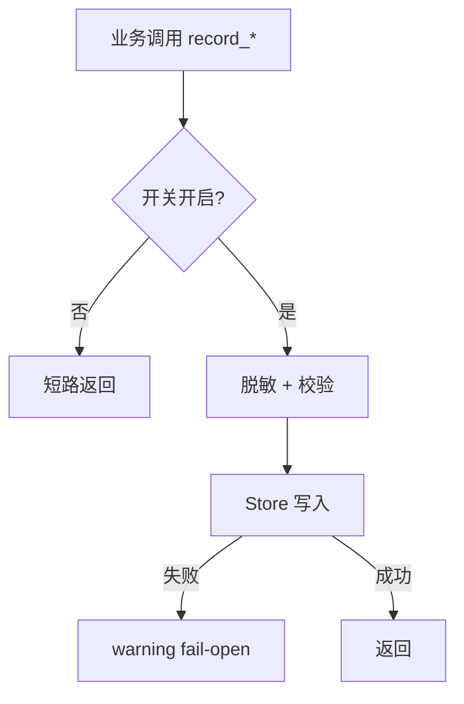

<!-- STD_DOCUMENT_COVER_BEGIN -->
# LLMTier M006 libdiag 实现规格设计（ISD）

> STD 使用入口：[项目采用说明与标准导航](../../README.md#std-entry)

| 文档字段 | 值 |
|---|---|
| Document ID | `libdiag-isd` |
| Document Version | `0.1.0-draft.1` |
| Status | `Draft` |
| Project | `LLMTier` |
| Document Owner | LLMTier |
| Last Modified Date | `2026-09-25` |
| Template ID | `design.implementation` |
| Template Version | `1.0.0` |
<!-- STD_DOCUMENT_COVER_END -->

## 1. 实现目标与输入基线

<a id="isd-scope"></a>

### 1.1 实现对象

- **模块 ID / 名称**：M006 / `libdiag`
- **直属父对象 / 父设计**：LLMTier 软件系统 / `llmtier-system-design`（§3.2 登记）
- **模块设计 Document ID / 版本 / 路径 / 摘要**：`libdiag` / `0.1.0-draft.1` / `docs/40_module_design/libdiag-design.md` / §2 F-DIAG-SWITCH/TRACE/SNAPSHOT/STATS/INJECT/TRACES/STREAM/CLEANUP、§8 RULE-DIAG-SWITCH/TRUNC/PCTL/INJECT
- **需求与 Constraint ID**：`C-OBS-1`（默认关零开销）、`C-OBS-2`（fail-open）、`C-OBS-3`（不记 Secret/正文）、`C-OBS-4`（注入标注）；机制 `R-OBS-01`、`R-OBS-06`
- **实现范围 / 非目标**：实现 `DiagnosticsService`（开关/注入/trace/快照/统计/流包装/清理）与观测表 DDL；**非目标**：查询呈现与路由（M005）、HTTP（M001）、推理决策（M003）
- **ISD 默认落位或项目批准路径**：`docs/50_implementation_design/libdiag.isd.md`

<a id="isd-handoff"></a>

### 1.2.1 `HO-DIAG-01` · 开关

- **上游信息项 / 规则 ID**：`F-DIAG-SWITCH` / `RULE-DIAG-SWITCH`
- **固定来源 / 版本 / 锚点 / 摘要**：`libdiag` / `0.1.0-draft.1` / `#2.1`、`#8.1`
- **ISD 细化内容 / 章节**：开关读写与短路 → §5.1.1
- **唯一权威位置**：行为在模块 §8.1；本层管实现
- **实现自由度**：存储实现
- **原 V/Case 及本地验证位置**：`VRC-DIAG-001` → §9.1

### 1.2.2 `HO-DIAG-02` · 记录（trace/快照/统计）

- **上游信息项 / 规则 ID**：`F-DIAG-TRACE`、`F-DIAG-SNAPSHOT`、`F-DIAG-STATS`
- **固定来源 / 版本 / 锚点 / 摘要**：`libdiag` / `0.1.0-draft.1` / `#2.2`–`#2.4`
- **ISD 细化内容 / 章节**：记录原语、脱敏截断、分桶/百分位 → §5.1.2–5.1.4
- **唯一权威位置**：行为在模块 §2.2–2.4；本层管实现
- **实现自由度**：存储/聚合实现
- **原 V/Case 及本地验证位置**：`VRC-DIAG-002/003` → §9.1

### 1.2.3 `HO-DIAG-03` · trace 时间窗

- **上游信息项 / 规则 ID**：`F-DIAG-TRACES`（review G-1）
- **固定来源 / 版本 / 锚点 / 摘要**：`libdiag` / `0.1.0-draft.1` / `#2.5.1`
- **ISD 细化内容 / 章节**：时间窗聚合 + 分页 → §5.1.5
- **唯一权威位置**：行为在模块 §2.5.1；本层管实现
- **实现自由度**：分页实现
- **原 V/Case 及本地验证位置**：`VRC-DIAG-004` → §9.1

### 1.2.4 `HO-DIAG-04` · 注入与流包装

- **上游信息项 / 规则 ID**：`F-DIAG-INJECT`、`F-DIAG-STREAM` / `RULE-DIAG-INJECT`
- **固定来源 / 版本 / 锚点 / 摘要**：`libdiag` / `0.1.0-draft.1` / `#2.5`、`#2.6`、`#8.4`
- **ISD 细化内容 / 章节**：注入校验/优先级/单条 enabled、流包装 → §5.1.6–5.1.7
- **唯一权威位置**：行为在模块 §8.4；本层管实现
- **实现自由度**：包装实现
- **原 V/Case 及本地验证位置**：`VRC-DIAG-004` → §9.1

### 1.2.5 `HO-DIAG-05` · 观测表 DDL

- **上游信息项 / 规则 ID**：`R-OBS-06`
- **固定来源 / 版本 / 锚点 / 摘要**：机制 `M-OBS` §14.4 `R-OBS-06`；表契约见 M005/M006
- **ISD 细化内容 / 章节**：`002_observability.sql` → §4.4/§7.2
- **唯一权威位置**：表契约在本层；执行由 M007 `migrate`
- **实现自由度**：DDL 组织
- **原 V/Case 及本地验证位置**：`VRC-DIAG-002` → §9.1

## 2. 既有实现差异（条件章节）

<a id="isd-current-target"></a>

### 2.1 适用性

- **适用性**：`not_applicable`
- **依据**：greenfield/设计先行——前瞻设计，不存在需修改的既有实现
- **Tailoring / 范围决定引用**：`std-tailoring`（设计先行）

## 3. 文件、内部组件与调用关系

<a id="isd-structure"></a>

```text
diagnostics.py            # 组合点：门面 DiagnosticsService(store, logs)，保持 ISD 方法面
 ├─ settings.py           # 功能 1：开关          SettingsDiagnostics.switches/set_switches
 ├─ traces.py             # 功能 2：trace         TraceDiagnostics.record_trace/trace/traces
 ├─ snapshots.py          # 功能 3：快照          SnapshotDiagnostics.capture_snapshot/snapshots_page（用 settings）
 ├─ stats.py              # 功能 4：统计          StatsDiagnostics.record_latency/stats（用 settings）
 ├─ injections.py         # 功能 5：注入          InjectionDiagnostics.set_injections/injections/enabled_*
 ├─ stream.py             # 功能 6：流包装        stream_wrapper(injections, did, base_stream)
 ├─ retention.py          # 功能 7：保留期        cleanup(store, warn, days)
 └─ common.py             # 共享 helper          now()/hour_of()/iso()/percentile()
util/migrations/002_observability.sql    # 观测 6 表 DDL（随 M007 migrate 执行）
```

每个功能一个文件；`diagnostics.py` 只保留**组合点**（把各功能组合成一个 `DiagnosticsService` 门面，供 M001/M003 写、M005 查）。

### 3.1 `diagnostics.py` · `DiagnosticsService`（组合点）

- **职责及调用者**：组合各功能模块并保持稳定方法面；caller=M003/M001（写）、M005（查）
- **类型 / 函数**：见上图（门面方法逐一委托到功能模块）
- **可见性**：private
- **调用与类型依赖**：依赖 `store`（M007）、`logs`（可选，warning）与各功能模块；不 import 业务模块
- **构建目标 / 生成源 / 输出**：无独立构建目标；随包
- **实现状态**：PLANNED

### 3.2 `util/migrations/002_observability.sql` · 观测 DDL

- **职责及调用者**：建 6 张观测表；由 M007 `migrate()` 执行（文件随 M007 落位）
- **类型 / 函数**：SQL 脚本
- **可见性**：private（数据文件，随包）
- **调用与类型依赖**：无
- **构建目标 / 生成源 / 输出**：随包
- **实现状态**：PLANNED

### 3.3 功能模块（settings/traces/snapshots/stats/injections/stream/retention/common）

- **职责及调用者**：各承担一个功能，被门面组合；`snapshots`/`stats` 组合开关，`stream` 组合注入，`traces` 的 view 组合 trace+snapshot+usage
- **类型 / 函数**：`SettingsDiagnostics`、`TraceDiagnostics`、`SnapshotDiagnostics`、`StatsDiagnostics`、`InjectionDiagnostics`、`stream_wrapper`、`cleanup`、`common.*`
- **可见性**：private（模块内）
- **调用与类型依赖**：依赖 `store`（M007）、`http_api.errors`（ApiError）；只经门面暴露
- **构建目标 / 生成源 / 输出**：随包
- **实现状态**：PLANNED

## 4. 数据结构设计

<a id="isd-data"></a>

> 按 STD `design-data-interface-format` 1.2.0：主章“数据结构设计”，章内按**数据性质**分类（§4.1–§4.8）。仅保留适用类别，不适用类别在章首给出原因与 tailoring 依据；继承结构只定位原定义，本层拥有的结构逐项记录 ID/唯一来源/字段/约束/状态·所有权·寿命/合法与拒绝实例/验证，语言级表示与代码映射随结构记录。

**类别适用性**：§4.1 公共基础类型与枚举 ✓｜§4.2 业务与操作数据结构 ✓｜§4.3 配置与规则数据结构 ✓｜§4.4 通信报文结构 ✗（进程内库，无 wire）｜§4.5 设备与 FPGA 表项结构 ✗（无设备/RTL）｜§4.6 运行状态数据结构 ✓｜§4.7 数据库表结构 ✓｜§4.8 错误码与错误结构 ✓（引用系统 §8.8）。

### 4.1 公共基础类型与枚举

#### `TraceStageName`（`traces.py`）

- **定义 / Data Type ID / 唯一来源**：trace 阶段名；调用方约定集合，代码不强制校验；唯一来源=`src/libdiag/traces.py`。
- **字段 / 取值**：`str ∈ {received,validated,routed,upstream_started,upstream_ended,completed,aborted}`（每个 ≤64）。
- **约束 / 不变量**：同一 request 的 `stages` 按 `stage_timestamp` 升序；未知字符串可写入，消费方按未知处理。
- **状态 · 所有权 · 寿命**：无状态枚举；随 `trace_events.stage` 持久（7 天）。
- **语言级表示与代码映射**：Python `str`；`TraceDiagnostics.record_trace` 写入，`_trace_view` 读取。
- **合法与拒绝实例**：合法 `completed`；边界：未知字符串可写入（无强制）。
- **验证**：`VRC-DIAG-002`。

#### `InjectionType`（`injections.py`）

- **定义 / Data Type ID / 唯一来源**：6 种注入类型；唯一来源=`src/libdiag/injections.py`（白名单）。
- **字段 / 取值**：`str ∈ {fault_502,fault_503,delay,rate_limit,stream_terminate,malformed_event}`。
- **约束 / 不变量**：白名单；每类型有固定 `config` 字段集（见 §4.3）。
- **状态 · 所有权 · 寿命**：持久于 `diagnostic_injections.injection_type`。
- **语言级表示与代码映射**：Python `str`；`InjectionDiagnostics._validate/set_injections`。
- **合法与拒绝实例**：合法 `delay`；拒绝 `nope` → `ERR-INJECTION`（400）。
- **验证**：`VRC-DIAG-004`。

#### `SnapshotType` / `MalformedEventType`

- **定义 / Data Type ID / 唯一来源**：快照类型 / 畸形事件类型；唯一来源=`snapshots.py`/`injections.py`。
- **字段 / 取值**：`SnapshotType ∈ {upstream,error}`；`MalformedEventType ∈ {invalid_json,unknown_event_type}`；均 `str`。
- **约束 / 不变量**：`SnapshotType` 由 `http_status` 是否存在决定；`MalformedEventType` 白名单。
- **状态 · 所有权 · 寿命**：随 `diagnostic_snapshots.snapshot_type` / 注入配置持久。
- **语言级表示与代码映射**：Python `str`；`SnapshotDiagnostics.capture_snapshot` / `InjectionDiagnostics._validate`。
- **合法与拒绝实例**：`upstream`（有 status）；`invalid_json`。
- **验证**：`VRC-DIAG-002/004`。

### 4.2 业务与操作数据结构

#### `SwitchState`（`settings.py`）

- **定义 / Data Type ID / 唯一来源**：全局诊断开关状态；唯一来源=`settings.py` + `diagnostic_settings` 单行。
- **字段 / 取值**：`{snapshots_enabled: bool（默认 false）, stats_enabled: bool（默认 false）}`。
- **约束 / 不变量**：两字段独立；恒取自 `diagnostic_settings` 单行 `singleton=1`。
- **状态 · 所有权 · 寿命**：持久单行；I1 写、I2–I6 读；随库寿命。
- **语言级表示与代码映射**：Python `dict`；`SettingsDiagnostics.switches/set_switches`。
- **合法与拒绝实例**：合法 `{true,false}`；边界：缺行返回默认 false（迁移保证恒有）。
- **验证**：`VRC-DIAG-001`。

#### `TraceView` / `TraceStage`（`traces.py`）

- **定义 / Data Type ID / 唯一来源**：单请求完整 trace 视图及其阶段；唯一来源=`traces.py`。
- **字段 / 取值**：`TraceView{request_id:str, correlation_id:str?, stages:TraceStage[≥1], snapshot:SnapshotView?, usage:UsageView?}`；`TraceStage{stage:TraceStageName, timestamp:RFC3339ms, detail:object?}`；`UsageView{record_version:int≥1, is_final:bool, model:str, input_tokens:int?, output_tokens:int?, total_tokens:int?, measurement_status:str∈{measured,unknown}, source:str}`。
- **约束 / 不变量**：`stages` 非空且升序；`measured⇒tokens 非空`、`unknown⇒空（不补零）`。
- **状态 · 所有权 · 寿命**：只读视图；组合 `trace_events` + `diagnostic_snapshots` + `usage_record_versions`（M003/M004）；请求级，非持久。
- **语言级表示与代码映射**：Python `dict`；`TraceDiagnostics.trace`/`_trace_view` 组合。
- **合法与拒绝实例**：合法完整 trace；拒绝：无记录 → `trace()` 返回 `ERR-NOTFOUND`（404）。
- **验证**：`VRC-DIAG-002`。

#### `TracePage` / `SnapshotPage`（`traces.py`/`snapshots.py`）

- **定义 / Data Type ID / 唯一来源**：trace / 快照分页；唯一来源=`traces.py`/`snapshots.py`。
- **字段 / 取值**：`{items: T[]（≤limit）, next_cursor: str?, has_more: bool}`。
- **约束 / 不变量**：`has_more=false ⇒ next_cursor=null`；cursor 稳定（trace=`first_ts|request_id`；快照=末条 `id`）。
- **状态 · 所有权 · 寿命**：请求级只读。
- **语言级表示与代码映射**：Python `dict`；`TraceDiagnostics.traces` / `SnapshotDiagnostics.snapshots_page`。
- **合法与拒绝实例**：合法翻页；边界：空匹配 → `items=[]`、`has_more=false`。
- **验证**：`VRC-DIAG-002/004`。
#### `SnapshotView`（`snapshots.py`）

- **定义 / Data Type ID / 唯一来源**：一次上游调用快照；唯一来源=`snapshots.py` + `diagnostic_snapshots`。
- **字段 / 取值**：`id:str, request_id:str, captured_at:RFC3339ms, upstream_url:str（去 query）, backend_model:str?, http_status:int?(100–599), latency_ms:float?(≥0), error_summary:str?(≤256B), model:str?, deployment_id:str?, snapshot_type:SnapshotType`。
- **约束 / 不变量**：`upstream⇒http_status 非空`；`error⇒http_status 空`；URL 去 query；summary ≤256B。
- **状态 · 所有权 · 寿命**：持久 `diagnostic_snapshots`；I3 写、M005 读；只追加；7 天。
- **语言级表示与代码映射**：Python `dict`/`Row`；`SnapshotDiagnostics.capture_snapshot/snapshots_page`。
- **合法与拒绝实例**：合法 `upstream` 快照；拒绝：`snapshots_enabled=false` → 不写（返回 `null`）。
- **验证**：`VRC-DIAG-002`。

#### `StatsView` / `StatsWindow`（`stats.py`）

- **定义 / Data Type ID / 唯一来源**：按小时桶聚合统计；唯一来源=`stats.py` + `data_plane_stats`/`data_plane_latency_samples`。
- **字段 / 取值**：`StatsView{windows:StatsWindow[]}`；`StatsWindow{stat_hour:YYYY-MM-DDTHH, deployment_id:str?, model:str?, status_breakdown:object<str,int>, error_4xx_count:int, error_5xx_count:int, request_count:int, error_count:int, latency_p50/p95/min/max_ms:float?, latency_sum_ms:float}`。
- **约束 / 不变量**：`error_*_count` 由 breakdown 派生；无样本 ⇒ 百分位 `null`、`sum=0`。
- **状态 · 所有权 · 寿命**：请求级只读（组合聚合 + 样本）；非账本、可丢。
- **语言级表示与代码映射**：Python `dict`；`StatsDiagnostics.record_latency/stats`、`common.percentile/hour_of`。
- **合法与拒绝实例**：合法 window；边界：无数据 → `windows=[]`。
- **验证**：`VRC-DIAG-002`。

#### `InjectionView` / `EnabledInjection`（`injections.py`）

- **定义 / Data Type ID / 唯一来源**：注入配置视图 / 命中的启用注入（原始行）；唯一来源=`injections.py`。
- **字段 / 取值**：`InjectionView{id:str, deployment_id:str, type:InjectionType, config:object, enabled:bool, updated_at:RFC3339ms}`；`EnabledInjection`=`diagnostic_injections` 全行（`enabled:int 恒1`）。
- **约束 / 不变量**：`config` 字段集与 `type` 一致；`EnabledInjection` 仅 `enabled=1`。
- **状态 · 所有权 · 寿命**：持久；I5 写、I5/I6 读。
- **语言级表示与代码映射**：Python `dict`/`Row`；`InjectionDiagnostics.set_injections/injections/enabled_injection/enabled_stream_injection`。
- **合法与拒绝实例**：合法 `delay`；拒绝：非法 type/config → `ERR-INJECTION`（400）。
- **验证**：`VRC-DIAG-004`。

### 4.3 配置与规则数据结构

#### `InjectionConfig`（按类型，`injections.py`）

- **定义 / Data Type ID / 唯一来源**：各注入类型的 `config` 字段集与范围；唯一来源=`injections.py` `_validate`。
- **字段 / 取值**：`fault_502`/`fault_503`→`error_body:str`（非空，≤512B）；`delay`→`delay_ms:int`（0–60000）；`rate_limit`→`retry_after_sec:int`（0–300）；`stream_terminate`→`stream_terminate_after_events:int`（1–10000）；`malformed_event`→`malformed_after_events:int`（0–10000）+ `malformed_event_type:MalformedEventType`。
- **约束 / 不变量**：字段必须齐备且落在范围；越界/缺失 → 400 `ERR-INJECTION`。
- **状态 · 所有权 · 寿命**：持久于 `diagnostic_injections` 对应列；部分更新 upsert。
- **语言级表示与代码映射**：Python `dict`；`InjectionDiagnostics._validate/set_injections`。
- **合法与拒绝实例**：合法 `{delay_ms:200}`；拒绝 `{delay_ms:60001}` → `ERR-INJECTION`。
- **验证**：`VRC-DIAG-004`。

### 4.6 运行状态数据结构

#### `DiagnosticsRuntimeState`

- **定义 / Data Type ID / 唯一来源**：诊断开关的运行时事实（读自 `diagnostic_settings`）；唯一来源=`settings.py`。
- **字段 / 取值**：等同 `SwitchState`；另含「最近 `cleanup` 结果」为过程量（不持久）。
- **约束 / 不变量**：唯一写者=`set_switches`；记录前判定（关闭零写入，`C-OBS-1`）。
- **状态 · 所有权 · 寿命**：单行持久 + 请求级过程量。
- **语言级表示与代码映射**：Python `dict`；`SettingsDiagnostics.switches`、`retention.cleanup` 返回。
- **合法与拒绝实例**：关 → 无新行；开 → 正常写入。
- **验证**：`VRC-DIAG-001`。

### 4.7 数据库表结构

Authority=`util/migrations/002_observability.sql`（由 M007 `migrate()` 执行）；列级定义见 `util.isd.md` §4.7。本模块拥有 6 张表：

| 表 | 主键 / 唯一 | 写入者 / 读者 | 寿命 |
|---|---|---|---|
| `diagnostic_settings` | `singleton`(=1) | I1 / I2–I6 | 库寿命 |
| `diagnostic_snapshots` | `id` | I3 / M005 | 7 天（追加）|
| `data_plane_stats` | `(stat_hour,deployment_id,model,status)` | I4 / M005 | 保留期 |
| `data_plane_latency_samples` | 无（追加）| I4 / M005 | 保留期 |
| `diagnostic_injections` | `id` / `UNIQUE(deployment_id,injection_type)` | I5 / I5,I6 | 库寿命 |
| `trace_events` | `id` | I2 / M005 | 7 天（追加）|

- **字段 / 约束 / 不变量**：`diagnostic_snapshots.snapshot_type` 由 `http_status` 判定；`data_plane_stats` 累加 upsert；注入按 `(deployment_id,injection_type)` upsert。
- **状态 · 所有权 · 寿命**：持久；I2–I5 写、M005 读。
- **语言级表示与代码映射**：SQLite DDL + `Store`（M007）；`record_trace/capture_snapshot/record_latency/set_injections/cleanup`。
- **合法与拒绝实例**：合法：空库由 M007 一次性建表；拒绝：非空库 schema 版本不符由 M007 拒绝启动（不属本模块）。
- **验证**：`VRC-DIAG-002`。

### 4.8 错误码与错误结构

本模块**不新增公共错误码**；对外错误引用系统目录（`llmtier-system-design` §8.8）：

| 本层别名 | 条件 | 系统 Error ID | 合法下一步 |
|---|---|---|---|
| `E-DIAG-WRITE` | `record_*` 写失败 | 私有（fail-open，非公共码） | 尽力而为 |
| `E-DIAG-INJECT-INVALID` | 注入类型/字段/范围非法 | `ERR-INJECTION` | 修注入项 |
| `E-DIAG-QUERY` | 存储不可读 | `ERR-STORE` | 稍后重试 |
| `trace()` 无记录 | 未知 request_id | `ERR-NOTFOUND` | 修 id |

- **定义 / 唯一来源**：`errors.py` + 系统 §8.8；`record_*` 失败 **fail-open**（不抛，记 warning），不产生公共错误；`trace`/`injections`/`set_injections` 的拒绝为显式 `ApiError`。
- **字段 / 约束**：同 `ApiError`；`record_*` 无错误返回。
- **合法与拒绝实例**：拒绝：未知 deployment → `ERR-NOTFOUND`；边界：写失败 → warning，无错误返回。
- **验证**：`VRC-DIAG-003`。

## 5. 接口设计

<a id="isd-functions"></a>

> 按 STD `design-data-interface-format` 1.2.0 §3：主章“接口设计”，按接口形态分类逐接口完整记录；标题为真实调用形式，标题下先给完整签名，再就地说明参数/结果字段，最后按 §3.1 六项。数据结构引用 §4；公共错误 ID 定义见 `llmtier-system-design` §8.8，本层只产生/映射。本模块接口全部为软件接口；消息流/硬件/人机见 §5.2–§5.4。

### 5.1 软件接口（适用时）

#### 5.1.1 `switches() -> dict[str,bool]`

```text
switches() -> dict[str,bool]
set_switches(snapshots_enabled: bool|None=None, stats_enabled: bool|None=None) -> dict[str,bool]
```

- **Interface/Member ID、状态**：`FUNC-DIAG-SWITCH` / PLANNED
- **文件 / symbol / 可见性**：`diagnostics.py` / `DiagnosticsService.switches/set_switches` / private
- **原成员 ID 或私有来源**：`F-DIAG-SWITCH`、`RULE-DIAG-SWITCH`
- **完整签名与 caller**：`switches() -> dict[str,bool]`；`set_switches(snapshots_enabled: bool|None=None, stats_enabled: bool|None=None) -> dict[str,bool]`；caller=M005
- **输入**
  - **输入参数 / 数据结构 authority**：可选开关；None=保持
  - **输入约束 / 校验顺序 / 失败映射**：部分更新；DB 错 → `sqlite3.Error`
- **成功输出**
  - **成功输出 / 数据结构 / 后置条件**：`{snapshots_enabled, stats_enabled}`
- **错误与异常**
  - **错误输出 / 触发条件 / 优先级**：无公共错误输出
- **交互与生命周期**
  - **副作用 / 执行上下文 / 幂等性**：写 `diagnostic_settings`；幂等（同值）
  - **输入输出 ownership 与寿命**：状态持久
  - **Thread-safe / reentrant**：经线程内连接
  - **Nested-call policy**：allowed
  - **Transaction participation**：creates new（写）
  - **Blocking / timeout / cancellation**：`timeout=10`
- **不可改变的规则 / Constraint ID**：默认关；关闭零写入
- **实现自由度**：存储实现
- **实例与验证**
  - **实现状态 / 验证项**：PLANNED；`VRC-DIAG-001`

#### 5.1.2 `record_trace(request_id, stage, detail=None, correlation_id=None) -> None`

```text
record_trace(request_id, stage, detail=None, correlation_id=None) -> None
trace(request_id) -> dict
```

- **Interface/Member ID、状态**：`FUNC-DIAG-TRACE` / PLANNED
- **文件 / symbol / 可见性**：`diagnostics.py` / `record_trace`、`trace` / private
- **原成员 ID 或私有来源**：`F-DIAG-TRACE`
- **完整签名与 caller**：`record_trace(request_id, stage, detail=None, correlation_id=None) -> None`；`trace(request_id) -> dict`；caller=M001/M003（写）、M005（查）
- **输入**
  - **输入参数 / 数据结构 authority**：`stage`（标识）；`detail`（JSON）；`correlation_id` 可空
  - **输入约束 / 校验顺序 / 失败映射**：写失败 → 捕获记 warning（fail-open）
- **成功输出**
  - **成功输出 / 数据结构 / 后置条件**：`trace` 返回 `{request_id, correlation_id?, stages[], snapshot?, usage?}`
- **错误与异常**
  - **错误输出 / 触发条件 / 优先级**：E-DIAG-WRITE（私有（fail-open，非公共码））：无
  - **E-DIAG-WRITE（公共 私有（fail-open，非公共码））**
    - **底层异常 / 失败事实**：Store 写失败
    - **模块是否处理及处理函数**：recover（`_warn` 记录后继续）
    - **Typed 异常与原生异常所有权**：内部捕获，不抛到推理路径
    - **宿主 / public payload 或状态码**：无
    - **日志级别 / 脱敏 / 关联字段**：warning（module=diagnostics）
    - **是否可重试及前提**：尽力而为
    - **状态与副作用影响 / 验证项**：不改推理结果（C-OBS-2）；`VRC-DIAG-003`
- **交互与生命周期**
  - **副作用 / 执行上下文 / 幂等性**：追加行；不幂等
  - **输入输出 ownership 与寿命**：持久（7 天）
  - **Thread-safe / reentrant**：经线程内连接
  - **Nested-call policy**：allowed
  - **Transaction participation**：creates new（写）
  - **Blocking / timeout / cancellation**：`timeout=10`
- **不可改变的规则 / Constraint ID**：同 request 有序；fail-open（C-OBS-2）
- **实现自由度**：查询实现
- **实例与验证**
  - **实现状态 / 验证项**：PLANNED；`VRC-DIAG-002/003`

#### 5.1.3 `capture_snapshot(request_id, deployment_id, model, upstream_url, backend_model, http_status, latency_ms, error_summary) -> str|None`

```text
capture_snapshot(request_id, deployment_id, model, upstream_url, backend_model, http_status, latency_ms, error_summary) -> str|None
snapshots_page(since, until, deployment_id, model, limit=50, cursor=None) -> dict
```

- **Interface/Member ID、状态**：`FUNC-DIAG-SNAPSHOT` / PLANNED
- **文件 / symbol / 可见性**：`diagnostics.py` / `capture_snapshot`、`snapshots_page` / private
- **原成员 ID 或私有来源**：`F-DIAG-SNAPSHOT`、`RULE-DIAG-TRUNC`
- **完整签名与 caller**：`capture_snapshot(request_id, deployment_id, model, upstream_url, backend_model, http_status, latency_ms, error_summary) -> str|None`；`snapshots_page(since, until, deployment_id, model, limit=50, cursor=None) -> dict`
- **输入**
  - **输入参数 / 数据结构 authority**：快照字段；`snapshots_page` 过滤条件
  - **输入约束 / 校验顺序 / 失败映射**：开关关闭 → 直接返回 `None`；`upstream_url` 去 query；`error_summary[:256]`；写失败 → warning + `None`
- **成功输出**
  - **成功输出 / 数据结构 / 后置条件**：`snapshot_id`；`{items, next_cursor, has_more}`
- **错误与异常**
  - **错误输出 / 触发条件 / 优先级**：E-DIAG-WRITE（私有（fail-open，非公共码））：无
  - **E-DIAG-WRITE（公共 私有（fail-open，非公共码））**
    - **底层异常 / 失败事实**：Store 写失败
    - **模块是否处理及处理函数**：recover（`_warn` 记录后继续）
    - **Typed 异常与原生异常所有权**：内部捕获，不抛到推理路径
    - **宿主 / public payload 或状态码**：无
    - **日志级别 / 脱敏 / 关联字段**：warning（module=diagnostics）
    - **是否可重试及前提**：尽力而为
    - **状态与副作用影响 / 验证项**：不改推理结果（C-OBS-2）；`VRC-DIAG-003`
- **交互与生命周期**
  - **副作用 / 执行上下文 / 幂等性**：追加；不幂等
  - **输入输出 ownership 与寿命**：持久（7 天）
  - **Thread-safe / reentrant**：经线程内连接
  - **Nested-call policy**：allowed
  - **Transaction participation**：creates new（写）
  - **Blocking / timeout / cancellation**：`timeout=10`
- **不可改变的规则 / Constraint ID**：脱敏去 query、截断 256、关开关零写入
- **实现自由度**：分页实现
- **实例与验证**
  - **实现状态 / 验证项**：PLANNED；`VRC-DIAG-002`

#### 5.1.4 `record_latency(deployment_id, model, status_code, latency_ms) -> None`

```text
record_latency(deployment_id, model, status_code, latency_ms) -> None
stats(since, until, deployment_id=None, model=None) -> dict
```

- **Interface/Member ID、状态**：`FUNC-DIAG-STATS` / PLANNED
- **文件 / symbol / 可见性**：`diagnostics.py` / `record_latency`、`stats`、`_percentile`、`hour_of` / private
- **原成员 ID 或私有来源**：`F-DIAG-STATS`、`RULE-DIAG-PCTL`
- **完整签名与 caller**：`record_latency(deployment_id, model, status_code, latency_ms) -> None`；`stats(since, until, deployment_id=None, model=None) -> dict`；caller=M003（写）、M005（读）
- **输入**
  - **输入参数 / 数据结构 authority**：事实字段；查询条件
  - **输入约束 / 校验顺序 / 失败映射**：开关关闭 → 短路；缓存满 → LRU 淘汰
- **成功输出**
  - **成功输出 / 数据结构 / 后置条件**：`{request_count, error_count, status_breakdown, error_4xx_count, error_5xx_count, p50, p95, min, max, avg}`
- **错误与异常**
  - **错误输出 / 触发条件 / 优先级**：E-DIAG-WRITE（私有（fail-open，非公共码））：无
  - **E-DIAG-WRITE（公共 私有（fail-open，非公共码））**
    - **底层异常 / 失败事实**：Store 写失败
    - **模块是否处理及处理函数**：recover（`_warn` 记录后继续）
    - **Typed 异常与原生异常所有权**：内部捕获，不抛到推理路径
    - **宿主 / public payload 或状态码**：无
    - **日志级别 / 脱敏 / 关联字段**：warning（module=diagnostics）
    - **是否可重试及前提**：尽力而为
    - **状态与副作用影响 / 验证项**：不改推理结果（C-OBS-2）；`VRC-DIAG-003`
- **交互与生命周期**
  - **副作用 / 执行上下文 / 幂等性**：聚合更新；并发累积
  - **输入输出 ownership 与寿命**：内存/持久；非账本
  - **Thread-safe / reentrant**：内部有界缓存；经线程内连接
  - **Nested-call policy**：allowed
  - **Transaction participation**：creates new（持久化）
  - **Blocking / timeout / cancellation**：`timeout=10`
- **不可改变的规则 / Constraint ID**：`status_breakdown` per-status；可丢、非账本
- **实现自由度**：缓存结构
- **实例与验证**
  - **实现状态 / 验证项**：PLANNED；`VRC-DIAG-002`

#### 5.1.5 `traces(since=None, until=None, deployment_id=None, model=None, limit=50, cursor=None) -> dict`

```text
traces(since=None, until=None, deployment_id=None, model=None, limit=50, cursor=None) -> dict
```

- **Interface/Member ID、状态**：`FUNC-DIAG-TRACES` / PLANNED
- **文件 / symbol / 可见性**：`diagnostics.py` / `DiagnosticsService.traces` / private
- **原成员 ID 或私有来源**：`F-DIAG-TRACES`（G-1）
- **完整签名与 caller**：`traces(since=None, until=None, deployment_id=None, model=None, limit=50, cursor=None) -> dict`；caller=M005
- **输入**
  - **输入参数 / 数据结构 authority**：时间窗 + 过滤 + 分页
  - **输入约束 / 校验顺序 / 失败映射**：`limit` 夹到 `[1,500]`；cursor 基于 `(min_ts, request_id)`
- **成功输出**
  - **成功输出 / 数据结构 / 后置条件**：`{items:[TraceView], next_cursor, has_more}`
- **错误与异常**
  - **错误输出 / 触发条件 / 优先级**：E-DIAG-QUERY（ERR-STORE · usage_store_unavailable）：503（不伪装空结果）
  - **E-DIAG-QUERY（公共 ERR-STORE · usage_store_unavailable）**
    - **底层异常 / 失败事实**：存储不可读
    - **模块是否处理及处理函数**：propagate
    - **Typed 异常与原生异常所有权**：原生 `sqlite3.Error`；M005/M001 映射
    - **宿主 / public payload 或状态码**：503（不伪装空结果）
    - **日志级别 / 脱敏 / 关联字段**：warning
    - **是否可重试及前提**：稍后重试
    - **状态与副作用影响 / 验证项**：`VRC-DIAG-002`
- **交互与生命周期**
  - **副作用 / 执行上下文 / 幂等性**：只读
  - **输入输出 ownership 与寿命**：行由调用方持有
  - **Thread-safe / reentrant**：经线程内连接
  - **Nested-call policy**：allowed
  - **Transaction participation**：joins existing
  - **Blocking / timeout / cancellation**：`timeout=10`
- **不可改变的规则 / Constraint ID**：去重 request；稳定分页
- **实现自由度**：查询实现
- **实例与验证**
  - **实现状态 / 验证项**：PLANNED；`VRC-DIAG-004`

#### 5.1.6 `set_injections(deployment_id, items) -> list`

```text
set_injections(deployment_id, items) -> list
injections(did) -> list
enabled_injection(did) -> dict|None
enabled_stream_injection(did) -> dict|None
```

- **Interface/Member ID、状态**：`FUNC-DIAG-INJECT` / PLANNED
- **文件 / symbol / 可见性**：`diagnostics.py` / `set_injections`、`injections`、`enabled_injection`、`enabled_stream_injection`、`_validate` / private
- **原成员 ID 或私有来源**：`F-DIAG-INJECT`、`RULE-DIAG-INJECT`
- **完整签名与 caller**：`set_injections(deployment_id, items) -> list`；`injections(did) -> list`；`enabled_injection(did) -> dict|None`；`enabled_stream_injection(did) -> dict|None`；caller=M005（写）、M003（读）
- **输入**
  - **输入参数 / 数据结构 authority**：注入项列表
  - **输入约束 / 校验顺序 / 失败映射**：白名单/参数范围；非法 → `ApiError(400, "invalid_injection")`；未知 deployment → 404
- **成功输出**
  - **成功输出 / 数据结构 / 后置条件**：注入项列表；**单条** enabled（多启用项优先 `fault_502→fault_503→rate_limit→delay`）
- **错误与异常**
  - **错误输出 / 触发条件 / 优先级**：E-DIAG-INJECT-INVALID（ERR-INJECTION · invalid_injection）：400 `invalid_injection`
  - **E-DIAG-INJECT-INVALID（公共 ERR-INJECTION · invalid_injection）**
    - **底层异常 / 失败事实**：非法类型/参数
    - **模块是否处理及处理函数**：reject（`_validate`）
    - **Typed 异常与原生异常所有权**：`DiagnosticsService` 抛 `ApiError(400)`；M005/M001 映射
    - **宿主 / public payload 或状态码**：400 `invalid_injection`
    - **日志级别 / 脱敏 / 关联字段**：无
    - **是否可重试及前提**：修参数后重试
    - **状态与副作用影响 / 验证项**：不落库；`VRC-DIAG-004`
- **交互与生命周期**
  - **副作用 / 执行上下文 / 幂等性**：部分更新 upsert
  - **输入输出 ownership 与寿命**：持久
  - **Thread-safe / reentrant**：经线程内连接
  - **Nested-call policy**：allowed
  - **Transaction participation**：creates new（写）
  - **Blocking / timeout / cancellation**：`timeout=10`
- **不可改变的规则 / Constraint ID**：白名单；单条 enabled；优先级确定
- **实现自由度**：校验实现
- **实例与验证**
  - **实现状态 / 验证项**：PLANNED；`VRC-DIAG-004`

#### 5.1.7 `stream_wrapper(deployment_id, base_stream) -> Iterable[bytes]`

```text
stream_wrapper(deployment_id, base_stream) -> Iterable[bytes]
```

- **Interface/Member ID、状态**：`FUNC-DIAG-STREAM` / PLANNED
- **文件 / symbol / 可见性**：`diagnostics.py` / `DiagnosticsService.stream_wrapper` / private
- **原成员 ID 或私有来源**：`F-DIAG-STREAM`
- **完整签名与 caller**：`stream_wrapper(deployment_id, base_stream) -> Iterable[bytes]`；caller=M001
- **输入**
  - **输入参数 / 数据结构 authority**：SSE 字节流
  - **输入约束 / 校验顺序 / 失败映射**：无注入 → 透传；命中 `stream_terminate`/`malformed_event` → 截断/畸形
- **成功输出**
  - **成功输出 / 数据结构 / 后置条件**：包装后的字节流
- **错误与异常**
  - **错误输出 / 触发条件 / 优先级**：无公共错误输出
- **交互与生命周期**
  - **副作用 / 执行上下文 / 幂等性**：流式包装；不修改无注入流
  - **输入输出 ownership 与寿命**：请求级流
  - **Thread-safe / reentrant**：yes（无共享）
  - **Nested-call policy**：allowed
  - **Transaction participation**：none
  - **Blocking / timeout / cancellation**：随 base_stream
- **不可改变的规则 / Constraint ID**：命中确定性；无注入透传
- **实现自由度**：包装实现
- **实例与验证**
  - **实现状态 / 验证项**：PLANNED；`VRC-DIAG-004`（`LT-OPEN-05`）

#### 5.1.8 `cleanup(days:int=7) -> int`

```text
cleanup(days:int=7) -> int
```

- **Interface/Member ID、状态**：`FUNC-DIAG-CLEANUP` / PLANNED
- **文件 / symbol / 可见性**：`diagnostics.py` / `DiagnosticsService.cleanup` / private
- **原成员 ID 或私有来源**：`F-DIAG-CLEANUP`
- **完整签名与 caller**：`cleanup(days:int=7) -> int`；caller=启动/M005
- **输入**
  - **输入参数 / 数据结构 authority**：`days`
  - **输入约束 / 校验顺序 / 失败映射**：失败不阻塞启动（调用方 try/except）
- **成功输出**
  - **成功输出 / 数据结构 / 后置条件**：删除 7 天前快照/trace，返回删除数
- **错误与异常**
  - **错误输出 / 触发条件 / 优先级**：E-DIAG-QUERY（ERR-STORE · usage_store_unavailable）：503（不伪装空结果）
  - **E-DIAG-QUERY（公共 ERR-STORE · usage_store_unavailable）**
    - **底层异常 / 失败事实**：存储不可读
    - **模块是否处理及处理函数**：propagate
    - **Typed 异常与原生异常所有权**：原生 `sqlite3.Error`；M005/M001 映射
    - **宿主 / public payload 或状态码**：503（不伪装空结果）
    - **日志级别 / 脱敏 / 关联字段**：warning
    - **是否可重试及前提**：稍后重试
    - **状态与副作用影响 / 验证项**：`VRC-DIAG-002`
- **交互与生命周期**
  - **副作用 / 执行上下文 / 幂等性**：删除过期；幂等
  - **输入输出 ownership 与寿命**：删除持久行
  - **Thread-safe / reentrant**：经线程内连接
  - **Nested-call policy**：allowed
  - **Transaction participation**：creates new（写）
  - **Blocking / timeout / cancellation**：`timeout=10`
- **不可改变的规则 / Constraint ID**：保留 7 天
- **实现自由度**：删除实现
- **实例与验证**
  - **实现状态 / 验证项**：PLANNED；`VRC-DIAG-002`

### 5.2 消息与数据流接口（适用时）

不适用（libdiag 为进程内库，不拥有消息/事件/流；SSE 流由 M001 传输、本模块只提供 `stream_wrapper` 变换，已在 §5.1 记录）。

### 5.3 硬件与固件接口（适用时）

不适用（纯软件模块，无连接器/总线/寄存器/FPGA 端口）。

### 5.4 人机与维护接口（适用时）

不适用（无 UI/CLI；诊断入口归 M005/M001）。

## 6. 关键流程与算法

<a id="isd-algorithms"></a>



### 6.1 `P-DIAG-RECORD` · 记录

- **触发与执行者**：M003/M001；调用线程
- **入口函数及数据**：`record_trace`/`capture_snapshot`/`record_latency`
- **步骤 / 算法 / 复杂度**：开关判定（关→短路）→ 脱敏/截断/分桶 → 写 Store；O(1)/O(len)
- **判断事实来源**：`switches()`；字段
- **成功可见点**：行/聚合更新
- **失败、取消与清理**：`_warn` 后继续
- **代表输入与中间值**：`upstream_url=?token=x` → 去 query
- **规则 / 接口 / 验证引用**：`RULE-DIAG-SWITCH/TRUNC`；`VRC-DIAG-002/003`

### 6.2 `P-DIAG-INJECT` · 注入判定

- **触发与执行者**：M003 请求路径 / M001 流；调用线程
- **入口函数及数据**：`enabled_injection`/`enabled_stream_injection`/`stream_wrapper`
- **步骤 / 算法 / 复杂度**：查 enabled → 按优先级取**单条** → 命中动作（fault/delay/rate_limit/流截断/畸形）；O(items)
- **判断事实来源**：`diagnostic_injections`（enabled）
- **成功可见点**：注入生效
- **失败、取消与清理**：无注入透传
- **代表输入与中间值**：`delay_ms=2000` → sleep 2s
- **规则 / 接口 / 验证引用**：`RULE-DIAG-INJECT`；`VRC-DIAG-004`

### 6.3 `P-DIAG-PCTL` · 百分位

- **触发与执行者**：`stats`；调用线程
- **入口函数及数据**：`record_latency`/`stats`/`_percentile`/`hour_of`
- **步骤 / 算法 / 复杂度**：小时桶聚合 → 排序求 P50/P95；O(n log n)
- **判断事实来源**：样本集合
- **成功可见点**：统计视图
- **失败、取消与清理**：缓存淘汰
- **代表输入与中间值**：样本 → P50/P95
- **规则 / 接口 / 验证引用**：`RULE-DIAG-PCTL`；`VRC-DIAG-002`

## 7. 并发、失败、持久化与安全生命周期

<a id="isd-lifecycle"></a>

### 7.1 并发、交错与失败收口

#### 7.1.1 `CF-DIAG-STATS` · 统计缓存并发

- **参与线程 / 回调 / 事务**：多请求线程
- **已产生或可能产生的副作用**：缓存更新
- **检测事实 / 期限**：缓存上限
- **状态 / 错误 / 结果已知性**：无
- **保留 / 释放责任**：内部 LRU
- **允许的 query / replay / takeover / retry**：无
- **验证项**：`VRC-DIAG-002`

#### 7.1.2 `CF-DIAG-INIT` · 初始化失败

- **参与线程 / 回调 / 事务**：启动
- **已产生或可能产生的副作用**：无
- **检测事实 / 期限**：构造异常
- **状态 / 错误 / 结果已知性**：已知失败
- **保留 / 释放责任**：宿主降级运行
- **允许的 query / replay / takeover / retry**：重启
- **验证项**：`VRC-DIAG-003`

<a id="isd-persistence"></a>

### 7.2 持久化、恢复与 schema 演进

#### 7.2.1.1 `PF-DIAG` · 观测表事务

- **原规则 / 事务**：单条/单批 INSERT/UPDATE
- **原子范围 / 事务外副作用**：单事务内；无事务外副作用
- **开始 / 提交 / 回滚函数**：`Store.transaction`
- **持久提交点 / 对外响应点**：commit
- **响应丢失后的权威核对**：无（观测非权威）
- **恢复入口 / 判定记录 / 重复恢复条件**：无
- **验证项**：`VRC-DIAG-002`

#### 7.2.2 Schema 演进策略决定

- **Schema authority / 当前版本事实来源**：无本层 schema；事实来源为 M007 `schema_meta.schema_version`（`util.isd.md` §4.4）
- **允许的升级模式**：随 M007 —— 仅 **schema initialization**（空库建当前结构）
- **明确不接受的迁移模式**：无本层独立迁移；**不接受增量升级 / downgrade / 自动修复**
- **兼容边界**：本层不定义版本；仅在 M007 判定 ready 后服务
- **失败后的系统状态与责任方**：M007 拒绝启动（`not_ready`）；责任方=运维

#### 7.2.2.1 `SR-LIBDIAG-DELEGATE` · 拒绝规则

- **原规则**：本模块无自有 schema（随 M007）
- **升级 / 降级策略**：无升级、无降级（M007 仅初始化）
- **接受 / 拒绝条件**：接受=M007 空库初始化成功；拒绝=M007 判定版本不匹配 / 无版本表旧库 / 完整性失败
- **源 / 目标版本与转换函数**：无转换函数；随 M007 `schema_version`
- **拒绝后如何处理**：M007 拒绝启动，本模块不服务（不得静默修复）
- **验证项**：`VRC-DIAG-002`

#### 7.2.3 库状态分支矩阵

| 库状态 | 判定事实 | 启动结果 | 是否允许重跑及条件 |
|---|---|---|---|
| 空库 | 无 `schema_meta` 且无用户表 | M007 原子初始化 → ready | 是（幂等）|
| 版本匹配 | `schema_version == EXPECTED` | ready | 是 |
| 版本不匹配 | `schema_version != EXPECTED` | M007 拒绝：`schema_version_mismatch` | 否 |
| 无版本表旧库 | 有用户表但无 `schema_meta` | M007 拒绝：`schema_unknown` | 否 |
| 部分初始化 | 初始化事务失败回滚 | 库保持空 | 是 |
| 完整性失败 | `integrity_check != ok` | M007 拒绝：`schema_integrity_failed` | 否 |

<a id="isd-security"></a>

### 7.3 安全、权限与可观测性

#### 7.3.1.1 `SEC-DIAG-SWITCH` · 默认关 + fail-open

- **原规则**：模块 §1.1.1/§1.1.2（C-OBS-1/2）
- **可信输入 / 敏感字段 / 检查对象**：开关状态
- **检查函数 / 时点**：`switches()` 在每次记录前
- **拒绝 / 宿主交付出口**：关闭 → 短路；失败 → warning
- **脱敏 / 禁止输出**：本层记录只存脱敏字段
- **日志 / 指标 / trace 口径及触发**：本层即观测；warning 走 `logs`
- **验证项**：`VRC-DIAG-001/003`

#### 7.3.2.1 `LSS-DIAG-DB` · 观测表安全

- **适用对象 / 路径 / Owner**：观测 6 表（经 M007）
- **文件与目录权限 / umask**：由 M007
- **Symlink / hardlink / 路径替换策略**：由 M007
- **备份 / 恢复 / 敏感数据静态保护**：**禁记** Secret/凭据/正文；`upstream_url` 去 query、`error_summary` 截断
- **删除 / 擦除 / 保留期限**：7 天清理（`cleanup`）
- **磁盘耗尽 / 只读文件系统行为**：写失败 → warning（fail-open）
- **检查时点 / 判定 / 拒绝或降级出口**：写入前脱敏；失败降级
- **验证项**：`VRC-DIAG-002`

## 8. 资源、构建与宿主接入

<a id="isd-resources"></a>

### 8.1 配置实现（条件项）

- **适用性 / 固定 authority**：applicable（保留期/上限为常量）
- **配置 key / 来源 / 优先级**：`cleanup(days=7)`（调用方传，默认 7）；`limit` 夹值（快照 500、traces 500、stats 无分页）为固定常量
- **类型 / 单位 / 默认值 / 范围 / 字段约束**：`days` 正整数 ≥1
- **读取 / 解析 / 校验 symbol**：`cleanup`
- **生效点 / reload / 原子性 / 在途操作**：启动时清理；无 reload
- **缺失 / 非法 / 部分更新的错误出口**：失败不阻塞启动
- **敏感值存储 / 日志脱敏**：无敏感配置
- **验证项**：`VRC-DIAG-002`

### 8.2.1 `RB-DIAG-BUILD` · 构建与装配

- **目标文件 / 产物 / 构建目标**：`diagnostics.py` + `002_observability.sql`；无独立库
- **工具链 / 语言 / 依赖版本**：Python 3.14；标准库 + `Store`
- **宿主接入 / 初始化 / 退出次序**：宿主装配构造 `DiagnosticsService(store, logs)`；启动调 `cleanup(7)`（fail-open）
- **环境 / 数据规模 / 冷热条件**：单库；保留 7 天
- **峰值构成 / 上限 / 共享额度**：统计内存缓存上限 + LRU；快照/traces 500/页
- **分段预算 / 总期限 / 计时点**：清理为启动期；无总期限
- **超限、部分启动与清理出口**：缓存淘汰；清理失败静默
- **构建或运行命令及前置条件**：`PYTHONPATH=src python3 -m pytest tests/unit/v03 -q`

## 9. 验证规格与实现任务

<a id="isd-verification"></a>

### 9.1.1 `VRC-DIAG-001` · 开关

- **Rule / 成员**：`F-DIAG-SWITCH`、`RULE-DIAG-SWITCH`
- **V / Case / Vector**：v1 默认关；v2 开/关切换；v3 关闭零写入；v4 部分更新
- **输入 / 故障 / 环境**：开关切换；隔离库
- **独立 Oracle / Expected**：默认 `{False,False}`；关闭时无新行
- **Actual / Evidence**：NOT_RUN
- **Verdict**：NOT_RUN
- **测试入口 / 清理**：`tests/unit/v03`；隔离库
- **Run ID / Status**：NOT_RUN

### 9.1.2 `VRC-DIAG-002` · 记录与查询

- **Rule / 成员**：`F-DIAG-TRACE/SNAPSHOT/STATS/CLEANUP`、`RULE-DIAG-TRUNC/PCTL`
- **V / Case / Vector**：v1 trace/快照/统计；v2 URL 去 query；v3 summary 截断；v4 百分位；v5 清理 7 天
- **输入 / 故障 / 环境**：一次调用；隔离库
- **独立 Oracle / Expected**：字段/脱敏/百分位正确；7 天前删除
- **Actual / Evidence**：NOT_RUN
- **Verdict**：NOT_RUN
- **测试入口 / 清理**：`tests/unit/v03`；隔离库
- **Run ID / Status**：NOT_RUN

### 9.1.3 `VRC-DIAG-003` · fail-open

- **Rule / 成员**：`RULE-OBS-FAILOPEN`
- **V / Case / Vector**：v1 写入失败；v2 初始化失败
- **输入 / 故障 / 环境**：库写失败/构造异常
- **独立 Oracle / Expected**：推理结果不变；降级运行
- **Actual / Evidence**：NOT_RUN
- **Verdict**：NOT_RUN
- **测试入口 / 清理**：`tests/unit/v03`
- **Run ID / Status**：NOT_RUN

### 9.1.4 `VRC-DIAG-004` · 注入与 traces

- **Rule / 成员**：`F-DIAG-INJECT/STREAM/TRACES`、`RULE-DIAG-INJECT`
- **V / Case / Vector**：v1 四类注入；v2 流截断/畸形；v3 非法类型；v4 多 enabled 单条优先级；v5 traces 时间窗/分页
- **输入 / 故障 / 环境**：注入配置；隔离库
- **独立 Oracle / Expected**：400；命中确定性；单条优先级；去重 request
- **Actual / Evidence**：NOT_RUN
- **Verdict**：NOT_RUN
- **测试入口 / 清理**：`tests/unit/v03`；隔离库
- **Run ID / Status**：NOT_RUN

**运行命令**：全量 `PYTHONPATH=src python3 -m pytest tests/ tests/system/st_*.py -q`

<a id="isd-tasks"></a>

### 9.2.1 `TASK-DIAG-TABLES` · 观测表与开关

- **顺序 / 前置项**：1 / —
- **文件 / symbol / 构建目标**：`002_observability.sql`、`diagnostics.py` `switches/set_switches`
- **不可改变的规则**：默认关；6 表结构
- **实施动作**：建表 + 开关读写
- **完成检查**：`VRC-DIAG-001/002`
- **实现状态**：PLANNED
- **验证状态 / Run**：NOT_RUN

### 9.2.2 `TASK-DIAG-RECORD` · 记录与查询

- **顺序 / 前置项**：2 / `TASK-DIAG-TABLES`
- **文件 / symbol / 构建目标**：`diagnostics.py` `record_trace/trace/traces/capture_snapshot/snapshots_page/record_latency/stats`
- **不可改变的规则**：脱敏/截断、fail-open
- **实施动作**：实现记录与查询原语
- **完成检查**：`VRC-DIAG-002/003/004`
- **实现状态**：PLANNED
- **验证状态 / Run**：NOT_RUN

### 9.2.3 `TASK-DIAG-INJECT` · 注入与流

- **顺序 / 前置项**：3 / `TASK-DIAG-TABLES`
- **文件 / symbol / 构建目标**：`diagnostics.py` `set_injections/enabled_*/stream_wrapper`
- **不可改变的规则**：白名单、单条 enabled、命中确定性
- **实施动作**：实现注入配置与流包装
- **完成检查**：`VRC-DIAG-004`
- **实现状态**：PLANNED
- **验证状态 / Run**：NOT_RUN

## 10. 映射、复核与未决项

<a id="isd-mapping"></a>

### 10.1.1 `MAP-DIAG` · 映射

- **模块 / 原成员 ID**：M006 / `F-DIAG-SWITCH`、`F-DIAG-TRACE`、`F-DIAG-SNAPSHOT`、`F-DIAG-STATS`、`F-DIAG-INJECT`、`F-DIAG-TRACES`、`F-DIAG-STREAM`、`F-DIAG-CLEANUP`
- **唯一来源 / 版本 / selector / hash**：`libdiag` / `0.1.0-draft.1`
- **提供或消费 / backend**：提供 / SQLite
- **实际位置或 Planned 计划位置**：`src/libdiag/diagnostics.py` `DiagnosticsService`
- **验证项**：`VRC-DIAG-001..004`
- **实现状态**：PLANNED
- **验证状态 / Run**：NOT_RUN

<a id="isd-status"></a>

### 10.2.1 `SC-DIAG` · 状态一致性复核

- **上游承接状态 / 固定来源**：模块 `libdiag` §15.ISD 声明 `separate`
- **本层派生状态 / 事实依据**：无实际实现/Run；全部 `PLANNED`/`NOT_RUN`
- **§2 Current / Target**：N/A（greenfield）
- **§3 / §5 文件与函数状态**：PLANNED
- **§9 任务 / Actual / Verdict / Run**：PLANNED / NOT_RUN / NOT_RUN / NOT_RUN
- **§10 汇总状态**：PLANNED
- **差异解释 / Owner / 收敛动作**：none

### 10.3.1 `RISK-DIAG-1` · 统计可丢

- **既有台账引用 / 具体缺口 / 反例**：`libdiag` §15.1
- **风险等级 / 判定依据**：Low；统计非账本
- **Owner**：LLMTier
- **最晚关闭阶段 / 截止 Gate**：无
- **阻断范围**：`F-DIAG-STATS`
- **分析 / 决策引用**：`libdiag` §15.1
- **所需输入 / 下一步选择判据**：无
- **解决动作 / 完成条件**：明示非账本语义
- **状态**：Open

### 10.3.2 `OPEN-DIAG-1` · 流注入实现门禁

- **既有台账引用 / 具体缺口 / 反例**：`LT-OPEN-05`
- **风险等级 / 判定依据**：Medium；流注入需改造流式输出
- **Owner**：LLMTier
- **最晚关闭阶段 / 截止 Gate**：实现门禁
- **阻断范围**：`F-DIAG-STREAM`
- **分析 / 决策引用**：机制 M-OBS
- **所需输入 / 下一步选择判据**：确认 `stream_wrapper` 集成方案
- **解决动作 / 完成条件**：集成并提供向量
- **状态**：Open

### 10.4 Metadata 与 coverage 交付检查

metadata 必须包含：`design_object_id=M006`、`implementation_view_of_document_id=libdiag`、`volume_of_document_id=null`；模块设计 `implementation_specification.mode=separate/document_id=libdiag-isd`。

`coverage_mapping` 恰好覆盖十项：`scope`(#isd-scope)、`structure`(#isd-structure)、`data`(#isd-data)、`functions`(#isd-functions)、`algorithms`(#isd-algorithms)、`lifecycle`(#isd-lifecycle)、`resources`(#isd-resources)、`security`(#isd-security)、`persistence`(#isd-persistence)、`verification`(#isd-verification)。

交付前运行 `validate-design <完整设计目录> --check-isd-delivery --json`。

<!-- STD_DOCUMENT_CONTROL_BEGIN -->
| 文档字段 | 值 |
|---|---|
| Authority | `LLMTier` |
| Authors | llmtier |
| Created Date | `2026-09-23` |
| Template Conformance | `tailored` |
| Tailoring Reference | `std-tailoring` |
| Migration Map Reference | none |
| Repository | `corezilla/LLMTier` |
| Canonical Path | `docs/50_implementation_design/libdiag.isd.md` |
| Supersedes | none |
<!-- STD_DOCUMENT_CONTROL_END -->
