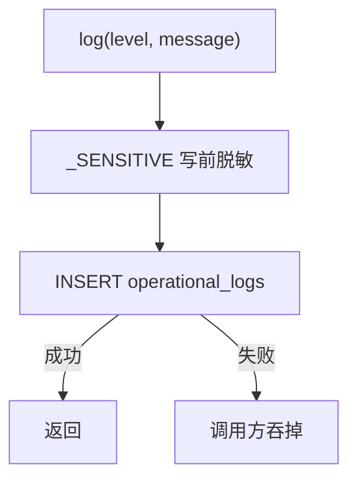

<!-- STD_DOCUMENT_COVER_BEGIN -->
# LLMTier M008 log 实现规格设计（ISD）

> STD 使用入口：[项目采用说明与标准导航](../../README.md#std-entry)

| 文档字段 | 值 |
|---|---|
| Document ID | `log-isd` |
| Document Version | `0.1.0-draft.1` |
| Status | `Draft` |
| Project | `LLMTier` |
| Document Owner | LLMTier |
| Last Modified Date | `2026-09-23` |
| Template ID | `design.implementation` |
| Template Version | `0.5.0` |
<!-- STD_DOCUMENT_COVER_END -->

## 1. 实现目标与输入基线

<a id="isd-scope"></a>

### 1.1 实现对象

- **模块 ID / 名称**：M008 / log
- **直属父对象 / 父设计**：LLMTier 软件系统 / `llmtier-system-design`（§3.2 登记）
- **模块设计 Document ID / 版本 / 路径 / 摘要**：`log` / `0.1.0-draft.1` / `docs/40_module_design/log-design.md` / §2 F-LOG-WRITE/QUERY、§8 RULE-LOG-REDACT/ORDER
- **需求与 Constraint ID**：脱敏约束（模块 §1.1.1）、不阻塞主路径（§1.1.2）；机制 M-OBS（日志查询）
- **实现范围 / 非目标**：实现运行日志的**写入前脱敏**写入与过滤查询 `OperationalLog`；非目标：审计（M004）、观测记录（M006）、日志端点（M001）、保留期策略
- **ISD 默认落位或项目批准路径**：`docs/50_implementation_design/log.isd.md`

<a id="isd-handoff"></a>

### 1.2.1 `HO-LOG-01` · 脱敏写入

- **上游信息项 / 规则 ID**：`F-LOG-WRITE` / `RULE-LOG-REDACT`
- **固定来源 / 版本 / 锚点 / 摘要**：`log` / `0.1.0-draft.1` / `#2.1`、`#8.1`
- **ISD 细化内容 / 章节**：`_SENSITIVE` 正则替换、换行折叠、截断、落库 → §5.1.1
- **唯一权威位置**：行为在模块 §8.1；本层管实现
- **实现自由度**：脱敏实现
- **原 V/Case 及本地验证位置**：`VRC-LOG-001` → §9.1

### 1.2.2 `HO-LOG-02` · 过滤查询

- **上游信息项 / 规则 ID**：`F-LOG-QUERY` / `RULE-LOG-ORDER`
- **固定来源 / 版本 / 锚点 / 摘要**：`log` / `0.1.0-draft.1` / `#2.2`、`#8.2`
- **ISD 细化内容 / 章节**：条件查询、稳定倒序、上限 → §5.1.2
- **唯一权威位置**：行为在模块 §8.2；本层管实现
- **实现自由度**：查询实现
- **原 V/Case 及本地验证位置**：`VRC-LOG-001` → §9.1

## 2. 既有实现差异（条件章节）

<a id="isd-current-target"></a>

### 2.1 适用性

- **适用性**：`not_applicable`
- **依据**：greenfield/设计先行——前瞻设计，不存在需修改的既有实现
- **Tailoring / 范围决定引用**：`std-tailoring`（设计先行）

## 3. 文件、内部组件与调用关系

<a id="isd-structure"></a>

```text
logs.py
 └─ class OperationalLog
      ├─ record(level, module, event, message, request_id?)   # 写前脱敏 + 落库
      └─ page(limit, level?, module?, request_id?, since?, until?) -> {data, page}
```

### 3.1 `logs.py` · `OperationalLog`

- **职责及调用者**：脱敏写入 + 过滤查询；caller=全部业务模块（写）、M004（查）
- **类型 / 函数**：`OperationalLog.record/page`；模块级正则 `_SENSITIVE`
- **可见性**：private
- **调用与类型依赖**：依赖 `Store`（M007）、标准库 `re`/`uuid`/`datetime`
- **构建目标 / 生成源 / 输出**：无独立构建目标；随包
- **实现状态**：PLANNED

## 4. 内部数据与所有权

<a id="isd-data"></a>

纯软件实现：无原生 ABI（Python 文本/JSON）。

### 4.1 `LogEvent`（表 `operational_logs`）

- **类型 / 字段**：`id` TEXT PK；`created_at` TEXT；`level` TEXT；`module` TEXT；`event` TEXT；`message` TEXT CHECK(length≤512)；`request_id` TEXT nullable
- **单位 / 初值 / 范围 / 不变量**：`message` ≤512 且**写前已脱敏**；`level ∈ {info,warning,error,...}`
- **逻辑编码与原生 ABI 适用性**：N/A + 依据（SQLite 文本）
- **创建 / 修改者**：`record`（I1）写
- **Owner / 借用期限 / 释放者**：持久（`operational_logs`）；逐行
- **公共类型 authority**：本 ISD §4.1（表契约，见 M007 §4.4）
- **持久化与敏感性**：persistent；**禁止**存 Secret/凭据/正文（写前脱敏）

### 4.2 `_SENSITIVE`（模块级正则）

- **类型 / 字段**：编译后的 `re.Pattern`
- **单位 / 初值 / 范围 / 不变量**：匹配 `authorization|bearer\s+\S+|secret|api[_-]?key|token\s*[=:]\s*\S+`（IGNORECASE）
- **逻辑编码与原生 ABI 适用性**：N/A
- **创建 / 修改者**：模块导入期创建；只读
- **Owner / 借用期限 / 释放者**：模块级常量
- **公共类型 authority**：private
- **持久化与敏感性**：transient

## 5. 函数与接口实现规格

<a id="isd-functions"></a>

### 5.1.1 `FUNC-LOG-WRITE` · `OperationalLog.record`

- **文件 / symbol / 可见性**：`logs.py` / `OperationalLog.record` / private
- **原成员 ID 或私有来源**：`F-LOG-WRITE`、`RULE-LOG-REDACT`
- **完整签名与 caller**：`record(self, level: str, module: str, event: str, message: str, request_id: str | None=None) -> None`；caller=业务模块
- **输入参数 / 数据结构 authority**：`level/module/event`（短标识）；`message`（任意文本）；`request_id` 可空；ownership=调用方传入
- **输入约束 / 校验顺序 / 失败映射**：`message` 先 `_SENSITIVE.sub("[REDACTED]", …)` → 换行折叠 → `[:512]`；失败 → `E-LOG-WRITE`
- **成功输出 / 数据结构 / 后置条件**：写入一行，`message` 已脱敏且 ≤512
- **错误输出 / 触发条件 / 优先级**：存储错 → 抛 `sqlite3.Error`（由调用方决定是否吞）
- **副作用 / 执行上下文 / 幂等性**：写库；不幂等（每次一行）
- **输入输出 ownership 与寿命**：无返回
- **不可改变的规则 / Constraint ID**：**写前脱敏**、截断 ≤512、不阻塞主路径
- **实现自由度**：正则/截断实现
- **Thread-safe / reentrant**：经线程内连接，跨线程隔离
- **Nested-call policy**：allowed
- **Transaction participation**：none（单条 INSERT，autocommit）
- **Blocking / timeout / cancellation**：连接 `timeout=10`
- **实现状态 / 验证项**：PLANNED；`VRC-LOG-001`

### 5.1.2 `FUNC-LOG-QUERY` · `OperationalLog.page`

- **文件 / symbol / 可见性**：`logs.py` / `OperationalLog.page` / private
- **原成员 ID 或私有来源**：`F-LOG-QUERY`、`RULE-LOG-ORDER`
- **完整签名与 caller**：`page(self, limit:int=50, level=None, module=None, request_id=None, since=None, until=None) -> dict`；caller=M004
- **输入参数 / 数据结构 authority**：过滤条件；`since/until` 时间窗（调用方校验必填）
- **输入约束 / 校验顺序 / 失败映射**：条件相等匹配；`limit` 夹到 `[1,200]`；DB 错 → `sqlite3.Error`
- **成功输出 / 数据结构 / 后置条件**：`{data:[LogEvent], page:{has_more,next_cursor}}`
- **错误输出 / 触发条件 / 优先级**：DB 错 → `sqlite3.Error`
- **副作用 / 执行上下文 / 幂等性**：只读；幂等
- **输入输出 ownership 与寿命**：行由调用方持有
- **不可改变的规则 / Constraint ID**：`ORDER BY created_at DESC, id DESC`；`limit ≤ 200`
- **实现自由度**：查询实现
- **Thread-safe / reentrant**：经线程内连接
- **Nested-call policy**：allowed
- **Transaction participation**：joins existing
- **Blocking / timeout / cancellation**：连接 `timeout=10`
- **实现状态 / 验证项**：PLANNED；`VRC-LOG-001`

### 5.2 错误传播矩阵

#### 5.2.1 `E-LOG-WRITE` · 写入失败

- **底层异常 / 失败事实**：`Store`/SQLite 写失败
- **模块是否处理及处理函数**：propagate（`record` 不捕获）
- **Typed 异常与原生异常所有权**：原生 `sqlite3.Error`；由**调用方**决定吞或上报
- **宿主 / public payload 或状态码**：不影响业务响应（调用方吞）
- **日志级别 / 脱敏 / 关联字段**：无
- **是否可重试及前提**：调用方可选（尽力而为）
- **状态与副作用影响 / 验证项**：丢日志不阻塞；`VRC-LOG-001`

#### 5.2.2 `E-LOG-QUERY` · 查询失败

- **底层异常 / 失败事实**：存储不可读
- **模块是否处理及处理函数**：propagate
- **Typed 异常与原生异常所有权**：原生 `sqlite3.Error`；由 M004/宿主映射
- **宿主 / public payload 或状态码**：503（不伪装空页）
- **日志级别 / 脱敏 / 关联字段**：warning
- **是否可重试及前提**：稍后重试
- **状态与副作用影响 / 验证项**：`VRC-LOG-001`

## 6. 关键流程与算法

<a id="isd-algorithms"></a>



### 6.1 `P-LOG-WRITE` · 脱敏写入

- **触发与执行者**：业务模块 `record`；调用线程
- **入口函数及数据**：`record`；`(level,module,event,message,request_id)`
- **步骤 / 算法 / 复杂度**：正则替换 → 折叠换行 → 截断 512 → INSERT；O(len)
- **判断事实来源**：`_SENSITIVE` 匹配
- **成功可见点**：行写入
- **失败、取消与清理**：异常透传
- **代表输入与中间值**：`"Authorization: Bearer x"` → `"Authorization: [REDACTED]"`
- **规则 / 接口 / 验证引用**：`RULE-LOG-REDACT`；`VRC-LOG-001`

### 6.2 `P-LOG-QUERY` · 过滤查询

- **触发与执行者**：M004 `page`；调用线程
- **入口函数及数据**：`page`；过滤条件
- **步骤 / 算法 / 复杂度**：条件 WHERE → 倒序 LIMIT；O(limit)
- **判断事实来源**：过滤字段
- **成功可见点**：`{data,page}`
- **失败、取消与清理**：异常透传
- **代表输入与中间值**：`limit=1000` → 200
- **规则 / 接口 / 验证引用**：`RULE-LOG-ORDER`；`VRC-LOG-001`

## 7. 并发、失败、持久化与安全生命周期

<a id="isd-lifecycle"></a>

### 7.1 并发、交错与失败收口

#### 7.1.1 `CF-LOG-WRITE` · 写入失败

- **参与线程 / 回调 / 事务**：请求线程
- **已产生或可能产生的副作用**：无（未写入）
- **检测事实 / 期限**：`sqlite3.Error`
- **状态 / 错误 / 结果已知性**：已知失败
- **保留 / 释放责任**：调用方
- **允许的 query / replay / takeover / retry**：调用方可选重试
- **验证项**：`VRC-LOG-001`

<a id="isd-persistence"></a>

### 7.2 持久化、恢复与 schema 演进

#### 7.2.1.1 `PF-LOG` · 单条写入

- **原规则 / 事务**：无显式事务（单条 INSERT）
- **原子范围 / 事务外副作用**：单 INSERT 原子；无事务外副作用
- **开始 / 提交 / 回滚函数**：无（autocommit）
- **持久提交点 / 对外响应点**：INSERT 返回即持久
- **响应丢失后的权威核对**：无（日志非权威）
- **恢复入口 / 判定记录 / 重复恢复条件**：无
- **验证项**：`VRC-LOG-001`

#### 7.2.2 Schema 演进策略决定

- **Schema authority / 当前版本事实来源**：无本层 schema；事实来源为 M007 `schema_meta.schema_version`（`util.isd.md` §4.4）
- **允许的升级模式**：随 M007 —— 仅 **schema initialization**（空库建当前结构）
- **明确不接受的迁移模式**：无本层独立迁移；**不接受增量升级 / downgrade / 自动修复**
- **兼容边界**：本层不定义版本；仅在 M007 判定 ready 后服务
- **失败后的系统状态与责任方**：M007 拒绝启动（`not_ready`）；责任方=运维

#### 7.2.2.1 `SR-LOG-DELEGATE` · 拒绝规则

- **原规则**：本模块无自有 schema（随 M007）
- **升级 / 降级策略**：无升级、无降级（M007 仅初始化）
- **接受 / 拒绝条件**：接受=M007 空库初始化成功；拒绝=M007 判定版本不匹配 / 无版本表旧库 / 完整性失败
- **源 / 目标版本与转换函数**：无转换函数；随 M007 `schema_version`
- **拒绝后如何处理**：M007 拒绝启动，本模块不服务（不得静默修复）
- **验证项**：`VRC-LOG-001`

#### 7.2.3 库状态分支矩阵

| 库状态 | 判定事实 | 启动结果 | 是否允许重跑及条件 |
|---|---|---|---|
| 空库 | 无 `schema_meta` 且无用户表 | M007 原子初始化 → ready | 是（幂等）|
| 版本匹配 | `schema_version == EXPECTED` | ready | 是 |
| 版本不匹配 | `schema_version != EXPECTED` | M007 拒绝：`schema_version_mismatch` | 否 |
| 无版本表旧库 | 有用户表但无 `schema_meta` | M007 拒绝：`schema_unknown` | 否 |
| 部分初始化 | 初始化事务失败回滚 | 库保持空 | 是 |
| 完整性失败 | `integrity_check != ok` | M007 拒绝：`schema_integrity_failed` | 否 |

<a id="isd-security"></a>

### 7.3 安全、权限与可观测性

#### 7.3.1.1 `SEC-LOG-REDACT` · 写前脱敏

- **原规则**：模块 §1.1.1（禁 Secret/凭据/正文）
- **可信输入 / 敏感字段 / 检查对象**：`message` 中的 Authorization/Bearer/secret/api_key/token
- **检查函数 / 时点**：`_SENSITIVE.sub` 在**写入前**
- **拒绝 / 宿主交付出口**：不拒绝，替换为 `[REDACTED]`
- **脱敏 / 禁止输出**：禁止 Prompt/输出/reasoning/vector/Authorization/Secret/完整请求头
- **日志 / 指标 / trace 口径及触发**：本模块即日志；不写指标/trace
- **验证项**：`VRC-LOG-001`

#### 7.3.2.1 `LSS-LOG-DB` · 存储安全

- **适用对象 / 路径 / Owner**：`operational_logs` 表（经 M007 存储）
- **文件与目录权限 / umask**：由 M007 检查（见 `util.isd.md` §7.3.2.1）
- **Symlink / hardlink / 路径替换策略**：由 M007
- **备份 / 恢复 / 敏感数据静态保护**：库不含 Secret（写前脱敏）；备份由运维
- **删除 / 擦除 / 保留期限**：保留期由运维（本模块不管理）
- **磁盘耗尽 / 只读文件系统行为**：写失败 → 调用方吞；查询失败 → 503
- **检查时点 / 判定 / 拒绝或降级出口**：随 M007
- **验证项**：`VRC-LOG-001`

## 8. 资源、构建与宿主接入

<a id="isd-resources"></a>

### 8.1 配置实现（条件项）

- **适用性 / 固定 authority**：N/A + 依据（无本模块配置；`limit` 上限 200 为固定常量）
- **配置 key / 来源 / 优先级**：无
- **类型 / 单位 / 默认值 / 范围 / 字段约束**：无
- **读取 / 解析 / 校验 symbol**：无
- **生效点 / reload / 原子性 / 在途操作**：无
- **缺失 / 非法 / 部分更新的错误出口**：无
- **敏感值存储 / 日志脱敏**：无
- **验证项**：无

### 8.2.1 `RB-LOG-BUILD` · 构建与装配

- **目标文件 / 产物 / 构建目标**：`logs.py`；无独立库
- **工具链 / 语言 / 依赖版本**：Python 3.14；标准库 + `Store`
- **宿主接入 / 初始化 / 退出次序**：宿主装配构造 `OperationalLog(store)`；随进程生命周期
- **环境 / 数据规模 / 冷热条件**：单库；无冷热差异
- **峰值构成 / 上限 / 共享额度**：单条 ≤512 字符；`limit ≤ 200`
- **分段预算 / 总期限 / 计时点**：无
- **超限、部分启动与清理出口**：截断（写）/ 上限（查）
- **构建或运行命令及前置条件**：`PYTHONPATH=src python3 -m pytest tests/unit/v03 -q`

## 9. 验证规格与实现任务

<a id="isd-verification"></a>

### 9.1.1 `VRC-LOG-001` · 脱敏与查询

- **Rule / 成员**：`F-LOG-WRITE`、`F-LOG-QUERY`、`RULE-LOG-REDACT`、`RULE-LOG-ORDER`
- **V / Case / Vector**：v1 含 `Authorization: Bearer …`；v2 含 `api_key: x`/`token=…`；v3 超长 message；v4 过滤查询；v5 `limit=1000`
- **输入 / 故障 / 环境**：见上；隔离库
- **独立 Oracle / Expected**：落库文本含 `[REDACTED]`；长度 ≤512；顺序倒序；`limit` 夹到 200
- **Actual / Evidence**：NOT_RUN
- **Verdict**：NOT_RUN
- **测试入口 / 清理**：`tests/unit/v03`；隔离库
- **Run ID / Status**：NOT_RUN

**运行命令**：全量 `PYTHONPATH=src python3 -m pytest tests/ tests/system/st_*.py -q`

<a id="isd-tasks"></a>

### 9.2.1 `TASK-LOG-WRITE` · 脱敏写入

- **顺序 / 前置项**：1 / —
- **文件 / symbol / 构建目标**：`logs.py` `record`、`_SENSITIVE`
- **不可改变的规则**：写前脱敏、截断 ≤512
- **实施动作**：实现正则脱敏 + 截断 + INSERT
- **完成检查**：`VRC-LOG-001`
- **实现状态**：PLANNED
- **验证状态 / Run**：NOT_RUN

### 9.2.2 `TASK-LOG-QUERY` · 过滤查询

- **顺序 / 前置项**：2 / `TASK-LOG-WRITE`
- **文件 / symbol / 构建目标**：`logs.py` `page`
- **不可改变的规则**：倒序、`limit ≤ 200`
- **实施动作**：实现条件查询
- **完成检查**：`VRC-LOG-001`
- **实现状态**：PLANNED
- **验证状态 / Run**：NOT_RUN

## 10. 映射、复核与未决项

<a id="isd-mapping"></a>

### 10.1.1 `MAP-LOG` · 映射

- **模块 / 原成员 ID**：M008 / `F-LOG-WRITE`、`F-LOG-QUERY`
- **唯一来源 / 版本 / selector / hash**：`log` / `0.1.0-draft.1` / `#2.1`、`#2.2`
- **提供或消费 / backend**：提供（写+查）/ SQLite
- **实际位置或 Planned 计划位置**：`src/log/logs.py` `OperationalLog.record/page`
- **验证项**：`VRC-LOG-001`
- **实现状态**：PLANNED
- **验证状态 / Run**：NOT_RUN

<a id="isd-status"></a>

### 10.2.1 `SC-LOG` · 状态一致性复核

- **上游承接状态 / 固定来源**：模块 `log` §15.ISD 声明 `separate`
- **本层派生状态 / 事实依据**：无实际实现/Run；全部 `PLANNED`/`NOT_RUN`
- **§2 Current / Target**：N/A（greenfield）
- **§3 / §5 文件与函数状态**：PLANNED
- **§9 任务 / Actual / Verdict / Run**：PLANNED / NOT_RUN / NOT_RUN / NOT_RUN
- **§10 汇总状态**：PLANNED
- **差异解释 / Owner / 收敛动作**：none

### 10.3.1 `RISK-LOG-1` · 脱敏正则漏网

- **既有台账引用 / 具体缺口 / 反例**：`log` §15.1
- **风险等级 / 判定依据**：Medium；出现未覆盖凭据形态则潜在泄漏
- **Owner**：LLMTier
- **最晚关闭阶段 / 截止 Gate**：安全评审
- **阻断范围**：`SEC-LOG-REDACT`
- **分析 / 决策引用**：`log` §15.1
- **所需输入 / 下一步选择判据**：脱敏用例集
- **解决动作 / 完成条件**：补正则；禁记正文作兜底
- **状态**：Open

### 10.4 Metadata 与 coverage 交付检查

metadata 必须包含：`design_object_id=M008`、`implementation_view_of_document_id=log`、`volume_of_document_id=null`；模块设计 `implementation_specification.mode=separate/document_id=log-isd`。

`coverage_mapping` 恰好覆盖十项（各指向本 ISD 锚点）：`scope`(#isd-scope)、`structure`(#isd-structure)、`data`(#isd-data)、`functions`(#isd-functions)、`algorithms`(#isd-algorithms)、`lifecycle`(#isd-lifecycle)、`resources`(#isd-resources)、`security`(#isd-security)、`persistence`(#isd-persistence)、`verification`(#isd-verification)。

交付前运行 `validate-design <完整设计目录> --check-isd-delivery --json`。

<!-- STD_DOCUMENT_CONTROL_BEGIN -->
| 文档字段 | 值 |
|---|---|
| Authority | `LLMTier` |
| Authors | llmtier |
| Created Date | `2026-09-23` |
| Template Conformance | `tailored` |
| Tailoring Reference | `std-tailoring` |
| Migration Map Reference | none |
| Repository | `corezilla/LLMTier` |
| Canonical Path | `docs/50_implementation_design/log.isd.md` |
| Supersedes | none |
<!-- STD_DOCUMENT_CONTROL_END -->
