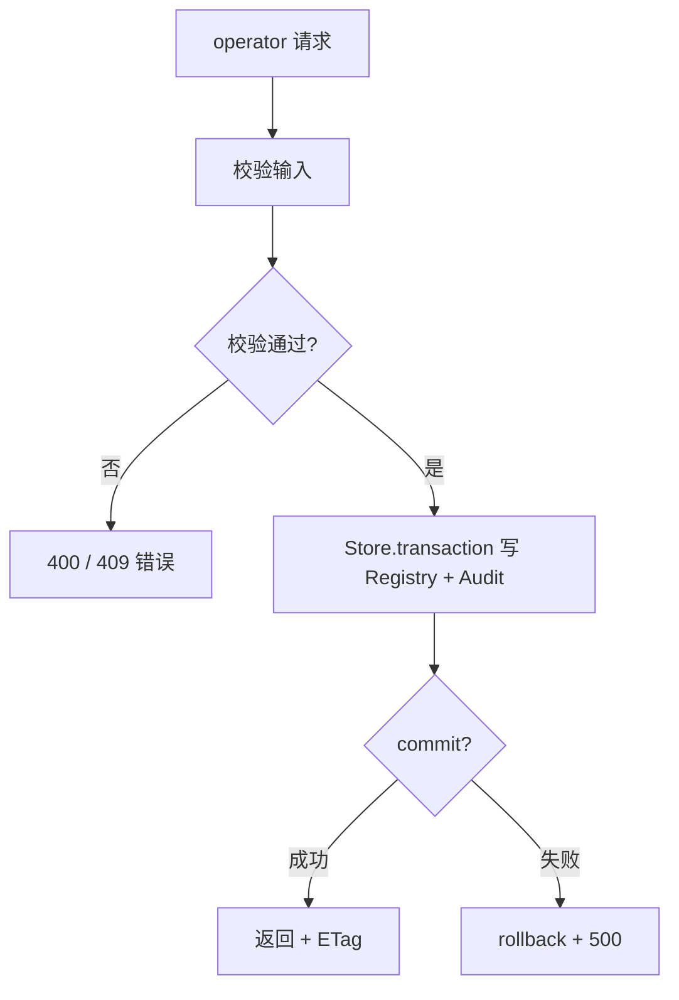

<!-- STD_DOCUMENT_COVER_BEGIN -->
# LLMTier M004 Management 实现规格设计（ISD）

> STD 使用入口：[项目采用说明与标准导航](../../README.md#std-entry)

| 文档字段 | 值 |
|---|---|
| Document ID | `management-isd` |
| Document Version | `0.1.0-draft.1` |
| Status | `Draft` |
| Project | `LLMTier` |
| Document Owner | LLMTier |
| Last Modified Date | `2026-09-23` |
| Template ID | `design.implementation` |
| Template Version | `0.5.0` |
<!-- STD_DOCUMENT_COVER_END -->

## 1. 实现目标与输入基线

<a id="isd-scope"></a>

### 1.1 实现对象

- **模块 ID / 名称**：M004 / Management
- **直属父对象 / 父设计**：LLMTier 软件系统 / `llmtier-system-design`（§3.2 登记）
- **模块设计 Document ID / 版本 / 路径 / 摘要**：`management` / `0.1.0-draft.1` / `docs/40_module_design/management-design.md` / §2 F-MGMT-*、§8 RULE-MGMT-*
- **需求与 Constraint ID**：`C-CFG-1..5`、`C-METER-4`；机制 `R-CFG-01/02/03`、`R-MET-02/03`
- **实现范围 / 非目标**：配置权威与 CRUD、探测、用量查询/清空/统计、审计与日志查询、账号用量；**非目标**：推理（M003）、观测记录（M006）、日志脱敏写入（M008）
- **ISD 默认落位或项目批准路径**：`docs/50_implementation_design/management.isd.md`

<a id="isd-handoff"></a>

### 1.2.1 `HO-MGMT-01` · 配置权威

- **上游信息项 / 规则 ID**：`R-CFG-01`
- **固定来源 / 版本 / 锚点 / 摘要**：机制 `M-CONFIG` §14.4 `R-CFG-01`
- **ISD 细化内容 / 章节**：事务 CRUD、能力交集、ETag、审计 → §5.1.1/§6.1
- **唯一权威位置**：行为在 M-CONFIG §14.4；本层管落实
- **实现自由度**：存储/算法实现
- **原 V/Case 及本地验证位置**：`VRC-MGMT-001/002` → §9.1

### 1.2.2 `HO-MGMT-02` · 引导

- **上游信息项 / 规则 ID**：`R-CFG-02`
- **固定来源 / 版本 / 锚点 / 摘要**：机制 `M-CONFIG` §14.4 `R-CFG-02`
- **ISD 细化内容 / 章节**：迁移、引导、not_ready → §5.1.1/§7.2
- **唯一权威位置**：行为在 M-CONFIG §14.4；本层管落实
- **实现自由度**：引导实现
- **原 V/Case 及本地验证位置**：`VRC-MGMT-003` → §9.1

### 1.2.3 `HO-MGMT-03` · 用量查询/清空

- **上游信息项 / 规则 ID**：`R-MET-02`、`R-MET-03`
- **固定来源 / 版本 / 锚点 / 摘要**：机制 `M-METER` §14.4
- **ISD 细化内容 / 章节**：冻结分页、范围清空、统计 → §5.1.3/§5.1.4
- **唯一权威位置**：行为在 M-METER §14.4；本层管落实
- **实现自由度**：分页/范围实现
- **原 V/Case 及本地验证位置**：`VRC-MGMT-004` → §9.1

### 1.2.4 `HO-MGMT-04` · 存储事务

- **上游信息项 / 规则 ID**：`R-CFG-03`
- **固定来源 / 版本 / 锚点 / 摘要**：机制 `M-CONFIG` §14.4 `R-CFG-03`
- **ISD 细化内容 / 章节**：`Store.transaction` 调用 → §5.1.1
- **唯一权威位置**：行为在 M007 `util`；本层管调用
- **实现自由度**：存储实现
- **原 V/Case 及本地验证位置**：`VRC-MGMT-002` → §9.1

## 2. 既有实现差异（条件章节）

<a id="isd-current-target"></a>

### 2.1 适用性

- **适用性**：`not_applicable`
- **依据**：greenfield/设计先行
- **Tailoring / 范围决定引用**：`std-tailoring`（设计先行）

## 3. 文件、内部组件与调用关系

<a id="isd-structure"></a>

```text
registry.py       Registry.bootstrap_settings/ensure_fixed_tiers/create_*/get_*/list_*/update_*/delete_*/candidates
admin.py          AdminService.mutate/page/stats/probe/list_provider_models
account_usage.py  AccountUsageService.latest/refresh
audit.py          AuditLog.record/page
logs.py           OperationalLog.record/page（属 M008，本模块消费）
health.py         health_view/readiness_view/apply_probe_result
```

### 3.1 `registry.py` · 配置权威

- **职责及调用者**：bootstrap、CRUD、能力交集、候选；caller=M001/AdminService
- **类型 / 函数**：`Registry.*`
- **可见性**：private
- **调用与类型依赖**：依赖 `Store`（M007）
- **构建目标 / 生成源 / 输出**：随包
- **实现状态**：PLANNED

### 3.2 `admin.py` / `account_usage.py`

- **职责及调用者**：管理动作编排、探测、统计、账号用量；caller=M001
- **类型 / 函数**：`AdminService.*`、`AccountUsageService.*`
- **可见性**：private
- **调用与类型依赖**：依赖 Registry/AuditLog/OperationalLog/UsageRecorder、Provider 适配
- **构建目标 / 生成源 / 输出**：随包
- **实现状态**：PLANNED

### 3.3 `audit.py` / `logs.py` / `health.py`

- **职责及调用者**：审计/日志/健康；caller=AdminService/入口
- **类型 / 函数**：`AuditLog`、`OperationalLog`（M008）、`health_view/readiness_view/apply_probe_result`
- **可见性**：private
- **调用与类型依赖**：依赖 `Store`
- **构建目标 / 生成源 / 输出**：随包
- **实现状态**：PLANNED

## 4. 内部数据与所有权

<a id="isd-data"></a>

纯软件：无原生 ABI（SQLite/JSON）。

### 4.1 `Provider` / `Deployment` / `ServiceLevel` 视图

- **类型 / 字段**：Provider `{id,name,kind,endpoint,has_secret,enabled,usage,request_usage,version}`；Deployment `{id,name,provider_id,backend_model,capabilities,enabled,health,version}`；ServiceLevel `{id,deployment_ids,enabled,capabilities,version}`
- **单位 / 初值 / 范围 / 不变量**：name 唯一；capabilities 12 键；`Embedding-v1` 冻结 space
- **逻辑编码与原生 ABI 适用性**：N/A（OpenAPI JSON）
- **创建 / 修改者**：Registry 写；M001/M003 读
- **Owner / 借用期限 / 释放者**：持久（Store）
- **公共类型 authority**：OpenAPI + 本 ISD 表契约（M007 §4.4）
- **持久化与敏感性**：persistent；Secret 只存引用

### 4.2 `UsagePage` / `AuditEvent` / `AccountSnapshot`

- **类型 / 字段**：UsagePage `{data,next_cursor,has_more,snapshot_id,snapshot_at}`；AuditEvent `{id,actor,action,target,result,created_at,request_id}`；AccountSnapshot `{provider,source,status,windows[],checked_at,error}`
- **单位 / 初值 / 范围 / 不变量**：分页冻结；账号缺字段 Unknown
- **逻辑编码与原生 ABI 适用性**：N/A
- **创建 / 修改者**：UsageRecorder/AuditLog/AccountUsageService
- **Owner / 借用期限 / 释放者**：持久
- **公共类型 authority**：本 ISD
- **持久化与敏感性**：persistent；Secret 不回显

## 5. 函数与接口实现规格

<a id="isd-functions"></a>

### 5.1.1 `FUNC-MGMT-REGISTRY` · `Registry`

- **文件 / symbol / 可见性**：`registry.py` / `Registry.*` / private
- **原成员 ID 或私有来源**：`F-MGMT-BOOTSTRAP`、`F-MGMT-CRUD`、`R-CFG-01/02/03`
- **完整签名与 caller**：`bootstrap_settings(path) -> None`；`create/get/list/update/delete_{provider,deployment,service_level}`；`candidates(level_id) -> list[Candidate]`；caller=M001/AdminService
- **输入参数 / 数据结构 authority**：settings 路径 / CRUD body；字段见 §4.1
- **输入约束 / 校验顺序 / 失败映射**：引导校验（字段/ID/引用/Secret 可达）；CRUD 能力不变量；失败 → `E-MGMT-*`
- **成功输出 / 数据结构 / 后置条件**：`(view, etag)` / 候选
- **错误输出 / 触发条件 / 优先级**：`E-MGMT-BOOT`(503)、`E-MGMT-INVALID`(400)、`E-MGMT-CONFLICT`(409)、`E-MGMT-CAS`(412)
- **副作用 / 执行上下文 / 幂等性**：写库；引导幂等（hash）；CRUD 非幂等
- **输入输出 ownership 与寿命**：持久（Store）
- **不可改变的规则 / Constraint ID**：唯一权威、发布事务原子、能力交集、ETag
- **实现自由度**：存储/算法实现
- **Thread-safe / reentrant**：经事务
- **Nested-call policy**：allowed
- **Transaction participation**：creates new
- **Blocking / timeout / cancellation**：`timeout=10`
- **实现状态 / 验证项**：PLANNED；`VRC-MGMT-001/002/003`

### 5.1.2 `FUNC-MGMT-MUTATE` · `AdminService.mutate` / `probe`

- **文件 / symbol / 可见性**：`admin.py` / `AdminService.mutate/probe/page/stats` / private
- **原成员 ID 或私有来源**：`F-MGMT-PROBE`、`F-MGMT-STATS`
- **完整签名与 caller**：`mutate(actor, action, target, request_id, fn, atomic=True)`，`fn(conn)` 在 mutate 开启的同一事务内执行；`probe(actor, body, request_id)`；`page(...)`；`stats(from_ts, to_ts, group_by)`；caller=M001
- **输入参数 / 数据结构 authority**：`(actor, action, target, request_id, fn)`；`fn(conn)` 用传入连接执行 Registry 写（不另开事务）；probe `{deployment_id, confirm_external_call}`
- **输入约束 / 校验顺序 / 失败映射**：mutate 单事务写 Registry + Audit（`atomic=False` 仅用于带外部调用的账号刷新）；probe 需确认；stats `group_by ∈ {tier,deployment}`
- **成功输出 / 数据结构 / 后置条件**：结果 / 页 / 统计；审计 success
- **错误输出 / 触发条件 / 优先级**：`E-MGMT-INVALID`(400 `invalid_request`)、`E-MGMT-CONFIRM`(400 `confirmation_required`)、`E-MGMT-NOTFOUND`(404)
- **副作用 / 执行上下文 / 幂等性**：包裹 `fn` 副作用；写审计
- **输入输出 ownership 与寿命**：请求级；审计持久
- **不可改变的规则 / Constraint ID**：审计必写；探测确认；保存/health/probe 三态分离
- **实现自由度**：转发实现
- **Thread-safe / reentrant**：经事务
- **Nested-call policy**：allowed
- **Transaction participation**：joins existing（包裹 `fn` 事务）
- **Blocking / timeout / cancellation**：探测 5 s
- **实现状态 / 验证项**：PLANNED；`VRC-MGMT-002/005`

### 5.1.3 `FUNC-MGMT-USAGE` · `UsageRecorder.page` / `reset_usage`

- **文件 / symbol / 可见性**：`usage.py` / `page`、`reset_usage` / private
- **原成员 ID 或私有来源**：`F-MGMT-USAGE-QUERY/RESET`、`R-MET-02/03`
- **完整签名与 caller**：`page(principal, cursor, limit, admin, since, until, model, request_id) -> dict`；`reset_usage(model, deployment_id) -> dict`；caller=M001
- **输入参数 / 数据结构 authority**：分页/范围参数
- **输入约束 / 校验顺序 / 失败映射**：`[from,to)`；cursor 冻结；失败 → `E-MGMT-USAGE`
- **成功输出 / 数据结构 / 后置条件**：`{data,next_cursor,has_more,snapshot_id,snapshot_at}` / `{deleted}`
- **错误输出 / 触发条件 / 优先级**：400 `invalid_request`/`cursor_expired`；403；503 `usage_store_unavailable`
- **副作用 / 执行上下文 / 幂等性**：分页写 snapshot；清空删除
- **输入输出 ownership 与寿命**：账本持久
- **不可改变的规则 / Constraint ID**：同 request 只取最高版本；不累计；503 不空页
- **实现自由度**：分页实现
- **Thread-safe / reentrant**：经事务/快照
- **Nested-call policy**：allowed
- **Transaction participation**：creates new（首屏/清空）
- **Blocking / timeout / cancellation**：`timeout=10`
- **实现状态 / 验证项**：PLANNED；`VRC-MGMT-004`

### 5.1.4 `FUNC-MGMT-ACCOUNT` · `AccountUsageService`

- **文件 / symbol / 可见性**：`account_usage.py` / `latest/refresh` / private
- **原成员 ID 或私有来源**：`F-MGMT-ACCOUNT-USAGE`
- **完整签名与 caller**：`latest(provider_id) -> dict`；`refresh(provider_id, confirm_external_call) -> dict`；caller=M001
- **输入参数 / 数据结构 authority**：provider_id；确认标志
- **输入约束 / 校验顺序 / 失败映射**：GET 只读快照；POST 需确认；缺凭据 → `unavailable`
- **成功输出 / 数据结构 / 后置条件**：账号用量快照
- **错误输出 / 触发条件 / 优先级**：400 `invalid_request`；404；快照 `unavailable`+`error`
- **副作用 / 执行上下文 / 幂等性**：POST 调外部 + 持久快照
- **输入输出 ownership 与寿命**：快照持久
- **不可改变的规则 / Constraint ID**：GET 不触网；缺字段 Unknown
- **实现自由度**：签名实现
- **Thread-safe / reentrant**：请求级
- **Nested-call policy**：allowed
- **Transaction participation**：creates new（写快照）
- **Blocking / timeout / cancellation**：15 s
- **实现状态 / 验证项**：PLANNED；`VRC-MGMT-006`

### 5.2 错误传播矩阵

#### 5.2.1 `E-MGMT-BOOT` · 引导失败

- **底层异常 / 失败事实**：settings 不可读/非法/引用不可达
- **模块是否处理及处理函数**：reject（`bootstrap_settings`）
- **Typed 异常与原生异常所有权**：`ApiError(503)`；启动置 `bootstrap_error`
- **宿主 / public payload 或状态码**：503 `bootstrap_required`/`bootstrap_invalid`；not_ready
- **日志级别 / 脱敏 / 关联字段**：error
- **是否可重试及前提**：修正后重启
- **状态与副作用影响 / 验证项**：回滚；`VRC-MGMT-003`

#### 5.2.2 `E-MGMT-INVALID` · 非法输入

- **底层异常 / 失败事实**：字段/引用/能力非法
- **模块是否处理及处理函数**：reject
- **Typed 异常与原生异常所有权**：`ApiError(400/409)`
- **宿主 / public payload 或状态码**：400/409
- **日志级别 / 脱敏 / 关联字段**：无
- **是否可重试及前提**：修正后重试
- **状态与副作用影响 / 验证项**：`VRC-MGMT-002`

#### 5.2.3 `E-MGMT-CAS` · 并发冲突

- **底层异常 / 失败事实**：ETag 不匹配
- **模块是否处理及处理函数**：reject
- **Typed 异常与原生异常所有权**：`ApiError(412)`
- **宿主 / public payload 或状态码**：412 + `current_version`
- **日志级别 / 脱敏 / 关联字段**：无
- **是否可重试及前提**：重新读取后重试
- **状态与副作用影响 / 验证项**：`VRC-MGMT-002`

#### 5.2.4 `E-MGMT-USAGE` · 用量存储不可用

- **底层异常 / 失败事实**：Store 读失败
- **模块是否处理及处理函数**：propagate
- **Typed 异常与原生异常所有权**：`ApiError(503)`
- **宿主 / public payload 或状态码**：503 `usage_store_unavailable`
- **日志级别 / 脱敏 / 关联字段**：warning
- **是否可重试及前提**：稍后重试
- **状态与副作用影响 / 验证项**：`VRC-MGMT-004`

## 6. 关键流程与算法

<a id="isd-algorithms"></a>



### 6.1 `P-MGMT-BOOTSTRAP` · 引导

- **触发与执行者**：启动；单线程
- **入口函数及数据**：`bootstrap_settings`；settings JSON
- **步骤 / 算法 / 复杂度**：判定空库 → 校验 → 单事务写入 + hash + 审计；O(条目)
- **判断事实来源**：`schema_meta.bootstrap_sha256`
- **成功可见点**：Registry 就绪
- **失败、取消与清理**：回滚；not_ready
- **代表输入与中间值**：合法 settings → hash
- **规则 / 接口 / 验证引用**：`RULE-MGMT-CAPS`；`VRC-MGMT-001/003`

### 6.2 `P-MGMT-CRUD` · 配置变更

- **触发与执行者**：M001；请求线程
- **入口函数及数据**：`AdminService.mutate` → `Registry.create_*` 等
- **步骤 / 算法 / 复杂度**：ETag 校验 → 事务写 → 审计；O(1)
- **判断事实来源**：`If-Match`、引用/能力
- **成功可见点**：新版本 + 审计 success
- **失败、取消与清理**：412/409；审计 failed
- **代表输入与中间值**：PATCH Provider + If-Match
- **规则 / 接口 / 验证引用**：`RULE-MGMT-CAPS/ETAG/REF`；`VRC-MGMT-002`

### 6.3 `P-MGMT-PROBE` · 探测

- **触发与执行者**：M001；请求线程
- **入口函数及数据**：`probe` → Adapter `probe()` → `apply_probe_result`
- **步骤 / 算法 / 复杂度**：确认 → 适配器探活 → 落库 → 审计；O(1)
- **判断事实来源**：适配器结果
- **成功可见点**：`{status, checked_at}`
- **失败、取消与清理**：400 未确认
- **代表输入与中间值**：`confirm_external_call=true`
- **规则 / 接口 / 验证引用**：`RULE-MGMT-PROBE`；`VRC-MGMT-005`

## 7. 并发、失败、持久化与安全生命周期

<a id="isd-lifecycle"></a>

### 7.1 并发、交错与失败收口

#### 7.1.1 `CF-MGMT-CAS` · 并发编辑

- **参与线程 / 回调 / 事务**：多请求线程
- **已产生或可能产生的副作用**：无
- **检测事实 / 期限**：ETag（`If-Match`）
- **状态 / 错误 / 结果已知性**：412 已知失败
- **保留 / 释放责任**：旧版本保留
- **允许的 query / replay / takeover / retry**：重新 GET 后重试
- **验证项**：`VRC-MGMT-002`

#### 7.1.2 `CF-MGMT-REF` · 删除被引用

- **参与线程 / 回调 / 事务**：请求线程
- **已产生或可能产生的副作用**：无
- **检测事实 / 期限**：引用查询
- **状态 / 错误 / 结果已知性**：409 已知失败
- **保留 / 释放责任**：资源保留
- **允许的 query / replay / takeover / retry**：先解绑
- **验证项**：`VRC-MGMT-002`

<a id="isd-persistence"></a>

### 7.2 持久化、恢复与 schema 演进

#### 7.2.1.1 `PF-MGMT-CONFIG` · 配置发布事务

- **原规则 / 事务**：`R-CFG-01`
- **原子范围 / 事务外副作用**：单事务写 Registry + Audit；无事务外副作用
- **开始 / 提交 / 回滚函数**：`Store.transaction`
- **持久提交点 / 对外响应点**：commit
- **响应丢失后的权威核对**：重新 GET item（ETag）
- **恢复入口 / 判定记录 / 重复恢复条件**：无（配置事务）
- **验证项**：`VRC-MGMT-002`

#### 7.2.2 Schema 演进策略决定

- **Schema authority / 当前版本事实来源**：无本层 schema；事实来源为 M007 `schema_meta.schema_version`（`util.isd.md` §4.4）
- **允许的升级模式**：随 M007 —— 仅 **schema initialization**（空库建当前结构）
- **明确不接受的迁移模式**：无本层独立迁移；**不接受增量升级 / downgrade / 自动修复**
- **兼容边界**：本层不定义版本；仅在 M007 判定 ready 后服务
- **失败后的系统状态与责任方**：M007 拒绝启动（`not_ready`）；责任方=运维

#### 7.2.2.1 `SR-MANAGEMENT-DELEGATE` · 拒绝规则

- **原规则**：本模块无自有 schema（随 M007）
- **升级 / 降级策略**：无升级、无降级（M007 仅初始化）
- **接受 / 拒绝条件**：接受=M007 空库初始化成功；拒绝=M007 判定版本不匹配 / 无版本表旧库 / 完整性失败
- **源 / 目标版本与转换函数**：无转换函数；随 M007 `schema_version`
- **拒绝后如何处理**：M007 拒绝启动，本模块不服务（不得静默修复）
- **验证项**：`VRC-MGMT-002`

#### 7.2.3 库状态分支矩阵

| 库状态 | 判定事实 | 启动结果 | 是否允许重跑及条件 |
|---|---|---|---|
| 空库 | 无 `schema_meta` 且无用户表 | M007 原子初始化 → ready | 是（幂等）|
| 版本匹配 | `schema_version == EXPECTED` | ready | 是 |
| 版本不匹配 | `schema_version != EXPECTED` | M007 拒绝：`schema_version_mismatch` | 否 |
| 无版本表旧库 | 有用户表但无 `schema_meta` | M007 拒绝：`schema_unknown` | 否 |
| 部分初始化 | 初始化事务失败回滚 | 库保持空 | 是 |
| 完整性失败 | `integrity_check != ok` | M007 拒绝：`schema_integrity_failed` | 否 |

<a id="isd-security"></a>

### 7.3 安全、权限与可观测性

#### 7.3.1.1 `SEC-MGMT-AUTH` · operator 授权

- **原规则**：`C-TRUST-1/4`（管理面）
- **可信输入 / 敏感字段 / 检查对象**：operator `Principal`（入口已判）
- **检查函数 / 时点**：不二次校验；`actor=principal_id`
- **拒绝 / 宿主交付出口**：401/403（入口）
- **脱敏 / 禁止输出**：Secret 只写不回显；审计不含 prompt/输出/Secret
- **日志 / 指标 / trace 口径及触发**：`audit_events` + `operational_logs`
- **验证项**：`VRC-MGMT-002/003`

#### 7.3.2.1 `LSS-MGMT-DB` · 存储安全

- **适用对象 / 路径 / Owner**：配置/账本/审计/日志表（经 M007）
- **文件与目录权限 / umask**：由 M007
- **Symlink / hardlink / 路径替换策略**：由 M007
- **备份 / 恢复 / 敏感数据静态保护**：库不含 Secret 明文
- **删除 / 擦除 / 保留期限**：账本清空由本模块；日志保留由运维
- **磁盘耗尽 / 只读文件系统行为**：写失败 → 请求失败
- **检查时点 / 判定 / 拒绝或降级出口**：随 M007
- **验证项**：`VRC-MGMT-002`

## 8. 资源、构建与宿主接入

<a id="isd-resources"></a>

### 8.1 配置实现（条件项）

- **适用性 / 固定 authority**：applicable（bootstrap 输入）
- **配置 key / 来源 / 优先级**：`settings` 路径（启动参数，一次性）；能力/上限为固定契约
- **类型 / 单位 / 默认值 / 范围 / 字段约束**：settings 含 `providers`/`deployments`/`service_levels` 三节
- **读取 / 解析 / 校验 symbol**：`Registry.bootstrap_settings`
- **生效点 / reload / 原子性 / 在途操作**：仅空库一次性；不热载
- **缺失 / 非法 / 部分更新的错误出口**：503 `bootstrap_required`/`bootstrap_invalid`
- **敏感值存储 / 日志脱敏**：Secret 只存引用
- **验证项**：`VRC-MGMT-001/003`

### 8.2.1 `RB-MGMT-BUILD` · 构建与装配

- **目标文件 / 产物 / 构建目标**：`registry.py`+`admin.py`+`account_usage.py`+`audit.py`+`logs.py`+`health.py`
- **工具链 / 语言 / 依赖版本**：Python 3.14；标准库 + `urllib`/`hmac`（火山签名）
- **宿主接入 / 初始化 / 退出次序**：宿主装配；启动 `bootstrap_settings` + `ensure_fixed_tiers`
- **环境 / 数据规模 / 冷热条件**：配置量小、变更低频
- **峰值构成 / 上限 / 共享额度**：`limit ≤ 200`；snapshot TTL 10 分钟
- **分段预算 / 总期限 / 计时点**：探测 5 s、账号用量 15 s
- **超限、部分启动与清理出口**：回滚/not_ready
- **构建或运行命令及前置条件**：`PYTHONPATH=src python3 -m pytest tests/ -q`

## 9. 验证规格与实现任务

<a id="isd-verification"></a>

### 9.1.1 `VRC-MGMT-001` · 引导与 Secret 引用

- **Rule / 成员**：`FUNC-MGMT-REGISTRY`、`R-CFG-01/02`
- **V / Case / Vector**：v1 合法 settings；v2 重复启动；v3 缺节；v4 `env:` 空/`file:` 不存在
- **输入 / 故障 / 环境**：空库；隔离临时库
- **独立 Oracle / Expected**：Registry 与 hash 一致；503 + 回滚 + not_ready
- **Actual / Evidence**：NOT_RUN
- **Verdict**：NOT_RUN
- **测试入口 / 清理**：`tests/unit`；独立库
- **Run ID / Status**：NOT_RUN

### 9.1.2 `VRC-MGMT-002` · CRUD 与不变量

- **Rule / 成员**：`RULE-MGMT-CAPS/ETAG/REF`
- **V / Case / Vector**：v1 并发 PATCH；v2 删除被引用；v3 能力不兼容；v4 `Embedding-v1` 冻结
- **输入 / 故障 / 环境**：隔离库
- **独立 Oracle / Expected**：412/409/`capability_conflict`/`embedding_space_conflict`
- **Actual / Evidence**：NOT_RUN
- **Verdict**：NOT_RUN
- **测试入口 / 清理**：`tests/unit` + 契约
- **Run ID / Status**：NOT_RUN

### 9.1.3 `VRC-MGMT-003` · 审计与日志

- **Rule / 成员**：`FUNC-MGMT-MUTATE`
- **V / Case / Vector**：v1 成功/失败动作；v2 含 Authorization/Secret 的消息
- **输入 / 故障 / 环境**：隔离库
- **独立 Oracle / Expected**：审计 success/failed；日志脱敏 `[REDACTED]`
- **Actual / Evidence**：NOT_RUN
- **Verdict**：NOT_RUN
- **测试入口 / 清理**：`tests/unit`
- **Run ID / Status**：NOT_RUN

### 9.1.4 `VRC-MGMT-004` · 分页与清空

- **Rule / 成员**：`FUNC-MGMT-USAGE`、`R-MET-02/03`
- **V / Case / Vector**：v1 首屏后更正；v2 cursor 过期/跨 principal；v3 范围清空
- **输入 / 故障 / 环境**：隔离库
- **独立 Oracle / Expected**：旧页冻结；400/403；计数一致
- **Actual / Evidence**：NOT_RUN
- **Verdict**：NOT_RUN
- **测试入口 / 清理**：`tests/unit`
- **Run ID / Status**：NOT_RUN

### 9.1.5 `VRC-MGMT-005` · 探测

- **Rule / 成员**：`FUNC-MGMT-MUTATE`、`RULE-MGMT-PROBE`
- **V / Case / Vector**：v1 未确认；v2 正常探测；v3 不可达
- **输入 / 故障 / 环境**：隔离库 + 上游可达/不可达
- **独立 Oracle / Expected**：400；`healthy`/`unhealthy` 落库
- **Actual / Evidence**：NOT_RUN
- **Verdict**：NOT_RUN
- **测试入口 / 清理**：`tests/unit`
- **Run ID / Status**：NOT_RUN

### 9.1.6 `VRC-MGMT-006` · 账号用量

- **Rule / 成员**：`FUNC-MGMT-ACCOUNT`
- **V / Case / Vector**：v1 GET 不触网；v2 未确认 POST；v3 凭据缺失；v4 provider 报错
- **输入 / 故障 / 环境**：隔离库
- **独立 Oracle / Expected**：`not_refreshed`/`unavailable`+`error`；快照持久
- **Actual / Evidence**：NOT_RUN
- **Verdict**：NOT_RUN
- **测试入口 / 清理**：`tests/unit`
- **Run ID / Status**：NOT_RUN

**运行命令**：全量 `PYTHONPATH=src python3 -m pytest tests/ tests/system/st_*.py -q`

<a id="isd-tasks"></a>

### 9.2.1 `TASK-MGMT-REGISTRY` · 配置权威与引导

- **顺序 / 前置项**：1 / —
- **文件 / symbol / 构建目标**：`registry.py`
- **不可改变的规则**：唯一权威、能力交集、ETag、原子发布
- **实施动作**：实现引导与 CRUD
- **完成检查**：`VRC-MGMT-001/002`
- **实现状态**：PLANNED
- **验证状态 / Run**：NOT_RUN

### 9.2.2 `TASK-MGMT-ACTIONS` · 管理动作/探测/账号用量

- **顺序 / 前置项**：2 / `TASK-MGMT-REGISTRY`
- **文件 / symbol / 构建目标**：`admin.py`、`account_usage.py`、`audit.py`、`health.py`
- **不可改变的规则**：审计必写、确认语义
- **实施动作**：实现管理动作
- **完成检查**：`VRC-MGMT-003/005/006`
- **实现状态**：PLANNED
- **验证状态 / Run**：NOT_RUN

### 9.2.3 `TASK-MGMT-USAGE` · 分页与清空

- **顺序 / 前置项**：3 / `TASK-MGMT-REGISTRY`
- **文件 / symbol / 构建目标**：`usage.py`
- **不可改变的规则**：冻结/只追加/不累计
- **实施动作**：实现分页与清空
- **完成检查**：`VRC-MGMT-004`
- **实现状态**：PLANNED
- **验证状态 / Run**：NOT_RUN

## 10. 映射、复核与未决项

<a id="isd-mapping"></a>

### 10.1.1 `MAP-MGMT` · 映射

- **模块 / 原成员 ID**：M004 / `F-MGMT-*`
- **唯一来源 / 版本 / selector / hash**：`management` / `0.1.0-draft.1`
- **提供或消费 / backend**：提供 / SQLite
- **实际位置或 Planned 计划位置**：`src/llmtier_v03/{registry,admin,account_usage,audit,logs,health}.py`
- **验证项**：`VRC-MGMT-001..006`
- **实现状态**：PLANNED
- **验证状态 / Run**：NOT_RUN

<a id="isd-status"></a>

### 10.2.1 `SC-MGMT` · 状态一致性复核

- **上游承接状态 / 固定来源**：模块 `management` §15.ISD 声明 `separate`
- **本层派生状态 / 事实依据**：无实际实现/Run；全部 `PLANNED`/`NOT_RUN`
- **§2 Current / Target**：N/A（greenfield）
- **§3 / §5 文件与函数状态**：PLANNED
- **§9 任务 / Actual / Verdict / Run**：PLANNED / NOT_RUN / NOT_RUN / NOT_RUN
- **§10 汇总状态**：PLANNED
- **差异解释 / Owner / 收敛动作**：none

### 10.3.1 `RISK-MGMT-1` · 离线迁移误操作

- **既有台账引用 / 具体缺口 / 反例**：`RISK-MGMT-1`
- **风险等级 / 判定依据**：Medium；误用迁移命令损坏配置
- **Owner**：LLMTier
- **最晚关闭阶段 / 截止 Gate**：运维流程
- **阻断范围**：`C-CFG-1`
- **分析 / 决策引用**：模块 §15.1
- **所需输入 / 下一步选择判据**：运维流程
- **解决动作 / 完成条件**：备份 + 单一命令 + 不双写
- **状态**：Open

### 10.4 Metadata 与 coverage 交付检查

metadata 必须包含：`design_object_id=M004`、`implementation_view_of_document_id=management`、`volume_of_document_id=null`；模块设计 `implementation_specification.mode=separate/document_id=management-isd`。

`coverage_mapping` 恰好覆盖十项：`scope`(#isd-scope)、`structure`(#isd-structure)、`data`(#isd-data)、`functions`(#isd-functions)、`algorithms`(#isd-algorithms)、`lifecycle`(#isd-lifecycle)、`resources`(#isd-resources)、`security`(#isd-security)、`persistence`(#isd-persistence)、`verification`(#isd-verification)。

交付前运行 `validate-design <完整设计目录> --check-isd-delivery --json`。

<!-- STD_DOCUMENT_CONTROL_BEGIN -->
| 文档字段 | 值 |
|---|---|
| Authority | `LLMTier` |
| Authors | llmtier |
| Created Date | `2026-09-23` |
| Template Conformance | `tailored` |
| Tailoring Reference | `std-tailoring` |
| Migration Map Reference | none |
| Repository | `corezilla/LLMTier` |
| Canonical Path | `docs/50_implementation_design/management.isd.md` |
| Supersedes | none |
<!-- STD_DOCUMENT_CONTROL_END -->
