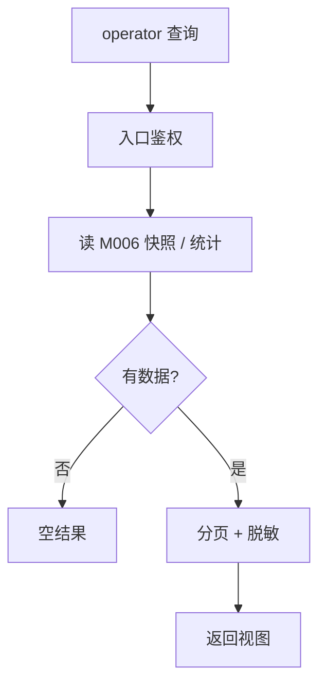

<!-- STD_DOCUMENT_COVER_BEGIN -->
# LLMTier M005 Observability 实现规格设计（ISD）

> STD 使用入口：[项目采用说明与标准导航](../../README.md#std-entry)

| 文档字段 | 值 |
|---|---|
| Document ID | `observability-isd` |
| Document Version | `0.1.0-draft.1` |
| Status | `Draft` |
| Project | `LLMTier` |
| Document Owner | LLMTier |
| Last Modified Date | `2026-09-25` |
| Template ID | `design.implementation` |
| Template Version | `1.2.0` |
<!-- STD_DOCUMENT_COVER_END -->

## 1. 实现目标与输入基线

<a id="isd-scope"></a>

### 1.1 实现对象

- **模块 ID / 名称**：M005 / Observability
- **直属父对象 / 父设计**：LLMTier 软件系统 / `llmtier-system-design`（§3.2 登记）
- **模块设计 Document ID / 版本 / 路径 / 摘要**：`observability` / `0.1.0-draft.2` / `docs/40_module_design/observability-design.md` / §2 F-OBS-*、§5.1 I1–I4、§8 RULE-OBS-*
- **需求与 Constraint ID**：`C-OBS-1`（默认关零开销）、`C-OBS-2`（fail-open）、`C-OBS-3`（不记 Secret/正文）、`C-OBS-4`（注入标注）、`C-OBS-5`（libdiag 提供/Observability 呈现）；机制 `R-OBS-02`
- **实现范围 / 非目标**：实现诊断查询与呈现（快照/统计/注入/trace/traces）、开关切换、关联标识透传；**非目标**：观测记录底层读写（M006）、HTTP 传输（M001）、页面渲染细节（M002）
- **ISD 默认落位或项目批准路径**：`docs/50_implementation_design/observability.isd.md`

<a id="isd-handoff"></a>

### 1.2.1 `HO-OBS-01` · 观测查询与开关呈现

- **上游信息项 / 规则 ID**：`R-OBS-02`
- **固定来源 / 版本 / 锚点 / 摘要**：机制 `M-OBS` §14.4 `R-OBS-02`
- **ISD 细化内容 / 章节**：诊断路由、查询整形、开关切换 → §5.1.1–5.1.4
- **唯一权威位置**：行为在 M-OBS §14.4；本层管落实
- **实现自由度**：呈现实现
- **原 V/Case 及本地验证位置**：`VRC-OBS-001..005` → §9.1

### 1.2.2 `HO-OBS-02` · 关联标识透传

- **上游信息项 / 规则 ID**：`R-OBS-04`
- **固定来源 / 版本 / 锚点 / 摘要**：机制 `M-OBS` §14.4 `R-OBS-04`
- **ISD 细化内容 / 章节**：接收/回显（仅提供时）→ §5.1.5
- **唯一权威位置**：行为在 M-OBS §14.4；本层管落实
- **实现自由度**：解析实现
- **原 V/Case 及本地验证位置**：`VRC-OBS-004` → §9.1

### 1.2.3 `HO-OBS-03` · 诊断页面数据

- **上游信息项 / 规则 ID**：`R-OBS-05`（经 M002）
- **固定来源 / 版本 / 锚点 / 摘要**：机制 `M-OBS` §14.4 `R-OBS-05`
- **ISD 细化内容 / 章节**：4 tabs + 开关数据 → §5.1.6
- **唯一权威位置**：行为在 M-OBS §14.4；本层管数据供给
- **实现自由度**：数据装载实现
- **原 V/Case 及本地验证位置**：`VRC-OBS-005` → §9.1

## 2. 既有实现差异（条件章节）

<a id="isd-current-target"></a>

### 2.1 适用性

- **适用性**：`not_applicable`
- **依据**：greenfield/设计先行
- **Tailoring / 范围决定引用**：`std-tailoring`（设计先行）

## 3. 文件、内部组件与调用关系

<a id="isd-structure"></a>

```text
app.py            # 诊断路由：/v1/diagnostics*、/v1/trace/{id}、/v1/deployments/{id}/diagnostics
webui/app.js      # /ui/diagnostics 4 tabs + 全局开关（属 M002，本模块供数据）
diagnostics.py    # 查询方法：switches/set_switches/snapshots_page/stats/trace/traces/injections/set_injections
```

### 3.1 `app.py`（诊断路由）

- **职责及调用者**：诊断端点路由、开关/注入经审计、关联标识透传；caller=HTTP 客户端
- **类型 / 函数**：`/v1/diagnostics`、`/v1/diagnostics/snapshots`、`/v1/diagnostics/stats`、`/v1/diagnostics/traces`、`/v1/deployments/{id}/diagnostics`、`/v1/trace/{request_id}` 分支
- **可见性**：public（端点）
- **调用与类型依赖**：调用 `DiagnosticsService`；`admin.mutate`（写）
- **构建目标 / 生成源 / 输出**：随 M001 进程
- **实现状态**：PLANNED

### 3.2 `diagnostics.py`（查询）

- **职责及调用者**：本模块消费查询方法；记录读写归 M006
- **类型 / 函数**：`switches`、`snapshots_page`、`stats`、`trace`、`traces`、`injections`
- **可见性**：private
- **调用与类型依赖**：`Store`
- **构建目标 / 生成源 / 输出**：随包
- **实现状态**：PLANNED

### 3.3 `webui/app.js`（诊断页）

- **职责及调用者**：诊断页 4 tabs + 开关数据装载；caller=浏览器
- **类型 / 函数**：`loadStats`/`loadTrace`/注入读写（见 M002）
- **可见性**：public（静态资源）
- **调用与类型依赖**：经 M001 同源
- **构建目标 / 生成源 / 输出**：静态资源
- **实现状态**：PLANNED

## 4. 数据结构设计

<a id="isd-data"></a>

> 按 STD `design-data-interface-format` 1.2.0：主章“数据结构设计”，章内按**数据性质**分类（§4.1–§4.8）。仅保留适用类别，不适用类别在章首给出原因与 tailoring 依据；每个结构以真实名称为带编号的粗体标题，先给代码式声明，再逐项写 `Data/Type ID、用途与来源`、逐字段记录（必填·缺省·可空 / 类型·范围·枚举·含义 / 条件有效性）、`跨字段与寿命`、`合法/拒绝实例` 与 `验证`。继承结构只定位原定义与固定机器源，不复制字段。

**类别适用性**：§4.1 公共基础类型与枚举 ✗（诊断枚举归 M006/M007）｜§4.2 业务与操作数据结构 ✓｜§4.3 配置与规则数据结构 ✗（查询参数为请求级入参，见 §8.1）｜§4.4 通信报文结构 ✗｜§4.5 设备与 FPGA 表项结构 ✗（纯软件）｜§4.6 运行状态数据结构 ✗（查询只读，无跨步骤状态）｜§4.7 数据库表结构 ✗（观测表归 M006/M007）｜§4.8 错误码与错误结构 ✓。

### 4.2 业务与操作数据结构

**4.2.1 `DiagnosticSnapshotView`（`diagnostics.py`）**

```text
DiagnosticSnapshotView {
  id: str
  request_id: str
  captured_at: str
  upstream_url: str          // 去 query
  backend_model: str | null
  http_status: int | null    // 100–599
  latency_ms: float | null
  error_summary: str | null  // ≤256B
  model: str | null
  deployment_id: str | null
  snapshot_type: str
}
```

- **Data/Type ID、用途与来源**

  `D-DIAG-SNAPSHOT-VIEW`；观测查询阅读视图。机器源=`interfaces/openapi/llmtier.openapi.json` + M006 表契约（`libdiag-design.md` §6.2），本层不重定义字段。

- **`id` / `request_id` / `captured_at` / `snapshot_type`**（必填）

  快照身份与时间/类型；`snapshot_type` 白名单。

- **`upstream_url`**（必填、已脱敏）

  上游地址，必须去 query。

- **`http_status` / `latency_ms` / `error_summary`**（可空、条件有效）

  状态码 100–599、时延 ≥0、摘要 ≤256B；URL 去 query。

- **`backend_model` / `model` / `deployment_id`**（可空）

  关联标识；缺失为 `null`。

- **跨字段与寿命**

  URL 去 query、`error_summary` ≤256B；请求级只读视图，M006 写、本模块读。

- **合法/拒绝实例**

  合法：完整快照；拒绝：未知 `request_id` → `ERR-NOTFOUND`。

- **验证**

  `VRC-OBS-002`。

**4.2.2 `TraceView`（`diagnostics.py`）**

```text
TraceView {
  request_id: str
  correlation_id?: str
  stages: object[]           // 有序
  snapshot?: DiagnosticSnapshotView
  usage?: object
}
```

- **Data/Type ID、用途与来源**

  `D-TRACE-VIEW`；单请求 trace 阅读视图。机器源=OpenAPI + M006 表契约。

- **`request_id` / `stages`**（必填）

  `str` / 有序 `object[]`；`stages` 非空且升序。

- **`correlation_id` / `snapshot` / `usage`**（可空）

  关联 ID、快照与用量视图；缺失为 `null`。

- **跨字段与寿命**

  `stages` 有序；请求级只读视图，M006 写、本模块读。

- **合法/拒绝实例**

  合法：完整 trace；拒绝：未知 `request_id` → `ERR-NOTFOUND`。

- **验证**

  `VRC-OBS-002/004`。

**4.2.3 `StatsView` / `StatsWindow`（`stats.py`）**

```text
StatsView {
  windows: StatsWindow[]
}
StatsWindow {
  stat_hour: str             // "YYYY-MM-DDTHH"
  deployment_id?: str
  model?: str
  status_breakdown: object<str,int>
  error_4xx_count: int
  error_5xx_count: int
  request_count: int
  error_count: int
  latency_p50_ms?: float
  latency_p95_ms?: float
  latency_min_ms?: float
  latency_max_ms?: float
  latency_sum_ms: float
}
```

- **Data/Type ID、用途与来源**

  `D-STATS-VIEW`；统计阅读视图。唯一来源=本 ISD 与 M006 §6（`stats.py`）。

- **`windows`**（必填、数组）

  `StatsWindow[]`；无数据时 `[]`。

- **`stat_hour` / `deployment_id` / `model`**（桶键）

  必填小时键；`deployment_id`/`model` 可空。

- **`status_breakdown` / 计数**（必填）

  按状态分解；`error_4xx_count`/`error_5xx_count` 由 breakdown 派生。

- **`latency_*_ms`**（可空/必填）

  `float | null`；无样本时百分位 `null`、`latency_sum_ms=0`。

- **跨字段与寿命**

  `error_*_count` 与 `status_breakdown` 一致；请求级视图，底层由 M006 持久/聚合。

- **合法/拒绝实例**

  合法：有样本 window；边界：无数据 → `windows=[]`。

- **验证**

  `VRC-OBS-002`。

**4.2.4 `InjectionView`（`diagnostics.py`）**

```text
InjectionView {
  id: str
  deployment_id: str
  type: str
  enabled: bool
  config: object
  updated_at: str
}
```

- **Data/Type ID、用途与来源**

  `D-INJECTION-VIEW`；注入配置阅读视图。唯一来源=本 ISD 与 M006 §6。

- **`id` / `deployment_id` / `type` / `enabled` / `config` / `updated_at`**（必填）

  `type` 白名单；`config` 字段集必须与 `type` 一致；`updated_at` 为最后更新时刻。

- **跨字段与寿命**

  注入类型白名单；请求级视图，底层由 M006 持久。

- **合法/拒绝实例**

  合法 `type=delay`；拒绝：非法类型/参数 → `ERR-INJECTION`。

- **验证**

  `VRC-OBS-003`。

**4.2.5 `SwitchState`（`diagnostics.py`）**

```text
SwitchState {
  snapshots_enabled: bool     // 默认 false
  stats_enabled: bool         // 默认 false
}
```

- **Data/Type ID、用途与来源**

  `D-SWITCH-STATE`；诊断开关阅读视图。唯一来源=本 ISD 与 M006 §6。

- **`snapshots_enabled` / `stats_enabled`**（必填、缺省 false）

  `bool`；两字段独立，默认 `false`；关闭即零写入。

- **跨字段与寿命**

  开关默认关；请求级视图，底层由 M006 持久。

- **合法/拒绝实例**

  合法 `{true,false}`；边界：缺行返回默认 `false`。

- **验证**

  `VRC-OBS-001`。

### 4.8 错误码与错误结构

**4.8.1 Observability 错误结构（引用系统 §8.8）**

```text
ApiError { status: int, code: str, message: str, param: str | null,
           retryable: bool, headers: dict | null, extra: dict | null }
```

- **Data/Type ID、用途与来源**

  诊断查询/注入错误经公共 `D-ERROR-ENVELOPE`；含义与码由系统 §8.8 唯一维护；观测写入失败为**私有 fail-open**，不产生公共错误。

- **`status` / `code` / `message` / `param` / `retryable` / `headers` / `extra`**（按需）

  与 M001 `ApiError` 同构；查询结果脱敏。

- **跨字段与寿命**

  503 不伪装空页；URL 去 query、summary 截断；请求级错误对象，写入失败仅 warning。

- **合法/拒绝实例**

  合法：查询返回视图；拒绝：未知 id → `ERR-NOTFOUND`。

- **验证**

  `VRC-OBS-002/003`。

**本层公共错误引用**（ID 定义见系统 §8.8）：

| 本层别名 | 条件 | 系统 Error ID | 合法下一步 |
|---|---|---|---|
| `E-OBS-QUERY` | 存储不可读/缺时间/cursor 失效/未知 id | `ERR-STORE` / `ERR-REQ-VALIDATION` / `ERR-CURSOR` / `ERR-NOTFOUND` | 修参数 / 稍后重试 |
| `E-OBS-INJECT` | 注入类型/参数非法 | `ERR-INJECTION` | 修参数 |
| `E-OBS-WRITE` | 观测记录写入失败（M006） | 私有（fail-open，非公共码） | 尽力而为 |

## 5. 接口设计

<a id="isd-functions"></a>

> 按 STD `design-data-interface-format` 1.2.0 §3：主章“接口设计”，**按接口用途分类**：向本模块使用方提供可调用能力的函数/端点归 §5.1 API；组件或系统间为协作而交换的命令、状态、事件、流等归 §5.2 消息与数据流（使用 HTTP 时仍按用途判断）。每个接口以真实限定名称为标题，标题下先给完整声明，再按六项固定标签（`Interface/Member ID、用途、提供责任与唯一来源`、`输入与前提`、`成功输出与保证`、`错误与合法下一步`、`交互与生命周期`、`实现与验证`）就地记录。数据结构引用 §4；错误传播落在各接口的 `错误与合法下一步`，公共错误 ID 定义见 `llmtier-system-design` §8.8，本层只产生/映射。

### 5.1 API（适用时）

#### 5.1.1 `GET/PATCH /v1/diagnostics`

```text
GET/PATCH /v1/diagnostics
```

- **Interface/Member ID、用途、提供责任与唯一来源**

  - **Interface/Member ID、状态**：`FUNC-OBS-SWITCH` / PLANNED
  - **文件 / symbol / 可见性**：`app.py`（路由）+ `diagnostics.py` `switches/set_switches` / public 端点
  - **原成员 ID 或私有来源**：`F-OBS-SWITCH`、`R-OBS-02`
  - **完整签名与 caller**：`GET/PATCH /v1/diagnostics`；caller=operator

- **输入与前提**

  - **输入参数 / 数据结构 authority**：PATCH `{snapshots_enabled?, stats_enabled?}`
  - **输入约束 / 校验顺序 / 失败映射**：部分更新；经 `admin.mutate` 审计

- **成功输出与保证**

  - **成功输出 / 数据结构 / 后置条件**：开关状态

- **错误与合法下一步**

  - **错误输出 / 触发条件 / 优先级**：无公共错误输出

- **交互与生命周期**

  - **副作用 / 执行上下文 / 幂等性**：写开关（经 M006）
  - **输入输出 ownership 与寿命**：持久（M006）
  - **Thread-safe / reentrant**：每请求线程
  - **Nested-call policy**：allowed
  - **Transaction participation**：joins existing（mutate）
  - **Blocking / timeout / cancellation**：`timeout=10`

- **实现与验证**

  - **不可改变的规则 / Constraint ID**：默认关；关闭零写入
  - **实现自由度**：路由实现
  - **实现状态 / 验证项**：PLANNED；`VRC-OBS-001`

#### 5.1.2 `GET /v1/diagnostics/snapshots|stats|traces`、`GET /v1/trace/{id}`

```text
GET /v1/diagnostics/snapshots|stats|traces`、`GET /v1/trace/{id}
```

- **Interface/Member ID、用途、提供责任与唯一来源**

  - **Interface/Member ID、状态**：`FUNC-OBS-QUERY` / PLANNED
  - **文件 / symbol / 可见性**：`app.py`（route）+ `diagnostics.py`（query）
  - **原成员 ID 或私有来源**：`F-OBS-SNAPSHOTS/STATS/TRACE/TRACES`
  - **完整签名与 caller**：`GET /v1/diagnostics/snapshots|stats|traces`、`GET /v1/trace/{id}`；caller=operator/consumer

- **输入与前提**

  - **输入参数 / 数据结构 authority**：查询参数
  - **输入约束 / 校验顺序 / 失败映射**：时间窗必填（stats）；cursor 校验；失败 → `E-OBS-QUERY`

- **成功输出与保证**

  - **成功输出 / 数据结构 / 后置条件**：视图

- **错误与合法下一步**

  - **错误输出 / 触发条件 / 优先级**：E-OBS-QUERY（ERR-STORE / ERR-REQ-VALIDATION / ERR-CURSOR / ERR-NOTFOUND）：400/503
  - **E-OBS-QUERY（公共 ERR-STORE / ERR-REQ-VALIDATION / ERR-CURSOR / ERR-NOTFOUND）**
    - **底层异常 / 失败事实**：存储不可读 / 缺时间
    - **模块是否处理及处理函数**：reject/propagate
    - **Typed 异常与原生异常所有权**：`ApiError(400/503)`；M001 映射
    - **宿主 / public payload 或状态码**：400/503
    - **日志级别 / 脱敏 / 关联字段**：warning
    - **是否可重试及前提**：稍后重试
    - **状态与副作用影响 / 验证项**：`VRC-OBS-002`

- **交互与生命周期**

  - **副作用 / 执行上下文 / 幂等性**：只读；幂等
  - **输入输出 ownership 与寿命**：请求级
  - **Thread-safe / reentrant**：每请求线程
  - **Nested-call policy**：allowed
  - **Transaction participation**：none
  - **Blocking / timeout / cancellation**：`timeout=10`

- **实现与验证**

  - **不可改变的规则 / Constraint ID**：脱敏；503 不伪装空结果
  - **实现自由度**：呈现实现
  - **实现状态 / 验证项**：PLANNED；`VRC-OBS-002/004`

#### 5.1.3 `GET/PATCH /v1/deployments/{id}/diagnostics`

```text
GET/PATCH /v1/deployments/{id}/diagnostics
```

- **Interface/Member ID、用途、提供责任与唯一来源**

  - **Interface/Member ID、状态**：`FUNC-OBS-INJECT` / PLANNED
  - **文件 / symbol / 可见性**：`app.py`（route）+ `diagnostics.py` `set_injections/injections`
  - **原成员 ID 或私有来源**：`F-OBS-INJECTIONS`、`R-OBS-02`
  - **完整签名与 caller**：`GET/PATCH /v1/deployments/{id}/diagnostics`；caller=operator

- **输入与前提**

  - **输入参数 / 数据结构 authority**：注入项列表（部分更新）
  - **输入约束 / 校验顺序 / 失败映射**：白名单/范围（M006）；非法 → `E-OBS-INJECT`(400)

- **成功输出与保证**

  - **成功输出 / 数据结构 / 后置条件**：注入项列表

- **错误与合法下一步**

  - **错误输出 / 触发条件 / 优先级**：E-OBS-INJECT（ERR-INJECTION · invalid_injection）：400/404
  - **E-OBS-INJECT（公共 ERR-INJECTION · invalid_injection）**
    - **底层异常 / 失败事实**：非法类型/参数
    - **模块是否处理及处理函数**：reject
    - **Typed 异常与原生异常所有权**：`ApiError(400/404)`
    - **宿主 / public payload 或状态码**：400/404
    - **日志级别 / 脱敏 / 关联字段**：无
    - **是否可重试及前提**：修参数
    - **状态与副作用影响 / 验证项**：`VRC-OBS-003`

- **交互与生命周期**

  - **副作用 / 执行上下文 / 幂等性**：写配置（经审计）
  - **输入输出 ownership 与寿命**：持久（M006）
  - **Thread-safe / reentrant**：每请求线程
  - **Nested-call policy**：allowed
  - **Transaction participation**：joins existing（mutate）
  - **Blocking / timeout / cancellation**：`timeout=10`

- **实现与验证**

  - **不可改变的规则 / Constraint ID**：白名单；确定性优先级
  - **实现自由度**：转发实现
  - **实现状态 / 验证项**：PLANNED；`VRC-OBS-003`

#### 5.1.4 `load*() -> Promise<void>`

```text
load*() -> Promise<void>
```

- **Interface/Member ID、用途、提供责任与唯一来源**

  - **Interface/Member ID、状态**：`FUNC-OBS-PAGE` / PLANNED
  - **文件 / symbol / 可见性**：`webui/app.js` / `loadStats`/`loadTrace`/注入（属 M002）/ public
  - **原成员 ID 或私有来源**：`F-OBS-DIAG`（`R-OBS-05`）
  - **完整签名与 caller**：`load*() -> Promise<void>`；caller=页面

- **输入与前提**

  - **输入参数 / 数据结构 authority**：查询参数
  - **输入约束 / 校验顺序 / 失败映射**：失败 → I9

- **成功输出与保证**

  - **成功输出 / 数据结构 / 后置条件**：4 tabs 渲染

- **错误与合法下一步**

  - **错误输出 / 触发条件 / 优先级**：无公共错误输出

- **交互与生命周期**

  - **副作用 / 执行上下文 / 幂等性**：只读
  - **输入输出 ownership 与寿命**：页面
  - **Thread-safe / reentrant**：浏览器单线程
  - **Nested-call policy**：allowed
  - **Transaction participation**：none
  - **Blocking / timeout / cancellation**：浏览器

- **实现与验证**

  - **不可改变的规则 / Constraint ID**：开关关闭 → Disabled
  - **实现自由度**：呈现实现
  - **实现状态 / 验证项**：PLANNED；`VRC-OBS-005`

#### 5.1.5 `随请求头`

```text
随请求头
```

- **Interface/Member ID、用途、提供责任与唯一来源**

  - **Interface/Member ID、状态**：`FUNC-OBS-CORR` / PLANNED
  - **文件 / symbol / 可见性**：`app.py` / 关联标识处理 / public
  - **原成员 ID 或私有来源**：`F-OBS-CORRELATION`、`R-OBS-04`
  - **完整签名与 caller**：随请求头；caller=consumer

- **输入与前提**

  - **输入参数 / 数据结构 authority**：`X-Correlation-ID` / `traceparent`
  - **输入约束 / 校验顺序 / 失败映射**：仅当 consumer 提供时回显

- **成功输出与保证**

  - **成功输出 / 数据结构 / 后置条件**：回显头 + trace detail

- **错误与合法下一步**

  - **错误输出 / 触发条件 / 优先级**：无公共错误输出

- **交互与生命周期**

  - **副作用 / 执行上下文 / 幂等性**：无
  - **输入输出 ownership 与寿命**：请求级
  - **Thread-safe / reentrant**：每请求线程
  - **Nested-call policy**：allowed
  - **Transaction participation**：none
  - **Blocking / timeout / cancellation**：无

- **实现与验证**

  - **不可改变的规则 / Constraint ID**：**仅提供时回显**
  - **实现自由度**：解析实现
  - **实现状态 / 验证项**：PLANNED；`VRC-OBS-004`
### 5.2 消息与数据流接口（适用时）

不适用（诊断数据经同步函数调用读写；无独立消息/队列/流）。

### 5.3 硬件与固件接口（适用时）

不适用（纯软件模块，无连接器/总线/寄存器/FPGA 端口）。

### 5.4 人机与维护接口（适用时）

不适用（诊断入口为 M001 HTTP 端点，已在 §5.1 记录；页面渲染归 M002）。

## 6. 关键流程与算法

<a id="isd-algorithms"></a>



### 6.1 `P-OBS-QUERY` · 诊断查询

- **触发与执行者**：`GET /v1/diagnostics*`；请求线程
- **入口函数及数据**：`app.py` 路由 → `DiagnosticsService` 查询
- **步骤 / 算法 / 复杂度**：校验参数 → 查询 → 整形视图；O(页大小)
- **判断事实来源**：查询参数 / 存储
- **成功可见点**：视图
- **失败、取消与清理**：400/503
- **代表输入与中间值**：`?since=&until=` → 视图
- **规则 / 接口 / 验证引用**：`FUNC-OBS-QUERY`；`VRC-OBS-002/004`

### 6.2 `P-OBS-SWITCH` · 开关/注入变更

- **触发与执行者**：`PATCH /v1/diagnostics`；请求线程
- **入口函数及数据**：`admin.mutate` → `set_switches`/`set_injections`
- **步骤 / 算法 / 复杂度**：审计包裹 → 写；O(1)/O(items)
- **判断事实来源**：PATCH body
- **成功可见点**：新状态 + 审计 success
- **失败、取消与清理**：400/404 + 审计 failed
- **代表输入与中间值**：`{stats_enabled:true}`
- **规则 / 接口 / 验证引用**：`FUNC-OBS-SWITCH/INJECT`；`VRC-OBS-001/003`

## 7. 并发、失败、持久化与安全生命周期

<a id="isd-lifecycle"></a>

### 7.1 并发、交错与失败收口

#### 7.1.1 `CF-OBS-FAILOPEN` · 观测故障

- **参与线程 / 回调 / 事务**：请求线程
- **已产生或可能产生的副作用**：无
- **检测事实 / 期限**：写入异常（M006）
- **状态 / 错误 / 结果已知性**：无
- **保留 / 释放责任**：M006
- **允许的 query / replay / takeover / retry**：尽力而为
- **验证项**：`VRC-OBS-003`

<a id="isd-persistence"></a>

### 7.2 持久化、恢复与 schema 演进

#### 7.2.1.1 N/A · 无自有持久化

- **原规则 / 事务**：本模块不写库；记录由 M006、存储由 M007
- **原子范围 / 事务外副作用**：无
- **开始 / 提交 / 回滚函数**：无
- **持久提交点 / 对外响应点**：无
- **响应丢失后的权威核对**：无
- **恢复入口 / 判定记录 / 重复恢复条件**：无
- **验证项**：无

#### 7.2.2 Schema 演进策略决定

- **Schema authority / 当前版本事实来源**：无本层 schema；事实来源为 M007 `schema_meta.schema_version`（`util.isd.md` §4.4）
- **允许的升级模式**：随 M007 —— 仅 **schema initialization**（空库建当前结构）
- **明确不接受的迁移模式**：无本层独立迁移；**不接受增量升级 / downgrade / 自动修复**
- **兼容边界**：本层不定义版本；仅在 M007 判定 ready 后服务
- **失败后的系统状态与责任方**：M007 拒绝启动（`not_ready`）；责任方=运维

#### 7.2.2.1 `SR-OBSERVABILITY-DELEGATE` · 拒绝规则

- **原规则**：本模块无自有 schema（随 M007）
- **升级 / 降级策略**：无升级、无降级（M007 仅初始化）
- **接受 / 拒绝条件**：接受=M007 空库初始化成功；拒绝=M007 判定版本不匹配 / 无版本表旧库 / 完整性失败
- **源 / 目标版本与转换函数**：无转换函数；随 M007 `schema_version`
- **拒绝后如何处理**：M007 拒绝启动，本模块不服务（不得静默修复）
- **验证项**：`VRC-OBS-002`

#### 7.2.3 库状态分支矩阵

| 库状态 | 判定事实 | 启动结果 | 是否允许重跑及条件 |
|---|---|---|---|
| 空库 | 无 `schema_meta` 且无用户表 | M007 原子初始化 → ready | 是（幂等）|
| 版本匹配 | `schema_version == EXPECTED` | ready | 是 |
| 版本不匹配 | `schema_version != EXPECTED` | M007 拒绝：`schema_version_mismatch` | 否 |
| 无版本表旧库 | 有用户表但无 `schema_meta` | M007 拒绝：`schema_unknown` | 否 |
| 部分初始化 | 初始化事务失败回滚 | 库保持空 | 是 |
| 完整性失败 | `integrity_check != ok` | M007 拒绝：`schema_integrity_failed` | 否 |

<a id="isd-security"></a>

### 7.3 安全、权限与可观测性

#### 7.3.1.1 `SEC-OBS-AUTH` · operator 呈现 + 脱敏

- **原规则**：`C-OBS-3/5`
- **可信输入 / 敏感字段 / 检查对象**：operator `Principal`；查询结果
- **检查函数 / 时点**：入口鉴权；查询结果脱敏
- **拒绝 / 宿主交付出口**：401/403
- **脱敏 / 禁止输出**：URL 去 query、summary 截断、不记 Secret/正文
- **日志 / 指标 / trace 口径及触发**：呈现 M006 数据
- **验证项**：`VRC-OBS-002`

#### 7.3.2.1 `LSS-OBS-DB` · 存储安全

- **适用对象 / 路径 / Owner**：观测表（经 M006/M007）
- **文件与目录权限 / umask**：由 M007
- **Symlink / hardlink / 路径替换策略**：由 M007
- **备份 / 恢复 / 敏感数据静态保护**：不记 Secret/正文
- **删除 / 擦除 / 保留期限**：7 天（M006）
- **磁盘耗尽 / 只读文件系统行为**：随 M006 fail-open
- **检查时点 / 判定 / 拒绝或降级出口**：随 M007
- **验证项**：`VRC-OBS-002`

## 8. 资源、构建与宿主接入

<a id="isd-resources"></a>

### 8.1 配置实现（条件项）

- **适用性 / 固定 authority**：applicable（分页/时间参数）
- **配置 key / 来源 / 优先级**：查询参数 `since/until/deployment_id/model/limit/cursor`；无独立配置
- **类型 / 单位 / 默认值 / 范围 / 字段约束**：`limit` 夹值；时间 ISO8601
- **读取 / 解析 / 校验 symbol**：`app.py` 路由
- **生效点 / reload / 原子性 / 在途操作**：请求级
- **缺失 / 非法 / 部分更新的错误出口**：400（缺时间）
- **敏感值存储 / 日志脱敏**：无敏感配置
- **验证项**：`VRC-OBS-002`

### 8.2.1 `RB-OBS-BUILD` · 构建与装配

- **目标文件 / 产物 / 构建目标**：`app.py`（诊断路由）+ `diagnostics.py`（查询）+ `webui/app.js`；无独立库
- **工具链 / 语言 / 依赖版本**：Python 3.14 + 浏览器 JS
- **宿主接入 / 初始化 / 退出次序**：随 M001 装配；随进程
- **环境 / 数据规模 / 冷热条件**：单库；保留 7 天
- **峰值构成 / 上限 / 共享额度**：快照/traces 500/页；stats 无分页
- **分段预算 / 总期限 / 计时点**：查询无超时（连接 `timeout=10`）
- **超限、部分启动与清理出口**：fail-open
- **构建或运行命令及前置条件**：`PYTHONPATH=src python3 -m pytest tests/ -q`

## 9. 验证规格与实现任务

<a id="isd-verification"></a>

### 9.1.1 `VRC-OBS-001` · 开关

- **Rule / 成员**：`FUNC-OBS-SWITCH`、`C-OBS-1`
- **V / Case / Vector**：v1 默认关；v2 开/关；v3 关闭零写入
- **输入 / 故障 / 环境**：开关切换；隔离库
- **独立 Oracle / Expected**：默认 `{False,False}`；关闭时无新行
- **Actual / Evidence**：NOT_RUN
- **Verdict**：NOT_RUN
- **测试入口 / 清理**：`tests/unit`；隔离库
- **Run ID / Status**：NOT_RUN

### 9.1.2 `VRC-OBS-002` · 快照/统计查询与脱敏

- **Rule / 成员**：`FUNC-OBS-QUERY`、`C-OBS-3`
- **V / Case / Vector**：v1 上游调用后查询；v2 `?token=` URL；v3 503
- **输入 / 故障 / 环境**：隔离库
- **独立 Oracle / Expected**：字段完整；URL 去 query；503 不空页
- **Actual / Evidence**：NOT_RUN
- **Verdict**：NOT_RUN
- **测试入口 / 清理**：`tests/unit`
- **Run ID / Status**：NOT_RUN

### 9.1.3 `VRC-OBS-003` · 注入与 fail-open

- **Rule / 成员**：`FUNC-OBS-INJECT`、`C-OBS-2/4`
- **V / Case / Vector**：v1 合法/非法注入；v2 观测库写失败
- **输入 / 故障 / 环境**：隔离库
- **独立 Oracle / Expected**：400/404；推理结果不变
- **Actual / Evidence**：NOT_RUN
- **Verdict**：NOT_RUN
- **测试入口 / 清理**：`tests/unit`
- **Run ID / Status**：NOT_RUN

### 9.1.4 `VRC-OBS-004` · trace/traces 与关联标识

- **Rule / 成员**：`FUNC-OBS-QUERY/CORR`、`R-OBS-04`
- **V / Case / Vector**：v1 固定 request_id；v2 带/不带 `X-Correlation-ID`；v3 traces 时间窗/分页
- **输入 / 故障 / 环境**：隔离库
- **独立 Oracle / Expected**：stage 有序；仅提供时回显；去重 request
- **Actual / Evidence**：NOT_RUN
- **Verdict**：NOT_RUN
- **测试入口 / 清理**：`tests/unit`
- **Run ID / Status**：NOT_RUN

### 9.1.5 `VRC-OBS-005` · 诊断页

- **Rule / 成员**：`FUNC-OBS-PAGE`、`R-OBS-05`
- **V / Case / Vector**：v1 4 tabs；v2 开关关闭 → Disabled
- **输入 / 故障 / 环境**：诊断页
- **独立 Oracle / Expected**：开关语义
- **Actual / Evidence**：NOT_RUN
- **Verdict**：NOT_RUN
- **测试入口 / 清理**：系统用例
- **Run ID / Status**：NOT_RUN

**运行命令**：全量 `PYTHONPATH=src python3 -m pytest tests/ tests/system/st_*.py -q`

<a id="isd-tasks"></a>

### 9.2.1 `TASK-OBS-ROUTES` · 诊断路由

- **顺序 / 前置项**：1 / —
- **文件 / symbol / 构建目标**：`app.py`
- **不可改变的规则**：端点集合、脱敏、503 显式化
- **实施动作**：实现诊断路由
- **完成检查**：`VRC-OBS-001/002/004`
- **实现状态**：PLANNED
- **验证状态 / Run**：NOT_RUN

### 9.2.2 `TASK-OBS-PAGE` · 诊断页

- **顺序 / 前置项**：2 / `TASK-OBS-ROUTES`
- **文件 / symbol / 构建目标**：`webui/app.js`
- **不可改变的规则**：4 tabs + 开关语义
- **实施动作**：实现诊断页数据装载
- **完成检查**：`VRC-OBS-005`
- **实现状态**：PLANNED
- **验证状态 / Run**：NOT_RUN

## 10. 映射、复核与未决项

<a id="isd-mapping"></a>

### 10.1.1 `MAP-OBS` · 映射

- **模块 / 原成员 ID**：M005 / `F-OBS-*`
- **唯一来源 / 版本 / selector / hash**：`observability` / `0.1.0-draft.2`
- **提供或消费 / backend**：提供（诊断端点）/ M006
- **实际位置或 Planned 计划位置**：`src/http_api/app.py`、`diagnostics.py`、`webui/app.js`
- **验证项**：`VRC-OBS-001..005`
- **实现状态**：PLANNED
- **验证状态 / Run**：NOT_RUN

<a id="isd-status"></a>

### 10.2.1 `SC-OBS` · 状态一致性复核

- **上游承接状态 / 固定来源**：模块 `observability` §15.ISD 声明 `separate`
- **本层派生状态 / 事实依据**：无实际实现/Run；全部 `PLANNED`/`NOT_RUN`
- **§2 Current / Target**：N/A（greenfield）
- **§3 / §5 文件与函数状态**：PLANNED
- **§9 任务 / Actual / Verdict / Run**：PLANNED / NOT_RUN / NOT_RUN / NOT_RUN
- **§10 汇总状态**：PLANNED
- **差异解释 / Owner / 收敛动作**：none

### 10.3.1 `RISK-OBS-1` · 统计可丢

- **既有台账引用 / 具体缺口 / 反例**：`RISK-OBS-1`
- **风险等级 / 判定依据**：Low；统计非账本
- **Owner**：LLMTier
- **最晚关闭阶段 / 截止 Gate**：无
- **阻断范围**：`FUNC-OBS-QUERY`
- **分析 / 决策引用**：模块 §15.1
- **所需输入 / 下一步选择判据**：无
- **解决动作 / 完成条件**：明示非账本语义
- **状态**：Open

### 10.3.2 `OPEN-OBS-1` · 与 M006 文件边界

- **既有台账引用 / 具体缺口 / 反例**：`OPEN-OBS-1`
- **风险等级 / 判定依据**：Low；`diagnostics.py` 同时含 M005 查询与 M006 记录
- **Owner**：LLMTier
- **最晚关闭阶段 / 截止 Gate**：本轮 review
- **阻断范围**：§3
- **分析 / 决策引用**：模块 §15.2
- **所需输入 / 下一步选择判据**：确认划分
- **解决动作 / 完成条件**：以"记录=M006 / 查询呈现=M005"划分，或后续拆文件
- **状态**：Open

### 10.4 Metadata 与 coverage 交付检查

metadata 必须包含：`design_object_id=M005`、`implementation_view_of_document_id=observability`、`volume_of_document_id=null`；模块设计 `implementation_specification.mode=separate/document_id=observability-isd`。

`coverage_mapping` 恰好覆盖十项：`scope`(#isd-scope)、`structure`(#isd-structure)、`data`(#isd-data)、`functions`(#isd-functions)、`algorithms`(#isd-algorithms)、`lifecycle`(#isd-lifecycle)、`resources`(#isd-resources)、`security`(#isd-security)、`persistence`(#isd-persistence)、`verification`(#isd-verification)。

交付前运行 `validate-design <完整设计目录> --check-isd-delivery --json`。

<!-- STD_DOCUMENT_CONTROL_BEGIN -->
| 文档字段 | 值 |
|---|---|
| Authority | `LLMTier` |
| Authors | llmtier |
| Created Date | `2026-09-23` |
| Template Conformance | `tailored` |
| Tailoring Reference | `std-tailoring` |
| Migration Map Reference | none |
| Repository | `corezilla/LLMTier` |
| Canonical Path | `docs/50_implementation_design/observability.isd.md` |
| Supersedes | none |
<!-- STD_DOCUMENT_CONTROL_END -->
