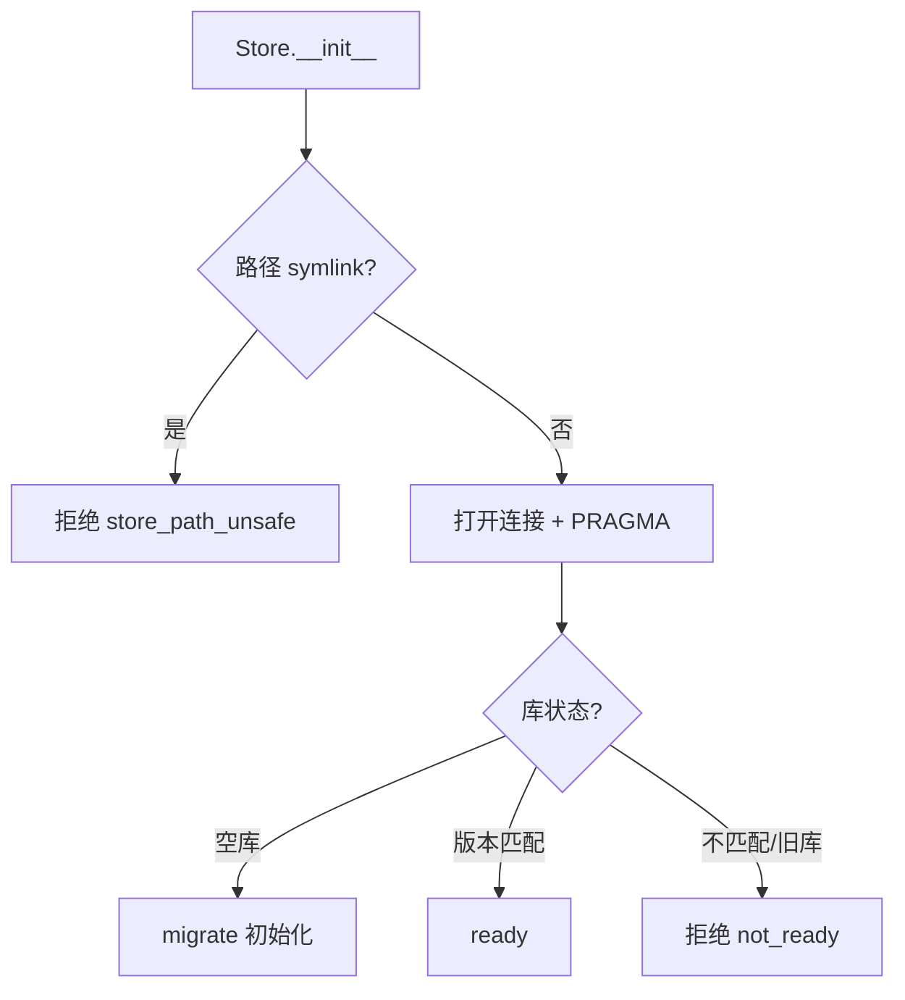

<!-- STD_DOCUMENT_COVER_BEGIN -->
# LLMTier M007 util 实现规格设计（ISD）

> STD 使用入口：[项目采用说明与标准导航](../../README.md#std-entry)

| 文档字段 | 值 |
|---|---|
| Document ID | `util-isd` |
| Document Version | `0.1.0-draft.1` |
| Status | `Draft` |
| Project | `LLMTier` |
| Document Owner | LLMTier |
| Last Modified Date | `2026-09-23` |
| Template ID | `design.implementation` |
| Template Version | `0.5.0` |
<!-- STD_DOCUMENT_COVER_END -->

## 1. 实现目标与输入基线

<a id="isd-scope"></a>

### 1.1 实现对象

- **模块 ID / 名称**：M007 / util
- **直属父对象 / 父设计**：LLMTier 软件系统 / `llmtier-system-design`（§3.2 登记）
- **模块设计 Document ID / 版本 / 路径 / 摘要**：`util` / `0.1.0-draft.1` / `docs/40_module_design/util-design.md` / §2 F-UTIL-CONN/MIGRATE/TXN/QUERY/CLOSE、§8 RULE-UTIL-PRAGMA/TXN/MIGRATE/FD
- **需求与 Constraint ID**：`C-CFG-1`（唯一持久化）、`C-CFG-3`（原子推进）；机制 `R-CFG-03`、`R-OBS-06`
- **实现范围 / 非目标**：实现 SQLite 存取层 `Store`（连接/初始化/schema 演进/事务/查询/关闭）；**非目标**：业务语义、连接池、迁移框架、ORM、配置管理
- **ISD 默认落位或项目批准路径**：`docs/50_implementation_design/util.isd.md`

<a id="isd-handoff"></a>

### 1.2.1 `HO-UTIL-01` · 连接与 PRAGMA

- **上游信息项 / 规则 ID**：`F-UTIL-CONN` / `RULE-UTIL-PRAGMA`
- **固定来源 / 版本 / 锚点 / 摘要**：`util` / `0.1.0-draft.1` / `#2.1`、`#8.1`
- **ISD 细化内容 / 章节**：`threading.local` 缓存与 PRAGMA 落地 → §5.1.1/§5.1.2
- **唯一权威位置**：行为在模块 §2.1；本层管实现
- **实现自由度**：PRAGMA 执行时机/方式
- **原 V/Case 及本地验证位置**：`VRC-UTIL-001` → §9.1

### 1.2.2 `HO-UTIL-02` · 事务

- **上游信息项 / 规则 ID**：`F-UTIL-TXN` / `RULE-UTIL-TXN`
- **固定来源 / 版本 / 锚点 / 摘要**：`util` / `0.1.0-draft.1` / `#2.3`、`#8.2`
- **ISD 细化内容 / 章节**：`BEGIN [IMMEDIATE]` / commit / rollback；嵌套契约 → §5.1.3/§7.1.1
- **唯一权威位置**：行为在模块 §8.2；本层管实现
- **实现自由度**：上下文管理器实现
- **原 V/Case 及本地验证位置**：`VRC-UTIL-002` → §9.1

### 1.2.3 `HO-UTIL-03` · 初始化与 schema 演进

- **上游信息项 / 规则 ID**：`F-UTIL-MIGRATE` / `RULE-UTIL-MIGRATE`
- **固定来源 / 版本 / 锚点 / 摘要**：`util` / `0.1.0-draft.1` / `#2.2`、`#8.3`
- **ISD 细化内容 / 章节**：库状态识别、原子初始化、拒绝语义 → §5.1.4/§7.2
- **唯一权威位置**：行为在模块 §8.3；本层管实现
- **实现自由度**：迁移目录定位、语句切分
- **原 V/Case 及本地验证位置**：`VRC-UTIL-002` → §9.1

### 1.2.4 `HO-UTIL-04` · 查询 helper

- **上游信息项 / 规则 ID**：`F-UTIL-QUERY`
- **固定来源 / 版本 / 锚点 / 摘要**：`util` / `0.1.0-draft.1` / `#2.4`
- **ISD 细化内容 / 章节**：`one()`/`all()` 与 `Row` → §5.1.5
- **唯一权威位置**：行为在模块 §2.4；本层管实现
- **实现自由度**：无
- **原 V/Case 及本地验证位置**：`VRC-UTIL-002` → §9.1

### 1.2.5 `HO-UTIL-05` · 连接关闭

- **上游信息项 / 规则 ID**：`F-UTIL-CLOSE` / `RULE-UTIL-FD`
- **固定来源 / 版本 / 锚点 / 摘要**：`util` / `0.1.0-draft.1` / `#2.5`、`#8.4`
- **ISD 细化内容 / 章节**：`close()` 语义与调用点 → §5.1.6/§7.1.2
- **唯一权威位置**：行为在模块 §8.4；本层管实现
- **实现自由度**：无
- **原 V/Case 及本地验证位置**：`VRC-UTIL-001` → §9.1

### 1.2.6 `HO-UTIL-06` · 观测表存储

- **上游信息项 / 规则 ID**：`R-OBS-06`
- **固定来源 / 版本 / 锚点 / 摘要**：机制 `M-OBS` §14.4 `R-OBS-06`；表契约见 M006 §6 / `libdiag-design` 附录 A
- **ISD 细化内容 / 章节**：观测表 DDL 落点 → §4.4/§5.1.4
- **唯一权威位置**：表契约在 M006/M007；本层管 DDL 落点
- **实现自由度**：DDL 组织
- **原 V/Case 及本地验证位置**：`VRC-UTIL-002` → §9.1

## 2. 既有实现差异（条件章节）

<a id="isd-current-target"></a>

### 2.1 适用性

- **适用性**：`not_applicable`
- **依据**：greenfield/设计先行——本 ISD 为前瞻设计，不存在需修改的既有实现，不固定 baseline commit
- **Tailoring / 范围决定引用**：`std-tailoring`（设计先行，不追现有代码）

## 3. 文件、内部组件与调用关系

<a id="isd-structure"></a>

```text
python 标准库 sqlite3
 ├─ store.py
 │    └─ class Store
 │         ├─ __init__(path)              # 建父目录；安全预检；threading.local
 │         ├─ connection() -> Connection  # 线程内缓存 + PRAGMA
 │         ├─ migrate()                   # 库状态识别 + 原子初始化 + integrity_check
 │         ├─ transaction(immediate)      # 上下文管理器：BEGIN/commit/rollback
 │         ├─ one(sql, params) -> Row|None
 │         ├─ all(sql, params) -> [Row]
 │         └─ close()                     # 关闭线程连接
 └─ migrations/
      ├─ 001_initial.sql
      └─ 002_observability.sql
```

### 3.1 `store.py` · `Store`

- **职责及调用者**：连接/初始化/schema 演进/事务/查询/关闭；被全部业务模块调用
- **类型 / 函数**：`Store.__init__/connection/migrate/transaction/one/all/close`
- **可见性**：private（模块内）
- **调用与类型依赖**：依赖标准库 `sqlite3`/`threading`/`contextlib`/`pathlib`；不 import 业务模块
- **构建目标 / 生成源 / 输出**：无独立构建目标（随包）；无生成源
- **实现状态**：PLANNED

### 3.2 `migrations/*.sql` · DDL 脚本

- **职责及调用者**：建表 DDL；由 `migrate()` 执行
- **类型 / 函数**：SQL 脚本
- **可见性**：private（数据文件，随包）
- **调用与类型依赖**：无
- **构建目标 / 生成源 / 输出**：随包
- **实现状态**：PLANNED

## 4. 内部数据与所有权

<a id="isd-data"></a>

纯软件实现：无原生 ABI/位宽/端序/对齐（依据：Python `sqlite3`，无二进制 wire）。

### 4.1 `Store`（私有类）

- **类型 / 字段**：`path: str`；`_local: threading.local`
- **单位 / 初值 / 范围 / 不变量**：`path` 只读、非空
- **逻辑编码与原生 ABI 适用性**：N/A + 依据（Python 对象）
- **创建 / 修改者**：宿主装配阶段创建
- **Owner / 借用期限 / 释放者**：进程级；`close()` 释放线程连接
- **公共类型 authority**：private
- **持久化与敏感性**：transient（内存对象）

### 4.2 `sqlite3.Connection`（线程局部）

- **类型 / 字段**：`sqlite3.connect(path, timeout=10, isolation_level=None)`；`row_factory=sqlite3.Row`
- **单位 / 初值 / 范围 / 不变量**：每线程一个；`PRAGMA foreign_keys=ON`、`journal_mode=WAL`
- **逻辑编码与原生 ABI 适用性**：N/A + 依据
- **创建 / 修改者**：`connection()` 首次创建并缓存
- **Owner / 借用期限 / 释放者**：线程寿命；`close()` 置 `None`
- **公共类型 authority**：标准库
- **持久化与敏感性**：transient

### 4.3 `sqlite3.Row`

- **类型 / 字段**：按列名访问
- **单位 / 初值 / 范围 / 不变量**：只读；已物化
- **逻辑编码与原生 ABI 适用性**：N/A + 依据
- **创建 / 修改者**：查询产生
- **Owner / 借用期限 / 释放者**：调用方持有；可跨连接关闭读取
- **公共类型 authority**：标准库
- **持久化与敏感性**：transient

### 4.4 SQLite 表结构（DDL，本层权威）

编码以本表为权威；`migrations/001_initial.sql`、`002_observability.sql` 是它的编码（列/约束不得偏离）。

**基础表（`001_initial.sql`）**

| 表 | 列（类型 / 约束）|
|---|---|
| `schema_meta` | `singleton` INTEGER PK CHECK=1；`schema_version` INTEGER NOT NULL；`initialized_at` TEXT NOT NULL；`bootstrap_sha256` TEXT |
| `providers` | `id` TEXT PK；`name` TEXT UNIQUE NOT NULL；`kind` TEXT CHECK IN(cloud,local)；`endpoint` TEXT；`secret_ref` TEXT；`enabled` INTEGER；`version` INTEGER |
| `deployments` | `id` PK；`name` UNIQUE；`provider_id` FK→providers；`backend_model`；`capabilities_json`；`enabled`；`health` DEFAULT 'unknown'；`version` |
| `service_levels` | `id` PK；`enabled`；`capabilities_json`；`version` |
| `service_level_deployments` | `level_id` FK ON DELETE CASCADE；`deployment_id` FK；`ordinal`；PK(level_id,deployment_id)；UNIQUE(level_id,ordinal) |
| `deployment_runtime_profiles` | `deployment_id` PK FK CASCADE；`max_in_flight` DEFAULT 1；`connect_timeout_ms` DEFAULT 30000；`stream_idle_timeout_ms` DEFAULT 60000；`version` |
| `provider_usage_profiles` | `provider_id` PK FK CASCADE；`usage_provider` DEFAULT 'none'；`usage_api_key_ref`/`usage_access_key_ref`/`usage_secret_key_ref`；`max_concurrent_requests` DEFAULT 1；`min_request_interval_ms` DEFAULT 0；`requests_per_minute` DEFAULT 0；`version` |
| `provider_usage_snapshots` | `provider_id` PK FK CASCADE；`snapshot_json`；`checked_at` |
| `provider_request_bindings` | `principal_id`；`request_id`；`provider_id` FK；`deployment_id` FK；`bound_at`；PK(principal_id,request_id) |
| `usage_obligations` | `principal_id`；`request_id`；`model`；`endpoint`；`recorded_at`；`dispatch_authorized_at`；PK(principal_id,request_id) |
| `usage_record_versions` | `principal_id`；`request_id`；`record_version`；`is_final`；`model`；`endpoint`；`recorded_at`；`updated_at`；`measurement_status`；`source`；`input_tokens`；`output_tokens`；`total_tokens`；`cached_input_tokens`；`cache_write_tokens`；`reasoning_tokens`；PK(principal_id,request_id,record_version)；FK→`usage_obligations` |
| `usage_heads` | `principal_id`；`request_id`；`head_record_version`；`updated_at`；PK(principal_id,request_id)；FK→`usage_record_versions` |
| `query_snapshots` | `snapshot_id` PK；`principal_id`；`snapshot_kind`；`filter_digest`；`authorization_digest`；`created_at`；`expires_at` |
| `query_snapshot_items` | `snapshot_id` FK CASCADE；`ordinal`；`request_id`；`record_version`；`frozen_view_json`；`etag`；PK(snapshot_id,ordinal)；UNIQUE(snapshot_id,request_id) |
| `probe_results` | `deployment_id` PK FK CASCADE；`status`；`checked_at`；`request_id`；`detail` |
| `audit_events` | `id` PK；`actor`；`action`；`target`；`result`；`created_at`；`request_id` |
| `operational_logs` | `id` PK；`created_at`；`level`；`module`；`event`；`message` CHECK(length≤512)；`request_id` |

**观测表（`002_observability.sql`）**

| 表 | 列（类型 / 约束）|
|---|---|
| `diagnostic_settings` | `singleton` PK CHECK=1；`snapshots_enabled` DEFAULT 0；`stats_enabled` DEFAULT 0 |
| `diagnostic_snapshots` | `id` PK；`request_id`；`captured_at`；`upstream_url`；`backend_model`；`http_status`；`latency_ms`；`error_summary`；`model`；`deployment_id`；`snapshot_type` DEFAULT 'upstream' |
| `diagnostic_injections` | `id` PK；`deployment_id`；`injection_type`；`fault_status`；`fault_body`；`delay_ms`；`retry_after_sec`；`stream_terminate_after_events`；`malformed_after_events`；`malformed_event_type`；`enabled` DEFAULT 0；`updated_at`；UNIQUE(deployment_id,injection_type) |
| `data_plane_stats` | `stat_hour`；`deployment_id`；`model`；`status`；`request_count` DEFAULT 0；`error_count` DEFAULT 0；`updated_at`；PK(stat_hour,deployment_id,model,status) |
| `data_plane_latency_samples` | `stat_hour`；`deployment_id`；`model`；`latency_ms` NOT NULL；`created_at` |
| `trace_events` | `id` PK；`request_id`；`stage`；`stage_timestamp`；`detail`；`correlation_id`；`created_at` |

**初始化行**：`INSERT OR IGNORE schema_meta(1,1,...)`；`provider_usage_profiles` 对每个 provider 补默认（`local`→`local`，否则 `none`）。

**表契约（跨模块内部权威）**：本层是 schema 唯一落点；表被业务模块按列名/插入顺序依赖，不得自由更改。变更受影响模块见模块设计 §2.3。

## 5. 函数与接口实现规格

<a id="isd-functions"></a>

### 5.1.1 `FUNC-UTIL-INIT` · `Store.__init__`

- **文件 / symbol / 可见性**：`store.py` / `Store.__init__` / private
- **原成员 ID 或私有来源**：`F-UTIL-CONN`（模块 §2.1）
- **完整签名与 caller**：`__init__(self, path: str | Path) -> None`；caller=宿主装配
- **输入参数 / 数据结构 authority**：`path`；类型 `str|Path`；来源=宿主配置；单位=文件路径；ownership=调用方传入
- **输入约束 / 校验顺序 / 失败映射**：path 可写、父目录可创建；先**安全预检**（§7.3.2）再建目录；失败 → `E-UTIL-PATH-UNSAFE` / `OSError`
- **成功输出 / 数据结构 / 后置条件**：实例可用；父目录存在
- **错误输出 / 触发条件 / 优先级**：`E-UTIL-PATH-UNSAFE`（symlink）优先；`OSError`（目录不可建）
- **副作用 / 执行上下文 / 幂等性**：创建父目录；可重复构造
- **输入输出 ownership 与寿命**：`path` 保存为 `str`
- **不可改变的规则 / Constraint ID**：父目录自动创建；symlink 拒绝
- **实现自由度**：目录创建与预检实现
- **Thread-safe / reentrant**：yes（构造期无共享）
- **Nested-call policy**：N/A
- **Transaction participation**：none
- **Blocking / timeout / cancellation**：本地文件系统调用，无超时
- **实现状态 / 验证项**：PLANNED；`VRC-UTIL-001`

### 5.1.2 `FUNC-UTIL-CONN` · `Store.connection`

- **文件 / symbol / 可见性**：`store.py` / `Store.connection` / private
- **原成员 ID 或私有来源**：`F-UTIL-CONN`、`RULE-UTIL-PRAGMA`
- **完整签名与 caller**：`connection(self) -> sqlite3.Connection`；caller=所有 Store 方法
- **输入参数 / 数据结构 authority**：无参
- **输入约束 / 校验顺序 / 失败映射**：无
- **成功输出 / 数据结构 / 后置条件**：线程内 `Connection`（`row_factory=Row`）
- **错误输出 / 触发条件 / 优先级**：连接失败 → `sqlite3.Error`（native，透传）
- **副作用 / 执行上下文 / 幂等性**：可能新建连接并执行 PRAGMA；同线程幂等（返回同一对象）
- **输入输出 ownership 与寿命**：连接归线程，线程寿命
- **不可改变的规则 / Constraint ID**：`timeout=10`、`isolation_level=None`、`row_factory=Row`、`foreign_keys=ON`、`journal_mode=WAL`
- **实现自由度**：PRAGMA 执行时机
- **Thread-safe / reentrant**：内部用 `threading.local`，跨线程隔离
- **Nested-call policy**：allowed
- **Transaction participation**：none（连接层）
- **Blocking / timeout / cancellation**：`timeout=10`（锁等待）
- **实现状态 / 验证项**：PLANNED；`VRC-UTIL-001`

### 5.1.3 `FUNC-UTIL-TXN` · `Store.transaction`

- **文件 / symbol / 可见性**：`store.py` / `Store.transaction` / private
- **原成员 ID 或私有来源**：`F-UTIL-TXN`、`RULE-UTIL-TXN`
- **完整签名与 caller**：`transaction(self, immediate: bool=False) -> Iterator[Connection]`；caller=业务模块 `with`
- **输入参数 / 数据结构 authority**：`immediate: bool`（默认 False）
- **输入约束 / 校验顺序 / 失败映射**：不可在已有事务内调用（SQLite 不允许嵌套）；违规 → `E-UTIL-NESTED-TXN`
- **成功输出 / 数据结构 / 后置条件**：yield `Connection`；退出后已提交
- **错误输出 / 触发条件 / 优先级**：块内异常 → rollback 并重抛；嵌套 → `OperationalError`
- **副作用 / 执行上下文 / 幂等性**：库内事务；不幂等
- **输入输出 ownership 与寿命**：事务内连接由调用方使用
- **不可改变的规则 / Constraint ID**：异常必 rollback；`immediate=True` 用 `BEGIN IMMEDIATE`；不可嵌套、不提供 SAVEPOINT
- **实现自由度**：上下文管理器实现
- **Thread-safe / reentrant**：同连接不可重入；跨线程各自连接
- **Nested-call policy**：**forbidden**（调用方在事务内须直接用传入 `Connection`）
- **Transaction participation**：creates new
- **Blocking / timeout / cancellation**：`BEGIN IMMEDIATE` 可能等锁 → `timeout=10` → `OperationalError`
- **实现状态 / 验证项**：PLANNED；`VRC-UTIL-002`

### 5.1.4 `FUNC-UTIL-MIGRATE` · `Store.migrate`

- **文件 / symbol / 可见性**：`store.py` / `Store.migrate` / private
- **原成员 ID 或私有来源**：`F-UTIL-MIGRATE`、`RULE-UTIL-MIGRATE`
- **完整签名与 caller**：`migrate(self) -> None`；caller=宿主启动装配
- **输入参数 / 数据结构 authority**：无参；常量 `EXPECTED_SCHEMA_VERSION=1`
- **输入约束 / 校验顺序 / 失败映射**：库状态识别（§7.2.3）→ 原子初始化 → `integrity_check`；失败映射见 §5.2
- **成功输出 / 数据结构 / 后置条件**：表就绪、`schema_version=EXPECTED`
- **错误输出 / 触发条件 / 优先级**：`E-UTIL-SCHEMA-VERSION`（版本不符）、`E-UTIL-SCHEMA-UNKNOWN`（无版本表旧库）、`E-UTIL-SCHEMA-INTEGRITY`（完整性失败）
- **副作用 / 执行上下文 / 幂等性**：建表（幂等）；空库重跑安全
- **输入输出 ownership 与寿命**：无
- **不可改变的规则 / Constraint ID**：仅初始化、拒绝语义、原子边界
- **实现自由度**：迁移目录定位、语句切分
- **Thread-safe / reentrant**：启动单线程调用；多实例由 SQLite 写锁串行化
- **Nested-call policy**：forbidden（不在事务内调用；自身管理事务）
- **Transaction participation**：creates new（初始化事务）
- **Blocking / timeout / cancellation**：写锁等待 `timeout=10`
- **实现状态 / 验证项**：PLANNED；`VRC-UTIL-002`

### 5.1.5 `FUNC-UTIL-QUERY` · `Store.one` / `Store.all`

- **文件 / symbol / 可见性**：`store.py` / `Store.one`、`Store.all` / private
- **原成员 ID 或私有来源**：`F-UTIL-QUERY`
- **完整签名与 caller**：`one(self, sql: str, params: Sequence[object]=()) -> Row|None`；`all(...) -> list[Row]`；caller=业务模块
- **输入参数 / 数据结构 authority**：`sql`、`params`；类型见签名
- **输入约束 / 校验顺序 / 失败映射**：SQL 合法；无只读限制（可 `INSERT ... RETURNING`）
- **成功输出 / 数据结构 / 后置条件**：单行 / 行列表
- **错误输出 / 触发条件 / 优先级**：SQL 错误 → `sqlite3.Error`
- **副作用 / 执行上下文 / 幂等性**：取决于 SQL
- **输入输出 ownership 与寿命**：`Row` 已物化，调用方持有
- **不可改变的规则 / Constraint ID**：返回 `Row`（非 tuple）
- **实现自由度**：无
- **Thread-safe / reentrant**：经线程内连接，跨线程隔离
- **Nested-call policy**：allowed
- **Transaction participation**：joins existing（使用当前连接/事务）
- **Blocking / timeout / cancellation**：由 SQL 与连接 timeout
- **实现状态 / 验证项**：PLANNED；`VRC-UTIL-002`

### 5.1.6 `FUNC-UTIL-CLOSE` · `Store.close`

- **文件 / symbol / 可见性**：`store.py` / `Store.close` / private
- **原成员 ID 或私有来源**：`F-UTIL-CLOSE`、`RULE-UTIL-FD`
- **完整签名与 caller**：`close(self) -> None`；caller=宿主每请求 `finally`/停机
- **输入参数 / 数据结构 authority**：无参
- **输入约束 / 校验顺序 / 失败映射**：无
- **成功输出 / 数据结构 / 后置条件**：本线程连接关闭、缓存置 None
- **错误输出 / 触发条件 / 优先级**：`conn.close()` 异常**向上抛**（不吞）
- **副作用 / 执行上下文 / 幂等性**：释放本线程 fd；重复调用安全
- **输入输出 ownership 与寿命**：只释放线程内连接
- **不可改变的规则 / Constraint ID**：只关本线程、不吞异常
- **实现自由度**：无
- **Thread-safe / reentrant**：yes（各线程各连接）
- **Nested-call policy**：allowed
- **Transaction participation**：none
- **Blocking / timeout / cancellation**：本地调用，无超时
- **实现状态 / 验证项**：PLANNED；`VRC-UTIL-001`

### 5.2 错误传播矩阵

#### 5.2.1 `E-UTIL-SCHEMA-VERSION` · 版本不匹配

- **底层异常 / 失败事实**：`schema_version != EXPECTED`
- **模块是否处理及处理函数**：reject（`migrate`）
- **Typed 异常与原生异常所有权**：`Store` 抛 `ApiError(503, "schema_version_mismatch")`；宿主捕获映射 `not_ready`
- **宿主 / public payload 或状态码**：启动失败 / `not_ready`
- **日志级别 / 脱敏 / 关联字段**：error；无敏感字段
- **是否可重试及前提**：否（运维离线迁移/重建）
- **状态与副作用影响 / 验证项**：库未改动；`VRC-UTIL-002`

#### 5.2.2 `E-UTIL-SCHEMA-UNKNOWN` · 无版本表旧库

- **底层异常 / 失败事实**：有用户表但无 `schema_meta`
- **模块是否处理及处理函数**：reject（`migrate`）
- **Typed 异常与原生异常所有权**：`Store` 抛 `ApiError(503, "schema_unknown")`
- **宿主 / public payload 或状态码**：`not_ready`
- **日志级别 / 脱敏 / 关联字段**：error
- **是否可重试及前提**：否
- **状态与副作用影响 / 验证项**：库未改动；`VRC-UTIL-002`

#### 5.2.3 `E-UTIL-SCHEMA-INTEGRITY` · 完整性失败

- **底层异常 / 失败事实**：`PRAGMA integrity_check != ok`
- **模块是否处理及处理函数**：reject（`migrate`）
- **Typed 异常与原生异常所有权**：`Store` 抛 `ApiError(503, "schema_integrity_failed")`
- **宿主 / public payload 或状态码**：`not_ready`
- **日志级别 / 脱敏 / 关联字段**：error
- **是否可重试及前提**：否
- **状态与副作用影响 / 验证项**：`VRC-UTIL-002`

#### 5.2.4 `E-UTIL-DB-RUNTIME` · 运行期 DB 错误

- **底层异常 / 失败事实**：`OperationalError`（busy/locked）、`IntegrityError`（约束）等
- **模块是否处理及处理函数**：propagate（不翻译）
- **Typed 异常与原生异常所有权**：`Store` 抛原生 `sqlite3.Error`；由业务模块/宿主映射
- **宿主 / public payload 或状态码**：busy → 503 `store_unavailable`；constraint → 409/400（按业务）
- **日志级别 / 脱敏 / 关联字段**：warning
- **是否可重试及前提**：busy 可退避重试；constraint 否
- **状态与副作用影响 / 验证项**：由业务决定；`VRC-UTIL-001`（busy）

#### 5.2.5 `E-UTIL-PATH-UNSAFE` · 路径不安全

- **底层异常 / 失败事实**：DB 文件路径为 symlink
- **模块是否处理及处理函数**：reject（`__init__`）
- **Typed 异常与原生异常所有权**：`Store` 抛 `ApiError(503, "store_path_unsafe")`
- **宿主 / public payload 或状态码**：启动失败
- **日志级别 / 脱敏 / 关联字段**：error
- **是否可重试及前提**：否（修路径）
- **状态与副作用影响 / 验证项**：`VRC-UTIL-001`

## 6. 关键流程与算法

<a id="isd-algorithms"></a>



### 6.1 `P-UTIL-INIT` · 连接与 PRAGMA

- **触发与执行者**：首次 `connection()`；调用线程
- **入口函数及数据**：`connection()`；`path`
- **步骤 / 算法 / 复杂度**：取 `_local` → 无则 `connect` + 设 `Row` + PRAGMA → 缓存；O(1)
- **判断事实来源**：`_local` 缓存字段
- **成功可见点**：线程内可复用的 `Connection`
- **失败、取消与清理**：连接失败透传；无清理
- **代表输入与中间值**：无 → 新连接
- **规则 / 接口 / 验证引用**：`RULE-UTIL-PRAGMA`；`VRC-UTIL-001`

### 6.2 `P-UTIL-TXN` · 事务提交/回滚

- **触发与执行者**：业务模块 `with transaction()`；调用线程
- **入口函数及数据**：`transaction`；SQL
- **步骤 / 算法 / 复杂度**：`BEGIN [IMMEDIATE]` → yield → commit / rollback；O(1)
- **判断事实来源**：块内异常
- **成功可见点**：commit 生效
- **失败、取消与清理**：异常 → rollback 并重抛
- **代表输入与中间值**：`INSERT` 后 `raise` → 无半写
- **规则 / 接口 / 验证引用**：`RULE-UTIL-TXN`；`VRC-UTIL-002`

### 6.3 `P-UTIL-MIGRATE` · 初始化与拒绝

- **触发与执行者**：宿主启动；单线程
- **入口函数及数据**：`migrate()`；`migrations/*.sql`
- **步骤 / 算法 / 复杂度**：库状态识别 → 原子初始化（单事务逐语句）→ `integrity_check`；O(文件×语句)
- **判断事实来源**：`sqlite_master`、`schema_version`、`integrity_check`
- **成功可见点**：表就绪
- **失败、取消与清理**：拒绝或回滚（库保持空）
- **代表输入与中间值**：空库 → 建表 + 版本 1
- **规则 / 接口 / 验证引用**：`RULE-UTIL-MIGRATE`；`VRC-UTIL-002`

### 6.4 `P-UTIL-CLOSE` · 连接回收

- **触发与执行者**：宿主每请求 `finally`/停机；调用线程
- **入口函数及数据**：`close()`
- **步骤 / 算法 / 复杂度**：取线程连接 → `close` → 置 None；O(1)
- **判断事实来源**：`_local.connection`
- **成功可见点**：fd 释放
- **失败、取消与清理**：异常向上抛
- **代表输入与中间值**：无
- **规则 / 接口 / 验证引用**：`RULE-UTIL-FD`；`VRC-UTIL-001`

## 7. 并发、失败、持久化与安全生命周期

<a id="isd-lifecycle"></a>

### 7.1 并发、交错与失败收口

#### 7.1.1 `CF-UTIL-NESTED` · 嵌套事务

- **参与线程 / 回调 / 事务**：同连接、调用线程
- **已产生或可能产生的副作用**：无（`BEGIN` 失败）
- **检测事实 / 期限**：SQLite `OperationalError`
- **状态 / 错误 / 结果已知性**：已知失败
- **保留 / 释放责任**：连接保留
- **允许的 query / replay / takeover / retry**：调用方改用传入 `Connection`
- **验证项**：`VRC-UTIL-002`

#### 7.1.2 `CF-UTIL-UNCLOSED` · 连接未关闭

- **参与线程 / 回调 / 事务**：请求线程
- **已产生或可能产生的副作用**：fd 增长
- **检测事实 / 期限**：fd 计数
- **状态 / 错误 / 结果已知性**：无错误
- **保留 / 释放责任**：宿主 `finally: close()`
- **允许的 query / replay / takeover / retry**：无
- **验证项**：`VRC-UTIL-001`

#### 7.1.3 `CF-UTIL-CONCURRENT-START` · 并发启动

- **参与线程 / 回调 / 事务**：多实例进程
- **已产生或可能产生的副作用**：无
- **检测事实 / 期限**：SQLite 写锁 + `timeout=10`
- **状态 / 错误 / 结果已知性**：成功或明确 `OperationalError`
- **保留 / 释放责任**：无
- **允许的 query / replay / takeover / retry**：获锁方继续
- **验证项**：`VRC-UTIL-002`

<a id="isd-persistence"></a>

### 7.2 持久化、恢复与 schema 演进

#### 7.2.1.1 `PF-UTIL-TXN` · 事务

- **原规则 / 事务**：`RULE-UTIL-TXN`
- **原子范围 / 事务外副作用**：单事务内 SQL；无事务外副作用
- **开始 / 提交 / 回滚函数**：`transaction`（`BEGIN`/`commit`/`rollback`）
- **持久提交点 / 对外响应点**：`commit()` 为持久提交点
- **响应丢失后的权威核对**：由业务模块核对账本（M-METER）
- **恢复入口 / 判定记录 / 重复恢复条件**：无（请求级事务，无独立恢复入口）
- **验证项**：`VRC-UTIL-002`

#### 7.2.2 Schema 演进策略决定

- **Schema authority / 当前版本事实来源**：本 ISD §4.4；`schema_meta.schema_version` 为事实来源
- **允许的升级模式**：仅 **schema initialization**（空库建当前结构）
- **明确不接受的迁移模式**：**无增量升级 / 无 downgrade / 无自动修复**
- **兼容边界**：仅支持空库；不支持新程序读旧库、旧程序读新库、跨版本跳跃
- **失败后的系统状态与责任方**：拒绝启动（`not_ready`）；责任方=运维（离线迁移/重建）

#### 7.2.2.1 `SR-UTIL-REJECT` · 拒绝规则

- **原规则**：`RULE-UTIL-MIGRATE`
- **升级 / 降级策略**：仅初始化；无升级、无降级
- **接受 / 拒绝条件**：接受=空库（建表）；拒绝=非空且 `schema_version≠EXPECTED`，或有无版本表旧库
- **源 / 目标版本与转换函数**：无转换函数；`schema_version` 固定 `1`
- **拒绝后如何处理**：拒绝启动 + error 日志；运维离线迁移/重建（不得静默修复）
- **验证项**：`VRC-UTIL-002`

#### 7.2.3 库状态分支矩阵

| 库状态 | 判定事实 | 启动结果 | 是否允许重跑及条件 |
|---|---|---|---|
| 空库 | 无 `schema_meta` 表且无用户表 | 原子初始化 → ready | 是（幂等）|
| 版本匹配 | `schema_version == EXPECTED` | ready（不重建）| 是 |
| 版本不匹配 | `schema_version != EXPECTED` | 拒绝：`schema_version_mismatch` | 否（运维离线处理）|
| 无版本表旧库 | 有用户表但无 `schema_meta` | 拒绝：`schema_unknown` | 否 |
| 部分初始化 | 初始化事务失败回滚 | 库保持空 | 是 |
| 完整性失败 | `integrity_check != ok` | 拒绝：`schema_integrity_failed` | 否 |

<a id="isd-security"></a>

### 7.3 安全、权限与可观测性

#### 7.3.1.1 `SEC-UTIL-AUTH` · 鉴权（不适用）

- **原规则**：模块 §11（基础层不鉴权）
- **可信输入 / 敏感字段 / 检查对象**：无
- **检查函数 / 时点**：无
- **拒绝 / 宿主交付出口**：无
- **脱敏 / 禁止输出**：本层不记录任何值
- **日志 / 指标 / trace 口径及触发**：不写日志/指标（避免反向依赖）
- **验证项**：`VRC-UTIL-001`

#### 7.3.2.1 `LSS-UTIL-DB` · DB 文件/目录安全

- **适用对象 / 路径 / Owner**：DB 文件及其父目录；LLMTier
- **文件与目录权限 / umask**：属**部署配置**；本层不设权限，仅检查
- **Symlink / hardlink / 路径替换策略**：`os.lstat` 判定 **symlink → 拒绝**（`store_path_unsafe`）
- **备份 / 恢复 / 敏感数据静态保护**：库**不含 Secret 明文**（只 `secret_ref` 引用）；备份由运维
- **删除 / 擦除 / 保留期限**：由运维；本层不管理
- **磁盘耗尽 / 只读文件系统行为**：写失败 → `OperationalError`（由宿主映射 503）
- **检查时点 / 判定 / 拒绝或降级出口**：打开**前**检查；symlink → 拒绝；world-writable（`mode & 0o002`）→ **warning 并继续**
- **验证项**：`VRC-UTIL-001`

## 8. 资源、构建与宿主接入

<a id="isd-resources"></a>

### 8.1 配置实现（条件项）

- **适用性 / 固定 authority**：applicable（少量部署/内部参数）
- **配置 key / 来源 / 优先级**：`database`（宿主传入路径）；`timeout`、`journal_mode`、`foreign_keys` 为**固定常量**（非外部配置）
- **类型 / 单位 / 默认值 / 范围 / 字段约束**：`database` 路径非空；常量见 §5.1.2
- **读取 / 解析 / 校验 symbol**：`Store.__init__`（路径）；常量在 `connection()` 使用
- **生效点 / reload / 原子性 / 在途操作**：启动时；不支持运行期 reload
- **缺失 / 非法 / 部分更新的错误出口**：路径缺失/不可写 → `OSError`/`store_path_unsafe`
- **敏感值存储 / 日志脱敏**：无敏感配置
- **验证项**：`VRC-UTIL-001`

### 8.2.1 `RB-UTIL-BUILD` · 构建与装配

- **目标文件 / 产物 / 构建目标**：`store.py` + `migrations/*.sql`；无独立库
- **工具链 / 语言 / 依赖版本**：Python 3.14；标准库（无第三方）
- **宿主接入 / 初始化 / 退出次序**：宿主装配构造 `Store` → 调 `migrate()`；业务持引用；每请求 `finally: close()`
- **环境 / 数据规模 / 冷热条件**：单文件 SQLite；冷启动建表、热启动版本匹配
- **峰值构成 / 上限 / 共享额度**：每线程 1 连接；fd 非稳定契约（WAL/SHM 可共享）
- **分段预算 / 总期限 / 计时点**：无自有预算；由宿主请求生命周期约束
- **超限、部分启动与清理出口**：fd 上限由宿主 + `close()` 缓解；锁等待超时 → `OperationalError`
- **构建或运行命令及前置条件**：`PYTHONPATH=src python3 -m pytest tests/unit/v03 -q`（仓库根）

## 9. 验证规格与实现任务

<a id="isd-verification"></a>

### 9.1.1 `VRC-UTIL-001` · 连接/PRAGMA/回收/安全

- **Rule / 成员**：`RULE-UTIL-PRAGMA`、`RULE-UTIL-FD`
- **V / Case / Vector**：v1 PRAGMA；v2 fd 基线；v3 busy；v4 close 异常；v5 world-writable；v6 symlink 拒绝
- **输入 / 故障 / 环境**：打开连接；N 次请求；锁占用；`close` 抛错；权限/符号链接
- **独立 Oracle / Expected**：`foreign_keys=1`、`journal_mode=wal`；fd 不随请求数增长；busy → `OperationalError`；close 异常向上抛；world-writable → warning；symlink → `store_path_unsafe`
- **Actual / Evidence**：NOT_RUN
- **Verdict**：NOT_RUN
- **测试入口 / 清理**：`tests/unit/v03`；隔离库
- **Run ID / Status**：NOT_RUN

### 9.1.2 `VRC-UTIL-002` · 事务/初始化/拒绝

- **Rule / 成员**：`RULE-UTIL-TXN`、`RULE-UTIL-MIGRATE`
- **V / Case / Vector**：v1 异常回滚；v2 重复 `migrate()`；v3 损坏库；v4 版本不匹配；v5 中途失败；v6 嵌套事务；v7 并发启动；v8 无版本表旧库
- **输入 / 故障 / 环境**：事务内抛异常；连续 migrate；损坏文件；非空库版本≠期望；脚本中途失败；事务内再 BEGIN；两实例并发；有表无 `schema_meta`
- **独立 Oracle / Expected**：无半写；幂等；`schema_integrity_failed`；`schema_version_mismatch`；回滚后库空；`OperationalError`；无部分/损坏表；`schema_unknown`
- **Actual / Evidence**：NOT_RUN
- **Verdict**：NOT_RUN
- **测试入口 / 清理**：`tests/unit/v03` + 并发/故障注入；隔离库
- **Run ID / Status**：NOT_RUN

**运行命令**：全量 `PYTHONPATH=src python3 -m pytest tests/ tests/system/st_*.py -q`

<a id="isd-tasks"></a>

### 9.2.1 `TASK-UTIL-CONN` · 连接与安全预检

- **顺序 / 前置项**：1 / —
- **文件 / symbol / 构建目标**：`store.py` `__init__`、`connection`、`close`
- **不可改变的规则**：`timeout=10`、PRAGMA、symlink 拒绝、只关本线程
- **实施动作**：实现连接缓存、PRAGMA、路径预检、关闭
- **完成检查**：`VRC-UTIL-001`
- **实现状态**：PLANNED
- **验证状态 / Run**：NOT_RUN

### 9.2.2 `TASK-UTIL-TXN` · 事务与查询

- **顺序 / 前置项**：2 / `TASK-UTIL-CONN`
- **文件 / symbol / 构建目标**：`store.py` `transaction`、`one`、`all`
- **不可改变的规则**：异常 rollback、不可嵌套、返回 `Row`
- **实施动作**：实现事务上下文与查询 helper
- **完成检查**：`VRC-UTIL-002`
- **实现状态**：PLANNED
- **验证状态 / Run**：NOT_RUN

### 9.2.3 `TASK-UTIL-MIGRATE` · 初始化与拒绝

- **顺序 / 前置项**：3 / `TASK-UTIL-CONN`
- **文件 / symbol / 构建目标**：`store.py` `migrate`、`migrations/*.sql`
- **不可改变的规则**：仅初始化、拒绝语义、原子边界、`schema_version=1`
- **实施动作**：实现库状态识别、原子初始化、完整性检查
- **完成检查**：`VRC-UTIL-002`
- **实现状态**：PLANNED
- **验证状态 / Run**：NOT_RUN

## 10. 映射、复核与未决项

<a id="isd-mapping"></a>

### 10.1.1 `MAP-UTIL-CONN` · 连接映射

- **模块 / 原成员 ID**：M007 / `F-UTIL-CONN`
- **唯一来源 / 版本 / selector / hash**：`util` / `0.1.0-draft.1` / `#2.1`
- **提供或消费 / backend**：提供 / sqlite3
- **实际位置或 Planned 计划位置**：`src/util/store.py` `Store.connection`
- **验证项**：`VRC-UTIL-001`
- **实现状态**：PLANNED
- **验证状态 / Run**：NOT_RUN

### 10.1.2 `MAP-UTIL-TXN` · 事务映射

- **模块 / 原成员 ID**：M007 / `F-UTIL-TXN`
- **唯一来源 / 版本 / selector / hash**：`util` / `0.1.0-draft.1` / `#2.3`
- **提供或消费 / backend**：提供 / sqlite3
- **实际位置或 Planned 计划位置**：`store.py` `Store.transaction`
- **验证项**：`VRC-UTIL-002`
- **实现状态**：PLANNED
- **验证状态 / Run**：NOT_RUN

### 10.1.3 `MAP-UTIL-MIGRATE` · 初始化映射

- **模块 / 原成员 ID**：M007 / `F-UTIL-MIGRATE`
- **唯一来源 / 版本 / selector / hash**：`util` / `0.1.0-draft.1` / `#2.2`
- **提供或消费 / backend**：提供 / sqlite3
- **实际位置或 Planned 计划位置**：`store.py` `Store.migrate`
- **验证项**：`VRC-UTIL-002`
- **实现状态**：PLANNED
- **验证状态 / Run**：NOT_RUN

<a id="isd-status"></a>

### 10.2.1 `SC-UTIL` · 状态一致性复核

- **上游承接状态 / 固定来源**：模块 `util` §15.ISD 声明 `separate`
- **本层派生状态 / 事实依据**：无实际实现/Run；全部 `PLANNED`/`NOT_RUN`
- **§2 Current / Target**：N/A（greenfield，见 §2.1）
- **§3 / §5 文件与函数状态**：PLANNED
- **§9 任务 / Actual / Verdict / Run**：PLANNED / NOT_RUN / NOT_RUN / NOT_RUN
- **§10 汇总状态**：PLANNED
- **差异解释 / Owner / 收敛动作**：none（设计期一致）

### 10.3.1 `RISK-UTIL-1` · 高并发写串行

- **既有台账引用 / 具体缺口 / 反例**：`util` §15.1
- **风险等级 / 判定依据**：Medium；高并发写可能锁等待
- **Owner**：LLMTier
- **最晚关闭阶段 / 截止 Gate**：性能验证阶段
- **阻断范围**：`F-UTIL-TXN` 性能
- **分析 / 决策引用**：`util` §15.1
- **所需输入 / 下一步选择判据**：性能数据
- **解决动作 / 完成条件**：WAL + `BEGIN IMMEDIATE`；按验证结果调参
- **状态**：Open

### 10.4 Metadata 与 coverage 交付检查

metadata 必须显式包含：`design_object_id=M007`、`implementation_view_of_document_id=util`、`volume_of_document_id=null`；模块设计 `implementation_specification.mode=separate/document_id=util-isd`。

`coverage_mapping` 恰好覆盖十项（各指向本 ISD 锚点）：`scope`(#isd-scope)、`structure`(#isd-structure)、`data`(#isd-data)、`functions`(#isd-functions)、`algorithms`(#isd-algorithms)、`lifecycle`(#isd-lifecycle)、`resources`(#isd-resources)、`security`(#isd-security)、`persistence`(#isd-persistence)、`verification`(#isd-verification)。

交付前运行 `validate-design <完整设计目录> --check-isd-delivery --json`。

<!-- STD_DOCUMENT_CONTROL_BEGIN -->
| 文档字段 | 值 |
|---|---|
| Authority | `LLMTier` |
| Authors | llmtier |
| Created Date | `2026-09-23` |
| Template Conformance | `tailored` |
| Tailoring Reference | `std-tailoring` |
| Migration Map Reference | none |
| Repository | `corezilla/LLMTier` |
| Canonical Path | `docs/50_implementation_design/util.isd.md` |
| Supersedes | none |
<!-- STD_DOCUMENT_CONTROL_END -->
