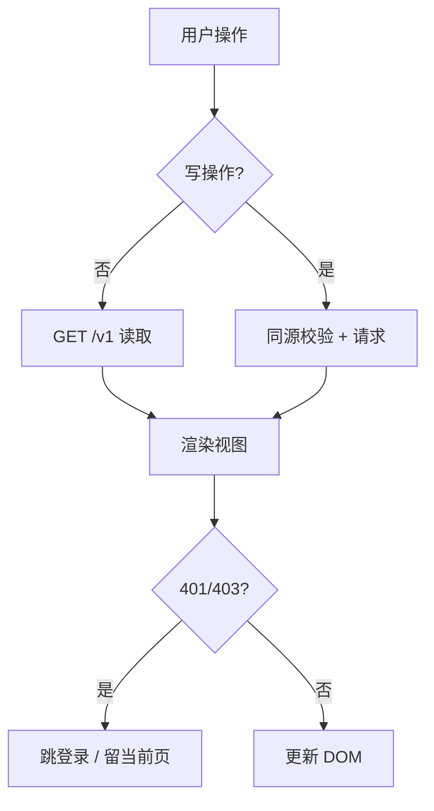

<!-- STD_DOCUMENT_COVER_BEGIN -->
# LLMTier M002 Web UI 实现规格设计（ISD）

> STD 使用入口：[项目采用说明与标准导航](../../README.md#std-entry)

| 文档字段 | 值 |
|---|---|
| Document ID | `web-ui-isd` |
| Document Version | `0.1.0-draft.1` |
| Status | `Draft` |
| Project | `LLMTier` |
| Document Owner | LLMTier |
| Last Modified Date | `2026-09-23` |
| Template ID | `design.implementation` |
| Template Version | `0.5.0` |
<!-- STD_DOCUMENT_COVER_END -->

## 1. 实现目标与输入基线

<a id="isd-scope"></a>

### 1.1 实现对象

- **模块 ID / 名称**：M002 / Web UI
- **直属父对象 / 父设计**：LLMTier 软件系统 / `llmtier-system-design`（§3.2 登记）
- **模块设计 Document ID / 版本 / 路径 / 摘要**：`web-ui` / `0.1.0-draft.1` / `docs/40_module_design/web-ui-design.md` / §3 页面清单、§5.1 I1–I9、§8 RULE-UI-*
- **需求与 Constraint ID**：`C-TRUST-1`、`C-METER`（未知不填零）、`C-OBS-1`；机制 `R-CFG-05`、`R-OBS-05`
- **实现范围 / 非目标**：实现浏览器端 operator 控制台（框架/导航/5 页 + 2 抽屉、页面渲染、mutation、交互状态）；**非目标**：服务端逻辑、访问控制、账号库、直读 DB/Secret
- **ISD 默认落位或项目批准路径**：`docs/50_implementation_design/web-ui.isd.md`

<a id="isd-handoff"></a>

### 1.2.1 `HO-UI-01` · 管理面操作

- **上游信息项 / 规则 ID**：`R-CFG-05`
- **固定来源 / 版本 / 锚点 / 摘要**：机制 `M-CONFIG` §14.4 `R-CFG-05`
- **ISD 细化内容 / 章节**：页面/抽屉、API 客户端 → §3.1/§5.1.1
- **唯一权威位置**：行为在 M-CONFIG §14.4；本层管落实
- **实现自由度**：呈现实现
- **原 V/Case 及本地验证位置**：`VRC-UI-002` → §9.1

### 1.2.2 `HO-UI-02` · 诊断呈现

- **上游信息项 / 规则 ID**：`R-OBS-05`
- **固定来源 / 版本 / 锚点 / 摘要**：机制 `M-OBS` §14.4 `R-OBS-05`
- **ISD 细化内容 / 章节**：`/ui/diagnostics` 4 tabs + 全局开关 → §5.1.7
- **唯一权威位置**：行为在 M-OBS §14.4；本层管落实
- **实现自由度**：呈现实现
- **原 V/Case 及本地验证位置**：`VRC-UI-006` → §9.1

## 2. 既有实现差异（条件章节）

<a id="isd-current-target"></a>

### 2.1 适用性

- **适用性**：`not_applicable`
- **依据**：greenfield/设计先行
- **Tailoring / 范围决定引用**：`std-tailoring`（设计先行）

## 3. 文件、内部组件与调用关系

<a id="isd-structure"></a>

```text
webui/
 ├─ index.html   # 结构壳：侧栏 5 项 + 页头 + 5 个 .page 容器 + 2 个抽屉表单 + datalist
 ├─ app.js       # api()/路由/load*/render*/mutation/状态映射/I9
 ├─ styles.css   # 基础/框架/页面/组件/树/抽屉 6 分区
 └─ icons.svg    # 单线图标 sprite（<symbol id>）
```

### 3.1 `index.html` · 结构壳

- **职责及调用者**：承载侧栏/页头/各页容器/抽屉；caller=浏览器
- **类型 / 函数**：容器 `id`（`#tree`/`#provider-tree`/`#usage-body`/`#audit-body`/`#log-body` 等）
- **可见性**：public（静态资源）
- **调用与类型依赖**：装配 `styles.css`/`icons.svg`/`app.js`
- **构建目标 / 生成源 / 输出**：由 M001 静态交付
- **实现状态**：PLANNED

### 3.2 `app.js` · 客户端逻辑

- **职责及调用者**：路由、装载、渲染、mutation、交互状态；caller=`index.html`
- **类型 / 函数**：`api`、`loadRegistry/loadHome/loadProviders/loadUsage/loadAudit/loadLogs/loadStats/loadTrace`、`renderTree/renderProviders/renderTierMembers`、`toggleDeployment/probeDeployment/saveProvider/saveMember/removeMember/refreshProviderUsage`、`backendState/tierState/statusMarkup`
- **可见性**：private（浏览器）
- **调用与类型依赖**：只经 `api()` 调 M001 同源 HTTP
- **构建目标 / 生成源 / 输出**：静态资源
- **实现状态**：PLANNED

### 3.3 `styles.css` / `icons.svg`

- **职责及调用者**：布局/状态样式；单线图标 sprite
- **类型 / 函数**：类选择器；`<symbol id>`
- **可见性**：public（静态资源）
- **调用与类型依赖**：无
- **构建目标 / 生成源 / 输出**：静态资源
- **实现状态**：PLANNED

## 4. 内部数据与所有权

<a id="isd-data"></a>

纯软件：无原生 ABI（浏览器 JS/DOM）。

### 4.1 `state`（内存）

- **类型 / 字段**：`{registry, providers[], deployments[], usage, runtime}`
- **单位 / 初值 / 范围 / 不变量**：页面内存缓存；**不持久化**
- **逻辑编码与原生 ABI 适用性**：N/A + 依据（JS 对象）
- **创建 / 修改者**：`load*` 写
- **Owner / 借用期限 / 释放者**：页面寿命
- **公共类型 authority**：private（字段形状由 OpenAPI 决定）
- **持久化与敏感性**：transient；不落 localStorage

### 4.2 `ETag`

- **类型 / 字段**：`string`（`"<id>.v<n>"`）
- **单位 / 初值 / 范围 / 不变量**：编辑事务内
- **逻辑编码与原生 ABI 适用性**：N/A
- **创建 / 修改者**：`api`/编辑流程
- **Owner / 借用期限 / 释放者**：编辑事务内
- **公共类型 authority**：private
- **持久化与敏感性**：transient

### 4.3 会话 cookie / 错误状态

- **类型 / 字段**：cookie（SSO 代理）；`{status:int, code?:string}`
- **单位 / 初值 / 范围 / 不变量**：cookie 由代理；错误 401/403/409/412/429/503
- **逻辑编码与原生 ABI 适用性**：N/A
- **创建 / 修改者**：代理签发；I9 处理
- **Owner / 借用期限 / 释放者**：代理/页面
- **公共类型 authority**：private
- **持久化与敏感性**：cookie=代理；**bearer/Secret 不入 JS**

## 5. 函数与接口实现规格

<a id="isd-functions"></a>

### 5.1.1 `FUNC-UI-API` · `api`

- **文件 / symbol / 可见性**：`app.js` / `api` / private
- **原成员 ID 或私有来源**：`F-UI-*`
- **完整签名与 caller**：`api(path, {method='GET', body, headers={}}) -> Promise<object>`；caller=各 `load*/mutation`
- **输入参数 / 数据结构 authority**：`path`、options；字段形状由 OpenAPI 决定
- **输入约束 / 校验顺序 / 失败映射**：`credentials:'same-origin'`；非 2xx → 抛错交 I9
- **成功输出 / 数据结构 / 后置条件**：解析后的对象
- **错误输出 / 触发条件 / 优先级**：401/403/409/412/429/503 → I9
- **副作用 / 执行上下文 / 幂等性**：网络；取决于 method
- **输入输出 ownership 与寿命**：请求级
- **不可改变的规则 / Constraint ID**：同源；`If-Match` 透传
- **实现自由度**：封装实现
- **Thread-safe / reentrant**：浏览器单线程事件循环
- **Nested-call policy**：allowed
- **Transaction participation**：none
- **Blocking / timeout / cancellation**：浏览器默认
- **实现状态 / 验证项**：PLANNED；`VRC-UI-001`

### 5.1.2 `FUNC-UI-LOAD` · `load*`

- **文件 / symbol / 可见性**：`app.js` / `loadRegistry/loadHome/...` / private
- **原成员 ID 或私有来源**：`F-UI-HOME/PROVIDERS/RECORDS/LOGS/DIAG`
- **完整签名与 caller**：`load*() -> Promise<void>`；caller=页面进入
- **输入参数 / 数据结构 authority**：无
- **输入约束 / 校验顺序 / 失败映射**：失败 → I9
- **成功输出 / 数据结构 / 后置条件**：更新 `state` 并渲染
- **错误输出 / 触发条件 / 优先级**：见 I9
- **副作用 / 执行上下文 / 幂等性**：读；幂等
- **输入输出 ownership 与寿命**：页面
- **不可改变的规则 / Constraint ID**：Tier 状态取 `/readyz`；未知不填零
- **实现自由度**：装载实现
- **Thread-safe / reentrant**：单线程
- **Nested-call policy**：allowed
- **Transaction participation**：none
- **Blocking / timeout / cancellation**：浏览器
- **实现状态 / 验证项**：PLANNED；`VRC-UI-001/004`

### 5.1.3 `FUNC-UI-RENDER` · `render*` / 状态映射

- **文件 / symbol / 可见性**：`app.js` / `renderTree/renderProviders/renderTierMembers/backendState/tierState/statusMarkup` / private
- **原成员 ID 或私有来源**：`F-UI-HOME/PROVIDERS`
- **完整签名与 caller**：`render*() -> void`；`backendState/tierState(...) -> string/obj`；caller=`load*`
- **输入参数 / 数据结构 authority**：`state`
- **输入约束 / 校验顺序 / 失败映射**：无
- **成功输出 / 数据结构 / 后置条件**：DOM 更新
- **错误输出 / 触发条件 / 优先级**：无
- **副作用 / 执行上下文 / 幂等性**：DOM 渲染
- **输入输出 ownership 与寿命**：页面
- **不可改变的规则 / Constraint ID**：状态语义（不互相覆盖、未知不填零）
- **实现自由度**：渲染实现
- **Thread-safe / reentrant**：单线程
- **Nested-call policy**：allowed
- **Transaction participation**：none
- **Blocking / timeout / cancellation**：无
- **实现状态 / 验证项**：PLANNED；`VRC-UI-001/004`

### 5.1.4 `FUNC-UI-MUTATE` · mutation

- **文件 / symbol / 可见性**：`app.js` / `toggleDeployment/probeDeployment/saveProvider/saveMember/removeMember/refreshProviderUsage` / private
- **原成员 ID 或私有来源**：`F-UI-TIER-EDIT/PAUSE/PROBE/PROVIDERS`
- **完整签名与 caller**：`(el|event) -> Promise<void>`；caller=页面交互
- **输入参数 / 数据结构 authority**：表单/元素
- **输入约束 / 校验顺序 / 失败映射**：字段级校验；412 stale、409 引用
- **成功输出 / 数据结构 / 后置条件**：更新视图
- **错误输出 / 触发条件 / 优先级**：412/409 → I9
- **副作用 / 执行上下文 / 幂等性**：写；非幂等
- **输入输出 ownership 与寿命**：页面
- **不可改变的规则 / Constraint ID**：`If-Match`；保存≠probe/health；探测付费确认
- **实现自由度**：实现
- **Thread-safe / reentrant**：单线程
- **Nested-call policy**：allowed
- **Transaction participation**：none
- **Blocking / timeout / cancellation**：浏览器
- **实现状态 / 验证项**：PLANNED；`VRC-UI-002/003/005`

### 5.1.5 `FUNC-UI-STATES` · I9 交互状态

- **文件 / symbol / 可见性**：`app.js` / I9 / private
- **原成员 ID 或私有来源**：`F-UI-STATES`
- **完整签名与 caller**：随 `api` 错误分派
- **输入参数 / 数据结构 authority**：`{status,code?}`
- **输入约束 / 校验顺序 / 失败映射**：按状态呈现
- **成功输出 / 数据结构 / 后置条件**：UI 反馈
- **错误输出 / 触发条件 / 优先级**：无
- **副作用 / 执行上下文 / 幂等性**：无
- **输入输出 ownership 与寿命**：页面
- **不可改变的规则 / Constraint ID**：401 跳登录、403 不猜存在性、503 显式化
- **实现自由度**：呈现实现
- **Thread-safe / reentrant**：单线程
- **Nested-call policy**：allowed
- **Transaction participation**：none
- **Blocking / timeout / cancellation**：无
- **实现状态 / 验证项**：PLANNED；`VRC-UI-001`

### 5.2 错误传播矩阵

#### 5.2.1 `E-UI-401` · 会话过期

- **底层异常 / 失败事实**：401
- **模块是否处理及处理函数**：recover（I9 清会话跳登录）
- **Typed 异常与原生异常所有权**：浏览器
- **宿主 / public payload 或状态码**：跳外部登录
- **日志级别 / 脱敏 / 关联字段**：无
- **是否可重试及前提**：重新登录
- **状态与副作用影响 / 验证项**：`VRC-UI-002`

#### 5.2.2 `E-UI-409` · 引用冲突

- **底层异常 / 失败事实**：409
- **模块是否处理及处理函数**：recover（显示引用摘要，禁强删）
- **Typed 异常与原生异常所有权**：浏览器
- **宿主 / public payload 或状态码**：留当前页
- **日志级别 / 脱敏 / 关联字段**：无
- **是否可重试及前提**：先解绑
- **状态与副作用影响 / 验证项**：`VRC-UI-002`

#### 5.2.3 `E-UI-412` · stale 编辑

- **底层异常 / 失败事实**：412
- **模块是否处理及处理函数**：recover（保留输入供重载）
- **Typed 异常与原生异常所有权**：浏览器
- **宿主 / public payload 或状态码**：不自动覆盖
- **日志级别 / 脱敏 / 关联字段**：无
- **是否可重试及前提**：重新 GET 后重试
- **状态与副作用影响 / 验证项**：`VRC-UI-002`

#### 5.2.4 `E-UI-503` · 存储不可用

- **底层异常 / 失败事实**：503
- **模块是否处理及处理函数**：recover（显示“不可用”，保留旧画面 + stale）
- **Typed 异常与原生异常所有权**：浏览器
- **宿主 / public payload 或状态码**：stale 标记
- **日志级别 / 脱敏 / 关联字段**：无
- **是否可重试及前提**：稍后重试
- **状态与副作用影响 / 验证项**：`VRC-UI-004`

## 6. 关键流程与算法

<a id="isd-algorithms"></a>



### 6.1 `P-UI-LOAD` · 页面加载

- **触发与执行者**：打开页面；浏览器
- **入口函数及数据**：`api` → `load*` → `render*`
- **步骤 / 算法 / 复杂度**：框架 → 同源 GET → 认证/可用性判定 → 渲染；O(数据规模)
- **判断事实来源**：HTTP 状态
- **成功可见点**：页面渲染
- **失败、取消与清理**：401/403/503 → I9
- **代表输入与中间值**：Home → Tier 树
- **规则 / 接口 / 验证引用**：`RULE-UI-TIERSTATE/UNKNOWN`；`VRC-UI-001/004`

### 6.2 `P-UI-EDIT` · 编辑保存

- **触发与执行者**：Tier/Provider 编辑；浏览器
- **入口函数及数据**：GET item → PATCH
- **步骤 / 算法 / 复杂度**：GET 存 ETag → 校验 → PATCH + If-Match；O(1)
- **判断事实来源**：HTTP 状态
- **成功可见点**：更新视图 + 新 ETag
- **失败、取消与清理**：412/409 → I9
- **代表输入与中间值**：并发编辑 → 412
- **规则 / 接口 / 验证引用**：`RULE-UI-ETAG`；`VRC-UI-002`

### 6.3 `P-UI-DIAG` · 诊断

- **触发与执行者**：Diagnostics 页；浏览器
- **入口函数及数据**：`loadStats`/`loadTrace`/注入
- **步骤 / 算法 / 复杂度**：读 `/v1/diagnostics*` → 渲染；开关关闭 → Disabled
- **判断事实来源**：开关状态
- **成功可见点**：4 tabs
- **失败、取消与清理**：无
- **代表输入与中间值**：开关关 → Disabled
- **规则 / 接口 / 验证引用**：`F-UI-DIAG`；`VRC-UI-006`

## 7. 并发、失败、持久化与安全生命周期

<a id="isd-lifecycle"></a>

### 7.1 并发、交错与失败收口

#### 7.1.1 `CF-UI-CONCURRENT-EDIT` · 并发编辑

- **参与线程 / 回调 / 事务**：多 operator 浏览器
- **已产生或可能产生的副作用**：无
- **检测事实 / 期限**：412
- **状态 / 错误 / 结果已知性**：已知失败
- **保留 / 释放责任**：浏览器保留输入
- **允许的 query / replay / takeover / retry**：重新 GET 后重试
- **验证项**：`VRC-UI-002`

#### 7.1.2 `CF-UI-UNKNOWN-RESULT` · 结果未知

- **参与线程 / 回调 / 事务**：mutation 网络中断
- **已产生或可能产生的副作用**：可能已提交
- **检测事实 / 期限**：超时/无响应
- **状态 / 错误 / 结果已知性**：未知
- **保留 / 释放责任**：浏览器
- **允许的 query / replay / takeover / retry**：先 GET 核对，不盲目重发
- **验证项**：`VRC-UI-002`

<a id="isd-persistence"></a>

### 7.2 持久化、恢复与 schema 演进

#### 7.2.1.1 N/A · 无自有持久化

- **原规则 / 事务**：浏览器内存；不落 localStorage/sessionStorage；服务端持久化由 M007
- **原子范围 / 事务外副作用**：无
- **开始 / 提交 / 回滚函数**：无
- **持久提交点 / 对外响应点**：无
- **响应丢失后的权威核对**：先 GET 核对
- **恢复入口 / 判定记录 / 重复恢复条件**：无
- **验证项**：无

#### 7.2.2 Schema 演进策略决定

- **Schema authority / 当前版本事实来源**：无本层 schema；事实来源为 M007 `schema_meta.schema_version`（`util.isd.md` §4.4）
- **允许的升级模式**：随 M007 —— 仅 **schema initialization**（空库建当前结构）
- **明确不接受的迁移模式**：无本层独立迁移；**不接受增量升级 / downgrade / 自动修复**
- **兼容边界**：本层不定义版本；仅在 M007 判定 ready 后服务
- **失败后的系统状态与责任方**：M007 拒绝启动（`not_ready`）；责任方=运维

#### 7.2.2.1 `SR-WEBUI-DELEGATE` · 拒绝规则

- **原规则**：本模块无自有 schema（随 M007）
- **升级 / 降级策略**：无升级、无降级（M007 仅初始化）
- **接受 / 拒绝条件**：接受=M007 空库初始化成功；拒绝=M007 判定版本不匹配 / 无版本表旧库 / 完整性失败
- **源 / 目标版本与转换函数**：无转换函数；随 M007 `schema_version`
- **拒绝后如何处理**：M007 拒绝启动，本模块不服务（不得静默修复）
- **验证项**：`VRC-UI-001`

#### 7.2.3 库状态分支矩阵

| 库状态 | 判定事实 | 启动结果 | 是否允许重跑及条件 |
|---|---|---|---|
| 空库 | 无 `schema_meta` 且无用户表 | M007 原子初始化 → ready | 是（幂等）|
| 版本匹配 | `schema_version == EXPECTED` | ready | 是 |
| 版本不匹配 | `schema_version != EXPECTED` | M007 拒绝：`schema_version_mismatch` | 否 |
| 无版本表旧库 | 有用户表但无 `schema_meta` | M007 拒绝：`schema_unknown` | 否 |
| 部分初始化 | 初始化事务失败回滚 | 库保持空 | 是 |
| 完整性失败 | `integrity_check != ok` | M007 拒绝：`schema_integrity_failed` | 否 |

<a id="isd-security"></a>

### 7.3 安全、权限与可观测性

#### 7.3.1.1 `SEC-UI-BROWSER` · 浏览器安全

- **原规则**：`C-TRUST-1/2`
- **可信输入 / 敏感字段 / 检查对象**：会话 cookie（代理签发）；DOM
- **检查函数 / 时点**：同源请求；mutation 校验同源 Origin/CSRF token（代理）
- **拒绝 / 宿主交付出口**：401 跳登录；403 留当前页
- **脱敏 / 禁止输出**：**bearer/Secret 不入 JS/URL/localStorage**
- **日志 / 指标 / trace 口径及触发**：——（前端不写服务端日志）
- **验证项**：`VRC-UI-002`

#### 7.3.2.1 `LSS-UI-NONE` · 本地持久化安全

- **适用对象 / 路径 / Owner**：N/A（浏览器不持久化；不落 localStorage）
- **依据**：本模块无本地持久化

## 8. 资源、构建与宿主接入

<a id="isd-resources"></a>

### 8.1 配置实现（条件项）

- **适用性 / 固定 authority**：N/A + 依据（前端无配置；API 基址为同源固定）
- **配置 key / 来源 / 优先级**：无
- **类型 / 单位 / 默认值 / 范围 / 字段约束**：无
- **读取 / 解析 / 校验 symbol**：无
- **生效点 / reload / 原子性 / 在途操作**：无
- **缺失 / 非法 / 部分更新的错误出口**：无
- **敏感值存储 / 日志脱敏**：无
- **验证项**：无

### 8.2.1 `RB-UI-BUILD` · 构建与装配

- **目标文件 / 产物 / 构建目标**：`webui/index.html`、`app.js`、`styles.css`、`icons.svg`；静态资源
- **工具链 / 语言 / 依赖版本**：浏览器原生 JS/CSS/SVG；无 CDN/emoji
- **宿主接入 / 初始化 / 退出次序**：由 M001 静态交付；页面加载即初始化
- **环境 / 数据规模 / 冷热条件**：1280×760 基线；`<960px` 侧栏折叠
- **峰值构成 / 上限 / 共享额度**：分页 cursor（快照 50/页）
- **分段预算 / 总期限 / 计时点**：无
- **超限、部分启动与清理出口**：无（静态）
- **构建或运行命令及前置条件**：静态资源，无构建；核验用 `docs/assets/webui-demo/index.html`

## 9. 验证规格与实现任务

<a id="isd-verification"></a>

### 9.1.1 `VRC-UI-001` · 加载与状态

- **Rule / 成员**：`RULE-UI-TIERSTATE`、`F-UI-HOME`
- **V / Case / Vector**：v1 Tier/成员状态；v2 `readyz` 映射；v3 单线程并发
- **输入 / 故障 / 环境**：页面加载；隔离库
- **独立 Oracle / Expected**：状态语义（Idle/Running/Paused/Ready/Attention/Unreachable）
- **Actual / Evidence**：NOT_RUN
- **Verdict**：NOT_RUN
- **测试入口 / 清理**：WebUI/系统用例；隔离库
- **Run ID / Status**：NOT_RUN

### 9.1.2 `VRC-UI-002` · 编辑/鉴权

- **Rule / 成员**：`RULE-UI-ETAG`、`F-UI-TIER-EDIT`
- **V / Case / Vector**：v1 412 stale；v2 409 引用；v3 401/403
- **输入 / 故障 / 环境**：并发编辑；凭据
- **独立 Oracle / Expected**：412 保留输入；409 摘要；401 跳登录/403 不猜
- **Actual / Evidence**：NOT_RUN
- **Verdict**：NOT_RUN
- **测试入口 / 清理**：系统用例
- **Run ID / Status**：NOT_RUN

### 9.1.3 `VRC-UI-003` · Pause 边界

- **Rule / 成员**：`RULE-UI-PAUSE`、`F-UI-PAUSE`
- **V / Case / Vector**：v1 `running>0` 前确认；v2 Resume 仅恢复资格
- **输入 / 故障 / 环境**：后端行操作
- **独立 Oracle / Expected**：不取消在途请求
- **Actual / Evidence**：NOT_RUN
- **Verdict**：NOT_RUN
- **测试入口 / 清理**：系统用例
- **Run ID / Status**：NOT_RUN

### 9.1.4 `VRC-UI-004` · 用量未知不填零

- **Rule / 成员**：`RULE-UI-UNKNOWN/VERSION`、`F-UI-RECORDS`
- **V / Case / Vector**：v1 Unknown≠0；v2 版本替换；v3 503 显式化
- **输入 / 故障 / 环境**：用量页；隔离库
- **独立 Oracle / Expected**：显示“未知”；不累计；不显示空表
- **Actual / Evidence**：NOT_RUN
- **Verdict**：NOT_RUN
- **测试入口 / 清理**：契约/系统用例
- **Run ID / Status**：NOT_RUN

### 9.1.5 `VRC-UI-005` · 探测付费确认

- **Rule / 成员**：`RULE-UI-PROBE`、`F-UI-PROBE`
- **V / Case / Vector**：v1 未确认不触网；v2 未知结果不自动重复
- **输入 / 故障 / 环境**：探测按钮
- **独立 Oracle / Expected**：未确认不 POST
- **Actual / Evidence**：NOT_RUN
- **Verdict**：NOT_RUN
- **测试入口 / 清理**：系统用例
- **Run ID / Status**：NOT_RUN

### 9.1.6 `VRC-UI-006` · 诊断页

- **Rule / 成员**：`F-UI-DIAG`、`R-OBS-05`
- **V / Case / Vector**：v1 4 tabs；v2 开关关闭 → Disabled
- **输入 / 故障 / 环境**：诊断页
- **独立 Oracle / Expected**：开关语义
- **Actual / Evidence**：NOT_RUN
- **Verdict**：NOT_RUN
- **测试入口 / 清理**：系统用例
- **Run ID / Status**：NOT_RUN

**运行命令**：全量 `PYTHONPATH=src python3 -m pytest tests/ tests/system/st_*.py -q`

<a id="isd-tasks"></a>

### 9.2.1 `TASK-UI-FRAME` · 框架与 API 客户端

- **顺序 / 前置项**：1 / —
- **文件 / symbol / 构建目标**：`index.html`、`app.js` `api`
- **不可改变的规则**：同源、`If-Match`
- **实施动作**：实现框架与客户端
- **完成检查**：`VRC-UI-001`
- **实现状态**：PLANNED
- **验证状态 / Run**：NOT_RUN

### 9.2.2 `TASK-UI-PAGES` · 五页渲染与 mutation

- **顺序 / 前置项**：2 / `TASK-UI-FRAME`
- **文件 / symbol / 构建目标**：`app.js` `load*`/`render*`/mutation/`icons.svg`
- **不可改变的规则**：状态语义、未知不填零、确认语义
- **实施动作**：实现各页
- **完成检查**：`VRC-UI-001..006`
- **实现状态**：PLANNED
- **验证状态 / Run**：NOT_RUN

## 10. 映射、复核与未决项

<a id="isd-mapping"></a>

### 10.1.1 `MAP-UI` · 映射

- **模块 / 原成员 ID**：M002 / `F-UI-*`
- **唯一来源 / 版本 / selector / hash**：`web-ui` / `0.1.0-draft.1`
- **提供或消费 / backend**：提供（浏览器页面）/ M001 同源 HTTP
- **实际位置或 Planned 计划位置**：`src/llmtier_v03/webui/{index.html,app.js,styles.css,icons.svg}`
- **验证项**：`VRC-UI-001..006`
- **实现状态**：PLANNED
- **验证状态 / Run**：NOT_RUN

<a id="isd-status"></a>

### 10.2.1 `SC-UI` · 状态一致性复核

- **上游承接状态 / 固定来源**：模块 `web-ui` §15.ISD 声明 `separate`
- **本层派生状态 / 事实依据**：无实际实现/Run；全部 `PLANNED`/`NOT_RUN`
- **§2 Current / Target**：N/A（greenfield）
- **§3 / §5 文件与函数状态**：PLANNED
- **§9 任务 / Actual / Verdict / Run**：PLANNED / NOT_RUN / NOT_RUN / NOT_RUN
- **§10 汇总状态**：PLANNED
- **差异解释 / Owner / 收敛动作**：none

### 10.3.1 `OPEN-UI-2` · 页面划分与上游一致性

- **既有台账引用 / 具体缺口 / 反例**：模块 §15 `OPEN-UI-2`
- **风险等级 / 判定依据**：Low；页面划分需与上游 Page ID 收敛
- **Owner**：LLMTier
- **最晚关闭阶段 / 截止 Gate**：与上游对齐时
- **阻断范围**：§3 页面清单
- **分析 / 决策引用**：系统设计 §4.3
- **所需输入 / 下一步选择判据**：上游确认
- **解决动作 / 完成条件**：按上游 Page ID 收敛
- **状态**：Open

### 10.4 Metadata 与 coverage 交付检查

metadata 必须包含：`design_object_id=M002`、`implementation_view_of_document_id=web-ui`、`volume_of_document_id=null`；模块设计 `implementation_specification.mode=separate/document_id=web-ui-isd`。

`coverage_mapping` 恰好覆盖十项：`scope`(#isd-scope)、`structure`(#isd-structure)、`data`(#isd-data)、`functions`(#isd-functions)、`algorithms`(#isd-algorithms)、`lifecycle`(#isd-lifecycle)、`resources`(#isd-resources)、`security`(#isd-security)、`persistence`(#isd-persistence)、`verification`(#isd-verification)。

交付前运行 `validate-design <完整设计目录> --check-isd-delivery --json`。

<!-- STD_DOCUMENT_CONTROL_BEGIN -->
| 文档字段 | 值 |
|---|---|
| Authority | `LLMTier` |
| Authors | llmtier |
| Created Date | `2026-09-23` |
| Template Conformance | `tailored` |
| Tailoring Reference | `std-tailoring` |
| Migration Map Reference | none |
| Repository | `corezilla/LLMTier` |
| Canonical Path | `docs/50_implementation_design/web-ui.isd.md` |
| Supersedes | none |
<!-- STD_DOCUMENT_CONTROL_END -->
