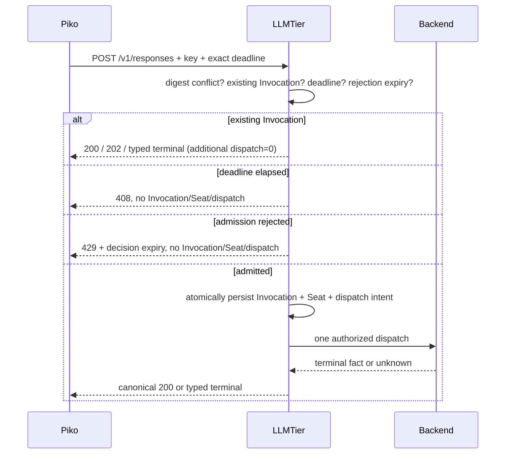

<!-- STD_DOCUMENT_COVER_BEGIN -->
# LLMTier V0.3 Cross-System Finalization Package

| 文档字段 | 值 |
|---|---|
| Document ID | llmtier-v0.3-cross-system-finalization |
| Document Version | 0.3.0-rc.4 |
| Status | In Review |
| Project | LLMTier |
| Authority | LLMTier |
| Document Owner | LLMTier |
| Authors | llmtier |
| Reviewer | Piko, Slinky |
| Approver | LLMTier |
| Approval Date | — |
| Created Date | 2026-09-16 |
| Last Modified Date | 2026-09-16 |
| Template Version | `0.1.0` |
| Template ID | contracts.specification |
| Template Conformance | tailored |
| Tailoring Reference | std-tailoring |
| Migration Map Reference | none |
| Repository | corezilla/LLMTier |
| Canonical Path | docs/60_interfaces/contracts/llmtier-v0.3-cross-system-finalization.md |
| Supersedes | none |

> Reviewer、Approver、Approval Date 和 Release Tag 在进入相应状态时填写。Git commit/tag 是
> 外部不可变证据；不要在文档内容中伪造包含自身的 commit hash。
<!-- STD_DOCUMENT_COVER_END -->

## 1. 定型范围与机器权威

本包关闭 Slinky `S-20260916-191ab7c8184c` 要求的 LLMTier 跨系统设计。唯一机器权威是
`interfaces/openapi/llmtier-v0.3.openapi.json` 与
`interfaces/compatibility/compatibility-manifest-v0.3.json` 的 `0.3-finalization-candidate.4`；本文只给出
字段生产方、消费用途和不可由 Schema 单独表达的恢复语义。fixtures 是正负 oracle，不替代 OpenAPI。

V0.3 唯一 surface 为 Responses non-stream、Embeddings non-stream、Models、Responses recovery、Observation
和 Management。Chat、SSE、streaming、跨等级 fallback、alias、Provider-direct path 均不存在。所有 runtime
activation 继续为 false。

### 1.1 主流无状态网关边界

Piko/Knowledge 为每个 logical model call 提交完整当前 input。LLMTier 不拥有 Agent Session/Conversation，
不保存、拼接或压缩 Agent 历史，不执行工具，也不创建、匹配、迁移或暴露 backend KV cache identity。
message/tool-call/tool-result/provider-continuation 只作为冻结请求/响应字段校验和透传。Invocation、幂等记录与
结果保留只解决单次调用的准入、计量和响应丢失恢复；不得承载 Agent 上下文或恢复 conversation。

## 2. Operation、鉴权与公共字段

| Operation | Producer / consumer | 鉴权与 identity scope | 幂等、恢复与保留 |
|---|---|---|---|
| `POST /v1/responses` | Piko → LLMTier | authenticated `client_id` + authorized canonical `X-Tier-Source-ID`；Instance 仅观察 | namespace + `Idempotency-Key` + canonical digest；D=24h；active 到 terminal；terminal view/response/digest 至少168h |
| `GET /v1/invocations/{id}` | LLMTier → Piko | 原 client+source recovery scope | 只恢复原 Invocation；不得 admission/dispatch |
| `GET /v1/responses/{id}` | LLMTier → Piko | 原 client+source recovery scope | 只返回同一 canonical `ResponsesResponse` |
| `POST /v1/embeddings` | Slinky Knowledge → LLMTier | 与 Data Plane 相同；独立 endpoint namespace | 只用原 POST 恢复；D=24h；resolved terminal 后 result/digest 至少168h；无 Responses GET |
| `GET /v1/models[/id]` | LLMTier Registry → Piko/Knowledge | Client-visible Registry projection | read-only；exact-case ID；representation-specific ETag |
| `/tier/v1/*` | LLMTier → Slinky | Client-scoped；可聚合已授权 Source；filter 不是新鉴权 namespace | read-only；snapshot/record validity 与各自 ETag |

| 字段 | 权威来源 / 消费用途 | 类型、required/null/default | digest、版本、重放/重启行为 |
|---|---|---|---|
| `Authorization` | LLMTier credential binding；确定 canonical client | required bearer；不进入普通 DTO | 不进入 request semantic digest；凭据轮换不改变 logical request |
| `Idempotency-Key` | caller 产生；LLMTier namespace lookup | POST required，1..255 bytes；无 default | namespace identity；重启、无 ID 重放逐字节复用；换 key 不是恢复 |
| `X-Tier-Client-Request-ID` | caller correlation；日志/观察定位 | required，1..255 | 不替代 idempotency key；按 OpenAPI canonical digest policy处理 |
| `X-Tier-Source-ID` | caller 提供、LLMTier 授权；恢复 scope | required，1..255，exact authorized value | namespace/digest identity；不得在重放时改变 |
| `X-Tier-Source-Instance-ID` | caller 可选 runtime label；观察/audit | optional，缺失或 1..255；无 default | correlation only；不进入 digest/namespace；不建立 Session/Conversation/KV 或重启恢复隔离边界 |
| `X-Tier-Deadline-At` | Piko/Knowledge 首次请求产生；LLMTier deadline | required；RFC3339 UTC exactly `YYYY-MM-DDTHH:mm:ss.SSSZ` | semantic digest；重试/重启 byte-identical；同 key 改值=409；不得推进 |
| `Location` | LLMTier Responses Invocation reference | Invocation 已建立的 Responses 202/terminal required | 只为 `/v1/invocations/{id}`；Embeddings 禁止返回 |
| `X-Tier-Invocation-ID` | LLMTier durable ledger identity | Invocation 已建立后 required | Responses 可 query；Embeddings 仅 correlation/POST lookup |
| `Retry-After` | LLMTier admission/active observation | integer seconds >=0 | 建议，不是 reservation；不会改变原 deadline |
| `ETag` / `If-None-Match` | 各 endpoint representation | endpoint 声明处使用 | 仅校验本 DTO；不得要求不同 DTO ETag 字面相同 |

`source_instance_id` 无独立生命周期或 policy authority。candidate.4 删除 SourceInstance Management paths、
schemas、`enabled` 与 `capacity_policy`；该标签不能授权或阻断调用、选择隔离容量、改变 quota、公平调度、
digest、幂等 namespace 或 recovery scope。Observation 中 required-but-nullable 的字段用于区分“本次未提供”
与“不合约地缺字段”；有值过滤只是已授权结果集内的相关性过滤，不形成新的授权边界。

## 3. Responses、tool loop 与恢复逐字段表

OpenAPI 的 `required`、nullability、enum、range 与 `additionalProperties:false` 是最终字段约束。下表逐一列出
跨方可见字段；未出现的字段必须以 `unknown_parameter`/typed 400 fail closed。

| Schema.field | 生产方 / 消费用途 | 值与行为 |
|---|---|---|
| `ResponsesRequest.model` | Piko 选取 Registry exact ID；LLMTier routing | required exact-case；进入 digest；禁止 alias/fallback |
| `.input` | Piko 生成的当次完整 input；LLMTier 只做 contract/capability validation 与 provider normalization | required string 或非空 `ResponseInputItem[]`；完整进入 digest；LLMTier 不补历史 |
| `.instructions`, `.temperature`, `.top_p`, `.max_output_tokens`, `.reasoning` | Piko inference semantics | optional、无隐式跨 provider 降级；存在时进入 digest |
| `.tools`, `.tool_choice`, `.parallel_tool_calls` | Piko 声明工具；模型只输出 tool call | optional；LLMTier 不执行工具；存在时进入 digest |
| `.text`, `.store`, `.metadata`, `.stream` | response format/storage/correlation/mode | `stream` 只能 false；metadata 最多16项且 key/value 64/512 UTF-8 bytes；均按 canonicalizer 入 digest |
| `ResponseMessageInput.type/role/content` | Piko 从本地 Agent history 组装进当次 input | type=`message`；role user/assistant/system/developer；content 为 text/image parts；required；不形成 Tier 会话 |
| `ResponseFunctionCallInput.type/call_id/name/arguments` | Piko 回放 assistant tool call | required；arguments 为 JSON string；call_id 关联 result |
| `ResponseFunctionOutputInput.type/call_id/output` | Piko 执行工具后回传 | required；LLMTier 仅传模型，不解释/执行 tool |
| `FunctionTool.type/name/description/parameters/strict` | Piko tool schema | type=`function`；name/parameters required；全部进入 digest |
| `ResponseTextConfig.format/verbosity`, `ReasoningConfig.effort/summary` | Piko 请求；LLMTier capability validation | optional；不支持值 typed reject，不静默删除 |
| `ResponsesResponse.id/object/created_at/status/model` | LLMTier canonical response | required；status 是 OpenAI response status，不是 InvocationStatus |
| `.output` | LLMTier 模型输出；Piko 消费 | required；message 或 function_call strict union |
| `.usage/.error/.metadata` | LLMTier accounting/error/correlation | usage/error required nullable；metadata optional；replay/retrieve 同体 |
| `ResponseOutputMessage.id/type/role/status/content` | LLMTier | required；Piko 将 message 交 Agent |
| `ResponseOutputFunctionCall.id/type/call_id/name/arguments/status` | LLMTier | required；Piko 执行工具并用相同 call_id 发送 output |
| `TokenUsage.input_tokens/output_tokens/total_tokens` | LLMTier metering | non-negative integers；未知时整个 usage=null，不填0 |
| `InvocationAccepted.object/invocation_id/status/record_version` | LLMTier active replay | required；status 仅 Pending/Queued/Running |
| `.recovery_url/recovery_ready/recovery_disposition/retry_after_ms` | LLMTier → Piko recovery | required；active 为 false/wait；只 query 原义务 |
| `.request_deadline_at/.catalog_deadline_at/.effective_deadline_at` | caller/catalog/LLMTier min | required RFC3339；effective=min(request,catalog) |
| `.deadline_status/.deadline_exceeded_at` | LLMTier 永久 deadline fact | required；事实一旦 Exceeded 不因晚到成功消失 |
| `InvocationView.invocation_id/client_request_id/source_id/source_instance_id/endpoint/service_level_id` | ledger identity | required；endpoint 固定 `/v1/responses`；原 scope 授权 |
| `.status/record_version/recovery_ready/recovery_disposition/retry_after_ms/response_ref` | LLMTier recovery state | terminal status Succeeded/Failed/Cancelled/UnknownOutcome；nullable 按 Schema |
| `.usage/.usage_status/.cost/.error` | metering/cost/terminal evidence | unknown/partial 不填0；CostEvidence 规则见§5 |
| `.request_deadline_at/.catalog_deadline_at/.effective_deadline_at/.deadline_status/.deadline_exceeded_at` | deadline audit | 永久保留已发生 deadline fact |
| `.backend_execution_status/.capacity_hold_status/.release_evidence_type/.release_evidence_at` | LLMTier execution/Seat authority | status label 或 cancel accepted 不是 release 证据 |
| `.client_outcome/.created_at/.updated_at/.completed_at/.retained_until` | caller outcome 与 retention | 晚到 success 可 canonical 200，但 deadline fact 保留；completed_at nullable |
| `ErrorDetail.type/code/message/param/retryable/invocation_id` | LLMTier typed failure | required 依 Schema；Piko 按 code/retryable，不按 5xx 猜测 |
| `.admission_decision_id/.decision_created_at/.decision_expires_at/.decision_record_version/.retry_after_ms/.request_deadline_at` | rejection/deadline evidence | rejection expiry 不是 digest/tombstone expiry |

### 3.1 固定优先级与状态矩阵

处理顺序固定为：digest conflict → existing Invocation recovery → request deadline → cached rejection expiry/new
admission。无 Invocation 且 deadline 已到返回408，优先于缓存429；已有 Invocation 始终恢复原义务。

| 情况 | HTTP/body | dispatch/Seat | Piko 行为 |
|---|---|---|---|
| 首次成功 | 200 canonical `ResponsesResponse` | exactly one authorized dispatch；有停止证据才 release | 消费 response/tool call |
| active duplicate | 202 `InvocationAccepted` + Location/ID/Retry-After | additional dispatch=0；Seat Held | wait/query/replay original |
| pre-admission capacity/quota/readiness reject | 429 `AdmissionRejectedEnvelope`，无 Location/Invocation | dispatch=0、Seat=0 | deadline 前同 key/digest/header；expiry 后 CAS 单赢家重评 |
| deadline before any Invocation | 408 `RequestDeadlineExpiredEnvelope` | dispatch=0、Seat=0 | 终止本次 model obligation；不换 key |
| Failed / UnknownOutcome | 502 / 503 `TerminalErrorEnvelope` | release only by durable evidence；Unknown Held | 不 blind redispatch |
| Cancelled replay | 409 `InvocationCancelledEnvelope` + real Invocation headers | only durable stop/release evidence releases Seat | 不 blind redispatch |
| same key / different digest before Invocation | 409 `IdempotencyConflictEnvelope`；无 Invocation/Location headers | dispatch=0、Seat=0 | 不换 key 绕过 conflict |
| header/body response 全丢失 | 原 POST、原 key/digest/header | 若已有 Invocation只 recovery；未到服务可首次 admission | 不创建第二 logical call |
| caller deadline 后 backend 晚到成功 | 200 canonical body 可恢复；Invocation 保留 Exceeded fact | backend terminal evidence 后 release | 保存 outcome/usage；Piko 决定 Run，不由 Tier 改写 |

## 4. Registry 与 Models 字段

| Schema.field | Authority / consumer | 规则 |
|---|---|---|
| `Model.id/object/created/owned_by` | Registry → stock SDK/Piko | exact ID；object=model；owned_by=llmtier |
| `ModelList.object/data` | Registry → consumer startup validation | object=list；data 为 Model[]；ETag 仅本 representation |
| `ServiceLevelView.service_level_id/kind/status/contract_version/slo_version` | Registry → Slinky | exact ID；kind generation/embedding；真实 availability |
| `.capabilities/.context/.modalities` | Registry → Piko/Slinky compatibility | 完整 capability/context/modalities；不支持字段 fail closed |
| `.capacity_group_ids/.scheduling_domain_id` | Registry/capacity → Slinky | 定位共享约束和公平域，不暴露 provider account |
| `.compatibility_manifest_ref/.effective_at/.valid_until` | Registry → startup validation | ref/version validity；过期 fail closed |
| `ServiceLevelCapabilities.responses/embeddings/tool_calling/structured_output` | Registry | booleans；同一 Registry 驱动 validation/admission/Observation |
| `ServiceLevelContext.max_input_tokens/max_output_tokens` | Registry | non-negative limits；超限 typed reject |
| `ServiceLevelModalities.input/output` | Registry | string arrays；不能通过 fallback 扩大 |

## 5. Observation 字段与 Slinky 消费

| Schema.field | Authority / Slinky用途 | Unknown、版本与聚合规则 |
|---|---|---|
| `ReadinessView.client_id/status/tier_instance_id/tier_version` | LLMTier / instance readiness | Client scoped；Ready/Degraded/NotReady |
| `.data_plane_ready/.observation_api_ready/.visible_service_levels` | LLMTier / startup gate | required；visible IDs exact-case |
| `.snapshot_version/.configuration_version/.inventory_version` | LLMTier / stale detection | 单调/opaque version，各自职责不互换 |
| `.observed_at/.next_refresh_at/.valid_until/.blocking_reason_codes` | LLMTier / refresh与fail-close | 到期或 blocker 不得推断 Ready |
| `CapacitySnapshot.snapshot_id/snapshot_version/configuration_version/inventory_version/capacity_version` | capacity authority / correlation | snapshot validity；不等于 Registry ETag |
| `.client_id/.source_id/.unit/.observed_at/.valid_until` | authorization + capacity authority | unit 唯一 `concurrent_invocation`；过期不可新 dispatch |
| `.capacity_groups/.service_levels` | LLMTier / Slinky N-Seat规划 | 发布全 facts；Slinky保留项目需求和组合计算 authority |
| `CapacityGroup.capacity_group_id/member_service_level_ids/membership_mode/unit` | Registry/capacity | shared/overlap membership；gap 不相加 |
| `.committed_concurrency/.in_flight_committed/.available_committed_concurrency` | capacity ledger | non-negative；Unknown 由 constraint fact表达，不填0 |
| `ServiceLevelCapacity.service_level_id/status/capacity_group_ids` | capacity projection | exact ID；Available/Pressured/Unavailable |
| `.direct_committed_limit/.direct_available_committed/.burst_concurrency` | capacity authority | committed Seat 与 burst 分离 |
| `.constraint_facts/.blocking_constraints/.blocking_reason_codes` | authority facts / blocker subset | blocker 是 Known shortfall>0 或 Unknown；可等于全 facts |
| `.quota_constraints/.request_quota_remaining` | quota authority | request unit，不换算 concurrency；null 阻断新 committed Seat |
| `.in_flight_requests/.queued_requests/.queue_estimate_status` | ledger/scheduler | queue observation；Unknown保持 null |
| `.estimated_queue_wait_ms/.queue_estimated_at/.queue_estimate_valid_until` | scheduler estimate | 估计非 reservation/SLA；过期或Unknown不得使用 |
| `CapacityConstraintFact.constraint_id/constraint_type/status/unit` | direct/group authority | 完整约束 identity；Known/Unknown |
| `.available/.required_for_next_seat/.shortfall_for_next_seat/.is_blocking/.reason_code` | one-new-Seat基准 | Unknown 数值 null、blocking=true、capacity_unknown |
| `QuotaConstraintFact.constraint_id/status/unit/remaining/reason_code` | quota authority | Unknown remaining=null；fail closed |
| `UsageSummaryPage.client_id/from/to/interval/group_by/data/page` | ledger / Slinky趋势与预警 | 只聚合授权 scope；cursor/page 稳定 |
| `UsageBucket.interval_start/interval_end/dimensions/invocation_count/input_tokens/output_tokens/usage_status/cost` | ledger/metering | Unknown/Partial 数值不补0 |
| `UsageDimensions.source_id/source_instance_id/service_level_id/endpoint/status` | ledger | group/filter；Source filter不是鉴权namespace |
| `CostEvidence.cost_status/amount_decimal/currency/pricing_catalog_version/cost_source/priced_at` | pricing/metering | amount非负 decimal(20,12)；Known/Estimated/Partial/Unknown |
| `.covered_components/.missing_components` | metering | Partial amount仅覆盖小计；非总额；Estimated不伪装实付 |
| `CompatibilityView.manifest_version/overall_contract_status/overall_runtime_activation/endpoints/effective_at` | manifest authority | candidate + activation=false；consumer startup gate |
| `CompatibilityEndpoint.method/path/support/supported_fields/unsupported_fields/streaming/response_schema_version/error_contract_version/sdk_matrix` | manifest | endpoint精确兼容面；不产生 fallback |
| `PageMeta.next_cursor/has_more` | list owner | next_cursor nullable；不得跨版本猜 cursor |

公平调度固定为 Client entitlement outer weighted round，再在该 Client 内部按 Source/Service-Level eligible lane
round-robin；新增 Source 不能放大 Client 总份额。shared Capacity Group 跨 scheduling domain 先由 group arbiter 按
同一 Client weight 选择 Client，再进入 domain/lane。只有 active set 与 weight 不变、持续 eligible、每次选择时
all-constraints 成立且 Seat 持续释放时，eligible Client 才在一个完整 outer round 内至少得到一次 dispatch
opportunity；不承诺 wall-clock 或成功服务。

## 6. Embeddings POST-local 完整契约

| Schema.field | Authority / consumer | 行为 |
|---|---|---|
| `EmbeddingRequest.model/input/encoding_format/dimensions/user` | Knowledge → LLMTier | model/input required；float/base64；全部 semantic fields 入 digest |
| `EmbeddingInput` | Knowledge | string 或 non-empty string/token arrays，exact Schema |
| `EmbeddingResponse.object/data/model/usage` | LLMTier → Knowledge | 标准 success body，不混 recovery wrapper |
| `EmbeddingItem.object/index/embedding` | LLMTier | embedding 为 float[] 或 base64 string，与 request format一致 |
| `EmbeddingUsage.prompt_tokens/total_tokens` | LLMTier metering | non-negative；成功 required |
| `EmbeddingInvocationAccepted.object/invocation_id/status/record_version/retry_after_ms` | LLMTier active duplicate | 202；status Pending/Queued/Running；无 Location |
| `.request_deadline_at/.catalog_deadline_at/.effective_deadline_at/.deadline_status/.deadline_exceeded_at` | deadline authority | 与 Responses 相同固定格式/事实语义 |

| 状态 | HTTP/body/headers | 保留与恢复 |
|---|---|---|
| success/replay | 200 `EmbeddingResponse` + Invocation ID | original POST；additional dispatch=0 |
| active | 202 `EmbeddingInvocationAccepted` + ID/Retry-After；无 Location | same POST/key/digest/header |
| Failed/UnknownOutcome | 502/503 `TerminalErrorEnvelope` + ID | retryable=false；Unknown不盲重派、不自动过期 |
| Cancelled | 409 `InvocationCancelledEnvelope` + ID | retryable=false；无 Responses Location |
| same key / different digest before Invocation | 409 `IdempotencyConflictEnvelope`；无 ID/Location | retryable=false；不得伪造 Invocation |
| response headers/body lost | original POST，原 key/digest/header | 有记录恢复；未到服务且deadline未过可首次 admission |
| resolved terminal guarantee expired while tombstone proves old key | 410 `IdempotencyRecordExpiredEnvelope` | old key 禁止新 logical invocation；无 Responses GET |

冻结窗口：caller automatic recovery D=24h；active/Unknown 义务保留到 provable resolved terminal；从
`resolved_terminal_at` 起 canonical Embedding result 与 content-free digest/tombstone 至少168h。隐私配置不得
缩短这些下限；不满足时配置校验失败并阻断 activation。168h 不是 Unknown 自动删除计时器。

## 7. 旧接口一次性退役版本

V0.3 activation cutover 的精确版本为 `0.3.0`。在该版本，旧 embedded Tier、Role routing、Agent backend、
Provider-direct generation、`/health`、`/runtime`、`/stats` consumer surface、Chat/SSE/streaming、header/path
alias 和旧 standalone Data Plane schema 一次性从 supported contract 删除；无 grace dual-owner、translation
或 fallback。代码删除扫描与真实部署证据是 activation gate，不是新的设计分支。

## 8. A/B/C 分栏与剩余项

| 类别 | 本轮状态 | 内容 |
|---|---|---|
| A 跨系统设计 | CLOSED BY CANDIDATE | endpoint/header/schema/error、deadline/digest、tool loop、recovery、capacity/usage/cost/fairness、Embeddings窗口与退役版本均有唯一候选；等待 Piko/Slinky 对精确版本签署 |
| B LLMTier内部下游设计 | 后续内部工作 | durable store物理模型、provider adapter、scheduler数据结构、Admin UI页面、部署/HA/密钥后端；不得改变A |
| C 联调验证 | NOT RUN | Piko/Knowledge exact fixture capture、crash/lost response、retention clock、fairness/isolation、legacy removal、production wiring |

偏离标准同步 OpenAI-compatible 调用的 V0.3 扩展只有 exact Service Level、服务端 admission/capacity、统一
usage/cost 和调用级丢响应恢复。其特殊需求分别是隐藏物理 Provider、保护有限并发、统一运营证据及避免
transport failure 后重复 backend dispatch/计费；最小兼容成本是 exact model ID、429/202/typed terminal 与
两个 Responses recovery GET。它们不授权 Session、KV、项目字段、调用方管理页面或第二 inference path。

A 类没有“实现时再确认”的字段。Reviewer 如发现跨方字段冲突，必须针对本候选提出一个替代值；不能把设计选择
转移到 C。C 未运行只阻止 `runtime_activation=true`，不阻止设计候选签署。

## 9. Validation 与 immutable evidence

正负 fixtures 位于 `interfaces/vectors/v0.3/`，覆盖 200/202/400/408/409/410/429/502/503、无ID重放、
deadline优先级、Unknown、capacity Unknown、费用、deferred surface 与 authorization。静态测试验证 OpenAPI ref、
required/additionalProperties、single authority 和跨文件常量。最终 review commit、文件 SHA-256、验证命令与结果
通过 Matrix review packet 发布；本文不自称 production implementation 或 runtime evidence。
